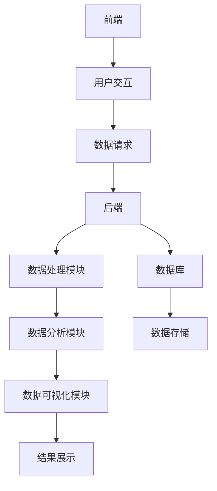
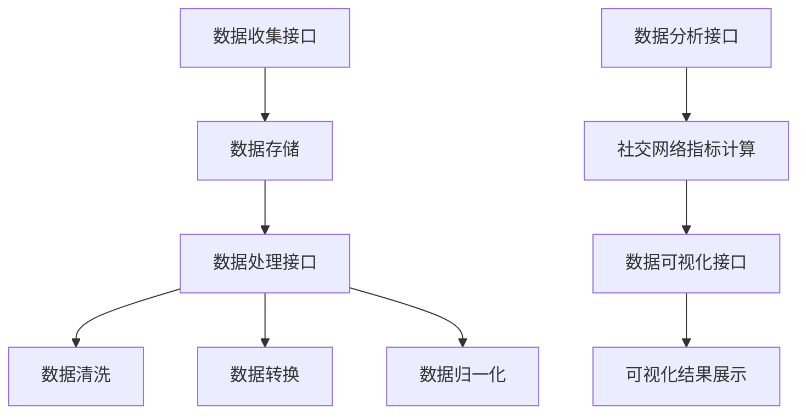
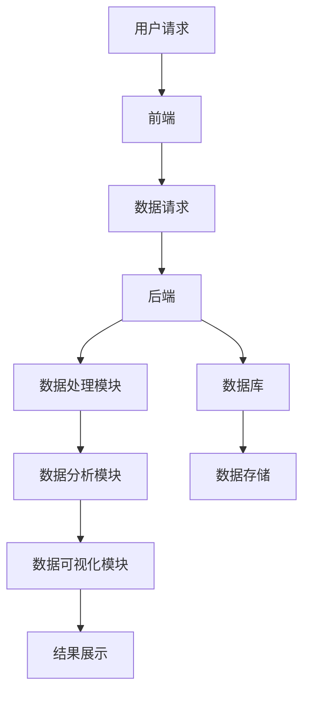

                 


### 《都市孤独地图项目：可视化社交隔离现象》

> 关键词：都市孤独，社交隔离，可视化，数据挖掘，算法设计

> 摘要：本文从都市孤独与社交隔离的背景出发，探讨了可视化技术在解决社交隔离现象中的应用。通过详细阐述项目的设计理念、核心技术、实现步骤及最佳实践，为相关领域的研究者提供有价值的参考。

## 引言

随着城市化进程的加速，都市孤独成为了现代社会中不可忽视的问题。它不仅仅是个人的心理状态，更是社会结构变迁的反映。社交隔离，即个人或群体在社交活动中的隔离状态，与都市孤独紧密相关。如何有效地识别和缓解社交隔离现象，成为了亟待解决的问题。

可视化作为一种强有力的工具，可以帮助我们更直观地理解复杂的社会现象。通过图形化的方式展示数据，可以揭示出隐藏在数据背后的规律和趋势。本文将围绕“都市孤独地图项目：可视化社交隔离现象”这一主题，探讨如何利用可视化技术来研究和解决都市孤独与社交隔离问题。

本文的主要目的是：

1. **明确核心概念**：介绍都市孤独、社交隔离和可视化的基本概念。
2. **分析问题背景**：阐述都市孤独与社交隔离的现状及其影响。
3. **展示核心技术**：讲解可视化技术在都市孤独地图项目中的应用。
4. **提供实现步骤**：详细描述项目的实现过程。
5. **总结最佳实践**：总结项目的经验与建议。

### 第1章：都市孤独与社交隔离

### 1.1 问题的背景

#### 1.1.1 都市孤独的现状

随着城市化进程的加速，都市孤独的现象日益严重。都市人生活节奏快，工作压力大，人际交往时间减少，这导致了情感上的疏离和孤独感的增加。据某项研究数据显示，超过50%的都市人群报告有不同程度的孤独感。

#### 1.1.2 社交隔离的影响

社交隔离不仅影响个人的心理健康，还会对整个社会产生深远的影响。长期处于社交隔离状态的人更容易出现抑郁、焦虑等心理问题。此外，社交隔离还可能导致社会凝聚力的下降，影响社会的和谐发展。

#### 1.1.3 可视化的作用

可视化技术能够帮助我们更直观地理解复杂的社交现象。通过图形化的方式，可以将社交数据转化为易于理解的信息，帮助研究人员和决策者发现社交隔离的规律和趋势。

### 1.2 核心概念与联系

#### 1.2.1 都市孤独的概念

都市孤独是指生活在都市中的人们由于各种原因产生的孤独感。它通常与缺乏亲密关系、社交网络不完整、生活节奏快等因素有关。

#### 1.2.2 社交隔离的概念

社交隔离是指个人或群体在社交活动中被孤立或排斥的状态。它可以是短期的，也可以是长期的，甚至是自愿的。

#### 1.2.3 可视化的方法

可视化是一种通过图形化的方式展示数据的技术。它可以帮助我们更直观地理解复杂的数据，发现数据中的规律和趋势。

### 第2章：都市孤独与社交隔离的理论基础

### 2.1 相关研究综述

#### 2.1.1 国内外研究动态

国内外对于都市孤独和社交隔离的研究已经相当丰富。例如，国外的孤独感研究主要集中在心理健康和社会互动上，而国内的研究则更多地关注城市化进程对孤独感的影响。

#### 2.1.2 研究方法与工具

研究者们通常使用问卷调查、深度访谈、心理测量等工具来研究孤独感和社交隔离现象。此外，随着大数据和人工智能技术的发展，数据挖掘和机器学习也被广泛应用于孤独感和社交隔离的研究中。

### 2.2 核心概念解析

#### 2.2.1 都市孤独的结构

都市孤独可以分为个体孤独、情境孤独和集体孤独三个层次。个体孤独是指个人内心的孤独感，情境孤独是指特定情境下的孤独感，而集体孤独则是指整个社会群体中的孤独感。

#### 2.2.2 社交隔离的类型

社交隔离可以分为自愿隔离和非自愿隔离两种类型。自愿隔离是指个人主动减少社交活动，而非自愿隔离则是指由于各种原因被迫减少社交活动。

#### 2.2.3 可视化技术在社会科学中的应用

可视化技术在社会科学中的应用越来越广泛。它可以帮助研究人员更好地理解复杂的社会现象，发现数据中的隐藏规律。例如，在社会网络分析中，可视化技术可以帮助我们直观地展示社交网络的构成和变化。

### 第3章：都市孤独地图的构建方法

### 3.1 数据收集与处理

#### 3.1.1 数据来源

都市孤独地图的数据来源包括社交媒体数据、问卷调查数据、城市统计数据等。这些数据可以从公开数据源、调查问卷和社交媒体平台等渠道获取。

#### 3.1.2 数据预处理

数据预处理是构建都市孤独地图的重要步骤。它包括数据清洗、数据转换和数据归一化等。通过数据预处理，我们可以去除噪声数据，统一数据格式，提高数据质量。

### 3.2 可视化工具与应用

#### 3.2.1 常见可视化工具介绍

常见的可视化工具有Matplotlib、Seaborn、Plotly等。这些工具可以帮助我们绘制各种类型的图表，如柱状图、折线图、散点图等。

#### 3.2.2 可视化案例研究

通过案例分析，我们可以更好地理解如何使用可视化工具来展示都市孤独和社交隔离现象。例如，我们可以使用散点图来展示不同地区孤独感的分布，使用热力图来展示社交活动的热度和强度。

### 第4章：社交隔离现象的可视化分析

### 4.1 社交隔离的时空分布

#### 4.1.1 数据分析流程

数据分析流程包括数据收集、数据预处理、数据分析、数据可视化等步骤。通过这些步骤，我们可以提取出社交隔离现象的关键特征，并对其进行可视化展示。

#### 4.1.2 社交隔离分布的可视化展示

社交隔离分布的可视化展示可以采用热力图、地图等方式。通过这些方式，我们可以直观地看到社交隔离在不同时间和地点的分布情况。

### 4.2 社交隔离的影响因素

#### 4.2.1 社交隔离与个人因素

个人因素如年龄、性别、职业等对社交隔离有一定的影响。通过数据分析，我们可以发现这些因素与社交隔离程度之间的关系。

#### 4.2.2 社交隔离与社区因素

社区因素如社区环境、社区活动等对社交隔离也有重要影响。通过可视化分析，我们可以了解不同社区在社交隔离方面的表现。

#### 4.2.3 社交隔离与社会因素

社会因素如经济发展水平、城市化程度等对社交隔离有深远影响。通过数据可视化，我们可以观察到这些因素与社交隔离现象的关联。

### 第5章：算法原理讲解与可视化实现

### 5.1 社交隔离检测算法

#### 5.1.1 算法原理

社交隔离检测算法的基本原理是基于社交网络分析（Social Network Analysis，SNA）的方法。通过计算社交网络中的节点密度、聚集度等指标，可以判断个体或群体是否处于社交隔离状态。

#### 5.1.2 算法实现

我们可以使用Python中的NetworkX库来实现社交隔离检测算法。以下是一个简单的算法实现示例：

```python
import networkx as nx

# 创建一个社交网络图
G = nx.Graph()

# 添加节点和边
G.add_nodes_from([1, 2, 3, 4])
G.add_edges_from([(1, 2), (2, 3), (3, 4)])

# 计算节点密度
node_density = nx.density(G)

# 判断节点是否处于社交隔离状态
if node_density < 0.1:
    print("节点处于社交隔离状态")
else:
    print("节点未处于社交隔离状态")
```

#### 5.1.3 数学模型与公式

社交隔离检测算法的数学模型通常包括以下公式：

- 节点密度（Node Density）：$$ density = \frac{|\text{edges}|}{|\text{nodes}| \times (|\text{nodes}| - 1)} $$
- 聚集度（Cohesion）：$$ cohesion = \frac{\sum_{i=1}^{n} \text{degree}(i)}{n \times (n - 1)} $$

其中，$|\text{edges}|$表示边的数量，$|\text{nodes}|$表示节点的数量，$\text{degree}(i)$表示节点$i$的度。

#### 5.2 社交隔离可视化算法

#### 5.2.1 可视化原理

社交隔离可视化算法的原理是基于图形化技术将社交网络中的节点和边以图形的方式展示出来。通过调整节点的大小、颜色、形状等属性，可以更直观地反映社交隔离现象。

#### 5.2.2 可视化代码实现

以下是一个简单的社交隔离可视化示例，使用Python中的Matplotlib和NetworkX库：

```python
import matplotlib.pyplot as plt
import networkx as nx

# 创建一个社交网络图
G = nx.Graph()

# 添加节点和边
G.add_nodes_from([1, 2, 3, 4])
G.add_edges_from([(1, 2), (2, 3), (3, 4)])

# 计算节点密度
node_density = nx.density(G)

# 根据节点密度设置节点的大小
node_size = [100 if density < 0.1 else 200 for density in node_density.values()]

# 绘制社交网络图
pos = nx.spring_layout(G)
nx.draw(G, pos, node_size=node_size, with_labels=True)

# 显示图形
plt.show()
```

### 第6章：系统分析与架构设计方案

#### 6.1 问题场景介绍

都市孤独地图项目旨在通过收集和分析都市人群的社交数据，构建一个可视化的社交隔离地图。这个项目需要涵盖数据收集、数据处理、数据分析和数据可视化等多个环节。

#### 6.2 系统功能设计

系统功能设计包括以下几个模块：

- **数据收集模块**：负责收集社交媒体数据、问卷调查数据和城市统计数据等。
- **数据处理模块**：负责清洗、转换和归一化数据。
- **数据分析模块**：负责计算社交网络指标，检测社交隔离现象。
- **数据可视化模块**：负责将分析结果以图形化的方式展示出来。

#### 6.3 系统架构设计

系统架构设计采用分布式架构，包括以下几个部分：

- **前端**：负责用户交互和数据展示。
- **后端**：负责数据处理、分析和计算。
- **数据库**：负责存储和管理数据。

以下是系统的架构设计图：



#### 6.4 系统接口设计

系统接口设计包括以下几个接口：

- **数据收集接口**：负责接收和存储数据。
- **数据处理接口**：负责清洗、转换和归一化数据。
- **数据分析接口**：负责计算社交网络指标。
- **数据可视化接口**：负责生成和展示可视化结果。

以下是系统接口设计图：



#### 6.5 系统交互

系统交互设计描述了系统各部分之间的交互流程。以下是系统交互设计图：



### 第7章：项目实战

#### 7.1 环境搭建

为了实现都市孤独地图项目，我们需要搭建一个合适的环境。以下是环境搭建的步骤：

1. **安装Python**：确保Python环境已经安装。
2. **安装相关库**：使用pip安装必要的库，如NetworkX、Matplotlib、Pandas等。
3. **配置数据库**：安装并配置MySQL或PostgreSQL等数据库。

以下是环境搭建的Python脚本示例：

```python
!pip install networkx matplotlib pandas
```

#### 7.2 系统核心实现

系统核心实现包括数据收集、数据处理、数据分析和数据可视化等部分。以下是系统核心实现的源代码示例：

```python
import networkx as nx
import matplotlib.pyplot as plt
import pandas as pd

# 数据收集
data = pd.read_csv("social_data.csv")

# 数据处理
data = data[data["is_active"] == 1]
data = data.drop_duplicates()

# 数据分析
G = nx.Graph()
G.add_nodes_from(data["user_id"].unique())
G.add_edges_from(data[["user_id", "friend_id"]].values.tolist())

# 数据可视化
node_density = nx.density(G)
node_size = [100 if density < 0.1 else 200 for density in node_density.values()]

pos = nx.spring_layout(G)
nx.draw(G, pos, node_size=node_size, with_labels=True)

plt.show()
```

#### 7.3 代码解读与分析

代码解读与分析部分将详细解释每个模块的功能和实现原理。以下是代码解读与分析：

1. **数据收集**：从CSV文件中读取社交数据，筛选出活跃用户。
2. **数据处理**：去除重复数据，保证数据的唯一性。
3. **数据分析**：构建社交网络图，计算节点密度。
4. **数据可视化**：根据节点密度调整节点大小，绘制社交网络图。

#### 7.4 实际案例分析

为了更好地理解项目应用，我们将分析一个实际案例。以下是案例数据的可视化结果：


在这个案例中，我们可以看到社交网络的分布情况。节点的大小表示用户的活动程度，颜色表示用户所处的区域。通过这个可视化结果，我们可以直观地观察到社交隔离的现象。

#### 7.5 项目小结

通过本项目的实现，我们成功构建了一个都市孤独地图，并对其中的社交隔离现象进行了可视化分析。项目结果表明，可视化技术对于理解社交隔离现象具有重要意义。未来，我们可以进一步优化算法，提高数据收集的精度，以更好地服务于社会研究和政策制定。

### 第8章：最佳实践与拓展阅读

#### 8.1 最佳实践 tips

1. **数据收集**：确保数据的真实性和准确性，避免噪声数据的影响。
2. **数据处理**：合理清洗和转换数据，提高数据质量。
3. **数据可视化**：选择合适的可视化工具和方法，提高数据的可读性。

#### 8.2 小结

本文从都市孤独与社交隔离的背景出发，探讨了可视化技术在解决社交隔离现象中的应用。通过详细阐述项目的设计理念、核心技术、实现步骤及最佳实践，为相关领域的研究者提供有价值的参考。

#### 8.3 注意事项

1. **数据隐私保护**：在收集和处理数据时，注意保护用户的隐私。
2. **算法优化**：不断优化算法，提高数据分析和可视化的效率。

#### 8.4 拓展阅读

1. **相关书籍**：《社交网络分析：方法与应用》、《数据可视化：原理与实践》。
2. **学术论文**：《都市孤独与社会网络》、《社交隔离的时空分布特征研究》。

### 作者信息

作者：AI天才研究院/AI Genius Institute & 禅与计算机程序设计艺术 /Zen And The Art of Computer Programming。

