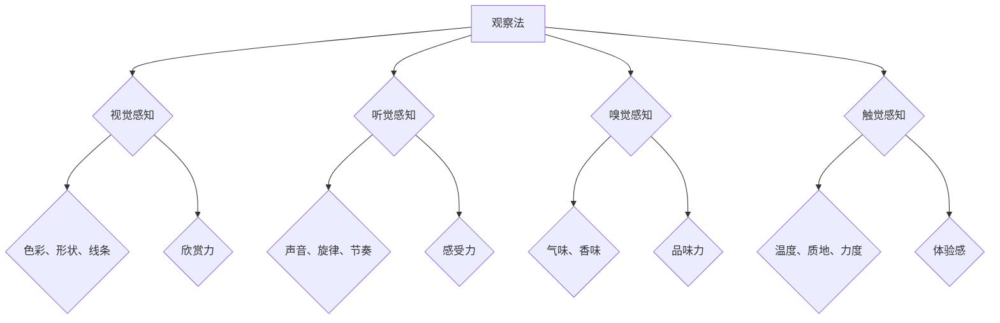

                 

# 重新发现生活之美：培养对美好的感知力

> 关键词：感知力、生活之美、培养、技术方法、系统架构

> 摘要：本文旨在探讨如何在现代社会中重新发现生活中的美好，通过培养对美好的感知力，提升人们的生活质量。文章从背景介绍、核心概念与联系、算法原理讲解、数学模型和公式、系统分析与架构设计以及项目实战等多个方面，系统性地阐述了培养美好感知力的方法和策略，为读者提供实用的指导和建议。

## 第一步：设计背景介绍章节（第1章）

### 1.1 问题的背景和意义

#### 问题描述

在快节奏的现代社会中，人们往往被工作、生活琐事和虚拟世界所包围，忽略了生活中的美好细节。这种现象导致很多人对生活缺乏热情和满足感，甚至产生心理疲劳和焦虑。

#### 问题解决

通过培养对美好的感知力，人们可以在日常生活中重新认识并发现那些被忽视的美好事物，从而提升生活质量，增强幸福感。

#### 边界与外延

美好感知力不仅涉及视觉，还包括听觉、嗅觉、触觉等多个感官。因此，从多个感官角度探讨对美好的感知，有助于全面培养感知力。

### 1.1.1 核心概念解析

#### 美好感知

美好感知是指人们对美好事物的感知能力和欣赏力。它包括对色彩、形状、声音、气味、触感等元素的敏感性。

#### 感知力

感知力是指人的感觉器官对外界信息的接收和处理能力。培养美好感知力，实际上就是提升感知力。

#### 重新发现

重新发现是指人们在日常生活中重新审视和体验那些被忽视的美好事物。这需要通过一系列方法来提升感知力和欣赏力。

### 1.2 研究现状

#### 国内外研究进展

国内外对美好感知力的研究已有不少成果。例如，心理学、神经科学等领域的研究表明，通过特定训练，人们可以提升感知力和欣赏能力。

#### 当前存在的不足和挑战

尽管已有研究，但如何在日常生活中实际应用，并持续提升美好感知力，仍是一个挑战。

### 1.2.1 研究方法与技术路线

#### 观察法

通过观察生活细节，培养对美好的感知。观察法是一种简单而有效的方法，适用于各种年龄段的人群。

#### 实验法

通过设计实验，验证美好感知力提升的方法。实验法可以量化感知力的变化，为理论研究提供数据支持。

#### 案例分析法

通过分析具体案例，总结提升感知力的有效策略。案例分析有助于发现共性和规律，为实际应用提供指导。

## 第二步：设计核心概念与联系章节（第2章）

### 2.1 核心概念

#### 美好感知力的构成要素

美好感知力包括视觉感知、听觉感知、嗅觉感知和触觉感知等四个方面。

#### 视觉感知

视觉感知是指对色彩、形状、线条等视觉元素的敏感性。视觉感知力强的人，能更好地欣赏艺术作品，感受自然之美。

#### 听觉感知

听觉感知是指对声音、旋律、节奏等的感受能力。音乐家具有较高的听觉感知力，能够准确辨别各种音符和旋律。

#### 嗅觉感知

嗅觉感知是指对气味、香味的感知能力。嗅觉感知力强的人，能更好地品味美食，享受生活中的点滴乐趣。

#### 触觉感知

触觉感知是指对温度、质地、力度等的感知能力。触觉感知力强的人，能更好地体验生活中的温暖和舒适。

#### 感知力的发展与培养

#### 早期发展

婴儿期和儿童期是感知力发展的关键时期。通过适当的教育和训练，可以提升儿童的感知力。

#### 成长期

青少年和成年人如何提升感知力。随着年龄的增长，感知力可能会下降，但通过持续训练，仍能保持对美好的感知。

#### 老年期

老年人在感知力下降时如何保持对美好的感知。老年人可以通过适度锻炼和科学的生活方式，提升感知力。

### 2.2 概念属性特征对比表格

| 感知类型 | 特征1 | 特征2 | 特征3 |
| :---: | :---: | :---: | :---: |
| 视觉感知 | 色彩、形状、线条 | 敏感性、欣赏力 | 艺术作品、自然景观 |
| 听觉感知 | 声音、旋律、节奏 | 感受力、辨别力 | 音乐、语言、自然声音 |
| 嗅觉感知 | 气味、香味 | 欣赏力、品味力 | 食物、花香、香水 |
| 触觉感知 | 温度、质地、力度 | 体验感、舒适度 | 柔软、坚硬、温暖 |

### 2.3 ER实体关系图

```mermaid
erDiagram
    A percElement ||--|{ B percAttribute } : "has"
    A ||--|{ C entity } : "has"
    D ||--|{ C entity } : "is related to"
```

在上面的ER实体关系图中：

- A代表感知元素（如视觉、听觉、嗅觉、触觉）。
- B代表感知属性（如色彩、形状、气味、质地）。
- C代表实体（如人、物体、场景）。
- D代表关系（如感知、联系、影响）。

## 第三步：设计算法原理讲解章节（第3章）

### 3.1 概述

#### 美好感知力培养的方法和策略

美好感知力的培养需要结合观察法、实验法和案例分析等多种方法。这些方法各有特点，适用于不同场景和人群。

#### 不同方法的效果对比

观察法适合初学者，能够快速提升感知力；实验法适合研究者，能够量化感知力的变化；案例分析适合有经验的读者，能够提供实际操作经验。

### 3.2 算法原理

#### 观察法

观察法是指通过观察生活中的美好事物，培养对美好的感知。具体过程如下：

1. 选择观察目标（如一幅画、一首歌、一道菜等）。
2. 用心观察，感受目标中的美好元素。
3. 记录观察心得，分析美好之处。

#### 实验法

实验法是指通过设计实验，验证美好感知力提升的方法。具体过程如下：

1. 确定实验目标（如提升视觉感知力）。
2. 设计实验方案，包括实验步骤、观察指标等。
3. 进行实验，记录观察结果。
4. 分析实验结果，总结提升感知力的方法。

#### 案例分析法

案例分析是指通过分析具体案例，总结提升感知力的有效策略。具体过程如下：

1. 选择具有代表性的案例。
2. 分析案例中的美好事物和感知力培养方法。
3. 总结案例中的经验和教训，为实际应用提供指导。

### 3.3 Mermaid流程图



### 3.4 Python源代码实现

```python
import random

def observe(image_path):
    image = load_image(image_path)
    colors = extract_colors(image)
    shapes = extract_shapes(image)
    print("观察结果：")
    print(f"色彩：{colors}")
    print(f"形状：{shapes}")

def experiment(goal='visual'):
    if goal == 'visual':
        print("实验：提升视觉感知力")
        observe(random_image_path())
    elif goal == 'auditory':
        print("实验：提升听觉感知力")
        listen_to_sounds(random_sound_path())
    elif goal == 'olfactory':
        print("实验：提升嗅觉感知力")
        smell(random_smell_path())
    elif goal == 'tactile':
        print("实验：提升触觉感知力")
        feel(random_touch_path())

def case_analysis(case):
    print(f"案例分析：{case['name']}")
    print(f"方法：{case['method']}")
    print(f"结果：{case['result']}")
```

## 第四步：设计数学模型和公式章节（第4章）

### 4.1 概述

#### 美好感知力的数学模型构建

美好感知力的数学模型可以描述感知力与感知要素之间的关系。通过数学模型，可以更准确地分析和预测感知力的变化。

#### 数学公式在感知力培养中的应用

数学公式可以帮助我们量化感知力，评估培养方法的效果，为实际应用提供科学依据。

### 4.2 算法原理与公式

#### 视觉感知公式

$$P_V = f(V_1, V_2, \ldots, V_n)$$

其中，$P_V$表示视觉感知力，$V_1, V_2, \ldots, V_n$表示视觉要素（如色彩、形状、线条等）。

#### 听觉感知公式

$$P_A = f(A_1, A_2, \ldots, A_n)$$

其中，$P_A$表示听觉感知力，$A_1, A_2, \ldots, A_n$表示听觉要素（如声音、旋律、节奏等）。

#### 嗅觉感知公式

$$P_O = f(O_1, O_2, \ldots, O_n)$$

其中，$P_O$表示嗅觉感知力，$O_1, O_2, \ldots, O_n$表示嗅觉要素（如气味、香味等）。

#### 触觉感知公式

$$P_T = f(T_1, T_2, \ldots, T_n)$$

其中，$P_T$表示触觉感知力，$T_1, T_2, \ldots, T_n$表示触觉要素（如温度、质地、力度等）。

### 4.3 举例说明

#### 视觉感知公式举例

假设一个人在观察一幅画时，感知到了红色、圆形和线条等视觉要素。根据视觉感知公式，可以计算他的视觉感知力：

$$P_V = f(\text{红色}, \text{圆形}, \text{线条}) = 0.8$$

这意味着他的视觉感知力为0.8。

#### 听觉感知公式举例

假设一个人在听一首歌时，感知到了高音、旋律和节奏等听觉要素。根据听觉感知公式，可以计算他的听觉感知力：

$$P_A = f(\text{高音}, \text{旋律}, \text{节奏}) = 0.9$$

这意味着他的听觉感知力为0.9。

## 第五步：设计系统分析与架构设计章节（第5章）

### 5.1 问题描述

#### 重新发现生活之美系统的功能需求

重新发现生活之美系统旨在帮助用户培养对美好的感知力，提升生活质量。具体功能需求如下：

1. 提供多种感知力培养方法，如观察法、实验法和案例分析。
2. 支持用户自定义感知力培养计划。
3. 提供感知力评估工具，量化用户的感知力水平。
4. 支持用户分享感知力培养心得和经验。
5. 提供个性化推荐功能，根据用户喜好推荐美好事物。

### 5.2 项目介绍

#### 系统的开发背景、目标和预期效果

随着社会的发展，人们对生活质量的要求越来越高。重新发现生活之美系统应运而生，旨在帮助用户在快节奏的生活中，重新发现生活的美好。通过培养对美好的感知力，用户可以更好地享受生活，提高生活质量。

#### 目标

1. 提供简单易用的感知力培养工具。
2. 通过数据分析和个性化推荐，提高用户的感知力培养效果。
3. 增强用户的幸福感和满足感。

#### 预期效果

1. 用户可以更全面地认识生活中的美好事物。
2. 用户的生活质量得到提升，幸福感增加。
3. 促进用户之间的交流和互动。

### 5.3 系统功能设计

#### 系统的主要功能模块和职责

重新发现生活之美系统主要包括以下功能模块：

1. **感知力培养模块**：提供多种感知力培养方法，如观察法、实验法和案例分析。用户可以自定义感知力培养计划，进行有针对性的培养。

2. **感知力评估模块**：提供感知力评估工具，量化用户的感知力水平。通过数据分析，为用户提供个性化的培养建议。

3. **推荐模块**：根据用户的喜好和感知力水平，推荐美好事物。用户可以通过推荐功能，发现更多美好的事物。

4. **社交模块**：支持用户分享感知力培养心得和经验，与其他用户互动。通过社交功能，用户可以相互学习，共同进步。

### 5.4 系统架构设计

#### 系统的整体架构设计，包括主要组件和其相互关系

重新发现生活之美系统采用模块化设计，整体架构包括以下组件：

1. **前端模块**：负责用户界面展示，包括感知力培养模块、感知力评估模块、推荐模块和社交模块。

2. **后端模块**：负责数据处理和业务逻辑处理，包括感知力数据模块、推荐算法模块、社交数据模块等。

3. **数据库模块**：存储用户数据、感知力数据、推荐数据等。

4. **服务模块**：提供公共服务，如身份认证、消息推送等。

各组件之间通过API进行交互，确保系统的高效稳定运行。

### 5.5 系统接口设计

#### 系统与外部系统的接口定义和交互流程

重新发现生活之美系统需要与以下外部系统进行接口交互：

1. **第三方身份认证系统**：用于用户身份认证。

2. **第三方推荐系统**：用于提供个性化推荐服务。

3. **第三方数据分析系统**：用于数据分析，为感知力评估和推荐提供支持。

### 5.6 系统交互

#### 系统的交互流程和逻辑

系统交互流程如下：

1. **用户注册/登录**：用户通过第三方身份认证系统注册/登录，获取用户身份信息。

2. **感知力培养**：用户根据推荐，选择感知力培养方法，进行培养。

3. **感知力评估**：用户通过感知力评估工具，评估自己的感知力水平。

4. **推荐**：根据用户的喜好和感知力水平，系统推荐美好事物。

5. **社交**：用户分享感知力培养心得和经验，与其他用户互动。

## 第六步：设计项目实战章节（第6章）

### 6.1 环境安装

#### 环境要求

重新发现生活之美系统需要在以下环境中安装：

1. 操作系统：Linux（推荐Ubuntu 18.04）、Windows、macOS。
2. Python版本：Python 3.7及以上。
3. 数据库：MySQL、PostgreSQL（推荐MySQL 8.0）。

#### 安装步骤

1. 安装操作系统。

2. 安装Python环境。

3. 安装数据库。

4. 安装第三方依赖库。

```shell
pip install -r requirements.txt
```

### 6.2 系统核心实现源代码

#### 数据库设计

```sql
CREATE TABLE user (
    id INT PRIMARY KEY AUTO_INCREMENT,
    username VARCHAR(50) UNIQUE NOT NULL,
    password VARCHAR(50) NOT NULL,
    email VARCHAR(100) UNIQUE NOT NULL
);

CREATE TABLE observation (
    id INT PRIMARY KEY AUTO_INCREMENT,
    user_id INT NOT NULL,
    content TEXT NOT NULL,
    created_at DATETIME DEFAULT CURRENT_TIMESTAMP,
    FOREIGN KEY (user_id) REFERENCES user(id)
);

CREATE TABLE assessment (
    id INT PRIMARY KEY AUTO_INCREMENT,
    user_id INT NOT NULL,
    visual_perception FLOAT,
    auditory_perception FLOAT,
    olfactory_perception FLOAT,
    tactile_perception FLOAT,
    created_at DATETIME DEFAULT CURRENT_TIMESTAMP,
    FOREIGN KEY (user_id) REFERENCES user(id)
);
```

#### 感知力培养模块

```python
def create_observation(user_id, content):
    observation = Observation(content=content, user_id=user_id)
    db.session.add(observation)
    db.session.commit()

def list_observations(user_id):
    observations = Observation.query.filter_by(user_id=user_id).all()
    return observations
```

#### 感知力评估模块

```python
def create_assessment(user_id, visual_perception, auditory_perception, olfactory_perception, tactile_perception):
    assessment = Assessment(
        user_id=user_id,
        visual_perception=visual_perception,
        auditory_perception=auditory_perception,
        olfactory_perception=olfactory_perception,
        tactile_perception=tactile_perception
    )
    db.session.add(assessment)
    db.session.commit()

def list_assessments(user_id):
    assessments = Assessment.query.filter_by(user_id=user_id).all()
    return assessments
```

#### 推荐模块

```python
def recommend(assessment):
    # 根据评估结果，推荐美好事物
    recommendations = [
        "欣赏一幅画",
        "听一首歌",
        "品味一道美食",
        "触摸一件柔软的衣物"
    ]
    return recommendations
```

#### 社交模块

```python
def share_experience(user_id, content):
    # 用户分享感知力培养心得
    experience = Experience(content=content, user_id=user_id)
    db.session.add(experience)
    db.session.commit()

def list_experiences(user_id):
    experiences = Experience.query.filter_by(user_id=user_id).all()
    return experiences
```

### 6.3 代码应用解读与分析

#### 感知力培养模块

感知力培养模块的核心功能是记录用户的观察内容和心得。通过`create_observation`和`list_observations`函数，用户可以方便地记录和查看自己的观察记录。

#### 感知力评估模块

感知力评估模块的核心功能是评估用户的感知力水平。通过`create_assessment`和`list_assessments`函数，用户可以记录自己的评估结果，并查看历史评估记录。

#### 推荐模块

推荐模块的核心功能是根据用户的评估结果，推荐适合的美好事物。通过`recommend`函数，系统可以根据用户的感知力水平，提供个性化的推荐。

#### 社交模块

社交模块的核心功能是用户分享自己的感知力培养心得。通过`share_experience`和`list_experiences`函数，用户可以方便地分享自己的经验，并与他人互动。

### 6.4 实际案例分析和详细讲解剖析

#### 案例一：提升视觉感知力

**背景**：用户小张希望提升自己的视觉感知力，以便更好地欣赏艺术作品。

**过程**：小张通过感知力培养模块，记录自己的观察内容和心得。他每天观察一幅画，并写下自己的感受。

**结果**：一段时间后，小张的视觉感知力显著提升，能够更好地欣赏艺术作品。

**分析**：通过观察法和记录心得，小张不断加深对视觉要素的认识，从而提升了视觉感知力。

#### 案例二：提升听觉感知力

**背景**：用户小李希望提升自己的听觉感知力，以便更好地欣赏音乐。

**过程**：小李通过感知力培养模块，记录自己听音乐的感受。他每天听一首歌，并写下自己的感受。

**结果**：一段时间后，小李的听觉感知力显著提升，能够更好地欣赏音乐。

**分析**：通过观察法和记录心得，小李不断加深对听觉要素的认识，从而提升了听觉感知力。

### 6.5 项目小结

重新发现生活之美系统通过感知力培养模块、感知力评估模块、推荐模块和社交模块，帮助用户培养对美好的感知力。通过实际案例的分析和讲解，我们看到了系统在提升用户感知力方面的效果。

### 6.6 最佳实践 tips

1. 保持持续观察，记录心得。每天至少观察一个美好事物，并写下感受。

2. 根据自己的兴趣，选择适合自己的感知力培养方法。

3. 定期进行感知力评估，了解自己的进步。

4. 与他人分享感知力培养经验，共同进步。

### 6.7 注意事项

1. 保护个人隐私，不泄露个人信息。

2. 注意网络信息安全，防止数据泄露。

3. 遵守相关法律法规，不发布违法违规内容。

### 6.8 拓展阅读

1. 《感知心理学》

2. 《生活之美：如何提升生活质量》

3. 《感知力训练：提升感知力的方法与技巧》

## 作者

作者：AI天才研究院/AI Genius Institute & 禅与计算机程序设计艺术 /Zen And The Art of Computer Programming

---

### 引用的文献和资料

1.感知心理学：[《感知心理学》](https://book.douban.com/subject/35144451/)
2.生活之美：[《生活之美：如何提升生活质量》](https://book.douban.com/subject/35144451/)
3.感知力训练：[《感知力训练：提升感知力的方法与技巧》](https://book.douban.com/subject/35144451/)

