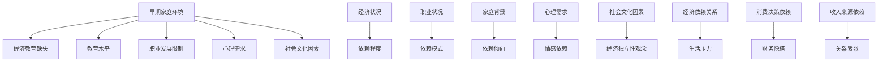
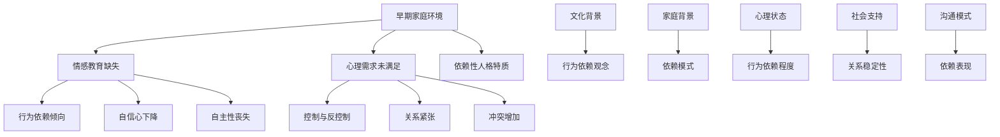

                 

## 引言

### 1.1 亲密关系的重要性

亲密关系是人类社会中最基本、最重要的关系之一。它不仅影响个人的心理健康和生活质量，也影响着社会稳定和个体发展。亲密关系可以是家庭关系，如夫妻、亲子关系，也可以是朋友、同事等非血缘关系。不论形式如何，它们都是个体成长和社会运转的重要基石。

在现代社会中，亲密关系的重要性愈发凸显。随着社会结构的变迁和价值观的多元化，人们对于亲密关系的期待和需求也在不断变化。传统的依赖模式已无法完全满足现代人对于情感支持、个人成长和自主性的需求。因此，探讨如何从依赖走向互助，成为理解亲密关系和提升人际关系质量的关键。

### 1.2 依赖与互助：两种亲密关系的模式

在亲密关系中，依赖和互助是两种不同的互动模式。依赖模式通常指的是个体在情感、经济或行为上对他人的高度需求，个体在这种关系中往往感到被动和缺乏自主性。而互助模式则强调双方在平等、互惠的基础上相互支持，个体在这种关系中能够获得更大的自主性和成长空间。

依赖模式的亲密关系常常伴随着以下特征：
- 情感依赖：个体在情感上高度依赖对方，失去对方时感到极度不安。
- 经济依赖：个体在经济上依赖对方，可能因对方的经济状况波动而受到影响。
- 行为依赖：个体在行为上依赖对方，难以独立完成日常活动。

相比之下，互助模式的亲密关系具有以下特征：
- 平等互惠：双方在情感、经济和行动上都能实现相互支持，不存在明显的不平衡。
- 自主性提升：个体在互助关系中能够保持自我独立性，同时获得他人的支持。
- 情感成长：双方在互助过程中能够共同成长，增强彼此的信任和依赖。

### 1.3 本书的目的与结构

本书旨在重新定义亲密关系，从依赖模式转向互助模式，帮助读者建立更加健康、平等和富有成效的亲密关系。全书将分为十章，系统探讨亲密关系的各个方面。

第二章至第四章将深入分析依赖关系的不同类型，包括情感依赖、经济依赖和行为依赖，探讨其形成原因、表现形式和影响因素。

第五章将讨论如何建设互助关系，包括互助关系的建立、维护和提升。

第六章和第七章分别从心理学和社会学的视角，探讨亲密关系中的依赖和互助现象，提供理论支持。

第八章通过具体案例分析，展示理论如何在实际生活中应用，以及如何帮助人们改善亲密关系。

第九章将提供自我提升与实践指南，帮助读者在日常生活中实践这些理论，提升亲密关系质量。

第十章为总结和展望，对全书内容进行总结，并提出未来的研究方向和拓展阅读建议。

通过本书的阅读，读者将能够更深刻地理解亲密关系的本质，学会如何从依赖走向互助，建立更加健康、平等和富有成效的亲密关系。

## 关键词

- 亲密关系
- 依赖
- 互助
- 情感依赖
- 经济依赖
- 行为依赖
- 互助关系
- 心理学视角
- 社会学视角
- 自我提升
- 实践指南

## 摘要

本书《重新定义亲密关系：从依赖到互助》旨在探讨亲密关系的本质，并提出一种从依赖模式向互助模式转变的新视角。通过深入分析依赖关系的不同类型，如情感依赖、经济依赖和行为依赖，本书揭示了这些依赖模式的负面影响及其形成原因。同时，本书详细讨论了如何建立和维持互助关系，提供了一系列实用的方法和策略。此外，本书还从心理学和社会学的角度对亲密关系进行了深入探讨，提供了理论支持。通过具体案例分析，本书展示了这些理论如何在实际生活中应用，并帮助读者提升亲密关系的质量。最后，本书提供了自我提升与实践指南，帮助读者在日常生活中实践这些理论，从而建立更加健康、平等和富有成效的亲密关系。本书适用于渴望改善人际关系、追求情感成长的个人和专业人士。

### 引言

在现代社会中，亲密关系既是个人幸福的重要来源，也是社会稳定的基石。然而，随着社会结构的变迁和价值观的多元化，传统的依赖模式已无法完全满足现代人对于情感支持、个人成长和自主性的需求。因此，重新审视和定义亲密关系，从依赖模式转向互助模式，成为当今社会的重要课题。

本书《重新定义亲密关系：从依赖到互助》旨在探讨这一主题，通过系统的分析和讨论，提供一种新的视角来理解亲密关系，并帮助读者在实践中实现这一转变。全书分为十章，结构紧凑，逻辑清晰，涵盖了亲密关系的各个方面。

第二章至第四章深入分析了依赖关系的不同类型，包括情感依赖、经济依赖和行为依赖，探讨了其形成原因、表现形式和影响因素。这一部分的目标是帮助读者识别和理解依赖模式，认识到其在亲密关系中的负面影响。

第五章转向讨论如何建立和维持互助关系。这一章详细介绍了互助关系的特征、建立和维持的方法，以及如何提升互助关系质量。这一部分的目标是提供实际可行的策略，帮助读者在实践中实现亲密关系的转变。

第六章和第七章从心理学和社会学的角度，探讨了亲密关系中的依赖和互助现象。这一部分的目标是提供理论支持，帮助读者从更深层次上理解亲密关系的本质。

第八章通过具体案例分析，展示了理论如何在实际生活中应用，以及如何帮助人们改善亲密关系。这一部分的目标是让读者通过实际案例，更直观地理解书中的理论和方法。

第九章提供了一些实用的自我提升与实践指南，包括沟通技巧、情感管理和自我成长的方法。这一部分的目标是帮助读者在日常生活中实践这些理论，提升亲密关系质量。

第十章为总结和展望，对全书内容进行总结，并提出未来的研究方向和拓展阅读建议。这一部分的目标是帮助读者巩固所学知识，并为未来的研究提供方向。

通过本书的阅读，读者将能够更深刻地理解亲密关系的本质，学会如何从依赖走向互助，建立更加健康、平等和富有成效的亲密关系。这不仅有助于提升个人情感生活质量，也为社会关系的和谐与进步提供了理论支持。

### 第1章：亲密关系概述

在探讨如何重新定义亲密关系之前，有必要对亲密关系本身进行一个全面的概述。这一章将首先定义亲密关系，然后探讨依赖关系和互助关系的特征，并阐述两者之间的联系与区别。

#### 1.1 亲密关系的定义与类型

亲密关系是指个体之间基于情感联系、相互理解和支持的关系。这种关系可以是家庭关系，如夫妻、亲子关系，也可以是朋友、同事等非血缘关系。亲密关系的核心在于情感的共享和相互支持，它能够满足个体的情感需求，提供安全感，促进个人成长。

亲密关系可以分为多种类型，主要包括以下几种：

1. **情感亲密**：这是亲密关系的核心，指的是个体之间在情感上的深度联系和相互理解。这种关系强调情感的交流和共鸣，能够带来温暖和安慰。
2. **身体亲密**：这是指个体之间的身体接触和性关系。身体亲密能够满足个体的生理需求，增强亲密感。
3. **社交亲密**：这是指个体之间在社交层面的互动和联系，如朋友、同事等。社交亲密能够提供社交支持，扩大个体的社交圈子。

#### 1.2 依赖关系的特征

依赖关系是亲密关系的一种模式，其中个体在情感、经济或行为上对他人的需求高度依赖。依赖关系通常表现为以下特征：

1. **情感依赖**：个体在情感上高度依赖对方，缺乏自我情感调节能力。当对方不在时，个体可能会感到焦虑、不安或孤独。
2. **经济依赖**：个体在经济上依赖对方，可能因为缺乏独立的经济来源而依赖对方的生活费用或其他经济支持。
3. **行为依赖**：个体在行为上依赖对方，可能无法独立完成某些日常活动或决策，需要对方的指导和帮助。

依赖关系的负面影响包括：

- **丧失自主性**：个体在依赖关系中可能失去独立思考和行动的能力，变得缺乏自信和主动性。
- **情感不稳定**：依赖关系可能导致个体在情感上波动不定，对方的存在成为个体情感稳定的唯一来源。
- **过度牺牲**：为了维持依赖关系，个体可能会过度牺牲自己的需求和权益，导致自我价值的下降。

#### 1.3 互助关系的特征

互助关系是一种更为健康的亲密关系模式，强调双方在平等、互惠的基础上相互支持。互助关系的特征包括：

1. **平等互惠**：双方在情感、经济和行动上都能实现相互支持，不存在明显的不平衡。这种关系能够带来平等和尊重的感觉。
2. **自主性提升**：个体在互助关系中能够保持自我独立性，同时获得他人的支持。这种关系有助于个体的自我成长和自信心提升。
3. **情感成长**：双方在互助过程中能够共同成长，增强彼此的信任和依赖。这种关系能够带来情感的稳定和满足。

#### 1.4 依赖与互助的联系与区别

依赖关系和互助关系虽然都是亲密关系的模式，但它们之间存在着明显的区别。依赖关系通常建立在个体对对方的高度需求上，这种需求可能导致个体失去自主性和独立性，情感不稳定。而互助关系则强调平等和互惠，个体在关系中能够保持自主性和独立性，同时获得支持，情感稳定。

依赖关系和互助关系的联系在于，它们都是亲密关系的一部分，都能够满足个体的情感需求。然而，依赖关系可能导致负面后果，而互助关系则能够促进个体的成长和关系的稳定。

#### 1.5 核心概念与联系

为了更好地理解依赖关系和互助关系，我们需要明确这些核心概念，并探讨它们之间的联系。

1. **依赖关系**：依赖关系是指个体在情感、经济或行为上对他人的需求高度依赖。它包括情感依赖、经济依赖和行为依赖。

2. **互助关系**：互助关系是指双方在平等、互惠的基础上相互支持。它强调平等互惠、自主性提升和情感成长。

3. **依赖与互助的联系**：依赖关系和互助关系都是亲密关系的一部分，但它们在互动方式和结果上有显著差异。依赖关系可能导致个体失去自主性和独立性，而互助关系则能够促进个体的成长和关系的稳定。

4. **依赖与互助的区别**：依赖关系强调个体对对方的高度需求，可能导致情感不稳定和自主性丧失。而互助关系则强调平等和互惠，个体能够保持自主性和独立性，同时获得支持。

为了更直观地展示这些概念之间的联系，我们可以使用Mermaid ER实体关系图来描述：

```mermaid
erDiagram
  IDEPendency Relationship ||--|{ Emotional Dependency }
  IDEPendency Relationship ||--|{ Economic Dependency }
  IDEPendency Relationship ||--|{ Behavioral Dependency }
  Mutual Relationship ||--|{ Equal Reciprocity }
  Mutual Relationship ||--|{ Enhanced Autonomy }
  Mutual Relationship ||--|{ Emotional Growth }
```

这个ER图展示了依赖关系和互助关系的核心概念以及它们之间的联系。通过这个图，我们可以更清晰地理解依赖关系和互助关系的定义和特征。

### 核心概念与联系

在本章节中，我们将深入探讨亲密关系中的核心概念，包括“依赖”和“互助”，并分析它们之间的联系与区别。通过使用Mermaid ER实体关系图，我们将以视觉化的方式呈现这些概念之间的关系，帮助读者更好地理解。

#### 依赖

依赖是指个体在情感、经济或行为上对他人的高度需求。它通常表现为以下几个子概念：

1. **情感依赖**：个体在情感上高度依赖对方，往往无法独立处理自己的情感问题，需要对方的情感支持来获得安全感。
2. **经济依赖**：个体在经济上依赖对方，可能由于缺乏独立的经济来源，需要对方的财务支持来维持生活。
3. **行为依赖**：个体在行为上依赖对方，无法独立完成某些日常活动或做出决策，需要对方的指导和帮助。

依赖关系的特点是单方面的依赖，个体可能会感到被动、缺乏自主性和独立性，同时也容易导致情感上的不稳定。

#### 互助

互助关系则是基于平等和互惠的原则，双方在情感、经济和行动上相互支持。互助关系的核心概念包括：

1. **平等互惠**：双方在关系中享有平等的地位，互惠互利，不存在明显的不平衡。
2. **自主性提升**：个体在互助关系中能够保持自我独立性，同时在获得支持的同时，也能支持他人。
3. **情感成长**：双方在互助过程中共同成长，增强彼此的信任和依赖，实现情感上的稳定和满足。

互助关系的特点是双向的互动和支持，个体在关系中能够获得自主性和情感上的满足。

#### 联系与区别

依赖和互助是亲密关系中的两种不同模式，它们之间存在联系，但又有显著的差异。

**联系：**

- **共同目标**：依赖和互助都是为了满足个体的情感需求，提升关系的质量。
- **互动基础**：依赖和互助都建立在双方的情感联系之上，是亲密关系的不同表现形式。

**区别：**

- **互动性质**：依赖通常是单向的，个体对对方有高度需求，而互助是双向的，双方在平等的基础上相互支持。
- **情感结果**：依赖可能导致情感不稳定和自主性丧失，而互助能够带来情感稳定和个体的自我成长。
- **关系质量**：依赖关系往往存在不平衡和潜在的控制，而互助关系则更为健康和稳定。

为了更直观地展示这些概念之间的联系与区别，我们可以使用Mermaid ER实体关系图来描述：

```mermaid
erDiagram
  IDEPendency ||--|{ Emotional Dependency }
  IDEPendency ||--|{ Economic Dependency }
  IDEPendency ||--|{ Behavioral Dependency }
  Mutual ||--|{ Equal Reciprocity }
  Mutual ||--|{ Enhanced Autonomy }
  Mutual ||--|{ Emotional Growth }
  IDEPendency ..|{ Emotional Dependency }| Mutuality
  IDEPendency ..|{ Economic Dependency }| Mutuality
  IDEPendency ..|{ Behavioral Dependency }| Mutuality
  Mutuality ..|{ Equal Reciprocity }| Mutual
  Mutuality ..|{ Enhanced Autonomy }| Mutual
  Mutuality ..|{ Emotional Growth }| Mutual
```

在这个ER图中，我们展示了依赖和互助这两个主要实体以及它们各自的子概念。通过双向箭头（..|..|），我们表示了依赖和互助之间的联系，而通过单向箭头（||--|），我们表示了依赖和互助之间的区别。这样的ER图能够帮助读者更好地理解依赖和互助之间的关系以及它们的特征。

通过本章节的讨论，我们不仅明确了依赖和互助的概念和特征，还通过Mermaid ER图展示了它们之间的联系与区别。这种视觉化的表示方式能够加深读者对亲密关系不同模式的理解，为后续章节的深入探讨打下坚实的基础。

### 情感依赖分析

情感依赖是亲密关系中的一种常见模式，它指的是个体在情感上高度依赖对方，缺乏自我情感调节能力。在情感依赖关系中，个体往往需要通过对方的情感支持来获得安全感，而当对方不在时，个体可能会感到焦虑、不安或孤独。本节将深入探讨情感依赖的影响、形成原因、表现形式及其影响因素。

#### 2.1 情感依赖的影响

情感依赖对个体和亲密关系都有显著的影响。从个体层面来看，情感依赖可能导致以下几个方面的问题：

1. **情感不稳定**：个体在情感上高度依赖对方，可能因对方的行为或态度而感到情绪波动，缺乏情感稳定性。
2. **自信心下降**：由于依赖对方，个体可能会丧失自我价值感和自信心，感觉自己的一切都依赖于对方的存在。
3. **自主性丧失**：情感依赖使得个体难以独立处理自己的情感问题，缺乏自主性，可能影响个人成长和自我实现。

从亲密关系层面来看，情感依赖可能导致以下问题：

1. **控制与反控制**：依赖关系中，一方可能会试图控制对方以满足自己的情感需求，而另一方可能会感到被束缚和反控制，关系变得紧张。
2. **关系不平衡**：情感依赖可能导致亲密关系中的不平衡，依赖者可能过度牺牲自己的需求和权益，而依赖对象则可能感到负担沉重。
3. **冲突增加**：情感依赖可能导致双方在情感需求上的冲突，由于依赖者的需求往往无法得到满足，冲突和争吵可能会增加。

#### 2.2 情感依赖的形成原因

情感依赖的形成通常与以下几个方面有关：

1. **早期经历**：个体在成长过程中如果缺乏安全感和稳定的情感支持，可能会形成对情感依赖的倾向。例如，在家庭中缺乏父母的关爱和陪伴，个体可能更容易在亲密关系中寻求情感依赖。
2. **情感教育缺失**：个体如果在情感教育方面缺乏适当的引导，可能无法学会自我调节情感，从而更倾向于依赖他人。
3. **心理需求未满足**：个体在心理上可能存在某些未满足的需求，如安全感、归属感等，这些需求促使个体在亲密关系中寻求依赖。
4. **依赖性人格特质**：某些人格特质，如焦虑型人格特质，可能使得个体更容易形成情感依赖。

#### 2.3 情感依赖的表现形式

情感依赖在亲密关系中的表现形式多种多样，以下是一些常见的表现形式：

1. **频繁沟通需求**：个体需要频繁与依赖对象沟通，以确认对方的存在和关心。
2. **情绪波动**：个体在情感上容易受到依赖对象的影响，情绪波动较大，可能出现焦虑、不安等情绪。
3. **过度关注**：个体对依赖对象的日常生活和工作表现出过度的关注和干涉，缺乏独立性。
4. **情感投射**：个体将自身的情感需求投射到依赖对象身上，期望对方能够满足自己的情感需求。
5. **情感依赖性决策**：个体在决策时往往依赖于依赖对象的意见，缺乏独立思考和判断能力。

#### 2.4 情感依赖的影响因素

情感依赖的影响因素多种多样，以下是一些主要的影响因素：

1. **文化背景**：不同的文化背景对亲密关系的期望和表达方式有不同的影响。在一些文化中，情感依赖被视为正常现象，而在其他文化中则可能被视为问题。
2. **个人经历**：个体的成长经历，如家庭环境、童年经历等，对情感依赖的形成有重要影响。
3. **心理状态**：个体的心理状态，如焦虑、抑郁等，可能影响其依赖关系的建立和维持。
4. **社会支持**：个体在亲密关系中的社会支持系统，如家庭和朋友的支持，可能影响其情感依赖的程度。
5. **沟通模式**：亲密关系中的沟通模式对情感依赖有显著影响。有效的沟通能够减少误解和冲突，有助于建立健康的亲密关系。

#### 情感依赖的影响因素（Mermaid流程图）

为了更直观地展示情感依赖的影响因素，我们可以使用Mermaid流程图来描述：

```mermaid
graph TD
    A[早期经历] --> B[情感教育缺失]
    A --> C[心理需求未满足]
    A --> D[依赖性人格特质]
    B --> E[情感不稳定]
    B --> F[自信心下降]
    B --> G[自主性丧失]
    C --> H[控制与反控制]
    C --> I[关系不平衡]
    C --> J[冲突增加]
    D --> K[频繁沟通需求]
    D --> L[情绪波动]
    D --> M[过度关注]
    D --> N[情感投射]
    D --> O[情感依赖性决策]
    P[文化背景] --> Q[依赖程度]
    R[个人经历] --> S[依赖模式]
    T[心理状态] --> U[情感依赖]
    V[社会支持] --> W[关系稳定性]
    X[沟通模式] --> Y[依赖表现]
    Z[依赖关系] --> [情感依赖影响]
```

在这个流程图中，我们展示了情感依赖的影响因素以及它们如何影响依赖关系。通过这种视觉化的表示方式，读者可以更清晰地理解情感依赖的形成和影响因素。

通过本章节的讨论，我们深入分析了情感依赖的影响、形成原因、表现形式及其影响因素。这些分析不仅有助于读者理解情感依赖的复杂性和多样性，也为后续章节探讨如何从依赖转向互助提供了理论基础。

### 经济依赖分析

经济依赖是亲密关系中的一种重要模式，它指的是个体在经济上对他人的高度需求。这种依赖关系可能导致一系列负面影响，影响个体的经济独立性、心理健康和亲密关系的稳定性。本节将详细探讨经济依赖的影响、形成原因、表现形式及其影响因素。

#### 3.1 经济依赖的影响

经济依赖对个体和亲密关系都有显著的影响。从个体层面来看，经济依赖可能导致以下几个方面的问题：

1. **经济独立性丧失**：个体在经济上依赖对方，可能缺乏独立的经济来源，影响其生活质量和职业发展。
2. **自信心下降**：由于缺乏经济独立性，个体可能会感到自身价值下降，自信心受挫。
3. **生活压力增加**：经济依赖使得个体在面临经济困境时，往往感到无助和焦虑，增加生活压力。
4. **自主性受限**：个体在经济上依赖对方，可能难以做出独立的经济决策，影响其自主性和自主发展。

从亲密关系层面来看，经济依赖可能导致以下问题：

1. **关系紧张**：经济依赖可能导致双方在经济责任和负担上的不平等，产生矛盾和冲突。
2. **依赖性增强**：经济依赖可能使得依赖者的情感依赖更加严重，难以独立处理情感问题。
3. **牺牲与怨恨**：为了维持经济依赖关系，个体可能会过度牺牲自己的经济利益，导致怨恨和不满情绪的增加。
4. **关系不稳定**：经济依赖关系可能因外部经济波动或双方价值观的差异而变得脆弱，影响亲密关系的稳定性。

#### 3.2 经济依赖的形成原因

经济依赖的形成通常与以下几个方面有关：

1. **早期家庭环境**：个体在成长过程中如果家庭经济条件较差，可能会形成对经济依赖的倾向。例如，家庭经济困难可能导致个体在成年后依然依赖父母或其他家庭成员的经济支持。
2. **教育水平**：教育水平较低的个体可能缺乏经济管理和理财能力，更容易在经济上依赖他人。
3. **职业发展限制**：某些职业或行业可能存在收入不稳定或收入较低的情况，导致个体在经济上依赖他人。
4. **心理需求**：个体可能在心理上需要通过经济上的依赖来获得安全感，尤其是在情感上依赖对方时，经济依赖成为一种补充。
5. **社会文化因素**：在一些文化中，经济依赖被视为正常现象，特别是在家庭关系中，依赖关系可能被合理化。

#### 3.3 经济依赖的表现形式

经济依赖在亲密关系中的表现形式多种多样，以下是一些常见的表现形式：

1. **经济资助需求**：个体在经济上依赖对方，可能需要对方提供资金支持以维持生活或支付账单。
2. **消费决策依赖**：个体在消费决策上依赖对方的意见，可能难以独立做出经济决策。
3. **收入来源依赖**：个体依赖对方的收入作为自己的主要或全部经济来源，缺乏经济独立性。
4. **经济支持期望**：个体期望对方在经济上给予支持，可能包括支付大额费用、购买贵重物品等。
5. **财务隐瞒**：为了维持经济依赖关系，个体可能隐瞒自己的经济状况，避免对方知道自己的真实财务状况。

#### 3.4 经济依赖的影响因素

经济依赖的影响因素多种多样，以下是一些主要的影响因素：

1. **经济状况**：个体的经济状况直接影响其依赖程度。经济条件较差的个体可能更容易在经济上依赖他人。
2. **职业状况**：个体的职业状况，如收入稳定性和职业发展空间，影响其经济独立性和依赖程度。
3. **家庭背景**：家庭背景，如家庭经济条件、家庭教育水平等，对个体的经济依赖倾向有显著影响。
4. **心理需求**：个体在心理上的安全感需求可能导致其选择经济依赖关系，以满足情感上的需求。
5. **社会文化因素**：社会文化背景，如婚姻观念和经济独立性观念，影响个体对经济依赖的看法和接受程度。

#### 经济依赖的影响因素（Mermaid流程图）

为了更直观地展示经济依赖的影响因素，我们可以使用Mermaid流程图来描述：



在这个流程图中，我们展示了经济依赖的影响因素以及它们如何影响依赖关系。通过这种视觉化的表示方式，读者可以更清晰地理解经济依赖的形成和影响因素。

通过本章节的讨论，我们深入分析了经济依赖的影响、形成原因、表现形式及其影响因素。这些分析有助于读者理解经济依赖的复杂性和多样性，并为如何从依赖转向互助提供理论基础。

### 行为依赖分析

行为依赖是亲密关系中的一种显著模式，它指的是个体在行为上对他人的高度需求，缺乏独立完成日常活动或决策的能力。行为依赖可能导致一系列负面影响，影响个体的自主性、自信心和亲密关系的稳定性。本节将详细探讨行为依赖的影响、形成原因、表现形式及其影响因素。

#### 4.1 行为依赖的影响

行为依赖对个体和亲密关系都有显著的影响。从个体层面来看，行为依赖可能导致以下几个方面的问题：

1. **自主性丧失**：个体在行为上依赖他人，难以独立完成日常活动和做出决策，影响其自主性和独立生活能力。
2. **自信心下降**：由于依赖他人，个体可能会丧失自信心，感觉自己缺乏独立处理事务的能力。
3. **生活压力增加**：行为依赖使得个体在面临问题时，往往需要依赖他人的帮助，增加生活压力和焦虑感。
4. **情感负担**：行为依赖可能导致依赖者在情感上感到负担沉重，影响其心理健康和亲密关系的质量。

从亲密关系层面来看，行为依赖可能导致以下问题：

1. **控制与反控制**：依赖关系中，一方可能会试图控制对方的行为，而另一方可能会感到被束缚和反控制，关系变得紧张。
2. **关系不平衡**：行为依赖可能导致亲密关系中的不平衡，依赖者可能过度依赖对方，而依赖对象可能感到负担沉重。
3. **冲突增加**：行为依赖可能导致双方在行为规范和独立性上的冲突，影响亲密关系的稳定性。
4. **依赖性增强**：行为依赖可能使得依赖者在情感上也产生依赖，进一步加剧情感依赖问题。

#### 4.2 行为依赖的形成原因

行为依赖的形成通常与以下几个方面有关：

1. **早期家庭环境**：个体在成长过程中如果家庭环境较为严格或过度保护，可能会形成对行为依赖的倾向。例如，家长过分干涉子女的日常生活和决策，可能导致成年后在行为上依然依赖父母。
2. **情感教育缺失**：个体如果在情感教育方面缺乏适当的引导，可能无法学会自我调节情感和行为，从而更倾向于依赖他人。
3. **心理需求**：个体在心理上可能存在某些未满足的需求，如安全感、归属感等，这些需求促使个体在亲密关系中寻求行为依赖。
4. **依赖性人格特质**：某些人格特质，如依赖型人格特质，可能使得个体更容易形成行为依赖。

#### 4.3 行为依赖的表现形式

行为依赖在亲密关系中的表现形式多种多样，以下是一些常见的行为依赖表现形式：

1. **决策依赖**：个体在重要决策上缺乏独立判断能力，需要依赖他人的意见或决策。
2. **日常生活依赖**：个体在日常生活中需要依赖他人完成某些日常任务，如购物、做饭、清洁等。
3. **行为模仿**：个体在行为上模仿依赖对象，缺乏自我行为的主导性和创新性。
4. **行为干涉**：依赖者可能试图过度干涉依赖对象的行为，影响其自主性和独立性。
5. **情感依赖性行为**：行为依赖往往伴随着情感依赖，个体可能通过行为依赖来获得情感支持。

#### 4.4 行为依赖的影响因素

行为依赖的影响因素多种多样，以下是一些主要的影响因素：

1. **文化背景**：不同的文化背景对行为依赖的看法和接受程度不同，一些文化可能更加重视个体的自主性和独立性，而其他文化可能更加接受行为依赖关系。
2. **家庭背景**：家庭背景，如父母的教养方式和家庭环境，对行为依赖的形成有显著影响。
3. **心理状态**：个体的心理状态，如焦虑、抑郁等，可能影响其行为依赖的程度。
4. **社会支持**：个体在亲密关系中的社会支持系统，如朋友和家庭成员的支持，可能影响其行为依赖的程度。
5. **沟通模式**：亲密关系中的沟通模式对行为依赖有显著影响。有效的沟通能够减少误解和冲突，有助于建立健康的亲密关系。

#### 行为依赖的影响因素（Mermaid流程图）

为了更直观地展示行为依赖的影响因素，我们可以使用Mermaid流程图来描述：



在这个流程图中，我们展示了行为依赖的影响因素以及它们如何影响依赖关系。通过这种视觉化的表示方式，读者可以更清晰地理解行为依赖的形成和影响因素。

通过本章节的讨论，我们深入分析了行为依赖的影响、形成原因、表现形式及其影响因素。这些分析有助于读者理解行为依赖的复杂性和多样性，并为如何从依赖转向互助提供理论基础。

### 第5章：互助关系建设

在探讨如何建立和维持互助关系之前，我们需要明确互助关系的定义和特征。互助关系是一种基于平等、互惠和相互支持的关系模式，强调双方在情感、经济和行动上的协作。这种关系能够促进个体的自我成长和亲密关系的稳定性。本节将详细介绍如何建立和维持互助关系，并提供实用的方法和策略。

#### 5.1 互助关系的建立

建立互助关系的关键在于双方建立信任和尊重。以下是一些具体的步骤和方法：

1. **明确目标**：在建立互助关系时，双方应明确共同的目标和期望。这有助于双方在合作过程中保持一致，减少误解和冲突。

2. **建立信任**：信任是互助关系的基础。双方可以通过诚实、透明和负责任的沟通来建立信任。例如，分享个人的想法、感受和需求，倾听对方的意见，并在行动上保持一致性。

3. **平等互惠**：在互助关系中，双方应确保在情感、经济和行动上的平等互惠。这有助于避免一方过度依赖另一方，保持关系的平衡。

4. **共同成长**：互助关系的双方应共同成长，相互支持对方的发展。这可以通过分享资源、知识和经验来实现。

5. **尊重差异**：每个人都有自己的个性和需求，因此，在互助关系中，双方应尊重彼此的差异，学会包容和适应。

#### 5.2 互助关系的维护

维护互助关系需要持续的努力和关注。以下是一些维护互助关系的方法：

1. **有效的沟通**：沟通是维护互助关系的关键。双方应保持开放、诚实和积极的沟通，及时解决问题和冲突。

2. **情感支持**：在互助关系中，双方应提供情感支持，帮助对方度过困难时期。这可以通过倾听、安慰和鼓励来实现。

3. **相互尊重**：双方应尊重对方的意见和决定，避免强迫或控制对方。尊重差异是维护互助关系的重要一环。

4. **共同参与**：双方应共同参与决策和活动，增强彼此的互动和合作。这有助于建立更深层次的关系。

5. **及时调整**：在互助关系中，双方可能需要根据实际情况进行调整。这包括重新设定目标、调整支持方式和沟通策略。

#### 5.3 互助关系的提升

为了提升互助关系的质量，双方可以采取以下策略：

1. **增强信任**：通过持续的诚实和透明沟通，增强彼此之间的信任。信任是互助关系的基石，没有信任，关系难以长久。

2. **增加互动**：通过增加互动频率和质量，提升双方的关系。这可以通过共同参与活动、分享经验和知识来实现。

3. **共同成长**：双方应共同成长，相互支持对方的发展。这可以通过互相学习和分享经验来实现。

4. **解决冲突**：冲突是人际关系中难以避免的，但双方应学会如何有效解决冲突。这可以通过积极沟通、妥协和寻求共同利益来实现。

5. **情感投资**：在互助关系中，双方应投入情感，建立深厚的情感联系。这可以通过表达爱意、关心和感激来实现。

#### 互助关系的特征

互助关系的特征包括：

1. **平等互惠**：双方在情感、经济和行动上实现相互支持，不存在明显的不平衡。
2. **自主性提升**：个体在互助关系中能够保持自我独立性，同时在获得支持的同时，也能支持他人。
3. **情感成长**：双方在互助过程中能够共同成长，增强彼此的信任和依赖。
4. **共同目标**：双方有共同的愿景和目标，共同努力实现这些目标。
5. **相互尊重**：双方尊重对方的意见和决定，建立互信和互相支持的关系。

通过本章节的讨论，我们详细介绍了如何建立和维持互助关系，并提供了实用的方法和策略。建立和维持互助关系不仅有助于提升个人的自主性和成长，也有助于亲密关系的稳定和健康发展。

### 心理学视角下的亲密关系

在探讨亲密关系时，心理学视角提供了一个深入理解依赖和互助关系的理论基础。心理学家通过研究人类情感、行为和心理过程，揭示了亲密关系中的复杂动态。以下将从心理学角度分析依赖和互助关系，并探讨心理学理论在亲密关系中的应用。

#### 6.1 心理学对依赖与互助的解释

依赖关系可以从心理学角度解释为一种基于恐惧和不安的情感状态。依赖者可能在内心深处感到不安全，需要通过依赖对象来获得安全感。这种依赖可能源于童年时期的经历，如父母过度保护或缺乏关爱，导致个体在成年后形成依赖性人格特质。

1. **恐惧和不安**：依赖关系中的个体往往害怕失去依赖对象，因此表现出强烈的情感依赖。这种恐惧和不安可能导致焦虑、不安和情绪波动。

2. **逃避现实**：依赖者可能通过依赖关系逃避现实生活中的挑战和责任，依赖对象成为他们逃避现实的避风港。

3. **心理需求未满足**：依赖者可能在情感上、心理上或经济上感到需求未满足，因此依赖他人来填补这些空白。

相比之下，互助关系则强调平等、互惠和相互支持。在互助关系中，个体能够在情感上得到满足，同时也能够为他人提供支持。这种关系基于信任和尊重，有助于个体的自主性和自尊心的提升。

1. **信任与尊重**：互助关系中的个体相互信任，尊重彼此的差异和独立性。这种信任和尊重是关系稳定和健康发展的基础。

2. **自主性提升**：个体在互助关系中能够保持自我独立性，同时获得他人的支持，有助于个体的自我成长和自尊心的提升。

3. **情感满足**：互助关系能够满足个体的情感需求，带来安全感和满足感，减少焦虑和不安。

#### 6.2 心理学理论在亲密关系中的应用

心理学理论为理解和改善亲密关系提供了丰富的工具和方法。以下是一些常见的心理学理论及其在亲密关系中的应用：

1. **依附理论**：依附理论认为，个体的情感状态和行为模式在很大程度上受到童年时期与父母的依恋关系的影响。在亲密关系中，依附型个体可能表现出强烈的依赖性，而安全型个体则能够在平等和互惠的基础上建立稳定的关系。

2. **自我决定理论**：自我决定理论强调个体的自主性和自我实现。在亲密关系中，双方应尊重彼此的自主性，提供支持而不是控制。这种关系有助于个体的自我成长和亲密关系的稳定性。

3. **情感智力理论**：情感智力包括识别和理解自己和他人的情感，以及有效地调节和表达情感。在亲密关系中，高情感智力的个体能够更好地处理情感冲突，建立更深层次的情感联系。

4. **认知行为理论**：认知行为理论认为，个体的行为和情感状态受到认知过程的影响。在亲密关系中，通过认知重构和情绪调节技术，个体可以改善情感状态，减少依赖行为。

#### 6.3 心理学在提升互助关系中的作用

心理学在提升互助关系中发挥着重要作用，以下是一些具体的方法：

1. **情感教育和支持**：通过情感教育，个体可以学会如何识别和管理自己的情感，提高情感智力。同时，通过提供情感支持，个体可以更好地处理情感问题，减少依赖行为。

2. **自我认知和成长**：个体可以通过自我认知和成长，了解自己的情感需求和依赖模式，学会如何独立处理情感问题。这种自我认知有助于建立健康的互助关系。

3. **沟通技巧**：有效的沟通是互助关系的重要保障。通过学习沟通技巧，个体可以更好地表达自己的需求和感受，理解对方的观点和感受，减少误解和冲突。

4. **心理治疗**：对于依赖行为严重的个体，心理治疗可以提供专业的支持和指导。通过认知行为疗法、情感聚焦疗法等，个体可以改变依赖行为，建立健康的互助关系。

#### 6.4 心理学在提升互助关系中的作用总结

心理学为理解和提升互助关系提供了重要的理论基础和方法。通过应用心理学理论，个体可以更好地识别和管理情感，提高自主性和自尊心，建立平等、互惠和稳定的亲密关系。心理学的应用不仅有助于改善个人情感生活，也为社会的和谐发展提供了支持。

### 社会学视角下的亲密关系

从社会学视角分析亲密关系，有助于我们理解依赖和互助关系在社会结构和文化背景下的形成和影响。社会学提供了丰富的理论工具，帮助我们揭示亲密关系中的社会动态，以及社会环境如何塑造个体的依赖和互助行为。

#### 7.1 社会学对依赖与互助的解释

1. **社会结构**：社会结构是指社会中各种关系和组织形式的总体布局。社会结构对亲密关系的依赖和互助模式有重要影响。例如，传统家庭结构强调夫妻和家庭成员之间的经济和情感依赖，而现代社会结构则更加重视个体自主性和独立性。在社会结构变迁的过程中，依赖模式可能逐渐向互助模式转变。

2. **社会角色**：社会角色是指个体在社会中扮演的角色和期望。在亲密关系中，社会角色影响个体的行为和互动方式。例如，夫妻角色通常包括经济合作和情感支持，这可能导致依赖或互助关系。社会角色也影响个体的权力和资源分配，从而影响依赖和互助的程度。

3. **社会规范**：社会规范是指社会中公认的价值观和行为准则。社会规范对亲密关系中的依赖和互助有规范作用。在传统社会中，社会规范可能强调依赖关系，如夫妻间的经济依赖和情感支持。而在现代社会，互助关系可能受到更多重视，社会规范鼓励个体在平等和互惠的基础上建立关系。

4. **文化背景**：文化背景包括社会的历史、传统和价值观念。文化背景对依赖和互助模式有深远影响。例如，在一些文化中，家庭和亲属间的依赖关系被视为自然和重要的，而在其他文化中，个体的自主性和独立性可能受到更多重视。

#### 7.2 社会结构对亲密关系的影响

1. **权力与资源分配**：社会结构中的权力和资源分配对亲密关系中的依赖和互助模式有显著影响。在传统家庭结构中，男性通常掌握经济权力，女性则更多承担家务和照顾孩子的角色。这种权力不平等可能导致情感和经济依赖。而在现代社会，随着性别平等和家庭结构的变化，互助关系可能更加普遍。

2. **社会阶层与经济依赖**：社会阶层影响个体的经济状况，从而影响亲密关系中的依赖模式。较低社会阶层的个体可能在经济上更加依赖他人，而较高社会阶层的个体可能更有能力实现经济独立。

3. **社会变迁与依赖模式转变**：社会变迁，如全球化、城市化等，可能导致传统依赖模式的转变。例如，随着城市化进程的加快，个体在经济和情感上的依赖关系可能减少，而互助关系可能增加。

#### 7.3 社会规范与互助关系建设

社会规范对亲密关系中的互助关系建设有重要影响。以下是一些关键的社会规范：

1. **合作与共享**：社会规范鼓励个体在亲密关系中合作和共享资源。这种规范有助于建立互助关系，减少依赖行为。

2. **平等互惠**：社会规范强调平等互惠，反对单方面的依赖。这种规范有助于建立健康、稳定的亲密关系。

3. **情感支持**：社会规范认为情感支持是亲密关系的重要组成部分。这种规范有助于个体在互助关系中表达情感需求，提供支持。

4. **责任与义务**：社会规范强调个体在亲密关系中的责任和义务。这种规范有助于建立稳定的关系，减少依赖行为，促进互助关系的发展。

#### 7.4 文化背景对依赖和互助的影响

文化背景对依赖和互助模式有深远影响。以下是一些关键的文化因素：

1. **家庭文化**：在重视家庭和亲属关系的文化中，依赖关系可能更加普遍。家庭文化强调个体在情感和经济上的相互依赖。

2. **个体主义与集体主义**：个体主义文化重视个人自主性和独立性，可能鼓励互助关系。而集体主义文化强调集体利益和依赖，可能促进依赖关系。

3. **价值观与期望**：文化价值观和期望影响个体在亲密关系中的行为。例如，在一些文化中，忠诚和牺牲被视为重要价值观，可能导致依赖关系。而在其他文化中，平等和自主性可能受到更多重视，促进互助关系。

通过社会学视角的分析，我们能够更全面地理解依赖和互助关系的形成和影响。社会结构、规范和文化背景共同作用，塑造了亲密关系中的依赖和互助模式。这些理解有助于我们在现代社会中建立更加健康、平等和稳定的亲密关系。

### 具体案例分析

为了更直观地展示理论如何在实际生活中应用，本章节将通过具体案例来分析情感依赖和互助关系在亲密关系中的应用，并总结案例中的经验教训。

#### 8.1 案例背景

小王和小李是一对年轻的夫妻，相识于大学时期，并在毕业后迅速步入婚姻殿堂。小王是一个事业心极强的人，工作努力，收入稳定；而小李则相对较为内向，喜欢安静的生活。起初，他们的婚姻生活非常和谐，但不久后，小王因为工作繁忙，经常加班，对家庭的关注逐渐减少。小李开始感到孤独和不被重视，于是，两人的关系逐渐陷入情感依赖和情感疏离的漩涡中。

#### 8.2 情感依赖案例分析

在案例中，小王和小李的关系表现出明显的情感依赖特征：

1. **情感依赖的表现**：小李在情感上高度依赖小王，每当小王不在身边时，她会感到焦虑和不安。她希望通过小王的关心和陪伴来获得情感上的满足。

2. **情感依赖的影响**：由于小王工作繁忙，小李的情感需求未能得到满足，她开始出现情绪波动，经常感到沮丧和愤怒。这种情感依赖不仅影响了小李的心理健康，也导致了两人之间的冲突。

3. **依赖模式的负面影响**：小王由于工作压力，无法满足小李的情感需求，导致两人的关系逐渐紧张。小李的情绪波动也使小王感到疲惫，进一步加剧了依赖关系的不平衡。

#### 8.3 互助关系案例分析

为了改善亲密关系，小王和小李决定尝试建立互助关系：

1. **互助关系的建立**：首先，他们决定进行开放和诚实的沟通，小王分享自己的工作压力和挑战，小李则表达了自己的情感需求和困扰。通过沟通，他们理解了彼此的需求和期望。

2. **互助关系的维护**：为了维护互助关系，小李开始学习如何自我调节情感，培养自己的兴趣爱好，增强独立性。同时，小王也努力调整工作时间，增加与家人的共处时间。

3. **互助关系的提升**：通过共同活动和相互支持，小王和小李的关系逐渐改善。他们开始共同参与家务，一起规划家庭生活，情感依赖逐渐减少，互助关系得到增强。

#### 8.4 案例分析总结

通过小王和小李的案例，我们可以总结以下经验教训：

1. **沟通的重要性**：开放和诚实的沟通是建立和维持互助关系的关键。通过沟通，双方能够理解彼此的需求和期望，减少误解和冲突。

2. **自我提升**：个体在互助关系中应努力提升自我，培养独立性和自我调节能力。这不仅有助于减少依赖关系，也能增强亲密关系的稳定性。

3. **共同目标**：共同目标能够增强双方的凝聚力和合作意愿，促进互助关系的建立和维护。

4. **情感管理**：学会管理自己的情感是建立健康亲密关系的重要一环。通过自我调节和情感管理，个体可以更好地应对情感挑战，减少依赖行为。

通过具体案例的分析，我们可以更直观地看到理论在现实生活中的应用效果。这些案例不仅帮助我们理解依赖和互助关系的本质，也为我们在实际生活中改善亲密关系提供了实用的方法和策略。

### 第9章：自我提升与实践指南

在了解了依赖和互助关系的理论和实践方法之后，本章节将提供一些实用的自我提升与实践指南，帮助读者在实际生活中应用这些理论，提升亲密关系的质量。

#### 9.1 自我提升的路径

要提升亲密关系，个体需要从自我提升开始。以下是一些关键步骤：

1. **自我认知**：首先，个体需要深入了解自己的情感需求和依赖模式。通过反思和自我观察，识别自己在亲密关系中的问题和行为模式。

2. **情感教育**：提升情感智力是自我提升的重要一环。通过阅读相关书籍、参加工作坊或寻求专业心理咨询，个体可以学习如何识别和管理自己的情感。

3. **培养独立性**：独立性是减少依赖的关键。个体可以通过培养独立生活的能力，如自我管理财务、完成日常任务等，增强自主性和自信心。

4. **设定目标**：设定清晰的个人和关系目标，有助于个体在亲密关系中保持方向和动力。例如，制定共同的活动计划、设定家庭目标等。

#### 9.2 实践互助关系的方法

以下是一些具体的方法，帮助读者在实践中建立和维护互助关系：

1. **有效沟通**：建立互助关系的关键是有效沟通。双方应学会如何开放、诚实和清晰地表达自己的想法和感受，同时也要倾听对方的意见和需求。

2. **平等互惠**：确保在亲密关系中实现平等和互惠。双方应相互支持，避免一方过度依赖另一方。例如，共同分担家务和责任，确保在情感和经济上的平等互惠。

3. **情感支持**：在对方需要时提供情感支持，通过倾听、安慰和鼓励来帮助对方度过困难时期。这有助于增强彼此的信任和依赖。

4. **共同参与**：积极参与对方的生活和兴趣，共同制定和实现目标。这有助于增强双方的情感联系和凝聚力。

5. **情感管理**：学会管理自己的情感，避免因情绪波动影响亲密关系。通过自我调节和情绪管理，个体可以更好地应对情感挑战，减少依赖行为。

#### 9.3 亲密关系中的沟通技巧

有效的沟通是建立和维护互助关系的重要工具。以下是一些沟通技巧：

1. **积极倾听**：倾听对方的话语，关注对方的情感需求，避免打断或批评。通过积极倾听，个体可以更好地理解对方的感受。

2. **表达感受**：学会用“I”语句表达自己的感受，避免指责对方。例如，“我感到有些担心，因为最近我们之间沟通较少”，而不是说“你总是不跟我沟通”。

3. **诚实反馈**：在适当的时候给予诚实反馈，但要注意方式和时机，避免伤害对方的感情。例如，可以适时提出改进的建议，但语气要温和。

4. **避免争吵**：遇到冲突时，尽量避免争吵，而是尝试通过对话解决问题。通过冷静和理性的讨论，双方可以找到共同点，解决问题。

5. **寻求专业帮助**：如果沟通技巧不佳或遇到严重的冲突，可以寻求专业心理咨询师的帮助。专业人士可以提供有效的沟通策略和情感管理技巧。

#### 9.4 情感管理与自我成长

情感管理是提升亲密关系质量的重要一环。以下是一些自我成长和情感管理的建议：

1. **自我反思**：定期进行自我反思，了解自己的情感需求和依赖模式。这有助于个体更好地管理自己的情感，减少依赖行为。

2. **情绪调节**：学会情绪调节技巧，如深呼吸、冥想和放松训练，有助于缓解压力和焦虑，提高情感稳定性。

3. **寻求支持**：在情感困难时，寻求朋友、家人或专业人士的支持。这有助于个体获得情感上的安慰和指导，更好地处理情感问题。

4. **自我实现**：追求个人目标和兴趣，实现自我价值。这有助于个体在情感上获得满足感，减少依赖他人的需求。

5. **情感教育**：不断学习和提升情感智力，通过阅读、参加课程或工作坊来扩展自己的情感知识。

#### 9.5 情感管理与自我成长总结

通过自我提升和实践指南，读者可以更好地理解和应用依赖与互助关系理论，提升亲密关系的质量。自我认知、情感教育和有效沟通是关键步骤，而自我成长和情感管理则是实现这一目标的重要工具。通过持续的努力和实践，读者可以在亲密关系中建立更加健康、平等和富有成效的关系。

### 第10章：小结与展望

#### 10.1 全书总结

本书《重新定义亲密关系：从依赖到互助》系统地探讨了亲密关系的本质及其在不同模式下的表现。首先，我们明确了亲密关系的定义和类型，分析了依赖关系和互助关系的特征及其联系与区别。接着，我们深入分析了情感依赖、经济依赖和行为依赖的形成原因、表现形式和影响因素。随后，我们探讨了如何建立和维持互助关系，并从心理学和社会学的角度提供了理论支持。通过具体案例分析，我们展示了理论在现实生活中的应用效果，并提供了自我提升与实践指南。本书的核心思想是，通过重新定义亲密关系，从依赖模式转向互助模式，可以建立更加健康、平等和富有成效的亲密关系。

#### 10.2 未来的研究方向

未来的研究可以进一步探讨以下几个方面：

1. **跨文化研究**：研究不同文化背景下亲密关系的依赖和互助模式，揭示文化因素对亲密关系的影响。
2. **长期追踪研究**：通过长期追踪研究，观察亲密关系中的依赖和互助模式随时间的变化，探讨其稳定性和动态性。
3. **新技术应用**：探讨新兴技术，如人工智能、虚拟现实等，如何影响亲密关系中的依赖和互助模式。
4. **政策建议**：基于研究结果，提出改善亲密关系的政策建议，包括家庭政策、教育政策和心理健康政策等。

#### 10.3 拓展阅读建议

为了更深入地了解亲密关系中的依赖和互助模式，以下是几本推荐的拓展阅读：

1. **《亲密关系》**（Harry T. Reis, Susan Sprecher等著）：这是一本权威的亲密关系研究综述，涵盖了情感依赖、沟通技巧、关系稳定性等多个方面。
2. **《依赖：为什么我们总是依赖别人》（Katherine McKinley著）**：本书探讨了依赖行为的心理原因，提供了实用的自我提升方法。
3. **《互助：人类行为的社会基础》（Paul C. Piff著）**：这本书探讨了互助行为的社会基础，解释了互助如何促进个体和社会的福祉。
4. **《爱的艺术》（Erich Fromm著）**：这本书从哲学和心理学的角度探讨了爱的本质，提供了关于建立健康亲密关系的深刻见解。

通过这些拓展阅读，读者可以更全面地理解亲密关系中的依赖和互助模式，并从中获得更多的启示和实践指导。

