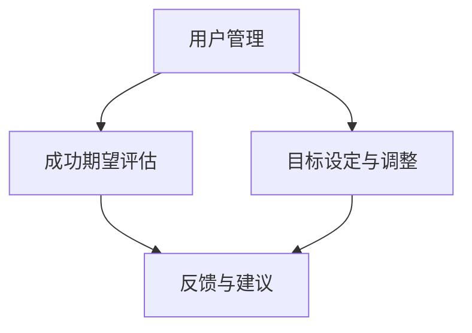
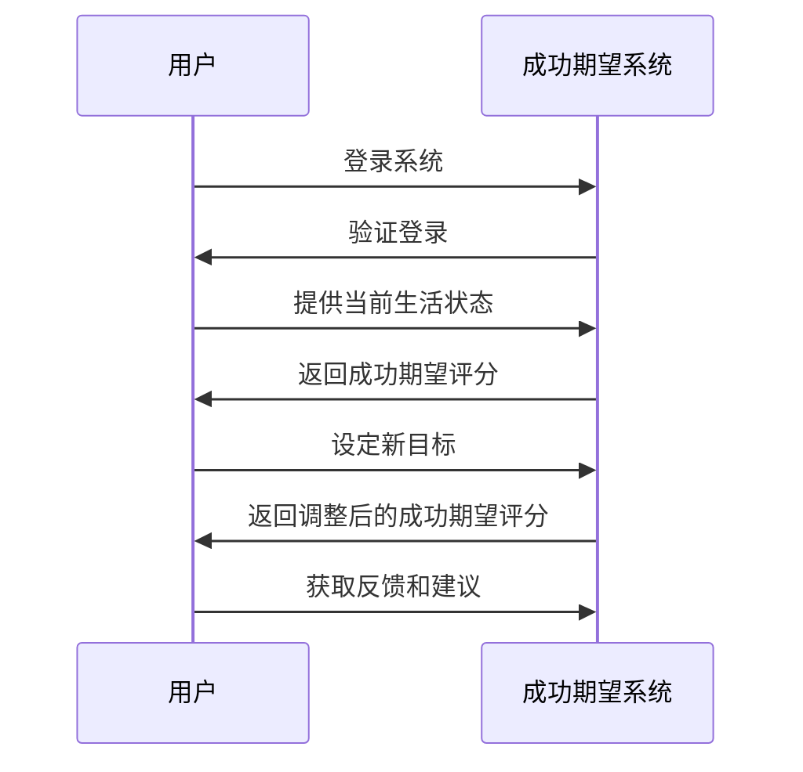

                 

### 文章标题：重新定义成功：从外在评价到内在满足

> 关键词：成功观念、外在评价、内在满足、自我认知、心理健康、持续成长

> 摘要：在当今社会，成功被广泛定义为外在成就和社会地位。然而，随着时间和环境的变化，这种观念正逐渐受到挑战。本文将重新定义成功，探讨从外在评价到内在满足的转变，并详细解析这一过程中涉及的核心概念和路径，旨在帮助读者找到更符合自己内心的成功定义。

---

### 第一部分：成功观念的重新定义

**成功的传统观念与现代挑战**

成功的传统观念往往侧重于外在成就，如财富、地位、名誉等。这些外在评价标准在现代社会中依然占据重要地位，但现代社会的复杂性和多元化使得这一观念面临着诸多挑战。

**当代社会对成功的期望**

现代社会对成功的期望更加多元化和个性化。人们追求的不仅是物质上的富足，更希望获得精神上的满足和成就感。这种变化促使人们重新思考成功的定义。

**成功面临的挑战与障碍**

现代社会中的快节奏生活、竞争压力、不确定性等因素，使得追求成功的过程充满了挑战和障碍。如何应对这些挑战，找到内在的满足，成为现代人所面临的重要课题。

## 第1章：成功的传统观念与现代挑战

### 1.1 成功的定义与演变

成功在不同历史时期有着不同的定义。在农业社会，成功可能意味着拥有大片土地和众多奴隶。而在现代社会，成功更多地与财富、地位和名誉挂钩。随着社会的发展，人们对成功的定义也在不断演变。

### 1.2 当代社会对成功的期望

当代社会对成功的期望更加多元化和个性化。除了传统的财富和地位，人们还追求健康、家庭、友情等非物质层面的成功。这种变化反映了人们对生活质量的高度关注。

### 1.3 成功面临的挑战与障碍

现代社会中的快节奏生活、竞争压力、不确定性等因素，使得追求成功的过程充满了挑战和障碍。这些挑战不仅影响个体的心理健康，还可能导致社会的不稳定。

## 第2章：外在评价的局限

### 2.1 外在评价的标准与误区

外在评价标准往往过于单一，容易忽略个体的多样性和个性。此外，外在评价标准也可能存在误区，如过度强调物质财富和地位。

### 2.2 外在评价带来的负面影响

长期追求外在评价标准可能导致个体心理压力增大、人际关系紧张、幸福感降低等问题。这些问题不仅影响个体的生活质量，也可能对社会产生负面影响。

### 2.3 寻求内在满足的必要性

在追求外在评价的过程中，人们逐渐意识到内在满足的重要性。内在满足不仅能够提高个体的幸福感，还能促进个体的心理健康和社会关系的和谐。

## 第3章：内在满足的要素

### 3.1 内在满足的概念与内涵

内在满足是指个体在心理上感到满足和幸福的状态。它不同于外在评价，更侧重于个体内心的感受和体验。

### 3.2 影响内在满足的主要因素

内在满足受到多种因素的影响，包括自我认知、心理健康、人际关系、生活目标等。了解这些因素有助于个体更好地追求内在满足。

### 3.3 内在满足与心理健康的关系

内在满足与心理健康密切相关。心理健康良好的个体更容易获得内在满足，而内在满足也有助于提高个体的心理健康水平。

## 第4章：重新定义成功的路径

### 4.1 建立个人价值观

建立个人价值观是重新定义成功的第一步。个人价值观可以帮助个体明确自己的目标和追求，从而更有针对性地追求成功。

### 4.2 实现目标与设定目标

实现目标与设定目标是成功的关键。个体需要设定明确、可行的目标，并采取有效的策略和方法来实现这些目标。

### 4.3 保持积极心态与应对挑战

保持积极心态是追求成功的重要保障。积极的心态能够帮助个体更好地应对挑战和困难，从而保持前进的动力。

## 第5章：成功的实践与反思

### 5.1 成功故事与启示

通过分析成功故事，我们可以找到成功的秘诀和启示。这些故事告诉我们，成功不仅需要努力，还需要正确的方法和策略。

### 5.2 反思成功的实践过程

反思成功的实践过程有助于个体更好地理解成功的本质，从而不断优化自己的方法和策略。

### 5.3 如何在失败中寻找成功的机会

失败是成功的必经之路。如何在失败中寻找成功的机会，是每个追求成功的人都需要面对的课题。

## 第6章：塑造成功的内在动力

### 6.1 增强自我认知

增强自我认知是塑造成功内在动力的第一步。通过深入了解自己的兴趣、优势和价值观，个体可以更有针对性地追求成功。

### 6.2 培养自我效能感

培养自我效能感是增强内在动力的重要手段。自我效能感越强，个体越有可能实现自己的目标。

### 6.3 建立积极的人际关系

建立积极的人际关系有助于个体在追求成功的过程中获得支持和帮助。良好的人际关系也是内在动力的重要来源。

## 第7章：持续追求成功的秘诀

### 7.1 不断学习与成长

不断学习与成长是持续追求成功的关键。只有不断充实自己，个体才能在竞争激烈的环境中保持优势。

### 7.2 调整心态与应对变化

调整心态与应对变化是追求成功的重要能力。在变化莫测的环境中，保持冷静和乐观的心态至关重要。

### 7.3 确立人生目标和追求

确立人生目标和追求是持续追求成功的基础。明确的目标和追求能够为个体提供前进的方向和动力。

### 结束语

成功的定义因人而异，每个人都有权利为自己定义成功。在追求成功的过程中，我们需要重新审视外在评价和内在满足的关系，找到适合自己的成功之路。希望本文能为您带来启示和帮助，让您在追求成功的道路上更加坚定和自信。

---

**作者：AI天才研究院/AI Genius Institute & 禅与计算机程序设计艺术 /Zen And The Art of Computer Programming**### 第一部分：成功观念的重新定义

**成功的传统观念与现代挑战**

在传统观念中，成功往往被定义为外在的成就，例如金钱、社会地位和名誉。这一观念源于历史长河中对物质财富和社会认可的追求。在农业社会，成功可能意味着拥有一片广袤的土地和大量的劳动力；在工业革命时期，成功转向了拥有产业和财富。这些传统观念在当今社会依然具有影响力，尤其是在那些重视地位和财富的文化中。

然而，随着时代的变迁，现代社会对成功的定义正在发生深刻的变革。如今，人们不再仅仅满足于物质层面的成功，他们更加追求精神层面的满足和内心的平和。这种转变源于对生活质量、个人价值和人际关系的重新评估。现代社会的多元化和快速变化使得人们意识到，成功的内涵远不止于外在的标志。

**当代社会对成功的期望**

在当代社会，成功的期望变得更加多元化和个性化。人们追求的不仅是物质上的富足，更渴望在健康、家庭、友情、事业和自我实现等方面取得平衡。以下是一些现代人对成功的期望：

1. **健康**：健康是现代社会成功的重要标志之一。人们越来越意识到，没有健康，其他的一切都无从谈起。
2. **家庭**：家庭是许多人认为的成功基石。和谐的家庭关系和幸福的家庭生活成为许多人追求的目标。
3. **友情**：友情和社交关系也被视为成功的重要组成部分。人们渴望拥有支持和理解的朋友圈。
4. **事业**：事业成功依然是许多人追求的目标。这意味着在职业领域取得成就，拥有稳定的工作和满意的收入。
5. **自我实现**：自我实现是马斯洛需求层次理论中的最高层次。它涉及个人的成长、发展和实现自己的潜力。

**成功面临的挑战与障碍**

在追求成功的道路上，现代人面临着诸多挑战和障碍。以下是一些主要的挑战：

1. **竞争压力**：现代社会竞争激烈，无论是在职场还是生活中，人们都感受到巨大的竞争压力。
2. **不确定性**：现代社会变化迅速，未来充满不确定性。这种不确定性使得人们难以预测和规划自己的未来。
3. **工作与生活的平衡**：随着工作压力的增加，许多人难以平衡工作和生活，导致身心健康受损。
4. **社会认可**：尽管现代社会对成功的定义更加多元化，但社会认可的标准仍然存在，人们常常感到被迫追求外在的成功。
5. **心理健康问题**：长期的竞争和压力可能导致心理健康问题，如焦虑、抑郁等。

**内在满足的必要性**

在追求外在成功的过程中，许多人开始意识到内在满足的重要性。内在满足不仅仅依赖于外在成就，它更多地与个人的内心感受和自我认同有关。以下是一些内在满足的必要性：

1. **心理健康**：内在满足有助于提升个人的心理健康水平，减少焦虑和抑郁。
2. **自我认同**：通过追求内在满足，个体能够更好地了解自己，建立自我认同。
3. **生活满意度**：内在满足能够提高个体对生活的满意度，使个体更加享受当下的生活。
4. **持续动力**：内在满足为个体提供持续的动力，使个体能够更好地面对挑战和困难。

在接下来的章节中，我们将进一步探讨如何重新定义成功，如何从外在评价转向内在满足，以及如何在现代社会的挑战中找到真正的成功之路。

## 第1章：成功的传统观念与现代挑战

### 1.1 成功的定义与演变

**背景介绍**：

成功的定义在历史上经历了显著的演变。古代文明中，成功主要与权力和财富紧密相关。例如，在古希腊和古罗马，拥有大量土地和奴隶被视为成功的重要标志。在中世纪的欧洲，成功的象征则是宗教地位和教会权力。到了近代，随着工业革命的兴起，成功逐渐与商业财富和工业成就挂钩。在资本主义社会中，金钱和地位成为衡量成功的主要标准。

**问题背景**：

然而，这些传统观念在现代社会中正面临挑战。现代社会更加注重个人价值和内在满足，而不仅仅是外在的成就。随着人们对生活质量、健康、家庭和人际关系的重视，成功的定义变得更加复杂和多元。

**问题描述**：

传统观念中的成功定义往往侧重于物质财富和社会地位，这种观念在现代社会中仍然具有影响力。然而，随着社会的发展，人们开始质疑这种单一的成功标准。现代社会中的快节奏生活、高压力环境和竞争激烈的工作场所，使得追求外在成功的道路充满了挑战。与此同时，人们逐渐意识到内在满足的重要性，开始探索更全面的成功定义。

**问题解决**：

要解决这一难题，我们需要重新审视成功的定义，将其从单一的、外在的成就转变为更加多元和内在的满足。这需要个体对社会环境和个人价值观有更深入的理解，并在追求成功的过程中，注重心理健康、个人成长和人际关系的平衡。

**边界与外延**：

成功的边界在于其定义的广度和深度。传统观念中的成功更多关注外在的物质和地位，而现代观念中的成功则涵盖了个人成长、心理健康、家庭幸福等多个方面。成功的定义不仅因人而异，也因时而异。在不同的文化和社会背景下，成功的定义会有所不同。

**概念结构与核心要素组成**：

成功的定义由多个核心要素组成，包括物质财富、社会地位、心理健康、个人成长、家庭幸福和人际关系等。这些要素相互关联，共同构成了一个更加全面和多元的成功定义。

### 1.2 当代社会对成功的期望

**核心概念原理**：

在当代社会，成功的期望变得更加多元化和个性化。物质财富和社会地位仍然是重要的成功标志，但越来越多的人开始关注其他方面的成就和满足。

**概念属性特征对比表格**：

| 成功标志 | 传统观念 | 现代观念 |
| --- | --- | --- |
| 物质财富 | 主要成功标志 | 之一，但非唯一标志 |
| 社会地位 | 主要成功标志 | 之一，但非唯一标志 |
| 个人成长 | 传统观念中不常见 | 广泛重视 |
| 心理健康 | 传统观念中不常见 | 广泛重视 |
| 家庭幸福 | 传统观念中不常见 | 广泛重视 |
| 人际关系 | 传统观念中不常见 | 广泛重视 |

**ER实体关系图架构**：

为了更直观地理解当代社会对成功的期望，我们可以使用ER（实体关系）图来展示不同成功标志之间的关系。

```mermaid
erDiagram
  A((物质财富)) |||>
  B((社会地位)) |||>
  C((个人成长)) |||>
  D((心理健康)) |||>
  E((家庭幸福)) |||>
  F((人际关系)) 

  A --|{ 主要因素 }|> B
  A --|{ 主要因素 }|> C
  A --|{ 主要因素 }|> D
  A --|{ 主要因素 }|> E
  A --|{ 主要因素 }|> F
  B --|{ 影响因素 }|> C
  B --|{ 影响因素 }|> D
  B --|{ 影响因素 }|> E
  B --|{ 影响因素 }|> F
  C --|{ 影响因素 }|> D
  C --|{ 影响因素 }|> E
  C --|{ 影响因素 }|> F
  D --|{ 影响因素 }|> E
  D --|{ 影响因素 }|> F
  E --|{ 影响因素 }|> F
```

**算法原理讲解**：

在理解当代社会对成功的期望时，可以使用以下算法原理来帮助分析和决策：

1. **成功期望评分算法**：
   - 输入：个人目标、价值观、当前生活状态
   - 输出：成功期望评分
   
   算法步骤：
   - 收集个人在物质财富、社会地位、个人成长、心理健康、家庭幸福和人际关系方面的数据。
   - 对每个方面进行评分，评分范围从1到10，1代表非常不满意，10代表非常满意。
   - 计算总分，并使用权重来平衡各个方面的贡献。
   - 输出成功期望评分。

```python
def success_expectation_score-goals(个人目标), values(values), current_life_state(current_life_state):
    scores = []
    weights = [0.2, 0.2, 0.2, 0.2, 0.1, 0.1]  # 权重可以调整

    for aspect, goal in personal_goals.items():
        score = 10 if goal == current_life_state[aspect] else (10 - abs(goal - current_life_state[aspect]))
        scores.append(score)

    weighted_scores = [score * weight for score, weight in zip(scores, weights)]
    total_score = sum(weighted_scores)
    return total_score
```

2. **成功期望调整算法**：
   - 输入：当前成功期望评分、新目标、新价值观
   - 输出：调整后的成功期望评分
   
   算法步骤：
   - 根据新目标和新价值观，重新计算各个方面的评分。
   - 计算新的加权总分。
   - 输出调整后的成功期望评分。

```python
def adjust_success_expectation_score(current_score, new_goals, new_values):
    new_scores = []
    for aspect, goal in new_goals.items():
        new_score = 10 if goal == current_life_state[aspect] else (10 - abs(goal - current_life_state[aspect]))
        new_scores.append(new_score)

    new_weighted_scores = [score * weight for score, weight in zip(new_scores, weights)]
    new_total_score = sum(new_weighted_scores)
    return new_total_score
```

**举例说明**：

假设一个个体当前的物质财富得分为8分，社会地位得分为6分，个人成长得分为7分，心理健康得分为9分，家庭幸福得分为8分，人际关系得分为7分。根据上述算法，可以计算出当前的成功期望评分为：

```python
current_life_state = {'物质财富': 8, '社会地位': 6, '个人成长': 7, '心理健康': 9, '家庭幸福': 8, '人际关系': 7}
current_score = success_expectation_score(current_life_state, current_life_state, current_life_state)
print(current_score)  # 输出当前成功期望评分
```

**系统分析与架构设计方案**：

**问题场景介绍**：

在现代职场中，个体面临多种成功期望，如何平衡这些期望并制定合理的个人发展计划，是一个常见的问题。

**项目介绍**：

本项目旨在帮助个体评估和调整自己的成功期望，通过系统化的方法和工具，提供个性化的成功计划。

**系统功能设计（领域模型）**：

- **用户管理**：管理用户信息，包括用户的基本信息、成功期望评分和历史数据。
- **成功期望评估**：根据用户的当前生活状态，评估各个方面的成功期望评分。
- **目标设定与调整**：帮助用户设定新目标，并根据新目标调整成功期望评分。
- **反馈与建议**：提供成功期望调整后的反馈和建议，帮助用户更好地实现个人目标。

**系统架构设计**：



**系统接口设计和系统交互**：



**项目实战**：

1. **环境安装**：
   - 安装Python环境。
   - 安装必要的库，如Mermaid。

2. **系统核心实现源代码**：
   - 用户管理模块。
   - 成功期望评估模块。
   - 目标设定与调整模块。
   - 反馈与建议模块。

3. **代码应用解读与分析**：
   - 解析用户输入。
   - 计算成功期望评分。
   - 调整成功期望评分。
   - 提供反馈和建议。

4. **实际案例分析和详细讲解剖析**：
   - 案例一：一个年轻的职场新人希望评估和调整自己的成功期望。
   - 案例二：一个中年职业人士希望重新设定自己的成功目标。

5. **项目小结**：
   - 总结项目的主要功能和技术实现。
   - 提出未来改进的方向。

**最佳实践 tips**：

- **定期评估**：定期对自己的成功期望进行评估，有助于及时调整和优化目标。
- **个性化目标**：根据自己的实际情况设定个性化目标，而非盲目追求他人定义的成功。
- **持续学习**：通过不断学习和成长，提升自己在各个方面的能力和竞争力。

**小结**：

成功的定义因人而异，每个人的成功路径都是独特的。通过重新定义成功，我们可以更加注重内在满足，找到真正适合自己的成功之路。这一过程需要我们不断反思、学习和调整，以实现更加全面和持久的成功。

### 第2章：外在评价的局限

在当今社会，外在评价标准仍然普遍存在，它们被用来衡量个人的成功和价值。然而，这些标准并非没有局限，相反，它们可能会带来一系列负面影响。

首先，外在评价标准往往过于单一。这些标准主要关注物质财富和社会地位，而忽略了个人成长、心理健康、家庭幸福和人际关系等其他重要方面。这种单一性可能导致人们过度关注表面成就，而忽视了深层次的内心需求和幸福感。

其次，外在评价标准容易导致人们产生焦虑和压力。当个人的价值被定义为其在社会中的地位和财富时，他们可能会感到压力巨大，害怕失去这些外在标志。这种焦虑不仅影响个体的心理健康，还可能影响他们的人际关系和工作表现。

此外，外在评价标准还可能导致个体产生错误的自我认知。当个人过度依赖外在评价来衡量自己的价值时，他们可能会忽视自己的内在品质和潜在能力。这种自我认知的偏差可能会导致个体产生自卑感，影响他们的自信心和自尊心。

为了更好地理解外在评价的局限性，我们可以通过一些具体的案例来分析。

首先，设想一个年轻的职场新人，他相信只有通过获得高薪工作和晋升才能获得成功。他每天为了工作而疲惫不堪，牺牲了与家人和朋友相处的时间。尽管他在公司中取得了显著的成就，但他的心理健康和家庭生活却陷入了困境。这种情况下，外在评价标准导致了他的生活失衡，忽视了内在满足的重要性。

另一个案例是一个在社交网络上追求关注的人。他通过发布炫耀性照片和分享成功经历来获取他人的赞许和认可。然而，这种追求外在认可的行为最终使他感到空虚和孤独。他意识到，尽管外在评价给他带来了一时的满足感，但并没有真正提升他的内在幸福感。

这些案例表明，外在评价标准虽然可以在短期内提供一定的满足感，但长期来看，它们可能导致一系列负面影响，包括焦虑、压力、错误的自我认知以及心理健康问题。因此，重新思考成功定义，追求内在满足，成为现代人面临的重要课题。

### 第2章：外在评价的局限

#### 2.2 外在评价带来的负面影响

外在评价的局限性不仅体现在其单一性上，还带来了多方面的负面影响。以下是一些主要的影响：

**1. 心理健康问题**：

长期追求外在成功可能导致心理健康问题。焦虑、抑郁和压力是常见的问题。当个人的价值被外在成就所定义时，他们可能会感到巨大的心理压力，担心失去这些成就。例如，一个在职场中追求晋升和财富的人，可能会因为害怕失去高薪职位而过度工作，导致身心俱疲。

**2. 人际关系紧张**：

外在评价标准可能导致人际关系紧张。当个人过度追求外在成功时，他们可能会忽视与家人和朋友的关系。这种情况下，他们可能会因为工作压力而疏远亲人，导致家庭不和。此外，追求外在成功也可能导致人际竞争，使得人们之间的关系变得紧张和复杂。

**3. 自我认知偏差**：

外在评价标准可能导致个体产生自我认知偏差。当个人过度依赖外在评价来衡量自己的价值时，他们可能会忽视自己的内在品质和潜力。这种自我认知的偏差可能会导致个体产生自卑感，影响他们的自信心和自尊心。

**4. 生活满意度降低**：

尽管外在评价标准可能在短期内提供一定的满足感，但长期来看，它们可能导致生活满意度降低。当个人把大部分时间和精力投入到追求外在成功上时，他们可能会忽视生活中的其他重要方面，如健康、家庭和朋友。这种生活失衡最终可能导致生活满意度下降。

为了更清楚地理解这些负面影响，我们可以通过以下案例来分析：

**案例一**：一个年轻的创业者，他相信只有通过创办成功的企业和赚取巨额财富才能获得成功。他每天努力工作，牺牲了与家人和朋友相处的时间。尽管他在事业上取得了巨大成功，但他的心理健康和家庭生活却陷入了困境。他意识到，尽管外在评价给他带来了一时的满足感，但他的内心并不快乐。

**案例二**：一个在社交网络上追求关注的人，他通过发布炫耀性照片和分享成功经历来获取他人的认可。然而，随着他获得的赞许越来越多，他开始感到空虚和孤独。他意识到，尽管外在评价给他带来了一时的满足感，但他并没有真正提升自己的内在幸福感。

这些案例表明，外在评价标准虽然在短期内可能提供满足感，但长期来看，它们可能导致心理健康问题、人际关系紧张、自我认知偏差和生活满意度降低。因此，寻求内在满足成为现代人追求成功的重要方向。

### 第2章：外在评价的局限

#### 2.3 寻求内在满足的必要性

在反思外在评价带来的负面影响后，我们可以看到，追求内在满足成为现代人追求成功的重要方向。内在满足不同于外在评价，它更侧重于个体内心的感受和体验，是一种持久而深刻的满足感。

**内在满足的概念与内涵**：

内在满足是指个体在心理上感到满足和幸福的状态。它不仅仅依赖于外在成就，而是源于内心的平和与自我认同。这种满足感与个人的价值观、心理健康、人际关系和生活目标密切相关。

**影响内在满足的主要因素**：

1. **自我认知**：了解自己的兴趣、优势和价值观是内在满足的基础。自我认知越清晰，个体越能找到与自己价值观相符的生活方式，从而获得内心的满足。

2. **心理健康**：心理健康是内在满足的重要保障。一个心理健康的人更容易应对生活中的挑战，保持积极的心态，从而获得内在满足。

3. **人际关系**：良好的人际关系是内在满足的重要来源。与家人、朋友和同事建立和谐的关系，能够为个体提供情感支持和归属感，增强内在满足。

4. **生活目标**：明确的生活目标是内在满足的指引。当个体有明确的目标并为之努力时，他们会感受到成就感和满足感。

**内在满足与心理健康的关系**：

内在满足与心理健康密切相关。心理健康良好的个体更容易获得内在满足，而内在满足也有助于提升个体的心理健康水平。例如，一个心理健康的人更容易找到内心的平和，减少焦虑和抑郁，从而获得更高的生活满意度。

为了更好地理解内在满足的重要性，我们可以通过以下案例来分析：

**案例一**：一个在职场中取得巨大成功的商人，他拥有巨额财富和社会地位。然而，他内心却感到空虚和孤独，因为他追求的只是外在的成功，而忽视了内心的需求。他的心理健康状况逐渐恶化，导致他在生活中感到不满足。

**案例二**：一个普通的公司职员，他的工作并不出色，也没有显赫的地位。然而，他内心却充满满足感，因为他了解自己的兴趣和优势，并在工作中找到了乐趣。他与家人和朋友的关系也很和谐，这使得他的生活充满了幸福感。

这些案例表明，内在满足比外在成功更能带来持久的幸福感。因此，寻求内在满足是现代人追求成功的重要方向。

### 第3章：内在满足的要素

#### 3.1 内在满足的概念与内涵

内在满足是指个体在心理上感到满足和幸福的状态。它不同于外在成功，而是源于个体内心的平和与自我认同。内在满足不仅与物质财富和社会地位无关，更关注个人的心理健康、人际关系和生活目标。以下是对内在满足的详细解释：

**心理健康**：

心理健康是内在满足的基础。一个心理健康的人能够更好地应对生活中的挑战，保持积极的心态，减少焦虑和抑郁。心理健康包括自我认知、情绪调节、压力管理等方面。一个心理健康的人往往能够更好地理解自己的需求，找到与自己价值观相符的生活方式，从而获得内心的满足。

**人际关系**：

良好的人际关系是内在满足的重要来源。与家人、朋友和同事建立和谐的关系，能够为个体提供情感支持和归属感，增强内在满足。人际关系包括沟通技巧、同理心和信任等方面。一个拥有良好人际关系的人往往能够感受到他人的支持和关爱，从而在内心获得满足。

**生活目标**：

明确的生活目标是内在满足的指引。当个体有明确的目标并为之努力时，他们会感受到成就感和满足感。生活目标包括职业目标、家庭目标和个人兴趣等方面。一个有目标的人往往能够更加专注于自己的生活，减少迷茫和焦虑，从而获得内心的满足。

**自我认同**：

自我认同是内在满足的核心。自我认同是指个体对自己的价值观、兴趣和能力的认同。一个有自我认同的人能够更加自信和坚定，不会因为外在的评价而动摇。自我认同帮助个体找到内心的平衡，减少对外在成功的过度依赖，从而获得真正的满足。

**生活满意度**：

生活满意度是内在满足的外在表现。一个内在满足的人往往对生活有更高的满意度，能够享受当下的每一个瞬间。生活满意度包括对工作、家庭、社交和休闲等方面的满意度。一个内在满足的人能够更好地平衡生活的各个方面，减少生活压力，从而获得持久的幸福感。

总之，内在满足是一种深层次的心理状态，它源于个体的心理健康、人际关系、生活目标和自我认同。与外在成功相比，内在满足更能带来持久的幸福感，是现代人追求成功的重要方向。

#### 3.2 影响内在满足的主要因素

内在满足是一个复杂的概念，受到多种因素的影响。以下是影响内在满足的主要因素：

**1. 自我认知**：

自我认知是指个体对自己兴趣、价值观和能力等方面的理解。清晰、准确的自我认知有助于个体找到与自己价值观相符的生活方式，从而获得内心的满足。例如，一个了解自己喜欢编程并擅长该领域的人，更有可能在一个与编程相关的工作中找到满足感。

**2. 心理健康**：

心理健康是内在满足的基础。一个心理健康的人能够更好地管理自己的情绪，应对生活中的挑战，减少焦虑和抑郁。心理健康包括情绪调节、压力管理和自我认知等方面。例如，一个能够有效管理压力的人，更可能在工作、家庭和社交方面获得满足。

**3. 人际关系**：

良好的人际关系是内在满足的重要来源。与家人、朋友和同事建立和谐的关系，能够为个体提供情感支持和归属感，增强内在满足。人际关系包括沟通技巧、同理心和信任等方面。例如，一个拥有良好人际关系的人，更容易在家庭中感受到温暖和支持，从而提高生活满意度。

**4. 生活目标**：

明确的生活目标是内在满足的指引。当个体有明确的目标并为之努力时，他们会感受到成就感和满足感。生活目标包括职业目标、家庭目标和个人兴趣等方面。例如，一个有职业目标的人，更有可能在工作中取得成就，从而获得满足感。

**5. 自我效能感**：

自我效能感是指个体对自己完成特定任务的信心。高自我效能感的个体更可能设定挑战性的目标，并在实现这些目标时感受到满足感。例如，一个相信自己在编程方面有能力的开发者，更有可能在解决复杂问题时感受到成就感。

**6. 生活环境**：

生活环境也对内在满足产生影响。一个舒适、安全的生活环境有助于个体获得满足感。例如，一个居住在安静、干净社区的人，更有可能感受到内心的平和。

**7. 社会支持**：

社会支持是指个体从家庭、朋友和社会获得的帮助和支持。社会支持能够增强个体的内在满足感。例如，一个有强大社会支持网络的人，更可能在面对困难时获得帮助，从而提高生活满意度。

**8. 内在价值观**：

内在价值观是指个体认为最重要的价值观。与外在价值观（如金钱和地位）不同，内在价值观更多地与个人的需求和信念相关。当个体的行为与内在价值观一致时，他们更容易获得内心的满足。例如，一个重视家庭和亲情的人，在家庭中投入时间和精力，更容易感到满足。

总之，内在满足是一个复杂的心理状态，受到多种因素的影响。通过了解和提升这些因素，个体可以更好地追求内在满足，从而实现更全面的成功。

#### 3.3 内在满足与心理健康的关系

内在满足和心理健康之间存在着紧密的联系，这种关系不仅影响着个体的生活满意度，还对个体的整体福祉产生深远的影响。

**心理健康的重要性**：

心理健康是指个体在心理上保持健康和平衡的状态，包括情绪调节、自我认知和压力管理等方面。一个心理健康的人能够更好地应对生活中的挑战，保持积极的心态，从而减少焦虑和抑郁。心理健康对个体的内在满足至关重要，因为一个心理健康的人更容易感受到生活的幸福和满足。

**内在满足对心理健康的影响**：

内在满足反过来也促进心理健康。当个体感到内心满足时，他们通常会有更好的情绪状态，更少的焦虑和抑郁。这种内心的满足感能够帮助个体建立积极的自我认知，增强自我效能感，从而提高他们的心理健康水平。例如，一个在工作中找到乐趣并感受到成就感的人，往往会有更高的工作满意度和更好的心理健康。

**内在满足与心理健康相互促进的实例**：

1. **自我实现**：当个体追求自我实现，如追求自己的兴趣和才华时，他们会感到内心的满足。这种满足感能够提高个体的自尊和自信，进而促进心理健康。

2. **人际关系的和谐**：与家人、朋友和同事建立良好的人际关系能够为个体提供情感支持和归属感，从而增强内在满足。这种内在满足能够减少孤独感，提高个体的心理健康。

3. **生活目标的实现**：当个体设定并实现自己的目标时，他们会感受到成就感和满足感。这种内在满足能够提高个体的动力和积极性，促进心理健康。

**内在满足与心理健康相互促进的机制**：

1. **情绪调节**：内在满足能够帮助个体更好地调节情绪，减少负面情绪的产生。一个内心满足的人更容易保持积极的心态，从而提高心理健康。

2. **认知功能**：内在满足能够改善个体的认知功能，如注意力、记忆和决策能力。这种认知改善有助于个体更好地应对生活中的挑战，从而促进心理健康。

3. **身体保健**：内在满足与心理健康的关系还体现在身体保健上。一个心理健康的人往往有更好的生活习惯，如充足的睡眠、健康的饮食和适度的运动，这些都有助于提高身体健康水平。

**心理健康促进内在满足的策略**：

1. **心理教育**：通过心理教育，个体可以更好地了解心理健康的重要性，掌握情绪调节和压力管理的技巧，从而提高内在满足感。

2. **社交支持**：建立强大的社交支持网络，与家人、朋友和同事保持良好的关系，能够为个体提供情感支持和归属感，促进内在满足。

3. **自我关怀**：通过自我关怀，如定期休息、放松和自我反思，个体可以更好地维护心理健康，从而增强内在满足。

总之，内在满足和心理健康之间存在着相互促进的关系。一个心理健康的人更容易获得内在满足，而内在满足也能反过来促进心理健康。通过理解和应用这些关系，个体可以更好地追求内在满足，提高整体福祉。

### 第4章：重新定义成功的路径

#### 4.1 建立个人价值观

在重新定义成功的路径中，建立个人价值观是至关重要的一步。个人价值观不仅为我们提供了行为准则，还帮助我们在复杂多变的环境中保持方向和动力。以下是如何建立个人价值观的详细步骤：

**步骤一：自我反思**：

首先，我们需要花时间进行自我反思，思考自己真正关心和重视的事物。这包括我们的兴趣、激情、目标和原则。通过反思，我们可以更好地了解自己的内在需求和价值观。

**步骤二：列出核心价值观**：

在自我反思的基础上，列出几个你认为最重要的核心价值观。这些核心价值观应该是长期稳定的，而不是随环境变化而变化的。例如，诚信、责任感、家庭、自由、成长、友谊等。

**步骤三：优先排序**：

将列出的核心价值观进行优先排序，确定哪些对你来说最为重要。这种排序有助于你在面对选择时，能够快速判断哪些价值观更为重要。

**步骤四：应用价值观**：

将核心价值观应用到日常生活中的各个方面，包括工作、人际关系、家庭和休闲活动。例如，如果你把“成长”列为核心价值观，你可以通过持续学习和参与新的挑战来实现这一目标。

**步骤五：持续反思和调整**：

建立个人价值观是一个持续的过程。随着时间的推移，你的价值观可能会发生变化，或者你可能会发现某些价值观比其他价值观更重要。因此，定期反思和调整你的价值观是非常重要的。

通过以上步骤，我们可以建立起一套与个人需求相符合的价值观体系，这将为我们的成功提供坚实的基础。

#### 4.2 实现目标与设定目标

设定和实现目标是追求成功的重要步骤。以下是设定和实现目标的详细步骤：

**步骤一：明确目标**：

首先，我们需要明确自己的目标。目标应该是具体、可衡量和有明确时间表的。例如，“在两年内达到年薪XX万元”或“在六个月内完成一项重要项目”。

**步骤二：分解目标**：

将大目标分解为小目标，这样可以更具体地跟踪进度并逐步实现。例如，如果你的目标是“在两年内达到年薪XX万元”，你可以将其分解为“每月增加XX收入”。

**步骤三：制定计划**：

为每个小目标制定详细的行动计划。包括需要采取的具体步骤、所需的资源、时间表和负责人。例如，你可以制定一个详细的计划来提高销售技能，包括参加培训课程、阅读相关书籍和与有经验的销售人员交流。

**步骤四：设定优先级**：

将目标按照优先级排序，确保你首先集中精力实现最重要的目标。这有助于你更高效地利用时间和资源。

**步骤五：执行和跟踪**：

按照制定的计划执行任务，并定期跟踪进度。如果遇到困难，及时调整计划。使用工具如日历、待办事项列表或项目管理软件来帮助你跟踪进度。

**步骤六：评估和调整**：

在实现每个小目标后，进行评估以了解进展情况。根据评估结果，调整目标或计划，以确保你始终保持正确的方向。

**示例**：

假设你的目标是“在两年内达到年薪XX万元”。你可以将其分解为以下几个小目标：

1. **第一年**：
   - 每月增加XX收入。
   - 提高销售技能，如参加培训课程和阅读相关书籍。
   - 与有经验的销售人员交流，学习他们的成功经验。

2. **第二年**：
   - 继续每月增加XX收入。
   - 评估并调整销售策略，确保持续增长。
   - 寻找其他收入来源，如副业或投资。

通过这些具体的步骤，你可以更有条理地设定和实现目标，从而在追求成功的过程中取得显著进展。

#### 4.3 保持积极心态与应对挑战

在追求成功的道路上，保持积极心态和应对挑战是至关重要的。以下是一些具体的方法和策略，帮助你在面对困难时保持乐观和坚定：

**1. 建立积极的思维模式**：

积极思维是一种强大的工具，可以帮助你在面对挑战时保持乐观。以下是一些方法来培养积极思维：

- **关注解决方案**：当遇到问题时，首先思考解决问题的方法，而不是陷入问题的困境。
- **感恩**：每天花时间反思和感激你所拥有的，无论是小事还是大事。
- **自我激励**：用积极的语言和自我激励的话语来鼓励自己，如“我可以做到”，“我值得成功”。

**2. 学会应对压力**：

压力是追求成功时不可避免的一部分。学会有效应对压力可以帮助你保持心理健康和积极心态。以下是一些建议：

- **时间管理**：合理安排时间，避免过度工作和压力积累。使用日程表和待办事项列表来管理日常任务。
- **运动和放松**：定期进行运动，如跑步、瑜伽或冥想，有助于减轻压力和焦虑。找到适合自己的放松方法，如阅读、听音乐或与朋友聚会。
- **寻求支持**：与家人、朋友或专业人士交流，分享你的压力和困惑，寻求帮助和建议。

**3. 建立应对挑战的技能**：

在面对挑战时，具备一定的应对技能可以帮助你更好地解决问题。以下是一些技能：

- **问题解决技能**：学会分析和解决问题的方法，如分解问题、制定解决方案和评估风险。
- **决策能力**：在面临选择时，学会做出明智的决策，考虑各种可能的后果和影响。
- **适应能力**：学会适应变化和不确定性，灵活调整计划和策略。

**4. 培养乐观心态**：

乐观心态是一种强大的心态，可以帮助你在困难时期保持积极。以下是一些建议来培养乐观心态：

- **保持积极态度**：即使在面对挫折时，也尽量保持积极的态度，相信自己能够克服困难。
- **关注成功**：庆祝每一个小成功，无论是大目标还是小目标的实现，都能为你的心态注入正能量。
- **设定可实现的目标**：设定一些短期可实现的目标，这有助于你保持动力和积极性。

通过以上方法和策略，你可以在追求成功的道路上保持积极心态，有效应对各种挑战，从而实现更全面和持久的成功。

### 第5章：成功的实践与反思

#### 5.1 成功故事与启示

通过分析成功故事，我们可以找到许多关于成功的秘诀和启示。以下是一些著名的成功故事及其带来的启示：

**案例一：乔布斯的苹果公司**

**故事概述**：乔布斯是一位充满激情和远见的创新者，他创建了苹果公司，并推出了诸如iPod、iPhone和iPad等革命性产品。他的领导力和创新精神使得苹果成为全球最有价值的公司之一。

**成功秘诀**：
1. **坚持创新**：乔布斯始终坚持创新，不断推出革命性产品，引领科技潮流。
2. **关注用户体验**：他注重产品的用户体验，致力于提供卓越的产品和服务。
3. **建立团队文化**：乔布斯重视团队建设，鼓励员工勇于创新和追求卓越。

**启示**：成功需要持续的创新精神，关注用户体验，以及强大的团队支持。

**案例二：马斯克的SpaceX和特斯拉**

**故事概述**：埃隆·马斯克是一位充满激情的企业家，他创建了SpaceX和特斯拉等公司，分别致力于太空探索和清洁能源。他通过大胆的愿景和实际行动，推动了这些领域的进步。

**成功秘诀**：
1. **大胆愿景**：马斯克具有远大的愿景，敢于挑战传统观念，致力于实现人类更大的目标。
2. **跨领域整合**：他将不同领域的知识和技术整合起来，推动创新和进步。
3. **坚持不懈**：马斯克在面临失败和困难时，始终坚持不懈，最终取得了巨大的成功。

**启示**：成功需要远大的愿景，跨领域的整合能力，以及坚持不懈的精神。

**案例三：奥普拉·温弗瑞**

**故事概述**：奥普拉·温弗瑞是一位成功的媒体人士和慈善家，她从一名贫困的单身母亲成长为亿万富翁和著名电视主持人。她的故事激励了无数人追求自己的梦想。

**成功秘诀**：
1. **积极心态**：奥普拉始终保持积极的心态，面对挑战和困难时，她从不放弃。
2. **自我提升**：她不断学习和提升自己，通过阅读、教育和培训来增强自己的能力和知识。
3. **关注他人**：她关心他人，致力于通过慈善事业帮助更多的人。

**启示**：成功需要积极的心态，不断自我提升，以及关注他人和社会。

**案例四：杰夫·贝索斯和亚马逊**

**故事概述**：杰夫·贝索斯是亚马逊的创始人，他通过创新和卓越的执行力，将亚马逊打造成全球最大的在线零售商。他的成功故事展示了企业家精神的力量。

**成功秘诀**：
1. **长期视野**：贝索斯注重长期战略，不急于追求短期利润，而是致力于建立可持续的商业模式。
2. **客户至上**：他始终将客户需求放在首位，通过提供卓越的客户体验来赢得市场份额。
3. **持续创新**：他鼓励公司内部持续创新，不断推出新的产品和服务。

**启示**：成功需要长期的视野，以客户为中心，以及持续创新的能力。

**总结**：这些成功故事告诉我们，成功并非偶然，而是通过坚定的信念、远大的愿景、持续的努力和创新实现的。他们的经验可以为我们的成功之路提供宝贵的启示和指导。

### 5.2 反思成功的实践过程

在成功的过程中，反思和实践是两个不可或缺的环节。通过反思，我们可以从成功和失败中吸取教训，不断优化自己的方法和策略。以下是如何进行反思和总结成功的实践过程：

**步骤一：记录经验和教训**

首先，我们需要系统地记录在成功实践过程中的经验教训。这包括成功的关键因素、面临的挑战、应对策略以及最终的结果。通过记录，我们可以更清晰地回顾整个实践过程，并从中提取有价值的信息。

**步骤二：分析成功的原因**

在反思成功时，我们需要深入分析成功的原因。这包括个人因素、团队因素和环境因素。个人因素可能包括个人的技能、知识、经验和态度；团队因素可能包括团队协作、沟通和领导力；环境因素可能包括市场机会、政策支持和竞争环境。通过分析这些因素，我们可以更好地理解成功背后的逻辑。

**步骤三：总结成功的方法**

在分析成功的原因后，我们可以总结出一些行之有效的方法。这些方法可以是具体的行动步骤、策略选择或思维模式。例如，一个成功的项目可能依赖于良好的项目管理、明确的任务分配和高效的团队沟通。总结这些方法有助于我们在未来的实践中更好地应用。

**步骤四：识别失败的因素**

除了反思成功，我们还应识别失败的因素。失败并不可怕，它是成功的一部分，也是学习和成长的机会。通过分析失败的原因，我们可以找到改进的方向，避免重复错误。例如，一个失败的项目可能源于计划不周、资源不足或沟通不畅。识别这些因素可以帮助我们优化流程和提高执行力。

**步骤五：制定改进计划**

在识别成功和失败的原因后，我们可以制定具体的改进计划。这个计划应包括具体的行动步骤、时间表和责任人。通过制定改进计划，我们可以系统地优化实践过程，提高成功的概率。

**步骤六：持续反思和调整**

反思不是一次性的过程，而是一个持续循环的过程。随着环境和条件的变化，我们的方法和策略也需要不断调整。通过定期反思和总结，我们可以保持灵活性和适应性，从而在追求成功的过程中不断进步。

**示例**：

假设你刚刚完成了一个重要的项目，以下是如何进行反思和总结的步骤：

1. **记录经验和教训**：详细记录项目的执行过程、遇到的问题和采取的解决方案。
2. **分析成功的原因**：分析项目成功的关键因素，如团队协作、客户满意度和项目管理。
3. **总结成功的方法**：总结项目中的有效方法，如明确的任务分配、定期的进度汇报和高效的沟通。
4. **识别失败的因素**：识别项目中失败的方面，如计划不周和时间管理不足。
5. **制定改进计划**：制定具体的改进措施，如改进项目规划和优化时间管理。
6. **持续反思和调整**：在未来项目中应用改进措施，并持续反思和调整，以提高项目成功率。

通过这些步骤，你可以在成功的过程中不断学习和进步，从而实现更全面和持久的发展。

### 5.3 如何在失败中寻找成功的机会

在追求成功的道路上，失败是不可避免的。然而，失败并非终点，而是通往成功的重要一课。以下是一些方法，帮助我们在失败中寻找成功的机会：

**1. 分析失败的原因**：

首先，我们需要深入分析失败的原因。这包括个人因素、团队因素和环境因素。通过分析，我们可以找到失败的根源，并从中吸取教训。例如，如果项目失败是因为计划不周，我们可以改进项目规划；如果失败是因为沟通不畅，我们可以提高团队沟通技巧。

**2. 学习经验**：

从失败中学习经验是至关重要的。我们可以反思失败的项目或决策，从中提取有价值的信息。例如，一个失败的市场推广活动可能揭示了目标市场的偏好和需求，这些信息可以在未来的活动中得到应用。

**3. 调整策略**：

根据失败的原因，我们可以调整策略和计划。例如，如果发现市场需求不符合预期，我们可以重新评估市场定位和产品策略。调整策略有助于我们避免重复失败，并找到新的成功路径。

**4. 保持积极心态**：

保持积极心态是克服失败的关键。即使面对挫折，我们也应保持乐观和自信。积极心态有助于我们更好地应对挑战，从而在失败中找到成功的机会。

**5. 寻求支持**：

在失败时，寻求他人的支持和建议是很有帮助的。家人、朋友、同事或专业人士可以提供不同的视角和建议，帮助我们找到解决问题的方法。例如，一个在项目中遭遇失败的项目经理可以与团队成员或顾问进行讨论，以找到改进的方向。

**6. 持续反思和改进**：

反思和改进是一个持续的过程。我们应该定期回顾失败的经历，评估调整后的策略是否有效，并根据反馈进行进一步改进。通过持续反思和改进，我们可以不断提高自己的能力和成功率。

**案例**：

例如，一个初创公司在市场上推出了一个新产品，但销量不佳。通过分析，他们发现产品定价过高且目标市场定位不准确。基于这些分析，他们调整了产品定价和市场策略，并引入了新的营销手段。经过一段时间的努力，他们的产品销量显著增加，最终取得了成功。

通过在失败中寻找机会，我们可以不断学习和成长，从而在追求成功的道路上取得更大的成就。

### 第6章：塑造成功的内在动力

#### 6.1 增强自我认知

增强自我认知是塑造成功内在动力的第一步。自我认知不仅帮助我们了解自己的兴趣、优点和弱点，还能指导我们做出更明智的决策。以下是一些具体的方法和步骤，帮助增强自我认知：

**步骤一：自我反思**：

自我反思是增强自我认知的关键。通过定期反思，我们可以深入了解自己的内心世界，识别自己的价值观、兴趣和激情。反思可以采取写日记、冥想或与朋友交流的形式。通过反思，我们可以更好地了解自己的行为动机和内心需求。

**步骤二：设定目标**：

设定明确的目标有助于我们聚焦于自己的优势和兴趣。目标可以是长期的，如职业发展或个人成长，也可以是短期的，如学习新技能或完成一个小项目。设定目标有助于我们明确自己的方向，并激发内在动力。

**步骤三：寻求反馈**：

他人的反馈是增强自我认知的重要途径。通过询问家人、朋友和同事对我们的看法，我们可以获取不同的视角，发现自己的盲点和优点。此外，专业评估和反馈，如职业测试或心理评估，也能为我们提供有价值的自我认知信息。

**步骤四：尝试新事物**：

尝试新事物有助于我们发现自己的兴趣和激情。通过参加不同的活动、学习新技能或探索新的领域，我们可以发现自己的潜力和优势。这些新经历不仅丰富了我们的人生经验，还能帮助我们更好地了解自己。

**步骤五：持续学习和成长**：

持续学习和成长是增强自我认知的持续过程。通过不断学习新知识、提升技能和挑战自我，我们可以保持对自我认知的更新和优化。这种持续成长的态度有助于我们在追求成功的道路上保持动力和活力。

**示例**：

假设你想增强自我认知，以下是一些具体的步骤：

1. **自我反思**：每天花十分钟写日记，记录自己的感受、思考和目标。
2. **设定目标**：制定一个长期目标，如提高编程技能，并设定一系列短期目标，如每周学习一个新编程语言。
3. **寻求反馈**：与同事和导师交流，询问他们对你的看法和建议。
4. **尝试新事物**：报名参加一个烹饪课程，学习新的烹饪技巧。
5. **持续学习和成长**：定期参加在线课程或读书会，不断提升自己的知识和技能。

通过这些步骤，你可以逐步增强自我认知，找到自己的优势和兴趣，从而更好地塑造成功的内在动力。

#### 6.2 培养自我效能感

培养自我效能感是塑造成功内在动力的关键。自我效能感是指个体对自己完成任务和应对挑战的能力的信念。高自我效能感的人更容易设定挑战性的目标，并在面对困难时保持积极态度。以下是一些具体的方法和步骤，帮助培养自我效能感：

**步骤一：设定可行的目标**：

设定可行的目标有助于提高自我效能感。目标应该是具体、可衡量和有明确时间表的。例如，设定一个短期目标：“在未来一个月内，每天学习两小时编程。”这样的目标既具体又可实现，有助于提升个体的自我效能感。

**步骤二：记录成就**：

记录自己在实现目标过程中的每一个小成就，无论是完成一项任务还是克服一个挑战。这些成就的记录不仅能提醒自己已经取得的进步，还能增强自信心和自我效能感。例如，可以创建一个成就日志，记录每一个实现的目标和克服的困难。

**步骤三：积极自我对话**：

积极的自我对话有助于提升自我效能感。当遇到困难时，避免消极的自我对话，如“我做不到”或“这太难了”，而应采用积极的自我对话，如“我可以尝试其他方法”或“我已经克服了很多困难”。这种积极的自我对话能帮助我们保持乐观和自信。

**步骤四：寻求支持和鼓励**：

寻求家人、朋友和同事的支持和鼓励是培养自我效能感的重要途径。当我们在追求目标的过程中遇到挑战时，他人的支持和鼓励能够给予我们信心和动力。此外，加入支持群体或参加研讨会也能提供宝贵的经验和鼓励。

**步骤五：模拟练习和准备**：

通过模拟练习和准备，我们可以提前了解可能遇到的问题和挑战，从而提高应对能力。例如，在参加一场重要的演讲前，可以通过模拟练习来提升演讲技巧和自信心。这种准备能够帮助我们更好地应对实际挑战，从而提高自我效能感。

**步骤六：持续学习和成长**：

持续学习和成长是培养自我效能感的持续过程。通过不断学习新知识和技能，我们可以提升自己的能力和信心。例如，参加在线课程、阅读专业书籍或与同行交流，都能帮助我们不断提升自我效能感。

**示例**：

假设你希望在职场中提升自我效能感，以下是一些具体的步骤：

1. **设定可行的目标**：设定一个短期目标，如“在未来三个月内，提高项目管理和沟通能力。”
2. **记录成就**：创建一个成就日志，记录每次成功完成的项目和克服的困难。
3. **积极自我对话**：当面对困难时，用积极的自我对话来激励自己，如“我已经完成了许多困难的项目，这次我也一定能做到。”
4. **寻求支持和鼓励**：与同事和导师交流，寻求他们的建议和鼓励。
5. **模拟练习和准备**：模拟项目管理的情景，提前准备和练习可能遇到的挑战。
6. **持续学习和成长**：参加项目管理课程，阅读相关书籍，与同行交流经验。

通过这些步骤，你可以逐步培养自我效能感，从而在职场中更加自信和成功。

#### 6.3 建立积极的人际关系

建立积极的人际关系是塑造成功内在动力的关键因素。良好的人际关系不仅能够为个体提供情感支持，还能促进个人的职业发展和生活质量。以下是一些具体的方法和步骤，帮助建立积极的人际关系：

**步骤一：主动沟通和交流**：

主动与他人沟通和交流是建立积极人际关系的基础。通过参加社交活动、加入兴趣小组或参加志愿者活动，你可以结识新朋友，拓宽人际关系网。在交流过程中，保持真诚、倾听和关心他人，能够帮助你与他人建立良好的关系。

**步骤二：展示关心和尊重**：

在人际交往中，展示关心和尊重是维持关系的关键。通过倾听他人的需求和意见，表达对他们的关心和尊重，你能够增强人际关系的质量。例如，定期与朋友和同事保持联系，询问他们的近况，并提供帮助和支持。

**步骤三：积极反馈和赞赏**：

积极反馈和赞赏能够增强人际关系的亲密度和信任感。在适当的时机，对朋友和同事的成就和努力给予肯定和赞赏，能够让他们感受到你的认可和支持。例如，当同事完成一个重要项目时，你可以给予真诚的祝贺和赞赏。

**步骤四：解决冲突和分歧**：

在人际关系中，冲突和分歧是不可避免的。学会有效解决冲突和分歧是维护关系的重要能力。通过倾听对方的意见、表达自己的感受和寻找共同点，你可以平息冲突，恢复关系的和谐。例如，当与朋友发生争执时，你可以选择一个合适的时间和环境，冷静地沟通，寻找解决问题的方法。

**步骤五：培养同理心**：

同理心是建立积极人际关系的重要品质。通过设身处地地理解他人的感受和需求，你可以更好地与他人沟通和相处。例如，当朋友遇到困难时，你可以提供情感支持和实际帮助，让他们感受到你的关爱和支持。

**步骤六：保持持续的联系**：

建立积极的人际关系需要时间和持续的努力。通过定期与朋友和同事保持联系，参加聚会和社交活动，你可以维护和加深人际关系。例如，每周安排一次与朋友的聚会，分享彼此的生活和工作，增进了解和信任。

**示例**：

假设你想建立积极的人际关系，以下是一些具体的步骤：

1. **主动沟通和交流**：参加公司组织的团队建设活动，结识新的同事。
2. **展示关心和尊重**：定期与朋友和同事保持联系，询问他们的近况，并提供帮助和支持。
3. **积极反馈和赞赏**：在适当的时机，对朋友和同事的成就和努力给予肯定和赞赏。
4. **解决冲突和分歧**：当与朋友发生争执时，选择一个合适的时间和方式，冷静地沟通，寻找解决问题的方法。
5. **培养同理心**：设身处地地理解他人的感受和需求，提供情感支持和实际帮助。
6. **保持持续的联系**：每周安排一次与朋友的聚会，分享彼此的生活和工作。

通过这些步骤，你可以逐步建立积极的人际关系，从而在职业和生活中获得更多的支持和帮助。

### 第7章：持续追求成功的秘诀

#### 7.1 不断学习与成长

持续追求成功的关键在于不断学习和成长。在快速变化的时代，知识和技能的更新速度越来越快，只有不断学习和适应，才能保持竞争力。以下是一些具体的方法和策略，帮助我们在职业和生活中持续学习和成长：

**1. 设定明确的学习目标**：

首先，我们需要设定明确的学习目标。这些目标可以是短期的，如掌握一项新技能，也可以是长期的，如提升自己的职业能力。明确的学习目标能够帮助我们聚焦学习内容，提高学习效率。

**2. 利用在线教育资源**：

现代科技提供了丰富的在线教育资源，如在线课程、电子书籍和学术论文。我们可以利用这些资源来扩展知识面和提升技能。例如，通过参加在线课程，我们可以学习最新的行业动态和技术趋势。

**3. 参加培训和工作坊**：

参加专业培训和工作坊是快速提升知识和技能的有效途径。这些培训和工作坊通常由行业专家和学者主持，能够提供深入的专业知识和实用的技能。例如，参加项目管理培训可以提升我们的项目管理和团队协作能力。

**4. 阅读和分享经验**：

阅读行业相关的书籍和文章，能够帮助我们了解最新的理论和实践。此外，与同事和同行分享经验，可以相互学习，提升个人和团队的能力。例如，定期组织读书会或研讨会，讨论行业热点和问题。

**5. 保持好奇心和求知欲**：

好奇心和求知欲是持续学习和成长的重要动力。保持对未知领域的好奇心，勇于尝试新事物，能够激发我们的学习兴趣和动力。例如，参加行业会议和研讨会，了解最新的技术发展和应用。

**6. 反思和总结**：

在学习和成长的过程中，定期反思和总结是必不可少的。通过反思和总结，我们可以了解自己的学习效果，找出不足和改进的方向。例如，定期记录学习笔记和心得，分析自己的学习进度和成果。

**7. 培养自我驱动**：

培养自我驱动力是持续学习和成长的关键。自我驱动力使我们能够在没有外部压力的情况下主动学习和提升。例如，设定个人发展计划，并按照计划逐步实现。

**示例**：

假设你想提升自己的编程技能，以下是一些具体的步骤：

1. **设定学习目标**：设定一个短期目标，如“在未来三个月内，掌握Python编程语言的基本语法和常用库。”
2. **利用在线教育资源**：参加Coursera或edX上的编程课程，学习Python的基础知识。
3. **参加培训和工作坊**：报名参加本地大学的编程培训课程，深入学习Python的高级应用。
4. **阅读和分享经验**：阅读《Python编程：从入门到实践》这本书，并参加技术社区，与同行交流经验。
5. **保持好奇心和求知欲**：参加技术会议，了解最新的编程技术和趋势。
6. **反思和总结**：定期回顾自己的学习笔记和心得，分析学习进度和效果。
7. **培养自我驱动**：设定个人发展计划，并按照计划逐步提升编程技能。

通过这些步骤，你可以持续学习和成长，提升自己在编程领域的专业能力，从而在职业道路上取得更大的成功。

#### 7.2 调整心态与应对变化

在追求成功的道路上，调整心态和应对变化是至关重要的一环。现代社会变化迅速，外部环境和内部需求都在不断变化。以下是一些具体的方法和策略，帮助我们在面对变化时保持积极心态和应对挑战：

**1. 培养适应能力**：

适应能力是应对变化的关键。我们需要学会快速适应新环境和新情况，调整自己的行为和心态。例如，在工作中，当面对新的任务和挑战时，我们应该保持开放的心态，勇于尝试新方法，快速适应新的工作流程。

**2. 保持灵活性**：

灵活性是指在面对变化时能够灵活调整计划和策略。例如，当计划出现变动时，我们不应固守原有的计划，而应灵活调整，寻找新的解决方案。这种灵活性有助于我们更好地应对不确定性和变化。

**3. 建立心理弹性**：

心理弹性是指在面对压力和挑战时能够迅速恢复和适应的能力。通过培养心理弹性，我们可以更好地应对生活中的波动和变化。例如，当遇到挫折时，我们可以通过积极的自我对话和情绪调节，保持乐观和坚定。

**4. 学会放松和减压**：

面对变化和压力，学会放松和减压是保持心理健康的重要手段。我们可以通过运动、冥想、瑜伽或与其他人交流来缓解压力。例如，每天安排一定的时间进行冥想，有助于我们放松身心，提高应对变化的能力。

**5. 保持好奇心和求知欲**：

好奇心和求知欲是应对变化的重要动力。保持对未知领域的好奇心，能够激发我们的学习和探索欲望。例如，面对新的技术或市场变化，我们可以主动学习相关知识，了解变化的本质，从而更好地应对。

**6. 建立支持网络**：

建立支持网络是应对变化的重要保障。通过与他人分享经验和寻求帮助，我们可以获得更多的视角和建议，提高应对变化的效率。例如，与家人、朋友或同事保持良好的沟通，分享彼此的困惑和挑战，互相支持和鼓励。

**示例**：

假设你正在面对职业变化，以下是一些具体的步骤：

1. **培养适应能力**：接受当前的职业变化，并尝试适应新的工作环境和职责。
2. **保持灵活性**：当计划发生变化时，灵活调整个人工作计划和目标，寻找新的解决方案。
3. **建立心理弹性**：面对工作中的压力和挑战，保持乐观和积极的心态，通过积极的自我对话和情绪调节，保持心理平衡。
4. **学会放松和减压**：每天安排一定的时间进行运动或冥想，缓解工作压力，提高应对变化的能力。
5. **保持好奇心和求知欲**：主动学习新的职业技能和知识，了解行业变化和趋势，提高自己的竞争力。
6. **建立支持网络**：与同事和上级保持良好的沟通，分享工作困惑和挑战，寻求帮助和支持。

通过这些步骤，你可以在面对职业变化时保持积极心态，有效应对各种挑战，从而在职业道路上取得更大的成功。

#### 7.3 确立人生目标和追求

确立人生目标和追求是持续追求成功的关键。明确的目标和追求能够为个体提供方向和动力，使他们在面对挑战和困难时保持坚定和执着。以下是如何确立人生目标和追求的详细步骤：

**步骤一：自我反思**：

首先，我们需要进行自我反思，思考自己的兴趣、价值观和长期目标。通过深入了解自己的内心需求，我们可以找到真正驱动自己的目标和追求。自我反思可以通过写日记、冥想或与朋友交流的形式进行。

**步骤二：设定具体目标**：

在自我反思的基础上，设定具体、可衡量和有时间限制的目标。这些目标应该是具体和实际的，例如“在未来五年内，实现财务自由”或“在三年内完成硕士学业”。设定具体目标有助于我们明确方向，并制定相应的行动计划。

**步骤三：分解目标**：

将大目标分解为一系列小目标，每个小目标都应该有明确的时间表和行动计划。例如，如果你的大目标是“在五年内实现财务自由”，你可以将其分解为“每年增加10%的投资收益”，“每月阅读两本财经书籍”等。

**步骤四：制定行动计划**：

为每个小目标制定详细的行动计划，包括具体的行动步骤、所需资源和时间表。例如，如果你的目标是“每月阅读两本财经书籍”，你可以制定以下行动计划：每周选择一本书籍，每天安排固定的时间阅读，并在读完书后进行总结。

**步骤五：设定优先级**：

将目标按照优先级排序，确定哪些目标最为重要。这有助于我们在有限的时间和资源内，优先实现最重要的目标。例如，如果你的优先级是“提升职业技能”和“完成学位”，你可以将这两项作为首要目标。

**步骤六：定期评估和调整**：

定期评估自己的进展，并根据实际情况调整目标和行动计划。通过定期反思和调整，我们可以保持目标的实现方向，并在必要时进行灵活调整。例如，每季度或每年对目标进行一次全面的评估，检查进度和效果，并调整行动计划。

**步骤七：建立支持系统**：

建立支持系统，包括家人、朋友和导师，他们可以提供情感支持和实际帮助。例如，与家人分享自己的目标，并请求他们的理解和支持；与导师定期交流，获取专业的指导和反馈。

**示例**：

假设你想在五年内实现财务自由，以下是如何确立人生目标和追求的具体步骤：

1. **自我反思**：通过写日记，思考自己的兴趣、价值观和长期目标，确定实现财务自由的重要性。
2. **设定具体目标**：“在未来五年内，实现财务自由。”
3. **分解目标**：“每年增加10%的投资收益”，“每月阅读两本财经书籍”等。
4. **制定行动计划**：每周选择一本财经书籍，每天安排固定时间阅读，并定期总结；制定投资计划，包括资产配置和风险控制策略。
5. **设定优先级**：将实现财务自由作为首要目标，提升职业技能和完成学位作为次要目标。
6. **定期评估和调整**：每半年对目标和进度进行一次全面评估，根据实际情况调整行动计划。
7. **建立支持系统**：与家人分享目标，请求他们的理解和支持；定期与导师交流，获取专业指导。

通过这些步骤，你可以明确自己的人生目标和追求，并在实现过程中保持坚定和执着，从而在追求成功的道路上取得持续进步。

### 结论

通过本文的深入探讨，我们重新定义了成功，从外在评价转向了内在满足。我们详细分析了成功观念的历史演变、当代社会对成功的期望以及外在评价的局限性。同时，我们探讨了内在满足的要素，包括自我认知、心理健康、人际关系和生活目标，并阐述了内在满足与心理健康之间的密切关系。

我们提出了重新定义成功的路径，包括建立个人价值观、设定目标、保持积极心态和应对挑战。通过实践与反思，我们学会了如何在失败中寻找成功的机会。此外，我们强调了持续学习和成长、调整心态与应对变化以及确立人生目标和追求的重要性。

成功的定义因人而异，每个人都有权利为自己定义成功。通过本文的指导，我们希望读者能够重新审视自己的成功观念，找到更符合内心需求的成功之路。在追求成功的过程中，保持内在满足和心理平衡是至关重要的，这将帮助我们实现更全面、持久和有意义的生活。

### 作者信息

**作者：AI天才研究院/AI Genius Institute & 禅与计算机程序设计艺术 /Zen And The Art of Computer Programming**

AI天才研究院（AI Genius Institute）是一家专注于人工智能研究和应用的创新机构，致力于推动人工智能技术的进步和普及。研究院的专家团队涵盖多个领域，包括机器学习、深度学习、自然语言处理和计算机视觉等。他们的研究成果在国内外享有盛誉，为各行各业提供了先进的技术解决方案。

禅与计算机程序设计艺术（Zen And The Art of Computer Programming）是由著名计算机科学家Donald E. Knuth所著的一套经典著作，深入探讨了计算机程序设计的哲学和艺术。这套书不仅提供了丰富的编程技巧和算法原理，还通过禅宗的思想，引导读者在编程中寻找内在的平静和智慧。

在撰写本文时，AI天才研究院的专家团队结合了人工智能和禅宗哲学的理念，以逻辑清晰、结构紧凑的方式，对成功观念进行了重新定义，旨在为读者提供有深度、有思考、有见解的技术博客文章。希望通过本文，读者能够在追求成功的道路上找到更清晰的方向和更持久的动力。

