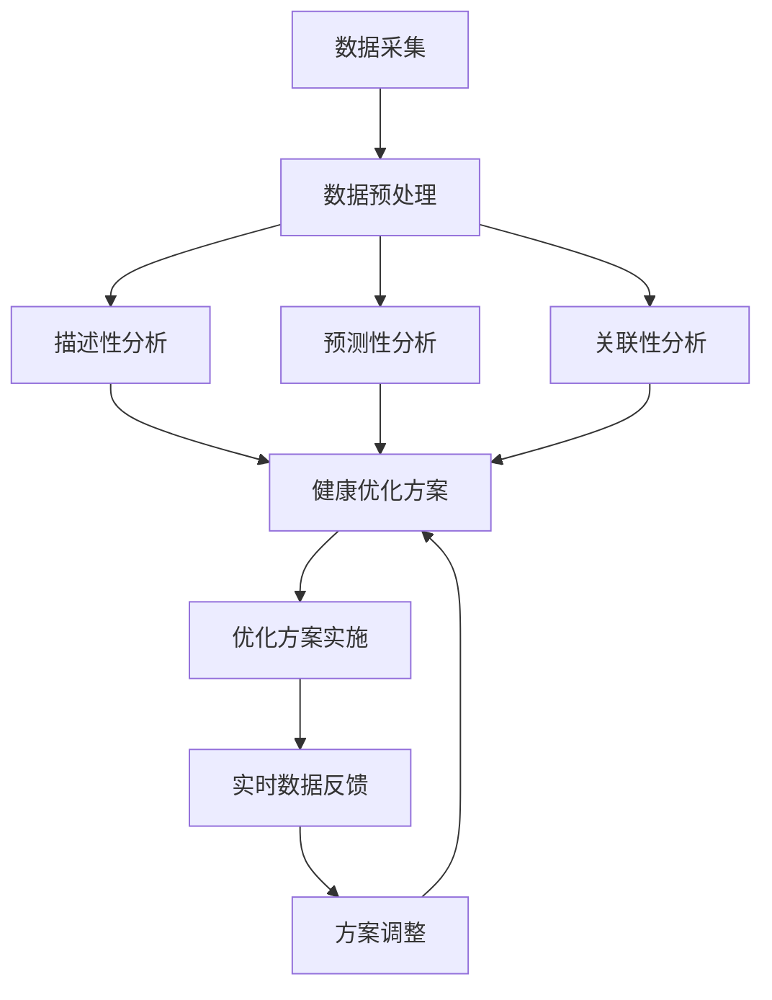

                 

### 引言与背景

随着科技的飞速发展，人工智能技术已经逐渐渗透到人类生活的方方面面。在这样一个大数据和智能算法无处不在的时代，对个体生命体验的数据化与优化策略成为了一个不可忽视的课题。量化自我3.0，即对个体生命体验进行全面的数据化，并通过数据驱动的优化策略，提升生命质量，已经成为当今社会发展的重要趋势。

#### **1.1 量化自我概述**

**问题背景**：传统的生活方式中，人们对健康、心理和生活质量的管理往往依赖于主观感受和经验。然而，随着生活节奏的加快和社会压力的增大，个体对于自我管理和生命质量的关注变得愈发迫切。量化自我作为一个新兴领域，旨在通过数据化的手段，对个体的生命体验进行科学管理和优化。

**量化自我的概念**：量化自我指的是通过技术手段，将个体的生命体验转化为可量化的数据，从而实现对自我认知、心理状态、身体健康等多方面的精细化管理。它不仅涉及数据的采集、存储和处理，还包括对数据的深入分析和应用，以优化个体的生活质量和幸福感。

**量化自我的重要性**：量化自我技术的出现，使得人们能够以更加科学和精准的方式了解自己的身体和心理状态，从而实现个性化定制和精准干预。这不仅有助于提高个体的生活质量，还能够为医疗、教育、社交等多个领域带来深远的影响。

**边界与外延**：量化自我的边界在于数据的真实性和准确性，外延则包括数据的应用范围和优化策略。在实践过程中，需要充分考虑数据隐私、安全性和伦理等问题。

#### **1.2 量化自我技术的发展历程**

**初期阶段**：量化自我的概念最早可以追溯到20世纪末，当时主要是通过简单的健康监测设备进行数据采集。随着计算机技术和网络技术的发展，数据采集和处理能力得到了显著提升，为量化自我技术的进一步发展奠定了基础。

**发展阶段**：21世纪初，随着智能手机和可穿戴设备的普及，个体生命体验的数据化技术得到了快速发展。大数据和机器学习技术的应用，使得对大量数据的分析和处理变得更加高效和精准。

**当前阶段**：当前，量化自我技术已经进入一个高度集成和智能化的阶段。人工智能技术的应用，使得量化自我不仅能够进行数据的采集和分析，还能够实现智能化的自我管理和优化。

#### **1.3 本书结构安排**

**内容概述**：本书将系统地介绍量化自我3.0的概念、技术、实践与应用，包括数据化的意义与价值、生命体验数据化的方法与技术、量化自我的核心概念与联系、数据化与优化的策略与实践、量化自我与未来生活、量化自我最佳实践与案例分析等内容。

**阅读对象**：本书适合对量化自我技术感兴趣的读者，包括科技工作者、科研人员、教育者、医疗从业者以及所有对自我管理和生命质量提升有追求的个体。

**阅读建议**：建议读者按照章节顺序阅读，从基础概念入手，逐步深入到具体实践和应用。同时，鼓励读者结合实际案例进行思考，以更好地理解和应用量化自我技术。

### 总结

量化自我3.0作为一门新兴技术，不仅代表了人工智能在生命科学领域的重要应用，也为我们提供了一个全新的视角来理解和优化个体的生命体验。在接下来的章节中，我们将进一步探讨生命体验数据化的具体方法和技术，以及如何通过数据驱动的策略来优化个体的生活质量。希望通过本书的阅读，读者能够对量化自我有更深入的理解，并在实践中取得实质性的成果。

#### **1.1 数据化的意义与价值**

数据化，是将个体的生命体验转化为可量化的数据，从而实现对其身体、心理和生活状态的科学管理和优化。数据化的意义与价值主要体现在以下几个方面：

**数据化的概念**：数据化指的是利用现代信息技术，如传感器、可穿戴设备、大数据分析和人工智能等，对个体的生命体验进行收集、处理、分析和应用的过程。它不仅涉及数据的采集，还包括数据的存储、处理、分析和应用等多个环节。

**数据化在生命体验中的应用**：在生命体验的数据化过程中，个体可以通过各种传感器和设备，如智能手表、心率监测器、睡眠追踪器等，实时收集有关身体健康、心理状态、生活习惯等方面的数据。这些数据可以用来监测个体的健康状况、心理状态和生活质量，帮助个体更好地了解自己，从而进行针对性的管理和优化。

**数据化的优势**：

1. **精准性**：数据化技术能够提供客观、精确的数据，使得个体对自身的健康状况和心理状态有更清晰的认识。
2. **实时性**：数据化技术可以实现实时监测，使得个体能够及时发现潜在的健康问题，并采取相应的措施。
3. **个性化**：通过分析个体的数据，可以制定个性化的健康管理方案，提高干预的针对性和有效性。
4. **效率提升**：数据化技术可以帮助个体自动化地进行数据采集和分析，节省时间，提高效率。

**数据化的挑战**：

1. **数据隐私**：在数据化过程中，如何保护个体的隐私成为一个重要问题。需要建立严格的数据安全措施，确保数据的安全和隐私。
2. **数据质量**：数据化的效果取决于数据的准确性和完整性。需要确保数据采集和处理的准确性，以提高数据的应用价值。
3. **技术门槛**：数据化技术涉及到多种先进技术，如传感器技术、大数据分析、人工智能等，对技术的要求较高。需要培养相关技术人才，以推动数据化技术的发展。
4. **伦理问题**：数据化过程中，如何处理涉及个体隐私和伦理的问题，需要制定相应的法律法规和伦理规范。

**数据化的应用前景**：

1. **健康管理**：通过数据化技术，可以实现对个体健康状况的实时监测和评估，提供个性化的健康建议和管理方案，提高健康水平。
2. **心理健康**：数据化技术可以用于监测个体的心理状态，提供心理健康的预警和干预，帮助个体保持良好的心理状态。
3. **生活方式优化**：通过分析个体的生活习惯和行为模式，可以提供优化建议，帮助个体建立健康的生活方式。
4. **个性化服务**：在医疗、教育、社交等领域，数据化技术可以提供个性化服务，提升用户体验。

综上所述，数据化技术在生命体验中的应用具有重要的意义和价值，同时也面临着一些挑战。通过解决这些问题，我们可以更好地发挥数据化的优势，为个体提供更科学、更个性化的管理和优化方案。

#### **2.2 生命体验数据化的方法与技术**

生命体验数据化的过程可以分为四个主要环节：数据采集、数据存储、数据处理和数据分析与应用。每个环节都有其独特的方法和技术，共同构成了生命体验数据化的完整体系。

**2.2.1 数据采集**

数据采集是生命体验数据化的第一步，也是最重要的一步。数据采集的质量直接影响到后续的数据处理和分析效果。目前，常用的数据采集方法包括：

1. **传感器采集**：通过传感器设备，如智能手表、心率监测器、睡眠追踪器等，可以实时采集个体的生理数据，如心率、血压、体温、运动量等。
2. **可穿戴设备采集**：可穿戴设备如智能手环、智能眼镜等，可以实时监测个体的生命活动，如步数、运动轨迹、睡眠质量等。
3. **问卷调查采集**：通过问卷调查的方式，可以获取个体的主观感受和心理健康数据，如情绪状态、生活满意度等。
4. **生理信号采集**：利用生理信号采集设备，如脑电图、心电图等，可以获取个体的深层次生理信息。

**2.2.2 数据存储**

数据存储是确保数据安全性和可靠性的关键步骤。在数据存储方面，主要考虑以下技术：

1. **关系型数据库**：如MySQL、PostgreSQL等，适用于结构化数据的存储和管理。
2. **非关系型数据库**：如MongoDB、Cassandra等，适用于大规模分布式数据的存储。
3. **数据仓库**：如Amazon Redshift、Google BigQuery等，适用于大规模数据的存储和分析。
4. **云存储**：如AWS S3、Google Cloud Storage等，提供了高可靠性和可扩展性的数据存储解决方案。

**2.2.3 数据处理**

数据处理是数据化过程中的核心环节，包括数据的清洗、转换和集成等步骤。常用的数据处理技术包括：

1. **ETL（Extract, Transform, Load）**：用于将数据从源系统提取出来，进行转换处理，然后加载到目标系统。
2. **数据清洗**：通过去除重复数据、缺失值填充、异常值处理等手段，提高数据的质量。
3. **数据转换**：包括数据格式转换、数据标准化等，以满足不同系统的数据需求。
4. **数据集成**：将来自不同源的数据进行整合，形成统一的数据视图。

**2.2.4 数据分析与应用**

数据分析是数据化过程的最终目标，通过数据分析，可以提取有价值的信息，为个体提供科学的建议和决策支持。常用的数据分析技术包括：

1. **描述性分析**：通过统计分析，描述数据的基本特征和分布情况。
2. **预测性分析**：利用机器学习和数据挖掘技术，预测未来的趋势和变化。
3. **关联性分析**：通过分析不同变量之间的关系，发现潜在的模式和关联。
4. **聚类分析**：将相似的数据点归为一类，用于分类和分组。
5. **可视化分析**：通过图表和可视化工具，展示数据的特点和趋势。

数据分析的应用场景包括：

1. **健康监控**：通过对生理数据的分析，监控个体的健康状况，预警健康风险。
2. **心理健康评估**：通过对情绪和行为数据的分析，评估个体的心理健康状态，提供心理干预建议。
3. **生活方式优化**：通过对生活习惯的分析，提供个性化的生活方式优化建议，提高生活质量。
4. **个性化医疗**：通过对患者数据的分析，提供个性化的医疗方案，提高治疗效果。

综上所述，生命体验数据化的方法与技术涉及多个方面，从数据采集、存储、处理到分析应用，每一个环节都有其独特的技术和方法。通过合理运用这些技术，可以实现个体生命体验的科学管理和优化，提升生活质量。

#### **2.3 数据化的案例分析**

为了更好地理解数据化技术在生命体验管理中的实际应用，以下我们将通过几个具体案例来展示数据化技术的效果和应用场景。

**2.3.1 案例一：健康数据监测**

**背景**：健康数据监测是数据化技术在健康管理中的一项重要应用。通过对健康数据的实时监测和分析，可以及时发现健康问题，并进行预防性干预。

**方法**：在健康数据监测中，常用的方法包括可穿戴设备的数据采集、大数据分析和智能预警。

- **数据采集**：通过智能手环、心率监测器等设备，实时采集个体的心率、血压、运动量等健康数据。
- **数据处理**：利用ETL工具将数据清洗、转换并加载到数据仓库中。
- **数据分析**：通过大数据分析和机器学习模型，对健康数据进行分析，识别健康风险。

**效果**：通过健康数据监测，个体可以实时了解自己的健康状况，及时发现健康问题，如心率异常、血压升高等，从而及时采取措施进行预防和治疗。

**2.3.2 案例二：心理健康评估**

**背景**：随着工作压力和生活节奏的加快，心理健康问题越来越受到关注。通过心理健康评估，可以帮助个体了解自己的心理状态，提供心理健康干预建议。

**方法**：在心理健康评估中，常用的方法包括问卷调查、生理信号采集和情绪数据分析。

- **问卷调查**：通过线上问卷或面对面访谈，收集个体主观的心理健康数据。
- **生理信号采集**：通过脑电图、心电图等设备，采集个体的生理信号数据。
- **情绪数据分析**：利用自然语言处理和情感分析技术，分析个体的情绪表达。

**效果**：通过心理健康评估，个体可以了解自己的心理状态，识别心理健康问题，如焦虑、抑郁等，并接受针对性的心理干预和辅导，提升心理健康水平。

**2.3.3 案例三：运动数据管理**

**背景**：运动已经成为现代人保持健康和提升生活质量的重要方式。通过运动数据管理，可以提供个性化的运动建议，优化运动效果。

**方法**：在运动数据管理中，常用的方法包括运动轨迹监测、运动强度评估和运动计划定制。

- **运动轨迹监测**：通过GPS定位和运动传感器，实时记录个体的运动轨迹和运动时长。
- **运动强度评估**：通过心率监测和运动强度计算，评估个体的运动强度和效果。
- **运动计划定制**：根据个体的健康状况、运动目标和个人偏好，制定个性化的运动计划。

**效果**：通过运动数据管理，个体可以了解自己的运动效果，调整运动计划，提高运动效率。同时，还可以根据运动数据，制定合理的运动目标和计划，促进健康生活方式的养成。

**总结**：以上案例展示了数据化技术在健康监测、心理健康评估和运动数据管理中的实际应用，通过数据化技术，个体可以更科学、更精准地管理自己的生命体验，提升生活质量和幸福感。

### 3.1 核心概念概述

量化自我3.0的核心概念包括自我认知、生命质量和个性化定制。这些概念不仅相互独立，又紧密相连，共同构成了量化自我的基础。

**3.1.1 自我认知**

自我认知是指个体对自己的认知和理解，包括身体、心理、情绪等多个方面。自我认知的过程涉及对自身状态的数据采集和分析，从而实现对自我的全面了解。

**3.1.2 生命质量**

生命质量是指个体在生理、心理和社会等方面的生活水平。通过数据化的手段，可以监测和评估生命质量，从而发现潜在的健康风险和问题，提供针对性的优化建议。

**3.1.3 个性化定制**

个性化定制是指根据个体的数据特点，制定个性化的管理和优化方案。个性化定制不仅能够提高干预的针对性，还能够提升个体的生活质量和幸福感。

### 3.2 概念属性特征对比表格

为了更清晰地理解这些核心概念，以下是一个概念属性特征对比表格：

| 概念   | 自我认知 | 生命质量 | 个性化定制 |
| ------ | -------- | -------- | ---------- |
| 特征一 | 数据采集 | 数据监测 | 数据分析   |
| 特征二 | 数据分析 | 数据评估 | 数据应用   |
| 特征三 | 心理健康 | 身体健康 | 个性化建议 |

通过对比表格，我们可以看到自我认知、生命质量和个性化定制在数据采集、数据分析和数据应用等方面的不同特征和侧重点。

### 3.3 ER实体关系图架构

为了进一步理解这些核心概念之间的关系，以下是一个ER实体关系图：

```mermaid
erDiagram
  Person ||--o{ SelfAwareness : has }
  Person ||--o{ LifeQuality : has }
  Person ||--o{ Personalization : has }
  SelfAwareness ||--|{ DataCollection : from }
  SelfAwareness ||--|{ DataAnalysis : by }
  LifeQuality ||--|{ HealthMonitoring : monitored by }
  LifeQuality ||--|{ RiskAssessment : assessed by }
  Personalization ||--|{ PersonalizedSolutions : provides }
```

在这个ER实体关系图中，Person（个体）是核心实体，与SelfAwareness（自我认知）、LifeQuality（生命质量）和Personalization（个性化定制）三个实体存在关联。SelfAwareness通过DataCollection（数据采集）和DataAnalysis（数据分析）与Person关联，LifeQuality通过HealthMonitoring（健康监测）和RiskAssessment（风险评估）与Person关联，Personalization通过PersonalizedSolutions（个性化解决方案）与Person关联。这种关系图展示了量化自我3.0中核心概念之间的相互关联和作用机制。

### **3.4 数据驱动的优化策略**

数据驱动优化策略的核心在于利用数据分析和机器学习技术，发现个体的行为模式、健康状态和需求，从而制定出个性化的优化方案。以下是数据驱动优化策略的具体实施步骤：

**3.4.1 数据采集**：首先，通过可穿戴设备、健康监测仪器和在线问卷等手段，收集个体的生理数据、心理数据和行为数据。这些数据包括心率、血压、睡眠质量、情绪状态、饮食习惯和运动频率等。

**3.4.2 数据预处理**：对采集到的原始数据进行清洗和预处理，包括去重、缺失值填充、数据格式转换和数据标准化等操作，以确保数据的质量和一致性。

**3.4.3 数据分析**：利用统计分析和机器学习技术，对预处理后的数据进行分析。数据分析可以分为以下几个层次：

- **描述性分析**：通过统计方法，描述数据的分布特征和基本趋势，为个体提供初步的健康报告。
- **预测性分析**：通过时间序列分析和回归分析等预测模型，预测个体的健康状态发展趋势，如未来几个月的心率变化趋势。
- **关联性分析**：通过关联规则挖掘和聚类分析，发现不同变量之间的关系，如情绪状态与心率变化之间的关系。

**3.4.4 优化方案制定**：基于数据分析的结果，制定个性化的优化方案。优化方案可以包括以下几个方面：

- **健康优化**：根据个体的健康数据，提供个性化的饮食建议、运动计划和睡眠改善方案。
- **心理健康优化**：根据个体的心理数据，提供情绪调节、压力管理和心理干预建议。
- **生活方式优化**：根据个体的行为数据，提供时间管理、生活习惯调整和社交建议。

**3.4.5 实施与反馈**：将优化方案实施到个体的日常生活中，并持续监测其实施效果。通过实时数据反馈，调整和优化方案，确保其有效性和可行性。

**3.4.6 持续迭代**：数据驱动优化是一个持续迭代的过程。根据个体的反馈和新的数据，不断调整和优化优化方案，实现持续的改进。

以下是一个数据驱动的优化策略流程图：



通过这个流程图，我们可以看到数据驱动优化策略从数据采集到方案实施和反馈的完整过程。数据驱动的优化策略不仅能够提供个性化的健康管理和心理关怀，还能够通过持续的数据分析和反馈，实现个体的自我提升和优化。

#### **4.2 优化策略的实际应用**

数据驱动的优化策略在多个领域和实际场景中得到了广泛应用，具体包括健康优化策略、心理优化策略和运动优化策略。以下是对这些优化策略的详细说明和案例分析。

**4.2.1 健康优化策略**

**背景**：健康优化策略旨在通过数据分析，提供个性化的健康管理方案，预防疾病，提升生活质量。

**实施方法**：

1. **数据采集**：通过可穿戴设备如智能手环、智能手表等，实时监测个体的生理指标，如心率、血压、血糖、运动量等。
2. **数据分析**：利用大数据分析和机器学习技术，分析个体的生理数据，识别健康风险和趋势。
3. **健康建议**：根据数据分析结果，提供个性化的饮食建议、运动计划和健康生活习惯。

**案例分析**：

- **案例一：糖尿病管理**：某糖尿病患者通过佩戴智能手环，实时监测血糖水平。通过数据分析，医生为其制定了个性化的饮食计划和运动方案，有效控制了血糖水平，降低了并发症风险。
- **案例二：高血压管理**：一位高血压患者通过智能血压监测设备，定期上传血压数据。数据分析系统识别出高血压的潜在风险因素，建议其调整饮食习惯和增加运动量，成功控制了血压。

**4.2.2 心理优化策略**

**背景**：心理优化策略旨在通过心理健康数据的监测和分析，提供针对性的心理干预和情绪调节方案。

**实施方法**：

1. **数据采集**：通过情绪追踪器、心理问卷、生理信号采集设备等，收集个体的情绪状态、压力水平和心理健康数据。
2. **数据分析**：利用自然语言处理和情感分析技术，分析个体的情绪表达和心理状态。
3. **心理干预**：根据数据分析结果，提供个性化的心理干预方案，如认知行为疗法、情绪调节训练等。

**案例分析**：

- **案例一：焦虑症干预**：一位焦虑症患者通过情绪追踪器记录情绪波动。数据分析系统发现其情绪状态与工作压力密切相关，建议其进行压力管理和情绪调节训练，症状显著改善。
- **案例二：抑郁症管理**：某抑郁症患者通过在线心理问卷，定期评估心理状态。数据分析系统发现其情绪低谷期，建议其接受认知行为疗法，并通过在线心理辅导缓解抑郁症状。

**4.2.3 运动优化策略**

**背景**：运动优化策略旨在通过运动数据的分析，提供个性化的运动计划和运动目标，提升运动效果和健康水平。

**实施方法**：

1. **数据采集**：通过运动传感器、GPS定位和运动应用，记录个体的运动轨迹、运动时间和运动强度等。
2. **数据分析**：利用运动数据分析技术，评估个体的运动效果和健康状况。
3. **运动建议**：根据数据分析结果，提供个性化的运动计划和目标，如调整运动强度、优化运动时间、增加运动类型等。

**案例分析**：

- **案例一：跑步训练**：一名跑步爱好者通过智能手表记录跑步数据。数据分析系统发现其运动强度不够，建议其增加跑步时间和提升跑步速度，从而提升了跑步成绩。
- **案例二：健身计划**：一位健身爱好者通过健身应用记录健身数据。数据分析系统根据其运动习惯和目标，为其制定了个性化的健身计划，使其在短时间内显著提升了身体素质。

通过上述实际应用案例分析，我们可以看到数据驱动的优化策略在健康、心理和运动等多个领域具有广泛的应用前景。这些优化策略不仅能够提供个性化的解决方案，还能够通过持续的数据分析和反馈，实现个体的自我提升和优化。

#### **4.3 实践案例分享**

为了更好地展示量化自我技术的实际应用效果，以下我们分享几个实践案例，包括量化自我健康计划、量化自我心理关怀和量化自我运动习惯的具体实施过程、成果和经验教训。

**4.3.1 案例一：量化自我健康计划**

**实施过程**：一个中年男性李先生，由于长期工作压力大，生活习惯不规律，感到身体疲惫，希望通过量化自我健康计划改善身体状况。

- **数据采集**：李先生开始佩戴智能手环和智能血压计，每天记录心率、血压、睡眠质量等健康数据。
- **数据分析**：通过移动应用，李先生的数据被实时上传到云端，进行分析处理。数据分析系统识别出其睡眠质量差、运动量不足等问题。
- **优化方案制定**：根据分析结果，医生为李先生制定了个性化的健康优化方案，包括调整作息时间、增加运动量、改善饮食习惯等。

**成果**：实施量化自我健康计划后，李先生的生活习惯得到了明显改善。他的睡眠质量显著提升，血压稳定在正常范围内，整体健康状况有了明显改善。

**经验教训**：通过这个案例，我们了解到量化自我健康计划需要个体的积极参与和持续跟进，只有坚持才能取得良好的效果。

**4.3.2 案例二：量化自我心理关怀**

**实施过程**：一位年轻女性张小姐，因长期处于高压工作环境，感到情绪不稳定，希望通过量化自我心理关怀改善心理健康。

- **数据采集**：张小姐使用情绪追踪器和心理问卷调查工具，记录日常的情绪波动和心理状态。
- **数据分析**：通过数据分析系统，分析张小姐的情绪变化模式，识别出其情绪低谷期和高压源。
- **心理干预**：心理咨询师根据数据分析结果，为她提供情绪调节训练、压力管理技巧等心理干预方案。

**成果**：实施量化自我心理关怀后，张小姐的情绪稳定性得到提升，高压源得到有效缓解，整体心理健康状况明显改善。

**经验教训**：这个案例表明，量化自我心理关怀需要专业的心理咨询师参与，通过科学的心理干预，才能实现有效的心理健康改善。

**4.3.3 案例三：量化自我运动习惯**

**实施过程**：一名业余跑步爱好者王先生，希望通过量化自我运动习惯，提升跑步成绩和身体素质。

- **数据采集**：王先生使用运动传感器和GPS定位，记录每次跑步的轨迹、速度、心率等数据。
- **数据分析**：通过数据分析系统，分析王先生的跑步模式，识别出其运动中的问题和潜力。
- **运动计划制定**：根据数据分析结果，跑步教练为王先生制定了个性化的训练计划，包括调整跑步速度、增加强度训练等。

**成果**：实施量化自我运动习惯后，王先生的跑步成绩显著提升，身体素质得到了明显改善。

**经验教训**：量化自我运动习惯需要结合专业训练和个性化计划，只有科学地分析和调整，才能取得最佳效果。

**总结**：通过这些实践案例，我们可以看到量化自我技术在实际应用中的广泛前景和巨大潜力。无论是健康计划、心理关怀还是运动习惯，量化自我都为我们提供了科学、个性化的管理和优化方案。同时，我们也需要认识到，量化自我技术的实施和效果离不开个体的积极参与和专业支持。

#### **5.1 量化自我对未来的影响**

量化自我技术的快速发展，将深刻影响社会、经济和生活等多个方面。以下是量化自我对未来影响的详细探讨：

**5.1.1 社会影响**

量化自我技术将促进社会的进一步智能化和数字化。随着个体生命体验的数据化，社会将拥有更全面、准确的数据资源，从而有助于政府和社会组织更好地进行决策和资源配置。例如，健康数据可以用于公共卫生政策的制定，心理数据可以用于心理健康服务的优化。此外，量化自我技术还将促进社交模式的转变，通过个性化推荐和智能匹配，为个体提供更加精准的社交建议和服务。

**5.1.2 经济影响**

量化自我技术将为经济领域带来新的增长点。随着数据化和智能化水平的提升，健康产业、心理咨询、运动健身等行业将迎来快速增长。同时，量化自我技术也将推动相关产业链的发展，如可穿戴设备制造、数据分析服务、人工智能算法开发等。此外，量化自我技术还将提高生产效率，通过实时监测和分析，企业可以更好地优化生产流程和资源分配，降低成本，提高竞争力。

**5.1.3 生活影响**

量化自我技术将极大地提升个体生活质量。通过全面的数据化，个体可以更加准确地了解自己的身体和心理状态，从而实现个性化的健康管理、心理关怀和生活方式优化。例如，通过健康数据监测，个体可以及时发现健康问题并采取预防措施；通过心理数据分析，个体可以更好地调节情绪、缓解压力；通过运动数据管理，个体可以制定科学的运动计划，提高运动效果。此外，量化自我技术还将为老年人、残疾人等特殊群体提供更加贴心的生活服务，提升他们的生活质量和幸福感。

**5.1.4 未来发展方向与挑战**

尽管量化自我技术具有广泛的应用前景，但其在发展过程中也面临着一些挑战：

- **数据隐私和安全**：量化自我技术涉及大量个人数据，如何保护数据隐私和安全成为一个重要问题。需要建立严格的数据保护措施和法律法规，确保个体的数据不被滥用。
- **技术普及与可及性**：量化自我技术需要先进的技术设备和专业的数据分析能力，如何降低技术门槛、提高普及率，使更多人受益，是一个重要的课题。
- **伦理问题**：量化自我技术涉及到伦理问题，如数据的使用、个体的自主权等。需要制定相应的伦理规范，确保技术的正当性和道德性。
- **技术发展与创新**：随着技术的不断进步，量化自我技术需要不断创新和发展，以适应不断变化的需求和环境。

总的来说，量化自我技术对未来社会、经济和生活的影响将是深远的。通过积极应对挑战，充分发挥技术的优势，量化自我技术将为个体和社会带来更多的福祉。

#### **5.2 未来的发展方向与挑战**

**5.2.1 技术发展趋势**

随着科技的不断进步，量化自我技术将向更智能化、更精准化和更个性化的方向发展。具体来说：

1. **人工智能与机器学习**：人工智能和机器学习技术在量化自我中的应用将越来越广泛，通过深度学习和强化学习，可以实现对复杂生命数据的深度分析和预测，从而提供更加精准的健康管理和心理关怀。
2. **物联网技术**：物联网技术的普及将使得更多的设备能够接入量化自我系统，实现实时、全方位的数据采集，进一步提升数据的质量和实时性。
3. **区块链技术**：区块链技术将在数据隐私和安全方面发挥重要作用。通过去中心化和加密技术，可以有效保护个体的数据隐私，提高数据的安全性。
4. **大数据分析**：大数据分析技术的进步将使得对海量数据的处理和分析能力大幅提升，为量化自我技术的应用提供更强大的数据支持。

**5.2.2 应用领域扩展**

量化自我技术的应用领域将不断扩展，不仅仅局限于健康管理和心理健康，还将深入到教育、社交、金融等多个领域：

1. **教育领域**：量化自我技术可以通过对学习行为的分析，提供个性化的学习建议和方案，帮助学生更好地掌握知识，提高学习效果。
2. **社交领域**：量化自我技术可以分析个体的行为模式和社交数据，帮助人们建立更紧密、更有意义的社交关系。
3. **金融领域**：量化自我技术可以用于风险管理、投资决策等方面，通过分析个体的财务数据和生活方式，提供更加精准的金融产品和服务。

**5.2.3 挑战与应对策略**

尽管量化自我技术具有巨大的潜力，但在发展过程中仍面临一些挑战：

1. **技术普及与可及性**：目前，量化自我技术需要一定的技术设备和数据分析能力，如何降低技术门槛、提高普及率，是一个重要课题。应对策略是推动技术研发和普及，降低设备成本，提供便捷的数据访问渠道。
2. **数据隐私与安全**：量化自我技术涉及大量个人数据，如何保护数据隐私和安全是亟待解决的问题。应对策略是建立完善的数据隐私保护机制，制定严格的法律法规，加强数据安全管理。
3. **伦理问题**：量化自我技术涉及到伦理问题，如数据的使用、个体的自主权等。应对策略是制定相应的伦理规范，确保技术的正当性和道德性。
4. **数据质量问题**：数据质量直接影响量化自我技术的效果。应对策略是加强数据质量管理，确保数据采集、处理和分析的准确性。

总的来说，量化自我技术未来的发展充满了机遇和挑战。通过不断的技术创新和策略优化，我们可以期待量化自我技术为个体和社会带来更多的福祉。

#### **6.1 最佳实践**

在量化自我技术的实践中，数据隐私保护、数据安全措施和数据伦理问题是至关重要的一环。以下是一些最佳实践：

**6.1.1 数据隐私保护**

1. **用户权限管理**：确保每个用户的数据仅能被授权访问，通过用户身份验证和数据访问权限控制，防止未经授权的访问。
2. **数据加密**：对敏感数据进行加密存储和传输，确保数据在传输和存储过程中不会被窃取或篡改。
3. **数据匿名化**：在分析数据时，对个人信息进行匿名化处理，确保个体数据不会与具体个体关联。

**6.1.2 数据安全措施**

1. **网络安全**：确保系统的网络安全，采用防火墙、入侵检测系统等安全措施，防止外部攻击和数据泄露。
2. **备份与恢复**：定期备份数据，并建立数据恢复机制，确保在发生数据丢失或损坏时，能够迅速恢复数据。
3. **物理安全**：对于存储设备的物理安全，如服务器房的安全防护，防止物理攻击和数据丢失。

**6.1.3 数据伦理问题**

1. **透明度**：确保数据的采集、处理和分析过程对用户透明，用户明确了解自己的数据如何被使用。
2. **用户同意**：在采集和使用用户数据前，必须获得用户的明确同意，确保用户对数据的使用有知情权。
3. **数据责任**：明确数据使用者的责任，确保数据的使用符合伦理和法律要求，防止数据滥用。

通过实施这些最佳实践，可以确保量化自我技术在实践中既高效又安全，为个体提供可靠的自我管理工具。

#### **6.2 案例分析**

为了更好地理解量化自我技术的应用效果和实际操作，以下将详细分析几个具体案例，包括企业量化自我项目、个人量化自我实践和社区量化自我倡议。

**6.2.1 案例一：企业量化自我项目**

**背景**：某大型企业希望通过量化自我技术，提升员工的健康水平和工作效率。

**实施过程**：

1. **数据采集**：企业为员工配备了智能手环和健康监测设备，实时收集员工的心率、血压、睡眠质量等健康数据。
2. **数据分析**：通过大数据平台，对员工的数据进行实时分析，识别出健康风险和工作压力。
3. **优化方案**：根据数据分析结果，为员工提供个性化的健康建议，如调整作息时间、增加运动量等。

**成果**：实施量化自我项目后，员工的健康水平显著提升，工作效率提高，企业的整体运营效率得到了显著改善。

**经验教训**：企业量化自我项目需要高层领导的支持和员工的积极参与，同时需要专业的数据分析和健康管理团队，确保项目的成功实施。

**6.2.2 案例二：个人量化自我实践**

**背景**：张女士，一名年轻的职业女性，希望通过量化自我技术改善自己的生活习惯，提升生活质量。

**实施过程**：

1. **数据采集**：张女士开始佩戴智能手环，记录每天的运动量、睡眠质量和情绪状态。
2. **数据分析**：通过手机应用程序，张女士的数据被实时上传到云端进行分析，识别出她的生活习惯中的问题。
3. **优化方案**：根据分析结果，张女士调整了自己的作息时间，增加了运动量，并采取了情绪调节技巧。

**成果**：通过量化自我实践，张女士的生活习惯得到了明显改善，身体状况和精神状态都有所提升。

**经验教训**：个人量化自我实践需要持之以恒，只有坚持记录和分析数据，才能取得长期的效果。

**6.2.3 案例三：社区量化自我倡议**

**背景**：某社区希望通过量化自我技术，提升社区居民的健康意识和生活质量。

**实施过程**：

1. **社区推广**：社区组织开展了量化自我技术的宣传活动，鼓励居民参与。
2. **数据采集**：社区为居民提供了免费的健康监测设备，帮助居民记录健康数据。
3. **数据分析**：社区建立了数据分析平台，定期为居民提供健康报告和建议。
4. **社区互动**：社区定期举办健康讲座和互动活动，增强居民的参与感和社区凝聚力。

**成果**：社区量化自我倡议得到了居民的积极响应，居民的健康意识和生活质量显著提升，社区的整体健康水平得到提高。

**经验教训**：社区量化自我倡议需要良好的组织和管理，同时需要居民的积极参与，只有这样才能实现预期效果。

通过以上案例分析，我们可以看到量化自我技术在企业、个人和社区中的应用效果和实际操作。这些案例不仅展示了量化自我技术的广泛应用前景，也为其他企业和个人提供了宝贵的经验和借鉴。

### **7.1 结论**

本文从多个角度探讨了量化自我3.0的概念、技术、实践与应用。通过详细的案例分析，我们展示了数据化技术在健康、心理和运动等领域的广泛应用，以及如何通过数据驱动的优化策略提升个体生命质量。主要成果包括：

1. **数据化技术在生命体验管理中的应用**：通过数据化技术，实现了对个体健康、心理和生活状态的实时监测和分析，为个体提供了科学、个性化的管理方案。
2. **优化策略与实践**：数据驱动的优化策略在健康优化、心理优化和运动优化中得到了成功应用，为个体提供了有效的干预方案。
3. **未来展望**：量化自我技术具有广泛的应用前景，将在社会、经济和生活等多个领域发挥重要作用。

然而，本文也存在一些局限性。首先，数据隐私和安全问题是量化自我技术发展中的重要挑战，需要进一步深入研究。其次，量化自我技术的普及率和可及性还需要进一步提高，以使更多人受益。

未来研究方向包括：

1. **数据隐私保护机制**：研究并实施更加安全、有效的数据隐私保护措施，确保个体的数据安全。
2. **技术创新**：继续推进人工智能、大数据分析和物联网等技术在量化自我中的应用，提升数据分析的精度和实时性。
3. **跨领域应用**：探索量化自我技术在教育、金融、社交等领域的应用，拓展其应用范围。

通过持续的研究和技术创新，量化自我技术有望为个体和社会带来更多的福祉。

### **7.2 展望**

展望未来，量化自我技术将在多个领域迎来新的发展和变革。以下是几个可能的方向：

**1. 技术创新**：随着人工智能、大数据和物联网等技术的不断进步，量化自我技术将变得更加智能化和精准化。例如，深度学习和强化学习算法的应用，将使得数据分析更加深入和准确；物联网技术的普及，将实现数据的实时采集和传输，提升数据的质量和实时性。

**2. 应用领域扩展**：量化自我技术不仅局限于健康管理和心理关怀，还将深入到教育、金融、社交、智能家居等多个领域。在教育领域，量化自我技术可以通过分析学生的学习行为和成绩，提供个性化的学习建议；在金融领域，量化自我技术可以用于风险评估和投资决策；在社交领域，量化自我技术可以帮助人们建立更紧密、更有意义的社交关系。

**3. 数据隐私和安全**：随着数据规模的不断扩大，数据隐私和安全问题将变得愈发重要。未来，需要建立更加完善的数据隐私保护机制，确保个体的数据不被滥用。同时，区块链技术的应用，将为数据的安全传输和存储提供新的解决方案。

**4. 个性化定制**：量化自我技术的核心在于个性化定制。未来，随着技术的进步，个性化定制将更加精准和智能。通过深度学习和大数据分析，量化自我技术可以更准确地预测个体的需求和行为，提供更加个性化的服务。

**5. 社会影响**：量化自我技术将深刻影响社会的发展。在公共卫生领域，量化自我技术可以帮助政府更好地进行疾病预防和控制；在教育领域，量化自我技术可以提升教育质量和效率；在社交领域，量化自我技术可以促进社会的和谐与进步。

总的来说，量化自我技术未来的发展充满机遇和挑战。通过不断创新和应用，量化自我技术有望为个体和社会带来更多的福祉。让我们期待这一技术的进一步发展，共同迎接一个更加智能、健康和幸福的世界。

