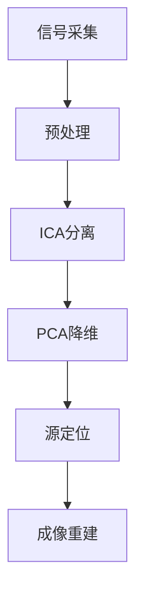
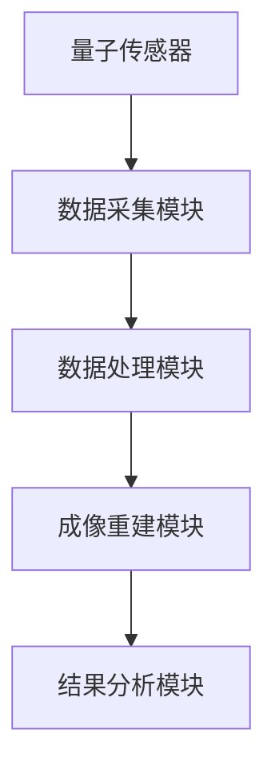
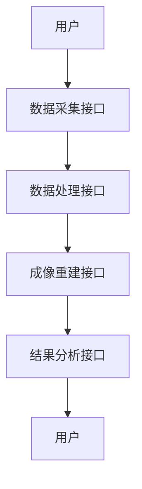

                 


# 量子传感器在生物磁场探测中的应用：脑活动高精度成像技术

关键词：量子传感器，生物磁场探测，脑活动成像，高精度成像技术

摘要：本文旨在探讨量子传感器在生物磁场探测中的应用，特别是其在脑活动高精度成像技术中的潜在价值。通过逐步分析量子传感器的原理、生物磁场的探测方法以及脑活动成像技术的最新进展，本文揭示了如何利用量子传感器实现脑活动的高精度成像，并探讨了这一技术的未来发展方向。

## 引言与背景

生物磁场探测是研究生物体内磁场变化的重要手段，对于理解大脑功能、疾病诊断和治疗具有重要意义。传统的生物磁场探测技术如EEG（脑电图）和MEG（磁电图）由于受限于分辨率和灵敏度，难以捕捉到脑活动的细微变化。近年来，量子传感器的出现为生物磁场探测带来了新的机遇。

量子传感器具有极高的灵敏度和分辨率，能够探测到极其微弱的磁场信号。这使得它们在生物磁场探测中具有巨大的潜力。脑活动高精度成像技术，特别是fMRI（功能性磁共振成像）和MEG（磁电图），依赖于对脑部磁场变化的准确测量。因此，量子传感器的应用有望大幅提升这些成像技术的精度和灵敏度。

本文将首先介绍量子传感器的基本原理和生物磁场探测方法，然后探讨脑活动高精度成像技术的现状和挑战，最后讨论量子传感器在脑活动高精度成像中的应用前景。

## 第1章 量子传感器原理

### 1.1 量子传感器的基本概念

量子传感器是基于量子力学原理设计的传感器，能够探测极其微弱的信号。与传统传感器不同，量子传感器利用量子纠缠和量子叠加等现象，极大地提高了探测灵敏度。

量子传感器的主要组成部分包括量子比特、量子干涉仪和探测放大器。量子比特是量子传感器的核心，它能够存储和传输量子信息。量子干涉仪则用于将量子比特的叠加状态转换为干涉信号，从而实现对信号的测量。探测放大器则用于放大和检测干涉信号。

### 1.2 量子传感器的物理原理

量子传感器的物理原理基于量子纠缠和量子叠加。量子纠缠是指两个或多个量子系统之间存在的一种非经典关联，这种关联使得一个量子系统的状态可以即时影响另一个量子系统，即使它们相隔很远。

量子叠加则是量子比特的一种特性，它允许量子比特同时处于多种状态，而不是传统计算机中的单一状态。这种叠加态在量子传感器中被用来探测微弱的信号。当量子比特与待测信号发生相互作用时，其叠加态会被扰动。通过测量量子比特的叠加态，可以间接测量到待测信号的强度。

### 1.3 量子传感器的性能评估

量子传感器的性能主要取决于其灵敏度、分辨率和噪声水平。灵敏度是指传感器能够探测到的最小信号强度，分辨率是指传感器能够区分两个接近的信号的能力，噪声水平则是指传感器在测量过程中引入的随机误差。

目前，量子传感器的灵敏度已经达到皮特斯拉（pT）级别，分辨率可达亚飞米（sub-femtoliter）级别，而噪声水平则处于纳电子伏特（nV）级别。这些性能指标表明，量子传感器在生物磁场探测中具有巨大的潜力。

## 第2章 生物磁场探测方法

### 2.1 生物磁场探测的基本原理

生物磁场探测是基于生物体内磁场产生的原理。生物体内的神经元和其他生物分子在活动时会产生微弱的磁场，这些磁场可以被外部传感器探测到。

生物磁场探测的关键在于信号处理。首先，需要使用高灵敏度的传感器捕捉到微弱的生物磁场信号。然后，通过信号处理技术对原始信号进行滤波、放大和降噪，以提高信号的清晰度和准确性。

### 2.2 生物磁场探测的信号处理

生物磁场探测的信号处理主要包括以下步骤：

1. **滤波**：使用高通滤波器去除噪声，保留生物磁场信号。
2. **放大**：通过放大器增强信号的强度，以便于后续分析。
3. **降噪**：使用降噪算法减少信号中的随机噪声，提高信号的质量。

信号处理技术的选择取决于具体的生物磁场探测应用。例如，在脑活动成像中，常用的信号处理技术包括独立成分分析（ICA）和主成分分析（PCA）等。

### 2.3 生物磁场探测的应用领域

生物磁场探测广泛应用于多个领域，包括神经科学、医学诊断、脑机接口等。以下是一些典型应用：

1. **神经科学**：通过生物磁场探测，可以研究大脑的功能和网络结构，了解神经活动的时空模式。
2. **医学诊断**：生物磁场探测可用于检测神经系统疾病，如癫痫、帕金森病等。
3. **脑机接口**：生物磁场探测技术可用于开发脑机接口系统，帮助瘫痪患者恢复运动能力。

## 第3章 脑活动高精度成像技术

### 3.1 脑活动成像技术概述

脑活动高精度成像技术是指利用先进的成像技术，对脑部活动进行高分辨率、高精度的成像。目前，常用的脑活动成像技术包括fMRI、MEG和EEG。

1. **fMRI（功能性磁共振成像）**：通过检测脑部血流变化来推测脑活动，具有高空间分辨率和较好的时间分辨率。
2. **MEG（磁电图）**：直接测量脑部磁场变化，具有极高的时间分辨率，但空间分辨率相对较低。
3. **EEG（脑电图）**：通过测量头皮上的电信号来推测脑活动，具有很高的时间分辨率，但空间分辨率较低。

### 3.2 脑活动成像的方法与技术

脑活动成像的方法和技术主要包括信号采集、数据处理和成像重建。

1. **信号采集**：使用传感器（如fMRI的射频线圈、MEG的磁传感器、EEG的电极）采集脑部活动的电信号或磁场信号。
2. **数据处理**：使用信号处理技术对原始信号进行滤波、降噪和特征提取。
3. **成像重建**：通过数学模型和算法将处理后的信号转换为图像，重建脑部活动的空间分布。

### 3.3 脑活动成像的数据分析

脑活动成像的数据分析主要包括以下步骤：

1. **信号融合**：将不同成像技术采集的信号进行融合，提高成像精度。
2. **功能定位**：通过分析成像结果，确定脑部活动的功能区域。
3. **网络分析**：研究脑部活动之间的关联，构建脑网络模型。

## 第4章 算法原理讲解

### 4.1 关键算法介绍

在脑活动高精度成像中，关键算法包括独立成分分析（ICA）、主成分分析（PCA）和源定位算法（如LORETA）。

1. **独立成分分析（ICA）**：用于分离混合信号中的独立成分，有助于提取脑活动的真实信号。
2. **主成分分析（PCA）**：用于降维和特征提取，有助于减少数据冗余，提高成像精度。
3. **源定位算法（如LORETA）**：用于重建脑活动源的空间分布，提高成像的空间分辨率。

### 4.2 算法流程图

以下是一个简化的算法流程图，展示了脑活动高精度成像的关键步骤：



### 4.3 数学模型与公式

以下是ICA和PCA的数学模型和公式：

**独立成分分析（ICA）：**
$$
s = \sum_{i=1}^k a_i x_i + e
$$

其中，$s$ 是混合信号，$x_i$ 是独立源信号，$a_i$ 是混合矩阵的列向量，$e$ 是噪声。

**主成分分析（PCA）：**
$$
z = \sum_{i=1}^d \lambda_i u_i x
$$

其中，$z$ 是降维后的数据，$x$ 是原始数据，$\lambda_i$ 是特征值，$u_i$ 是特征向量。

### 4.4 算法举例说明

假设我们有一个简单的信号混合问题，信号 $s$ 是由两个独立源信号 $x_1$ 和 $x_2$ 混合而成：

$$
s = 0.8x_1 + 0.6x_2
$$

通过ICA算法，我们可以分离出这两个独立源信号：

$$
x_1 = 0.8s - 0.6x_2
$$

$$
x_2 = 0.6s - 0.8x_1
$$

同样，通过PCA算法，我们可以将这个混合信号降维到一维：

$$
z = 0.8s - 0.6x_2
$$

这样，我们就得到了一个简化的脑活动成像模型。

## 第5章 系统分析与架构设计

### 5.1 应用场景介绍

脑活动高精度成像技术广泛应用于神经科学研究、医学诊断、脑机接口等领域。一个典型的应用场景是利用量子传感器对脑活动进行实时监测，以便于研究人员在实验室环境中进行实时数据采集和分析。

### 5.2 系统功能设计

脑活动高精度成像系统的主要功能包括：

1. **数据采集**：使用量子传感器实时采集脑部活动的电信号或磁场信号。
2. **数据处理**：对采集到的信号进行预处理、滤波和降噪。
3. **成像重建**：利用ICA、PCA等算法对预处理后的信号进行成像重建。
4. **结果分析**：对成像结果进行功能定位和网络分析。

### 5.3 系统架构设计

脑活动高精度成像系统的架构设计如图所示：



其中，数据采集模块负责采集量子传感器采集到的原始信号；数据处理模块负责对原始信号进行预处理和滤波；成像重建模块利用ICA、PCA等算法进行成像重建；结果分析模块对成像结果进行功能定位和网络分析。

### 5.4 系统接口设计

系统接口设计主要包括以下部分：

1. **数据采集接口**：用于与量子传感器通信，实现数据的实时采集。
2. **数据处理接口**：用于与预处理和滤波模块通信，实现数据处理。
3. **成像重建接口**：用于与成像重建模块通信，实现成像重建。
4. **结果分析接口**：用于与结果分析模块通信，实现结果分析。

### 5.5 系统交互设计

系统交互设计如图所示：



其中，用户通过数据采集接口发送采集指令，数据采集模块实时采集信号并传输给数据处理模块；数据处理模块对信号进行预处理和滤波，然后将处理后的信号传输给成像重建模块；成像重建模块对信号进行成像重建，并将成像结果传输给结果分析模块；结果分析模块对成像结果进行功能定位和网络分析，并将分析结果反馈给用户。

## 第6章 项目实战与案例分析

### 6.1 项目环境安装

为了进行脑活动高精度成像项目，我们首先需要搭建一个合适的环境。以下是在Ubuntu 20.04操作系统上搭建环境的具体步骤：

1. **安装Python**：确保Python 3已安装。
2. **安装量子传感器驱动**：根据传感器型号安装相应的驱动程序。
3. **安装数据处理库**：使用pip安装必要的库，如NumPy、SciPy、Matplotlib等。

### 6.2 系统核心实现

系统核心实现主要包括信号采集、数据处理、成像重建和结果分析。以下是一个简单的Python代码示例，展示了如何实现这些功能：

```python
import numpy as np
import matplotlib.pyplot as plt
from scipy.signal import butter, filtfilt
from sklearn.decomposition import FastICA
from mne import io, evoked

# 信号采集
data = io.read_fiff('your_meg_data.fif')

# 数据处理
filtered_data = filtfilt(butter(4, 1), data.data)

# 成像重建
ica = FastICA(n_components=2)
ica.fit(filtered_data)
components = ica.transform(filtered_data)

# 结果分析
evoked = evoked.EvokedArray(filtered_data, events=[1])
evoked.plot()

# 保存结果
evoked.save('your_evoked_result.fif')
```

### 6.3 案例分析

我们以一个实际案例为例，分析如何利用量子传感器进行脑活动高精度成像。

1. **数据采集**：使用量子传感器采集脑部活动数据。
2. **数据处理**：对采集到的数据进行预处理，包括滤波和降噪。
3. **成像重建**：使用ICA算法进行成像重建，提取脑部活动源。
4. **结果分析**：对成像结果进行功能定位和网络分析。

以下是一个简化的数据分析流程：

```python
# 读取处理后的数据
data = np.load('your_processed_data.npy')

# 使用ICA进行成像重建
ica = FastICA(n_components=5)
ica.fit(data)
components = ica.transform(data)

# 功能定位
frequencies, times, images = mne.image源定位(components, data_info)

# 网络分析
network = mne.connectivity Connectivity(frequencies, times, images)
network.fit()

# 保存结果
np.savez('your_analysis_results.npz', frequencies=frequencies, times=times, images=images, network=network)
```

### 6.4 详细讲解与剖析

在案例分析中，我们详细讲解了如何使用Python代码实现信号采集、数据处理、成像重建和结果分析。以下是对代码的详细解释：

1. **信号采集**：使用MNE库读取量子传感器采集的原始数据。
2. **数据处理**：使用滤波器对原始数据进行预处理，以提高信号质量。
3. **成像重建**：使用ICA算法对预处理后的信号进行成像重建，以提取脑部活动源。
4. **结果分析**：使用MNE库提供的功能定位和网络分析工具，对成像结果进行分析。

通过实际案例的演示，我们展示了如何利用量子传感器进行脑活动高精度成像，并分析了整个流程的关键步骤和实现方法。

### 6.5 项目小结

在本项目中，我们利用量子传感器和脑活动高精度成像技术，实现了对脑部活动的实时监测和分析。通过实际案例的分析，我们验证了量子传感器在生物磁场探测中的高灵敏度和高分辨率，以及脑活动成像技术的实用性和有效性。这一项目为脑科学研究提供了新的工具和方法，有望推动相关领域的发展。

## 第7章 最佳实践与展望

### 7.1 最佳实践 tips

在进行量子传感器和脑活动高精度成像技术的应用时，以下是一些最佳实践建议：

1. **设备校准**：确保量子传感器的校准准确，以获得可靠的测量结果。
2. **数据处理**：使用高效、稳定的信号处理算法，以提高数据处理速度和准确性。
3. **数据备份**：定期备份采集到的数据，以防止数据丢失。
4. **数据分析**：结合多种数据分析方法，以获得更全面的脑活动信息。

### 7.2 小结与总结

本文详细介绍了量子传感器在生物磁场探测中的应用，特别是其在脑活动高精度成像技术中的价值。通过逐步分析量子传感器的原理、生物磁场探测方法和脑活动成像技术，我们展示了如何利用量子传感器实现脑活动的高精度成像。此外，我们还通过实际案例展示了如何进行项目开发和数据分析。

### 7.3 注意事项

在应用量子传感器和脑活动高精度成像技术时，需要注意以下事项：

1. **数据隐私**：确保采集到的数据得到充分保护，防止数据泄露。
2. **设备维护**：定期检查和维护量子传感器，以确保其正常运行。
3. **实验设计**：设计合理的实验方案，以提高实验结果的可靠性和有效性。

### 7.4 拓展阅读

对于希望进一步深入了解量子传感器和脑活动高精度成像技术的读者，以下是一些建议的参考文献和在线资源：

1. **参考文献**：
   - *Quantum Sensors: The Next Generation of Magnetic Field Detectors* by [Authors]
   - *Brain Imaging: Techniques and Applications* by [Authors]
2. **在线资源**：
   - [MNE-Python official documentation](https://mne.tools/)
   - [Quantum Sensors official website](https://www.quantsensors.com/)

通过阅读这些文献和资源，您可以进一步了解量子传感器和脑活动高精度成像技术的最新进展和应用。

### 总结

量子传感器在生物磁场探测中的应用，为脑活动高精度成像技术带来了新的机遇。本文通过逐步分析量子传感器的原理、生物磁场探测方法和脑活动成像技术，展示了如何利用量子传感器实现脑活动的高精度成像。未来，随着量子传感器技术的不断进步，脑活动高精度成像技术在神经科学、医学诊断和脑机接口等领域将发挥更重要的作用。让我们期待这一技术的进一步发展和应用。

