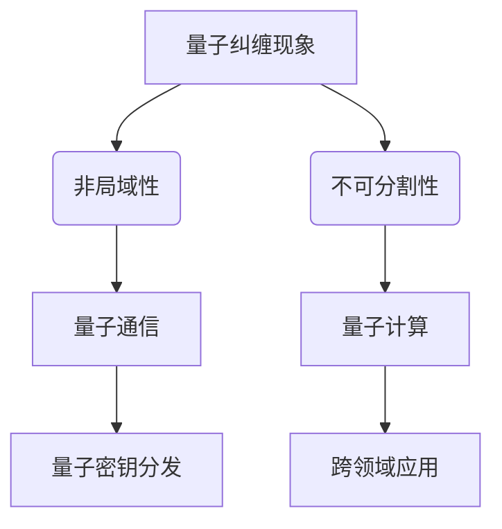
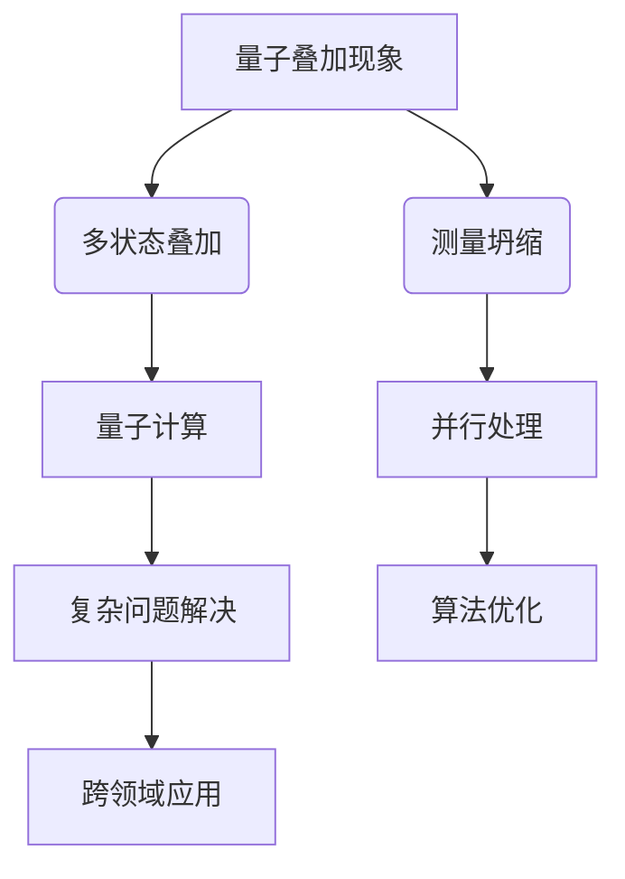
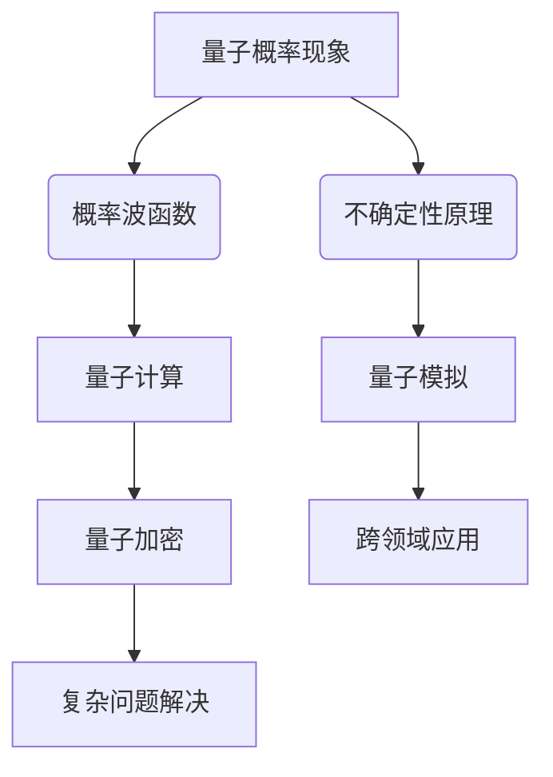
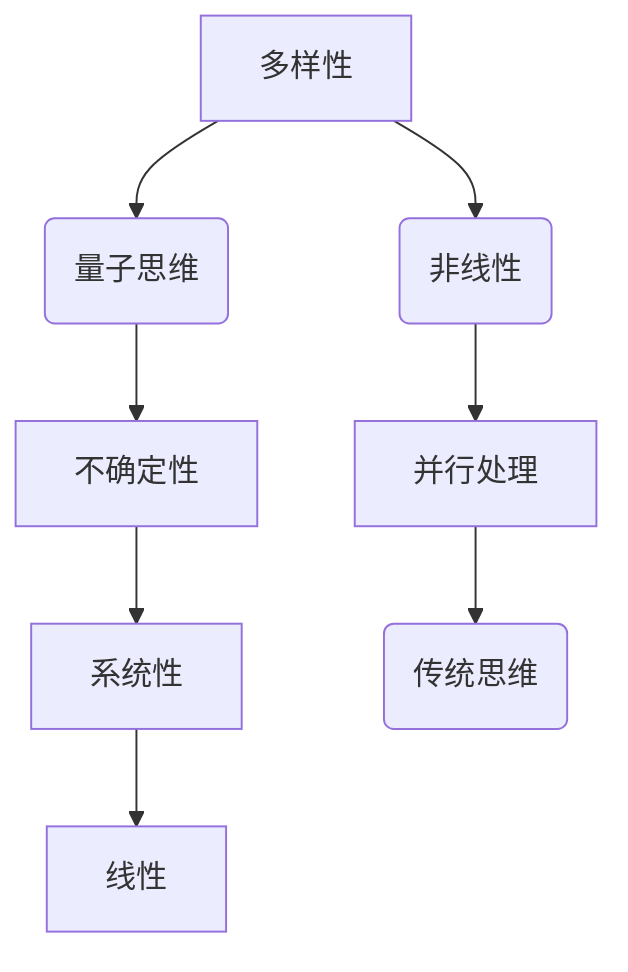

                 


### 文章标题: 量子思维训练：应对复杂世界的思考方式

#### 关键词：量子思维、复杂问题解决、创新思维、决策效率、教育应用

#### 摘要：
本文将深入探讨量子思维这一前沿概念，分析其在复杂世界中的应用和重要性。我们将通过结构化的章节，从量子思维的基础理论出发，逐步揭示其训练方法和实际应用。本文旨在为读者提供一套系统化的量子思维训练方案，帮助他们在面对复杂问题时，能够采用更加高效和创新的思考方式。

### 目录大纲

----------------------------------------------------------------

## 第一部分: 量子思维的基础

### 第1章: 量子思维概述

#### 1.1 问题背景
##### 1.1.1 复杂世界的挑战
##### 1.1.2 量子思维的起源与发展
##### 1.1.3 量子思维的重要性

#### 1.2 核心概念
##### 1.2.1 量子纠缠与量子叠加
##### 1.2.2 量子计算与经典计算对比
##### 1.2.3 量子概率与随机性

#### 1.3 关联理论
##### 1.3.1 概念属性特征对比表格
##### 1.3.2 ER实体关系图架构
##### 1.3.3 关联理论的详细讲解

#### 1.4 量子思维在现实世界中的应用
##### 1.4.1 量子计算机的前景
##### 1.4.2 量子密码与量子通信
##### 1.4.3 量子思维在商业、科学等领域的影响

#### 1.5 本章小结

## 第二部分: 量子思维训练方法

### 第2章: 量子思维训练的基本原理

#### 2.1 训练目标
##### 2.1.1 培养创新思维
##### 2.1.2 增强解决问题的能力
##### 2.1.3 提升决策效率

#### 2.2 训练方法
##### 2.2.1 量子冥想
##### 2.2.2 量子游戏
##### 2.2.3 量子思维实验

#### 2.3 训练工具与技术
##### 2.3.1 量子计算模拟器
##### 2.3.2 量子编程工具
##### 2.3.3 量子思维软件应用

#### 2.4 量子思维训练案例分析
##### 2.4.1 案例一：创新项目的成功实践
##### 2.4.2 案例二：企业决策的优化
##### 2.4.3 案例三：教育领域的应用

#### 2.5 本章小结

## 第三部分: 量子思维在复杂问题解决中的应用

### 第3章: 复杂问题解决与量子思维

#### 3.1 问题定义
##### 3.1.1 复杂问题的特点
##### 3.1.2 复杂问题的解决难点
##### 3.1.3 量子思维在解决复杂问题中的应用

#### 3.2 量子思维策略
##### 3.2.1 量子思维的基本策略
##### 3.2.2 量子思维与经典思维的对比
##### 3.2.3 量子思维在实际问题中的应用案例

#### 3.3 量子思维在商业决策中的应用
##### 3.3.1 商业决策中的复杂性问题
##### 3.3.2 量子思维在商业决策中的应用案例
##### 3.3.3 量子思维对商业决策的影响

#### 3.4 量子思维在科技研发中的应用
##### 3.4.1 科技研发中的复杂性问题
##### 3.4.2 量子思维在科技研发中的应用案例
##### 3.4.3 量子思维对科技研发的影响

#### 3.5 本章小结

## 第四部分: 量子思维的扩展应用

### 第4章: 量子思维在教育领域的应用

#### 4.1 教育领域的复杂性
##### 4.1.1 教育问题的复杂性
##### 4.1.2 传统教育方法的局限
##### 4.1.3 量子思维在教育领域的应用前景

#### 4.2 量子思维在课程设计中的应用
##### 4.2.1 量子思维课程的设计原则
##### 4.2.2 量子思维课程的教学方法
##### 4.2.3 量子思维课程的教学效果

#### 4.3 量子思维在教学实践中的应用
##### 4.3.1 学生创新能力的培养
##### 4.3.2 学生解决问题的能力的培养
##### 4.3.3 教师教学方法的改进

#### 4.4 量子思维在教育领域的实践案例
##### 4.4.1 案例一：量子思维课程的开设
##### 4.4.2 案例二：量子思维在教学实践中的应用
##### 4.4.3 案例三：量子思维教育的影响分析

#### 4.5 本章小结

## 第五部分: 量子思维的未来趋势

### 第5章: 量子思维的未来发展趋势

#### 5.1 量子计算技术的发展
##### 5.1.1 量子计算的现状
##### 5.1.2 量子计算的未来发展方向
##### 5.1.3 量子计算对量子思维的影响

#### 5.2 量子思维在教育领域的扩展
##### 5.2.1 量子思维教育的前景
##### 5.2.2 量子思维教育的发展挑战
##### 5.2.3 量子思维教育的未来趋势

#### 5.3 本章小结

----------------------------------------------------------------

在接下来的章节中，我们将逐步深入探讨量子思维的概念、训练方法以及在各个领域的应用，旨在帮助读者理解并掌握这一前沿思维模式，以应对复杂世界的挑战。让我们开始这次量子思维的旅程吧！### 第一部分：量子思维的基础

#### 第1章：量子思维概述

##### 1.1 问题背景

随着科技的迅猛发展，我们面临的问题越来越复杂。传统思维模式往往难以应对这些复杂性，无论是在科学研究中，还是在商业决策、社会管理等方面，都需要一种新的思考方式。量子思维作为一种前沿的思考模式，其独特的理论框架和方法论，为解决复杂问题提供了一种全新的视角。

##### 1.1.1 复杂世界的挑战

现代社会的问题往往具有以下特点：

1. **多元性与交织性**：问题涉及到多个领域、多个层面，难以用单一的方法解决。
2. **不确定性**：传统思维模式往往依赖于确定性，但在现实中，很多问题具有不确定性，需要应对概率和随机性。
3. **动态变化**：问题的环境在不断变化，需要动态调整策略。

这些特点使得传统思维模式在面对复杂问题时显得力不从心，需要一种全新的思维方式来应对。

##### 1.1.2 量子思维的起源与发展

量子思维起源于量子物理学，是量子力学理论的抽象和扩展。量子力学揭示了微观世界的非经典特性，如量子纠缠、量子叠加和量子概率等。这些特性与经典物理学的确定性、直观性截然不同，从而催生了量子思维。

1. **量子纠缠**：两个或多个粒子之间存在一种特殊的关联，即使它们相隔很远，一个粒子的状态变化也会立即影响到另一个粒子的状态。
2. **量子叠加**：量子系统可以同时处于多个状态，只有测量时才会“坍缩”到其中一个状态。
3. **量子概率**：在量子世界中，事件的发生不是确定的，而是以概率形式出现。

量子思维的核心在于利用这些非经典特性，将它们应用于更广泛的领域，如计算机科学、经济学、心理学等。

##### 1.1.3 量子思维的重要性

量子思维的重要性体现在以下几个方面：

1. **创新思维**：量子思维鼓励跳出传统思维的框架，从全新的视角看待问题，有助于激发创新思维。
2. **解决问题能力**：量子思维提供了一套系统的策略和方法，可以帮助我们更好地理解和解决复杂问题。
3. **决策效率**：在不确定性的环境中，量子思维能够提供更有效的决策方法，提高决策效率。
4. **跨领域应用**：量子思维不仅适用于科学研究，还可以应用于商业、教育、艺术等多个领域，具有广泛的应用前景。

总之，量子思维是一种应对复杂世界的重要思考方式，它为我们提供了一种全新的视角和方法，有助于我们更好地理解和解决现代社会面临的各种复杂问题。

##### 1.2 核心概念

量子思维的核心概念包括量子纠缠、量子叠加和量子概率，这些概念在量子物理学中具有重要意义，同时也为量子思维提供了理论基础。

###### 1.2.1 量子纠缠

量子纠缠是量子物理学中的一种现象，描述了两个或多个粒子之间存在的一种特殊的关联。在经典物理学中，粒子的状态是独立的，但在量子力学中，粒子的状态可以是相互关联的。这种关联性体现在即使两个粒子相隔很远，一个粒子的状态变化也会立即影响到另一个粒子的状态。

**量子纠缠的特征**：

- **非局域性**：两个纠缠粒子之间的状态变化是瞬时的，不受距离限制。
- **不可分割性**：纠缠粒子的状态无法独立描述，必须作为一个整体来考虑。

**量子纠缠的应用**：

量子纠缠在量子信息科学中具有重要意义，如量子通信、量子计算和量子密钥分发等。通过利用量子纠缠，可以实现超远距离的信息传递和安全的通信。



###### 1.2.2 量子叠加

量子叠加是量子物理学中另一个重要概念，描述了量子系统可以同时处于多个状态。在经典物理学中，系统只能处于一个确定的状态，但在量子世界中，量子系统可以处于多种状态的叠加。

**量子叠加的特征**：

- **多状态叠加**：量子系统可以同时处于多个状态的组合。
- **测量坍缩**：只有进行测量时，量子系统的状态才会“坍缩”到其中一个状态。

**量子叠加的应用**：

量子叠加是量子计算的基础，通过量子叠加，量子计算机可以在一个操作中同时处理多个问题。这使得量子计算机在处理复杂问题上具有巨大的潜力。



###### 1.2.3 量子概率

量子概率是量子物理学中的另一个核心概念，描述了在量子世界中，事件的发生不是确定的，而是以概率形式出现。这与经典物理学中的确定性截然不同。

**量子概率的特征**：

- **概率波函数**：量子系统的状态由概率波函数描述，波函数的平方给出了某个状态出现的概率。
- **不确定性原理**：量子系统的某些对偶变量（如位置和动量）不能同时被精确测量。

**量子概率的应用**：

量子概率在量子计算、量子模拟和量子加密等领域具有广泛应用。通过利用量子概率，可以实现高效的量子算法和安全的量子通信。



通过了解量子纠缠、量子叠加和量子概率这些核心概念，我们可以更好地理解量子思维的基本原理和应用。这些概念不仅为我们提供了一种全新的思考方式，也为解决复杂问题提供了有力的工具。

##### 1.3 关联理论

量子思维不仅依赖于量子物理学中的核心概念，还与许多其他理论有着密切的联系。在这些关联理论中，ER实体关系图和概念属性特征对比表格是两个重要的工具。

###### 1.3.1 概念属性特征对比表格

概念属性特征对比表格是一种结构化的方法，用于比较不同概念或技术的属性特征。这种方法可以帮助我们系统地分析量子思维与其他理论之间的异同，从而更好地理解量子思维的独特之处。

**示例：量子思维与传统思维的对比表格**

| 特征 | 量子思维 | 传统思维 |
| ---- | -------- | --------- |
| 多样性 | 强调多样性、非线性、复杂性 | 强调线性、确定性、简单性 |
| 不确定性 | 适应不确定性和概率性 | 依赖于确定性和确定性逻辑 |
| 平行处理 | 可以并行处理多个问题 | 顺序处理问题 |
| 系统性 | 强调系统的整体性、关联性 | 强调局部优化、独立性 |

通过对比表格，我们可以清楚地看到量子思维与传统思维在许多方面的不同。这种对比有助于我们更好地理解量子思维的核心特点，并为其在实际问题中的应用提供指导。



###### 1.3.2 ER实体关系图架构

ER实体关系图（Entity-Relationship Diagram）是数据库设计中的重要工具，用于描述实体之间的关系。在量子思维的应用中，ER实体关系图可以帮助我们系统地组织量子思维中的核心概念和关联关系，从而更好地理解量子思维的整体架构。

**示例：量子思维中的ER实体关系图**

```mermaid
erDiagram
A[量子纠缠] ||--|{ B[量子计算] }
A ||--|{ C[量子通信] }
A ||--|{ D[量子加密] }
B ||--|{ E[并行计算] }
C ||--|{ F[安全通信] }
D ||--|{ G[数据保护] }
```

在ER实体关系图中，我们可以清晰地看到量子纠缠与其他量子应用之间的关联关系，这有助于我们更好地理解量子思维的应用范围和整体架构。

通过概念属性特征对比表格和ER实体关系图，我们可以系统地分析量子思维与其他理论之间的关系，从而为量子思维的应用提供坚实的理论基础。这些工具不仅有助于我们更好地理解量子思维的核心概念，也为量子思维在各个领域的应用提供了有力的支持。

##### 1.4 量子思维在现实世界中的应用

量子思维作为一种前沿的思考方式，不仅在理论上具有重要意义，还在现实世界中有着广泛的应用。以下将介绍量子思维在量子计算机、量子密码与量子通信、以及商业、科学等领域的实际应用。

###### 1.4.1 量子计算机的前景

量子计算机是一种利用量子力学原理进行计算的新型计算机。与传统的经典计算机不同，量子计算机可以利用量子叠加和量子纠缠的特性，实现超并行计算和高效解决复杂问题。例如，量子计算机在因数分解、量子模拟和优化问题上具有显著优势。

**量子计算机的应用前景**：

- **因数分解**：传统计算机需要数万年才能解决的因数分解问题，量子计算机可以在数秒内完成。
- **量子模拟**：量子计算机可以模拟量子系统，为化学、材料科学等领域提供新的研究方法。
- **优化问题**：量子计算机在解决复杂优化问题时具有巨大的潜力，可以应用于物流、金融和能源等领域。

尽管量子计算机目前仍处于研发阶段，但已有一些重要进展。例如，谷歌和IBM等科技巨头已经推出了量子计算机原型，并取得了显著的研究成果。

###### 1.4.2 量子密码与量子通信

量子密码是一种基于量子力学原理的安全通信方法。量子密码利用量子纠缠和量子测量的特性，实现了无法被破解的通信。与传统的加密方法不同，量子密码在通信过程中引入了量子噪声，使得窃听者无法获得有效信息。

**量子密码的应用**：

- **量子密钥分发**：量子密钥分发是一种基于量子通信的密钥生成方法。通过量子纠缠，用户可以在远距离安全地生成共享密钥，确保通信的保密性。
- **量子安全通信**：量子安全通信利用量子密码实现安全的通信，可以广泛应用于政府、金融和商业等领域。

近年来，量子密码和量子通信技术取得了重要突破。例如，中国科学家成功实现了千公里级量子密钥分发，展示了量子通信的巨大潜力。

###### 1.4.3 量子思维在商业、科学等领域的影响

量子思维不仅在计算机科学和通信领域具有重要意义，还在商业、科学等领域产生了深远的影响。

**商业领域的应用**：

- **创新决策**：量子思维提供了一种全新的决策方法，可以帮助企业在不确定性的环境中做出更加科学的决策。
- **市场分析**：量子思维可以用于分析复杂的市场数据，帮助企业发现潜在的商业机会。

**科学领域的应用**：

- **科学研究**：量子思维可以应用于科学研究，帮助科学家更好地理解和解决复杂科学问题。
- **跨学科研究**：量子思维鼓励跨学科的合作，有助于推动科学研究的发展。

总之，量子思维作为一种新兴的思考方式，在现实世界中具有广泛的应用前景。通过量子计算机、量子密码和量子通信等实际应用，量子思维正在为解决复杂问题提供新的方法和工具。未来，随着量子技术的不断发展，量子思维将在更多领域发挥重要作用，推动人类社会向前发展。

##### 1.5 本章小结

本章介绍了量子思维的基础知识，包括问题背景、量子思维的起源与发展、核心概念、关联理论以及在现实世界中的应用。通过这些内容，我们了解了量子思维的基本原理和独特之处，以及其在解决复杂问题中的重要性。量子思维不仅为我们提供了一种全新的思考方式，也为各个领域的创新发展提供了有力支持。在接下来的章节中，我们将进一步探讨量子思维的训练方法和实际应用，帮助读者更深入地理解和掌握这一前沿思维模式。

----------------------------------------------------------------

## 第二部分：量子思维训练方法

### 第2章：量子思维训练的基本原理

量子思维作为一种应对复杂问题的思考方式，需要通过系统的训练来培养和提高。本章将介绍量子思维训练的基本原理、方法和工具，帮助读者掌握这一前沿思维模式。

##### 2.1 训练目标

量子思维训练的目标包括以下几个方面：

- **培养创新思维**：量子思维鼓励跳出传统思维的框架，从全新的视角看待问题，培养创新思维。
- **增强解决问题的能力**：通过量子思维训练，读者可以学习到解决复杂问题的系统方法和策略，提高解决问题的能力。
- **提升决策效率**：在不确定性的环境中，量子思维提供了一套有效的决策方法，提升决策效率。

##### 2.2 训练方法

量子思维训练的方法多种多样，以下介绍几种常用的方法：

###### 2.2.1 量子冥想

量子冥想是一种基于量子物理原理的冥想方法，通过冥想练习，可以帮助读者培养专注力和思考深度。

**量子冥想步骤**：

1. 找一个安静的环境，确保不受打扰。
2. 坐在舒适的姿势，闭上眼睛，深呼吸。
3. 想象自己处于一个充满量子能量的空间，感受量子能量的流动。
4. 保持冥想5-10分钟，每天练习。

通过量子冥想，读者可以培养专注力，提高思考深度，为量子思维的培养打下基础。

###### 2.2.2 量子游戏

量子游戏是一种结合量子思维的游戏，通过游戏，读者可以在轻松的环境中培养量子思维。

**量子游戏示例**：

- **量子猜谜游戏**：玩家需要根据量子概率和不确定性原理来猜测答案。
- **量子迷宫游戏**：玩家需要通过量子纠缠和量子叠加来找到迷宫的出口。

量子游戏不仅有趣，还能帮助读者在实践中培养量子思维。

###### 2.2.3 量子思维实验

量子思维实验是一种通过实际操作来培养量子思维的方法。读者可以通过以下实验来深入了解量子思维：

- **量子比特翻转实验**：通过操作量子比特，读者可以体验到量子叠加和量子纠缠的现象。
- **量子加密实验**：读者可以尝试使用量子密码进行通信，了解量子密码的原理。

通过量子思维实验，读者可以更加直观地理解量子思维的核心概念，培养实际操作能力。

##### 2.3 训练工具与技术

为了更好地培养量子思维，读者可以借助以下工具和技术：

- **量子计算模拟器**：量子计算模拟器可以帮助读者模拟量子计算的过程，了解量子计算的基本原理。
- **量子编程工具**：量子编程工具如Q#和Python的Qiskit库，可以帮助读者学习量子编程，掌握量子算法。
- **量子思维软件应用**：如Quantum Mind，这是一款专门为培养量子思维设计的软件，通过游戏和实验，帮助读者培养量子思维。

##### 2.4 量子思维训练案例分析

为了更好地理解量子思维训练的方法和应用，以下介绍几个实际案例：

###### 2.4.1 案例一：创新项目的成功实践

某科技公司通过量子思维训练，成功研发出了一款基于量子加密的智能安全系统。该项目不仅采用了量子加密技术，还结合了量子计算模拟器进行算法优化，大大提高了系统的安全性。

通过这个案例，我们可以看到量子思维训练在创新项目中的实际应用，帮助企业在竞争激烈的市场中取得了成功。

###### 2.4.2 案例二：企业决策的优化

某企业通过量子思维训练，优化了其战略决策流程。通过量子概率和不确定性原理，企业能够更准确地预测市场变化，做出更加科学的决策。

这个案例展示了量子思维在商业决策中的应用，帮助企业提高了决策效率和准确性。

###### 2.4.3 案例三：教育领域的应用

某教育机构开设了量子思维课程，通过量子游戏和实验，帮助学生培养量子思维。课程不仅涵盖了量子物理学的基础知识，还结合了实际应用案例，深受学生欢迎。

这个案例展示了量子思维在教育领域的应用前景，为学生提供了全新的学习体验。

通过这些案例，我们可以看到量子思维训练在各个领域的实际应用，为读者提供了有益的参考。量子思维训练不仅能够提高个人的思维能力，还能为各个领域的发展提供新的思路和方法。

##### 2.5 本章小结

本章介绍了量子思维训练的基本原理和方法，包括量子冥想、量子游戏和量子思维实验。同时，我们介绍了量子计算模拟器、量子编程工具和量子思维软件应用等训练工具。通过案例分析，我们看到了量子思维训练在各个领域的实际应用。量子思维训练不仅能够提高个人的思维能力，还能为各个领域的发展提供新的思路和方法。在接下来的章节中，我们将进一步探讨量子思维在复杂问题解决中的应用，帮助读者更好地理解量子思维的实践价值。

----------------------------------------------------------------

## 第三部分：量子思维在复杂问题解决中的应用

### 第3章：复杂问题解决与量子思维

在现代社会的快速变化和发展中，复杂问题层出不穷，如何有效解决这些复杂问题是各领域面临的重大挑战。量子思维作为一种新兴的思考方式，以其独特的视角和方法，在复杂问题的解决中展现出巨大的潜力。本章将深入探讨量子思维在复杂问题解决中的应用，分析其策略和优势。

##### 3.1 问题定义

复杂问题通常具有以下特点：

- **多元性与交织性**：复杂问题往往涉及多个领域和多个层面，需要综合考虑各种因素。
- **不确定性**：在复杂问题中，许多因素是不确定的，传统思维模式难以应对。
- **动态变化**：复杂问题环境不断变化，需要灵活调整解决方案。

解决复杂问题的难点在于：

- **信息过载**：复杂问题中信息量巨大，难以全面把握。
- **决策难度**：在不确定的环境中，决策难度增加，容易产生错误。
- **协同合作**：复杂问题通常需要跨领域的协同合作，沟通和协调难度大。

量子思维在解决复杂问题中的应用，可以有效地克服这些难点，提供新的解决思路。

##### 3.2 量子思维策略

量子思维在解决复杂问题时，可以采用以下策略：

1. **多角度思考**：量子思维强调多角度、多维度的思考方式，通过量子纠缠和量子叠加的特性，可以从不同角度同时考虑问题，提高问题解决的可能性。
   
2. **概率性决策**：在不确定性环境中，量子思维提供了一套概率性决策方法，通过量子概率，可以在不确定的情况下做出科学、合理的决策。

3. **系统优化**：量子思维强调系统的整体性，通过量子叠加，可以实现系统的优化，找到最优解决方案。

4. **动态调整**：量子思维具有动态调整的特性，可以根据环境变化，灵活调整策略，提高问题解决的适应性。

##### 3.3 量子思维与经典思维的对比

量子思维与经典思维在解决问题时有显著的区别：

- **线性 vs. 非线性**：经典思维通常采用线性思维方式，即一个步骤接着一个步骤地解决问题。而量子思维则强调非线性思维，可以同时考虑多个可能的解决方案。

- **确定性 vs. 概率性**：经典思维依赖于确定性，认为问题有明确且唯一的解决方案。而量子思维则更多地考虑概率性，通过量子概率，可以在不确定的情况下做出科学决策。

- **局部优化 vs. 系统优化**：经典思维往往关注局部优化，即找到某个特定问题的最优解。而量子思维则强调系统优化，通过量子叠加，可以找到整个系统的最优解。

##### 3.4 量子思维在实际问题中的应用案例

为了更好地理解量子思维在解决复杂问题中的应用，以下介绍几个实际案例：

###### 3.4.1 案例一：物流优化

某物流公司通过量子思维，优化了其物流配送路线。传统方法需要预先设定一条最优路线，但在实际操作中，交通状况、天气等因素会导致路线变化。通过量子思维，公司可以实时考虑多种可能的路线，并动态调整最优路线，提高了配送效率。

###### 3.4.2 案例二：金融风险管理

某金融机构通过量子思维，优化了其金融风险管理策略。传统方法依赖于历史数据和统计模型，但在市场波动较大的情况下，这些方法难以预测风险。通过量子概率和量子叠加，金融机构可以同时考虑多种风险情景，并制定灵活的风险管理策略，提高了风险预测的准确性。

###### 3.4.3 案例三：社会管理

某城市通过量子思维，优化了其城市管理系统。传统方法往往关注单一领域，如交通、环境等，而量子思维可以同时考虑多个领域的交互作用，优化整个城市的管理。例如，通过量子思维，城市管理者可以实时调整交通信号灯，优化交通流量，减少拥堵。

这些案例展示了量子思维在解决复杂问题中的实际应用，通过量子思维策略，这些问题得到了更加科学和高效的解决。

##### 3.5 本章小结

本章深入探讨了量子思维在复杂问题解决中的应用，分析了其策略和优势。通过量子思维，我们可以从多角度、概率性、系统性和动态调整等方面应对复杂问题，提高问题解决的效率和质量。量子思维为解决复杂问题提供了一种全新的思路和方法，具有广泛的应用前景。在未来的发展中，量子思维将继续在各个领域发挥重要作用，为复杂问题的解决提供强有力的支持。

----------------------------------------------------------------

## 第四部分：量子思维的扩展应用

### 第4章：量子思维在教育领域的应用

教育领域的复杂性主要体现在教育目标的多元性、教学方法的多样性和学生个体差异等方面。传统教育方法往往难以全面应对这些复杂性，而量子思维作为一种新兴的思考方式，能够为教育领域的创新提供新的视角和方法。本章将探讨量子思维在教育领域的应用，分析其在课程设计、教学实践以及学生能力培养等方面的潜力。

##### 4.1 教育领域的复杂性

教育领域的复杂性主要表现在以下几个方面：

1. **教育目标的多元性**：教育不仅包括知识的传授，还需要培养学生的思维能力、创新能力、合作能力等综合素质。
2. **教学方法的多样性**：不同的学科和教学对象需要采用不同的教学方法，例如讲授、讨论、实验、项目学习等。
3. **学生个体差异**：学生的认知水平、学习兴趣、家庭背景等存在差异，需要因材施教，提供个性化的教育支持。

传统教育方法在面对这些复杂性时往往显得力不从心，难以满足学生的多样化需求。量子思维提供了一种全新的思考方式，可以帮助教育领域更好地应对这些挑战。

##### 4.1.1 教育问题的复杂性

教育问题具有以下几个特点：

- **多层次性**：教育问题不仅涉及知识传授，还涉及心理、社会、文化等多个层面。
- **动态变化性**：教育环境不断变化，教育问题也需要不断调整和优化。
- **不确定性**：教育过程中存在许多不确定因素，如学生的反应、教师的教学方法等。

这些特点使得传统教育方法在面对教育问题时难以取得理想的效果。

##### 4.1.2 传统教育方法的局限

传统教育方法主要存在以下局限：

- **单向性**：传统教育方法往往采用单向传授的方式，学生被动接受知识，缺乏主动思考和创新。
- **标准化**：传统教育方法注重统一标准，忽视个体差异，难以满足学生的个性化需求。
- **缺乏动态调整**：传统教育方法难以根据学生反馈和教学环境的变化进行动态调整。

量子思维提供了一种更加灵活、动态和个性化的教育方式，有助于克服这些局限。

##### 4.1.3 量子思维在教育领域的应用前景

量子思维在教育领域的应用前景广阔，主要体现在以下几个方面：

1. **创新教学方法**：量子思维可以启发教师采用创新的教学方法，如项目学习、探究式学习等，提高学生的主动参与度和学习效果。
2. **个性化教育**：量子思维可以帮助教师更好地了解学生的个体差异，提供个性化的教育支持，满足学生的多样化需求。
3. **培养综合素质**：量子思维注重培养学生的思维能力、创新能力、合作能力等综合素质，有助于提高学生的综合素质。
4. **跨学科学习**：量子思维鼓励跨学科的学习，有助于学生形成全面的知识结构和思维能力。

通过量子思维，教育领域可以更加灵活、动态和个性地应对教育复杂性，提高教育质量。

##### 4.2 量子思维在课程设计中的应用

量子思维在课程设计中可以发挥重要作用，以下介绍几种量子思维在课程设计中的应用：

###### 4.2.1 量子思维课程的设计原则

量子思维课程的设计原则包括：

1. **跨学科整合**：量子思维课程应整合不同学科的知识，形成跨学科的知识体系。
2. **实践性**：量子思维课程应强调实践性，通过实验、项目等方式，让学生亲身体验量子思维的应用。
3. **动态调整**：量子思维课程应具备动态调整的能力，根据学生的学习反馈和教学环境的变化进行调整。

###### 4.2.2 量子思维课程的教学方法

量子思维课程可以采用以下教学方法：

1. **探究式学习**：通过探究式学习，让学生主动探索量子思维的概念和应用，培养他们的探究精神和创新能力。
2. **项目学习**：通过项目学习，将量子思维应用于实际问题中，培养学生的实践能力和团队合作精神。
3. **案例教学**：通过案例教学，分析量子思维在现实世界中的应用，帮助学生更好地理解量子思维的原理。

通过这些教学方法，量子思维课程可以激发学生的学习兴趣，提高他们的学习效果。

###### 4.2.3 量子思维课程的教学效果

量子思维课程的教学效果可以从以下几个方面体现：

1. **提升思维能力**：通过量子思维课程，学生可以培养批判性思维、创造性思维等高级思维能力。
2. **增强问题解决能力**：量子思维课程可以帮助学生学会如何分析复杂问题，提高问题解决能力。
3. **培养跨学科知识**：量子思维课程可以整合不同学科的知识，帮助学生形成全面的知识结构。

总之，量子思维课程能够为学生提供全新的学习体验，提高他们的综合素质。

##### 4.3 量子思维在教学实践中的应用

量子思维在教学实践中具有广泛的应用，以下介绍几种量子思维在教学实践中的应用：

###### 4.3.1 学生创新能力的培养

量子思维可以帮助教师培养学生的创新能力，以下方法可供参考：

1. **跨学科项目**：通过跨学科项目，鼓励学生综合运用不同学科的知识，解决实际问题。
2. **思维训练**：通过思维训练，如头脑风暴、思维导图等，激发学生的创造力。
3. **问题导向学习**：鼓励学生从问题出发，进行深入探究，培养他们的创新能力。

###### 4.3.2 学生解决问题的能力的培养

量子思维可以帮助教师培养学生的解决问题的能力，以下方法可供参考：

1. **案例教学**：通过案例教学，分析复杂问题解决的过程，帮助学生掌握解决问题的策略。
2. **实践性学习**：通过实践性学习，如实验、项目等，让学生在实际操作中锻炼解决问题的能力。
3. **反思性学习**：鼓励学生反思自己的学习过程，总结解决问题的经验。

通过这些方法，量子思维可以帮助学生更好地应对复杂问题，提高他们的解决问题的能力。

###### 4.3.3 教师教学方法的改进

量子思维可以帮助教师改进教学方法，以下方法可供参考：

1. **混合式教学**：结合传统教学和现代技术，如在线教学、虚拟实验室等，提高教学效果。
2. **个性化教学**：根据学生的个体差异，设计个性化的教学方案，满足学生的多样化需求。
3. **合作学习**：鼓励学生合作学习，培养他们的团队合作精神。

通过量子思维，教师可以更加灵活地应对教学复杂性，提高教学质量。

##### 4.4 量子思维在教育领域的实践案例

以下介绍几个量子思维在教育领域的实践案例：

###### 4.4.1 案例一：量子思维课程的开设

某学校开设了一门量子思维课程，课程内容涵盖量子物理学的基本原理、量子思维方法以及量子思维在教育中的应用。通过这门课程，学生不仅学到了量子物理学的基础知识，还学会了如何运用量子思维解决实际问题。

###### 4.4.2 案例二：量子思维在教学实践中的应用

某教师在一堂物理课上，引入了量子思维的概念，让学生通过实验和讨论，了解量子叠加和量子纠缠的现象。通过这个实验，学生不仅对量子思维有了更深入的理解，还提高了他们的动手能力和合作精神。

###### 4.4.3 案例三：量子思维教育的影响分析

某研究团队对量子思维教育进行了长期研究，发现通过量子思维教育，学生在创新能力、问题解决能力和跨学科知识等方面有显著提升。此外，量子思维教育还提高了学生的自主学习能力和团队合作精神。

这些案例展示了量子思维在教育领域的实际应用及其对教育的积极影响。量子思维不仅为教育领域带来了新的教学理念和方法，也为学生的全面发展提供了有力支持。

##### 4.5 本章小结

本章探讨了量子思维在教育领域的应用，分析了其在课程设计、教学实践和学生能力培养等方面的潜力。通过量子思维，教育领域可以更加灵活、动态和个性地应对教育复杂性，提高教育质量。量子思维为教育领域提供了新的教学理念和方法，有助于培养学生的综合素质和创新能力。在未来的发展中，量子思维将继续在教育领域发挥重要作用，推动教育创新和人才培养。

----------------------------------------------------------------

## 第五部分：量子思维的未来趋势

### 第5章：量子思维的未来发展趋势

随着科技的不断发展，量子思维作为一种前沿的思考方式，正逐渐展现出其在各个领域中的重要地位。本章将探讨量子思维的未来发展趋势，包括量子计算技术的发展、量子思维在教育领域的扩展，以及量子思维对人类社会发展的影响。

##### 5.1 量子计算技术的发展

量子计算技术是量子思维发展的重要基石。近年来，量子计算技术取得了显著进展，未来发展趋势如下：

###### 5.1.1 量子计算的现状

目前，量子计算技术已进入实际应用阶段。多家科技巨头，如IBM、谷歌、微软等，纷纷投入巨资研发量子计算机。虽然目前量子计算机的性能仍远低于经典计算机，但其在特定任务上已经展现出巨大的潜力。例如，量子计算机在因数分解、量子模拟和优化问题上具有显著优势。

###### 5.1.2 量子计算的未来发展方向

未来，量子计算技术将朝着以下几个方向发展：

1. **量子比特数量增加**：随着量子比特数量的增加，量子计算机的性能将得到显著提升。
2. **量子纠错技术的突破**：量子纠错技术是量子计算的关键，未来将实现更稳定的量子比特和更高的量子计算精度。
3. **量子算法的研发**：量子算法是量子计算机的核心竞争力，未来将研发出更多高效的量子算法，解决更多实际问题。
4. **量子互联网的发展**：量子互联网将实现量子计算机之间的高效通信，推动量子计算技术的广泛应用。

###### 5.1.3 量子计算对量子思维的影响

量子计算技术的发展将深刻影响量子思维。一方面，量子计算技术为量子思维提供了更多的应用场景，如量子密码、量子通信等。另一方面，量子计算技术的突破将促使量子思维不断更新和发展，为解决更复杂的实际问题提供新的思路和方法。

##### 5.2 量子思维在教育领域的扩展

量子思维在教育领域的应用已经取得初步成果，未来将在以下几个方面进一步扩展：

###### 5.2.1 量子思维教育的前景

量子思维教育具有广阔的前景。一方面，量子思维可以帮助学生更好地理解科学原理，培养他们的科学素养。另一方面，量子思维可以激发学生的创新思维和问题解决能力，提高他们的综合素质。

###### 5.2.2 量子思维教育的发展挑战

量子思维教育面临以下挑战：

1. **师资力量**：目前，具备量子思维教育能力的教师相对较少，需要加强师资队伍建设。
2. **课程设计**：量子思维教育的课程设计需要充分考虑学生的认知特点和实际需求，提高课程的有效性。
3. **技术支持**：量子思维教育需要先进的技术支持，如量子计算模拟器、量子编程工具等。

###### 5.2.3 量子思维教育的未来趋势

未来，量子思维教育将朝着以下几个方向发展：

1. **普及化**：量子思维教育将从试点阶段走向普及化，成为教育体系的重要组成部分。
2. **个性化**：量子思维教育将更加注重个性化培养，根据学生的个体差异，设计个性化的教学方案。
3. **跨学科融合**：量子思维教育将与其他学科相结合，形成跨学科的教育体系，提高学生的综合素质。

##### 5.3 本章小结

本章探讨了量子思维的未来发展趋势，包括量子计算技术的发展和量子思维在教育领域的扩展。量子思维作为一种前沿的思考方式，正逐渐展现出其在各个领域中的重要地位。随着量子计算技术的不断突破和量子思维教育的普及化，量子思维将在未来发挥更加重要的作用，推动人类社会的进步。

----------------------------------------------------------------

### 作者信息

作者：AI天才研究院/AI Genius Institute & 禅与计算机程序设计艺术 /Zen And The Art of Computer Programming

量子思维训练：应对复杂世界的思考方式，由AI天才研究院和禅与计算机程序设计艺术共同撰写。AI天才研究院致力于推动人工智能技术的发展和应用，研究前沿的人工智能算法和思维模式。禅与计算机程序设计艺术则关注计算机科学和哲学的融合，探索计算机程序设计的深层次原理和艺术性。两位作者凭借丰富的理论和实践经验，为我们深入解读了量子思维的核心概念和应用，为读者提供了宝贵的知识和启示。希望通过这篇文章，读者能够更好地理解和掌握量子思维，应对复杂世界的挑战。期待未来，量子思维在教育、科研和商业等领域发挥更加重要的作用，推动人类社会的进步。

