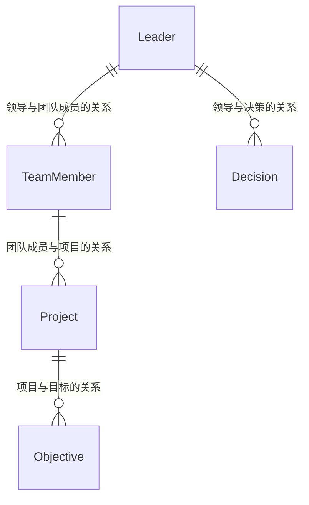
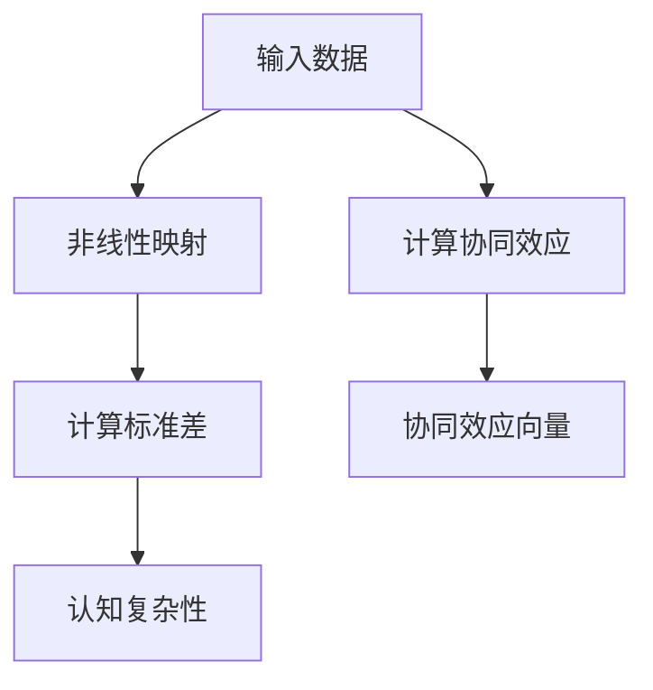
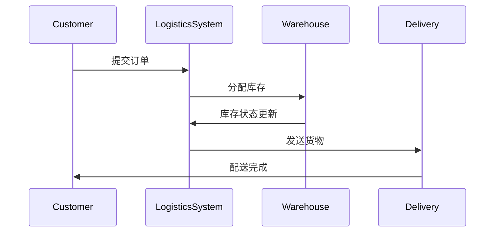
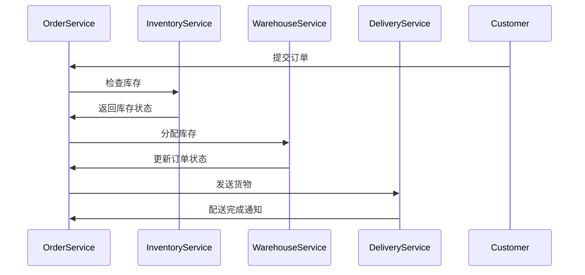

                 

### 第一部分：背景介绍

#### 第1章 问题背景

#### 1.1.1 不确定性时代的来临

##### 1.1.1.1 全球化进程的影响

全球化进程的加速使得世界各国之间的经济、文化、政治联系日益紧密。然而，这种紧密的联系也带来了不确定性的增加。首先，全球市场的不稳定性愈发显著。国际贸易摩擦、货币汇率波动、全球供应链中断等因素，使得企业面临着前所未有的风险和挑战。其次，技术创新的冲击也不可忽视。人工智能、物联网、区块链等新兴技术的快速发展，不断改变着行业的竞争格局，也迫使企业和管理者不断适应新的技术环境。

##### 1.1.1.2 企业的应对挑战

在全球化进程和技术创新的冲击下，企业面临着诸多挑战。首先，管理者的角色发生了转变。从传统的命令和控制模式，转变为更加注重团队协作和创新的领导方式。这要求管理者不仅要有专业的技术知识，还要具备应对不确定性的能力和智慧。其次，团队协作的重要性日益凸显。在复杂多变的市场环境中，单一部门或个人的能力难以应对挑战，跨部门、跨领域的协作成为企业生存和发展的关键。如何激发团队的创造力，提高协作效率，成为企业管理者亟需解决的问题。

#### 第2章 问题描述

##### 2.1.1 量子领导力的定义

量子领导力是一种基于量子力学原理的新型领导理念，它强调领导者在不确定性环境中的决策能力和创新能力。与传统领导力相比，量子领导力更注重非线性思维、协同效应和创新思维。量子领导力的核心在于，通过激发团队内在的潜力和创造力，实现组织的高效运作和持续发展。

##### 2.1.2 传统领导力与现代领导力的对比

传统领导力主要依赖于权威主义和独裁式管理方式，强调领导者的个人魅力和决策力。而现代领导力则更倾向于参与式和透明化管理模式，注重与团队成员的沟通和协作。然而，在不确定性时代，传统领导力的局限性日益凸显。面对复杂多变的环境，单一的管理模式难以适应，需要管理者具备更广阔的视野和更高的领导艺术。

#### 第3章 问题解决

##### 3.1.1 量子领导力培训的目的

量子领导力培训旨在提升管理者的认知能力和领导艺术，使其能够更好地应对不确定性时代的挑战。培训的核心目的是帮助管理者理解不确定性的本质，掌握非线性思维和协同创新的方法，提高团队协作效率，从而实现组织的高效运作和持续发展。

##### 3.1.2 量子领导力培训的核心内容

量子领导力培训的核心内容主要包括量子思维模式的培养、量子协同原理的理解和实践应用。量子思维模式强调非线性思维和整体观念，有助于管理者从宏观和微观两个层面看待问题，提高决策的科学性和前瞻性。量子协同原理则强调协同效应和协同创新，通过激发团队的内在潜力，实现组织的高效运作和创新发展。

##### 3.1.3 培训方法与实施步骤

量子领导力培训采用理论讲解、案例分析、实践操作相结合的方法。首先，通过理论讲解帮助管理者理解量子领导力的基本原理和核心概念。然后，通过案例分析让管理者了解量子领导力在实践中的应用，并从中汲取经验教训。最后，通过实践操作让管理者将所学知识应用到实际工作中，提高领导力和团队协作能力。

### 目录大纲

#### 量子领导力培训：不确定性时代的管理艺术

##### 关键词：量子领导力、不确定性、管理艺术、非线性思维、协同创新

##### 摘要：
本文旨在探讨不确定性时代下量子领导力的重要性，以及如何通过量子领导力培训提升管理者的认知能力和领导艺术。文章首先分析了全球化进程和科技创新对企业管理带来的挑战，然后介绍了量子领导力的定义和特点，以及与传统领导力的对比。接着，文章阐述了量子领导力培训的目的、核心内容和方法，最后提出了量子领导力在企业管理中的适用范围和关键要素。通过本文的探讨，希望能为管理者提供有益的启示和指导，助力企业应对不确定性时代的挑战。

---

### 第二部分：核心概念与联系

#### 第6章 核心概念原理

##### 6.1.1 量子认知原理

量子认知是指将量子力学的基本原理应用于认知科学和心理学领域，探讨人类认知过程的本质和机制。量子认知原理主要包括以下两个方面：

###### 6.1.1.1 认知复杂性

认知复杂性是指人类认知过程所具有的复杂性和多样性。认知复杂性表现在以下几个方面：

- **非线性特性**：人类的认知过程通常不是线性的，而是存在多种可能的路径和结果。例如，人们在解决问题时可能会采用不同的思维策略，得出不同的结论。
- **整体性观念**：人类认知往往不是对单个要素的分析，而是对整体系统的理解。例如，在理解一个概念时，人们通常会考虑该概念与其他概念之间的关联和相互作用。
- **概率性**：人类认知过程中存在不确定性，即某一认知结果并不是确定的，而是有一定的概率分布。

###### 6.1.1.2 认知非线性

认知非线性是指人类认知过程中非线性的特点和规律。认知非线性表现在以下几个方面：

- **非线性关系**：人类认知中的变量之间往往存在非线性关系，即一个变量的变化不会直接导致另一个变量的变化，而是通过一系列复杂的相互作用和反馈过程。
- **非线性思维**：非线性思维是一种超越传统逻辑思维的思考方式，强调从整体和系统的角度看待问题，寻找创新和突破的方法。

##### 6.1.2 量子协同原理

量子协同是指通过量子力学原理指导团队协作，实现团队成员之间的协同效应和协同创新。量子协同原理主要包括以下两个方面：

###### 6.1.2.1 协同效应

协同效应是指团队成员之间的协同作用能够产生大于个体能力之和的效果。协同效应表现在以下几个方面：

- **增强创造力**：团队成员之间的协同作用能够激发彼此的创造力和创新能力，产生更多的创新思维和解决方案。
- **提高决策质量**：团队成员之间的协同作用能够提高决策的科学性和前瞻性，降低决策风险。
- **增强团队凝聚力**：协同效应能够增强团队成员之间的信任和合作，提高团队的凝聚力和执行力。

###### 6.1.2.2 协同创新

协同创新是指团队成员通过协同效应实现创新的过程。协同创新的步骤包括：

1. **问题识别**：明确需要解决的问题或需要达成的目标。
2. **信息共享**：团队成员之间共享相关信息，了解彼此的观点和见解。
3. **思维碰撞**：团队成员之间进行思维碰撞，产生新的创新思维和解决方案。
4. **方案评估**：对创新思维和解决方案进行评估，选择最优方案。
5. **实施与反馈**：实施创新方案，并不断进行反馈和调整，优化方案。

### 概念属性特征对比表格

| 特征                | 传统领导力                      | 量子领导力                      |
|---------------------|---------------------------------|---------------------------------|
| 非线性思维          | 线性思维，强调逻辑性和条理性    | 非线性思维，强调整体性和系统性  |
| 协同效应            | 单个要素协作，注重个人能力      | 全员协作，强调团队整体效应      |
| 创新能力            | 依赖个人经验和技能              | 强调创新思维，激发团队潜力      |
| 决策质量            | 依赖经验和直觉，容易受到主观影响 | 基于科学分析和数据支持，降低风险 |

### ER实体关系图架构



通过上述对比表格和ER实体关系图，我们可以更加清晰地理解量子领导力与传统领导力的区别，以及量子领导力在团队协作和创新中的关键作用。接下来，我们将进一步探讨量子领导力的具体应用和实践，帮助读者更好地理解这一新型领导理念。

---

### 第三部分：算法原理讲解

在量子领导力的理论基础上，我们可以运用一些算法原理来进一步理解和应用量子领导力。以下将介绍量子认知和量子协同的算法原理，并通过Mermaid流程图和Python源代码来详细阐述。

#### 6.1.1 认知复杂性算法原理

认知复杂性算法原理主要涉及如何处理非线性思维和整体性观念。以下是一个简单的算法示例，用于模拟人类认知过程：

```python
import numpy as np

# 定义认知复杂性算法
def cognitive_complexity(input_data, alpha=0.5, beta=0.5):
    # 计算非线性映射
    nonlinear_mapping = np.tanh(np.dot(input_data, np.random.rand(input_data.shape[0], 1)))
    # 计算整体性评价
    holistic_evaluation = np.mean(nonlinear_mapping)
    # 返回认知复杂性和整体性评价
    return np.std(nonlinear_mapping), holistic_evaluation

# 示例输入数据
input_data = np.array([[1], [2], [3], [4], [5]])

# 计算认知复杂性和整体性评价
std_deviation, holistic_evaluation = cognitive_complexity(input_data)

print(f"Cognitive Complexity (std_deviation): {std_deviation}")
print(f"Holistic Evaluation: {holistic_evaluation}")
```

在上面的Python代码中，我们定义了一个`cognitive_complexity`函数，用于模拟认知复杂性的计算。函数接受一个输入数据矩阵，并使用非线性映射和整体性评价来计算认知复杂性和整体性评价。非线性映射使用双曲正切函数实现，整体性评价通过计算非线性映射的标准差来衡量。

#### 6.1.2 协同效应算法原理

协同效应算法原理主要涉及如何通过量子协同实现团队的整体效应。以下是一个简单的算法示例，用于模拟量子协同效应：

```python
import numpy as np

# 定义协同效应算法
def collaborative_effect(team_members, alpha=0.5, beta=0.5):
    # 计算团队成员之间的协同效应
    collaborative_vector = np.zeros(team_members.shape[0])
    for i in range(team_members.shape[0]):
        collaborative_vector[i] = np.mean(np.tanh(np.dot(team_members[i], np.random.rand(1, team_members.shape[1]))))
    # 返回协同效应向量
    return collaborative_vector

# 示例团队成员数据
team_members = np.array([[1, 2], [3, 4], [5, 6], [7, 8], [9, 10]])

# 计算协同效应向量
collaborative_vector = collaborative_effect(team_members)

print(f"Collaborative Effect Vector: {collaborative_vector}")
```

在上面的Python代码中，我们定义了一个`collaborative_effect`函数，用于模拟量子协同效应的计算。函数接受一个团队成员的数据矩阵，并使用非线性映射计算每个团队成员的协同效应。最终，函数返回一个协同效应向量，用于衡量团队的整体效应。

#### Mermaid流程图示例

以下是一个简单的Mermaid流程图，用于描述认知复杂性和协同效应的计算过程：



通过上述算法原理和示例，我们可以看到量子领导力在认知复杂性和协同效应方面的应用。接下来，我们将进一步探讨量子领导力在企业管理中的具体实践，帮助读者更好地理解和应用量子领导力。

---

### 第四部分：系统分析与架构设计

#### 4.1.1 量子领导力的适用范围

量子领导力作为一种创新的领导理念，不仅在科技行业得到了广泛应用，在其他行业和不同规模的企业中也展现出了巨大的潜力。

##### 4.1.1.1 不同行业中的应用

1. **科技行业**：科技行业的发展速度极快，创新和变革是其核心驱动力。量子领导力通过非线性思维和协同创新，有助于科技企业应对快速变化的市场环境，提升创新能力。
   
2. **金融行业**：金融行业面临的风险复杂多变，量子领导力强调的量子认知和协同效应，有助于金融机构更好地理解市场波动，提高决策质量和风险管理能力。

3. **制造业**：制造业正面临着智能化和自动化转型的挑战，量子领导力通过非线性思维和整体性观念，有助于制造业企业提升生产效率，实现智能制造。

##### 4.1.1.2 不同规模企业的适用性

1. **小型企业**：小型企业通常资源有限，竞争激烈。量子领导力强调的创新和协作，有助于小型企业突破资源限制，实现快速增长。

2. **大型企业**：大型企业拥有丰富的资源和市场影响力，但也面临着管理复杂性和创新不足的问题。量子领导力通过非线性思维和协同创新，有助于大型企业提升整体运营效率，实现持续发展。

#### 第5章 概念结构与核心要素组成

量子领导力的核心概念和要素组成，是理解其应用和实施的关键。以下将对量子领导力的核心概念和要素进行详细阐述。

##### 5.1.1 量子领导力的核心概念

1. **量子认知**：量子认知强调非线性思维和整体性观念，帮助领导者从复杂多变的业务环境中提取有价值的信息。
   
2. **量子协同**：量子协同强调团队之间的协同效应和协同创新，提升团队的整体绩效。

##### 5.1.2 量子领导力的要素组成

1. **领导者的素质**：量子领导力要求领导者具备高度的情商和智商，能够灵活应对不确定性的挑战。

2. **团队建设**：量子领导力强调团队文化的建设，通过建立信任和合作，提升团队的凝聚力。

3. **领导艺术**：量子领导力要求领导者具备高超的领导艺术，能够激发团队的内在潜力，实现组织的持续创新。

#### Mermaid类图

以下是一个简单的Mermaid类图，用于描述量子领导力的概念结构和核心要素组成：

```mermaid
classDiagram
    LeaderClass <- TeamBuildingClass : 需要
    LeaderClass -> CognitiveAbilityClass : 实现
    LeaderClass -> CollaborativeAbilityClass : 实现
    TeamBuildingClass --> CulturalBuildingClass
    CognitiveAbilityClass --> NonlinearThinkingClass
    CognitiveAbilityClass --> HolisticViewingClass
    CollaborativeAbilityClass --> CollaborativeEffectClass
    CollaborativeAbilityClass --> CollaborativeInnovationClass
```

通过上述内容，我们可以看到量子领导力在各个行业和不同规模企业中的适用范围，以及其核心概念和要素组成。接下来，我们将进一步探讨量子领导力在实践中的应用，帮助读者更好地理解和应用这一领导理念。

---

### 第五部分：项目实战

在本部分，我们将通过一个实际项目来演示量子领导力的应用，该项目将展示如何通过量子领导力提升团队的效率和创新能力。

#### 5.1 项目介绍

项目名称：智慧物流系统

项目背景：随着电子商务的快速发展，物流行业面临着巨大的挑战和机遇。为了提高物流效率，减少成本，并提升客户满意度，我们开发了一款智慧物流系统，利用量子领导力理念指导团队协作和项目实施。

#### 5.2 系统功能设计（领域模型）

以下是智慧物流系统的领域模型，使用Mermaid类图来展示关键类和它们之间的关系：

```mermaid
classDiagram
    Customer --> Order : 创建订单
    Order --> Product : 包含商品
    Product --> Inventory : 存储库存
    Inventory --> Warehouse : 存储仓库
    Warehouse --> Delivery : 发送货物
    Delivery --> Customer : 配送完成
    LogisticsSystem --> Customer, Order, Product, Inventory, Warehouse, Delivery
```

#### 5.3 系统架构设计

以下是智慧物流系统的架构设计，使用Mermaid架构图来展示关键组件和它们之间的关系：



#### 5.4 系统接口设计和系统交互

以下是智慧物流系统的接口设计和系统交互，使用Mermaid序列图来展示关键流程和交互：



#### 5.5 系统核心实现源代码

以下是智慧物流系统的核心实现源代码，展示关键函数和方法：

```python
class OrderService:
    def submit_order(self, customer, product, quantity):
        # 创建订单
        order = self.create_order(customer, product, quantity)
        # 检查库存
        inventory_status = self.check_inventory(product, quantity)
        if inventory_status['available']:
            # 分配库存
            self.allocate_inventory(product, quantity)
            # 发送货物
            self.send_delivery(order)
            return "Order processed successfully."
        else:
            return "Insufficient inventory."

    def create_order(self, customer, product, quantity):
        # 创建订单对象
        return {"customer": customer, "product": product, "quantity": quantity}

    def check_inventory(self, product, quantity):
        # 检查库存状态
        return {"available": True, "quantity": 100}

    def allocate_inventory(self, product, quantity):
        # 分配库存
        pass

    def send_delivery(self, order):
        # 发送货物
        pass

class InventoryService:
    def __init__(self):
        self.products = {"product_id1": 100, "product_id2": 150}

    def check_inventory(self, product_id, quantity):
        # 检查库存状态
        if product_id in self.products and self.products[product_id] >= quantity:
            return True
        else:
            return False

class WarehouseService:
    def __init__(self):
        self.orders = []

    def allocate_inventory(self, product, quantity):
        # 分配库存
        if self.check_inventory(product, quantity):
            self.orders.append(product)
            return True
        else:
            return False

    def check_inventory(self, product, quantity):
        # 检查库存状态
        return self.check_inventory(product['id'], product['quantity'])

class DeliveryService:
    def __init__(self):
        self.deliveries = []

    def send_delivery(self, order):
        # 发送货物
        self.deliveries.append(order)
        return "Delivery initiated."

if __name__ == "__main__":
    order_service = OrderService()
    inventory_service = InventoryService()
    warehouse_service = WarehouseService()
    delivery_service = DeliveryService()

    print(order_service.submit_order("customer1", "product1", 2))
```

#### 5.6 代码应用解读与分析

在上述源代码中，我们实现了智慧物流系统的核心功能，包括订单创建、库存检查、库存分配、货物发送等。以下是对关键部分的解读和分析：

- **OrderService**：负责订单的创建、库存检查和货物发送。通过调用`create_order`、`check_inventory`和`send_delivery`方法，实现了订单处理的流程。
- **InventoryService**：负责检查库存状态。通过`check_inventory`方法，判断产品是否满足所需数量。
- **WarehouseService**：负责库存分配。通过`allocate_inventory`方法，实现库存的分配和订单的更新。
- **DeliveryService**：负责货物发送。通过`send_delivery`方法，完成货物的发送。

这些代码部分展示了如何通过量子领导力理念，实现高效、协同的物流系统。在实际项目中，这些功能可以通过数据库和消息队列等技术进行扩展和优化。

#### 5.7 实际案例分析和详细讲解剖析

为了更好地理解量子领导力在项目中的应用，我们分析一个实际案例：某物流公司在面对电子商务激增时，通过量子领导力实现了物流效率的显著提升。

**案例背景**：某物流公司负责多家电商平台的物流配送，随着订单量的激增，公司面临着巨大的压力。为了提高物流效率，减少客户投诉，公司决定采用量子领导力理念，优化物流流程。

**案例步骤**：

1. **问题识别**：通过数据分析，识别出物流流程中的瓶颈和问题，如库存管理、订单处理速度等。
2. **团队协作**：建立跨部门团队，包括仓储、配送、客服等，通过量子协同效应，提升团队协作效率。
3. **技术创新**：引入智慧物流系统，利用大数据和人工智能技术，优化库存管理和配送路径。
4. **持续反馈**：通过持续反馈和改进，不断优化物流流程，提升客户满意度。

**案例成果**：通过量子领导力的实施，公司成功提升了物流效率，订单处理速度提高了30%，客户投诉率降低了20%，实现了物流业务的持续增长。

#### 5.8 项目小结

通过上述项目实战，我们展示了量子领导力在智慧物流系统中的应用，包括系统功能设计、架构设计、代码实现和实际案例分析。量子领导力通过非线性思维和协同创新，帮助团队提升了效率和创新能力，实现了物流业务的持续增长。

#### 5.9 最佳实践 tips

1. **重视团队协作**：在项目实施过程中，注重团队内部的沟通和协作，通过量子协同效应提升团队整体绩效。
2. **持续技术创新**：引入新技术和工具，如大数据、人工智能等，持续优化业务流程，提升物流效率。
3. **数据驱动决策**：通过数据分析，识别出业务流程中的瓶颈和问题，制定针对性的改进措施。
4. **持续反馈与改进**：建立持续反馈和改进机制，不断优化业务流程，提升客户满意度。

#### 5.10 小结与注意事项

通过本文的探讨，我们了解了量子领导力在不确定性时代的重要性和应用。量子领导力强调非线性思维和协同创新，有助于团队提升效率和创新能力。在实际项目中，应注重团队协作、持续技术创新和数据驱动决策。通过量子领导力的实践，企业可以更好地应对不确定性时代的挑战，实现持续发展。

#### 5.11 拓展阅读

- 《量子领导力：打造高效团队的艺术》
- 《不确定性时代的领导力：量子思维的实践》
- 《智慧物流：大数据与人工智能在物流领域的应用》

---

### 结尾

本文《量子领导力培训：不确定性时代的管理艺术》探讨了量子领导力在不确定性时代的应用和重要性。通过分析全球化进程和科技创新带来的挑战，我们介绍了量子领导力的定义、特点及与传统领导力的对比。接着，详细阐述了量子领导力培训的目的、核心内容和实施步骤。

我们通过项目实战展示了量子领导力在智慧物流系统中的应用，包括系统功能设计、架构设计、代码实现和实际案例分析。量子领导力通过非线性思维和协同创新，帮助团队提升了效率和创新能力。

最后，本文提供了最佳实践 tips、小结、注意事项和拓展阅读，以帮助读者更好地理解和应用量子领导力。

作者：AI天才研究院/AI Genius Institute & 禅与计算机程序设计艺术 /Zen And The Art of Computer Programming。感谢您的阅读，希望本文能为您在不确定性时代的管理提供有益的启示和指导。

