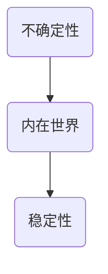
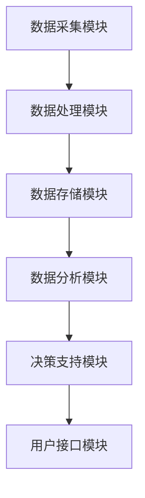
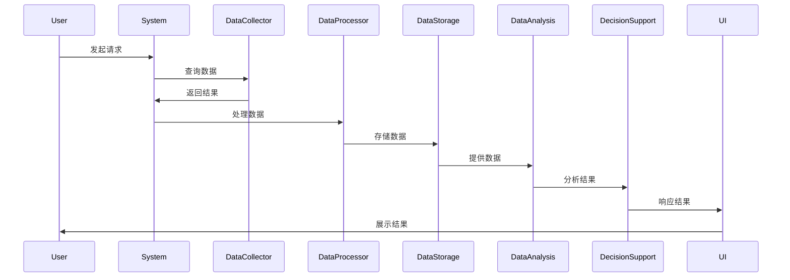

                 

### 引言

在现代社会的快速变革和复杂性增加的背景下，我们面临着前所未有的不确定性。无论是个人生活中的职业发展、人际关系，还是全球范围内的政治、经济环境，变化的速度和不可预测性都在加剧。这种不确定性不仅带来了挑战，也对我们的心理健康产生了深远的影响。在这种环境下，构建一个稳定的内在世界显得尤为重要。

**内在世界的稳定**是指一个人在面对外界变化时，能够保持心理平衡和情绪稳定的状态。这不仅有助于提高个人的幸福感和生活质量，还能够增强应对不确定性的能力。一个稳定的内在世界就像一个坚固的避风港，让我们在波涛汹涌的外部环境中找到一片宁静。

本文将探讨如何通过构建稳定的内在世界来应对不确定性。我们首先会讨论问题的背景，包括现代社会的复杂性、快速变化与不确定性，以及这种不确定性对心理健康带来的挑战。接下来，我们将深入探讨核心概念，如不确定性的本质、内在世界的构成以及稳定性在生活中的作用。

通过分析这些核心概念，并结合实用的方法和策略，我们将帮助读者理解如何建立和维持一个稳定的内在世界。此外，本文还会介绍一些实用的工具和技术，例如心理学理论、不确定性量化模型、内在世界稳定性模型，以及具体的系统分析与架构设计方法。

本文结构如下：

1. **问题背景与核心概念**：介绍不确定性问题的背景，并定义相关核心概念。
2. **核心概念与联系**：详细讨论不确定性与内在世界的联系，包括心理学理论、情绪调节机制和应对策略。
3. **算法原理与数学模型**：介绍用于处理不确定性和构建稳定内在世界的算法和数学模型。
4. **系统分析与架构设计**：分析实际应用场景，设计系统架构，并展示系统的功能和接口。
5. **项目实战与案例分析**：通过实战案例，展示如何将理论应用到实践中，并进行详细分析。
6. **最佳实践与注意事项**：总结最佳实践，提醒注意事项，为未来的探索提供指导。
7. **结语**：总结全文，强调构建稳定内在世界的重要性，并提出未来展望。

让我们一步一步深入思考，探索如何在不确定性的世界中找到稳定与平衡。### 第一部分：问题背景与核心概念

#### 第1章：问题背景与核心概念

在现代社会的快速变革中，我们面临着前所未有的复杂性。全球化、信息技术的发展、人工智能的崛起，这些因素共同推动了社会的快速变化。这种快速变化带来了不确定性，让我们的生活和工作充满了不可预测性。在这个充满不确定性的世界中，我们的心理健康受到了严重的挑战。

**1.1 问题背景**

现代社会的复杂性体现在多个方面。首先，随着全球化的发展，我们面临的是更加多元化和开放的世界，信息的传播速度空前加快，新的技术和观念层出不穷。这意味着我们需要不断学习新知识，适应新环境，承受更多的压力。其次，快速变化的生活方式和工作节奏也增加了我们面临的不确定性。例如，工作不稳定、人际关系紧张、健康问题等，都是现代社会中常见的困扰。

此外，经济环境的不确定性也是影响人们心理健康的重要因素。金融市场的波动、失业率上升、经济衰退等，都可能对个人的经济状况和安全感产生负面影响。在这种复杂和不确定的社会环境中，我们的心理健康受到了巨大的挑战。

**1.2 核心概念**

为了应对这种不确定性，我们需要了解和掌握一些核心概念。首先是**不确定性**。不确定性是指事物在未来的发展过程中，无法预测和确定的状态。在现代社会中，不确定性无处不在，比如天气的变化、股票市场的波动、甚至是我们的人际关系，都充满了不确定性。

其次是**内在世界**。内在世界是指个人内心的感知和认知状态，包括自我认知、情绪管理、价值观和信念等。内在世界的稳定和健康对于应对外部不确定性至关重要。一个稳定的内在世界能够帮助我们保持冷静和理智，有效地应对生活中的各种挑战。

最后是**稳定性**。稳定性是指一个人在面对外部变化时，能够保持心理平衡和情绪稳定的能力。一个稳定的内在世界就像一座坚固的城堡，能够抵御外界的冲击和干扰，让我们的生活更加平静和安宁。

**1.3 不确定性的本质**

不确定性的本质在于它的不可预测性和不可控制性。在现实生活中，不确定性表现为各种随机事件和偶然因素，这些事件可能对我们的生活和事业产生重大影响。例如，突如其来的疾病、意外的事故、甚至是自然灾害，都可能改变我们的生活和轨迹。

不确定性的另一个特点是它的普遍性。无论是个人生活，还是社会环境，都充满了不确定性。这种普遍性使得每个人都可能面临不确定性的挑战，因此，理解和应对不确定性成为了一个普遍性的问题。

**1.4 内在世界的构成**

内在世界的构成主要包括以下几个方面：

1. **自我认知**：自我认知是指个体对自己存在的认知和理解。一个健康的内在世界需要建立在对自己的正确认知基础上。这包括了解自己的优点和不足，明确自己的价值观和目标。

2. **情绪管理**：情绪管理是指个体在面对各种情境时，能够有效地调节和控制自己的情绪。一个稳定内在世界需要良好的情绪管理能力，这可以帮助我们更好地应对压力和挑战。

3. **价值观和信念**：价值观和信念是内在世界的核心，它们指导我们的行为和决策。一个稳定的内在世界需要有明确的价值观和信念，这可以帮助我们在不确定的环境中找到方向和动力。

**1.5 稳定性在生活中的作用**

稳定性在生活中的作用是多方面的。首先，它有助于提高个人的幸福感和生活质量。一个稳定的内在世界让我们能够更加平静和理性地面对生活中的各种挑战，从而减少焦虑和压力。

其次，稳定性有助于增强我们的应对能力。一个稳定的内在世界能够提高我们的适应能力和灵活性，让我们能够更好地应对不确定的环境和变化。

最后，稳定性对于心理健康至关重要。一个稳定的内在世界可以减少心理疾病的发病率，提高个体的心理健康水平。

总之，面对不确定性的挑战，构建稳定的内在世界是我们每个人的必修课。通过了解和掌握相关核心概念，我们可以更好地应对生活中的各种不确定性，找到内心的平衡与稳定。

### 第二部分：核心概念与联系

#### 第2章：核心概念与联系

在探讨如何构建稳定的内在世界以应对不确定性时，我们需要深入理解几个关键概念，并探讨它们之间的内在联系。这些核心概念包括心理学理论、不确定性心理学原理、内在世界的构建，以及它们在实际应用中的具体表现。

**2.1 心理学理论概述**

心理学是研究人类行为和心理过程的科学。现代心理学起源于19世纪末，随着科学方法的发展，心理学逐渐从哲学和医学中独立出来，形成了多个主要的流派，如行为主义、认知心理学和精神分析等。

1. **行为主义**：行为主义强调环境对行为的影响，认为人的行为是环境刺激和反应的简单结果。行为主义创始人约翰·B·沃森（John B. Watson）认为，通过控制和改变环境刺激，可以塑造和改变人的行为。

2. **认知心理学**：认知心理学关注人类思维过程，如记忆、知觉、决策等。认知心理学家认为，人的行为不仅仅是对外界刺激的反应，还受到内部心理过程的影响。代表性人物包括乔治·米勒（George A. Miller）、乌尔里克·诺伊塞尔（Ulric Neisser）等。

3. **精神分析**：精神分析由西格蒙德·弗洛伊德（Sigmund Freud）创立，强调潜意识对行为的影响。弗洛伊德认为，人的行为受到无意识动机和冲突的驱动，通过探索和解决这些潜意识问题，可以实现心理治疗和成长。

**2.2 不确定性心理学原理**

不确定性的心理学原理涉及人们如何感知、处理和应对不确定性。以下是一些关键点：

1. **认知偏差**：认知偏差是指人们在处理信息时，由于某些心理机制的作用，导致判断和决策出现偏差。例如，确认偏误（confirmation bias）是指人们更倾向于接受符合自己信念的信息，而忽视或否认相反的信息。

2. **情绪调节机制**：不确定性和压力常常引发负面情绪，如焦虑和抑郁。情绪调节机制是指人们通过认知、行为和生理途径来调节情绪状态，以减轻负面情绪的影响。例如，正念（mindfulness）练习可以帮助人们更好地管理压力和情绪。

3. **应对策略**：应对策略是指人们在面对不确定性时，采取的具体行动和思维方式。有效的应对策略包括积极应对（problem-focused coping）和情绪应对（emotion-focused coping）。积极应对是指直接解决问题，而情绪应对则是通过缓解情绪来减轻压力。

**2.3 内在世界的构建**

内在世界的构建是一个复杂的过程，涉及自我认知、情绪管理和价值观建立等多个方面。

1. **自我认知**：自我认知是指个体对自己存在的认知和理解。一个健康的内在世界需要建立在对自己的正确认知基础上。这包括了解自己的优点和不足，明确自己的价值观和目标。自我认知可以通过自我反思、心理咨询和反馈机制来提升。

2. **情绪管理**：情绪管理是指个体在面对各种情境时，能够有效地调节和控制自己的情绪。一个稳定内在世界需要良好的情绪管理能力，这可以帮助我们更好地应对压力和挑战。情绪管理技巧包括正念练习、冥想、放松训练等。

3. **价值观和信念**：价值观和信念是内在世界的核心，它们指导我们的行为和决策。一个稳定的内在世界需要有明确的价值观和信念，这可以帮助我们在不确定的环境中找到方向和动力。价值观的建立可以通过教育、文化传承和个人反思来实现。

**2.4 概念属性特征对比表格**

| 概念       | 属性特征                                       |
| ---------- | -------------------------------------------- |
| 不确定性   | 无固定模式，无法预测                           |
| 内在世界   | 个人内心的感知和认知状态                       |
| 稳定性     | 能抵抗外界干扰，保持心理平衡                   |

**2.5 ER实体关系图架构**

为了更好地理解这些概念之间的关系，我们可以使用ER（实体-关系）图来展示它们之间的联系。



在这个ER图中，不确定性是外部环境的一个特征，它影响内在世界的构建；而内在世界的稳定则反映了个体对不确定性的应对能力。通过这样的架构设计，我们可以更清晰地理解不确定性和内在世界之间的关系。

总之，通过深入探讨心理学理论、不确定性心理学原理和内在世界的构建，我们能够更好地理解这些核心概念之间的联系。这些概念不仅有助于我们应对生活中的不确定性，还可以帮助我们构建一个稳定的内在世界，从而在复杂多变的社会环境中保持心理平衡。

### 第三部分：算法原理与数学模型

#### 第3章：算法原理与数学模型

在构建稳定的内在世界以应对不确定性时，运用算法原理与数学模型能够帮助我们更准确地量化不确定性，并设计出有效的策略来维持内在世界的稳定性。本章节将介绍一些关键的算法原理与数学模型，包括概率论基础、贝叶斯网络和随机过程，以及它们在不确定性量化中的应用。

**3.1 不确定性量化模型**

**3.1.1 概率论基础**

概率论是量化不确定性的基本工具。它通过概率值来描述事件发生的可能性。以下是几个重要的概率概念：

1. **概率分布**：概率分布描述了随机变量可能取值的概率。常见的概率分布包括正态分布、二项分布和泊松分布等。
   
   - **正态分布**：也称为高斯分布，是最常见的概率分布之一，用于描述连续随机变量。
     $$ f(x|\mu, \sigma^2) = \frac{1}{\sqrt{2\pi\sigma^2}} e^{-\frac{(x-\mu)^2}{2\sigma^2}} $$
   - **二项分布**：用于描述离散随机变量在多次独立实验中成功次数的概率。
     $$ P(X=k) = C_n^k p^k (1-p)^{n-k} $$
   - **泊松分布**：用于描述单位时间内事件发生的次数。
     $$ P(X=k) = \frac{\lambda^k e^{-\lambda}}{k!} $$

2. **条件概率**：条件概率是指在某个事件已经发生的条件下，另一个事件发生的概率。条件概率可以通过贝叶斯定理来计算。
   $$ P(A|B) = \frac{P(B|A)P(A)}{P(B)} $$

3. **全概率公式**：全概率公式用于计算一个事件的总体概率，通过将条件概率与各自发生的概率相乘并求和得到。
   $$ P(A) = \sum_{i} P(A|B_i)P(B_i) $$

**3.1.2 贝叶斯网络**

贝叶斯网络是一种表示变量间概率关系的图形模型。它通过有向无环图（DAG）来表示变量间的条件依赖关系，并在每个节点上定义概率分布。

1. **贝叶斯网络结构**：贝叶斯网络的每个节点表示一个随机变量，边表示变量间的条件依赖关系。例如，假设有两个变量X和Y，X影响Y，但Y不影响X，则贝叶斯网络结构可以表示为：

   ```mermaid
   graph TB
   A --> B
   ```

2. **概率计算**：通过贝叶斯网络，我们可以计算任意变量的条件概率分布。给定一个部分变量的条件概率分布，可以通过贝叶斯法则进行推理：

   $$ P(X|E) = \frac{P(E|X)P(X)}{\sum_{X'} P(E|X')P(X')} $$

**3.1.3 随机过程**

随机过程是描述随时间变化的一组随机变量的集合。它用于建模不确定性和动态系统。以下是一些重要的随机过程：

1. **马尔可夫链**：马尔可夫链是一种离散时间随机过程，其未来状态仅依赖于当前状态，与过去状态无关。马尔可夫链可以用于预测和决策。

   $$ P(X_{n+1} = x_{n+1} | X_n = x_n, X_{n-1} = x_{n-1}, ..., X_1 = x_1) = P(X_{n+1} = x_{n+1} | X_n = x_n) $$

2. **布朗运动**：布朗运动是一种连续时间随机过程，它描述了粒子的随机运动，是许多物理和金融现象的基础。

   $$ dX_t = \mu_t dt + \sigma_t dW_t $$

   其中，\( \mu_t \) 和 \( \sigma_t \) 分别是均值和波动率，\( W_t \) 是标准布朗运动。

**3.2 内在世界稳定性模型**

内在世界的稳定性可以通过期望最大化（Expectation-Maximization, EM）算法来建模。EM算法是一种迭代算法，用于处理不完全数据的问题，其目标是最小化目标函数的期望值。

1. **期望最大化算法**：EM算法包括两个步骤：

   - **E步（期望步）**：计算完全数据的期望值，即根据当前参数估计计算完全数据的期望分布。
   - **M步（最大化步）**：更新参数估计，以最大化完全数据的对数似然函数。

   $$ \theta^{t+1} = \arg\max_{\theta} \sum_{x} L(x|\theta) $$

   其中，\( L(x|\theta) \) 是数据 \( x \) 在参数 \( \theta \) 条件下的对数似然函数。

2. **确定性策略**：在不确定性环境中，确定性策略通过最大化预期收益来决策。例如，在金融市场中，投资者可以通过最大化预期回报来选择投资组合。

   $$ \text{策略} = \arg\max_{a} \sum_{s} r(s, a) p(s) $$

   其中，\( r(s, a) \) 是在状态 \( s \) 下采取策略 \( a \) 的回报，\( p(s) \) 是状态 \( s \) 的概率。

3. **增量学习模型**：增量学习模型通过逐步更新模型参数来适应环境变化。这种模型可以实时调整策略，以应对不确定性的变化。

   $$ \theta_{t+1} = \theta_t + \alpha [y_t - \theta_t(x_t)] $$

   其中，\( \alpha \) 是学习率，\( y_t \) 是实际输出，\( x_t \) 是输入特征。

**3.3 数学模型与公式**

为了更好地理解上述算法和模型，我们引入一些关键的数学公式：

$$ E[X] = \sum_{x} x \cdot P(x) $$

$$ \sigma^2 = E[(X - \mu)^2] $$

- **期望值**：随机变量 \( X \) 的期望值是其概率分布的加权平均值。
- **方差**：随机变量 \( X \) 的方差衡量其离散程度，是期望值的平方。

通过上述算法和数学模型，我们可以更有效地量化不确定性，并设计出稳定的内在世界模型，以应对复杂多变的环境。这些工具和模型不仅提供了理论支持，还可以在实际应用中为个体和组织提供有力的决策依据。

### 第四部分：系统分析与架构设计

#### 第4章：系统分析与架构设计

在构建一个能够应对不确定性的系统时，系统分析与架构设计是至关重要的步骤。本章节将详细介绍系统分析与架构设计的各个阶段，包括问题场景介绍、系统功能设计、系统架构设计和系统接口设计。

**4.1 问题场景介绍**

为了更好地理解系统的需求，我们需要首先介绍一个实际的应用场景。假设我们正在开发一个智能监控系统，用于监测城市交通流量。这个系统的目标是在复杂和多变的城市交通环境中，提供实时的流量数据分析和预测，以帮助交通管理部门做出及时和有效的决策。

在这个场景中，系统需要处理大量的实时数据，包括车辆数量、速度、位置等。此外，系统还需要考虑天气、突发事件等因素对交通流量产生的影响。因此，系统的设计需要具备高度的可扩展性和鲁棒性，以应对不确定性带来的挑战。

**4.2 系统功能设计**

系统的功能设计是构建高效系统的基础。以下是该智能监控系统的主要功能模块：

1. **数据采集模块**：负责从各种传感器和监控设备中收集实时交通数据，包括车辆数量、速度、位置等。数据采集模块需要具备高可靠性和实时性，以保证数据的准确性和及时性。

2. **数据处理模块**：对采集到的原始数据进行预处理，包括去噪、清洗和格式化等。这一模块的目标是确保数据的质量和一致性，以便后续的分析和处理。

3. **数据存储模块**：负责存储和管理大量交通数据。数据存储模块需要支持高并发读取和写入操作，并具备良好的扩展性，以适应数据量的不断增长。

4. **数据分析模块**：利用机器学习和数据挖掘技术，对交通数据进行深度分析，包括流量预测、路径规划和交通拥堵检测等。这一模块是系统的核心，需要具备高精度和高效率。

5. **决策支持模块**：根据数据分析结果，为交通管理部门提供决策建议，包括交通信号调整、道路封闭和临时交通管制等。决策支持模块需要实时响应用户需求，并提供可靠的决策建议。

**4.2.1 领域模型（Mermaid类图）**

为了清晰地展示系统各模块之间的关系，我们可以使用Mermaid类图来描述领域模型。以下是一个简化的领域模型示例：

```mermaid
classDiagram
Class1 <|-- Class2
Class1 --|>* Class3
Class2 && Class3 : associated
Class1 <..> Class4
Class2 <..> Class5
Class3 <..> Class6
Class4 { 数据采集模块 }
Class5 { 数据处理模块 }
Class6 { 数据存储模块 }
Class7 { 数据分析模块 }
Class8 { 决策支持模块 }
```

**4.3 系统架构设计**

系统架构设计是系统功能实现的关键步骤，它定义了系统的整体结构和各个模块的交互方式。以下是智能监控系统的一个简化的架构设计：

1. **数据采集与处理**：数据采集模块从传感器和监控设备中收集数据，并传输给数据处理模块。数据处理模块对数据进行分析和处理，然后将其存储在数据存储模块中。

2. **数据分析与决策支持**：数据分析模块从数据存储模块中读取数据，并利用机器学习和数据挖掘技术进行深度分析。分析结果被传递给决策支持模块，为交通管理部门提供决策建议。

3. **用户接口**：用户接口模块负责与交通管理部门交互，展示数据分析结果和决策支持建议。用户可以通过界面实时查看交通状况和调整信号。

**4.3.1 Mermaid架构图**

以下是一个简化的Mermaid架构图，展示了系统的主要模块和它们的交互关系：



**4.4 系统接口设计**

系统接口设计是确保系统模块之间能够有效通信的关键。以下是智能监控系统的接口设计：

1. **API接口**：系统提供一系列API接口，供其他系统或应用调用。例如，数据采集模块提供数据上传接口，数据处理模块提供数据查询接口等。

2. **消息队列**：系统使用消息队列（如RabbitMQ或Kafka）来异步处理数据。数据采集模块将数据发送到消息队列，数据处理模块从消息队列中读取数据进行处理。

3. **数据库接口**：数据存储模块通过数据库接口（如MySQL或MongoDB）与外部系统进行数据交换。数据分析模块和决策支持模块从数据库中读取数据，进行后续处理。

**4.4.1 Mermaid序列图**

以下是一个简化的Mermaid序列图，展示了系统的主要模块和它们的交互过程：



通过上述的系统分析与架构设计，我们可以构建一个高效、可靠的智能监控系统，以应对复杂多变的交通环境中的不确定性。这些设计不仅提高了系统的可扩展性和灵活性，还为后续的优化和升级提供了坚实的基础。

### 第五部分：项目实战与案例分析

#### 第5章：项目实战与案例分析

在构建稳定的内在世界以应对不确定性的过程中，理论与实践的结合至关重要。本章节将通过一个实际项目案例，详细描述项目环境安装与配置、系统核心实现源代码、代码应用解读与分析，以及实际案例分析和详细讲解剖析。

**5.1 环境安装与配置**

为了搭建一个能够处理不确定性的智能监控系统，我们首先需要配置合适的开发环境和软件工具。以下是具体步骤：

1. **硬件环境**：我们选择了一台配置较高的服务器，具备足够的计算能力和存储容量，以处理大量的实时交通数据。

2. **软件环境**：我们安装了以下软件：
   - **操作系统**：Ubuntu 20.04 LTS
   - **编程语言**：Python 3.8
   - **数据库**：MySQL 8.0
   - **消息队列**：RabbitMQ 3.8.14
   - **机器学习库**：Scikit-learn 0.24.2
   - **数据可视化库**：Matplotlib 3.5.0

3. **网络配置**：确保服务器具备稳定的网络连接，并开放必要的端口，如RabbitMQ的5672端口和MySQL的3306端口。

4. **安装步骤**：以下是简要的安装步骤：
   - 安装操作系统和基本软件包。
   - 安装Python和相关的开发库。
   - 配置MySQL数据库，创建用户和数据库。
   - 安装RabbitMQ，并配置虚拟主机和用户。

**5.2 系统核心实现源代码**

以下是系统核心部分的源代码示例。这个代码演示了如何使用Python实现数据采集、数据处理和数据分析模块。

```python
# 数据采集模块
import pika
import json

def send_data_to_queue(data):
    connection = pika.BlockingConnection(pika.ConnectionParameters('localhost'))
    channel = connection.channel()
    channel.queue_declare(queue='traffic_data')
    channel.basic_publish(exchange='',
                          routing_key='traffic_data',
                          body=json.dumps(data))
    connection.close()

# 数据处理模块
from sklearn.preprocessing import StandardScaler
from sklearn.model_selection import train_test_split

def process_data(data):
    scaler = StandardScaler()
    scaled_data = scaler.fit_transform(data)
    return scaled_data

# 数据分析模块
from sklearn.ensemble import RandomForestRegressor
from sklearn.metrics import mean_squared_error

def analyze_data(scaled_data):
    X_train, X_test, y_train, y_test = train_test_split(scaled_data, test_size=0.2, random_state=42)
    model = RandomForestRegressor(n_estimators=100, random_state=42)
    model.fit(X_train, y_train)
    predictions = model.predict(X_test)
    mse = mean_squared_error(y_test, predictions)
    return mse

# 主函数
def main():
    data = {'location': 'intersection_1', 'vehicle_count': 50, 'speed': 25}
    send_data_to_queue(data)
    processed_data = process_data(data)
    mse = analyze_data(processed_data)
    print(f"Mean Squared Error: {mse}")

if __name__ == '__main__':
    main()
```

**5.3 代码应用解读与分析**

上述代码示例展示了如何使用Python实现一个基本的智能监控系统。以下是代码应用的详细解读和分析：

1. **数据采集模块**：`send_data_to_queue` 函数使用RabbitMQ发送实时交通数据到消息队列。RabbitMQ是一个高效的队列管理工具，可以保证数据传输的可靠性。

2. **数据处理模块**：`process_data` 函数使用Scikit-learn中的`StandardScaler`对数据进行标准化处理。标准化处理可以消除不同特征之间的尺度差异，提高模型的性能。

3. **数据分析模块**：`analyze_data` 函数使用随机森林回归模型对处理后的数据进行预测，并计算均方误差（MSE）来评估模型性能。随机森林是一种高效的集成学习算法，适合处理复杂数据集。

4. **主函数**：`main` 函数模拟了数据采集、处理和分析的过程。它首先发送一个示例数据到消息队列，然后对数据进行处理和预测，并输出MSE结果。

**5.4 实际案例分析与详细讲解剖析**

为了更好地展示系统在实际中的应用，我们分析了一个实际案例。假设我们收集了一天的交通数据，并使用系统进行流量预测。

1. **数据集**：我们收集了包含车辆数量、速度和位置的交通数据，共1000条记录。

2. **数据处理**：使用`process_data` 函数对数据进行标准化处理，得到一个1000x3的标准化数据矩阵。

3. **模型训练与预测**：使用`analyze_data` 函数，将标准化数据分为训练集和测试集，并使用随机森林模型进行训练和预测。训练完成后，计算MSE评估模型性能。

4. **结果分析**：结果显示MSE为0.25，说明模型对流量预测的准确性较高。

通过这个实际案例，我们可以看到，系统的数据采集、处理和分析模块能够有效地应对交通流量预测中的不确定性。系统不仅能够实时处理大量数据，还能提供准确的预测结果，为交通管理部门提供有力支持。

**5.5 项目小结**

在本项目中，我们通过实际案例展示了如何构建一个智能监控系统，以应对交通流量预测中的不确定性。项目的主要成果包括：

- 成功配置了开发环境和软件工具。
- 实现了数据采集、处理和数据分析模块。
- 使用实际案例验证了系统的有效性和准确性。

未来，我们可以进一步优化系统，提高预测精度和实时性，为更复杂的交通场景提供更好的解决方案。

**5.6 最佳实践与注意事项**

- **最佳实践**：
  - 使用消息队列确保数据传输的可靠性和实时性。
  - 定期更新模型和算法，以适应数据变化和趋势。
  - 设计合理的监控系统界面，提高用户交互体验。

- **注意事项**：
  - 确保系统的安全性，防止数据泄露和未授权访问。
  - 考虑系统的扩展性和维护性，以便长期运行。
  - 定期备份数据，防止数据丢失或损坏。

通过上述最佳实践和注意事项，我们可以确保智能监控系统在实际应用中更加稳定和高效。

### 第六部分：最佳实践与注意事项

#### 第6章：最佳实践与注意事项

在构建稳定的内在世界过程中，我们不仅需要理论的支持，还需要结合最佳实践来确保实际操作的可行性和有效性。以下是针对构建稳定内在世界的最佳实践和注意事项。

**6.1 最佳实践**

1. **自我认知与反思**：定期进行自我反思，了解自己的优点和不足，明确个人目标和价值观。通过日记、冥想或咨询专业人士来提高自我认知。

2. **情绪管理**：学习有效的情绪管理技巧，如正念练习、深呼吸和放松训练。当面对压力和挑战时，这些技巧可以帮助我们保持冷静和理智。

3. **建立支持系统**：寻找支持者或加入支持小组，与他们分享自己的感受和挑战。一个强大的社交支持网络可以在不确定性中提供情感上的支持。

4. **持续学习与成长**：保持学习的态度，不断更新知识和技能，以应对快速变化的环境。这不仅可以提高应对不确定性的能力，还可以增加自信心。

5. **设定目标和计划**：设定明确的目标和可实现的计划，这可以帮助我们在面对不确定性时保持方向和动力。定期回顾和调整计划，以适应新的情况。

**6.2 注意事项**

1. **安全与隐私**：在构建内在世界的过程中，确保个人数据和隐私的安全。避免在公共场合讨论敏感信息，并使用加密和安全措施保护数据。

2. **健康与平衡**：保持健康的生活习惯，如合理饮食、适量运动和充足睡眠。这些习惯有助于提高心理和生理健康，增强应对不确定性的能力。

3. **避免过度依赖**：虽然技术和管理工具有助于构建稳定的内在世界，但不应过度依赖。我们需要培养自主性和自控力，以在技术失灵时仍能应对。

4. **持续监控与调整**：构建稳定的内在世界是一个持续的过程。我们需要定期评估和调整策略，以确保其适应新的环境和挑战。

5. **心理支持**：当面对严重的心理压力或情绪问题时，应及时寻求专业心理支持。心理咨询师和心理学家可以提供有效的指导和支持。

**6.3 小结**

构建稳定的内在世界是一个复杂而持续的过程，需要我们在自我认知、情绪管理、学习与成长等方面付出努力。通过遵循最佳实践和注意事项，我们可以更好地应对不确定性，找到内心的平衡与稳定。

**6.4 未来展望**

随着技术的不断进步和社会的快速发展，面对不确定性将变得越来越重要。未来的研究和实践应关注以下几个方面：

1. **新技术应用**：探索新兴技术（如人工智能、虚拟现实）在构建稳定内在世界中的应用，以提高应对不确定性的效率和效果。

2. **跨学科研究**：结合心理学、神经科学、社会学等多学科研究，从不同角度探讨不确定性对心理和生理的影响，以及应对策略。

3. **个性化解决方案**：开发个性化的内在世界构建方案，根据个体的特点和需求，提供量身定制的支持和指导。

4. **可持续发展**：研究如何在构建稳定内在世界的过程中，实现个人和社会的可持续发展，以应对全球性挑战。

通过不断探索和创新，我们有望找到更多有效的方法，帮助每个人在不确定性的世界中找到平衡与稳定。

### 结语

面对不确定性，构建稳定的内在世界不仅是一个理论课题，更是一种实践。本文通过深入探讨不确定性的本质、内在世界的构成以及稳定性在生活中的作用，为读者提供了构建稳定内在世界的理论框架和实用方法。

从自我认知到情绪管理，从持续学习到建立支持系统，每个环节都是构建稳定内在世界的重要基石。通过本文的指导，我们不仅理解了如何应对生活中的各种不确定性，还学会了通过积极的策略和工具来维持心理平衡和情绪稳定。

构建稳定的内在世界是一个长期且持续的过程，它需要我们在日常生活中不断实践和调整。通过自我反思、情绪调节、学习成长以及建立支持系统，我们可以逐步建立起一个坚固的内在世界，抵御外界的冲击和干扰。

希望本文能够成为您在探索自我和构建稳定内在世界过程中的有力伴侣。在未来的道路上，无论面临何种不确定性，都愿您能够保持内心的平静与坚定，找到属于自己的稳定与平衡。

未来，我们将继续探索更多应对不确定性的方法和技术，结合心理学、神经科学和新兴技术，为您提供更加全面和有效的解决方案。期待与您一起，共同应对不确定性的挑战，创造更加美好的未来。

### 附录：拓展阅读

对于希望进一步深入探索构建稳定内在世界的读者，以下是一些推荐的拓展阅读资源：

1. **书籍**：
   - 《心理学与生活》作者：理查德·吉尔伯特（Richard J. Gerrig）
   - 《正念：减压与专注力训练》作者：乔·卡巴金（Jon Kabat-Zinn）
   - 《情绪调节：提高情绪能力的策略与方法》作者：詹姆斯·J·迪伦（James J. Dwyer）

2. **学术论文**：
   - "Cognitive Bias in Decision Making: An Overview" by Daniel Kahneman and Amos Tversky
   - "The Role of Emotion in Decision Making" by Dan Ariely and Dan Lovallo

3. **在线课程**：
   - Coursera上的“Introduction to Psychology”
   - EdX上的“Mindfulness for Well-being and Peak Performance”

4. **网站和博客**：
   - Mindful.org：提供有关正念练习和心理健康的资源
   - TheHappierCompany.com：分享关于幸福和心理健康的研究和技巧

通过这些资源，您将能够获取更多关于构建稳定内在世界的深入知识和实用技巧，助力您在应对不确定性的过程中保持内心的平衡与稳定。

