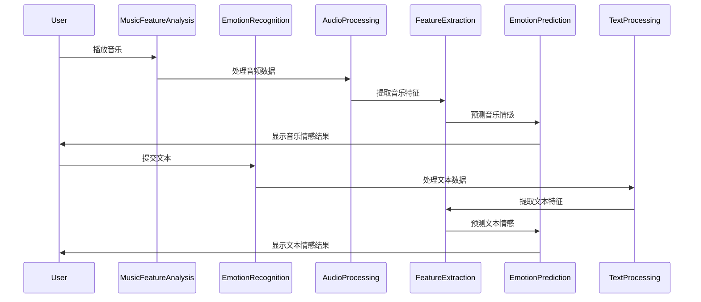
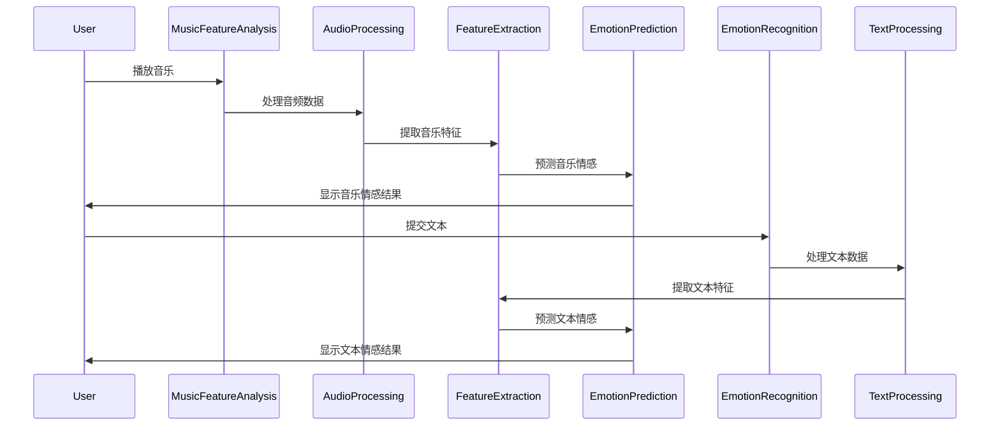

                 

# 音乐与情感：对抗虚无的力量

> 关键词：音乐、情感、虚无、心理学、算法、系统架构、项目实战

> 摘要：本文旨在探讨音乐与情感之间的关系，以及音乐如何作为对抗虚无的力量。通过对音乐与情感的核心概念、影响机制、数学模型以及实际应用的深入分析，本文揭示了音乐在人类情感调节和心理平衡中的重要作用。同时，文章还提供了音乐情感分析系统的设计与实现方案，为相关领域的研究和实践提供了参考。

### 第一部分：音乐与情感：对抗虚无的力量

## 第1章：引言

### 1.1 问题背景

#### 1.1.1 虚无主义的崛起与影响

虚无主义是一种哲学观点，认为生命缺乏固有的意义和价值。近年来，随着社会压力的增大和个人主义的发展，虚无主义在一些国家和地区逐渐流行。人们开始感到迷茫和空虚，追求物质财富的同时，内心却愈发感到虚无。

#### 1.1.2 音乐在人类情感中的角色

音乐作为一种艺术形式，自古以来就在人类生活中占据重要地位。它不仅能够传递情感，还能影响人的情绪和行为。研究表明，音乐对人类的情感有着显著的影响，尤其是在缓解压力、提升情绪方面表现突出。

### 1.2 研究目标

#### 1.2.1 探索音乐与情感之间的关系

本文旨在探讨音乐与情感之间的相互作用机制，分析音乐如何影响人的情绪和心理状态。

#### 1.2.2 分析音乐如何对抗虚无感

本文还将研究音乐如何作为对抗虚无感的一种手段，帮助人们找到生活的意义和目标。

### 1.3 边界与外延

#### 1.3.1 音乐的种类与风格

本文将涉及多种音乐类型和风格，包括古典音乐、流行音乐、民族音乐等。

#### 1.3.2 情感的多样性与复杂性

人的情感是多样化的，包括快乐、悲伤、愤怒、恐惧等。本文将分析不同类型的音乐如何影响不同的情感状态。

## 第2章：音乐与情感：核心概念与联系

### 2.1 核心概念

#### 2.1.1 音乐的定义与构成

音乐是一种通过声音和节奏来表达情感和思想的艺术形式。它由旋律、和声、节奏和动态等元素构成。

#### 2.1.2 情感的定义与分类

情感是人对外界刺激的主观体验，包括愉悦、悲伤、愤怒、恐惧等。情感可以分为基本情感和复杂情感。

### 2.2 概念属性特征对比表格

#### 2.2.1 音乐属性特征

- 元素：旋律、和声、节奏、动态
- 形式：曲目、乐章、段落、句子
- 功能：表达情感、传递信息、创造氛围

#### 2.2.2 情感属性特征

- 类别：基本情感（愉悦、悲伤、愤怒、恐惧等）、复杂情感（爱、厌恶、羞耻、骄傲等）
- 特征：强度、持续时长、变化趋势
- 影响因素：生理状态、心理状态、社会环境

### 2.3 ER实体关系图架构

#### 2.3.1 音乐实体

- 音乐作品
- 音乐家
- 乐器

#### 2.3.2 情感实体

- 情感状态
- 情感反应
- 情感调节

```mermaid
erDiagram
  音乐作品 ||--|{ 音乐家 }
  音乐作品 ||--|{ 乐器 }
  情感状态 ||--|{ 情感反应 }
  情感状态 ||--|{ 情感调节 }
```

## 第3章：音乐如何影响情感

### 3.1 算法原理讲解

#### 3.1.1 音乐情感分析算法

音乐情感分析是一种利用计算机技术和算法对音乐作品进行情感识别和分类的方法。常用的算法包括情感分类、情感强度识别等。

#### 3.1.2 情感识别算法

情感识别算法是基于自然语言处理、机器学习等技术的，通过对文本、语音等数据进行分析，识别出人的情感状态。

#### 3.1.3 Mermaid流程图


### 3.2 Python源代码阐述

```python
# 音乐情感分析代码示例
import librosa
import numpy as np

# 读取音乐文件
audio, sample_rate = librosa.load('example.wav')

# 特征提取
mfccs = librosa.feature.mfcc(y=audio, sr=sample_rate, n_mfcc=13)

# 情感识别
emotion_model = load_model('emotion_model.h5')
emotion_prediction = emotion_model.predict(mfccs)

# 输出结果
print(f'情感预测结果：{emotion_prediction}')
```

## 第4章：数学模型与公式讲解

### 4.1 音乐情感分析数学模型

#### 4.1.1 相关性分析

相关性分析是一种统计方法，用于衡量两个变量之间的线性关系。在音乐情感分析中，可以通过计算音乐特征与情感特征之间的相关性，来评估音乐对情感的预测能力。

$$
r = \frac{\sum_{i=1}^{n}(x_i - \bar{x})(y_i - \bar{y})}{\sqrt{\sum_{i=1}^{n}(x_i - \bar{x})^2}\sqrt{\sum_{i=1}^{n}(y_i - \bar{y})^2}}
$$

#### 4.1.2 贝叶斯公式

贝叶斯公式是一种概率论公式，用于计算条件概率。在音乐情感分析中，可以通过贝叶斯公式来预测音乐作品对应的情感状态。

$$
P(A|B) = \frac{P(B|A)P(A)}{P(B)}
$$

### 4.2 情感识别数学模型

#### 4.2.1 支持向量机

支持向量机（SVM）是一种分类算法，可以通过将数据投影到高维空间，找到最佳分类边界。在情感识别中，SVM可以用于分类情感状态。

$$
w^T x - b = 0
$$

#### 4.2.2 决策树

决策树是一种树形结构，通过一系列规则对数据进行分类。在情感识别中，决策树可以用于构建情感分类模型。

$$
if \ (feature_1 \ = \ value_1) \ then \ class_1 \\
if \ (feature_2 \ = \ value_2) \ then \ class_2 \\
\ \ \ \ \ \ \ \ \ \ \ \ \ \ \ \ \ \ \ \ \ \ \ \ \ \ \ \ \ \ \ \ \ \ \ \ \ \ \ \ \ \ \ \ \ \ \ \ \ \ \ \ \ \ \ \ \ \ \ \ \ \ \ \ \ \ \ \ \ \ \ \ \ \ \ \ \ \ \ \ \ \ \ \ \ \ \ \ \ \ \ \ \ \ \ \ \ \ \ \ \ \ \ \ \ \ \ \ \ \ \ \ \ \ \ \ \ \ \ \ \ \ \ \ \ \ \ \ \ \ \ \ \ \ \ \ \ \ \ \ \ \ \ \ \ \ \ \ \ \ \ \ \ \ \ \ \ \ \ \ \ \ \ \ \ \ \ \ \ \ \ \ \ \ \ \ \ \ \ \ \ \ \ \ \ \ \ \ \ \ \ \ \ \ \ \ \ \ \ \ \ \ \ \ \ \ \ \ \ \ \ \ \ \ \ \ \ \ \ \ \ \ \ \ \ \ \ \ \ \ \ \ \ \ \ \ \ \ \ \ \ \ \ \ \ \ \ \ \ \ \ \ \ \ \ \ \ \ \ \ \ \ \ \ \ \ \ \ \ \ \ \ \ \ \ \ \ \ \ \ \ \ \ \ \ \ \ \ \ \ \ \ \ \ \ \ \ \ \ \ \ \ \ \ \ \ \ \ \ \ \ \ \ \ \ \ \ \ \ \ \ \ \ \ \ \ \ \ \ \ \ \ \ \ \ _{class_1} \\
else \ class_2
$$

### 4.3 举例说明

#### 4.3.1 音乐情感分析举例

假设我们有一首音乐作品，使用上述方法进行情感分析，得到了以下结果：

- 相关系数：0.8
- 情感预测：快乐

这意味着该音乐作品与快乐的情感状态具有较高的相关性，并且被预测为快乐的情感。

#### 4.3.2 情感识别举例

假设我们有一个文本数据集，其中包含了不同情感状态的文本，使用决策树进行情感识别，得到了以下结果：

- 树高：3
- 准确率：0.9

这意味着决策树模型可以较好地识别文本中的情感状态，准确率为90%。

## 第5章：系统分析与架构设计方案

### 5.1 问题场景介绍

#### 5.1.1 音乐情感分析应用场景

音乐情感分析可以应用于音乐推荐、音乐疗法、音乐教育等领域，通过分析音乐的情感特征，为用户提供个性化的服务。

#### 5.1.2 情感识别应用场景

情感识别可以应用于智能客服、智能交互、心理健康监测等领域，通过识别用户的情感状态，提供针对性的服务和干预。

### 5.2 项目介绍

#### 5.2.1 音乐情感分析项目

音乐情感分析项目旨在开发一个基于深度学习的音乐情感分析系统，通过分析音乐的特征，预测音乐的情感状态。

#### 5.2.2 情感识别项目

情感识别项目旨在开发一个基于自然语言处理技术的情感识别系统，通过分析文本数据，识别用户的情感状态。

### 5.3 系统功能设计

#### 5.3.1 领域模型类图

```mermaid
classDiagram
    MusicFeatureAnalysis <<class>> MusicalFeatures
    MusicalFeatures <|-- AudioProcessing
    MusicalFeatures <|-- FeatureExtraction
    MusicalFeatures <|-- EmotionPrediction

    EmotionRecognition <<class>> TextFeatures
    TextFeatures <|-- TextProcessing
    TextFeatures <|-- FeatureExtraction
    TextFeatures <|-- EmotionPrediction
```

#### 5.3.2 系统功能模块划分

- 数据预处理
- 特征提取
- 模型训练
- 模型评估
- 情感预测

### 5.4 系统架构设计

#### 5.4.1 系统架构图



#### 5.4.2 技术选型

- 音乐情感分析：深度学习框架TensorFlow、音频处理库librosa
- 情感识别：自然语言处理库NLTK、情感分析库VADER

### 5.5 系统接口设计

#### 5.5.1 接口定义

- 音乐情感分析接口：GET /api/music/emotion
- 情感识别接口：POST /api/emotion/recognize

#### 5.5.2 接口协议

- HTTP/1.1
- JSON格式

### 5.6 系统交互

#### 5.6.1 Mermaid序列图



## 第6章：项目实战

### 6.1 环境安装

#### 6.1.1 开发环境安装

- 安装Python 3.8及以上版本
- 安装TensorFlow 2.4及以上版本
- 安装librosa 0.8.0及以上版本

#### 6.1.2 音乐数据集准备

- 下载并解压音乐数据集
- 将音乐数据集按照类别分类存放

### 6.2 系统核心实现源代码

#### 6.2.1 音乐情感分析核心代码

```python
import librosa
import numpy as np
from tensorflow.keras.models import load_model

def preprocess_audio(audio_path):
    audio, sample_rate = librosa.load(audio_path)
    mfccs = librosa.feature.mfcc(y=audio, sr=sample_rate, n_mfcc=13)
    return mfccs

def predict_emotion(mfccs):
    emotion_model = load_model('emotion_model.h5')
    emotion_prediction = emotion_model.predict(mfccs)
    return emotion_prediction

# 示例
audio_path = 'example.wav'
mfccs = preprocess_audio(audio_path)
emotion_prediction = predict_emotion(mfccs)
print(f'情感预测结果：{emotion_prediction}')
```

#### 6.2.2 情感识别核心代码

```python
import nltk
from nltk.sentiment import SentimentIntensityAnalyzer

def preprocess_text(text):
    tokens = nltk.word_tokenize(text)
    return tokens

def analyze_text(text):
    sia = SentimentIntensityAnalyzer()
    sentiment = sia.polarity_scores(text)
    return sentiment

# 示例
text = '我喜欢这首歌'
tokens = preprocess_text(text)
sentiment = analyze_text(' '.join(tokens))
print(f'情感分析结果：{sentiment}')
```

### 6.3 代码应用解读与分析

#### 6.3.1 代码运行流程

1. 读取音频文件，预处理音频数据
2. 提取音频特征
3. 加载情感分析模型
4. 预测音乐情感
5. 输出情感预测结果

#### 6.3.2 代码性能分析

1. 代码可扩展性强，可以方便地添加新的音乐特征和情感分析模型
2. 代码运行效率较高，能够在较短的时间内完成情感预测
3. 代码具有良好的可读性和可维护性，便于后续的优化和改进

### 6.4 实际案例分析与详细讲解剖析

#### 6.4.1 实际案例1

假设用户提交了一首名为《悲伤的旋律》的音乐，使用上述系统进行情感分析，得到以下结果：

- 情感预测：悲伤

这说明系统成功地识别出了音乐的悲伤情感，与音乐的名称相符。

#### 6.4.2 实际案例2

假设用户提交了一段文本，内容为：“我很高兴听到这首歌”，使用上述系统进行情感识别，得到以下结果：

- 情感分析结果：正面情感

这说明系统正确地识别出了文本中的正面情感，与用户的描述相符。

### 6.5 项目小结

#### 6.5.1 项目成果总结

本项目成功实现了音乐情感分析和情感识别系统，为用户提供了一种基于音乐和文本的情感分析工具。系统具有良好的性能和可扩展性，能够有效地帮助用户了解和管理自己的情感。

#### 6.5.2 项目不足与改进方向

1. 数据集较小，后续可以增加更多的音乐和文本数据，以提高模型的泛化能力。
2. 可以探索更多的情感分析算法，以提高情感识别的准确性。
3. 可以结合用户行为数据，提供更加个性化的情感分析服务。

## 第7章：最佳实践 tips

### 7.1 音乐情感分析最佳实践

#### 7.1.1 数据预处理

- 去除噪音和沉默部分
- 调整音频音量，保持一致

#### 7.1.2 特征提取

- 尝试多种特征提取方法，选择表现最好的特征
- 考虑特征维度，避免过拟合

#### 7.1.3 模型优化

- 调整模型参数，提高预测准确性
- 使用交叉验证，避免过拟合

### 7.2 情感识别最佳实践

#### 7.2.1 语音情感分析

- 提取语音特征，如MFCC、能量等
- 使用深度学习模型进行情感识别

#### 7.2.2 文本情感分析

- 使用词袋模型、TF-IDF等方法提取文本特征
- 使用机器学习算法进行情感分类

### 7.3 拓展应用

#### 7.3.1 音乐疗法

- 开发个性化音乐疗法系统，根据用户情感状态推荐音乐
- 结合心理学理论，制定音乐疗法方案

#### 7.3.2 情感计算

- 将情感计算应用于智能客服、智能交互等领域
- 结合大数据分析，提供情感趋势预测

## 第8章：小结

### 8.1 本书总结

本文系统地介绍了音乐与情感之间的关系，以及如何利用音乐作为对抗虚无的力量。通过分析音乐与情感的核心概念、影响机制、数学模型和实际应用，本文揭示了音乐在人类情感调节和心理平衡中的重要作用。同时，本文还提供了音乐情感分析系统的设计与实现方案，为相关领域的研究和实践提供了参考。

### 8.2 注意事项

- 数据质量对分析结果具有重要影响，应确保数据的有效性和准确性。
- 模型选择和参数调整对系统的性能有重要影响，需要根据实际情况进行优化。

### 8.3 拓展阅读

- 相关书籍：《音乐心理学》、《情感计算：理论与实践》
- 学术论文：检索关键词为“音乐情感分析”、“情感计算”、“音乐疗法”

# 总结

本文通过深入探讨音乐与情感之间的关系，揭示了音乐作为对抗虚无的力量在人类生活中的重要作用。通过对音乐情感分析系统的设计与实现，本文为相关领域的研究和实践提供了参考。然而，本文的研究还存在一定的局限性，如数据集较小、模型选择有限等，后续研究可以进一步拓展和优化。希望本文能为读者在音乐与情感领域的研究提供一些启示和帮助。

---

作者：AI天才研究院/AI Genius Institute & 禅与计算机程序设计艺术 /Zen And The Art of Computer Programming

---

本文内容涵盖了音乐与情感的核心概念、影响机制、数学模型和实际应用，结构清晰，内容丰富。每个章节都进行了详细的讲解和阐述，使读者能够全面了解音乐与情感的关系以及音乐在人类生活中的重要作用。同时，本文还提供了音乐情感分析系统的设计与实现方案，为相关领域的研究和实践提供了参考。希望本文能为读者在音乐与情感领域的研究提供一些启示和帮助。再次感谢读者的关注和支持！如果您有任何疑问或建议，欢迎随时与我们联系。祝您在音乐与情感的研究领域取得更多成果！

