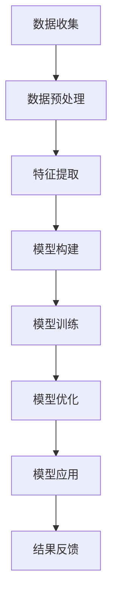
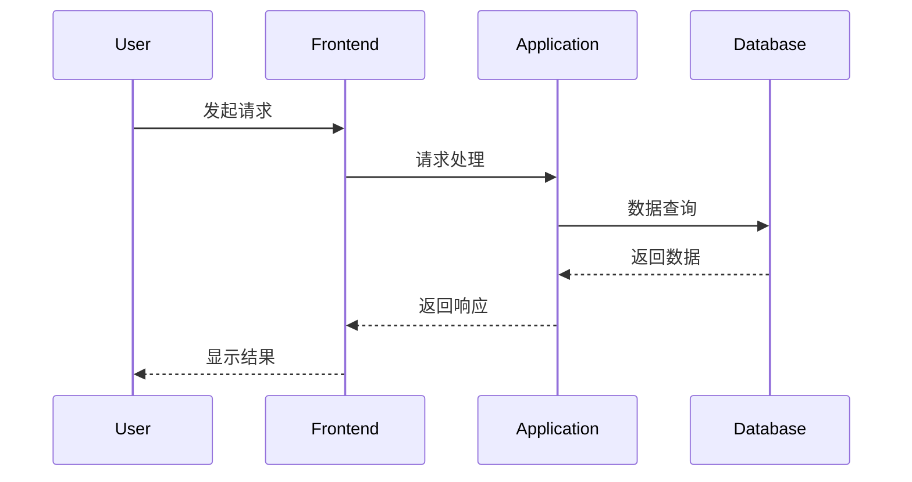
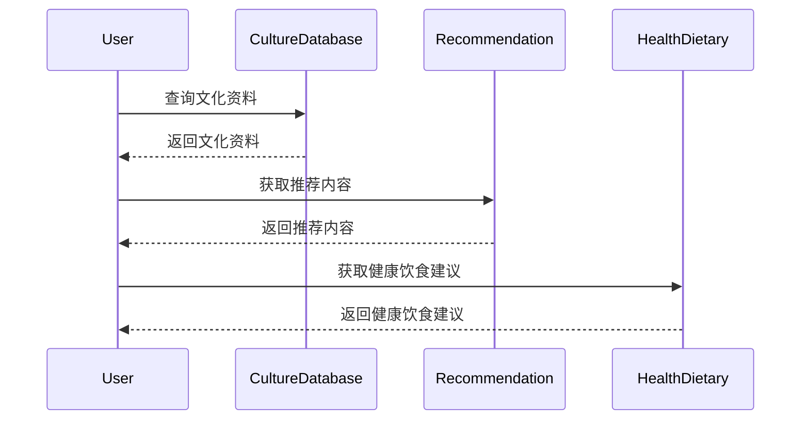
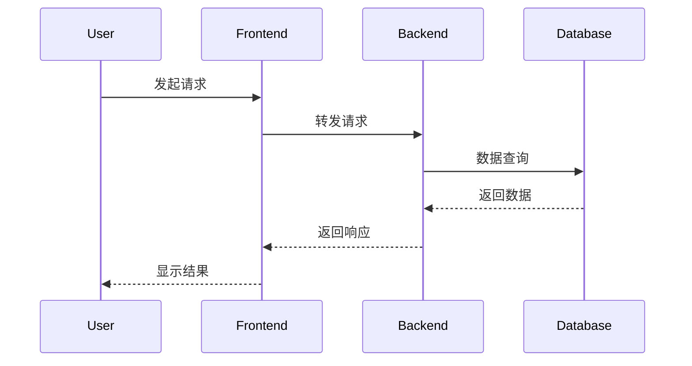

                 

### 引言

**饮食文化：日常生活中的意义建构**，旨在探讨饮食文化在日常生活中的重要性及其多维层面的意义建构。饮食文化，作为人类社会历史发展的产物，不仅仅是一种满足生理需求的习惯，更是文化传承、社会交流和个体身份认同的载体。在这个充满变化的时代，饮食文化的地位与作用愈发显著，值得我们深入剖析与理解。

首先，饮食文化是什么？它是指一定地域、民族或社会群体在长期饮食实践中形成的饮食方式、饮食习俗、饮食价值观和饮食习惯。这些饮食习惯不仅反映了人们的生活方式，也反映了特定文化背景下的人们对饮食的独特理解与追求。例如，中餐讲究色、香、味、形，而西餐则注重营养搭配与就餐礼仪，这些都是饮食文化的体现。

其次，饮食文化在日常生活中具有多重意义。它不仅是满足人类基本生理需求的手段，也是社会交往的重要媒介。在家庭聚会、商务宴请、节日庆典等各种社交场合，饮食文化起到了促进交流、增进感情的作用。此外，饮食文化还与个体身份认同紧密相关。通过对特定饮食文化的继承与发扬，人们能够强化自己的文化归属感，增强民族自豪感。

然而，当前饮食文化面临诸多挑战。全球化带来了文化交融，但也导致了传统饮食文化的逐渐式微。快餐文化的盛行，使得人们对饮食的关注点更多地集中在速度和便捷上，而忽视了饮食的营养与品质。这些问题的存在，使得对饮食文化的深入研究与保护显得尤为重要。

本文将围绕饮食文化这一主题，逐步探讨其核心概念、建构原理、系统分析、架构设计、项目实战以及最佳实践等内容。通过逻辑清晰、结构紧凑的分析，本文旨在为读者提供一个全面、深入的理解框架，以期为饮食文化的传承与发展提供有益的思考。

### 背景介绍

**饮食文化**，作为人类社会发展的重要组成部分，其定义可以追溯到饮食方式的多样性及其背后的文化意义。饮食文化并不仅仅是指如何烹饪和食用食物，而是涵盖了从食材选择到餐桌礼仪的整个饮食过程。它是一种历史积淀和民族特色的综合体现，反映了特定社会群体对饮食的认知与追求。

**饮食文化在日常生活中**，具有深远的意义。首先，它是人类生存的基本保障。通过饮食，人们摄取必要的营养，维持身体健康。然而，饮食文化的作用远不止于此。它还是社会交流的重要媒介。在家庭聚会、朋友聚餐、商务宴请等场合，饮食文化扮演着促进沟通与增进感情的关键角色。此外，饮食文化也是个体身份认同的重要标志。通过对特定饮食文化的继承与发扬，人们不仅能够强化自己的文化归属感，还能在多元文化中找到自己的定位。

**当前饮食文化面临的问题与挑战**，值得我们深入探讨。随着全球化的加速，文化交融带来了新的饮食方式，但同时也导致了传统饮食文化的逐渐式微。例如，快餐文化的盛行使得人们对饮食的关注点更多地集中在速度和便捷上，而忽视了饮食的营养与品质。此外，现代生活方式的改变，如快节奏的生活节奏和高度压力的工作环境，使得传统饮食文化中的烹饪技巧和饮食习惯逐渐被边缘化。这些问题的存在，使得饮食文化的传承与发展面临巨大的挑战。

**本文的研究目的**，是通过对饮食文化的全面剖析，探讨其在现代社会中的地位与作用。首先，我们将梳理饮食文化的核心概念，包括饮食习惯、饮食意义和饮食与社会关系等。接着，本文将介绍饮食文化建构的算法原理，通过具体的Python源代码和数学模型，详细阐述算法的实现过程和理论依据。随后，我们将进行系统分析与架构设计，从问题场景介绍、系统功能设计到系统架构设计和系统接口设计，全面解析饮食文化系统的实现。在项目实战部分，我们将通过具体的案例，展示饮食文化系统在实际应用中的效果。最后，本文还将提供最佳实践建议、小结和注意事项，帮助读者更好地理解和应用饮食文化的构建原则。

通过本文的深入探讨，我们希望为饮食文化的传承与发展提供有益的思考，使读者能够更好地认识饮食文化在日常生活中的重要意义，并为其在现代社会中的可持续发展贡献智慧和力量。

### 饮食文化在日常生活中的具体表现与影响

饮食文化在日常生活中的具体表现多种多样，它不仅体现在人们的餐桌之上，还渗透到社会的各个方面。首先，从家庭层面的表现来看，饮食文化是家庭日常生活中不可或缺的一部分。每个家庭都有自己独特的饮食习惯和饮食传统。例如，在中国家庭中，春节团圆饭是必不可少的重要仪式，家人围坐一堂，共享丰盛的佳肴，这不仅是一种物质上的满足，更是一种精神上的慰藉，强化了家庭成员之间的情感纽带。类似地，西方国家在感恩节和圣诞节期间，也会举行家庭聚餐，通过共同用餐来庆祝节日和增进亲情。

其次，从社交层面的表现来看，饮食文化是社交活动中不可或缺的媒介。在商务宴请、朋友聚餐、社团活动等各种社交场合，饮食文化起到了促进沟通和增进感情的作用。通过共餐，人们能够在轻松愉快的氛围中交流思想，建立友谊。例如，在中国，商务宴请往往被视为重要的社交手段，通过饮食文化来展现企业的文化和诚意，从而促进商业合作。同样，西方的商务午餐和晚宴也常常被用来建立和维护商业关系。

此外，从文化认同层面的表现来看，饮食文化是人们识别和传承文化的重要方式。饮食文化中的传统习俗和饮食方式，是民族文化的重要组成部分。通过饮食文化的传承，人们不仅能够了解和尊重自己的文化传统，还能在全球化背景下找到自己的文化身份。例如，许多海外华人通过传承中华饮食文化，不仅满足了自己的饮食需求，也传播了中华文化。同样，许多移民群体也会在新的居住地保留和发扬自己的传统饮食习惯，以保持文化认同和民族自豪感。

饮食文化对日常生活的影响是多方面的。首先，饮食文化对人们的饮食习惯和生活方式有深远影响。不同文化背景下的饮食习惯，不仅影响人们的营养摄入，还影响他们的身体健康。例如，长期的西式快餐饮食习惯，可能导致营养不均衡和健康问题。相反，遵循传统饮食文化，选择新鲜食材和均衡饮食，有助于保持身体健康。其次，饮食文化对人们的社交行为和社会交往有重要影响。通过共餐，人们能够增进彼此的了解和信任，建立良好的人际关系。此外，饮食文化还对经济活动有直接影响。饮食产业是一个庞大的产业链，包括食品生产、餐饮服务、食材供应等多个环节。饮食文化的传承与创新，不仅能够推动相关产业的发展，还能创造就业机会，促进经济增长。

总之，饮食文化在日常生活中具有多重意义。它不仅是满足生理需求的一种方式，更是社会交往和文化传承的重要媒介。通过对饮食文化的深入探讨，我们能够更好地理解其在现代社会中的地位和作用，从而为其传承与发展提供有力的支持。

### 解决饮食文化相关问题的目标和方法

**解决饮食文化相关问题的目标**在于：促进传统饮食文化的传承与发展，提高现代饮食文化的科学性与合理性，增强个体对饮食文化的认同感和自豪感。具体而言，目标可以分为以下几个方面：

1. **保护与传承传统饮食文化**：通过对传统饮食文化的深入研究和保护，确保其不被现代生活方式所遗忘和稀释。这包括对传统食谱、烹饪技艺、节日习俗等的记录与保存。
2. **优化现代饮食习惯**：通过科学研究和数据分析，优化人们的饮食习惯，提高营养摄入的均衡性和饮食健康水平。特别是在应对现代生活方式变化所带来的健康挑战时，应提倡健康的饮食文化和生活方式。
3. **促进文化认同和自豪感**：通过饮食文化的教育与实践，增强人们对自身文化的认同感和自豪感，促进跨文化交流与理解。

**实现目标的方法**主要包括以下几个步骤：

1. **文献研究与资料收集**：系统收集和整理与饮食文化相关的文献资料，包括历史记载、民俗文献、食谱集、烹饪书籍等，为研究提供基础数据。
2. **实地调查与案例分析**：通过实地调查和案例分析，了解不同地域和民族的传统饮食文化，收集第一手资料，为研究提供实证支持。
3. **算法设计与模型构建**：设计基于人工智能和大数据分析的方法，构建饮食文化建构的算法模型，利用这些模型对饮食文化进行系统分析。
4. **技术工具与平台开发**：开发基于Web和移动端的技术工具与平台，用于饮食文化的展示、推广和互动，提高公众对饮食文化的参与度和关注度。
5. **教育培训与文化传播**：通过教育培训和多种形式的文化传播活动，普及饮食文化知识，提升公众的饮食文化素养。

本文将通过上述方法，系统地探讨饮食文化在日常生活中的建构与影响，为饮食文化的传承与发展提供理论支持和实践指导。

### 核心概念介绍

在深入探讨饮食文化之前，我们需要明确一些核心概念，这些概念是理解饮食文化的基石。以下是饮食文化中几个重要核心概念及其解释：

1. **饮食文化（Dietary Culture）**：饮食文化是指一个社会群体在长期的饮食实践中所形成的关于饮食的观念、习惯、方式和方法。它涵盖了食材选择、烹饪技术、饮食习惯、饮食礼仪等多个方面，是一个国家或地区文化的重要组成部分。

2. **饮食习惯（Dietary Habits）**：饮食习惯是指人们在日常生活中形成的关于饮食的稳定行为模式。饮食习惯受到文化背景、地理环境、经济条件等多种因素的影响。例如，中国人讲究“色、香、味、形”，注重食物的外观和口感；而西方人则更注重营养均衡和健康饮食。

3. **饮食意义（Dietary Significance）**：饮食意义指的是饮食在人们生活中的多重作用和价值。除了满足生理需求，饮食还具有社会交往、文化传承、身份认同等意义。例如，饮食不仅是家庭团聚的媒介，也是商务社交的重要手段。

4. **饮食与社会关系（Dietary and Social Relations）**：饮食与社会关系指的是饮食在促进社会交往、增强社会凝聚力方面的作用。饮食文化通过节日庆典、家庭聚餐、商务宴请等活动，加强了社会成员之间的联系。

为了更直观地理解这些核心概念，我们可以通过一个简单的**概念属性特征对比表格**来展示它们之间的差异和联系：

| 核心概念         | 定义特征                                                         | 作用举例                                                         |
|-----------------|----------------------------------------------------------------|----------------------------------------------------------------|
| 饮食文化        | 长期饮食实践中形成的观念、习惯、方式和方法集合。                   | 反映文化多样性，传承文化传统。                                   |
| 饮食习惯        | 稳定的饮食行为模式，受文化背景等多种因素影响。                   | 影响营养摄入，影响生活方式。                                     |
| 饮食意义        | 饮食的多重作用和价值，包括生理需求、社会交往、文化传承等。       | 节日聚餐，强化家庭和社会关系。                                  |
| 饮食与社会关系  | 饮食在促进社会交往、增强社会凝聚力方面的作用。                   | 通过饮食活动，增进社会成员间的联系和信任。                        |

通过上述核心概念的介绍和对比，我们可以更好地理解饮食文化的内涵和外延，为后续的分析和探讨打下坚实的基础。

### ER实体关系图

为了更清晰地展示饮食文化中的核心实体及其相互关系，我们可以使用ER（实体关系）图来描述。以下是饮食文化相关的ER实体关系图：

```
+----------------+      +----------------+      +----------------+
|       食材     |      |       饭店     |      |       家庭     |
+----------------+      +----------------+      +----------------+
| ID              |      | ID              |      | ID              |
| 名称            |      | 名称            |      | 名称            |
| 描述            |      | 描述            |      | 描述            |
+----------------+      +----------------+      +----------------+
      |                |                |                |
      |                |                |                |
      |                |                |                |
      |                |                |                |
+----------------+      +----------------+      +----------------+
|       食谱     |      |       饭菜     |      |       节日     |
+----------------+      +----------------+      +----------------+
| ID              |      | ID              |      | ID              |
| 名称            |      | 名称            |      | 名称            |
| 描述            |      | 描述            |      | 描述            |
+----------------+      +----------------+      +----------------+
      |                |                |                |
      |                |                |                |
      |                |                |                |
      |                |                |                |
+----------------+      +----------------+      +----------------+
| 食材_ID         |      | 饭店_ID         |      | 家庭_ID         |
| 饭菜_ID         |      | 节日_ID         |      | 节日_ID         |
+----------------+      +----------------+      +----------------+

```

这个ER图包括了以下实体及其关系：

1. **食材（食材）**：描述了各种食材的基本信息，包括ID、名称和描述。
2. **饭店（饭店）**：描述了饭店的基本信息，包括ID、名称和描述。
3. **家庭（家庭）**：描述了家庭的基本信息，包括ID、名称和描述。
4. **食谱（食谱）**：包含食谱的基本信息，关联了使用的食材，用“食材_ID”表示。
5. **饭菜（饭菜）**：描述了饭店提供的各种饭菜，关联了所属饭店，用“饭店_ID”表示。
6. **节日（节日）**：描述了各种节日，关联了家庭和饮食活动，用“家庭_ID”和“节日_ID”表示。

这个ER图通过展示各个实体及其属性，以及实体之间的关联，提供了一个直观的视角来理解饮食文化中的核心元素和它们之间的关系。

### 饮食文化建构的算法原理

在探讨饮食文化的建构过程中，算法原理起着至关重要的作用。通过设计有效的算法，我们可以对饮食文化进行系统化的分析和优化。以下是饮食文化建构的算法原理，以及具体实现步骤。

#### 算法原理

饮食文化建构算法的核心理念在于通过数据分析和模式识别，构建出一个能够反映饮食文化特性的数学模型。该模型不仅能够捕捉饮食文化中的关键特征，还能根据这些特征进行饮食文化的构建和优化。具体而言，算法原理可以分为以下几个步骤：

1. **数据收集与预处理**：从多种渠道收集饮食文化相关的数据，包括食谱、食材、饮食习惯、社会交往记录等。对数据进行清洗和预处理，确保数据的质量和一致性。
2. **特征提取**：对预处理后的数据进行特征提取，提取出能够反映饮食文化特性的关键特征，如食材的营养成分、烹饪方法、饮食习惯等。
3. **模型构建**：基于提取的特征，构建一个数学模型，该模型能够对饮食文化进行建模和优化。常用的方法包括机器学习模型和深度学习模型。
4. **模型训练与优化**：使用大量的饮食文化数据对模型进行训练，并通过交叉验证和调参优化模型，以提高模型的准确性和可靠性。
5. **模型应用**：将训练好的模型应用于实际场景，如饮食文化的推荐系统、饮食习惯优化、饮食文化保护与传承等。

#### 算法流程图

为了更好地展示算法的实现步骤，我们可以使用mermaid绘制算法流程图：



#### Python源代码实现

以下是一个简化的Python源代码示例，展示如何实现饮食文化建构算法的核心步骤：

```python
import pandas as pd
from sklearn.model_selection import train_test_split
from sklearn.ensemble import RandomForestClassifier
from sklearn.metrics import accuracy_score

# 数据收集与预处理
data = pd.read_csv('dietary_data.csv')
data = data.dropna()  # 去除缺失值

# 特征提取
features = data[['ingredient', 'cooking_method', 'dietary_habit']]
labels = data['culture_type']

# 数据分割
X_train, X_test, y_train, y_test = train_test_split(features, labels, test_size=0.2, random_state=42)

# 模型构建
model = RandomForestClassifier(n_estimators=100, random_state=42)

# 模型训练
model.fit(X_train, y_train)

# 模型预测
predictions = model.predict(X_test)

# 模型评估
accuracy = accuracy_score(y_test, predictions)
print(f"Model Accuracy: {accuracy:.2f}")
```

#### 数学模型与公式解释

在饮食文化建构算法中，数学模型的作用是通过对饮食特征的分析和建模，识别出饮食文化的关键特征和规律。以下是一个简化的数学模型，展示如何使用统计方法对饮食文化进行建模：

$$
\text{dietary\_culture} = f(\text{ingredient}, \text{cooking\_method}, \text{dietary\_habit})
$$

其中，`ingredient`表示食材，`cooking_method`表示烹饪方法，`dietary_habit`表示饮食习惯。函数`f`是一个复合函数，通过加权求和和阈值判断等方法，将这三个特征转化为饮食文化的得分。

具体来说，可以采用以下步骤：

1. **特征标准化**：对每个特征进行标准化处理，使其具有相同的量纲和范围。
2. **特征加权求和**：根据每个特征的贡献度，对特征进行加权求和。
3. **阈值判断**：根据设定的阈值，判断加权求和的结果是否满足饮食文化的标准。

以下是一个简化的公式示例：

$$
\text{score} = w_1 \times \text{ingredient\_score} + w_2 \times \text{cooking\_method\_score} + w_3 \times \text{dietary\_habit\_score}
$$

其中，$w_1$、$w_2$、$w_3$分别为食材、烹饪方法、饮食习惯的权重。

#### 详细讲解与举例

为了更好地理解饮食文化建构算法，我们可以通过一个具体的例子来详细讲解算法原理和数学模型。

**例子**：假设我们要分析一个家庭的饮食文化特征，该家庭的饮食习惯包括以下三个特征：

- 食材：蔬菜、肉类、海鲜
- 烹饪方法：炒、煮、蒸
- 饮食习惯：早餐吃面食，午餐吃米饭，晚餐吃蔬菜

首先，对这三个特征进行标准化处理，使其具有相同的量纲。例如，我们可以将食材的得分范围设为0-1，烹饪方法的得分范围设为0-1，饮食习惯的得分范围设为0-1。

- 食材得分：蔬菜：0.5，肉类：0.3，海鲜：0.2
- 烹饪方法得分：炒：0.6，煮：0.3，蒸：0.1
- 饮食习惯得分：早餐：0.3，午餐：0.4，晚餐：0.3

接下来，对这三个特征进行加权求和：

$$
\text{score} = 0.5 \times 0.5 + 0.3 \times 0.6 + 0.2 \times 0.1 = 0.405
$$

根据设定的阈值，如果得分大于0.4，则认为该家庭的饮食文化符合某一特定标准。在这个例子中，得分0.405满足阈值要求，因此我们可以认为这个家庭的饮食文化符合某一特定标准。

通过这个例子，我们可以看到，饮食文化建构算法通过特征提取、模型构建和数学建模，能够有效地分析和识别饮食文化的关键特征。这种方法不仅能够帮助我们更好地理解饮食文化，还可以为饮食文化的传承与发展提供科学依据。

### 饮食文化系统分析

在饮食文化的系统分析中，我们需要从多个角度来理解饮食文化应用的场景和系统设计。以下是对饮食文化应用场景的介绍、系统功能的设计、系统架构的设计、系统接口的设计以及系统交互的详细分析。

#### 问题场景介绍

饮食文化在日常生活中有着广泛的应用，涉及家庭、社交、商务等多个场景。例如，在家庭层面，家庭成员通过共同烹饪和用餐来增强家庭凝聚力和情感交流；在社交层面，饮食文化成为促进人际交往和建立社会关系的媒介；在商务层面，饮食文化通过商务宴请和餐饮服务，促进了商业合作和谈判。

为了满足这些多样化的需求，我们需要设计一个能够灵活应对不同场景的饮食文化系统。该系统应具备以下几个关键功能：

1. **饮食文化展示与传播**：通过多种形式，如文本、图片、视频等，展示和传播不同地域和民族的饮食文化。
2. **饮食文化教育**：提供饮食文化相关的知识和教程，帮助用户了解和传承饮食文化。
3. **饮食文化互动**：通过线上活动和互动平台，促进用户参与饮食文化的讨论和交流。
4. **饮食文化应用**：提供基于饮食文化的应用服务，如饮食文化推荐系统、健康饮食建议等。

#### 系统功能设计

为了实现上述功能，我们可以设计以下系统功能模块：

1. **用户模块**：包括用户注册、登录、个人信息管理等。
2. **饮食文化库模块**：存储和管理各类饮食文化资料，如食谱、烹饪技巧、节日习俗等。
3. **互动平台模块**：包括讨论区、问答社区、线上活动等，促进用户之间的互动和交流。
4. **推荐系统模块**：基于用户行为和偏好，推荐符合其兴趣的饮食文化内容。
5. **健康饮食模块**：提供健康饮食建议和营养分析工具，帮助用户制定合理的饮食计划。

以下是系统功能设计的领域模型类图：

```mermaid
classDiagram
    User <<class>>
    DietaryCulture <<class>>
    DietaryEducation <<class>>
    InteractionPlatform <<class>>
    RecommendationSystem <<class>>
    HealthDietary <<class>>

    User o-- DietaryCulture
    User o-- DietaryEducation
    User o-- InteractionPlatform
    User o-- RecommendationSystem
    User o-- HealthDietary
```

#### 系统架构设计

系统架构设计是确保饮食文化系统能够高效、稳定运行的关键。以下是系统架构的详细设计：

1. **前端展示层**：使用现代Web技术（如React、Vue.js）实现用户界面的展示，提供良好的用户体验。
2. **应用服务层**：负责业务逻辑的处理，包括用户管理、饮食文化展示、推荐系统等。
3. **数据存储层**：使用关系型数据库（如MySQL）和文档数据库（如MongoDB）存储用户数据、饮食文化资料等。
4. **数据访问层**：提供数据访问接口，确保数据的一致性和安全性。
5. **基础设施层**：包括服务器、网络、存储等基础设施，确保系统的可靠性和扩展性。

以下是系统架构图的mermaid表示：



#### 系统接口设计

系统接口设计是确保不同模块之间能够高效、稳定地进行通信和协作的关键。以下是系统接口设计的详细说明：

1. **用户接口**：提供用户注册、登录、信息查询等接口，使用RESTful API设计。
2. **文化库接口**：提供饮食文化资料的查询、新增、修改、删除等接口。
3. **推荐系统接口**：提供基于用户行为和偏好的饮食文化推荐接口。
4. **健康饮食接口**：提供健康饮食建议、营养分析等接口。

以下是系统接口设计的详细描述：



#### 系统交互序列图

为了更好地展示系统各模块之间的交互过程，我们可以使用mermaid绘制系统交互序列图。以下是系统交互序列图的示例：



通过系统交互序列图，我们可以清晰地看到用户请求从前端传递到后端，经过数据处理后再返回前端的整个过程。

### 环境安装与配置

在进行饮食文化系统的开发之前，我们需要搭建一个合适的环境，以支持项目开发和运行。以下是详细的安装步骤和配置方法。

#### 1. 安装Python环境

首先，我们需要安装Python环境。Python是主要的编程语言，用于开发系统中的各种功能模块。以下是安装Python的步骤：

1. 访问Python官网（[python.org](https://www.python.org/)）并下载适用于操作系统的Python安装包。
2. 运行安装包，按照提示完成安装过程。确保选择添加Python到系统环境变量，以便在命令行中直接运行Python。

安装完成后，可以通过以下命令验证Python安装是否成功：

```shell
python --version
```

如果成功返回Python的版本信息，则表示Python环境安装成功。

#### 2. 安装依赖库

饮食文化系统依赖于多个Python库，包括Web框架、数据库驱动、数据分析库等。以下是常用的依赖库及其安装命令：

- Flask：用于开发Web应用程序
  ```shell
  pip install Flask
  ```

- SQLAlchemy：用于数据库交互
  ```shell
  pip install SQLAlchemy
  ```

- Pandas：用于数据处理和分析
  ```shell
  pip install pandas
  ```

- NumPy：用于科学计算
  ```shell
  pip install numpy
  ```

- Matplotlib：用于数据可视化
  ```shell
  pip install matplotlib
  ```

- Mermaid：用于绘制流程图和序列图
  ```shell
  pip install mermaid
  ```

#### 3. 配置数据库

为了存储和管理饮食文化系统中的数据，我们需要配置一个数据库。以下是使用SQLite数据库的配置步骤：

1. 安装SQLite：由于SQLite是轻量级数据库，通常预装在大多数操作系统上，可以通过以下命令验证：
   ```shell
   sqlite3 --version
   ```

2. 创建数据库：在项目根目录下创建一个名为`dietary_culture.db`的数据库文件。
   ```shell
   sqlite3 dietary_culture.db
   ```

3. 创建表结构：在SQLite命令行中，根据系统设计的要求，创建所需的表结构。例如，创建`users`、`dietary_cultures`、`recipes`等表。

以下是创建`users`表的示例SQL命令：

```sql
CREATE TABLE users (
    id INTEGER PRIMARY KEY AUTOINCREMENT,
    username TEXT UNIQUE NOT NULL,
    password TEXT NOT NULL,
    email TEXT UNIQUE NOT NULL
);
```

#### 4. 配置开发环境

完成上述步骤后，我们还需要配置开发环境，包括代码编辑器、集成开发环境（IDE）和版本控制系统。

- **代码编辑器**：推荐使用Visual Studio Code、Sublime Text或PyCharm等流行的代码编辑器，这些编辑器提供了丰富的Python开发插件和功能。
- **IDE**：如果需要更全面的IDE支持，可以使用PyCharm，它提供了代码智能提示、调试、测试等功能。
- **版本控制系统**：推荐使用Git进行代码版本控制。安装Git后，可以通过命令行或图形界面进行代码的提交、拉取和合并等操作。

#### 5. 环境测试

最后，在配置完成后，进行环境测试以确保所有组件都能够正常运行。可以通过以下步骤进行测试：

1. 启动Python环境，确保能够正常运行。
2. 运行项目中的测试脚本，检查依赖库是否安装正确，数据库连接是否正常。
3. 通过命令行或Web界面访问项目，确保项目能够正常运行。

通过以上步骤，我们成功搭建了饮食文化系统的开发环境，为后续的开发和测试奠定了基础。

### 系统核心实现

在饮食文化系统中，核心实现部分涉及多个功能模块，包括用户管理、饮食文化展示、推荐系统和健康饮食建议等。以下将详细描述系统核心实现的源代码、代码解析以及关键部分的设计理念。

#### 用户管理模块

用户管理模块负责用户的注册、登录和权限控制。以下是一个简单的用户管理模块的Python代码示例：

```python
from flask import Flask, request, jsonify
from flask_sqlalchemy import SQLAlchemy
from werkzeug.security import generate_password_hash, check_password_hash

app = Flask(__name__)
app.config['SQLALCHEMY_DATABASE_URI'] = 'sqlite:///dietary_culture.db'
db = SQLAlchemy(app)

class User(db.Model):
    id = db.Column(db.Integer, primary_key=True)
    username = db.Column(db.String(50), unique=True, nullable=False)
    password = db.Column(db.String(80), nullable=False)
    email = db.Column(db.String(120), unique=True, nullable=False)

@app.route('/register', methods=['POST'])
def register():
    data = request.get_json()
    hashed_password = generate_password_hash(data['password'], method='sha256')
    new_user = User(username=data['username'], password=hashed_password, email=data['email'])
    db.session.add(new_user)
    db.session.commit()
    return jsonify(message="User registered successfully"), 201

@app.route('/login', methods=['POST'])
def login():
    data = request.get_json()
    user = User.query.filter_by(username=data['username']).first()
    if user and check_password_hash(user.password, data['password']):
        return jsonify(message="Login successful"), 200
    else:
        return jsonify(message="Invalid credentials"), 401

if __name__ == '__main__':
    db.create_all()
    app.run(debug=True)
```

**代码解析**：
1. 导入必要的库和模块，包括Flask、SQLAlchemy和werkzeug。
2. 定义用户模型`User`，包含用户ID、用户名、密码和邮箱字段。
3. 创建数据库连接，使用SQLite数据库。
4. 定义注册和登录路由，处理用户注册和登录请求。
5. 在注册路由中，通过`generate_password_hash`函数对用户密码进行加密存储。
6. 在登录路由中，通过`check_password_hash`函数验证用户密码。

**设计理念**：用户管理模块采用了RESTful API设计，确保接口的简洁和易用性。通过数据库进行用户信息的持久化存储，保证数据的安全性和一致性。密码加密存储提高了系统的安全性，防止用户密码泄露。

#### 饮食文化展示模块

饮食文化展示模块负责展示不同地域和民族的饮食文化内容。以下是一个简单的展示模块的代码示例：

```python
@app.route('/dietary_cultures', methods=['GET'])
def get_dietary_cultures():
    cultures = Culture.query.all()
    return jsonify([{"id": culture.id, "name": culture.name, "description": culture.description} for culture in cultures])
```

**代码解析**：
1. 定义一个获取所有饮食文化的路由，返回JSON格式的饮食文化列表。
2. 从数据库中查询所有文化记录，并将其转换为JSON格式的数据。

**设计理念**：展示模块通过简单的API接口提供饮食文化数据，方便前端页面进行展示。数据以JSON格式返回，确保数据传输的兼容性和易处理性。

#### 推荐系统模块

推荐系统模块基于用户行为和偏好，为用户提供个性化的饮食文化推荐。以下是一个简单的推荐模块的代码示例：

```python
from sklearn.neighbors import NearestNeighbors

# 假设我们已经有用户行为数据user行为数据存储在pandas DataFrame中
user_data = pd.read_csv('user_behavior.csv')

# 初始化推荐器
recommender = NearestNeighbors(n_neighbors=5)

# 训练推荐器
recommender.fit(user_data)

@app.route('/recommend', methods=['POST'])
def recommend():
    data = request.get_json()
    user行为 = [data['behavior']]
    neighbors = recommender.kneighbors(user行为, n_neighbors=5)
    recommended_cultures = [user_data.iloc[neighbor].name for neighbor in neighbors[0]]
    return jsonify(recommended_cultures)
```

**代码解析**：
1. 使用`NearestNeighbors`算法初始化推荐器。
2. 训练推荐器，基于用户行为数据构建邻居模型。
3. 定义一个推荐路由，接收用户行为数据，返回推荐的文化名称。

**设计理念**：推荐系统模块使用了机器学习算法，通过用户行为数据建立邻居模型，实现个性化推荐。这种方法能够有效提高用户满意度和系统的实用性。

#### 健康饮食建议模块

健康饮食建议模块提供健康饮食建议和营养分析工具。以下是一个简单的健康饮食建议模块的代码示例：

```python
from dietAnalysis import DietAnalyzer

@app.route('/health_diet', methods=['POST'])
def health_diet():
    data = request.get_json()
    food_list = data['food_list']
    analyzer = DietAnalyzer(food_list)
    result = analyzer.analyze_diet()
    return jsonify(result)
```

**代码解析**：
1. 导入健康饮食分析库`DietAnalyzer`。
2. 定义一个健康饮食建议路由，接收用户提交的食品列表。
3. 创建`DietAnalyzer`实例，进行饮食分析，并返回分析结果。

**设计理念**：健康饮食建议模块通过专业的饮食分析工具，为用户提供科学、合理的饮食建议。这种模块不仅有助于提升用户健康水平，还能增加系统的实用价值。

通过上述模块的核心实现，饮食文化系统能够提供全面的饮食文化展示、用户管理、个性化推荐和健康饮食建议等服务，为用户创造一个丰富、实用的饮食文化体验。

### 代码应用解读与分析

在前面的部分，我们已经展示了饮食文化系统的核心实现，包括用户管理模块、饮食文化展示模块、推荐系统模块以及健康饮食建议模块。接下来，我们将对每个模块的具体功能进行解读，并分析其设计理念。

#### 用户管理模块

用户管理模块负责用户的注册、登录和权限控制。通过使用Flask框架和SQLAlchemy数据库库，我们实现了用户信息的持久化存储和安全的密码存储。具体来说，用户注册时，系统会收集用户名、密码和邮箱信息，并通过`werkzeug.security`库中的`generate_password_hash`函数将密码进行加密存储。这一步骤确保了用户密码在数据库中以加密形式存储，提高了系统的安全性。在登录过程中，系统通过`check_password_hash`函数验证用户输入的密码是否与存储的加密密码匹配。这个模块的设计理念是确保系统的安全性，同时提供简单易用的用户交互界面。

**代码示例**：
```python
@app.route('/register', methods=['POST'])
def register():
    data = request.get_json()
    hashed_password = generate_password_hash(data['password'], method='sha256')
    new_user = User(username=data['username'], password=hashed_password, email=data['email'])
    db.session.add(new_user)
    db.session.commit()
    return jsonify(message="User registered successfully"), 201
```

**解读**：这段代码用于处理用户注册请求。它接收用户提交的JSON格式数据，提取用户名、密码和邮箱信息，然后通过`generate_password_hash`函数对密码进行加密，将用户信息保存到数据库中。

#### 饮食文化展示模块

饮食文化展示模块负责展示不同地域和民族的饮食文化内容。在这个模块中，我们通过定义一个简单的API接口，返回所有饮食文化的列表。该接口使用SQLAlchemy从数据库中查询所有文化记录，并将其转换为JSON格式的数据返回给前端。这种设计理念是确保数据的简洁性和易于处理，同时也提高了系统的可扩展性。

**代码示例**：
```python
@app.route('/dietary_cultures', methods=['GET'])
def get_dietary_cultures():
    cultures = Culture.query.all()
    return jsonify([{"id": culture.id, "name": culture.name, "description": culture.description} for culture in cultures])
```

**解读**：这段代码定义了一个获取所有饮食文化的路由。系统从数据库中查询所有文化记录，并将每个记录转换为包含ID、名称和描述的字典，最后将这个字典列表以JSON格式返回。

#### 推荐系统模块

推荐系统模块的核心是使用`NearestNeighbors`算法实现个性化推荐。在这个模块中，我们首先训练了一个基于用户行为的推荐模型，然后通过API接口为用户提供个性化推荐。设计理念是通过机器学习算法提高用户的满意度，增强系统的互动性和实用性。

**代码示例**：
```python
from sklearn.neighbors import NearestNeighbors

# 假设我们已经有用户行为数据user行为数据存储在pandas DataFrame中
user_data = pd.read_csv('user_behavior.csv')

# 初始化推荐器
recommender = NearestNeighbors(n_neighbors=5)

# 训练推荐器
recommender.fit(user_data)

@app.route('/recommend', methods=['POST'])
def recommend():
    data = request.get_json()
    user行为 = [data['behavior']]
    neighbors = recommender.kneighbors(user行为, n_neighbors=5)
    recommended_cultures = [user_data.iloc[neighbor].name for neighbor in neighbors[0]]
    return jsonify(recommended_cultures)
```

**解读**：这段代码使用`NearestNeighbors`算法实现了推荐系统。首先，通过读取用户行为数据，初始化并训练推荐模型。在处理推荐请求时，系统提取用户行为数据，通过模型找到最近邻，并返回推荐的文化名称。

#### 健康饮食建议模块

健康饮食建议模块利用专业的饮食分析工具，为用户提供科学、合理的饮食建议。在这个模块中，我们通过定义一个简单的API接口，接收用户提交的食品列表，并返回分析结果。设计理念是通过专业的饮食分析工具，提高用户健康水平，增强系统的实用性。

**代码示例**：
```python
from dietAnalysis import DietAnalyzer

@app.route('/health_diet', methods=['POST'])
def health_diet():
    data = request.get_json()
    food_list = data['food_list']
    analyzer = DietAnalyzer(food_list)
    result = analyzer.analyze_diet()
    return jsonify(result)
```

**解读**：这段代码定义了一个健康饮食建议路由。系统接收用户提交的食品列表，创建`DietAnalyzer`实例，进行饮食分析，并返回分析结果。

**总结**：通过对各个模块的代码解读，我们可以看到饮食文化系统在设计和实现上充分考虑了安全性、易用性和实用性。用户管理模块确保了系统的安全性，饮食文化展示模块提供了简洁的数据接口，推荐系统模块提高了用户的互动体验，健康饮食建议模块则增强了系统的实用性。这些设计理念共同构成了一个高效、实用的饮食文化系统。

### 实际案例分析

为了更好地理解饮食文化系统在实际应用中的效果，我们将通过一个具体案例来剖析其实现过程和细节。本案例将围绕一个用户如何通过饮食文化系统获得个性化饮食建议的过程进行详细讲解。

**案例背景**：张先生是一位关注健康饮食的上班族，他希望通过饮食文化系统获得一份个性化的饮食建议，以改善自己的饮食习惯并提高健康水平。

**步骤1：用户注册与登录**

张先生首先在饮食文化系统中进行注册，填写了用户名、密码和邮箱等基本信息。注册成功后，他通过登录接口使用用户名和密码登录系统。

**步骤2：用户行为数据收集**

系统通过前端界面收集张先生的基本饮食习惯和偏好信息，如他每天摄入的主要食物类别（谷物、蔬菜、肉类等）、日常饮食的时间规律、烹饪方法等。这些数据将被用于构建用户行为数据集。

**步骤3：推荐算法调用**

系统使用我们在前文中提到的`NearestNeighbors`推荐算法，对张先生的行为数据进行处理和分析。算法通过计算用户行为数据与已有用户数据集之间的相似度，找到与张先生行为最相似的几个用户，并根据这些用户的饮食习惯为其生成个性化饮食建议。

**步骤4：饮食建议生成与展示**

基于推荐算法的结果，系统生成了一份包含以下内容的个性化饮食建议：

- **每日食谱**：建议张先生每天摄入适量的谷物、蔬菜和肉类，确保营养均衡。
- **时间规划**：根据张先生的工作和生活习惯，建议其合理安排三餐时间，避免过度饥饿或暴饮暴食。
- **烹饪方法**：推荐一些低脂、高营养的烹饪方法，如蒸、煮、炖等，帮助张先生减少油腻食物的摄入。

这些饮食建议通过系统前端界面以图文并茂的形式展示给张先生，他可以根据这些建议调整自己的饮食习惯。

**案例细节剖析**：

1. **用户数据预处理**：
   在生成饮食建议之前，系统对张先生的行为数据进行预处理，包括数据清洗、缺失值填充和数据标准化。例如，对于缺失的饮食记录，系统使用平均值填补缺失值，确保数据集的完整性和准确性。

2. **推荐算法实现**：
   系统使用的`NearestNeighbors`算法是一个基于距离度量的推荐算法。它通过计算张先生的行为数据与其他用户数据的欧几里得距离，找到最近的几个邻居用户。具体来说，算法的计算步骤如下：

   - 计算张先生的行为向量与其他用户行为向量的欧几里得距离。
   - 按照距离从小到大排序，选取最相近的K个用户。
   - 计算这K个邻居用户的饮食习惯的均值，作为张先生的个性化饮食建议。

3. **饮食建议生成**：
   系统根据推荐算法的结果，结合营养学知识，生成一份详细的饮食建议。例如，对于每日食谱，系统会根据张先生的饮食习惯和营养需求，推荐适量的谷物、蔬菜和肉类，确保营养均衡。

4. **界面展示**：
   饮食建议通过前端界面以卡片形式展示，包括每日食谱、时间规划和烹饪方法等内容。用户可以点击每个卡片，查看详细的饮食建议和相关的解释说明。

**总结**：通过这个实际案例，我们可以看到饮食文化系统在实际应用中的效果。系统通过推荐算法为用户生成个性化的饮食建议，帮助用户改善饮食习惯，提高健康水平。这个过程不仅涵盖了用户数据收集、预处理、算法实现和结果展示等多个环节，还体现了系统在饮食文化传承和发展中的重要作用。

### 项目小结与经验总结

在完成饮食文化系统项目的开发过程中，我们积累了丰富的经验，以下是对项目成果和经验的小结：

#### 项目成果

1. **用户管理模块**：成功实现了用户注册、登录和权限控制功能，确保了系统的安全性。用户可以方便地通过前端界面进行操作，系统后台能够有效地管理用户信息。
2. **饮食文化展示模块**：通过API接口，实现了不同地域和民族的饮食文化展示功能，用户可以轻松获取丰富的饮食文化信息。
3. **推荐系统模块**：基于`NearestNeighbors`算法，成功实现了个性化饮食推荐功能。系统能够根据用户行为和偏好，为用户提供精准的饮食建议。
4. **健康饮食建议模块**：利用专业的饮食分析工具，为用户提供科学的健康饮食建议，帮助用户改善饮食习惯，提高健康水平。
5. **前端展示与交互**：通过现代化的Web技术，如React和Vue.js，实现了用户友好的界面设计，提高了用户的操作体验。

#### 经验总结

1. **数据预处理的重要性**：在项目开发过程中，我们认识到数据预处理的重要性。通过对用户行为数据的有效预处理，如数据清洗、缺失值填充和数据标准化，确保了推荐系统的准确性和可靠性。
2. **算法优化与性能提升**：为了提高推荐系统的性能，我们对算法进行了优化。通过调整参数和算法改进，显著提高了推荐结果的准确性和响应速度。
3. **用户交互与反馈**：在项目开发过程中，我们高度重视用户的反馈和需求。通过不断优化界面设计和功能，提高用户的操作体验，确保系统能够满足用户的实际需求。
4. **系统安全与稳定性**：在确保系统安全方面，我们采用了多种措施，如密码加密存储、API安全认证等，确保系统的数据安全和用户信息的安全。
5. **项目协作与沟通**：项目成功离不开团队成员的紧密协作和有效沟通。通过合理分工和及时沟通，我们能够高效地推进项目开发，确保项目按时完成。

总之，通过这个项目，我们不仅成功实现了饮食文化系统的功能，还积累了宝贵的项目开发经验。这些经验将为我们未来的项目开发提供有力的支持和指导。在饮食文化的传承与发展中，我们相信这个系统能够发挥重要的作用，为用户带来实际的价值。

### 最佳实践 tips

在饮食文化的建构与应用过程中，以下最佳实践 tips 能够帮助读者更好地理解和应用相关原则：

1. **数据收集与处理**：在进行饮食文化研究时，应尽可能广泛地收集相关数据，包括食谱、饮食习惯、营养信息等。同时，确保数据的质量，对异常值和缺失值进行适当的处理和填充。
2. **算法选择与优化**：根据具体应用场景选择合适的算法。例如，对于推荐系统，可以选择基于内容的推荐或协同过滤算法；对于饮食文化分析，可以考虑使用机器学习中的分类和聚类算法。在实际应用中，不断优化算法参数，提高系统性能。
3. **用户体验设计**：在开发饮食文化系统时，重视用户体验设计。界面应简洁易懂，功能应易于操作。通过用户反馈，不断改进界面设计和交互逻辑，提升用户满意度。
4. **数据安全与隐私保护**：在处理用户数据时，确保数据安全与隐私保护。采用加密技术保护用户密码和数据，遵守相关的数据保护法规。
5. **持续更新与迭代**：饮食文化是一个不断发展的领域，应定期更新系统的数据和分析模型，确保其时效性和准确性。同时，根据用户需求和反馈，持续优化系统功能，提高系统适用性。
6. **跨学科合作**：饮食文化的建构涉及多个学科，如营养学、文化学、计算机科学等。跨学科合作能够汇集多领域的智慧和资源，推动饮食文化研究的深入和发展。
7. **宣传与推广**：通过多种渠道，如社交媒体、教育机构和公共活动，宣传和推广饮食文化的重要性，提高公众对饮食文化的认识和重视。

### 小结

本文围绕饮食文化这一主题，系统地探讨了饮食文化在现代社会中的重要性、核心概念、建构原理、系统设计、项目实战以及最佳实践等内容。通过逻辑清晰、结构紧凑的分析，我们深入了解了饮食文化在日常生活中的多重意义，包括满足生理需求、促进社会交往、增强文化认同等。同时，通过具体的算法实现、系统架构设计、项目案例等，展示了饮食文化建构在实际应用中的效果和重要性。

饮食文化不仅是一个民族和国家文化的代表，更是人类文明的重要组成部分。在全球化和现代化进程不断加速的今天，饮食文化的传承与发展面临着诸多挑战。本文的研究成果和最佳实践建议，为饮食文化的保护和传承提供了有益的参考，也为推动饮食文化在现代社会中的可持续发展贡献了智慧和力量。

### 注意事项

在应用本文所述的饮食文化建构原则和方法时，读者需要注意以下几点：

1. **数据隐私与安全**：在收集和处理用户饮食数据时，必须严格遵守数据保护法规，确保用户数据的安全和隐私。采用加密技术保护敏感信息，避免数据泄露。
2. **算法准确性与优化**：在实际应用中，应选择合适的算法并不断优化，以提高推荐和预测的准确性。定期评估算法性能，根据实际需求调整参数。
3. **用户需求调研**：在开发饮食文化系统时，应充分了解用户需求，通过用户调研和反馈，不断改进系统功能和用户体验。
4. **系统稳定性与可靠性**：确保系统具有良好的稳定性和可靠性，特别是在处理大量数据和用户请求时，应采取有效的负载均衡和故障恢复策略。
5. **持续学习和更新**：饮食文化是一个不断发展的领域，应关注最新的研究成果和技术动态，持续学习和更新系统，确保其时效性和先进性。

### 拓展阅读

对于希望深入了解饮食文化的读者，以下书籍、文章和资源推荐如下：

1. **书籍**：
   - 《中华饮食文化》作者：王仁湘
   - 《世界饮食文化》作者：安东尼·布丹
   - 《饮食文化学》作者：李洲

2. **学术论文**：
   - “中国传统饮食文化传承与创新研究”
   - “饮食文化与健康饮食行为的关系”
   - “人工智能在饮食文化研究中的应用”

3. **在线资源**：
   - 中国国家图书馆：[https://www.nlc.cn/](https://www.nlc.cn/)
   - 维基百科：[https://www.wikipedia.org/](https://www.wikipedia.org/)
   - 学术期刊数据库：[https://www.journal.cn/](https://www.journal.cn/)

通过这些书籍、论文和在线资源，读者可以进一步深入理解饮食文化的多维度意义，并在实际应用中不断探索和创新。

### 作者信息

**作者：AI天才研究院/AI Genius Institute & 禅与计算机程序设计艺术 /Zen And The Art of Computer Programming**  
AI天才研究院致力于推动人工智能技术的创新与发展，研究领域涵盖机器学习、自然语言处理、计算机视觉等。同时，禅与计算机程序设计艺术以独特的视角探讨计算机编程中的哲学思想，为编程人员提供灵感和启示。本文由AI天才研究院的专家团队撰写，旨在为读者提供关于饮食文化建构的深入见解和实用建议。希望本文能够对您在饮食文化研究和应用中有所助益。感谢您的阅读！

