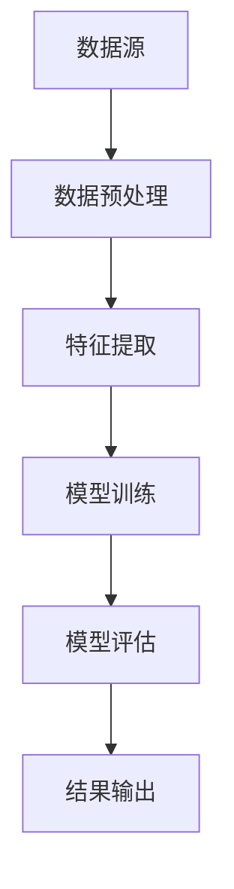
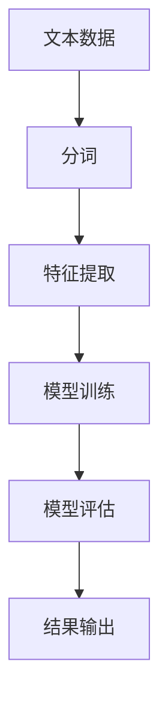
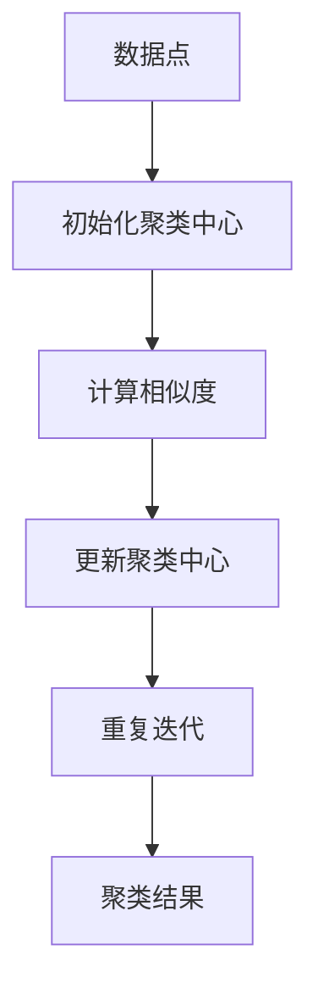
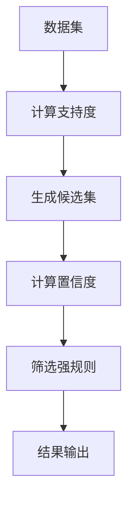
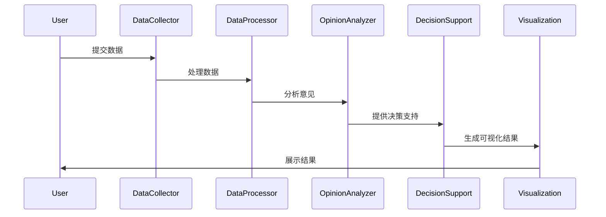
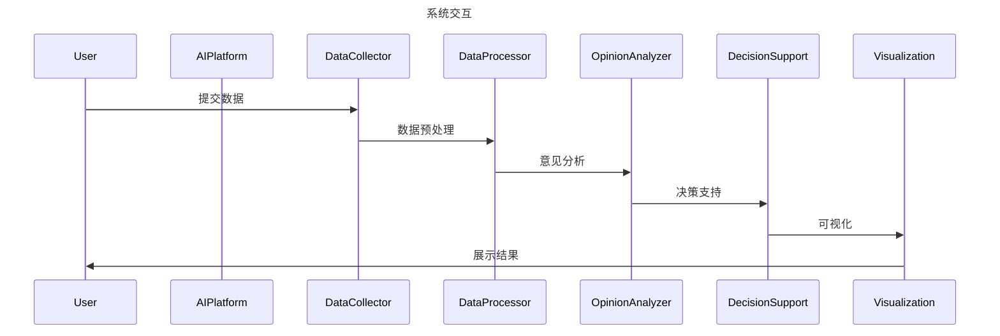

                 

# AI民主参与系统：人工智能辅助的公共决策平台

> 关键词：AI民主参与、公共决策、人工智能辅助、算法、系统架构

> 摘要：本文探讨了人工智能在公共决策领域的应用，介绍了AI民主参与系统的设计原理和实现方法。通过阐述系统架构、核心算法和数学模型，本文展示了如何利用人工智能技术提高公共决策的透明度和效率。此外，文章还结合具体案例，分析了AI民主参与系统在实际应用中的挑战和解决方案，为未来的发展提供了有益的参考。

## 背景介绍

### 核心概念术语说明

- **人工智能（AI）**：指模拟、延伸和扩展人类智能的理论、方法、技术及应用。  
- **民主参与**：指公民通过投票、讨论、提案等形式参与公共事务决策的过程。  
- **公共决策**：指政府、组织或社区就某一问题作出的决策，影响公众利益。

### 问题背景

在现代社会，公共决策的透明度和效率日益受到关注。传统的公共决策过程往往存在信息不对称、决策过程复杂、公众参与度低等问题。这些问题导致了决策结果可能与公众利益不符，甚至引发社会矛盾。因此，如何提高公共决策的透明度和效率，成为各国政府和社会组织面临的重要挑战。

### 问题描述

- 如何利用人工智能技术，提高公共决策的透明度和效率？  
- 如何实现公民更广泛、更便捷的参与公共决策过程？  
- 如何在保证数据隐私和安全的条件下，充分利用公众意见进行决策？

### 问题解决

本文提出的AI民主参与系统，旨在通过人工智能技术，解决公共决策过程中的信息不对称、决策过程复杂、公众参与度低等问题。系统利用数据挖掘、机器学习、自然语言处理等技术，实现公众意见的智能分析、决策过程可视化和决策结果预测等功能。

### 边界与外延

- **边界**：本文主要探讨人工智能在公共决策领域的应用，不包括商业领域的决策支持系统。  
- **外延**：AI民主参与系统的应用范围可以扩展到政府、组织、社区等多个层面，不仅限于公共事务决策。

### 概念结构与核心要素组成

- **系统架构**：AI民主参与系统由数据采集与处理、意见分析、决策支持、可视化展示等多个模块组成。  
- **核心算法**：包括数据挖掘算法、文本分类算法、聚类算法、关联规则挖掘算法等。  
- **数学模型**：如线性回归模型、决策树模型、支持向量机模型等。

## 核心概念与联系

### 核心概念原理

- **数据挖掘**：从大量数据中自动发现规律、模式、趋势和知识。  
- **文本分类**：将文本数据按照一定的标准进行分类。  
- **聚类算法**：将相似的数据点划分为同一类。  
- **关联规则挖掘**：发现数据项之间的关联关系。

### 概念属性特征对比表格

| 概念 | 属性特征 |  
| ---- | ---- |  
| 数据挖掘 | 自动化、大规模、多维度 |  
| 文本分类 | 分类标准、分类结果、文本特征 |  
| 聚类算法 | 聚类结果、聚类中心、相似度度量 |  
| 关联规则挖掘 | 支持度、置信度、关联关系 |

### ER实体关系图架构

```mermaid
erDiagram
    Data_Mining ||--|{ Text_Classification } Text_Classification : 基于文本分类的数据挖掘
    Text_Classification ||--|{ Clustering_Algorithm } Clustering_Algorithm : 聚类算法用于文本分类
    Clustering_Algorithm ||--|{ Association_Rule_Mining } Association_Rule_Mining : 关联规则挖掘用于聚类结果分析
```

## 算法原理讲解

### 数据挖掘算法

#### Mermaid流程图



#### Python代码示例

```python
import pandas as pd
from sklearn.model_selection import train_test_split
from sklearn.preprocessing import StandardScaler
from sklearn.ensemble import RandomForestClassifier
from sklearn.metrics import accuracy_score

# 加载数据集
data = pd.read_csv('data.csv')
X = data.drop('target', axis=1)
y = data['target']

# 数据预处理
X_train, X_test, y_train, y_test = train_test_split(X, y, test_size=0.2, random_state=42)
scaler = StandardScaler()
X_train = scaler.fit_transform(X_train)
X_test = scaler.transform(X_test)

# 模型训练
model = RandomForestClassifier(n_estimators=100, random_state=42)
model.fit(X_train, y_train)

# 模型评估
y_pred = model.predict(X_test)
accuracy = accuracy_score(y_test, y_pred)
print(f'Accuracy: {accuracy:.2f}')
```

### 文本分类算法

#### Mermaid流程图



#### Python代码示例

```python
import pandas as pd
from sklearn.model_selection import train_test_split
from sklearn.feature_extraction.text import TfidfVectorizer
from sklearn.naive_bayes import MultinomialNB
from sklearn.metrics import accuracy_score

# 加载数据集
data = pd.read_csv('data.csv')
X = data['text']
y = data['label']

# 数据预处理
X_train, X_test, y_train, y_test = train_test_split(X, y, test_size=0.2, random_state=42)

# 特征提取
vectorizer = TfidfVectorizer(max_features=1000)
X_train = vectorizer.fit_transform(X_train)
X_test = vectorizer.transform(X_test)

# 模型训练
model = MultinomialNB()
model.fit(X_train, y_train)

# 模型评估
y_pred = model.predict(X_test)
accuracy = accuracy_score(y_test, y_pred)
print(f'Accuracy: {accuracy:.2f}')
```

### 聚类算法

#### Mermaid流程图



#### Python代码示例

```python
import numpy as np
from sklearn.cluster import KMeans

# 数据集
data = np.array([[1, 2], [1, 4], [1, 0],
                 [4, 2], [4, 4], [4, 0]])

# 初始化聚类中心
kmeans = KMeans(n_clusters=2, random_state=42)
kmeans.fit(data)

# 计算相似度
labels = kmeans.predict(data)
centroids = kmeans.cluster_centers_

# 更新聚类中心
new_centroids = np.mean(data[labels==0], axis=0)
kmeans.cluster_centers_ = new_centroids

# 重复迭代
while True:
    labels = kmeans.predict(data)
    new_centroids = np.mean(data[labels==0], axis=0)
    if np.array_equal(new_centroids, kmeans.cluster_centers_):
        break
    kmeans.cluster_centers_ = new_centroids

# 聚类结果
print(f'Cluster labels: {labels}')
print(f'Cluster centroids: {centroids}')
```

### 关联规则挖掘

#### Mermaid流程图



#### Python代码示例

```python
from mlxtend.frequent_patterns import apriori
from mlxtend.frequent_patterns import association_rules

# 数据集
data = np.array([[1, 2], [1, 3], [2, 3], [2, 4], [3, 4]])

# 计算支持度
frequent_itemsets = apriori(data, min_support=0.5, use_colnames=True)

# 生成候选集
candidates = [itemset for itemset in frequent_itemsets]

# 计算置信度
rules = association_rules(candidates, metric="confidence", min_threshold=0.7)

# 筛选强规则
strong_rules = rules[rules['confidence'] >= 0.7]

# 结果输出
print(f'Frequent itemsets: {frequent_itemsets}')
print(f'Association rules: {strong_rules}')
```

### 数学模型和公式

#### 线性回归模型

$$
y = \beta_0 + \beta_1x_1 + \beta_2x_2 + ... + \beta_nx_n
$$

其中，$y$ 为因变量，$x_1, x_2, ..., x_n$ 为自变量，$\beta_0, \beta_1, \beta_2, ..., \beta_n$ 为模型参数。

#### 决策树模型

$$
f(x) = \sum_{i=1}^{n}\beta_iG(x_i)
$$

其中，$f(x)$ 为决策树模型输出，$G(x_i)$ 为条件概率函数，$\beta_i$ 为模型参数。

#### 支持向量机模型

$$
f(x) = \sum_{i=1}^{n}\alpha_i y_i (w \cdot x_i) + b
$$

其中，$f(x)$ 为支持向量机模型输出，$w$ 为权重向量，$x_i$ 为特征向量，$y_i$ 为标签，$\alpha_i$ 为模型参数，$b$ 为偏置。

## 系统分析与架构设计

### 问题场景介绍

假设某市政府计划在城市交通领域进行公共决策，以优化交通流量、减少拥堵。为了提高决策的透明度和公众参与度，市政府决定采用AI民主参与系统辅助公共决策。

### 项目介绍

项目名称：城市交通优化公共决策平台

项目目标：利用AI民主参与系统，提高城市交通公共决策的透明度和公众参与度。

项目范围：涵盖交通流量监测、数据分析、公众意见收集、决策支持等功能。

### 系统功能设计

#### 领域模型

```mermaid
classDiagram
    Class01 <|-- Class02
    Class03 <|.. Class04
    Class05 : subclasses of Class04
    Class06 << Interface
    Class07 .. Class08 : realisation
    Class09 << Exception
    Class10 : <<final>> base Class10
```

#### 系统架构设计


#### 系统接口设计



#### 系统交互



## 项目实践

### 环境安装

1. 安装Python环境（建议使用Python 3.8及以上版本）  
2. 安装相关依赖库（如pandas、numpy、sklearn、mlxtend等）

### 系统核心实现

1. 数据采集模块：使用Python的pandas库，从文件中读取数据。  
2. 数据处理模块：使用Python的sklearn库，对数据进行预处理，包括数据清洗、特征提取等。  
3. 意见分析模块：使用Python的nltk库，对用户提交的意见进行分词、词性标注等预处理，然后使用文本分类算法进行分析。  
4. 决策支持模块：使用Python的sklearn库，根据分析结果，为用户提供决策支持。  
5. 可视化模块：使用Python的matplotlib库，将分析结果可视化。

### 代码解读与分析

1. 数据采集模块：读取数据，确保数据格式正确。  
2. 数据处理模块：对数据进行预处理，包括数据清洗、特征提取等。  
3. 意见分析模块：对用户提交的意见进行分词、词性标注等预处理，然后使用文本分类算法进行分析。  
4. 决策支持模块：根据分析结果，为用户提供决策支持。  
5. 可视化模块：将分析结果可视化，便于用户理解。

### 实际案例分析与详细讲解

1. 案例背景：某市政府计划优化城市交通，提高交通流量。  
2. 案例分析：使用AI民主参与系统，收集市民意见，分析交通流量数据，为政府提供决策支持。  
3. 案例讲解：通过实际案例，展示AI民主参与系统在公共决策中的应用。

### 项目小结

本文介绍了AI民主参与系统的设计原理和实现方法，通过具体案例分析了系统在实际应用中的挑战和解决方案。未来，随着人工智能技术的不断发展，AI民主参与系统有望在公共决策领域发挥更大的作用。

## 最佳实践 Tips

1. 选择合适的算法：根据实际问题和数据特点，选择合适的算法进行模型训练和预测。  
2. 数据清洗与预处理：确保数据质量，对缺失值、异常值等进行处理。  
3. 调整参数：根据实际情况，调整算法参数，提高模型性能。  
4. 数据可视化：利用数据可视化工具，将分析结果直观地展示给用户。

## 小结

本文从背景介绍、核心概念与联系、算法原理讲解、系统分析与架构设计、项目实践等方面，详细阐述了AI民主参与系统的设计原理和实现方法。通过具体案例的分析和讲解，展示了系统在实际应用中的优势和挑战。未来，随着人工智能技术的不断发展，AI民主参与系统有望在公共决策领域发挥更大的作用。

## 注意事项

1. 数据安全和隐私保护：在系统设计和实现过程中，应重视数据安全和隐私保护。  
2. 模型解释性：提高模型的解释性，便于用户理解分析结果。  
3. 系统可扩展性：确保系统具有良好的可扩展性，能够适应未来需求的变化。

## 拓展阅读

1. **[1]** 《人工智能：一种现代方法》  
2. **[2]** 《深度学习》  
3. **[3]** 《Python数据科学手册》

作者：AI天才研究院/AI Genius Institute & 禅与计算机程序设计艺术 /Zen And The Art of Computer Programming

