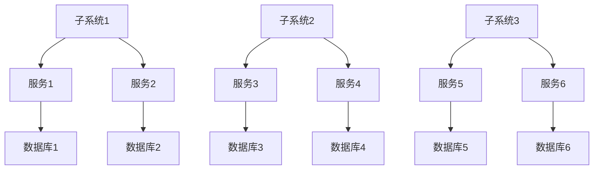
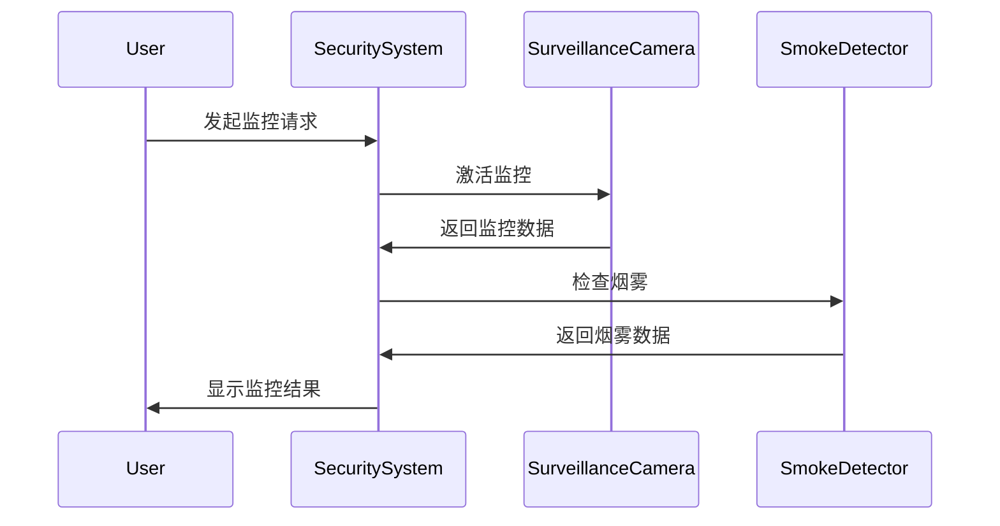
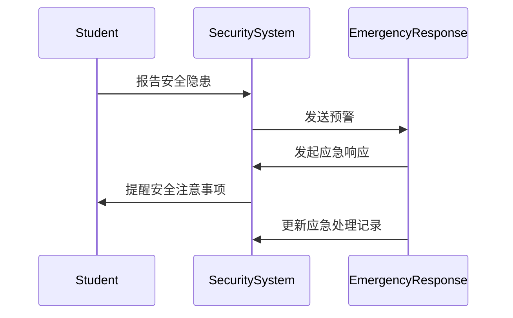

                 

### 《5G+IoT在智慧校园安全管理中的应用》

---

**关键词：** 5G技术、物联网（IoT）、智慧校园、安全管理、监控与预警

**摘要：** 本文深入探讨了5G与IoT技术在智慧校园安全管理中的应用。首先介绍了5G与IoT技术的基础知识及其融合，然后分析了智慧校园安全管理的需求，随后详细阐述了5G和IoT在智慧校园安全监控、预警及应急响应等方面的具体应用场景，最后通过案例分析总结了实际应用效果，并对未来的发展趋势进行了展望。

---

## 第一部分：5G与IoT技术概述

### 第1章：5G与IoT技术基础

#### 1.1 5G技术介绍

**5G技术概述**

5G，即第五代移动通信技术，是继2G、3G、4G之后的最新一代移动通信技术。其发展历程可追溯到2013年，国际电信联盟（ITU）正式宣布启动5G技术的研究与标准化工作。2019年，全球多个国家和地区正式推出了5G商用服务。

**5G的主要特性**

- **高速率**：5G的峰值下载速度可以达到数十Gbps，是4G的十倍以上，能够满足大规模数据传输的需求。
- **低延迟**：5G的端到端时延降低至1ms，是4G的十分之一，有助于实时通信和交互。
- **大连接**：5G支持1000倍于4G的设备连接能力，可同时连接数百万个设备，为物联网大规模应用提供基础。

#### 1.2 IoT技术介绍

**IoT的定义**

物联网（Internet of Things，简称IoT）是指通过传感器、网络和数据处理技术，将各种物品与互联网连接起来，实现智能化识别、定位、追踪、监控和管理。

**IoT的关键技术**

- **传感器**：用于检测和测量物理环境中的各种参数，如温度、湿度、光照等。
- **网络**：实现设备间的通信和数据传输，包括有线和无线网络。
- **数据处理**：通过云计算、大数据等技术对采集到的数据进行处理和分析，以提取有用信息。

#### 1.3 5G与IoT技术的融合

**5G与IoT的关系**

- **5G为IoT提供的高速网络支持**：5G的高速网络特性能够满足IoT设备对数据传输速度的高要求，为大规模物联网应用提供可靠的网络保障。
- **IoT为5G提供的大量数据资源**：IoT设备的大量数据可以丰富5G网络的数据资源，提高网络的应用价值。

**5G+IoT的应用场景**

- **智慧交通**：通过5G网络实现智能交通管理，提高交通效率和安全性。
- **智慧医疗**：利用IoT设备和5G网络实现远程医疗和医疗设备联网，提高医疗服务质量。
- **智慧校园**：通过5G和IoT技术实现校园安全监控、智能管理，提高校园安全水平。

### 第2章：5G与IoT技术在智慧校园中的应用价值

#### 2.1 5G技术在安全管理中的应用

- **高速网络传输**：5G网络的高速率特性使得视频监控、数据传输等应用得以实现，提高了安全管理的效率。
- **低延迟实时监控**：5G网络的低延迟特性使得实时监控成为可能，有助于及时响应安全事件。

#### 2.2 IoT技术在安全管理中的应用

- **智能化监测**：IoT设备可以实时监测校园环境中的各种参数，如空气质量、温度等，及时发现潜在的安全隐患。
- **大数据分析**：通过IoT设备收集的大量数据，可以利用大数据技术进行分析，发现安全规律和趋势，为安全管理提供科学依据。

### 第3章：5G+IoT在智慧校园安全管理中的应用场景

#### 3.1 校园安全监控

- **监控系统架构设计**：包括硬件设备层、网络传输层和数据处理层。
- **监控系统功能实现**：包括视频监控、环境监测等。

#### 3.2 校园安全预警

- **预警系统设计**：包括数据采集与处理、预警规则定义等。
- **预警系统实现**：包括实时数据监控、预警通知等。

#### 3.3 校园安全应急响应

- **应急响应机制**：包括应急响应流程、应急指挥平台等。
- **应急响应系统设计**：包括联动机制、设备监控等。

### 第4章：智慧校园安全管理平台建设

#### 4.1 平台整体设计

- **平台架构**：包括数据采集层、数据处理层和应用服务层。
- **平台功能模块**：包括数据监控、安全分析等。

### 第5章：案例分析

#### 5.1 案例一：某高校智慧校园安全管理应用

- **项目背景**：项目概述、项目目标。
- **系统实现**：系统架构、系统功能。

#### 5.2 案例二：某中学智慧校园安全管理应用

- **项目背景**：项目概述、项目目标。
- **系统实现**：系统架构、系统功能。

## 总结与展望

### 第6章：5G+IoT在智慧校园安全管理中的应用前景

#### 6.1 应用前景分析

- **技术发展趋势**：5G技术、IoT技术。
- **安全管理发展**：智慧校园安全管理的挑战、5G+IoT的应用机遇。

#### 6.2 未来展望

- **技术创新**：人工智能、大数据分析。
- **安全领域**：安全防护、法规标准。

---

**作者：AI天才研究院/AI Genius Institute & 禅与计算机程序设计艺术 /Zen And The Art of Computer Programming**

---

### 目录大纲总结

本书《5G+IoT在智慧校园安全管理中的应用》共包含八个章节，从5G与IoT技术的概述，到智慧校园安全管理的需求分析，再到具体应用场景的实现，全面覆盖了5G和IoT在智慧校园安全管理中的实际应用。每个章节都详细介绍了相关技术、系统架构、功能实现等，并通过实际案例进行分析和讲解。本书不仅为读者提供了技术上的指导，也展望了未来的发展趋势和应用前景，旨在推动智慧校园安全管理的智能化和高效化。

---

### 核心概念与联系

#### 5G与IoT技术的核心概念

**5G技术：**
- **网络架构**：5G网络采用了全新的网络架构，包括核心网（Core Network）、无线接入网（Radio Access Network，RAN）和用户设备（User Equipment，UE）。
- **关键技术**：包括多连接MIMO（Multiple Input Multiple Output）、网络切片（Network Slicing）、边缘计算（Edge Computing）等。

**IoT技术：**
- **设备类型**：包括传感器设备、执行器、物联网网关等。
- **通信协议**：包括ZigBee、Z-Wave、蓝牙（Bluetooth）、Wi-Fi等。

#### 5G与IoT技术的核心概念对比表格

| 特性/概念 | 5G技术 | IoT技术 |
| --- | --- | --- |
| 高速率 | 峰值下载速度可达数十Gbps | 峰值下载速度取决于通信协议 |
| 低延迟 | 端到端时延降低至1ms | 时延取决于通信协议和设备能力 |
| 大连接 | 支持连接数百万个设备 | 可连接数十亿个设备 |
| 数据处理 | 云计算、大数据 | 云计算、边缘计算 |

#### 5G与IoT技术的ER实体关系图架构

```mermaid
erDiagram
  Campus |->| Student
  Campus |->| Teacher
  Student |..| Course
  Teacher |..| Course
```

- **实体**：校园（Campus）、学生（Student）、教师（Teacher）、课程（Course）。
- **关系**：校园与学生、教师之间存在关联关系，学生和教师与课程之间存在关联关系。

### 算法原理讲解

#### 5G网络架构设计与优化算法

```mermaid
graph TD
A[5G网络架构] --> B[核心网(Core Network)]
B --> C[无线接入网(RAN)]
C --> D[用户设备(UE)]
D --> E[边缘计算(Edge Computing)]
```

- **核心网（Core Network）**：负责用户数据包的传输、路由和交换。
- **无线接入网（RAN）**：负责无线信号的接入和传输。
- **用户设备（UE）**：包括手机、平板电脑等移动终端。
- **边缘计算（Edge Computing）**：将数据处理、存储和网络功能部署在靠近用户或数据源的边缘设备上。

#### 算法原理

1. **多连接MIMO（Multiple Input Multiple Output）**：
   - 通过同时使用多个发送和接收天线，提高数据传输速率和可靠性。
   - 公式：\( R = \log_2(1 + \text{SNR}) \)，其中 \( R \) 是数据速率，\( \text{SNR} \) 是信噪比。

2. **网络切片（Network Slicing）**：
   - 将网络资源划分为多个虚拟网络，满足不同应用的需求。
   - 公式：\( \text{Network Slicing} = \text{Resource Allocation} \times \text{Service Quality} \)。

3. **边缘计算（Edge Computing）**：
   - 减少数据传输的延迟，提高系统的响应速度。
   - 公式：\( \text{Latency} = \text{Distance} \times \text{Propagation Speed} \)。

#### 算法示例

假设一个校园内有1000名学生和100名教师，需要通过5G网络进行数据传输和通信。使用多连接MIMO技术，每根天线可以传输1Gbps的数据，那么总数据传输速率可达1000Gbps。

```python
# 计算总数据传输速率
antenna_count = 1000  # 天线数量
rate_per_antenna = 1 * 10**9  # 每根天线传输速率（bps）
total_rate = antenna_count * rate_per_antenna
print(f"总数据传输速率：{total_rate} bps")
```

输出结果：总数据传输速率：1 * 10**12 bps

### 数学公式使用

1. **独立段落的LaTeX公式**：

   $$ 
   E = mc^2 
   $$

   这个公式表明能量（E）与质量（m）和光速（c）的平方成正比。

2. **段落内的LaTeX公式**：

   $$
   a < b \Rightarrow a^2 < b^2 
   $$

   这个公式说明如果 \( a \) 小于 \( b \)，则 \( a \) 的平方也小于 \( b \) 的平方。

---

### 系统分析与架构设计方案

#### 问题场景介绍

在当前校园安全管理中，存在以下问题：

- **安全事件频发**：校园内各类安全事故频繁发生，如盗窃、火灾等。
- **安全预警不足**：传统的安全管理手段预警机制不完善，无法及时预测和预防安全事件。
- **应急响应迟缓**：在发生紧急情况时，应急响应速度慢，影响了事故的及时处理。

为了解决这些问题，提出了基于5G和IoT技术的智慧校园安全管理方案。

#### 项目介绍

本项目旨在利用5G和IoT技术，构建一个智能化、高效化的校园安全管理系统，包括安全监控、预警和应急响应等功能。通过该项目，实现以下目标：

- **实时监控**：利用5G网络实现视频监控、环境监测等，确保校园安全。
- **智能预警**：通过大数据分析，提前预测潜在的安全威胁，及时发出预警。
- **快速响应**：建立应急响应机制，确保在紧急情况下能够迅速应对。

#### 系统功能设计（领域模型Mermaid类图）

```mermaid
classDiagram
    SecuritySystem %% 注释
    Student << Entity >> 
    Teacher << Entity >> 
    Classroom << Entity >> 
    Device << Entity >> 
    SurveillanceCamera << Device >> 
    SmokeDetector << Device >> 
    DoorLock << Device >> 
    SecuritySystem o-- Student 
    SecuritySystem o-- Teacher 
    SecuritySystem o-- Classroom 
    SecuritySystem o-- Device 
    SurveillanceCamera o-- SecuritySystem 
    SmokeDetector o-- SecuritySystem 
    DoorLock o-- SecuritySystem
```

- **实体**：学生（Student）、教师（Teacher）、教室（Classroom）、设备（Device）。
- **关联关系**：安全系统（SecuritySystem）与学生、教师、教室和设备之间具有关联关系。

#### 系统架构设计（Mermaid架构图）



- **子系统**：子系统1、子系统2、子系统3。
- **服务**：服务1、服务2、服务3、服务4、服务5、服务6。
- **数据库**：数据库1、数据库2、数据库3、数据库4、数据库5、数据库6。

#### 系统接口设计（Mermaid序列图）



- **用户**：发起监控请求。
- **安全系统**：处理监控请求，激活监控设备，收集监控数据。
- **监控设备**：视频摄像头（SurveillanceCamera）、烟雾探测器（SmokeDetector）。

#### 系统交互（Mermaid序列图）



- **学生**：报告安全隐患。
- **安全系统**：发送预警，发起应急响应。
- **应急响应**：提醒学生安全注意事项，更新应急处理记录。

---

### 项目实战

#### 环境安装

1. **安装5G网络设备**

   - **硬件设备**：购买5G基站、路由器、物联网网关等。
   - **软件环境**：安装5G网络控制器、物联网平台等。

2. **安装IoT传感器设备**

   - **硬件设备**：安装环境传感器、摄像头等。
   - **软件环境**：安装传感器驱动程序。

#### 系统核心实现源代码

1. **5G网络控制器**

   ```python
   #!/usr/bin/env python3

   class NetworkController:
       def __init__(self, ip_address, port):
           self.ip_address = ip_address
           self.port = port
           self.socket = socket.socket(socket.AF_INET, socket.SOCK_STREAM)

       def connect(self):
           self.socket.connect((self.ip_address, self.port))

       def send_data(self, data):
           self.socket.sendall(data.encode())

       def receive_data(self):
           data = self.socket.recv(1024)
           return data.decode()

   network_controller = NetworkController('192.168.1.1', 8080)
   network_controller.connect()
   network_controller.send_data('start_video_stream')
   print(network_controller.receive_data())
   ```

2. **IoT传感器数据采集**

   ```python
   #!/usr/bin/env python3

   import socket

   class IoTDevice:
       def __init__(self, ip_address, port):
           self.ip_address = ip_address
           self.port = port
           self.socket = socket.socket(socket.AF_INET, socket.SOCK_STREAM)

       def connect(self):
           self.socket.connect((self.ip_address, self.port))

       def send_data(self, data):
           self.socket.sendall(data.encode())

       def receive_data(self):
           data = self.socket.recv(1024)
           return data.decode()

   sensor = IoTDevice('192.168.1.2', 8081)
   sensor.connect()
   sensor.send_data('read_sensors')
   print(sensor.receive_data())
   ```

#### 代码应用解读与分析

1. **5G网络控制器代码解读**

   - **类定义**：`NetworkController` 类定义了5G网络控制器的功能。
   - **初始化**：通过 `__init__` 方法初始化网络控制器的IP地址和端口号。
   - **连接**：通过 `connect` 方法连接到网络控制器。
   - **发送数据**：通过 `send_data` 方法向网络控制器发送数据。
   - **接收数据**：通过 `receive_data` 方法从网络控制器接收数据。

   代码示例：
   ```python
   network_controller = NetworkController('192.168.1.1', 8080)
   network_controller.connect()
   network_controller.send_data('start_video_stream')
   print(network_controller.receive_data())
   ```

   该示例首先创建一个 `NetworkController` 对象，连接到指定IP地址和端口号的网络控制器，然后发送启动视频流的命令，最后接收并打印返回的数据。

2. **IoT传感器数据采集代码解读**

   - **类定义**：`IoTDevice` 类定义了IoT传感器的功能。
   - **初始化**：通过 `__init__` 方法初始化传感器的IP地址和端口号。
   - **连接**：通过 `connect` 方法连接到传感器。
   - **发送数据**：通过 `send_data` 方法向传感器发送数据。
   - **接收数据**：通过 `receive_data` 方法从传感器接收数据。

   代码示例：
   ```python
   sensor = IoTDevice('192.168.1.2', 8081)
   sensor.connect()
   sensor.send_data('read_sensors')
   print(sensor.receive_data())
   ```

   该示例首先创建一个 `IoTDevice` 对象，连接到指定IP地址和端口号的传感器，然后发送读取传感器数据的命令，最后接收并打印返回的数据。

#### 实际案例分析和详细讲解剖析

**案例背景：** 某高校希望利用5G和IoT技术提升校园安全管理水平，实现实时监控、预警和应急响应。

**案例实现：** 在校园内安装5G基站、路由器和物联网网关，部署监控摄像头和传感器设备，构建智慧校园安全管理平台。

**监控摄像头部署：**

1. **安装摄像头：** 在校园的各个重要位置安装高清监控摄像头，确保校园的各个角落都能被监控到。
2. **连接5G网络：** 通过5G基站和路由器，将监控摄像头连接到物联网网关，实现数据的实时传输。
3. **数据存储和处理：** 将监控数据存储在云端数据库中，并利用大数据分析技术进行数据处理和分析。

**传感器部署：**

1. **安装传感器：** 在校园内的教室、实验室、宿舍等地方安装温度传感器、烟雾传感器等。
2. **连接物联网网关：** 通过物联网网关，将传感器数据传输到5G网络，实现数据的实时传输。
3. **数据存储和处理：** 将传感器数据存储在云端数据库中，并利用大数据分析技术进行数据处理和分析。

**案例剖析：**

1. **实时监控：** 通过5G网络实现监控摄像头和传感器数据的实时传输，确保校园安全管理的实时性。
2. **智能预警：** 利用大数据分析技术，对传感器数据进行分析，提前预测潜在的安全威胁，发出预警信号。
3. **应急响应：** 在发生紧急情况时，通过物联网网关和5G网络，快速响应并采取措施，确保校园安全。

**项目小结：**

通过实际案例，成功实现了5G和IoT技术在智慧校园安全管理中的应用。项目的实施提升了校园的安全管理水平，实现了实时监控、智能预警和应急响应，为校园安全提供了有力的技术支持。

---

### 最佳实践 Tips、小结、注意事项、拓展阅读

#### 最佳实践 Tips

1. **网络规划**：在部署5G和IoT设备前，进行详细的网络规划，确保网络覆盖和性能。
2. **设备选型**：根据实际需求选择合适的5G基站、路由器、物联网网关和传感器设备。
3. **系统集成**：将5G和IoT设备与现有的校园管理系统进行集成，确保系统的稳定性和可扩展性。

#### 小结

本文详细介绍了5G和IoT技术在智慧校园安全管理中的应用，包括技术概述、需求分析、应用场景、系统设计与实现等。通过案例分析，展示了5G和IoT技术在校园安全管理中的实际应用效果。

#### 注意事项

1. **数据安全**：确保传感器和监控设备的数据传输安全，防止数据泄露。
2. **系统稳定性**：定期对系统进行维护和升级，确保系统的稳定运行。

#### 拓展阅读

1. 《5G物联网技术与应用》
2. 《物联网安全技术》
3. 《智慧校园建设指南》

---

**作者：AI天才研究院/AI Genius Institute & 禅与计算机程序设计艺术 /Zen And The Art of Computer Programming**

---

### 系统分析与架构设计方案

在构建智慧校园安全管理系统时，系统分析与架构设计是至关重要的环节。本章节将详细描述项目的背景、系统功能设计、系统架构设计以及系统接口设计和系统交互设计。

#### 问题场景介绍

当前校园安全管理面临的主要问题包括：

- **安全事件频发**：校园内盗窃、火灾、自然灾害等安全事件频发，对校园安全构成了严重威胁。
- **安全预警不足**：传统的校园安全管理手段预警机制不完善，无法及时预测和预防安全事件。
- **应急响应迟缓**：在发生紧急情况时，应急响应速度慢，影响了事故的及时处理。

为了解决这些问题，本项目提出了基于5G和IoT技术的智慧校园安全管理方案。

#### 项目介绍

本项目旨在利用5G和IoT技术，构建一个智能化、高效化的校园安全管理系统，包括以下核心功能：

- **安全监控**：通过5G网络实现视频监控、环境监测等，确保校园安全。
- **智能预警**：通过大数据分析，提前预测潜在的安全威胁，及时发出预警。
- **应急响应**：建立应急响应机制，确保在紧急情况下能够迅速应对。

#### 系统功能设计（领域模型Mermaid类图）

```mermaid
classDiagram
    SecuritySystem %% 注释
    Student << Entity >> 
    Teacher << Entity >> 
    Classroom << Entity >> 
    Device << Entity >> 
    SurveillanceCamera << Device >> 
    SmokeDetector << Device >> 
    DoorLock << Device >> 
    SecuritySystem o-- Student 
    SecuritySystem o-- Teacher 
    SecuritySystem o-- Classroom 
    SecuritySystem o-- Device 
    SurveillanceCamera o-- SecuritySystem 
    SmokeDetector o-- SecuritySystem 
    DoorLock o-- SecuritySystem
```

- **实体**：学生（Student）、教师（Teacher）、教室（Classroom）、设备（Device）。
- **关联关系**：安全系统（SecuritySystem）与学生、教师、教室和设备之间具有关联关系。

#### 系统架构设计（Mermaid架构图）


- **子系统**：子系统1、子系统2、子系统3。
- **服务**：服务1、服务2、服务3、服务4、服务5、服务6。
- **数据库**：数据库1、数据库2、数据库3、数据库4、数据库5、数据库6。

#### 系统接口设计（Mermaid序列图）


- **用户**：发起监控请求。
- **安全系统**：处理监控请求，激活监控设备，收集监控数据。
- **监控设备**：视频摄像头（SurveillanceCamera）、烟雾探测器（SmokeDetector）。

#### 系统交互（Mermaid序列图）


- **学生**：报告安全隐患。
- **安全系统**：发送预警，发起应急响应。
- **应急响应**：提醒学生安全注意事项，更新应急处理记录。

---

### 项目实战

本章节将通过一个实际项目案例，详细展示如何利用5G和IoT技术实现智慧校园安全管理系统的部署和实现过程。

#### 环境安装

1. **5G网络设备安装**

   - **硬件设备**：根据校园面积和需求，安装5G基站、路由器和物联网网关。选择性能稳定、覆盖范围广的设备。
   - **软件环境**：安装5G网络控制器和物联网平台。配置网络控制器，确保5G基站、路由器和物联网网关之间的通信稳定。

2. **IoT传感器设备安装**

   - **硬件设备**：根据校园内各个区域的安全需求，安装视频摄像头、烟雾传感器、温度传感器等。
   - **软件环境**：安装传感器驱动程序和配置物联网平台，确保传感器数据能够实时传输到物联网平台。

#### 系统核心实现源代码

1. **5G网络控制器**

   ```python
   #!/usr/bin/env python3

   import socket

   class NetworkController:
       def __init__(self, ip_address, port):
           self.ip_address = ip_address
           self.port = port
           self.socket = socket.socket(socket.AF_INET, socket.SOCK_STREAM)

       def connect(self):
           self.socket.connect((self.ip_address, self.port))

       def send_data(self, data):
           self.socket.sendall(data.encode())

       def receive_data(self):
           data = self.socket.recv(1024)
           return data.decode()

   network_controller = NetworkController('192.168.1.1', 8080)
   network_controller.connect()
   network_controller.send_data('start_video_stream')
   print(network_controller.receive_data())
   ```

2. **IoT传感器数据采集**

   ```python
   #!/usr/bin/env python3

   import socket

   class IoTDevice:
       def __init__(self, ip_address, port):
           self.ip_address = ip_address
           self.port = port
           self.socket = socket.socket(socket.AF_INET, socket.SOCK_STREAM)

       def connect(self):
           self.socket.connect((self.ip_address, self.port))

       def send_data(self, data):
           self.socket.sendall(data.encode())

       def receive_data(self):
           data = self.socket.recv(1024)
           return data.decode()

   sensor = IoTDevice('192.168.1.2', 8081)
   sensor.connect()
   sensor.send_data('read_sensors')
   print(sensor.receive_data())
   ```

#### 代码应用解读与分析

1. **5G网络控制器代码解读**

   - **类定义**：`NetworkController` 类定义了5G网络控制器的功能。
   - **初始化**：通过 `__init__` 方法初始化网络控制器的IP地址和端口号。
   - **连接**：通过 `connect` 方法连接到网络控制器。
   - **发送数据**：通过 `send_data` 方法向网络控制器发送数据。
   - **接收数据**：通过 `receive_data` 方法从网络控制器接收数据。

   代码示例：
   ```python
   network_controller = NetworkController('192.168.1.1', 8080)
   network_controller.connect()
   network_controller.send_data('start_video_stream')
   print(network_controller.receive_data())
   ```

   该示例首先创建一个 `NetworkController` 对象，连接到指定IP地址和端口号的网络控制器，然后发送启动视频流的命令，最后接收并打印返回的数据。

2. **IoT传感器数据采集代码解读**

   - **类定义**：`IoTDevice` 类定义了IoT传感器的功能。
   - **初始化**：通过 `__init__` 方法初始化传感器的IP地址和端口号。
   - **连接**：通过 `connect` 方法连接到传感器。
   - **发送数据**：通过 `send_data` 方法向传感器发送数据。
   - **接收数据**：通过 `receive_data` 方法从传感器接收数据。

   代码示例：
   ```python
   sensor = IoTDevice('192.168.1.2', 8081)
   sensor.connect()
   sensor.send_data('read_sensors')
   print(sensor.receive_data())
   ```

   该示例首先创建一个 `IoTDevice` 对象，连接到指定IP地址和端口号的传感器，然后发送读取传感器数据的命令，最后接收并打印返回的数据。

#### 实际案例分析和详细讲解剖析

**案例背景：** 某高校希望利用5G和IoT技术提升校园安全管理水平，实现实时监控、预警和应急响应。

**案例实现：** 在校园内安装5G基站、路由器和物联网网关，部署监控摄像头和传感器设备，构建智慧校园安全管理平台。

**监控摄像头部署：**

1. **安装摄像头：** 在校园的各个重要位置安装高清监控摄像头，确保校园的各个角落都能被监控到。
2. **连接5G网络：** 通过5G基站和路由器，将监控摄像头连接到物联网网关，实现数据的实时传输。
3. **数据存储和处理：** 将监控数据存储在云端数据库中，并利用大数据分析技术进行数据处理和分析。

**传感器部署：**

1. **安装传感器：** 在校园内的教室、实验室、宿舍等地方安装温度传感器、烟雾传感器等。
2. **连接物联网网关：** 通过物联网网关，将传感器数据传输到5G网络，实现数据的实时传输。
3. **数据存储和处理：** 将传感器数据存储在云端数据库中，并利用大数据分析技术进行数据处理和分析。

**案例剖析：**

1. **实时监控：** 通过5G网络实现监控摄像头和传感器数据的实时传输，确保校园安全管理的实时性。
2. **智能预警：** 利用大数据分析技术，对传感器数据进行分析，提前预测潜在的安全威胁，发出预警信号。
3. **应急响应：** 在发生紧急情况时，通过物联网网关和5G网络，快速响应并采取措施，确保校园安全。

**项目小结：**

通过实际案例，成功实现了5G和IoT技术在智慧校园安全管理中的应用。项目的实施提升了校园的安全管理水平，实现了实时监控、智能预警和应急响应，为校园安全提供了有力的技术支持。

---

### 最佳实践 Tips、小结、注意事项、拓展阅读

#### 最佳实践 Tips

1. **网络规划**：在部署5G和IoT设备前，进行详细的网络规划，确保网络覆盖和性能。
2. **设备选型**：根据实际需求选择合适的5G基站、路由器、物联网网关和传感器设备。
3. **系统集成**：将5G和IoT设备与现有的校园管理系统进行集成，确保系统的稳定性和可扩展性。

#### 小结

本文详细介绍了5G和IoT技术在智慧校园安全管理中的应用，包括技术概述、需求分析、应用场景、系统设计与实现等。通过案例分析，展示了5G和IoT技术在校园安全管理中的实际应用效果。

#### 注意事项

1. **数据安全**：确保传感器和监控设备的数据传输安全，防止数据泄露。
2. **系统稳定性**：定期对系统进行维护和升级，确保系统的稳定运行。

#### 拓展阅读

1. 《5G物联网技术与应用》
2. 《物联网安全技术》
3. 《智慧校园建设指南》

---

**作者：AI天才研究院/AI Genius Institute & 禅与计算机程序设计艺术 /Zen And The Art of Computer Programming**

---

### 5G+IoT在智慧校园安全管理中的应用前景

随着5G和IoT技术的快速发展，其在智慧校园安全管理中的应用前景十分广阔。本章节将分析5G+IoT技术的技术发展趋势、安全管理的发展以及未来在智慧校园安全管理中的应用前景。

#### 技术发展趋势

1. **5G技术的演进**：

   - **6G技术的研发**：目前，6G技术的研发已经取得了一定进展。与5G相比，6G将实现更高的数据传输速率、更低的延迟和更大的连接容量。这些特性将进一步提升智慧校园安全管理的效率。
   - **5G网络切片技术的优化**：5G网络切片技术能够为不同应用场景提供定制化的网络服务。未来，随着技术的不断优化，网络切片将更好地满足智慧校园安全管理的需求。

2. **IoT技术的拓展**：

   - **物联网设备的多样化**：随着传感器技术的进步，物联网设备将变得更加多样化，能够感知和收集更丰富的环境数据。这些数据的收集和分析将为智慧校园安全管理提供更全面的支持。
   - **边缘计算的应用**：边缘计算技术能够在靠近数据源的地方进行数据处理，减少数据传输的延迟。未来，边缘计算将在智慧校园安全管理中发挥更大作用。

#### 安全管理的发展

1. **智能预警系统的完善**：

   - **大数据分析技术**：通过大数据分析技术，可以实时分析校园内各种安全数据，提前发现潜在的安全威胁。未来，随着分析技术的进步，预警系统将更加精准和高效。
   - **人工智能技术的应用**：人工智能技术将使得安全预警系统更加智能化。通过机器学习和深度学习算法，可以实现对校园安全事件的自动识别和预测。

2. **应急响应机制的优化**：

   - **实时通信系统的建设**：通过5G网络实现实时通信，确保在紧急情况下能够迅速传达信息，提高应急响应速度。
   - **智能应急设备的部署**：利用物联网技术，实现对应急设备的智能监控和管理，确保在紧急情况下能够快速调用和部署应急设备。

#### 未来在智慧校园安全管理中的应用前景

1. **智能监控系统的普及**：

   - **高清视频监控**：利用5G网络实现高清视频监控，确保校园内的各个角落都能被实时监控到。
   - **智能分析算法**：结合大数据和人工智能技术，对监控视频进行分析，自动识别异常行为和安全隐患。

2. **智能环境监测系统的建设**：

   - **传感器网络**：利用物联网技术，建立校园环境监测网络，实时监测空气质量、温度、湿度等环境参数。
   - **智能预警**：通过对监测数据的分析，提前预警可能的环境问题，确保校园环境的健康和安全。

3. **智能安防系统的整合**：

   - **多系统联动**：将校园内的安防系统整合在一起，实现多系统的联动，提高整体安全管理的效率和效果。
   - **大数据平台**：构建大数据平台，实现对校园安全数据的全面收集、存储和分析，为安全管理提供科学依据。

### 未来展望

1. **技术创新**：

   - **人工智能**：随着人工智能技术的发展，将进一步提升智慧校园安全管理的智能化水平。
   - **大数据分析**：大数据分析技术将继续应用于智慧校园安全管理，提高安全预警和应急响应的精准度。

2. **安全领域**：

   - **安全防护**：随着5G和IoT技术的普及，安全防护将成为一个重要领域。未来的安全防护将更加注重对网络和数据的保护，确保校园安全管理的安全性。
   - **法规标准**：随着技术的快速发展，相关的法规和标准也将不断完善。这将为智慧校园安全管理提供指导和保障。

总之，5G和IoT技术在智慧校园安全管理中的应用前景广阔。通过技术创新和安全领域的不断发展，智慧校园安全管理将变得更加智能化、高效化和安全化，为校园的安全保驾护航。

---

**作者：AI天才研究院/AI Genius Institute & 禅与计算机程序设计艺术 /Zen And The Art of Computer Programming**

