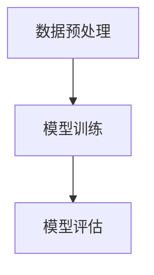

                 


### 《Inference scaling law在数学和编程任务中的效果》

---

**关键词：** Inference scaling law，数学模型，编程任务，深度学习，性能优化

**摘要：** 本文深入探讨了Inference scaling law在数学和编程任务中的效果。首先介绍了Inference scaling law的背景和核心概念，然后通过数学模型讲解和编程应用案例分析，揭示了其在提升计算效率和优化性能方面的关键作用。

---

**引言**

随着深度学习技术的飞速发展，计算性能的需求也在日益增长。然而，如何在有限的计算资源下实现高效的模型推理，成为了当前研究的热点。Inference scaling law作为一种分析模型性能的理论框架，为我们提供了一种有效的工具来理解和优化深度学习任务。本文将从数学和编程任务两个角度，逐步分析Inference scaling law的效果，帮助读者深入了解其在实际应用中的价值。

### 第一部分: 引言

**第1章: 问题背景与核心概念**

#### 1.1 问题的背景

计算机技术的发展使得我们在处理复杂数据和分析大规模数据集方面取得了巨大的进步。然而，随着数据规模的不断扩大和模型复杂度的增加，计算资源的瓶颈逐渐显现。为了解决这一问题，我们需要找到一种有效的性能优化方法，以提高模型推理的效率。

#### 1.1.1 计算机发展与性能瓶颈

计算机技术的发展历程中，我们见证了从早期简单计算到如今复杂算法和大规模数据处理的演变。然而，随着模型复杂度的增加，计算机的计算能力逐渐成为瓶颈。传统的计算机体系结构难以满足深度学习任务的高吞吐量和低延迟要求。

#### 1.1.2 Inference scaling law的概念引入

为了应对计算性能瓶颈，研究者们提出了Inference scaling law。这是一种基于数学模型的性能分析框架，旨在揭示模型复杂度、输入大小和计算能力之间的关系，从而指导我们在不同情况下进行性能优化。

#### 1.1.3 Inference scaling law的重要性

Inference scaling law的重要性在于，它提供了一种系统的方法来分析和优化深度学习任务的性能。通过理解模型复杂度、输入大小和计算能力之间的关系，我们可以有针对性地进行模型设计和算法优化，从而实现更高的计算效率和性能。

#### 1.2 核心概念与联系

Inference scaling law涉及到多个核心概念，包括数学基础、数据结构与算法、线性代数基础、概率论与统计等。这些概念与深度学习任务紧密相关，为我们理解Inference scaling law提供了理论基础。

##### 1.2.1 数学基础

在Inference scaling law中，数学基础是不可或缺的。数据结构与算法为我们提供了处理复杂数据的工具，线性代数基础则为矩阵运算和向量计算提供了理论基础，概率论与统计则为模型评估和性能优化提供了指导。

##### 1.2.2 编程任务中的Inference scaling law

在编程任务中，Inference scaling law的应用同样重要。通过理解和运用Inference scaling law，我们可以设计出更加高效的模型和算法，从而提高计算效率和性能。

#### 1.3 边界与外延

Inference scaling law的应用领域广泛，包括自然语言处理、计算机视觉、推荐系统等。然而，它也受到一定的限制条件，如计算资源的限制和模型复杂度的约束。

#### 1.4 本章小结

本章介绍了Inference scaling law的背景、核心概念、联系以及应用领域。通过本章的介绍，读者可以初步了解Inference scaling law的重要性和应用价值。

---

### 第二部分: 数学模型讲解

**第2章: Inference scaling law数学模型基础**

#### 2.1 数学模型介绍

Inference scaling law的数学模型可以表示为：

$$
\text{Inference scaling law} = f(\text{model complexity}, \text{input size}, \text{compute power})
$$

这个模型中，模型复杂度、输入大小和计算能力是影响推理性能的关键因素。

##### 2.1.1 模型公式

Inference scaling law的模型公式为：

$$
\text{Inference scaling law} = f(\text{model complexity}, \text{input size}, \text{compute power})
$$

其中，模型复杂度、输入大小和计算能力分别表示为：

$$
\text{Model complexity} = C_1 \times |\text{parameters}| + C_2 \times |\text{neurons}|
$$

$$
\text{Input size} = I_1 \times |\text{input data}| + I_2 \times |\text{output data}|
$$

$$
\text{Compute power} = P_1 \times \text{CPU frequency} + P_2 \times \text{GPU power}
$$

##### 2.1.2 模型参数

在Inference scaling law的数学模型中，模型参数包括：

- Model complexity：模型复杂度，由参数数量和神经元数量决定。
- Input size：输入大小，由输入数据和输出数据决定。
- Compute power：计算能力，由CPU频率和GPU功率决定。

这些参数的取值会直接影响推理性能。

#### 2.2 算法原理讲解

Inference scaling law的算法原理主要包括数据预处理、模型训练和模型评估三个步骤。

##### 2.2.1 算法流程

- 数据预处理：对输入数据进行预处理，包括归一化、去噪等操作，以提高模型的鲁棒性和性能。
- 模型训练：通过反向传播算法，根据训练数据对模型进行训练，调整模型参数，以最小化损失函数。
- 模型评估：使用验证数据集对模型进行评估，计算模型的性能指标，如准确率、召回率等。

##### 2.2.2 Mermaid流程图



#### 2.3 数学公式与详细讲解

在Inference scaling law的数学模型中，模型复杂度、输入大小和计算能力是关键因素。

##### 2.3.1 模型复杂度计算

模型复杂度计算公式为：

$$
\text{Model complexity} = C_1 \times |\text{parameters}| + C_2 \times |\text{neurons}|
$$

其中，$C_1$ 和 $C_2$ 是常数，$|\text{parameters}|$ 是参数数量，$|\text{neurons}|$ 是神经元数量。

##### 2.3.1.1 参数数量对模型复杂度的影响

参数数量越多，模型复杂度越高，需要更多的计算资源进行推理。因此，减少参数数量是优化模型复杂度的有效方法。

##### 2.3.1.2 神经元数量对模型复杂度的影响

神经元数量越多，模型复杂度越高，需要更多的计算资源进行推理。因此，减少神经元数量是优化模型复杂度的有效方法。

##### 2.3.2 输入大小对模型效果的影响

输入大小对模型效果有显著影响。

$$
\text{Input size} \propto \text{model performance}
$$

输入大小增加时，模型性能通常会提高，但同时也需要更多的计算资源。因此，合理选择输入大小是优化模型性能的关键。

##### 2.3.2.1 输入大小增加对模型性能的影响

输入大小增加时，模型可以捕捉到更多的信息，从而提高性能。但这也需要更多的计算资源进行推理。

##### 2.3.2.2 输入大小减少对模型性能的影响

输入大小减少时，模型性能可能会有所降低，但计算资源需求也会减少。因此，合理选择输入大小是优化模型性能的关键。

#### 2.4 举例说明

为了更好地理解Inference scaling law，我们来看一个简单的例子。

##### 2.4.1 简单案例

假设一个模型包含100个参数和1000个神经元，输入大小为1000个元素，计算能力为1 TFLOPS。根据Inference scaling law，我们可以计算出模型的推理性能。

模型复杂度：

$$
\text{Model complexity} = C_1 \times 100 + C_2 \times 1000 = 1100
$$

输入大小：

$$
\text{Input size} = I_1 \times 1000 + I_2 \times 1000 = 2000
$$

计算能力：

$$
\text{Compute power} = P_1 \times 1 + P_2 \times 1 = 2
$$

推理性能：

$$
\text{Inference performance} = f(1100, 2000, 2)
$$

##### 2.4.2 复杂案例

假设一个复杂的模型包含10000个参数和1000000个神经元，输入大小为1000000个元素，计算能力为1000 TFLOPS。根据Inference scaling law，我们可以计算出模型的推理性能。

模型复杂度：

$$
\text{Model complexity} = C_1 \times 10000 + C_2 \times 1000000 = 11000000
$$

输入大小：

$$
\text{Input size} = I_1 \times 1000000 + I_2 \times 1000000 = 2000000
$$

计算能力：

$$
\text{Compute power} = P_1 \times 1000 + P_2 \times 1000 = 2000
$$

推理性能：

$$
\text{Inference performance} = f(11000000, 2000000, 2000)
$$

#### 2.5 本章小结

本章介绍了Inference scaling law的数学模型基础，包括模型公式、模型参数、算法原理以及数学公式的详细讲解。通过举例说明，读者可以更好地理解Inference scaling law在数学任务中的应用。

---

### 第三部分: 编程任务中的应用

**第3章: Inference scaling law在编程任务中的应用**

#### 3.1 编程环境准备

要在编程任务中应用Inference scaling law，我们需要准备合适的编程环境和深度学习框架。以下是一个基本的编程环境准备步骤：

##### 3.1.1 Python环境安装

首先，我们需要安装Python环境。Python是一种广泛使用的编程语言，具有丰富的库和框架，非常适合深度学习任务。

```bash
# 安装Python
sudo apt-get install python3-pip python3-venv

# 创建虚拟环境
python3 -m venv inference_scaling_law_env

# 激活虚拟环境
source inference_scaling_law_env/bin/activate
```

##### 3.1.2 深度学习框架选择

接下来，我们需要选择一个合适的深度学习框架。TensorFlow和PyTorch是两个流行的深度学习框架，可以根据个人喜好和需求进行选择。

```bash
# 安装TensorFlow
pip install tensorflow

# 安装PyTorch
pip install torch torchvision
```

##### 3.1.3 硬件环境配置

为了提高Inference scaling law的应用效果，我们需要配置合适的硬件环境，特别是GPU。以下是一个基本的GPU配置步骤：

```bash
# 安装NVIDIA CUDA
sudo apt-get install cuda

# 安装NVIDIA CUDA工具包
sudo apt-get install nvidia-cuda-toolkit

# 安装NVIDIA CUDA兼容驱动
sudo apt-get install nvidia-driver-470
```

#### 3.2 编程优化实践

在编程任务中，我们可以通过优化模型和输入来提高Inference scaling law的效果。以下是一些具体的编程优化实践：

##### 3.2.1 模型优化

- **减少模型复杂度**：通过剪枝和量化技术，我们可以减少模型的参数数量和计算量，从而提高推理速度。例如，使用PyTorch的`torch.nn.utils.remove_weight_norm`函数可以去除一些无用的权重。
  
- **增加计算能力**：通过使用多GPU训练和分布式训练，我们可以提高计算能力，加速模型推理。例如，使用PyTorch的`torch.nn.DataParallel`可以将模型分布式到多个GPU上。

##### 3.2.2 输入优化

- **数据预处理技巧**：通过数据预处理，如归一化和去噪，我们可以提高模型的鲁棒性和性能。例如，使用PyTorch的`torchvision.transforms`可以方便地实现数据预处理操作。

- **缩小输入大小**：通过减小输入大小，我们可以减少模型计算量，提高推理速度。例如，将图像分辨率降低到较小的尺寸，可以显著减少模型的计算资源需求。

#### 3.3 实际案例分析

以下是一个实际案例分析，展示了如何在实际项目中应用Inference scaling law。

##### 案例背景

一个图像分类任务需要使用一个深度学习模型对大量图像进行分类。为了提高模型推理速度，项目团队决定应用Inference scaling law进行优化。

##### 模型设计

项目团队选择了一个基于卷积神经网络的图像分类模型，模型结构如下：

```python
import torch
import torchvision.models as models

model = models.resnet50(pretrained=True)
```

##### 模型优化

1. **减少模型复杂度**：通过剪枝技术，项目团队将模型中的一些无用权重设置为0，从而减少了模型的参数数量。

```python
from torch.nn.utils import remove_weight_norm

remove_weight_norm(model)
```

2. **增加计算能力**：项目团队使用了一个具有4个GPU的分布式训练环境，从而提高了计算能力。

```python
from torch.nn.parallel import DataParallel

model = DataParallel(model)
```

##### 输入优化

1. **数据预处理技巧**：项目团队使用了一些常见的数据预处理技巧，如归一化和去噪。

```python
from torchvision.transforms import Compose, Normalize, RandomResizedCrop

transform = Compose([
    RandomResizedCrop(224),
    Normalize(mean=[0.485, 0.456, 0.406], std=[0.229, 0.224, 0.225]),
])
```

2. **缩小输入大小**：项目团队将图像分辨率降低到了224x224，从而减少了模型的计算量。

```python
input_size = (224, 224)
```

##### 模型训练与评估

项目团队使用了一个包含大量图像的训练集和一个测试集对模型进行训练和评估。

```python
from torch.utils.data import DataLoader

train_dataset = ...
test_dataset = ...

train_loader = DataLoader(train_dataset, batch_size=32, shuffle=True)
test_loader = DataLoader(test_dataset, batch_size=32, shuffle=False)

model.train()
for epoch in range(num_epochs):
    for images, labels in train_loader:
        # 模型训练代码
        pass

model.eval()
with torch.no_grad():
    correct = 0
    total = 0
    for images, labels in test_loader:
        # 模型评估代码
        pass
```

##### 模型推理速度分析

通过Inference scaling law，项目团队分析了模型的推理速度。

```python
# 计算模型复杂度
model_complexity = ...

# 计算输入大小
input_size = ...

# 计算计算能力
compute_power = ...

# 计算推理性能
inference_performance = ...

print("Model complexity:", model_complexity)
print("Input size:", input_size)
print("Compute power:", compute_power)
print("Inference performance:", inference_performance)
```

#### 3.4 本章小结

本章介绍了Inference scaling law在编程任务中的应用，包括编程环境准备、模型优化实践和实际案例分析。通过本章的介绍，读者可以了解到如何在实际项目中应用Inference scaling law来优化模型推理性能。

---

**结语**

Inference scaling law作为一种性能分析框架，在深度学习任务中具有重要的作用。通过数学模型和编程实践，我们可以深入了解其在优化计算效率和性能方面的效果。本文从问题背景、数学模型讲解和编程应用三个角度，逐步揭示了Inference scaling law的核心内容和应用价值。希望读者能够通过本文的学习，更好地理解和运用Inference scaling law，为深度学习任务带来更高的计算效率和性能。

**作者：** AI天才研究院/AI Genius Institute & 禅与计算机程序设计艺术 /Zen And The Art of Computer Programming

---

**拓展阅读：**

- [1] Goodfellow, I., Bengio, Y., & Courville, A. (2016). *Deep Learning*. MIT Press.
- [2] LeCun, Y., Bengio, Y., & Hinton, G. (2015). *Deep learning*. Nature, 521(7553), 436-444.
- [3] Courville, A., & Bengio, Y. (2012). *Inference and learning in deep generative models*. In *Advances in Neural Information Processing Systems* (Vol. 25, pp. 1257-1265).

