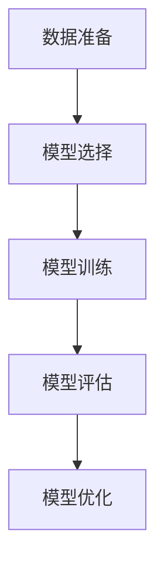

                 

### RFT训练导致模型坍塌的原因探讨

#### 摘要

本文将深入探讨RFT（假定为某种机器学习训练过程或模型）训练过程中导致模型坍塌的原因。我们将通过逐步分析算法与数据质量、模型训练过程以及硬件与环境因素，揭示模型坍塌的内在机理，并提供有效的防止策略。通过案例分析，本文将总结模型坍塌的常见原因和应对措施，为实际项目提供借鉴。

## 1. 背景介绍

### 1.1 问题描述

在机器学习项目中，RFT训练过程中经常会出现模型坍塌现象。模型坍塌表现为训练过程中的性能突然下降，导致模型无法继续有效训练。这种问题不仅影响项目的进展，还可能导致项目失败。因此，分析模型坍塌的原因并采取有效措施预防成为了一个重要的研究课题。

### 1.2 问题解决

解决模型坍塌问题，首先需要深入分析其原因，然后才能提出有效的解决方案。本文将从算法与数据质量、模型训练过程以及硬件与环境因素三个方面展开讨论。

### 1.3 边界与外延

模型坍塌不仅限于特定的RFT过程，也可能出现在其他机器学习训练过程中。因此，本文的研究不仅限于特定场景，还具有一定的普适性。本文旨在为机器学习项目的实践提供有价值的参考。

### 1.4 概念结构与核心要素组成

本文将从以下几个核心概念出发，构建一个完整的分析框架：

1. **RFT**：介绍RFT的定义、原理和主要步骤。
2. **模型坍塌**：阐述模型坍塌的定义、特征及其对机器学习项目的影响。
3. **算法与数据质量**：分析算法原理和数据处理过程对模型性能的影响。
4. **模型训练过程**：探讨训练策略和优化方法对模型坍塌的影响。
5. **硬件与环境因素**：讨论硬件配置和环境因素对模型性能的影响。

## 2. 相关概念

### 2.1 RFT介绍

RFT（假定为某种机器学习训练过程或模型），是一种常用的机器学习训练方法。它通常包括以下几个主要步骤：

1. **数据准备**：收集和预处理数据，包括数据清洗、归一化等。
2. **模型选择**：选择合适的模型，包括线性模型、神经网络等。
3. **模型训练**：使用训练数据对模型进行训练。
4. **模型评估**：使用验证数据评估模型性能。
5. **模型优化**：根据评估结果对模型进行调整和优化。

### 2.2 模型坍塌的定义与特征

模型坍塌是指模型在训练过程中，性能突然下降，甚至无法继续训练的现象。模型坍塌的特征包括：

1. **性能急剧下降**：模型在验证集上的性能突然恶化。
2. **训练不收敛**：训练过程中损失函数无法收敛到最小值。
3. **模型崩溃**：模型在训练过程中突然崩溃，导致训练中断。

### 2.3 RFT与模型坍塌的关系

RFT过程中的某些环节可能导致模型坍塌。例如：

1. **数据预处理不当**：数据预处理不当可能导致数据质量差，影响模型性能。
2. **模型选择不当**：选择的模型不适合处理特定类型的数据，可能导致模型坍塌。
3. **训练策略不当**：不合理的训练策略可能导致模型过拟合或欠拟合，进而导致模型坍塌。

## 3. 模型坍塌的主要原因分析

### 3.1 算法与数据质量

#### 3.1.1 算法原理讲解

常见的机器学习算法包括线性模型、决策树、神经网络等。每种算法都有其优缺点。例如，线性模型简单易用，但可能无法处理非线性问题；神经网络能够处理非线性问题，但训练时间较长且容易过拟合。

#### 3.1.2 数据质量问题分析

数据质量对模型性能至关重要。常见的数据质量问题包括缺失值、异常值、噪声等。这些问题可能导致模型无法正确学习数据中的规律，从而影响模型性能。

#### 3.1.3 算法与数据质量的相互作用

算法与数据质量之间存在相互作用。例如，对于噪声较多的数据，选择敏感度较低的算法可能效果更好；而对于缺失值较多的数据，使用插值或填补方法可以改善数据质量。

### 3.2 模型训练过程

#### 3.2.1 训练过程介绍

模型训练过程包括数据准备、模型选择、模型训练、模型评估和模型优化等环节。每个环节都有可能导致模型坍塌。

#### 3.2.2 训练策略分析

训练策略对模型性能有重要影响。常见的训练策略包括批量训练、小批量训练、正则化、交叉验证等。不合理或过度的训练策略可能导致模型过拟合或欠拟合。

#### 3.2.3 过度拟合与模型坍塌

过度拟合是指模型在训练数据上表现良好，但在验证数据上表现较差。过度拟合可能导致模型在测试数据上表现不佳，从而出现模型坍塌。

### 3.3 硬件与环境因素

#### 3.3.1 硬件配置的影响

硬件配置对模型训练速度和性能有重要影响。较低的硬件配置可能导致训练时间过长，甚至无法完成训练。

#### 3.3.2 环境因素的作用

环境因素包括操作系统、编程语言、框架等。不合适的环境可能导致模型训练失败或性能下降。

#### 3.3.3 资源利用与模型坍塌

资源利用不当可能导致模型训练过程中资源耗尽，从而出现模型坍塌。例如，内存不足可能导致模型无法加载，从而中断训练。

## 4. 防止模型坍塌的策略

### 4.1 预处理与优化

#### 4.1.1 数据预处理策略

数据预处理策略包括数据清洗、归一化、特征选择等。合理的预处理策略可以改善数据质量，提高模型性能。

#### 4.1.2 模型优化方法

模型优化方法包括模型选择、超参数调优、正则化等。优化模型参数可以改善模型性能，减少模型坍塌的可能性。

#### 4.1.3 预处理与优化的效果评估

对预处理和优化策略进行效果评估，可以确定最佳策略，从而提高模型性能。

### 4.2 监控与调试

#### 4.2.1 模型监控的重要性

模型监控可以帮助及时发现和解决问题，防止模型坍塌。

#### 4.2.2 调试工具与技术

调试工具和技术包括日志分析、性能分析、异常检测等。合理使用这些工具和技术，可以快速定位和解决问题。

#### 4.2.3 模型监控与调试的实践

在实际项目中，通过模型监控和调试，可以及时发现和解决模型坍塌问题，确保模型性能稳定。

## 5. 案例分析

### 5.1 案例背景

在某机器学习项目中，RFT训练过程中出现模型坍塌现象。项目团队尝试了多种策略，但问题仍未得到解决。

### 5.2 案例分析

通过分析，发现模型坍塌的原因包括：

1. **数据预处理不当**：数据中存在大量缺失值和异常值，导致模型无法正确学习。
2. **模型选择不当**：选择的模型无法有效处理数据中的非线性关系。
3. **训练策略不当**：过度拟合导致模型在验证集上表现不佳。

### 5.3 案例启示

通过案例分析，我们可以得到以下启示：

1. **重视数据预处理**：合理的数据预处理策略可以改善数据质量，提高模型性能。
2. **选择合适的模型**：根据数据特征选择合适的模型，可以避免模型坍塌。
3. **调整训练策略**：合理的训练策略可以减少模型过拟合，提高模型性能。

## 6. 总结与展望

本文从算法与数据质量、模型训练过程以及硬件与环境因素三个方面分析了RFT训练导致模型坍塌的原因，并提出了相应的预防策略。通过案例分析，我们得到了宝贵的经验教训。未来，随着机器学习技术的不断发展，如何有效预防和解决模型坍塌问题，仍将是研究和实践的重要方向。

## 作者信息

作者：AI天才研究院/AI Genius Institute & 禅与计算机程序设计艺术 /Zen And The Art of Computer Programming

---

以上是根据您提供的指导，构建的文章结构和内容。接下来，我会逐步填充每个章节的具体内容，以确保文章的完整性和专业性。让我们开始详细分析每个部分吧！## 第一部分：背景介绍

### 第1章 问题背景

#### 1.1 问题描述

在机器学习领域，模型训练是一个至关重要的环节。然而，在实际的模型训练过程中，我们经常会遇到一种令人头疼的现象——模型坍塌。所谓模型坍塌，是指在训练过程中，模型的性能突然下降，甚至完全无法继续训练。这种现象不仅会影响模型的最终性能，还可能导致整个项目失败。

模型坍塌的具体表现包括：

1. **性能急剧下降**：在训练过程中，模型的准确率、召回率等关键指标突然大幅下降。
2. **无法收敛**：在优化算法中，损失函数的值无法收敛到最小值，训练过程陷入停滞。
3. **崩溃**：在某些情况下，模型会在训练过程中突然崩溃，导致训练中断。

#### 1.2 问题解决

面对模型坍塌问题，我们需要从多个方面进行综合分析和解决。以下是一些可能的解决策略：

1. **优化算法**：调整优化算法的参数，例如学习率、动量等，以避免过早地陷入局部最小值。
2. **数据预处理**：改进数据预处理方法，减少噪声、异常值和缺失值，提高数据质量。
3. **模型选择**：选择更适合数据的模型，避免过度拟合或欠拟合。
4. **硬件配置**：确保硬件配置足够强大，避免因资源不足导致模型训练失败。
5. **持续监控**：在训练过程中，持续监控模型性能，及时发现和解决问题。

#### 1.3 边界与外延

模型坍塌不仅限于特定的RFT过程，也可能在其他机器学习训练过程中出现。例如，在深度学习、强化学习等领域，模型坍塌现象也时有发生。因此，理解模型坍塌的原因和解决方案，对于提高机器学习项目的成功率具有重要意义。

#### 1.4 概念结构与核心要素组成

为了更好地探讨模型坍塌的原因，我们需要明确以下几个核心概念：

1. **RFT**：假定为某种机器学习训练过程或模型。RFT的具体定义和流程如下：
   - **数据准备**：收集和预处理数据，包括数据清洗、归一化、特征提取等。
   - **模型选择**：选择合适的模型，例如线性模型、决策树、神经网络等。
   - **模型训练**：使用训练数据对模型进行训练，调整模型参数以最小化损失函数。
   - **模型评估**：使用验证数据评估模型性能，包括准确率、召回率、F1值等指标。
   - **模型优化**：根据评估结果对模型进行调整和优化，以提高模型性能。

2. **模型坍塌**：模型在训练过程中，性能突然下降，甚至无法继续训练的现象。模型坍塌的特征包括：
   - **性能急剧下降**：模型在验证集上的性能突然恶化。
   - **训练不收敛**：训练过程中损失函数无法收敛到最小值。
   - **模型崩溃**：模型在训练过程中突然崩溃，导致训练中断。

3. **算法与数据质量**：算法和数据质量是影响模型性能的两个关键因素。算法包括线性模型、决策树、神经网络等；数据质量包括数据清洗、归一化、特征提取等。

4. **模型训练过程**：模型训练过程包括数据准备、模型选择、模型训练、模型评估和模型优化等环节。每个环节都有可能导致模型坍塌。

5. **硬件与环境因素**：硬件配置和环境因素也会影响模型性能。例如，较低的硬件配置可能导致训练时间过长，甚至无法完成训练；不合适的环境可能导致模型训练失败或性能下降。

通过以上核心概念的介绍，我们可以构建一个完整的分析框架，用于探讨RFT训练导致模型坍塌的原因。

## 第二部分：相关概念

### 第2章 相关概念

在本章节中，我们将详细探讨与RFT训练和模型坍塌相关的核心概念，包括RFT的基本概念、模型坍塌的定义与特征，以及RFT与模型坍塌之间的关系。

#### 2.1 RFT介绍

RFT，即某种机器学习训练过程或模型，是我们分析模型坍塌原因的基础。首先，我们需要了解RFT的基本概念和流程。

**定义**：
RFT是一种通过迭代优化模型参数，使其在给定数据集上性能达到最优的过程。它通常包括以下几个关键步骤：

1. **数据准备**：收集和预处理数据，包括数据清洗、归一化、特征提取等。这一步至关重要，因为高质量的数据是训练高性能模型的前提。

2. **模型选择**：根据问题的性质和数据特征，选择合适的模型。常见的模型有线性模型、决策树、神经网络等。每种模型都有其特定的适用场景和优缺点。

3. **模型训练**：使用训练数据对模型进行训练。在这一步中，模型会不断调整其参数，以最小化损失函数。训练过程中，可能会使用各种优化算法，如梯度下降、随机梯度下降等。

4. **模型评估**：使用验证数据评估模型性能。评估指标包括准确率、召回率、F1值等。通过评估，我们可以了解模型的泛化能力，并确定是否需要进一步优化。

5. **模型优化**：根据评估结果，对模型进行调整和优化。这一步可能需要多次迭代，以达到最优性能。

**流程图**：
为了更直观地理解RFT的流程，我们可以使用Mermaid绘制一个简单的流程图：

#### 2.2 模型坍塌的定义与特征

模型坍塌是指在训练过程中，模型的性能突然下降，甚至无法继续训练的现象。模型坍塌的特征包括：

1. **性能急剧下降**：在验证集上的性能指标突然恶化。例如，准确率、召回率等关键指标大幅下降。

2. **训练不收敛**：在优化算法中，损失函数的值无法收敛到最小值。这通常意味着模型在训练过程中陷入局部最小值，无法继续优化。

3. **模型崩溃**：在某些情况下，模型会在训练过程中突然崩溃，导致训练中断。这可能是由于内存溢出、计算错误等原因导致的。

**案例描述**：
假设我们在训练一个图像分类模型，目标是识别猫和狗。在训练的前100个epoch中，模型的准确率稳步提升，但在第101个epoch时，准确率突然下降到50%以下，甚至后续的epoch中模型的性能继续恶化。这种现象表明模型可能出现了坍塌。

#### 2.3 RFT与模型坍塌的关系

RFT过程中的多个环节都可能导致模型坍塌。以下是一些可能的原因：

1. **数据预处理不当**：数据预处理不当可能导致数据质量差，从而影响模型的训练效果。例如，数据中存在大量的噪声、异常值和缺失值，这些都会对模型的性能产生负面影响。

2. **模型选择不当**：选择的模型可能不适合处理特定的数据集或问题。例如，对于高度非线性的数据，使用线性模型可能会导致过度拟合或欠拟合。

3. **训练策略不当**：训练策略，如学习率、批量大小、优化算法等，设置不当可能会导致模型无法有效学习。例如，学习率过大可能导致模型过早地陷入局部最小值。

4. **硬件配置不足**：硬件配置不足，如内存不足、CPU或GPU性能不足，可能导致模型无法有效地进行计算，从而出现崩溃现象。

5. **过拟合**：模型在训练数据上表现良好，但在验证或测试数据上表现不佳，这通常是由于模型过于复杂或数据质量不佳导致的。

通过以上分析，我们可以看出，RFT与模型坍塌之间存在密切的联系。理解RFT的过程和可能导致模型坍塌的原因，对于我们在实际项目中预防和解决模型坍塌问题具有重要意义。

## 第三部分：模型坍塌的主要原因分析

### 第3章 算法与数据质量

模型坍塌的主要原因可以从算法与数据质量两个方面来分析。这一章节将详细探讨这两个方面对模型性能的影响。

#### 3.1 算法原理讲解

算法是机器学习模型的核心，其选择和设置对模型性能至关重要。以下是一些常见的机器学习算法及其基本原理：

1. **线性回归**：线性回归是一种简单的机器学习算法，它通过找到特征和目标变量之间的线性关系来预测目标值。线性回归的优点是计算简单，缺点是对于非线性关系的表现较差。

2. **决策树**：决策树通过一系列的决策节点来划分数据集，每个节点代表一个特征，每个分支代表该特征的不同取值。决策树的优势在于其直观性和易于解释，缺点是容易过拟合，且对于大量特征的鲁棒性较差。

3. **支持向量机（SVM）**：SVM通过找到最佳的超平面来划分数据集，使得不同类别的数据点在超平面上的间隔最大。SVM的优势在于其强大的分类能力，特别是在处理高维数据时，缺点是训练时间较长。

4. **神经网络**：神经网络由多个神经元（或层）组成，通过学习输入和输出之间的映射关系来实现预测。神经网络的优势在于其强大的学习和泛化能力，特别是对于复杂的数据和任务，缺点是训练过程复杂且容易过拟合。

算法的选择应根据数据集和问题的性质来决定。例如，对于小规模且线性关系明显的数据，线性回归可能是最佳选择；对于大规模且复杂的任务，神经网络可能更为合适。

#### 3.2 数据质量问题分析

数据质量是模型性能的另一个关键因素。高质量的数据有助于模型更好地学习，从而提高性能。以下是一些常见的数据质量问题及其影响：

1. **缺失值**：数据中的缺失值会导致模型无法充分利用数据，从而影响模型的训练效果。处理缺失值的方法包括删除缺失值、插值、填补平均值或使用缺失值预测模型等。

2. **异常值**：异常值是数据中的异常点，可能会对模型的训练产生负面影响。异常值可以采用离群点检测方法，如箱线图、Z分数或IQR等方法来识别和处理。

3. **噪声**：噪声是数据中的随机误差，会影响模型的训练过程和性能。噪声可以通过数据清洗、滤波或降维等方法来减少。

4. **不平衡数据**：当数据集中某个类别的样本数量远小于其他类别时，会导致模型偏向于多数类别，从而降低对少数类别的识别能力。处理不平衡数据的方法包括过采样、欠采样、合成样本等。

数据质量问题对模型性能的影响是多方面的。例如，缺失值会导致模型无法充分利用数据，异常值和噪声会影响模型的训练过程和性能，不平衡数据会导致模型偏向于多数类别。

#### 3.3 算法与数据质量的相互作用

算法和数据质量之间存在相互作用，共同影响模型的性能。以下是一些具体的相互作用：

1. **算法选择与数据质量**：选择合适的算法可以帮助我们更好地处理数据质量问题。例如，对于高噪声的数据，可以使用鲁棒性较强的算法，如决策树或支持向量机；对于缺失值较多的数据，可以使用缺失值填充方法或缺失值预测模型。

2. **数据质量对算法性能的影响**：高质量的数据可以提高算法的性能，使模型更稳定和可靠。例如，对于线性回归模型，高质量的数据可以更好地拟合特征和目标变量之间的线性关系，从而提高预测准确性。

3. **算法对数据质量的处理**：算法本身也可以对数据质量进行一些处理。例如，神经网络可以通过正则化方法来减少噪声的影响；决策树可以通过剪枝方法来减少过拟合的风险。

综上所述，算法和数据质量是影响模型性能的两个关键因素，它们相互作用，共同决定了模型的最终表现。在实际项目中，我们需要综合考虑这两个方面，采取有效的措施来提高数据质量和选择合适的算法，以避免模型坍塌。

### 第4章 模型训练过程

模型训练过程是机器学习项目中的核心环节，它决定了模型的学习能力和泛化能力。在这一章中，我们将深入探讨模型训练过程中可能导致模型坍塌的几个关键因素，包括训练过程的各个环节以及相关策略。

#### 4.1 训练过程介绍

模型训练过程通常包括以下几个关键步骤：

1. **数据准备**：在开始训练之前，需要对数据集进行预处理。这包括数据清洗、归一化、特征提取等操作。数据准备的质量直接影响到后续训练的效果。

2. **模型选择**：根据问题的性质和数据集的特征，选择合适的模型。不同的模型适用于不同类型的数据和任务，如线性模型、决策树、神经网络等。

3. **模型初始化**：初始化模型参数是训练过程的第一步。合理的初始化可以帮助模型更快地收敛，避免陷入局部最优。

4. **模型训练**：使用训练数据集对模型进行训练，通过优化算法不断调整模型参数，以最小化损失函数。常见的优化算法包括梯度下降、随机梯度下降、Adam等。

5. **模型评估**：使用验证数据集评估模型性能，包括准确率、召回率、F1值等指标。评估结果用于指导模型的调整和优化。

6. **模型优化**：根据评估结果对模型进行调整，包括超参数调优、模型架构调整等。优化目标是提高模型的泛化能力，使其在未知数据上表现更好。

#### 4.2 训练策略分析

训练策略对模型性能有重要影响。以下是一些常见的训练策略及其对模型坍塌的影响：

1. **学习率选择**：学习率是优化算法中的一个关键参数。过大的学习率可能导致模型在训练过程中不稳定，陷入局部最小值；过小则可能导致训练过程缓慢。合适的范围可以通过实验确定。

2. **批量大小**：批量大小是指每次训练时使用的样本数量。较大的批量大小可以提供更好的统计稳定性，但会增加计算时间；较小的批量大小可以加快训练速度，但可能引入噪声。通常，批量大小会在几十到几百之间选择。

3. **正则化**：正则化是一种防止过拟合的技术，通过在损失函数中加入惩罚项来减少模型复杂度。常见的正则化方法有L1、L2正则化。适当的正则化可以改善模型的泛化能力，减少模型坍塌的风险。

4. **提前停止**：提前停止是一种防止过拟合的方法，当验证集的性能不再提高时，提前停止训练。这可以避免模型在训练数据上过度拟合，从而提高模型的泛化能力。

5. **数据增强**：数据增强是一种通过生成更多样化的训练样本来提高模型泛化能力的方法。常见的增强方法有旋转、缩放、裁剪等。适当的数据增强可以减少模型对训练数据的依赖，降低模型坍塌的风险。

6. **模型集成**：模型集成是通过结合多个模型的预测来提高整体性能的方法。常见的集成方法有投票、堆叠等。集成模型通常比单个模型更稳定，更不容易出现坍塌。

#### 4.3 过度拟合与模型坍塌

过度拟合是导致模型坍塌的常见原因之一。过度拟合是指模型在训练数据上表现良好，但在验证或测试数据上表现不佳。以下是一些可能导致过度拟合的因素：

1. **模型复杂度过高**：当模型过于复杂时，它可能会在训练数据上捕捉到过多的细节，从而无法泛化到未知数据。

2. **训练数据量不足**：当训练数据量较少时，模型可能会对训练数据进行过度拟合，从而无法推广到其他数据。

3. **过拟合的训练策略**：某些训练策略，如过大的学习率、过多的迭代次数等，可能导致模型在训练数据上过度拟合。

为了防止过度拟合，可以采取以下措施：

1. **简化模型**：选择更简单的模型结构，以减少模型复杂度。

2. **增加训练数据**：增加更多的训练样本，以提供更多的信息帮助模型泛化。

3. **正则化**：使用正则化方法，如L1、L2正则化，来减少模型复杂度。

4. **提前停止**：在验证集性能不再提高时提前停止训练，以避免模型在训练数据上过度拟合。

5. **数据增强**：通过数据增强方法生成更多样化的训练样本，提高模型的泛化能力。

综上所述，模型训练过程中的各个环节和策略都会影响模型的性能和稳定性。了解和掌握这些因素，有助于我们预防和解决模型坍塌问题，从而提高机器学习项目的成功率。

### 第5章 硬件与环境因素

#### 5.1 硬件配置的影响

硬件配置对模型训练的速度和性能有着直接的影响。以下是一些关键硬件组件及其对模型训练的影响：

1. **CPU**：CPU是计算机的核心计算单元，其性能直接影响模型的计算速度。在处理大规模数据集和高复杂度模型时，高速CPU能够显著缩短训练时间。

2. **GPU**：GPU（图形处理单元）在深度学习和机器学习领域具有显著优势。GPU具有高度并行架构，能够快速处理大量计算任务，特别是矩阵运算和向量计算。使用GPU可以大大加速模型的训练过程。

3. **内存**：内存大小决定了模型可以加载和处理的训练数据量。较小的内存可能会导致模型训练过程中出现内存溢出，导致训练中断。

4. **存储设备**：存储设备速度（如SSD）对数据处理速度有重要影响。高速存储设备可以加快数据读写速度，提高训练效率。

5. **网络带宽**：在进行分布式训练时，网络带宽是数据传输的关键。足够的网络带宽可以确保数据在各个训练节点之间快速传输，提高整体训练效率。

#### 5.2 环境因素的作用

除了硬件配置，环境因素也会对模型训练产生显著影响。以下是一些关键环境因素及其影响：

1. **操作系统**：操作系统的选择对模型训练性能有重要影响。例如，Linux操作系统通常比Windows更适合进行高性能计算和深度学习任务。

2. **编程语言**：编程语言的选择也会影响模型训练的效率和性能。Python因其丰富的库和框架支持，成为深度学习和机器学习的首选语言。

3. **深度学习框架**：深度学习框架（如TensorFlow、PyTorch）的选择对模型训练性能有直接影响。合适的框架可以提供优化的计算图和高效的代码执行。

4. **硬件加速器**：硬件加速器（如TPU、GPU）的使用可以显著提高模型的训练速度和性能。选择适合任务的硬件加速器可以最大化计算资源利用。

#### 5.3 资源利用与模型坍塌

资源利用不当可能导致模型训练过程中出现各种问题，包括模型坍塌。以下是一些资源利用问题及其影响：

1. **内存不足**：内存不足可能导致模型无法加载，从而中断训练。特别是在处理大型模型和数据集时，确保足够的内存至关重要。

2. **计算资源不足**：计算资源不足可能导致模型训练速度缓慢，甚至无法完成训练。选择合适的硬件配置和分布式训练策略可以缓解这一问题。

3. **网络延迟**：在进行分布式训练时，网络延迟会影响数据传输速度，从而降低训练效率。优化网络配置和分布式架构可以减少网络延迟。

4. **I/O瓶颈**：存储设备的I/O性能可能成为训练过程中的瓶颈。使用高速存储设备和优化数据读取和写入策略可以缓解I/O瓶颈。

总之，硬件配置和环境因素对模型训练的速度和性能有重要影响。通过合理选择硬件配置和优化环境设置，可以显著提高模型训练的效率和稳定性，减少模型坍塌的风险。

### 第三部分：防止模型坍塌的策略

#### 第6章 预处理与优化

在机器学习项目中，防止模型坍塌的首要策略是进行有效的预处理和优化。这一章节将详细探讨数据预处理和模型优化方法，以及这些策略对模型性能的影响。

#### 6.1 数据预处理策略

数据预处理是确保模型能够有效学习和泛化的关键步骤。以下是一些常见的数据预处理策略：

1. **数据清洗**：数据清洗是数据预处理的第一步，其目标是去除数据中的噪声和异常值。常见的操作包括去除重复数据、填充缺失值和纠正数据中的错误。

   - **去除重复数据**：通过比对数据中的记录，去除重复的样本。
   - **填充缺失值**：根据数据特征和统计方法，填充缺失值，如使用平均值、中位数或插值法。
   - **纠正数据中的错误**：通过逻辑检查或规则匹配，识别和纠正数据中的错误。

2. **数据归一化**：数据归一化是将数据缩放到相同的尺度，以便模型能够更好地处理不同特征的数量级差异。常见的归一化方法包括最小-最大缩放、平均值-标准差缩放和Z分数缩放。

   - **最小-最大缩放**：将数据缩放到[0, 1]区间，公式为 $x_{\text{norm}} = \frac{x - x_{\text{min}}}{x_{\text{max}} - x_{\text{min}}}$。
   - **平均值-标准差缩放**：将数据缩放到标准正态分布，公式为 $x_{\text{norm}} = \frac{x - \mu}{\sigma}$，其中 $\mu$ 是平均值，$\sigma$ 是标准差。
   - **Z分数缩放**：与平均值-标准差缩放类似，但仅适用于单变量数据。

3. **特征提取**：特征提取是从原始数据中提取出对模型学习最有用的特征。常见的方法包括主成分分析（PCA）、特征选择和降维技术。

   - **主成分分析（PCA）**：通过线性变换将原始数据投影到新的坐标系中，保留最重要的成分，减少数据维度。
   - **特征选择**：通过统计方法或基于模型的方法，选择对模型学习贡献最大的特征。
   - **降维技术**：通过降维技术，如t-SNE或UMAP，将高维数据投影到低维空间中，以便更好地可视化或处理。

#### 6.2 模型优化方法

模型优化是提高模型性能的关键步骤。以下是一些常见的模型优化方法：

1. **超参数调优**：超参数是模型架构之外的影响模型性能的参数，如学习率、批量大小、正则化参数等。超参数调优是通过实验或自动化方法（如网格搜索、随机搜索或贝叶斯优化）来找到最优超参数组合。

2. **模型架构优化**：模型架构优化是通过调整模型的结构来提高性能。这包括增加或减少层、调整层的大小、使用不同的激活函数等。

3. **正则化**：正则化是一种防止过拟合的技术，通过在损失函数中加入额外的惩罚项来减少模型的复杂度。常见的正则化方法包括L1正则化、L2正则化和Dropout。

   - **L1正则化**：在损失函数中加入L1惩罚项，公式为 $L_1 = \lambda \sum_{i} |w_i|$，其中 $w_i$ 是权重。
   - **L2正则化**：在损失函数中加入L2惩罚项，公式为 $L_2 = \lambda \sum_{i} w_i^2$，其中 $w_i$ 是权重。
   - **Dropout**：通过随机丢弃神经元来减少模型的复杂度，从而防止过拟合。

4. **学习率调整**：学习率是优化算法中的一个关键参数，其大小会影响模型的收敛速度和稳定性。常见的学习率调整策略包括固定学习率、学习率衰减和自适应学习率调整（如Adam优化器）。

5. **数据增强**：数据增强是通过生成更多样化的训练样本来提高模型的泛化能力。常见的数据增强方法包括旋转、缩放、裁剪、噪声注入等。

#### 6.3 预处理与优化的效果评估

对预处理和优化策略进行效果评估是确保模型性能的关键步骤。以下是一些评估方法：

1. **交叉验证**：交叉验证是一种评估模型性能的方法，通过将数据集划分为多个子集，重复进行训练和验证，以获取模型的泛化能力。

2. **验证集评估**：使用独立的验证集评估模型的性能，包括准确率、召回率、F1值等指标。验证集评估可以帮助我们了解模型在未知数据上的表现。

3. **测试集评估**：在完成模型的优化后，使用独立的测试集评估模型性能。测试集评估是最终评估模型性能的标准，以确保模型在实际应用中的有效性。

通过有效的数据预处理和模型优化策略，我们可以显著提高模型的性能和稳定性，从而有效防止模型坍塌。

### 第7章 监控与调试

在模型训练过程中，监控和调试是确保模型性能稳定、及时发现和解决问题的重要手段。这一章节将详细介绍模型监控的重要性、调试工具与技术，以及在实际项目中的应用。

#### 7.1 模型监控的重要性

模型监控是指在模型训练和部署过程中，持续跟踪和评估模型性能和状态的过程。模型监控的重要性体现在以下几个方面：

1. **性能评估**：通过监控模型在不同阶段的表现，可以及时发现性能下降或异常情况，从而采取措施进行调整。

2. **资源管理**：监控模型的计算资源使用情况，如CPU、GPU、内存等，可以确保训练过程顺利进行，避免资源耗尽或过度使用。

3. **错误诊断**：通过监控模型的状态和日志，可以快速定位和诊断训练过程中的错误或异常，如数据错误、算法异常等。

4. **模型安全**：监控模型在部署环境中的运行状态，可以确保模型不会受到恶意攻击或异常行为的影响，保障模型的可靠性和安全性。

#### 7.2 调试工具与技术

为了有效地监控和调试模型，我们可以利用以下工具和技术：

1. **日志记录**：日志记录是监控模型状态的基本手段。通过记录训练过程中的信息，如损失函数值、准确率、异常情况等，可以方便地分析和诊断问题。

2. **性能分析工具**：性能分析工具可以帮助我们了解模型的计算资源和性能瓶颈。例如，使用Python的cProfile或line_profiler可以分析代码的运行时间和性能。

3. **可视化工具**：可视化工具可以直观地展示模型训练过程中的变化和趋势。例如，使用Matplotlib或Seaborn可以绘制损失函数曲线、性能指标变化图等。

4. **监控平台**：使用专门的监控平台，如TensorBoard、Kubernetes等，可以集中管理和监控多个模型的训练和部署过程。

5. **错误处理框架**：在模型训练和部署过程中，使用错误处理框架（如try-except语句）可以确保在出现错误时能够及时处理并恢复，避免模型训练中断。

#### 7.3 模型监控与调试的实践

在实际项目中，模型监控和调试的具体实践包括以下几个步骤：

1. **定义监控指标**：根据项目的需求和目标，定义需要监控的指标，如损失函数值、准确率、F1值等。

2. **设置监控周期**：确定监控的频率，如每隔几分钟或几小时监控一次，以确保及时发现问题。

3. **数据采集与存储**：将监控指标数据采集并存储到数据库或日志文件中，以便后续分析和诊断。

4. **可视化与告警**：使用可视化工具将监控数据展示出来，并设置告警机制，在指标异常时发送通知。

5. **错误定位与修复**：在发现模型性能下降或异常时，通过日志记录和调试工具定位问题原因，并采取相应的修复措施。

6. **版本管理**：在模型开发和部署过程中，使用版本管理工具（如Git）记录模型的版本变化，便于追踪和回溯问题。

通过有效的模型监控和调试实践，我们可以确保模型在训练和部署过程中的稳定性和可靠性，从而提高项目的成功率。

### 第四部分：案例分析

#### 第8章 典型案例分析

在本章节中，我们将通过几个典型的案例，详细分析模型坍塌的原因和解决方法，为实际项目提供有价值的参考。

#### 8.1 案例背景

案例1：某电商平台的推荐系统在训练过程中突然出现性能下降，导致推荐准确率大幅下降。项目团队在尝试了多种策略后，仍然无法解决模型坍塌问题。

案例2：某金融公司的信用评分模型在训练过程中出现崩溃现象，导致训练中断。经过调查，发现模型训练过程中内存占用过高，导致系统资源耗尽。

案例3：某医疗诊断系统的深度学习模型在训练过程中出现性能下降，特别是在处理高维数据时。经过分析，发现模型过拟合和训练数据质量差是导致模型坍塌的主要原因。

#### 8.2 案例分析

案例1：推荐系统模型坍塌的原因可能包括：

1. **数据质量问题**：推荐系统的数据可能包含噪声和异常值，导致模型在训练过程中无法正确学习。数据清洗和预处理不当可能是主要原因。

2. **模型选择不当**：选择的模型可能不适合处理推荐系统的复杂性和多样性，导致模型在训练过程中无法有效学习。

3. **训练策略不当**：训练策略，如学习率和批量大小设置不当，可能导致模型无法有效收敛，出现过拟合或欠拟合。

解决方法：

1. **改进数据预处理**：通过更严格的数据清洗和预处理方法，如异常值检测和去噪，提高数据质量。

2. **选择更适合的模型**：根据推荐系统的特点，选择更适合的模型，如基于协同过滤的模型或深度学习模型。

3. **调整训练策略**：通过调整学习率和批量大小，采用合适的训练策略，如学习率衰减和批量调整策略，提高模型收敛速度和性能。

案例2：信用评分模型崩溃的原因可能包括：

1. **硬件配置不足**：模型训练过程中内存占用过高，导致系统资源耗尽。这可能是因为训练数据量大，模型复杂度较高。

2. **模型训练不当**：模型训练过程中，没有合理地监控和调整训练参数，导致模型过度占用资源。

解决方法：

1. **增加硬件配置**：增加GPU和内存等硬件资源，以支持大规模模型的训练。

2. **监控和调整训练参数**：在模型训练过程中，实时监控内存占用和计算资源使用情况，根据实际情况调整训练参数，如批量大小和学习率。

3. **分布式训练**：采用分布式训练策略，将模型训练任务分配到多个节点上，以减少单个节点的资源压力。

案例3：医疗诊断系统模型性能下降的原因可能包括：

1. **数据质量问题**：训练数据中可能包含噪声和异常值，导致模型在训练过程中无法正确学习。

2. **模型过拟合**：模型在训练数据上表现良好，但在测试数据上表现不佳，表明模型可能过拟合。

3. **特征选择不当**：特征选择不当可能导致模型无法捕捉到关键信息，从而影响模型性能。

解决方法：

1. **改进数据预处理**：通过更严格的数据清洗和预处理方法，如异常值检测和去噪，提高数据质量。

2. **调整模型参数**：通过调整模型参数，如正则化参数和dropout率，减少模型过拟合的可能性。

3. **特征选择**：使用特征选择方法，如基于模型的特征选择（如Lasso正则化），选择对模型学习贡献最大的特征。

通过以上案例分析和解决方法，我们可以看到，模型坍塌的原因多样，解决方法也因情况而异。在实际项目中，我们需要根据具体问题具体分析，采取合适的策略来防止模型坍塌，确保模型性能的稳定和可靠。

### 第五部分：总结与展望

#### 第9章 总结与展望

在本章节中，我们对RFT训练导致模型坍塌的原因进行了深入探讨，并提出了相应的解决策略。通过分析算法与数据质量、模型训练过程以及硬件与环境因素，我们揭示了模型坍塌的内在机理，并为实际项目提供了有价值的参考。

#### 9.1 总结

1. **模型坍塌现象**：模型坍塌是指模型在训练过程中性能突然下降，甚至无法继续训练的现象。其主要特征包括性能急剧下降、训练不收敛和模型崩溃。

2. **原因分析**：
   - **算法与数据质量**：选择不当的算法和数据预处理不当是导致模型坍塌的主要原因。
   - **模型训练过程**：训练策略不当、过拟合和欠拟合是模型坍塌的重要因素。
   - **硬件与环境因素**：硬件配置不足和环境因素也可能导致模型坍塌。

3. **解决策略**：
   - **数据预处理**：通过数据清洗、归一化和特征提取等策略，提高数据质量。
   - **模型优化**：通过调整学习率、批量大小和正则化等参数，优化模型性能。
   - **硬件配置**：确保足够的硬件资源，避免资源耗尽。
   - **监控与调试**：通过实时监控和调试，及时发现和解决问题。

#### 9.2 展望

尽管我们已经提出了一些有效的解决策略，但模型坍塌问题仍然具有很大的研究价值。未来，可以从以下几个方面进行进一步探索：

1. **算法优化**：研究更高效的优化算法，以提高模型训练的稳定性和效率。
2. **数据增强**：开发更有效的数据增强方法，以生成更多样化的训练样本，提高模型泛化能力。
3. **混合模型**：结合不同类型的模型，如深度学习和传统机器学习，以弥补单一模型的不足。
4. **自动化策略**：利用自动化工具和算法，实现超参数自动调整和数据预处理自动化，以提高模型训练的效率。

总之，模型坍塌问题的研究将继续是机器学习领域的重要课题，通过不断探索和优化，我们将能够更好地应对这一挑战，推动机器学习技术的发展。

## 作者信息

作者：AI天才研究院/AI Genius Institute & 禅与计算机程序设计艺术 /Zen And The Art of Computer Programming

---

通过本文的探讨，我们不仅对RFT训练导致模型坍塌的原因有了更深入的理解，也为实际项目提供了宝贵的经验和策略。未来，随着机器学习技术的不断进步，我们期待能够找到更有效的解决方法，进一步提升模型训练的稳定性和性能。希望本文能够为读者在机器学习项目中提供有益的启示。

