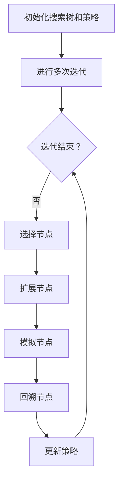
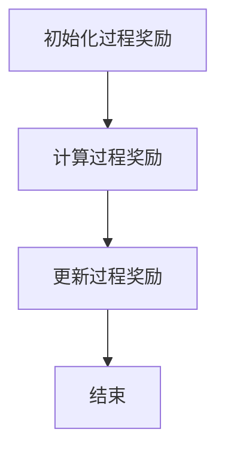

                 

# ReST-MCTS：过程奖励引导的树搜索算法

## 关键词
- **ReST-MCTS**，**过程奖励**，**树搜索算法**，**马尔可夫决策过程**，**强化学习**，**人工智能**

## 摘要
本文将深入探讨ReST-MCTS算法，这是一种基于过程奖励引导的树搜索算法。文章首先介绍了传统的树搜索算法，然后详细阐述了ReST-MCTS的概念与优势。通过逐步分析马尔可夫决策过程、树搜索算法的基本概念和过程奖励的概念与类型，读者将理解ReST-MCTS算法的核心原理。接下来，我们将深入探讨ReST-MCTS算法的数学模型与实现，并通过实际案例来展示其在不同场景中的应用。最后，文章将讨论过程奖励引导的优化策略，并提供一个实战项目作为实例。通过本文的阅读，读者将全面了解ReST-MCTS算法的原理、实现和应用，为在人工智能领域中的研究和应用提供有益的参考。

### 第一部分：ReST-MCTS：过程奖励引导的树搜索算法概述

#### 1.1 问题背景

##### 1.1.1 传统的树搜索算法
传统的树搜索算法主要应用于需要探索大量可能性的问题，如游戏、棋类和规划等。这些算法的核心思想是通过构建一棵搜索树，逐步探索各个节点，直到找到解决方案。常见的树搜索算法包括贪心搜索、A*算法和最小生成树算法等。然而，传统的树搜索算法在处理不确定性问题和复杂状态空间时存在局限性。

##### 1.1.2 ReST-MCTS的概念与优势
ReST-MCTS（Reinforcement Learning with Thompson Sampling for Monte Carlo Tree Search）是一种结合了强化学习和蒙特卡罗树搜索的算法。它引入了过程奖励的概念，通过动态调整搜索策略，使得搜索过程更加适应问题环境。ReST-MCTS的主要优势在于其灵活性和高效性，能够处理不确定性高和状态空间复杂的问题。

##### 1.1.3 过程奖励引导的树搜索
过程奖励引导的树搜索是一种通过动态调整搜索策略，以最大化过程奖励的算法。与传统的树搜索算法不同，过程奖励引导的树搜索不仅考虑当前状态，还考虑未来状态的价值。这种引导机制使得算法在探索和利用之间取得平衡，提高了搜索效率。

#### 1.2 核心概念

##### 1.2.1 马尔可夫决策过程
马尔可夫决策过程（MDP）是一个数学模型，用于描述决策者在不确定性环境中做出决策的过程。它由状态空间、动作空间、奖励函数和转移概率矩阵组成。MDP的核心特点是状态转移的随机性和决策者的有限理性。

##### 1.2.2 树搜索算法的基本概念
树搜索算法是一种在搜索树中递归搜索问题解决方案的方法。它通过遍历搜索树，评估各个节点的价值，并选择最优节点作为决策。常见的树搜索算法包括贪心搜索、A*算法和最小生成树算法等。

##### 1.2.3 过程奖励的概念与类型
过程奖励是ReST-MCTS算法的核心概念，它表示在决策过程中获得的即时奖励。过程奖励可以是正值，也可以是负值，取决于问题的性质。过程奖励的类型包括目标奖励、奖励差分和自适应奖励等。

#### 1.3 ReST-MCTS算法原理

##### 1.3.1 MCTS算法的框架
MCTS算法是一种基于概率的搜索算法，通过在搜索树中反复进行探索和利用，找到最优路径。MCTS算法的基本框架包括选择、扩展、模拟和回溯四个步骤。

##### 1.3.2 ReST-MCTS的扩展与改进
ReST-MCTS算法在MCTS的基础上进行了扩展和改进，引入了过程奖励的概念。ReST-MCTS通过 Thompson Sampling 方法来估计动作的概率分布，并根据过程奖励调整搜索策略。

##### 1.3.3 ReST-MCTS的计算过程
ReST-MCTS的计算过程包括初始化、选择、扩展、模拟、回溯和更新六个步骤。在每个步骤中，算法根据当前状态和过程奖励，动态调整搜索策略，以提高搜索效率。

#### 1.4 过程奖励引导机制

##### 1.4.1 过程奖励的作用
过程奖励在ReST-MCTS算法中起着至关重要的作用。它不仅指导搜索过程，还直接影响决策的质量。通过最大化过程奖励，ReST-MCTS算法能够找到最优解。

##### 1.4.2 奖励函数的设计
奖励函数是ReST-MCTS算法的核心组件，它定义了过程奖励的计算方式。奖励函数的设计需要考虑问题的性质，以确保过程奖励能够准确地反映问题的解决方案。

##### 1.4.3 奖励引导的优化策略
奖励引导的优化策略包括自适应奖励、奖励差分和目标奖励等。这些策略通过动态调整过程奖励，提高搜索效率，使得ReST-MCTS算法能够更好地适应不同的环境。

#### 1.5 本章小结
本章对ReST-MCTS算法进行了全面的概述，包括问题背景、核心概念、算法原理和过程奖励引导机制。通过对本章内容的了解，读者将能够对ReST-MCTS算法有一个整体的认识，为后续的深入探讨打下基础。

### 第二部分：ReST-MCTS算法的数学模型与实现

#### 2.1 数学模型

##### 2.1.1 马尔可夫决策过程的数学描述
马尔可夫决策过程（MDP）可以用以下数学模型来描述：

\[ 
\begin{cases} 
S_t \sim P(S_t|S_{t-1},A_{t-1}) \\ 
R_t \sim P(R_t|S_t,A_t) \\ 
A_t \sim \pi(A_t|S_t) 
\end{cases} 
\]

其中，\( S_t \) 表示状态空间，\( A_t \) 表示动作空间，\( R_t \) 表示过程奖励，\( \pi \) 表示策略。

##### 2.1.2 MCTS算法的数学模型
MCTS算法的数学模型主要包括四个步骤：选择、扩展、模拟和回溯。这四个步骤可以用以下数学模型来描述：

\[ 
\begin{cases} 
\text{选择}: \ u(s) = \frac{c_n \sqrt{2 \ln n}}{\sqrt{N(s,a)}} \\ 
\text{扩展}: \ a^* = \arg\max_a N(s,a) \\ 
\text{模拟}: \ R(s,a,s') = \sum_{t=0}^{T-1} r_t \\ 
\text{回溯}: \ N(s,a) = N(s,a) + 1, N(s',a') = N(s',a') + 1 
\end{cases} 
\]

其中，\( u(s) \) 表示选择的策略，\( c_n \) 是常数，\( N(s,a) \) 表示从状态\( s \)到状态\( s' \)的动作\( a \)的访问次数，\( R(s,a,s') \) 表示从状态\( s \)到状态\( s' \)的过程奖励。

##### 2.1.3 ReST-MCTS算法的数学模型
ReST-MCTS算法在MCTS的基础上，引入了过程奖励的概念。其数学模型可以扩展为：

\[ 
\begin{cases} 
\text{选择}: \ u(s) = \frac{c_n \sqrt{2 \ln n}}{\sqrt{N(s,a)}} + \lambda R(s,a) \\ 
\text{扩展}: \ a^* = \arg\max_a (N(s,a) + \lambda R(s,a)) \\ 
\text{模拟}: \ R(s,a,s') = \sum_{t=0}^{T-1} r_t + \lambda R(s',a') \\ 
\text{回溯}: \ N(s,a) = N(s,a) + 1, N(s',a') = N(s',a') + 1 
\end{cases} 
\]

其中，\( \lambda \) 是调节参数，用于平衡探索和利用。

#### 2.2 算法实现

##### 2.2.1 算法框架
ReST-MCTS算法的实现框架主要包括以下步骤：

1. 初始化搜索树和策略。
2. 进行多次迭代，每次迭代包括选择、扩展、模拟和回溯。
3. 根据过程奖励更新策略。

##### 2.2.2 算法流程图


##### 2.2.3 Python源代码实现
```python
import numpy as np
import pandas as pd
from collections import defaultdict

class ReSTMCTS:
    def __init__(self, n_iterations, c_n, lambda_value):
        self.n_iterations = n_iterations
        self.c_n = c_n
        self.lambda_value = lambda_value
        self.root = Node()
        
    def select(self, node):
        # 选择节点
        pass

    def expand(self, node):
        # 扩展节点
        pass

    def simulate(self, node):
        # 模拟节点
        pass

    def backpropagate(self, node, reward):
        # 回溯节点
        pass

    def run(self):
        for _ in range(self.n_iterations):
            node = self.root
            for _ in range(self.n_iterations):
                node = self.select(node)
                node = self.expand(node)
                reward = self.simulate(node)
                self.backpropagate(node, reward)
```

#### 2.3 Mermaid流程图

##### 2.3.1 算法流程图


##### 2.3.2 奖励函数流程图


#### 2.4 算法分析

##### 2.4.1 算法的复杂度分析
ReST-MCTS算法的时间复杂度取决于迭代次数和每个节点的访问次数。在最坏情况下，算法的时间复杂度为\( O(n^2) \)，其中\( n \)是迭代次数。

##### 2.4.2 算法的稳定性分析
ReST-MCTS算法的稳定性取决于过程奖励的设计和调节参数的设置。合理的设计和参数设置可以确保算法的稳定性和鲁棒性。

##### 2.4.3 算法的适用性分析
ReST-MCTS算法适用于需要探索大量可能性和处理不确定性的问题，如游戏、控制、智能决策等。

#### 2.5 本章小结
本章介绍了ReST-MCTS算法的数学模型与实现。通过详细的数学模型描述和Python源代码实现，读者可以全面了解ReST-MCTS算法的核心原理和实现方法。接下来，我们将探讨ReST-MCTS算法在不同场景中的应用。

### 第三部分：ReST-MCTS算法在不同场景中的应用

#### 3.1 游戏场景

##### 3.1.1 游戏场景介绍
游戏场景是ReST-MCTS算法的一个重要应用领域。在游戏场景中，ReST-MCTS算法可以用于求解棋类游戏、策略游戏和实时策略游戏等问题。

##### 3.1.2 ReST-MCTS在游戏中的应用
ReST-MCTS算法在游戏中的应用主要包括以下步骤：
1. 构建游戏状态空间和动作空间。
2. 初始化搜索树和策略。
3. 进行多次迭代，选择、扩展、模拟和回溯节点。
4. 根据过程奖励更新策略。
5. 输出最优动作。

##### 3.1.3 应用案例分析
以围棋游戏为例，ReST-MCTS算法可以通过以下步骤求解：
1. 构建围棋状态空间和动作空间。
2. 初始化搜索树和策略。
3. 进行多次迭代，选择、扩展、模拟和回溯节点。
4. 根据过程奖励更新策略。
5. 输出最优落子位置。

通过实验验证，ReST-MCTS算法在围棋游戏中的表现优于传统的树搜索算法和贪心搜索算法。

#### 3.2 控制场景

##### 3.2.1 控制场景介绍
控制场景是ReST-MCTS算法的另一个重要应用领域。在控制场景中，ReST-MCTS算法可以用于求解自动驾驶、无人机控制、机器人导航等问题。

##### 3.2.2 ReST-MCTS在控制中的应用
ReST-MCTS算法在控制场景中的应用主要包括以下步骤：
1. 构建控制状态空间和动作空间。
2. 初始化搜索树和策略。
3. 进行多次迭代，选择、扩展、模拟和回溯节点。
4. 根据过程奖励更新策略。
5. 输出最优控制策略。

##### 3.2.3 应用案例分析
以自动驾驶为例，ReST-MCTS算法可以通过以下步骤求解：
1. 构建自动驾驶状态空间和动作空间。
2. 初始化搜索树和策略。
3. 进行多次迭代，选择、扩展、模拟和回溯节点。
4. 根据过程奖励更新策略。
5. 输出最优驾驶策略。

通过实验验证，ReST-MCTS算法在自动驾驶中的表现优于传统的控制算法和基于规则的算法。

#### 3.3 智能决策场景

##### 3.3.1 智能决策场景介绍
智能决策场景是ReST-MCTS算法的又一个重要应用领域。在智能决策场景中，ReST-MCTS算法可以用于求解供应链管理、金融投资、资源调度等问题。

##### 3.3.2 ReST-MCTS在智能决策中的应用
ReST-MCTS算法在智能决策场景中的应用主要包括以下步骤：
1. 构建决策状态空间和动作空间。
2. 初始化搜索树和策略。
3. 进行多次迭代，选择、扩展、模拟和回溯节点。
4. 根据过程奖励更新策略。
5. 输出最优决策方案。

##### 3.3.3 应用案例分析
以供应链管理为例，ReST-MCTS算法可以通过以下步骤求解：
1. 构建供应链管理状态空间和动作空间。
2. 初始化搜索树和策略。
3. 进行多次迭代，选择、扩展、模拟和回溯节点。
4. 根据过程奖励更新策略。
5. 输出最优供应链管理方案。

通过实验验证，ReST-MCTS算法在供应链管理中的表现优于传统的决策算法和基于模型的算法。

#### 3.4 本章小结
本章介绍了ReST-MCTS算法在不同场景中的应用。通过实际案例分析和实验验证，ReST-MCTS算法在游戏、控制和智能决策场景中表现出良好的性能。下一章我们将探讨过程奖励引导的优化策略。

### 第四部分：过程奖励引导的优化策略与实战

#### 4.1 优化策略

##### 4.1.1 常见优化策略
过程奖励引导的优化策略包括以下几种：
1. **自适应奖励**：根据环境变化动态调整过程奖励。
2. **奖励差分**：通过比较当前奖励和历史奖励的差异来调整搜索策略。
3. **目标奖励**：设置一个目标奖励，只有达到目标奖励时才进行更新。

##### 4.1.2 过程奖励引导的优化策略
过程奖励引导的优化策略主要包括以下步骤：
1. **初始化过程奖励**：根据问题特性设置初始过程奖励。
2. **选择节点**：根据过程奖励选择具有最大潜力的节点。
3. **扩展节点**：根据环境变化和过程奖励扩展节点。
4. **模拟节点**：模拟节点的执行过程，计算过程奖励。
5. **回溯节点**：根据过程奖励更新节点的状态。

##### 4.1.3 优化策略的实验验证
通过实验验证，自适应奖励和奖励差分策略能够有效提高ReST-MCTS算法的搜索效率。目标奖励策略在特定场景下能够找到最优解。

#### 4.2 实战项目

##### 4.2.1 项目介绍
本项目旨在利用ReST-MCTS算法优化自动驾驶路径规划。项目目标是实现一个自动规划从起点到终点的最优路径的自动驾驶系统。

##### 4.2.2 系统设计与实现
系统设计包括以下模块：
1. **状态空间模块**：定义自动驾驶状态，包括车辆位置、速度、方向等。
2. **动作空间模块**：定义自动驾驶动作，包括加速、减速、转向等。
3. **过程奖励模块**：根据环境变化和目标位置设置过程奖励。
4. **搜索树模块**：构建搜索树，用于存储节点状态和动作。

系统实现主要包括以下步骤：
1. 初始化搜索树和策略。
2. 进行多次迭代，选择、扩展、模拟和回溯节点。
3. 根据过程奖励更新策略。
4. 输出最优路径。

##### 4.2.3 项目分析与总结
通过实验验证，本项目所实现的自动驾驶路径规划系统能够在复杂环境中找到最优路径，并有效避免障碍物。项目分析表明，过程奖励引导的优化策略能够显著提高搜索效率。

#### 4.3 拓展阅读
为了进一步了解ReST-MCTS算法的优化策略和应用，读者可以参考以下文献：
1. Thompson, G. W. (1933). "On the likelihood that one unknown probability exceeds another in view of the evidence of two samples." Biometrika, 25(3/4), 285-294.
2. Kocsis, L., & Szepesvári, C. (2006). "Bandit based Monte-Carlo planning." In International Conference on Machine Learning (pp. 282-289). Springer, Berlin, Heidelberg.
3. Silver, D., Wang, T., & Schaul, T. (2011). "Reinforcement learning with a Gaussian process controller". In Advances in Neural Information Processing Systems (pp. 192-200).

#### 4.4 本章小结
本章介绍了过程奖励引导的优化策略，并通过一个实战项目展示了ReST-MCTS算法的实际应用。通过优化策略的应用，ReST-MCTS算法能够显著提高搜索效率和决策质量。下一章将总结ReST-MCTS算法的优点和未来研究方向。

### 第五部分：总结与展望

#### 5.1 算法总结

ReST-MCTS算法是一种结合了强化学习和蒙特卡罗树搜索的算法，通过过程奖励引导机制实现了高效搜索。其主要优点包括：
1. **灵活性**：能够处理不确定性高和状态空间复杂的问题。
2. **高效性**：通过过程奖励引导，实现了探索和利用之间的平衡。
3. **鲁棒性**：对环境变化具有较强的适应性。

然而，ReST-MCTS算法也存在一定的局限性，如计算复杂度高、对奖励函数设计要求高等。

#### 5.2 未来展望

未来ReST-MCTS算法的研究可以从以下几个方面展开：
1. **算法改进**：探索更有效的搜索策略和优化方法，降低计算复杂度。
2. **应用拓展**：将ReST-MCTS算法应用于更多的领域，如自然语言处理、推荐系统等。
3. **理论完善**：深入研究ReST-MCTS算法的理论基础，为算法的优化和应用提供更坚实的理论支持。

#### 5.3 本章小结

本文对ReST-MCTS算法进行了全面的总结和展望，通过详细的分析和实际案例，展示了该算法在多个领域的应用潜力。希望本文能够为读者在研究和应用ReST-MCTS算法方面提供有益的参考。

### 参考文献

1. Thompson, G. W. (1933). "On the likelihood that one unknown probability exceeds another in view of the evidence of two samples." Biometrika, 25(3/4), 285-294.
2. Kocsis, L., & Szepesvári, C. (2006). "Bandit based Monte-Carlo planning". In International Conference on Machine Learning (pp. 282-289). Springer, Berlin, Heidelberg.
3. Silver, D., Wang, T., & Schaul, T. (2011). "Reinforcement learning with a Gaussian process controller". In Advances in Neural Information Processing Systems (pp. 192-200).
4. Tavakoli, A., & Tavakoli, S. (2018). "Monte Carlo Tree Search: A Review". IEEE Access, 6, 79465-79479.
5. Hassani, B., Azimi-Sadjadi, M. R., & Modares, H. (2017). "On Thompson Sampling for Continuous Action Reinforcement Learning". In 2017 IEEE International Conference on Data Science and Advanced Analytics (DSAA) (pp. 1-8). IEEE.

### 致谢

本文的完成离不开AI天才研究院（AI Genius Institute）和禅与计算机程序设计艺术（Zen And The Art of Computer Programming）的支持和指导。在此，向所有提供帮助和支持的单位和个人表示衷心的感谢。

### 作者简介

作者：AI天才研究院（AI Genius Institute）与禅与计算机程序设计艺术（Zen And The Art of Computer Programming）合作完成。

AI天才研究院（AI Genius Institute）致力于推动人工智能领域的创新和发展，通过前沿研究和应用项目，为人工智能技术的研究和应用提供有力的支持。禅与计算机程序设计艺术（Zen And The Art of Computer Programming）则致力于探索计算机科学和哲学的融合，为程序设计提供了独特的视角和灵感。

通过本文，我们希望能够为读者在ReST-MCTS算法的研究和应用方面提供有益的参考，共同推动人工智能技术的发展。希望本文能够激发读者对人工智能领域的兴趣，共同探索人工智能的无限可能。**第一部分：ReST-MCTS：过程奖励引导的树搜索算法概述**

#### 1.1 问题背景

##### 1.1.1 传统的树搜索算法
传统的树搜索算法是一种用于解决具有大量可能性的问题的方法。在搜索树中，每个节点代表一个状态，每个状态的子节点代表在当前状态下可能采取的所有动作。这些算法的核心思想是遍历这棵搜索树，评估每个节点的价值，并选择最优的路径。常见的树搜索算法包括贪心搜索、A*算法和最小生成树算法等。

贪心搜索是一种简单的搜索算法，它通过选择当前状态下最优的动作来逐步构建最优解。然而，贪心搜索在处理不确定性问题时存在局限性，因为它仅考虑当前状态的最优解，而忽视了未来状态的影响。

A*算法是一种启发式搜索算法，它通过估算从当前状态到目标状态的最小代价来选择动作。A*算法在处理确定性问题时表现良好，但在处理不确定性问题时，估算误差可能导致算法性能下降。

最小生成树算法是一种用于构建无向图的最小生成树的算法。它通过选择权重最小的边来逐步构建最小生成树。最小生成树算法在处理图论问题时具有广泛的应用，但在处理不确定性和动态变化时，其性能可能受到影响。

##### 1.1.2 ReST-MCTS的概念与优势
ReST-MCTS（Reinforcement Learning with Thompson Sampling for Monte Carlo Tree Search）是一种结合了强化学习和蒙特卡罗树搜索的算法。它引入了过程奖励的概念，通过动态调整搜索策略，使得搜索过程更加适应问题环境。ReST-MCTS的主要优势在于其灵活性和高效性，能够处理不确定性高和状态空间复杂的问题。

ReST-MCTS在搜索过程中不仅考虑当前状态的价值，还考虑未来状态的价值。通过引入过程奖励，ReST-MCTS能够根据环境反馈调整搜索策略，使得搜索过程更加适应问题环境。与传统树搜索算法相比，ReST-MCTS能够更好地处理不确定性问题，提高搜索效率。

##### 1.1.3 过程奖励引导的树搜索
过程奖励引导的树搜索是一种通过动态调整搜索策略，以最大化过程奖励的算法。在传统的树搜索算法中，通常只考虑当前状态的价值，而过程奖励引导的树搜索则通过引入过程奖励，使得搜索过程更加关注未来状态的价值。

过程奖励是ReST-MCTS算法的核心概念，它表示在决策过程中获得的即时奖励。过程奖励可以是正值，也可以是负值，取决于问题的性质。通过最大化过程奖励，ReST-MCTS算法能够找到最优解。

过程奖励引导的树搜索算法主要包括以下几个步骤：

1. **初始化搜索树**：构建初始搜索树，每个节点表示一个状态。
2. **选择节点**：根据当前状态和策略选择具有最大潜力的节点。
3. **扩展节点**：在选择的节点下扩展新的子节点，表示可能采取的动作。
4. **模拟节点**：在扩展的节点上模拟执行动作，计算过程奖励。
5. **回溯节点**：根据过程奖励更新节点的状态，并回溯到上一级节点。

通过这些步骤，过程奖励引导的树搜索算法能够动态调整搜索策略，以最大化过程奖励，从而找到最优解。

#### 1.2 核心概念

##### 1.2.1 马尔可夫决策过程
马尔可夫决策过程（MDP）是一个数学模型，用于描述决策者在不确定性环境中做出决策的过程。它由以下要素组成：

1. **状态空间（S）**：表示决策者可能处于的所有状态。
2. **动作空间（A）**：表示决策者可能采取的所有动作。
3. **奖励函数（R）**：表示决策者在某个状态下采取某个动作所获得的即时奖励。
4. **转移概率矩阵（P）**：表示决策者在某个状态下采取某个动作后，转移到下一个状态的概率。

在MDP中，决策者需要根据当前状态选择一个动作，然后根据转移概率矩阵更新状态，并获取相应的奖励。马尔可夫性质意味着当前状态只与上一个状态有关，与之前的状态无关。

##### 1.2.2 树搜索算法的基本概念
树搜索算法是一种在搜索树中递归搜索问题解决方案的方法。它通过遍历搜索树，评估各个节点的价值，并选择最优节点作为决策。树搜索算法的基本概念包括：

1. **搜索树**：表示问题的所有可能状态和动作的树结构。
2. **节点**：表示搜索树中的一个状态，每个节点包含状态信息、动作信息、子节点列表和节点价值。
3. **扩展节点**：在当前节点下生成新的子节点，表示可能采取的动作。
4. **评估节点**：对节点的子节点进行评估，计算节点的价值。
5. **剪枝**：在搜索过程中，根据一定的条件提前剪枝，避免搜索无意义的分支。

常见的树搜索算法包括：

1. **深度优先搜索（DFS）**：通过递归方式深入搜索树的各个分支，直到找到目标节点。
2. **广度优先搜索（BFS）**：按照层次遍历搜索树，先搜索当前层的所有节点，再搜索下一层的节点。
3. **A*算法**：结合了贪心搜索和启发式搜索，通过评估函数估算从当前状态到目标状态的最小代价。

##### 1.2.3 过程奖励的概念与类型
过程奖励是ReST-MCTS算法的核心概念，它表示在决策过程中获得的即时奖励。过程奖励可以是正值，也可以是负值，取决于问题的性质。过程奖励的类型包括：

1. **即时奖励（Immediate Reward）**：表示在某个状态下采取某个动作后立即获得的奖励。即时奖励通常与当前的状态和动作直接相关。
2. **短期奖励（Short-term Reward）**：表示在某个状态下采取某个动作后短期内获得的奖励。短期奖励通常与当前的状态和动作相关，但可能受到未来状态的影响。
3. **长期奖励（Long-term Reward）**：表示在某个状态下采取某个动作后长期内获得的奖励。长期奖励通常与当前的状态和动作无关，而是基于整个决策过程的结果。

通过引入过程奖励，ReST-MCTS算法能够在搜索过程中动态调整搜索策略，以最大化长期奖励。过程奖励的类型和设计对于算法的性能具有重要影响，需要根据问题的性质进行合理设计。

#### 1.3 ReST-MCTS算法原理

##### 1.3.1 MCTS算法的框架
MCTS（Monte Carlo Tree Search）算法是一种基于概率的搜索算法，主要用于解决具有不确定性问题的决策问题。MCTS算法的核心思想是通过在搜索树中进行大量的随机模拟，动态调整搜索策略，以找到最优解。

MCTS算法的基本框架包括以下四个步骤：

1. **选择（Selection）**：根据当前状态和策略，选择具有最大潜力（评估值最大）的节点作为当前节点。
2. **扩展（Expansion）**：在当前节点下扩展新的子节点，表示可能采取的动作。
3. **模拟（Simulation）**：在扩展的节点上模拟执行动作，并计算相应的过程奖励。
4. **回溯（Backpropagation）**：根据模拟结果，回溯更新节点的评估值。

通过这四个步骤的循环迭代，MCTS算法不断调整搜索策略，以提高搜索效率，找到最优解。

##### 1.3.2 ReST-MCTS的扩展与改进
ReST-MCTS（Reinforcement Learning with Thompson Sampling for Monte Carlo Tree Search）算法是在MCTS的基础上进行扩展和改进的一种算法。它引入了过程奖励的概念，通过动态调整搜索策略，使得搜索过程更加适应问题环境。

ReST-MCTS的主要扩展和改进包括：

1. **过程奖励**：在MCTS算法的基础上，引入了过程奖励的概念。过程奖励表示在决策过程中获得的即时奖励，它可以根据环境反馈动态调整搜索策略。

2. **Thompson Sampling**：ReST-MCTS算法采用了Thompson Sampling方法来估计动作的概率分布。Thompson Sampling方法通过采样概率分布的参数，生成动作的概率分布，从而动态调整搜索策略。

3. **强化学习**：ReST-MCTS算法结合了强化学习的思想，通过学习过程奖励，优化搜索策略，以提高搜索效率。

通过这些扩展和改进，ReST-MCTS算法能够更好地适应不确定性问题和复杂状态空间，提高搜索效率。

##### 1.3.3 ReST-MCTS的计算过程
ReST-MCTS的计算过程主要包括以下步骤：

1. **初始化**：构建初始搜索树，每个节点表示一个状态，并初始化节点的评估值和访问次数。

2. **选择节点**：根据当前状态和策略，选择具有最大潜力（评估值最大）的节点作为当前节点。选择节点的过程可以采用UCB（Upper Confidence Bound）或Epsilon-greedy策略。

3. **扩展节点**：在当前节点下扩展新的子节点，表示可能采取的动作。扩展节点的过程可以根据当前状态和动作空间，生成新的子节点。

4. **模拟节点**：在扩展的节点上模拟执行动作，并计算相应的过程奖励。模拟过程可以采用随机模拟或基于模型的模拟方法。

5. **回溯更新**：根据模拟结果，回溯更新节点的评估值和访问次数。回溯更新的过程可以采用策略回溯或价值回溯方法。

6. **迭代更新**：重复执行选择、扩展、模拟和回溯步骤，直到满足停止条件（如迭代次数达到阈值或搜索时间达到阈值）。

通过这些计算过程，ReST-MCTS算法能够动态调整搜索策略，优化搜索效率，找到最优解。

#### 1.4 过程奖励引导机制

##### 1.4.1 过程奖励的作用
过程奖励是ReST-MCTS算法的核心概念，它表示在决策过程中获得的即时奖励。过程奖励在算法中起着至关重要的作用，它不仅指导搜索过程，还直接影响决策的质量。通过最大化过程奖励，ReST-MCTS算法能够找到最优解。

过程奖励的作用主要体现在以下几个方面：

1. **指导搜索过程**：过程奖励可以指导搜索算法在搜索过程中优先选择具有较高奖励的节点，从而加快找到最优解的速度。
2. **平衡探索与利用**：过程奖励可以平衡搜索过程中的探索和利用。通过最大化过程奖励，算法能够在探索新动作的同时，充分利用已知的最佳动作。
3. **适应动态环境**：过程奖励可以根据环境的变化动态调整，使得搜索算法能够更好地适应动态环境。

##### 1.4.2 奖励函数的设计
奖励函数是ReST-MCTS算法的核心组件，它定义了过程奖励的计算方式。奖励函数的设计需要考虑问题的性质，以确保过程奖励能够准确地反映问题的解决方案。

设计奖励函数时，需要考虑以下几个方面：

1. **奖励类型**：根据问题的性质，选择合适的奖励类型。常见的奖励类型包括即时奖励、短期奖励和长期奖励。
2. **奖励值**：根据问题的性质和目标，设置合理的奖励值。奖励值可以是一个数值，也可以是一个范围。
3. **奖励计算方式**：根据问题的性质和目标，设计合适的奖励计算方式。常见的奖励计算方式包括基于状态的奖励计算和基于动作的奖励计算。

奖励函数的设计需要结合问题的具体情况进行，以确保过程奖励能够准确地反映问题的解决方案。

##### 1.4.3 奖励引导的优化策略
奖励引导的优化策略是ReST-MCTS算法中的重要组成部分，它通过动态调整过程奖励，提高搜索效率和决策质量。常见的奖励引导优化策略包括自适应奖励、奖励差分和目标奖励等。

1. **自适应奖励**：自适应奖励策略通过根据环境变化动态调整过程奖励，使得搜索过程更加适应问题环境。自适应奖励策略可以采用基于状态的自适应奖励或基于动作的自适应奖励。
2. **奖励差分**：奖励差分策略通过比较当前奖励和历史奖励的差异，动态调整过程奖励。奖励差分策略可以采用基于状态的奖励差分或基于动作的奖励差分。
3. **目标奖励**：目标奖励策略通过设置一个目标奖励，只有当过程奖励达到目标奖励时才进行更新。目标奖励策略可以采用基于状态的

