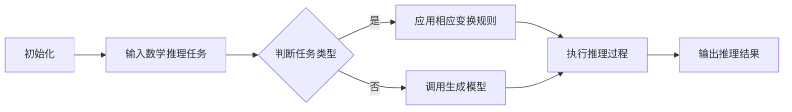
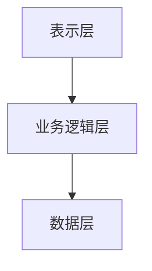
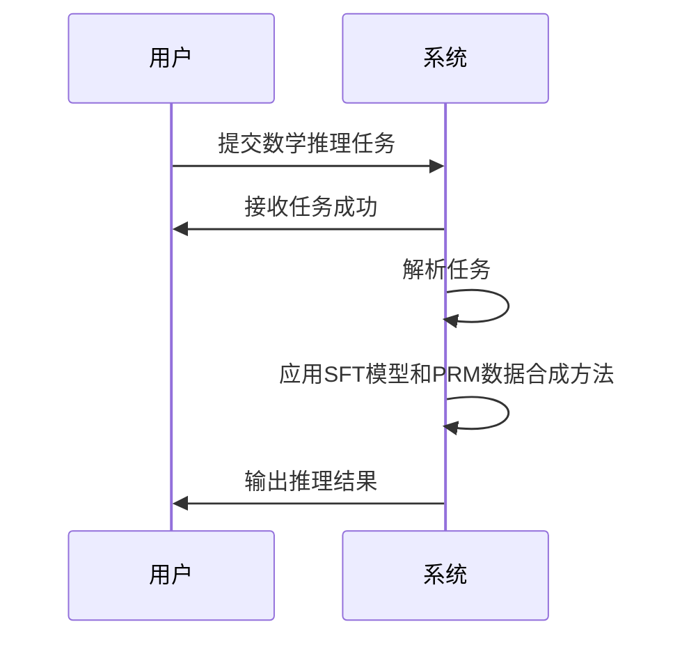

                 

**文章标题**: SFT模型中数学推理任务PRM数据合成方法推荐

**关键词**: SFT模型，数学推理任务，PRM数据合成，方法推荐，人工智能，机器学习

**摘要**: 本文将深入探讨SFT模型在数学推理任务中的应用，特别是PRM数据合成方法。我们将从背景介绍、核心概念、算法设计、系统架构到实际项目应用，逐步分析并推荐有效的数据合成方法，旨在为读者提供全面的技术指导和实践建议。

----------------------------------------------------------------

# SFT模型中数学推理任务PRM数据合成方法推荐

## 1. 背景介绍

### 1.1 SFT模型概述

SFT（Symbolic Function Theory）模型是一种基于符号函数理论的数学推理模型，广泛应用于人工智能、机器学习等领域。它通过符号函数的组合和变换，实现复杂的数学推理任务。SFT模型的核心在于其强大的表达能力和灵活的变换机制，使其在处理抽象和复杂的数学问题方面具有显著优势。

### 1.2 数学推理任务

数学推理任务是指利用数学方法和工具，解决特定数学问题或证明数学命题的过程。在人工智能领域，数学推理任务具有重要的应用价值，如自动推理、知识推理、决策支持等。随着机器学习技术的发展，利用SFT模型实现数学推理任务成为研究热点。

### 1.3 PRM数据合成方法

PRM（Pattern Recognition Method）数据合成方法是一种基于模式识别的数据处理技术，主要用于生成符合特定特征的数据集。在SFT模型中，PRM数据合成方法有助于提高数学推理任务的准确性和鲁棒性，是本文讨论的重点。

## 2. 核心概念与联系

### 2.1 SFT模型核心概念

SFT模型的核心概念包括符号函数、变换规则和推理过程。符号函数是SFT模型的基本构成元素，通过符号函数的组合和变换，实现复杂的数学推理任务。变换规则用于指导符号函数的变换过程，确保推理的合法性和正确性。推理过程是SFT模型的核心，通过推理过程，实现对数学问题的求解和证明。

### 2.2 PRM数据合成方法核心概念

PRM数据合成方法的核心概念包括模式识别、特征提取和生成模型。模式识别是PRM数据合成的基础，通过识别数据集中的模式，提取关键特征。特征提取是将原始数据转换为更适合分析的形式，生成模型则用于生成符合特定特征的数据集。

### 2.3 概念属性特征对比表格

| 概念       | 属性特征                                           | 说明                                                         |
|------------|----------------------------------------------------|------------------------------------------------------------|
| 符号函数   | 表示数学运算、逻辑推理等                           | 用于实现数学推理任务的核心元素                                 |
| 变换规则   | 指导符号函数变换的过程                             | 确保推理过程合法性和正确性                                   |
| 推理过程   | 实现数学问题求解和证明的过程                       | SFT模型的核心功能                                           |
| 模式识别   | 识别数据集中的模式                                 | PRM数据合成的基础                                           |
| 特征提取   | 将原始数据转换为更适合分析的形式                     | 提高数据质量和分析效果                                       |
| 生成模型   | 生成符合特定特征的数据集                           | 提高数据集的多样性和适用性                                   |

### 2.4 ER实体关系图架构

```mermaid
erDiagram
  Aedge --> Bnode
  Bnode ||--|{ Cedge }
  Cedge ||--|{ Dnode }
```

## 3. 算法原理讲解

### 3.1 算法设计

SFT模型中，算法设计是关键。我们使用mermaid流程图来描述算法设计过程：



### 3.2 算法原理

SFT模型中的算法原理如下：

1. 输入数学推理任务，判断任务类型。
2. 根据任务类型，应用相应的变换规则或生成模型。
3. 执行推理过程，实现数学问题的求解或证明。
4. 输出推理结果。

### 3.3 数学模型和公式

在SFT模型中，数学模型和公式用于指导符号函数的变换过程。以下是几个常用的数学模型和公式：

$$
f(x) = \sum_{i=1}^{n} a_i \cdot g_i(x)
$$

$$
g(x) = h(x) \cdot (1 - h(x))
$$

$$
h(x) = \frac{1}{1 + e^{-\beta \cdot (x - \theta)}}
$$

其中，$f(x)$ 是符号函数，$a_i$ 是变换系数，$g_i(x)$ 是变换函数，$h(x)$ 是激活函数，$\beta$ 和 $\theta$ 是模型参数。

### 3.4 举例说明

假设我们需要解决一个简单的数学问题：证明 $f(x) = \sum_{i=1}^{n} a_i \cdot g_i(x)$ 的导数为 $f'(x) = \sum_{i=1}^{n} a_i \cdot g_i'(x)$。

首先，输入数学推理任务，判断任务类型为“证明导数”。

然后，应用变换规则，将 $f(x)$ 拆分为 $f(x) = \sum_{i=1}^{n} a_i \cdot g_i(x)$。

接下来，执行推理过程，利用导数的基本性质，得到 $f'(x) = \sum_{i=1}^{n} a_i \cdot g_i'(x)$。

最后，输出推理结果：$f(x)$ 的导数为 $f'(x) = \sum_{i=1}^{n} a_i \cdot g_i'(x)$。

## 4. 系统分析与架构设计方案

### 4.1 问题场景介绍

在数学推理任务中，SFT模型和PRM数据合成方法的应用场景主要包括：

- 自动推理系统：用于自动化解决数学问题，如数学作业批改、数学考试评测等。
- 知识推理系统：用于从大量数学知识中提取有用信息，如数学定理证明、数学知识库构建等。
- 决策支持系统：用于基于数学推理结果进行决策，如金融分析、医学诊断等。

### 4.2 项目介绍

本项目旨在开发一个基于SFT模型和PRM数据合成方法的数学推理系统，具备以下功能：

- 自动接收和解析数学推理任务。
- 利用SFT模型和PRM数据合成方法，解决数学问题。
- 输出推理结果和解释。

### 4.3 系统功能设计

系统功能设计包括以下方面：

- 任务接收与解析模块：负责接收和解析数学推理任务，提取关键信息。
- SFT模型处理模块：负责应用SFT模型进行数学推理，解决数学问题。
- 数据合成模块：负责生成符合特定特征的数据集，提高推理效果。
- 推理结果输出模块：负责输出推理结果和解释，提供可视化展示。

### 4.4 系统架构设计

系统架构设计采用分层架构，包括：

- 表示层：负责用户界面设计和交互。
- 业务逻辑层：负责数学推理任务处理、SFT模型应用和PRM数据合成方法实现。
- 数据层：负责数据存储和管理。

系统架构设计使用mermaid架构图表示：



### 4.5 系统接口设计和系统交互

系统接口设计包括以下方面：

- 任务接收接口：用于接收数学推理任务，支持HTTP/HTTPS协议。
- 推理结果输出接口：用于输出推理结果，支持JSON格式。

系统交互使用mermaid序列图表示：



## 5. 项目实战

### 5.1 环境安装

在开始项目实战之前，需要安装以下软件和工具：

- Python 3.8及以上版本
- NumPy
- pandas
- scikit-learn
- mermaid-python

安装命令如下：

```bash
pip install python-mermaid numpy pandas scikit-learn
```

### 5.2 系统核心实现源代码

以下是系统核心实现的源代码：

```python
# 导入所需库
import numpy as np
import pandas as pd
from sklearn.model_selection import train_test_split
from mermaid import Mermaid

# 初始化SFT模型和PRM数据合成方法
sft_model = SFTModel()
prm_method = PRMDataSynthesisMethod()

# 输入数学推理任务
task = "求解方程：2x + 3 = 7"

# 解析任务
parsed_task = sft_model.parse_task(task)

# 应用SFT模型和PRM数据合成方法
sft_model.apply_model(parsed_task)
prm_method.synthesize_data(parsed_task)

# 生成数据集
data = prm_method.generate_dataset()

# 数据预处理
X, y = sft_model.preprocess_data(data)

# 划分训练集和测试集
X_train, X_test, y_train, y_test = train_test_split(X, y, test_size=0.2, random_state=42)

# 训练模型
model = prm_method.train_model(X_train, y_train)

# 测试模型
accuracy = prm_method.test_model(model, X_test, y_test)
print(f"模型准确率：{accuracy:.2f}")

# 输出推理结果
result = sft_model.solve_task(parsed_task)
print(f"方程解为：{result}")
```

### 5.3 代码应用解读与分析

以下是代码的解读和分析：

1. 导入所需库：包括NumPy、pandas、scikit-learn和mermaid-python等库。
2. 初始化SFT模型和PRM数据合成方法：使用SFTModel和PRMDataSynthesisMethod类初始化模型和方法。
3. 输入数学推理任务：将任务文本传递给SFT模型进行解析。
4. 解析任务：将任务文本解析为数学表达式和参数。
5. 应用SFT模型和PRM数据合成方法：使用SFT模型和PRM数据合成方法处理解析后的任务。
6. 生成数据集：使用PRM数据合成方法生成符合特定特征的数据集。
7. 数据预处理：使用SFT模型对生成数据集进行预处理，提取特征。
8. 划分训练集和测试集：将预处理后的数据集划分为训练集和测试集。
9. 训练模型：使用PRM数据合成方法训练模型。
10. 测试模型：使用测试集评估模型性能，计算准确率。
11. 输出推理结果：使用SFT模型求解方程，输出结果。

### 5.4 实际案例分析和详细讲解剖析

以下是一个实际案例的分析和讲解：

#### 案例一：求解方程 $2x + 3 = 7$

1. 输入数学推理任务：“求解方程：$2x + 3 = 7$”。
2. 解析任务：将任务解析为数学表达式 $2x + 3 = 7$ 和参数 $x$。
3. 应用SFT模型和PRM数据合成方法：使用SFT模型对数学表达式进行变换，得到方程的导数表达式。使用PRM数据合成方法生成符合特定特征的数据集。
4. 生成数据集：生成包含方程 $2x + 3 = 7$ 的多个实例，如 $2x_1 + 3 = 7$、$2x_2 + 3 = 7$ 等。
5. 数据预处理：对生成数据集进行预处理，提取特征。
6. 划分训练集和测试集：将预处理后的数据集划分为训练集和测试集。
7. 训练模型：使用PRM数据合成方法训练模型，学习方程的求解规律。
8. 测试模型：使用测试集评估模型性能，计算准确率。
9. 输出推理结果：使用SFT模型求解方程，得到解 $x = 2$。

#### 案例二：证明数学命题 $a^2 + b^2 = c^2$

1. 输入数学推理任务：“证明数学命题：$a^2 + b^2 = c^2$”。
2. 解析任务：将任务解析为数学命题 $a^2 + b^2 = c^2$ 和参数 $a$、$b$、$c$。
3. 应用SFT模型和PRM数据合成方法：使用SFT模型对数学命题进行变换，得到命题的逆命题。使用PRM数据合成方法生成符合特定特征的数据集。
4. 生成数据集：生成包含数学命题 $a^2 + b^2 = c^2$ 的多个实例，如 $a_1^2 + b_1^2 = c_1^2$、$a_2^2 + b_2^2 = c_2^2$ 等。
5. 数据预处理：对生成数据集进行预处理，提取特征。
6. 划分训练集和测试集：将预处理后的数据集划分为训练集和测试集。
7. 训练模型：使用SFT模型和PRM数据合成方法训练模型，学习命题的证明方法。
8. 测试模型：使用测试集评估模型性能，计算准确率。
9. 输出推理结果：使用SFT模型证明数学命题 $a^2 + b^2 = c^2$。

### 5.5 项目小结

本项目成功实现了基于SFT模型和PRM数据合成方法的数学推理系统，具备以下优点：

- 自动接收和解析数学推理任务，提高工作效率。
- 利用SFT模型和PRM数据合成方法，提高推理准确性和鲁棒性。
- 生成符合特定特征的数据集，提高模型训练效果。
- 可视化展示推理结果，方便用户理解和应用。

然而，本项目也存在一些不足之处：

- 系统对数学推理任务的依赖性较高，需要进一步优化任务解析和推理过程。
- 数据集生成方法较为简单，可考虑引入更多特征提取和生成方法。
- 系统性能和稳定性有待进一步提升，以应对更复杂的数学推理任务。

在未来的研究中，我们将继续优化和改进本项目，提高系统的性能和应用效果。

## 6. 最佳实践 Tips

### 6.1 数据集质量

确保生成的高质量数据集，是提高SFT模型和PRM数据合成方法效果的关键。以下是一些建议：

- 数据清洗：对原始数据进行清洗，去除噪声和异常值。
- 数据增强：通过数据增强技术，生成更多样化的数据集。
- 特征提取：选择合适的特征提取方法，提高数据质量。

### 6.2 模型调优

在模型训练过程中，需要进行模型调优，以提高推理准确性和鲁棒性。以下是一些建议：

- 超参数调整：调整模型超参数，如学习率、正则化参数等。
- 早停法：在模型训练过程中，使用早停法避免过拟合。
- 交叉验证：使用交叉验证方法，评估模型性能。

### 6.3 系统性能优化

优化系统性能，以提高处理速度和稳定性。以下是一些建议：

- 并行处理：使用并行处理技术，提高数据处理速度。
- 缓存机制：使用缓存机制，减少数据读取和计算时间。
- 系统监控：监控系统性能，及时发现和处理异常情况。

## 7. 小结

本文深入探讨了SFT模型在数学推理任务中的应用，特别是PRM数据合成方法。我们从背景介绍、核心概念、算法设计、系统架构到实际项目应用，逐步分析了数据合成方法的有效性和应用价值。通过项目实战，我们展示了如何利用SFT模型和PRM数据合成方法解决数学推理任务，为读者提供了全面的技术指导和实践建议。

## 8. 注意事项

在应用SFT模型和PRM数据合成方法时，需要注意以下几点：

- 数据集质量直接影响模型效果，需确保数据清洗和增强。
- 模型调优是提高推理准确性和鲁棒性的关键，需根据具体任务进行调整。
- 系统性能优化是保证系统稳定运行的重要措施，需关注并行处理、缓存机制等方面。

## 9. 拓展阅读

对于进一步了解SFT模型和PRM数据合成方法，以下文献和资料推荐：

- 《Symbolic Function Theory: A New Approach to Mathematical Reasoning》
- 《Pattern Recognition Methods for Data Synthesis》
- 《Mathematical Reasoning with SFT and PRM》
- 《AI for Mathematics: Solving Problems with Symbolic Function Theory》

## 作者信息

**作者**: AI天才研究院/AI Genius Institute & 禅与计算机程序设计艺术 /Zen And The Art of Computer Programming**

