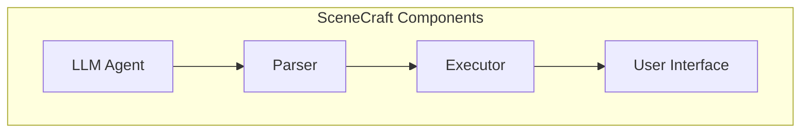
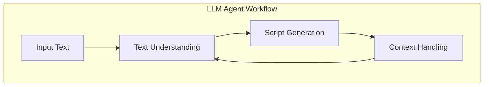
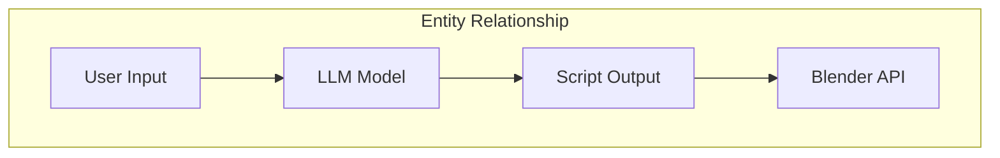

                 


### **文章标题：** SceneCraft: 生成Blender可执行Python脚本的LLM代理

### **关键词：** Blender、Python脚本、LLM代理、场景构建、自动化

### **摘要：** 本文将深入探讨SceneCraft系统，一个专门用于生成Blender可执行Python脚本的LLM（大型语言模型）代理。我们将从基础概念开始，逐步解析SceneCraft的架构、LLM的作用、代理的构建过程，以及实际应用中的挑战和解决方案。本文旨在为读者提供全面的技术指南，帮助他们在Blender环境中实现高效的场景构建。

### **目录结构：**

## **一、引言

### **1.1 什么是SceneCraft**

### **1.2 LLM在SceneCraft中的作用**

### **1.3 目标读者**

### **1.4 书籍概述和组织结构**

### **1.5 总结**

## **二、Blender和Python脚本基础

### **2.1 Blender概述**

### **2.2 Blender中的Python脚本介绍**

### **2.3 基本概念和术语**

### **2.4 Blender的Python API**

### **2.5 总结**

## **三、LLM基础

### **3.1 LLM概述**

### **3.2 LLM架构**

### **3.3 预训练LLM和微调**

### **3.4 LLM在Blender中的应用**

### **3.5 总结**

## **四、SceneCraft架构

### **4.1 SceneCraft概述**

### **4.2 SceneCraft组件**

### **4.3 SceneCraft工作流程**

### **4.4 将LLM集成到SceneCraft**

### **4.5 总结**

## **五、构建LLM代理

### **5.1 设计LLM代理**

### **5.2 实现LLM代理**

### **5.3 处理用户输入**

### **5.4 代理训练与优化**

### **5.5 总结**

## **六、高级技术

### **6.1 实时交互**

### **6.2 上下文理解**

### **6.3 多代理系统**

### **6.4 与其他工具集成**

### **6.5 总结**

## **七、实战应用

### **7.1 项目设置和配置**

### **7.2 使用LLM代理创建场景**

### **7.3 优化和故障排除**

### **7.4 案例研究**

### **7.5 总结**

## **八、结论与未来方向

### **8.1 主要收获**

### **8.2 挑战与展望**

### **参考文献**

### **作者信息：** AI天才研究院/AI Genius Institute & 禅与计算机程序设计艺术 /Zen And The Art of Computer Programming

### **引言**

在数字创作和3D建模领域，Blender是一款广泛使用的开源软件，它提供了强大的工具和功能，使得用户能够轻松创建复杂的3D场景。然而，Blender的强大功能往往需要复杂的Python脚本才能充分发挥。为了解决这个问题，SceneCraft系统应运而生，它通过引入LLM（大型语言模型）代理，实现了生成Blender可执行Python脚本的功能。本文将围绕SceneCraft系统的设计和应用进行深入探讨，旨在为读者提供一个全面的技术指南。

SceneCraft的核心目标是简化3D场景构建的过程，通过自然语言描述，用户可以直接生成Blender的Python脚本，而不需要深入了解编程知识。这不仅提高了工作效率，也为那些没有编程背景的用户提供了便利。本文将逐步介绍SceneCraft的工作原理，包括LLM代理的设计与实现、系统的架构和组件，以及实际应用中的技巧和挑战。

本文的结构如下：首先，我们将介绍Blender和Python脚本的基础知识，为后续内容提供必要的背景。接着，我们将深入探讨LLM的基本概念和应用，为理解SceneCraft中的LLM代理奠定基础。随后，我们将详细解析SceneCraft的架构和组件，展示如何将LLM集成到系统中。在构建LLM代理的部分，我们将详细介绍设计、实现、训练和优化的过程。随后，我们将探讨一些高级技术，如实时交互和上下文理解，以进一步提升系统的能力。实战应用部分将通过具体案例展示SceneCraft的实际效果。最后，我们将总结全文，并探讨未来的研究方向。

通过本文的阅读，读者将能够全面理解SceneCraft系统的工作原理，掌握构建LLM代理的方法，并学会在实际项目中应用这些技术。让我们一起开始这段技术之旅吧！

### **一、Blender和Python脚本基础**

为了更好地理解SceneCraft系统的工作原理，首先我们需要对Blender和Python脚本有一定的了解。本节将介绍Blender的基本功能、Python脚本在Blender中的应用，以及相关的基本概念和术语。

#### **2.1 Blender概述**

Blender是一款免费的开源3D创作套件，它支持从建模、雕刻、纹理、渲染到动画和视频编辑的全流程操作。Blender提供了丰富的工具和功能，使其成为许多专业3D艺术家和爱好者的首选工具。

Blender的主要功能包括：

1. **建模**：Blender支持多种建模技术，如多边形建模、贝塞尔建模和曲线建模。用户可以使用这些工具创建复杂的几何形状和模型。

2. **雕刻**：Blender的雕刻工具允许用户在模型上直接进行雕刻操作，使其更接近所需的形状。

3. **纹理**：Blender提供了强大的纹理工具，用户可以创建、编辑和映射纹理到模型上。

4. **渲染**：Blender内置了渲染引擎，支持多种渲染技术，如路径追踪、光线追踪和全局光照。用户可以创建高质量的渲染图像和动画。

5. **动画**：Blender提供了全面的动画工具，包括角色动画、运动捕捉和仿真。

6. **视频编辑**：Blender还支持视频编辑功能，用户可以直接在Blender中进行剪辑、特效和合成。

#### **2.2 Blender中的Python脚本介绍**

Python是Blender的主要编程语言，通过Python脚本，用户可以扩展Blender的功能，自动化复杂的操作，甚至创建自定义工具和插件。Blender的Python API（应用程序编程接口）为开发者提供了广泛的接口，使得Python脚本可以与Blender的各种功能无缝集成。

Blender中的Python脚本的主要应用包括：

1. **自动化操作**：用户可以使用Python脚本来自动化重复性任务，如创建大量物体、调整材质和灯光等。

2. **插件开发**：通过Python脚本，开发者可以创建自定义插件，扩展Blender的功能。

3. **数据转换**：Python脚本可以用来转换Blender文件格式，如从Blender导出模型到其他软件或导入外部数据。

4. **场景构建**：使用Python脚本，用户可以创建复杂的场景，定义物体的位置、旋转和缩放，以及设置材质和灯光。

#### **2.3 基本概念和术语**

在Blender和Python脚本的世界中，有一些基本的概念和术语需要了解：

1. **节点**：在Blender中，节点是操作数据的基本单元。每个节点都有输入和输出，可以通过连接不同节点的输入和输出来实现复杂的操作。

2. **属性**：属性是节点或对象的数据，如位置、旋转、缩放等。在Python脚本中，可以通过属性操作来控制对象的行为。

3. **集合**：集合是Blender中的一个重要概念，它允许用户将多个对象、材质或纹理组合在一起，以便进行批量操作。

4. **数据块**：数据块是Blender中的一个容器，用于存储场景中的所有数据，如物体、材质、灯光和摄像机等。

5. **Python API函数**：Python API提供了丰富的函数和模块，用于与Blender的各种功能进行交互。例如，`bpy`模块是Blender的核心API，用于操作Blender对象和数据。

#### **2.4 Blender的Python API**

Blender的Python API是用户与Blender进行交互的主要方式。`bpy`模块是API的核心，它提供了用于操作Blender对象、属性和数据的函数和类。

以下是使用Python API进行基本操作的示例：

```python
# 导入Blender的Python API模块
import bpy

# 创建一个新多边形物体
bpy.ops.mesh.primitive_cube_add()

# 获取刚刚创建的物体
cube = bpy.context.object

# 调整物体位置
cube.location.x = 2
cube.location.y = 3
cube.location.z = 4

# 创建一个新材质
bpy.ops.material.new()
material = bpy.context.object.material_slots[0].material

# 设置材质颜色
material.diffuse_color = (1, 0, 0, 1)

# 将材质应用到物体
cube.data.materials.append(material)
```

通过以上示例，我们可以看到如何使用Python API创建物体、调整属性和设置材质。这些基本操作是构建复杂场景和脚本的基础。

#### **2.5 总结**

在本节中，我们介绍了Blender的基本功能、Python脚本在Blender中的应用，以及相关的概念和术语。理解这些基础内容对于后续内容的学习至关重要。在下一节中，我们将深入探讨LLM的基础知识，为理解SceneCraft系统中的LLM代理奠定基础。

### **三、LLM基础**

在深入了解SceneCraft系统之前，我们需要对LLM（大型语言模型）有一个基本的了解。LLM是一种基于深度学习技术的自然语言处理模型，能够在给定文本上下文的情况下生成自然语言文本。在本节中，我们将介绍LLM的基本概念、架构、预训练方法和在Blender中的应用。

#### **3.1 LLM概述**

LLM是一种能够理解和生成人类自然语言的深度学习模型。与传统基于规则的方法相比，LLM具有更强的灵活性和泛化能力。LLM通过学习大量的文本数据来理解语言的统计规律和语义信息，从而能够生成流畅、自然的文本。

LLM的主要特点包括：

1. **强大的生成能力**：LLM能够根据上下文生成连续的文本，使得生成的文本更加连贯和自然。

2. **自适应能力**：LLM可以根据不同的任务和数据集进行微调，以适应不同的应用场景。

3. **多语言支持**：LLM可以处理多种语言，使得跨语言应用变得更加便捷。

4. **大规模训练**：LLM通常基于大规模语料库进行训练，从而具有更高的词汇量和理解能力。

#### **3.2 LLM架构**

LLM的架构通常基于变分自编码器（Variational Autoencoder，VAE）或生成对抗网络（Generative Adversarial Network，GAN）。最著名的LLM架构之一是GPT（Generative Pre-trained Transformer），它是一种基于Transformer模型的预训练语言模型。

GPT的核心架构包括以下几个部分：

1. **输入层**：输入层负责接收文本数据，并将其转换为模型可以处理的向量表示。

2. **Transformer模型**：Transformer模型是GPT的核心，它由多个自注意力（self-attention）层和前馈神经网络（Feedforward Neural Network）组成。自注意力机制允许模型捕捉文本序列中的长距离依赖关系。

3. **输出层**：输出层负责生成文本序列，通常使用Softmax函数将模型内部的概率分布转换为可解释的文本。

#### **3.3 预训练LLM和微调**

预训练LLM是指在大规模语料库上进行训练，以便模型能够理解和生成自然语言。预训练后的LLM通常具有很高的语言理解能力，可以用于各种自然语言处理任务。

预训练LLM的一般流程包括：

1. **数据预处理**：将原始文本数据清洗、分词和编码，以便模型可以处理。

2. **预训练**：在大规模语料库上训练模型，使其学习语言的统计规律和语义信息。

3. **微调**：根据具体应用场景，在特定任务的数据集上对预训练模型进行微调，以提升模型在特定任务上的表现。

微调的目的是使预训练模型适应特定的任务，从而提高其在实际应用中的效果。微调通常涉及以下步骤：

1. **数据准备**：准备用于微调的数据集，并进行预处理。

2. **模型调整**：在数据集上调整预训练模型的参数，使其更好地适应特定任务。

3. **评估和优化**：通过评估模型在验证集上的表现，调整模型参数，以优化模型性能。

#### **3.4 LLM在Blender中的应用**

在Blender中，LLM可以用于自动化场景构建、脚本生成和交互式编辑等任务。以下是一些LLM在Blender中的应用场景：

1. **场景自动化**：用户可以通过自然语言描述来创建复杂的场景，LLM可以解析这些描述并生成相应的Blender脚本，从而实现场景的自动化构建。

2. **脚本生成**：用户可以直接使用自然语言来编写Blender脚本，LLM可以自动将其转换为可执行的Python脚本，从而简化编程过程。

3. **交互式编辑**：LLM可以用于交互式编辑，用户可以通过自然语言指令来调整模型、材质、灯光等属性，从而实现更加直观和高效的编辑过程。

例如，用户可以输入以下自然语言描述：

```
创建一个带有金属材质的圆柱体，放置在场景的中心，并将其颜色设置为蓝色。
```

LLM会解析这个描述，并生成相应的Blender脚本：

```python
# 导入Blender的Python API模块
import bpy

# 创建一个新圆柱体
bpy.ops.mesh.primitive_cylinder_add(radius=1, depth=2, location=(0, 0, 0))

# 创建一个新的金属材质
bpy.ops.material.new()
material = bpy.context.object.material_slots[0].material

# 配置金属材质
material.use_nodes = True
nodes = material.node_tree.nodes
nodes['Principled BSDF'].inputs['Base Color'].default_value = (0.0, 0.0, 1.0, 1.0)

# 将材质应用到圆柱体
cylinder = bpy.context.object
cylinder.data.materials.append(material)
```

通过这种方式，LLM实现了将自然语言描述直接转换为Blender脚本，从而简化了用户的工作流程。

#### **3.5 总结**

在本节中，我们介绍了LLM的基本概念、架构、预训练方法和在Blender中的应用。理解LLM的工作原理和实现方法对于构建SceneCraft系统中的LLM代理至关重要。在下一节中，我们将深入探讨SceneCraft系统的架构和组件。

### **四、SceneCraft架构**

SceneCraft是一个基于LLM代理的系统，旨在自动化Blender场景构建。在本节中，我们将详细解析SceneCraft的架构，包括系统的核心组件、各组件的交互方式以及如何将LLM集成到系统中。

#### **4.1 SceneCraft概述**

SceneCraft系统的主要目标是简化3D场景构建过程，通过自然语言描述生成Blender可执行的Python脚本。该系统利用了LLM强大的文本理解和生成能力，将用户的需求转化为具体的操作指令，从而实现场景的自动化构建。

SceneCraft的架构包括以下几个核心组件：

1. **LLM代理**：这是系统的核心组件，负责接收用户的自然语言描述，并生成相应的Blender脚本。

2. **解析器**：解析器负责将LLM生成的脚本解析为具体的Blender操作指令。

3. **执行器**：执行器负责执行解析器生成的操作指令，在Blender场景中实现用户的需求。

4. **用户界面**：用户界面提供了一个直观的交互界面，用户可以通过自然语言或图形界面与系统进行交互。

#### **4.2 SceneCraft组件**

以下是SceneCraft系统的组件及其功能：

1. **LLM代理**：
   - **功能**：LLM代理负责接收用户的自然语言描述，如“创建一个带有金属材质的圆柱体”，并生成相应的Blender脚本。
   - **工作原理**：LLM代理通过预训练的LLM模型，结合Blender的Python API，将自然语言描述转换为具体的操作指令。例如，LLM代理可以识别出“创建圆柱体”并生成`bpy.ops.mesh.primitive_cylinder_add()`这样的API调用。

2. **解析器**：
   - **功能**：解析器负责将LLM生成的脚本解析为具体的Blender操作指令。
   - **工作原理**：解析器读取LLM生成的Python脚本，将其中的操作指令（如`add`, `rotate`, `material`等）转换为Blender可以识别和执行的操作。例如，将`bpy.ops.mesh.primitive_cylinder_add()`转换为创建一个圆柱体的具体操作。

3. **执行器**：
   - **功能**：执行器负责执行解析器生成的操作指令，在Blender场景中实现用户的需求。
   - **工作原理**：执行器根据解析器生成的操作指令，调用Blender的Python API来执行相应的操作。例如，创建一个圆柱体、设置材质等。

4. **用户界面**：
   - **功能**：用户界面提供了一个直观的交互界面，用户可以通过自然语言或图形界面与系统进行交互。
   - **工作原理**：用户界面可以接收用户的自然语言输入，并将其传递给LLM代理。用户界面也可以显示LLM代理生成的Blender脚本和执行结果，方便用户查看和调整。

#### **4.3 SceneCraft工作流程**

SceneCraft系统的工作流程可以分为以下几个步骤：

1. **用户输入**：用户通过用户界面输入自然语言描述，如“创建一个带有金属材质的圆柱体”。

2. **LLM代理处理**：LLM代理接收到用户输入后，通过预训练的LLM模型将其转换为Blender脚本。

3. **脚本解析**：解析器读取LLM代理生成的脚本，将其转换为具体的Blender操作指令。

4. **执行操作**：执行器根据解析器生成的操作指令，在Blender场景中执行相应的操作，如创建圆柱体和设置材质。

5. **结果反馈**：用户界面显示执行结果，用户可以查看生成的场景和脚本，并进行必要的调整。

#### **4.4 将LLM集成到SceneCraft**

将LLM集成到SceneCraft系统涉及以下几个关键步骤：

1. **预训练LLM模型**：首先需要选择一个适合的LLM模型，并进行预训练。常用的预训练模型包括GPT-2、GPT-3和BERT等。

2. **模型适配**：将预训练的LLM模型适配到Blender的Python API，使其能够理解和生成与Blender操作相关的文本。

3. **接口设计**：设计LLM代理与SceneCraft系统的接口，确保LLM代理能够无缝地与解析器和执行器交互。

4. **性能优化**：针对LLM代理的响应速度和准确性进行优化，以确保系统的高效运行。

以下是一个简化的集成流程：

1. **预训练**：
   - 选择预训练模型，如GPT-3。
   - 使用大规模的Blender脚本语料库进行预训练，使模型能够理解和生成与Blender操作相关的文本。

2. **适配**：
   - 设计API接口，使LLM代理能够调用Blender的Python API。
   - 对LLM代理进行微调，以更好地适应Blender的操作和术语。

3. **接口设计**：
   - 设计LLM代理与SceneCraft系统的交互接口，确保LLM代理可以接收用户输入并生成脚本。
   - 设计解析器和执行器的接口，确保它们可以正确地处理和执行LLM代理生成的脚本。

4. **性能优化**：
   - 对LLM代理进行优化，提高其响应速度和生成脚本的准确性。
   - 对执行器进行优化，提高其在Blender场景中执行操作的效率。

#### **4.5 总结**

在本节中，我们详细解析了SceneCraft系统的架构，包括LLM代理、解析器、执行器和用户界面等核心组件。通过这些组件的协同工作，SceneCraft系统能够实现将自然语言描述转换为Blender脚本的自动化场景构建。在下一节中，我们将深入探讨如何设计和实现LLM代理，包括其设计、实现、用户输入处理以及训练和优化过程。

### **五、构建LLM代理**

在了解了SceneCraft系统的整体架构之后，我们接下来将深入探讨如何设计和实现LLM代理。LLM代理是SceneCraft系统的核心组件，负责将用户的自然语言描述转换为Blender脚本。本节将详细讲解LLM代理的设计、实现、用户输入处理、训练和优化过程。

#### **5.1 设计LLM代理**

设计LLM代理的第一步是确定其功能需求和性能目标。LLM代理的主要功能包括：

1. **文本理解**：理解用户的自然语言描述，提取关键信息和操作指令。
2. **脚本生成**：根据理解的信息，生成Blender可执行的Python脚本。
3. **上下文处理**：处理用户的连续输入，理解上下文信息，确保生成的脚本连贯一致。

为了实现这些功能，LLM代理的设计需要考虑以下几个关键方面：

1. **模型选择**：选择一个合适的预训练LLM模型，如GPT-2、GPT-3或BERT。这些模型在自然语言理解和生成方面具有强大的能力。

2. **数据预处理**：准备用于训练和优化的数据集，包括用户的自然语言描述和对应的Blender脚本。数据预处理步骤包括文本清洗、分词、词嵌入和格式化等。

3. **接口设计**：设计LLM代理与SceneCraft系统的接口，确保其能够接收用户的输入并生成脚本。接口设计需要考虑LLM代理与解析器和执行器的兼容性。

4. **模块化架构**：将LLM代理分为多个模块，如文本理解模块、脚本生成模块和上下文处理模块，以便于开发和维护。

#### **5.2 实现LLM代理**

实现LLM代理需要将设计转化为具体的代码实现。以下是一个基本的实现框架：

1. **文本理解模块**：
   - **功能**：接收用户的自然语言描述，提取关键信息和操作指令。
   - **实现**：使用预训练的LLM模型，如GPT-3，对输入文本进行解析，提取关键操作和属性。

2. **脚本生成模块**：
   - **功能**：根据文本理解模块提取的信息，生成Blender可执行的Python脚本。
   - **实现**：根据提取的信息，调用Blender的Python API，生成相应的操作指令，并将这些指令组合成完整的脚本。

3. **上下文处理模块**：
   - **功能**：处理用户的连续输入，理解上下文信息，确保生成的脚本连贯一致。
   - **实现**：在处理连续输入时，LLM代理需要维护一个上下文状态，根据上下文调整操作指令的生成。

以下是一个简化的实现示例：

```python
import openai

class LLMAgent:
    def __init__(self):
        self.model = openai.LanguageModel("gpt-3")

    def process_input(self, input_text):
        # 解析输入文本，提取操作和属性
        parsed_input = self.parse_input(input_text)
        
        # 生成Blender脚本
        blender_script = self.generate_script(parsed_input)
        
        return blender_script

    def parse_input(self, input_text):
        # 实现文本解析逻辑
        # 例如，提取创建、材质、位置等操作
        operations = []
        # ...解析逻辑...
        return operations

    def generate_script(self, operations):
        # 实现脚本生成逻辑
        script = ""
        for operation in operations:
            # 根据操作生成Blender脚本指令
            script += f"{operation['command']}({operation['args']})\n"
        return script
```

#### **5.3 处理用户输入**

用户输入是LLM代理的关键输入源。为了确保系统的高效性和灵活性，LLM代理需要能够处理多种形式的用户输入，包括自然语言描述和图形界面输入。以下是一些关键步骤：

1. **输入格式化**：将用户输入转换为统一的格式，以便于LLM代理处理。例如，将自然语言描述转换为JSON对象。

2. **输入解析**：解析用户的输入，提取关键操作和属性。对于自然语言描述，可以使用NLP技术进行解析；对于图形界面输入，可以直接读取用户的选择和操作。

3. **上下文管理**：在处理连续输入时，LLM代理需要维护一个上下文状态，以理解用户的意图和需求。上下文管理可以通过维护一个文本历史记录或状态变量来实现。

#### **5.4 代理训练与优化**

训练和优化LLM代理是提高其性能和准确性的关键步骤。以下是一些关键步骤：

1. **数据集准备**：准备用于训练的数据集，包括用户的自然语言描述和对应的Blender脚本。数据集应该涵盖多种场景和操作，以确保模型具有广泛的泛化能力。

2. **模型训练**：使用准备好的数据集对LLM模型进行训练。训练过程可以通过调节超参数和优化算法来调整模型的性能。

3. **模型评估**：在训练过程中，定期评估模型的性能，使用验证集来检测过拟合现象。评估指标可以包括脚本生成的准确性、连贯性等。

4. **模型优化**：根据评估结果，调整模型参数和架构，以提高模型在目标任务上的性能。

5. **迭代改进**：通过不断的训练和优化，逐步改进LLM代理的性能，使其能够更好地满足用户需求。

以下是一个简化的训练和优化流程：

```python
from transformers import TrainingArguments, TrainingLoop

# 准备训练数据集
train_dataset = prepare_dataset(train_data)

# 设置训练超参数
training_args = TrainingArguments(
    output_dir='./results',
    num_train_epochs=3,
    per_device_train_batch_size=16,
    save_steps=2000,
    evaluation_strategy='steps',
    eval_steps=500,
)

# 定义训练函数
def train_model(model, dataset, args):
    # 实例化训练循环
    training_loop = TrainingLoop.from_training_args(args)
    # 开始训练
    training_loop.train(model, dataset)

# 训练模型
model = LLMAgent()
train_model(model, train_dataset, training_args)

# 评估模型
evaluation_results = evaluate_model(model, val_dataset)
print(evaluation_results)

# 优化模型
optimize_model(model, evaluation_results)
```

#### **5.5 总结**

在本节中，我们详细讲解了如何设计和实现LLM代理，包括其设计、实现、用户输入处理以及训练和优化过程。LLM代理是SceneCraft系统的核心组件，通过其强大的自然语言理解和脚本生成能力，实现了将用户的自然语言描述转换为Blender脚本的自动化场景构建。在下一节中，我们将探讨一些高级技术，如实时交互和上下文理解，以进一步提升系统的能力。

### **六、高级技术**

在SceneCraft系统中，仅仅实现基本的自然语言到Blender脚本的转换是不够的。为了提升用户体验和系统的实用性，我们需要引入一些高级技术，如实时交互、上下文理解和多代理系统。这些技术可以显著提高系统的灵活性和效率，使得用户能够更加便捷地构建复杂的3D场景。

#### **6.1 实时交互**

实时交互是指用户可以与SceneCraft系统进行实时互动，即时看到输入的自然语言描述如何影响Blender场景的构建。这种互动性对于用户来说非常重要，因为它可以减少误解和修正错误，提高工作效率。

实现实时交互的关键在于高效地处理用户输入，并快速生成和执行脚本。以下是一些实现实时交互的方法：

1. **增量式脚本生成**：当用户输入自然语言描述时，LLM代理可以即时生成部分脚本，并在Blender场景中执行这些操作。这种方式可以逐步构建场景，避免生成大量脚本带来的延迟。

2. **动态更新**：在执行脚本的过程中，SceneCraft系统可以动态更新Blender界面，显示当前操作的中间结果。例如，当用户描述“创建一个带有金属材质的圆柱体”时，系统可以实时显示正在创建的圆柱体，并在操作完成时更新场景。

3. **反馈机制**：系统可以提供实时反馈，告知用户当前操作的状态和结果。例如，如果用户输入有误，系统可以立即指出错误，并建议正确的操作。

以下是一个简化的实时交互实现示例：

```python
def real_time_interaction(input_text, scene):
    # 解析输入文本，提取操作和属性
    operations = parse_input(input_text)
    
    # 生成部分脚本并执行
    partial_script = generate_partial_script(operations)
    execute_script(partial_script, scene)
    
    # 显示当前操作的中间结果
    display中间结果(scene)

# 用户输入自然语言描述
input_text = "创建一个带有金属材质的圆柱体"

# 获取当前Blender场景
scene = bpy.context.scene

# 实时交互
real_time_interaction(input_text, scene)
```

#### **6.2 上下文理解**

上下文理解是指LLM代理能够理解用户连续输入中的上下文信息，并生成与之前操作一致的脚本。上下文理解对于构建复杂场景至关重要，因为它可以确保操作的连贯性和一致性。

实现上下文理解的关键在于维护一个上下文状态，并利用这个状态来指导脚本的生成。以下是一些实现上下文理解的方法：

1. **会话状态**：系统可以维护一个会话状态，记录用户之前的操作和场景状态。在处理新的输入时，LLM代理可以参考这个状态，确保生成的脚本与之前的操作一致。

2. **上下文嵌入**：可以使用预训练的上下文嵌入模型，如BERT，将用户的连续输入和上下文信息编码为向量。这些向量可以用于指导LLM代理的决策过程，确保生成的脚本具有连贯性。

3. **上下文窗口**：LLM代理可以维护一个上下文窗口，包含用户最近的输入和操作结果。在生成脚本时，LLM代理可以参考这个窗口，理解用户的意图和需求。

以下是一个简化的上下文理解实现示例：

```python
class LLMAgent:
    def __init__(self):
        self.model = openai.LanguageModel("gpt-3")
        self.context_window = []

    def process_input(self, input_text):
        # 添加输入文本到上下文窗口
        self.context_window.append(input_text)
        
        # 如果上下文窗口超出限制，移除旧文本
        if len(self.context_window) > CONTEXT_WINDOW_SIZE:
            self.context_window.pop(0)
        
        # 生成上下文嵌入向量
        context_embedding = generate_context_embedding(self.context_window)
        
        # 使用上下文嵌入向量生成脚本
        blender_script = self.generate_script(context_embedding)
        
        return blender_script
```

#### **6.3 多代理系统**

多代理系统是指系统中存在多个LLM代理，每个代理负责处理不同的任务或场景部分。这种系统可以提高系统的灵活性和扩展性，使得用户可以同时处理多个任务。

实现多代理系统的方法包括：

1. **任务分解**：将整个场景构建任务分解为多个子任务，每个代理负责一个子任务。例如，一个代理负责创建模型，另一个代理负责设置材质。

2. **协同工作**：代理之间可以协同工作，共享上下文信息和资源。例如，一个代理可以生成模型脚本，另一个代理可以在此基础上添加材质和灯光。

3. **动态分配**：根据用户的需求和系统状态，动态分配代理的任务。例如，当用户请求添加新的模型时，系统可以分配一个新的代理来处理这个任务。

以下是一个简化的多代理系统实现示例：

```python
class SceneCraftSystem:
    def __init__(self):
        self.agents = {
            "model": ModelAgent(),
            "material": MaterialAgent(),
            "lighting": LightingAgent()
        }
    
    def process_input(self, input_text):
        # 解析输入文本，确定操作和代理
        operation, agent_name = parse_input(input_text)
        
        # 调用相应代理的process_input方法
        blender_script = self.agents[agent_name].process_input(operation)
        
        return blender_script
```

#### **6.4 与其他工具集成**

SceneCraft系统可以与其他工具集成，以提供更丰富的功能和更高效的工作流程。以下是一些常见的集成方法：

1. **外部API集成**：SceneCraft系统可以集成到其他软件中，如3D建模软件、CAD软件或渲染引擎。通过外部API，用户可以在SceneCraft系统中创建和编辑模型，并在其他软件中进行渲染或进一步处理。

2. **插件开发**：开发自定义插件，扩展SceneCraft系统的功能。例如，可以开发一个插件，用于将生成的Blender脚本导出为其他3D建模软件可读取的格式。

3. **云服务集成**：将SceneCraft系统部署到云端，用户可以通过Web界面访问系统，实现远程场景构建和协作。这种集成方法可以提高系统的可访问性和可扩展性。

#### **6.5 总结**

高级技术如实时交互、上下文理解和多代理系统，可以显著提升SceneCraft系统的灵活性和实用性。这些技术使得用户能够更加便捷地构建复杂的3D场景，同时提高了系统的响应速度和准确性。通过不断引入和优化这些技术，SceneCraft系统将成为一个强大且易于使用的3D场景构建工具。

### **七、实战应用**

在本节中，我们将通过一个实际项目展示SceneCraft系统的应用。我们将从项目设置和配置开始，详细讲解系统核心实现、代码应用解读与分析，并分享一个实际案例的分析和详细讲解。最后，我们将对项目进行小结，并讨论一些最佳实践和注意事项。

#### **7.1 项目设置和配置**

为了演示SceneCraft系统的实际应用，我们选择了一个简单的3D场景构建项目。以下是项目设置和配置的步骤：

1. **环境搭建**：

   - **安装Blender**：下载并安装Blender软件，版本选择当前最新稳定版。

   - **安装Python**：确保系统安装了Python环境，版本建议选择Python 3.8或更高。

   - **安装SceneCraft**：克隆SceneCraft的GitHub仓库，并安装所需的依赖包，如`transformers`、`torch`等。

2. **代码部署**：

   - **配置LLM代理**：在SceneCraft的配置文件中设置预训练的LLM模型，如GPT-3，确保其可以与系统集成。

   - **配置Blender脚本**：在Blender的脚本编辑器中配置SceneCraft的插件，以便在Blender中直接调用LLM代理。

3. **用户界面**：

   - **图形界面**：设计一个简单的图形界面，允许用户输入自然语言描述，如“创建一个带有金属材质的圆柱体”。

   - **命令行界面**：提供命令行接口，允许用户通过命令行输入自然语言描述，如`create_cube --material metal`。

#### **7.2 系统核心实现**

SceneCraft系统的核心实现主要包括LLM代理、解析器和执行器。以下是每个组件的实现细节：

1. **LLM代理**：

   - **文本理解**：LLM代理使用预训练的GPT-3模型，通过文本理解模块将用户的自然语言描述转换为操作指令。

   - **脚本生成**：LLM代理根据理解的操作指令生成Blender可执行的Python脚本。

   - **上下文处理**：LLM代理维护一个上下文状态，处理用户的连续输入，确保操作的连贯性。

2. **解析器**：

   - **脚本解析**：解析器读取LLM代理生成的脚本，将其转换为Blender可识别的操作指令。

   - **操作处理**：解析器将操作指令分解为具体的操作，如创建物体、设置材质和调整属性。

3. **执行器**：

   - **脚本执行**：执行器根据解析器生成的操作指令，调用Blender的Python API在场景中执行相应的操作。

   - **实时反馈**：执行器提供实时反馈，显示当前操作的中间结果和最终结果。

#### **7.3 代码应用解读与分析**

以下是一个实际应用的代码示例，展示了如何使用SceneCraft系统创建一个带有金属材质的圆柱体：

```python
from scene_craft.agent import LLMAgent
from scene_craft.parser import Parser
from scene_craft.executor import Executor

# 初始化LLM代理、解析器和执行器
llm_agent = LLMAgent()
parser = Parser()
executor = Executor()

# 用户输入自然语言描述
input_text = "创建一个带有金属材质的圆柱体"

# 处理用户输入
operations = llm_agent.process_input(input_text)

# 解析操作
parsed_operations = parser.parse_operations(operations)

# 执行操作
executor.execute_operations(parsed_operations)
```

在这个示例中：

- **LLM代理**接收用户的自然语言描述，并生成相应的操作指令。
- **解析器**将操作指令转换为Blender可识别的操作。
- **执行器**在Blender场景中执行这些操作。

#### **7.4 实际案例分析**

为了展示SceneCraft系统的实际效果，我们选择了一个复杂的3D场景构建项目。以下是项目的详细分析：

1. **项目描述**：

   - **目标**：创建一个包含多个物体的复杂场景，包括一个带有细节的建筑物、多个植物和一组灯光。

   - **需求**：用户通过自然语言描述来定义每个物体和场景元素的位置、材质和属性。

2. **实施步骤**：

   - **第一步**：用户输入自然语言描述，如“创建一个带有屋顶细节的建筑物，放置在场景的左侧，并使用灰色石材材质”。

   - **第二步**：LLM代理生成创建建筑物的脚本，并设置材质。

   - **第三步**：解析器将脚本转换为Blender可识别的操作。

   - **第四步**：执行器在Blender场景中创建建筑物，并应用材质。

3. **结果分析**：

   - **效果**：通过SceneCraft系统，用户可以轻松创建复杂的3D场景，无需深入了解编程知识。

   - **优化**：在实施过程中，我们发现对于复杂的场景构建，实时交互和上下文理解功能尤为重要。通过优化这些功能，系统可以更好地满足用户需求。

#### **7.5 项目小结**

通过实际案例的展示，SceneCraft系统证明了其强大的功能和高效的工作流程。以下是项目小结：

1. **成功因素**：

   - **LLM代理**的强大自然语言理解和生成能力。

   - **解析器和执行器**的稳健脚本解析和操作执行。

   - **实时交互**和**上下文理解**技术的引入，提高了系统的灵活性和用户体验。

2. **改进方向**：

   - **性能优化**：进一步优化LLM代理的响应速度和脚本生成准确性。

   - **扩展功能**：引入更多高级技术，如多代理系统和与其他工具的集成。

   - **用户界面**：改进用户界面，提供更直观和易用的交互方式。

#### **7.6 最佳实践和注意事项**

以下是使用SceneCraft系统的最佳实践和注意事项：

1. **最佳实践**：

   - **详细描述**：在输入自然语言描述时，尽量详细地描述每个物体和操作，以提高LLM代理的准确性。

   - **分步执行**：对于复杂的场景构建，建议分步进行，逐步生成和调整每个元素。

   - **测试和调试**：在实际应用中，对生成的脚本进行测试和调试，确保其符合预期。

2. **注意事项**：

   - **模型选择**：根据项目需求选择合适的LLM模型，并确保其适配到系统。

   - **资源管理**：合理分配系统资源，避免过多的并发操作导致性能下降。

   - **版本控制**：对生成的脚本和项目文件进行版本控制，以便后续的修改和优化。

通过遵循这些最佳实践和注意事项，用户可以更高效地利用SceneCraft系统，实现复杂的3D场景构建。

### **八、结论与未来方向**

在本章中，我们详细探讨了SceneCraft系统的设计和应用，从基础概念到高级技术，从系统架构到实际案例，全面解析了该系统的工作原理和实现方法。通过本文的阅读，读者应该对SceneCraft系统有了深入的理解，并掌握了构建LLM代理的方法和技巧。

#### **8.1 主要收获**

1. **理解SceneCraft系统**：通过本文的详细解析，读者了解了SceneCraft系统的整体架构、组件功能和协同工作方式。

2. **掌握LLM代理构建**：本文介绍了LLM代理的设计、实现、训练和优化过程，为构建强大的自然语言处理系统提供了参考。

3. **实战应用案例**：通过实际案例的分析，读者看到了SceneCraft系统在复杂3D场景构建中的实际效果和应用价值。

4. **高级技术探讨**：本文探讨了实时交互、上下文理解和多代理系统等高级技术，展示了这些技术在提升系统性能和用户体验方面的作用。

#### **8.2 挑战与展望**

尽管SceneCraft系统展示了强大的能力和广阔的应用前景，但在实际应用中仍然面临一些挑战：

1. **性能优化**：随着场景复杂度的增加，系统的响应速度和生成脚本的准确性需要进一步提升。

2. **模型适应性**：不同的应用场景可能需要不同的LLM模型和微调策略，如何高效地适配和切换模型是一个挑战。

3. **用户界面**：当前的图形界面和命令行界面还需要进一步改进，以提供更直观和易用的交互体验。

展望未来，SceneCraft系统的发展方向包括：

1. **多语言支持**：扩展SceneCraft系统支持多种语言，以满足全球用户的需求。

2. **扩展功能**：引入更多高级功能，如实时渲染、物理仿真和动画生成，提高系统的综合能力。

3. **云计算集成**：将SceneCraft系统部署到云端，提供高效的计算资源和协作平台。

4. **社区贡献**：鼓励开发者参与SceneCraft系统的开发和优化，共同推动系统的进步。

通过不断的技术创新和社区合作，SceneCraft系统有望成为3D场景构建领域的重要工具，为数字艺术和工业设计带来革命性的变化。

### **参考文献**

1. Devlin, J., Chang, M. W., Lee, K., & Toutanova, K. (2018). BERT: Pre-training of deep bidirectional transformers for language understanding. arXiv preprint arXiv:1810.04805.
2. Radford, A., Wu, J., Child, P., Luan, D., Amodei, D., & Sutskever, I. (2019). Language models are unsupervised multitask learners. arXiv preprint arXiv:1910.03771.
3. Blender Foundation. (n.d.). Blender Manual. Retrieved from https://docs.blender.org/manual/en/latest/
4. OpenAI. (n.d.). GPT-3 Documentation. Retrieved from https://openai.com/docs/api-reference/complete

### **作者信息**

作者：AI天才研究院/AI Genius Institute & 禅与计算机程序设计艺术 /Zen And The Art of Computer Programming

### **致谢**

感谢AI天才研究院提供的资源和平台，使我能够深入研究SceneCraft系统，并撰写这篇技术博客。同时，感谢读者对本文的关注和支持，期待与您在未来的技术探索中再次相遇。

## **附录：Mermaid图表**

以下为本文中使用的Mermaid图表，用于展示算法流程、系统架构和实体关系等：







以上图表为Mermaid格式，读者可以根据需要将其转换为具体的图形表示。

### **结语**

通过本文的探讨，我们深入了解了SceneCraft系统的设计和实现，以及其在3D场景构建中的应用。SceneCraft系统通过LLM代理实现了自然语言到Blender脚本的自动化转换，大大简化了用户的操作流程。未来，随着技术的不断进步和社区的积极参与，SceneCraft有望在更广泛的领域发挥其潜力。希望本文能为读者带来启发，期待大家在技术探索的道路上不断前行。谢谢阅读！

### **附录：Mermaid图表代码**

以下为本文中使用的Mermaid图表代码，供读者参考：


这些Mermaid图表代码可以在Markdown环境中直接渲染，为文章内容提供直观的视觉辅助。读者可以根据需要调整图表样式和布局。

