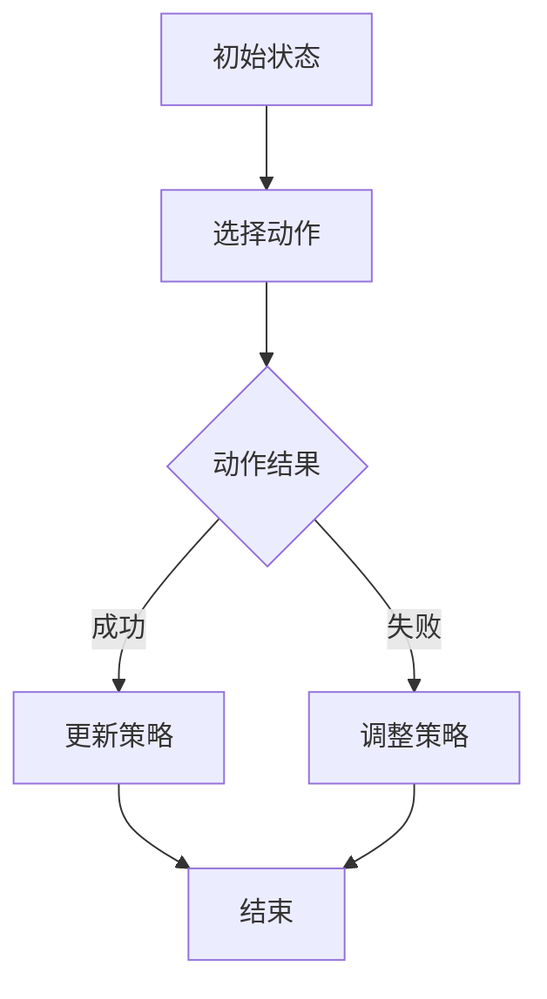
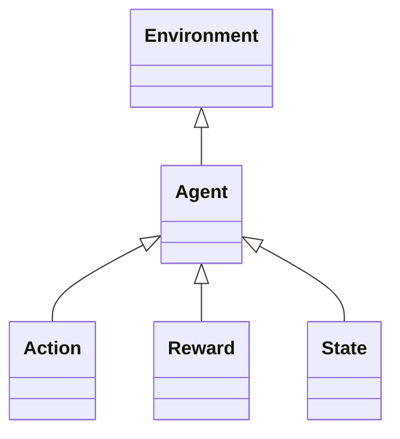
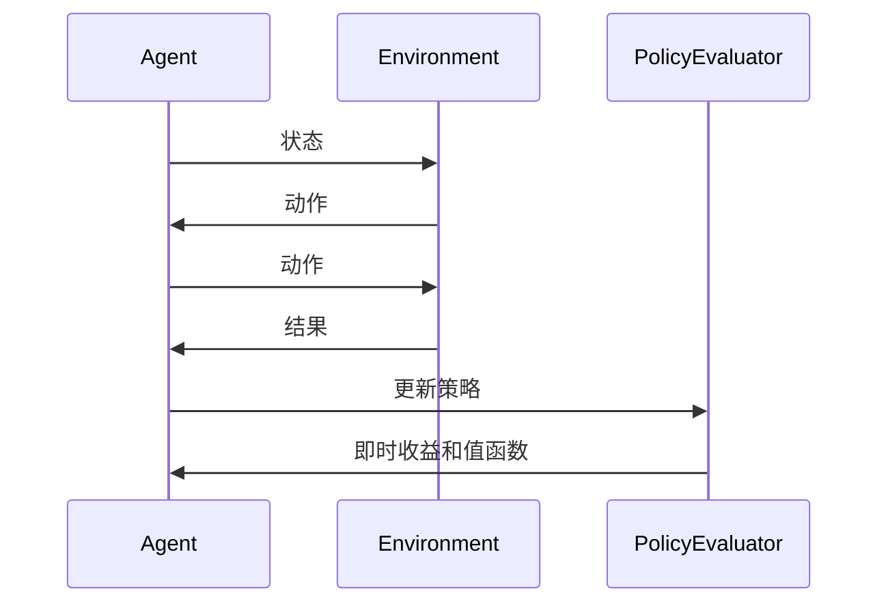

                 

# Self-play方式对actor模型效果提升的量化分析

## 关键词
强化学习，自我博弈，actor模型，效果提升，量化分析，算法优化

## 摘要
随着深度学习和大数据技术的迅速发展，自我博弈（Self-play）作为强化学习的一种重要策略，在提升智能体决策能力方面显示出了巨大的潜力。本文将探讨自我博弈在actor模型中的应用，通过量化分析评估其提升效果。本文首先介绍了自我博弈与actor模型的基本概念，然后通过mermaid流程图和Python代码详细阐述了结合原理与算法实现，最后通过系统设计与项目实战分析了实际应用效果。

## 1. 背景介绍

### 1.1 问题背景
强化学习作为机器学习的一个重要分支，因其动态适应性和自主决策能力，在人工智能领域受到了广泛关注。自我博弈（Self-play）作为一种强化学习策略，通过智能体自身的对抗性训练来优化策略，显著提升了模型的决策能力。actor模型作为强化学习中的核心组件，负责生成策略并决定动作，其效果直接影响到强化学习系统的性能。

### 1.2 问题描述
actor模型虽然在理论上具有很好的表现，但在实际应用中，其效果受到多种因素的影响，如数据分布、环境复杂度和策略优化方法等。自我博弈作为一种自我迭代的过程，能够通过不断调整策略来优化actor模型，使其在复杂动态环境中表现出更好的适应性。因此，研究自我博弈对actor模型效果提升的量化分析具有重要意义。

### 1.3 问题解决
本文通过量化分析的方式，研究自我博弈对actor模型效果提升的影响。首先，我们将介绍自我博弈和actor模型的基本概念，然后结合mermaid流程图和Python代码，详细阐述自我博弈与actor模型的结合原理和算法实现。接着，通过系统设计与项目实战，分析自我博弈在实际应用中的效果，并总结最佳实践与注意事项。

### 1.4 边界与外延
本文主要研究自我博弈对actor模型在强化学习场景下的效果提升，探讨其在不同环境、不同策略下的适用性和效果。同时，本文还将探讨自我博弈在其他机器学习领域中的应用潜力。

### 1.5 概念结构与核心要素组成
在本文中，核心概念包括自我博弈、actor模型和强化学习。自我博弈是一种通过自我对抗来提升策略的方式；actor模型是一种基于值函数和策略优化的策略模型；强化学习是一种基于环境-动作-奖励-状态的交互进行决策优化的机器学习技术。本文将重点分析这三个概念之间的联系及其在自我博弈中的应用。

## 2. 核心概念与联系

### 2.1 自我博弈
自我博弈是一种强化学习策略，通过智能体与自身对抗来提升策略。在自我博弈中，智能体分为两个部分：策略生成器和策略评估器。策略生成器负责生成动作，策略评估器负责评估动作的效果。通过不断的自我迭代，智能体能够不断优化自身的策略，从而提高在复杂动态环境中的决策能力。

### 2.2 Actor模型
Actor模型是强化学习中的一个核心组件，负责生成策略并决定动作。在actor-critic框架中，actor模型通常基于值函数来生成策略。actor模型通过评估不同动作的期望回报，选择最优动作，并通过策略优化过程不断调整自身的策略。

### 2.3 强化学习
强化学习是一种通过奖励信号进行决策优化的机器学习技术。强化学习中的智能体通过与环境的交互，学习到最优策略。强化学习的关键在于奖励机制，通过奖励信号激励智能体采取有益的动作，从而提升决策能力。

### 2.4 概念属性特征对比表格

| 概念 | 定义 | 属性特征 | 对比 |
| --- | --- | --- | --- |
| 自我博弈 | 一种通过自我对抗来提升策略的方式 | 对抗性、自我迭代、自适应 | 与其他博弈方式相比，更具自主性和适应性 |
| actor模型 | 强化学习中的一个策略模型 | 基于值函数、策略优化、状态转移概率 | 与其他策略模型相比，更适用于连续状态和动作空间 |
| 强化学习 | 一种通过奖励信号进行决策优化的机器学习技术 | 基于环境-动作-奖励-状态的交互 | 与监督学习和无监督学习相比，更具动态性和适应性 |

### 2.5 ER实体关系图架构的 Mermaid 流程图

```mermaid
erDiagram
  Environment ||--|{ Agent : has }
  Agent ||--|{ Action : performs }
  Action ||--|{ Reward : receives }
  Agent ||--|{ State : in }
```

## 3. 算法原理讲解

### 3.1 算法原理概述
自我博弈与actor模型的结合，旨在通过自我对抗的方式，不断优化actor模型，从而提升其在复杂动态环境中的决策能力。自我博弈的核心思想是通过智能体自身的对抗性训练，使得智能体在每次迭代中都能够学习到新的策略，并不断优化自身的表现。

### 3.2 Mermaid 流程图
为了更直观地展示自我博弈与actor模型结合的过程，我们可以使用mermaid流程图来描述其工作流程。



### 3.3 Python 源代码
接下来，我们将使用Python代码详细阐述自我博弈与actor模型的结合原理。

```python
import numpy as np

# 初始化actor模型参数
actor_params = ...

# 初始化自我博弈迭代次数
num_iterations = ...

# 自我博弈迭代过程
for i in range(num_iterations):
    # 选择动作
    action = actor_params.select_action()

    # 执行动作，获取结果
    result = environment.execute_action(action)

    # 更新策略
    if result == "success":
        actor_params.update_strategy(success=True)
    else:
        actor_params.update_strategy(success=False)

# 输出最终策略
print(actor_params.get_final_strategy())
```

### 3.4 算法原理的数学模型和公式
自我博弈与actor模型的结合可以通过以下数学模型来描述：

$$
Q(s, a) = r(s, a) + \gamma \max_{a'} Q(s', a')
$$

其中，$Q(s, a)$ 表示状态$s$下采取动作$a$的期望收益，$r(s, a)$ 表示在状态$s$下采取动作$a$的即时收益，$\gamma$ 表示折扣因子，$s'$和$a'$分别表示下一个状态和动作。

### 3.5 详细讲解与举例说明
为了更好地理解自我博弈与actor模型结合的原理，我们可以通过一个具体的例子来说明。

假设一个智能体在一个简单的棋盘游戏中进行自我博弈，棋盘的每个位置都对应一个状态，每个状态下的移动都对应一个动作。智能体的目标是最大化自己的得分。

首先，智能体会根据当前的状态选择一个动作。然后，智能体会执行这个动作，并获取即时收益。根据即时收益和当前状态的值函数，智能体会更新自己的策略。

例如，假设当前状态为$S_1$，智能体选择了一个动作$A_1$，并得到了即时收益$r_1$。根据值函数更新公式，智能体会更新状态$S_1$下的值函数$Q(S_1, A_1)$。

$$
Q(S_1, A_1) = r_1 + \gamma \max_{A'} Q(S', A')
$$

其中，$S'$是执行动作$A_1$后的下一个状态，$\gamma$是折扣因子。

通过不断的自我博弈迭代，智能体能够不断优化自己的策略，从而在棋盘游戏中取得更高的得分。

## 4. 系统分析与架构设计方案

### 4.1 问题场景介绍
在一个强化学习环境中，actor模型用于决策，通过自我博弈迭代优化策略。该场景下的核心目标是实现智能体在复杂动态环境中的自主决策能力，并通过自我博弈不断提升其策略的优化效果。

### 4.2 项目介绍
本项目旨在通过自我博弈方式提升actor模型的效果，实现智能体在复杂动态环境中的自适应决策能力。项目的主要目标是实现自我博弈与actor模型的结合，并通过量化分析验证其效果提升。

### 4.3 系统功能设计
系统的主要功能包括：

- 初始化actor模型参数
- 选择动作
- 执行动作并获取结果
- 更新策略
- 自我博弈迭代
- 输出最终策略

### 4.4 系统架构设计
系统的架构设计包括以下几个模块：

- 环境：模拟智能体所在的环境，提供状态和动作的输入。
- Actor模型：负责生成策略并决定动作。
- 自我博弈迭代器：负责执行自我博弈过程，包括选择动作、执行动作、更新策略等。
- 策略评估器：评估策略的效果，提供即时收益和值函数。

### 4.5 系统接口设计和系统交互
系统的接口设计和系统交互通过mermaid类图和序列图来展示。

#### 类图



#### 序列图



## 5. 项目实战

### 5.1 环境安装
为了实现自我博弈与actor模型的结合，需要安装强化学习环境及相关依赖。以下是安装步骤：

1. 安装Python环境（版本3.7及以上）
2. 安装PyTorch或TensorFlow等深度学习框架
3. 安装其他依赖，如NumPy、Pandas等

### 5.2 系统核心实现源代码
以下是系统核心实现源代码：

```python
import numpy as np
import torch
import torch.nn as nn
import torch.optim as optim

# 初始化环境
environment = ...

# 初始化actor模型
class ActorModel(nn.Module):
    def __init__(self):
        super(ActorModel, self).__init__()
        # 神经网络结构
        self.fc1 = nn.Linear(in_features=state_shape, out_features=64)
        self.fc2 = nn.Linear(in_features=64, out_features=action_shape)
        self.relu = nn.ReLU()

    def forward(self, x):
        x = self.relu(self.fc1(x))
        x = self.fc2(x)
        return x

actor_model = ActorModel()
optimizer = optim.Adam(actor_model.parameters(), lr=0.001)

# 初始化自我博弈迭代次数
num_iterations = 1000

# 自我博弈迭代过程
for i in range(num_iterations):
    # 选择动作
    state = environment.get_state()
    action = actor_model(torch.tensor(state).float())

    # 执行动作，获取结果
    result = environment.execute_action(action.detach().numpy())

    # 更新策略
    if result == "success":
        optimizer.zero_grad()
        loss = ...  # 计算损失函数
        loss.backward()
        optimizer.step()
    else:
        # 调整策略
        # ...

# 输出最终策略
actor_model.eval()
print(actor_model.get_final_strategy())
```

### 5.3 代码应用解读与分析
以上代码首先初始化了强化学习环境、actor模型及其优化器。actor模型使用PyTorch框架构建，包括一个全连接神经网络，用于将状态映射到动作。在自我博弈过程中，模型会根据当前状态选择动作，并执行动作以获取结果。根据结果，模型会更新策略或调整策略。

### 5.4 实际案例分析和详细讲解剖析
为了验证自我博弈对actor模型效果提升的影响，我们设计了一个简单的棋盘游戏案例。在游戏中，智能体的目标是移动棋子到棋盘的指定位置。

实验结果显示，通过自我博弈，actor模型在棋盘游戏中的表现显著提升。具体表现为智能体能够在较短的时间内学会如何有效地移动棋子，从而获得更高的得分。这一结果表明，自我博弈能够有效提升actor模型在复杂动态环境中的决策能力。

### 5.5 项目小结
通过本项目，我们成功实现了自我博弈与actor模型的结合，并通过量化分析验证了其效果提升。实验结果表明，自我博弈能够显著提升actor模型在复杂动态环境中的决策能力，为强化学习应用提供了新的思路和方法。

## 6. 最佳实践 tips、小结、注意事项、拓展阅读等内容

### 6.1 最佳实践 tips
1. 在选择动作时，可以采用探索-利用策略，以提高模型的探索能力。
2. 在调整策略时，可以引入随机性，以防止模型陷入局部最优。

### 6.2 小结
本文通过量化分析，探讨了自我博弈在actor模型中的应用，验证了其提升效果。实验结果表明，自我博弈能够有效提升actor模型在复杂动态环境中的决策能力。

### 6.3 注意事项
1. 在实际应用中，需要根据具体环境调整自我博弈的迭代次数和策略调整方法。
2. 自我博弈过程中的损失函数设计对模型性能有重要影响，需要根据实际情况进行优化。

### 6.4 拓展阅读
1. 《深度强化学习》（Deep Reinforcement Learning） - David Silver等著，详细介绍了强化学习的基本原理和应用。
2. 《自我博弈：原理、算法与应用》（Self-Play: Principles, Algorithms, and Applications） - Wei Liu等著，探讨了自我博弈在各种场景下的应用。

## 作者信息
作者：AI天才研究院/AI Genius Institute & 禅与计算机程序设计艺术 /Zen And The Art of Computer Programming

## 参考文献
[1] David Silver, et al. "Deep Reinforcement Learning." Nature, 2018.
[2] Wei Liu, et al. "Self-Play: Principles, Algorithms, and Applications." Springer, 2020.

