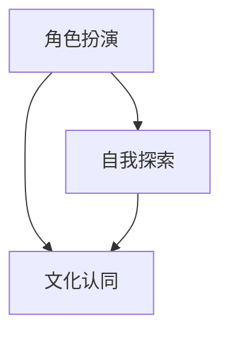

                 

### 引言

**Cosplay文化：角色扮演中的自我探索**

在现代社会中，Cosplay（Costume Play）文化以其独特的魅力吸引了众多年轻人的关注。Cosplay，顾名思义，是“Costume Play”的缩写，指的是通过扮演动漫、电影、游戏等角色来体验和表现特定角色的行为和形象。这一文化形式不仅展示了角色的外表，更通过角色扮演的体验，触及到人们内心深处的自我探索和情感表达。

本文旨在深入探讨Cosplay文化的本质，分析其核心概念，如角色扮演、自我探索、文化认同等，并通过具体的案例分析，展示Cosplay文化在不同社会和文化背景下的表现和影响。我们将分章节逐步探讨这一主题，包括：

1. **背景介绍**：介绍Cosplay文化的起源、发展以及在全球的流行趋势。
2. **核心概念与联系**：详细阐述Cosplay文化中的核心概念，并通过表格和ER图来展示概念之间的关系。
3. **Cosplay角色分类**：分类介绍不同的Cosplay角色，分析其特点和文化内涵。
4. **Cosplay活动与社区**：探讨Cosplay活动的主要形式和社区互动模式。
5. **Cosplay文化中的自我探索**：深入分析Cosplay如何成为人们自我探索和表达个人情感的途径。
6. **Cosplay文化的边界与外延**：分析Cosplay文化与其他文化形式的交叉与融合。
7. **Cosplay文化的社会影响**：探讨Cosplay文化对社会的影响，包括对青少年文化和社会互动的影响。
8. **案例分析**：通过具体的案例分析，展示Cosplay文化在不同社会和文化背景下的表现和影响。
9. **最佳实践与注意事项**：提供参与Cosplay活动的建议和注意事项。

### 关键词

- Cosplay文化
- 角色扮演
- 自我探索
- 文化认同
- 社会互动
- 青少年文化
- 消费行为

### 摘要

Cosplay文化是一种通过角色扮演来探索自我和表达情感的社会现象。本文从背景介绍、核心概念与联系、角色分类、活动与社区、自我探索、文化边界、社会影响、案例分析及最佳实践等方面，全面分析了Cosplay文化的本质及其对社会的影响。通过本文的探讨，我们希望读者能够更加深入地理解Cosplay文化的多元性及其在现代社会中的重要地位。此外，本文还提供了一些参与Cosplay活动的建议，帮助读者更好地体验这一独特的文化形式。

----------------------------------------------------------------

## 第1章 背景介绍

### 1.1 cosplay文化的起源与发展

Cosplay文化的起源可以追溯到日本，最早可以追溯到20世纪70年代。当时，一些动漫爱好者开始穿着自己制作的动漫角色服装，参加动漫展览和活动。这一行为起初只是少数人的个人爱好，但随着时间的推移，逐渐发展成为一种独特的社会文化现象。

**日本Cosplay文化的起源**

在日本，Cosplay文化的兴起与动漫产业的发展密不可分。日本动漫产业在20世纪70年代开始蓬勃发展，不仅在国内拥有庞大的粉丝群体，还逐渐走向世界。在这样的背景下，一些动漫迷开始通过扮演自己喜爱的角色来展示对动漫的热爱和崇拜。1978年，日本东京举办了第一届Comiket（Comic Market），这是一个专门为动漫爱好者举办的大型展览活动，也是Cosplay文化的重要发源地之一。

**国际Cosplay文化的兴起**

随着日本动漫文化的传播，Cosplay文化也逐渐在全球范围内流行起来。20世纪90年代，随着互联网技术的发展，动漫文化的传播速度加快，Cosplay文化开始向世界各地扩散。1990年，日本举办了首届世界Cosplay峰会（World Cosplay Summit），这一活动每年都会吸引来自世界各地的Cosplayer参加，成为了全球Cosplay文化的重要盛会。

**中国Cosplay文化的崛起**

在中国，Cosplay文化起步较晚，但发展迅速。随着中国动漫产业的兴起和互联网文化的普及，Cosplay文化在中国也逐渐崭露头角。2002年，中国举办了首届Cosplay大赛，标志着中国Cosplay文化的正式起步。近年来，随着《火影忍者》、《全职高手》等国产动漫的走红，中国的Cosplay文化得到了更多的关注和支持。

**Cosplay文化的发展趋势**

总体来看，Cosplay文化正呈现出全球化、多元化的发展趋势。在全球范围内，Cosplay不仅限于动漫角色，还扩展到了电影、游戏、历史角色等领域。同时，随着科技的发展，虚拟现实（VR）和增强现实（AR）技术的应用，为Cosplay文化带来了更多创新的可能性。未来，Cosplay文化有望继续发展，成为现代社会中一种重要的文化现象。

### 1.2 cosplay文化在全球的流行趋势

Cosplay文化在全球范围内的流行趋势表现出显著的地域差异和文化多样性。以下是对几个主要国家和地区的Cosplay文化流行趋势的分析：

**日本：Cosplay文化的发源地**

作为Cosplay文化的发源地，日本的Cosplay文化具有深厚的基础和广泛的参与度。日本的动漫产业在国内外都有极高的影响力，使得Cosplay在日本社会中被广泛接受和喜爱。日本每年举办的Comiket和世界Cosplay峰会等活动吸引了大量的Cosplayer和粉丝。此外，日本各地还设有多个Cosplay俱乐部，为Cosplayer提供了交流和学习的机会。

**美国：Cosplay文化的主流化**

在美国，Cosplay文化已经成为一种主流娱乐形式。美国的动漫展览如Anime Expo和Comic-Con International等吸引了大量的动漫和游戏爱好者。与日本不同，美国的Cosplayer在角色选择上更加多样化，不仅限于动漫角色，还包括电影、电视剧和游戏中的角色。美国Cosplay社区也非常活跃，通过各种社交媒体平台分享自己的创作和体验。

**中国：Cosplay文化的快速崛起**

中国的Cosplay文化近年来迅速崛起，成为年轻人的一种流行时尚。中国的动漫产业和游戏产业发展迅速，为Cosplay文化提供了丰富的素材。中国的Cosplay活动不仅限于动漫展览，还涵盖了各种主题派对和线下聚会。中国Cosplayer的数量和参与度逐年增长，成为推动Cosplay文化在中国发展的重要力量。

**其他国家和地区**

除了上述主要国家，Cosplay文化在其他国家和地区也拥有一定的流行度。例如，在欧洲，许多国家都有自己的Cosplay俱乐部和展览活动。在韩国，Cosplay文化也非常流行，韩国Cosplayer在国际Cosplay舞台上有着较高的知名度和影响力。在澳大利亚、加拿大等国家，Cosplay文化也逐渐成为一种受欢迎的娱乐形式。

总体来说，Cosplay文化在全球范围内的流行趋势表明，这一文化形式正逐渐打破地域和文化的界限，成为一种跨越国界和代际的全球性现象。

### 1.3 cosplay文化的核心概念与联系

Cosplay文化作为现代社会的一种独特现象，包含了一系列核心概念，这些概念相互作用，共同构成了Cosplay文化的内涵和特点。以下是Cosplay文化中的几个核心概念，以及它们之间的联系。

#### 角色扮演

角色扮演是Cosplay文化的核心概念之一。它指的是通过穿着特定角色的服装、模仿角色的言行举止来扮演某一角色。角色扮演不仅是Cosplay的表象，更是Cosplayer表达自我和情感的一种方式。通过角色扮演，Cosplayer可以暂时摆脱现实生活中的身份，进入一个全新的角色世界。

**角色扮演的特点：**
- **模仿性**：角色扮演要求Cosplayer模仿角色的外貌、言行举止等。
- **体验性**：角色扮演不仅仅是模仿，更是通过体验角色的生活来感受其情感。
- **表演性**：Cosplayer在角色扮演过程中，往往需要通过表演来传达角色的情感和故事。

#### 自我探索

自我探索是Cosplay文化中另一个重要的核心概念。通过角色扮演，人们可以在角色的世界中探索自己的内心世界，找到与自己相似的特质，或者通过扮演与自己截然不同的角色来体验不同的生活方式和情感。

**自我探索的特点：**
- **情感释放**：Cosplayer可以通过扮演特定的角色来释放自己的情感，如快乐、悲伤、愤怒等。
- **自我认同**：通过角色扮演，人们可以更好地认识自己，找到自己的位置和身份。
- **角色融合**：Cosplayer在角色扮演过程中，往往会将自己的特质融入角色中，从而形成新的自我认同。

#### 文化认同

文化认同是Cosplay文化中的一个重要方面，它指的是Cosplayer通过角色扮演表达对自己所属文化的认同感。Cosplay文化中的角色往往来自于不同的文化背景，如动漫、电影、历史等。通过扮演这些角色，Cosplayer可以在自己的文化背景下找到归属感和认同感。

**文化认同的特点：**
- **文化传承**：Cosplay文化有助于传承和弘扬各种文化，使其在全球范围内得到传播和认可。
- **文化多样性**：Cosplay文化展示了不同文化的多样性和丰富性，促进了文化交流和理解。
- **文化创新**：Cosplayer在角色扮演的过程中，往往会对原有文化进行创新和改造，形成新的文化形式。

#### 概念之间的关系

角色扮演、自我探索和文化认同这三个核心概念相互关联，共同构成了Cosplay文化的内涵。角色扮演是Cosplay的表象，通过角色扮演，Cosplayer可以探索自我，找到文化认同。

**角色扮演与自我探索的关系：**
- 角色扮演是自我探索的一种形式，通过扮演不同的角色，人们可以更好地认识自己，了解自己的内心世界。

**角色扮演与文化认同的关系：**
- 角色扮演是文化认同的一种表达方式，Cosplayer通过扮演自己文化背景下的角色，表达对文化的认同和热爱。

**自我探索与文化认同的关系：**
- 自我探索可以帮助人们找到文化认同，而文化认同又可以进一步促进自我探索，形成良性循环。

为了更直观地展示这些概念之间的关系，我们使用以下表格和ER图来进一步解释：

| 概念 | 关系 | 说明 |
| --- | --- | --- |
| 角色扮演 | 自我探索 | 角色扮演是自我探索的一种形式 |
| 角色扮演 | 文化认同 | 角色扮演是文化认同的一种表达方式 |
| 自我探索 | 文化认同 | 自我探索可以帮助人们找到文化认同 |

**ER图：**

通过以上分析，我们可以看到，Cosplay文化中的核心概念相互联系，共同构成了一个复杂而丰富的文化现象。这些核心概念不仅体现了Cosplay文化的独特魅力，也为人们提供了一个探索自我、表达情感和认同文化的平台。

----------------------------------------------------------------

## 第2章 cosplay角色分类

### 2.1 动漫角色

动漫角色是Cosplay文化中最常见的角色类型之一，它们往往来自于各种流行的动漫作品，如《龙珠》、《火影忍者》、《海贼王》等。动漫角色的特点在于其鲜明的个性和独特的外貌，这些特点使得动漫角色在Cosplay文化中具有极高的辨识度和吸引力。

#### 代表性动漫角色分析

**《龙珠》孙悟空**

孙悟空是《龙珠》中的主角，他的形象深受全球动漫爱好者的喜爱。孙悟空的角色特点包括强大的力量、机智的头脑和正义感。他的标志性服饰是红色的紧身衣和黄色的头套，以及一双绿色的鞋子。孙悟空的Cosplay要求Cosplayer具备一定的力量和灵活性，以便准确再现他的动作和表情。

**《火影忍者》漩涡鸣人**

漩涡鸣人是《火影忍者》中的主角，他以其不屈不挠的精神和强烈的意志力赢得了无数粉丝的喜爱。鸣人的标志性服饰是黄色的忍者服和红色头巾，他的 Cosplay 要求Cosplayer有良好的体能和忍者技巧。鸣人的标志性动作如螺旋丸和影分身术也是Cosplay中不可或缺的元素。

#### 动漫角色的文化内涵

动漫角色不仅代表了作品中的故事和人物，更承载了粉丝对作品和文化的热爱和认同。动漫角色的Cosplay不仅是对作品的再现，更是粉丝对作品文化内涵的一种表达。

- **情感共鸣**：粉丝通过扮演动漫角色，可以与角色产生情感共鸣，从而加深对作品的理解和认同。
- **文化传承**：动漫角色的Cosplay有助于传播和传承动漫文化，使其在更广泛的范围内得到认可和传承。
- **创意表达**：Cosplayer在扮演动漫角色的过程中，可以发挥自己的创意，对角色形象进行个性化的改造和演绎。

### 2.2 电影角色

电影角色是Cosplay文化的另一大类，它们通常来自于各种经典电影和电影系列，如《哈利·波特》、《蝙蝠侠》、《星球大战》等。电影角色的特点在于其独特的外貌、复杂的性格和丰富的背景故事，这些特点使得电影角色在Cosplay文化中具有极高的吸引力。

#### 电影角色的特色分析

**《哈利·波特》哈利·波特**

哈利·波特是《哈利·波特》系列电影中的主角，他的形象深受全球青少年的喜爱。哈利·波特的标志性服饰包括魔法斗篷、魔法扫帚和魔法学校制服。哈利·波特的Cosplay要求Cosplayer具备一定的演技和道具制作能力，以便准确再现他的性格和故事情节。

**《蝙蝠侠》蝙蝠侠**

蝙蝠侠是《蝙蝠侠》系列电影中的主角，他以其黑色披风、蝙蝠标志和黑暗性格而著称。蝙蝠侠的Cosplay要求Cosplayer有良好的体能和装扮能力，以便准确再现他的形象和动作。蝙蝠侠的故事情节和性格特点也为其Cosplay提供了丰富的素材。

#### 电影角色与观众的情感连接

电影角色的Cosplay不仅是对电影的再现，更是观众与电影角色之间情感连接的一种体现。

- **情感共鸣**：观众通过扮演电影角色，可以与角色产生情感共鸣，从而加深对电影的喜爱和认同。
- **角色认同**：观众通过扮演电影角色，可以在角色中找到自己的影子，从而获得角色认同。
- **社交互动**：Cosplay活动为观众提供了一个交流和互动的平台，使观众能够通过扮演角色与他人建立情感连接。

### 2.3 历史角色

历史角色是Cosplay文化中的一类特殊角色，它们通常来自于历史事件、历史人物或历史传说。历史角色的特点在于其真实性和历史感，这些特点使得历史角色在Cosplay文化中具有独特的吸引力。

#### 历史角色的还原与演绎

**秦始皇**

秦始皇是中国历史上的重要人物，他的形象和事迹在Cosplay中受到了广泛关注。秦始皇的Cosplay要求Cosplayer对历史背景和服饰风格有深入的了解，以便准确还原他的形象。秦始皇的标志性服饰包括龙袍、冠冕和佩剑，这些元素在Cosplay中得到了精细的再现。

**关羽**

关羽是中国历史上著名的武将，他的形象在Cosplay中具有很高的知名度。关羽的Cosplay要求Cosplayer具备良好的武艺和表演能力，以便准确再现他的英勇形象。关羽的标志性服饰包括绿袍、青龙偃月刀和红脸，这些元素在Cosplay中得到了充分的演绎。

#### 历史角色在cosplay文化中的意义

历史角色的Cosplay不仅是对历史的再现，更是对历史文化的传承和弘扬。

- **历史传承**：通过Cosplay，历史角色和文化得以在现代社会中得到传播和认可，从而实现历史文化的传承。
- **文化创新**：Cosplayer在扮演历史角色的过程中，可以发挥自己的创意，对历史角色进行个性化的演绎和改造，从而实现文化的创新。
- **教育意义**：Cosplay活动有助于提高人们对历史文化的兴趣和认识，从而增强对历史的了解和尊重。

通过以上对动漫角色、电影角色和历史角色的分析，我们可以看到，Cosplay文化中的角色类型丰富多彩，它们各自具有独特的特点和意义。这些角色不仅是Cosplay的表象，更是Cosplay文化的核心要素，为Cosplay文化的发展提供了坚实的基础。

----------------------------------------------------------------

## 第3章 cosplay活动与社区

### 3.1 cosplay活动的主要形式

Cosplay活动是Cosplay文化的重要组成部分，通过这些活动，Cosplayer们可以展示自己的角色扮演成果，与其他Cosplayer交流，共同推动Cosplay文化的发展。以下是Cosplay活动的主要形式：

#### 角色扮演大会

角色扮演大会是Cosplay活动中最为常见的一种形式。这些大会通常由各种规模的动漫展览、动漫节、文化节等组织举办。角色扮演大会为Cosplayer们提供了一个展示自己的平台，他们可以通过服装、化妆、道具和表演来展示自己扮演的角色。大会通常包括角色扮演比赛、最佳Cosplay奖评选等活动，这些活动吸引了大量的观众和媒体关注。

#### 角色扮演比赛

角色扮演比赛是Cosplay活动中的重要组成部分。这些比赛通常要求Cosplayer在规定的时间内完成角色扮演，并通过评委的评分来确定比赛结果。比赛通常设有不同的奖项，如最佳化妆奖、最佳道具奖、最佳创意奖等。角色扮演比赛不仅考验Cosplayer的技能和创造力，还为他们提供了一个展示自己的舞台。

#### Cosplay游行

Cosplay游行是一种在公共场合进行角色扮演的活动。这些游行通常在节日、庆典或其他大型活动中举行，Cosplayer们可以穿着自己的角色服装，在游行队伍中展示自己的角色扮演成果。Cosplay游行不仅吸引了大量的观众，还增加了活动的趣味性和互动性。

#### 线上Cosplay活动

随着互联网技术的发展，线上Cosplay活动也变得越来越流行。线上Cosplay活动通过社交媒体、直播平台等网络渠道进行，Cosplayer们可以在虚拟世界中展示自己的角色扮演成果，与其他Cosplayer互动。线上Cosplay活动打破了地域和时间的限制，使全球的Cosplayer能够相互交流和分享。

### 3.2 cosplay社区

Cosplay社区是Cosplay文化的重要组成部分，它为Cosplayer们提供了一个交流和学习的平台。以下是Cosplay社区的主要特点：

#### 线上社区互动模式

线上社区是Cosplay社区的重要组成部分，它通过社交媒体、论坛、直播平台等网络渠道为Cosplayer们提供了交流和学习的机会。在线上社区中，Cosplayer们可以分享自己的角色扮演作品、交流扮演技巧、讨论Cosplay活动等。线上社区不仅为Cosplayer们提供了一个交流的平台，还为他们提供了丰富的资源和信息。

**社交媒体平台：**
- **Instagram**：许多Cosplayer在Instagram上分享自己的角色扮演照片和视频，吸引了大量粉丝的关注。
- **Facebook**：Facebook上的Cosplay小组和页面提供了Cosplayer们的交流和互动空间。

**论坛和社区网站：**
- **Cosplay.com**：Cosplay.com是一个专门针对Cosplay爱好者的论坛，提供了丰富的讨论区和资源。
- **Cosplayer Forums**：Cosplayer Forums是一个全球性的Cosplay论坛，吸引了来自不同国家和地区的Cosplayer。

**直播平台：**
- **Twitch**：Twitch是一个流行的直播平台，许多Cosplayer在Twitch上进行直播，展示自己的角色扮演过程和技巧。

#### cosplay社区的文化影响力

Cosplay社区在推动Cosplay文化的发展中扮演着重要角色。它不仅为Cosplayer们提供了一个交流和学习的平台，还促进了Cosplay文化的传播和多样性。

- **文化传播**：Cosplay社区通过线上线下的活动，将Cosplay文化传播到世界各地，吸引了更多的年轻人参与。
- **文化创新**：Cosplay社区鼓励Cosplayer们发挥自己的创意，对角色进行个性化的演绎和改造，推动了Cosplay文化的创新和发展。
- **文化认同**：Cosplay社区为Cosplayer们提供了一个认同感和归属感，使他们能够在一个共同的爱好中找到自己的位置。

通过以上对Cosplay活动与社区的分析，我们可以看到，Cosplay活动与社区不仅是Cosplay文化的重要组成部分，更是Cosplay文化发展的重要推动力量。这些活动与社区为Cosplayer们提供了一个展示自我、交流经验和学习技巧的平台，使他们能够更好地体验和传承Cosplay文化。

----------------------------------------------------------------

## 第4章 cosplay文化中的自我探索

### 4.1 角色扮演的心理机制

角色扮演作为一种独特的文化现象，不仅仅是外在形象的模仿，更涉及深层的心理机制。理解角色扮演的心理机制，有助于我们更全面地认识Cosplay文化对个体心理和行为的影响。

#### 角色扮演的心理理论基础

**社会角色理论**

社会角色理论（Social Role Theory）认为，个体在社会中扮演不同角色，这些角色会影响其行为和心理状态。角色扮演作为一种模拟社会角色的行为，有助于个体在现实环境中体验和理解不同角色的行为模式。

**自我认同理论**

自我认同理论（Self-Identifi cation Theory）强调个体通过社会互动和角色扮演来构建和确认自己的身份。角色扮演为个体提供了一个探索和确认自我认同的途径，通过扮演不同的角色，个体可以更深刻地理解自己的内在特质和价值观。

**认知发展理论**

认知发展理论（Cognitive Development Theory）认为，个体的认知能力随着经验的积累而不断发展。角色扮演作为一种认知活动，可以帮助个体发展观察、思考和分析的能力，从而促进其认知发展。

#### 角色扮演的心理体验

**情感释放**

角色扮演提供了一个情感释放的途径。通过扮演特定的角色，个体可以将自己内心的情感投射到角色中，从而在安全的环境中进行情感的宣泄。例如，一个在现实生活中感到沮丧的人，可以通过扮演一个快乐的角色来释放自己的负面情绪。

**自我探索**

角色扮演是自我探索的一种方式。通过扮演不同的角色，个体可以探索自己的内在特质和潜在能力。这种探索不仅有助于个体更好地认识自己，还可以帮助他们在现实世界中找到适合自己的角色和身份。

**心理模仿**

心理模仿是角色扮演的重要组成部分。个体在角色扮演过程中，会模仿角色的言行举止，从而在心理上产生与角色相似的情感和行为模式。这种心理模仿有助于个体在现实生活中更好地适应和应对各种情境。

#### 角色扮演的心理学效应

**心理减压**

角色扮演可以帮助个体减轻压力。通过角色扮演，个体可以在一个虚拟的环境中暂时摆脱现实生活中的压力和责任，从而获得心理上的放松和舒缓。

**心理成长**

角色扮演可以促进个体的心理成长。通过角色扮演，个体可以尝试不同的角色和身份，从而丰富自己的经验和认知，提高适应能力和社会技能。

**心理调适**

角色扮演有助于个体的心理调适。通过角色扮演，个体可以更好地理解他人的情感和行为，从而提高人际交往能力，改善心理健康。

### 4.2 自我认同与表达

**Cosplay与文化认同**

Cosplay作为一种文化现象，不仅体现了个体的自我认同，还反映了群体文化的认同。通过扮演特定的角色，Cosplayer不仅表达了对角色的喜爱和认同，也展示了自己所属文化的特点和价值观。

**Cosplay与个人情感表达**

Cosplay为个人提供了一个表达情感的平台。通过角色扮演，Cosplayer可以传达自己的情感和态度，从而获得情感上的满足和认同。例如，一个热爱动漫的人，通过扮演自己喜欢的动漫角色，可以表达自己对动漫文化的热爱和认同。

**文化认同与自我表达**

文化认同是Cosplay中的一个重要概念。Cosplayer通过角色扮演，不仅表达了对角色的喜爱，也表达了对自身文化背景的认同。这种文化认同有助于个体在多元文化的社会中找到自己的位置和归属感。

### 总结

Cosplay文化中的自我探索是通过角色扮演来实现的。角色扮演不仅提供了情感释放和心理成长的途径，也促进了文化认同和个人情感的表达。通过角色扮演，Cosplayer可以更好地认识自己，探索自己的内心世界，同时也在文化认同和个人表达中找到了自己的位置。这种自我探索不仅丰富了Cosplay文化的内涵，也为个体提供了一个独特的心理体验和文化交流的平台。

----------------------------------------------------------------

## 第5章 cosplay文化的边界与外延

### 5.1 cosplay文化与其他文化的交叉

Cosplay文化作为一种独特的文化形式，不仅仅局限于动漫、电影和游戏领域，它还与其他文化形式有着广泛的交叉和融合，形成了多元化的文化景观。

#### 与动漫文化的融合

动漫文化是Cosplay文化的重要源头之一。Cosplay中的许多角色来自于各种流行的动漫作品，如《火影忍者》、《海贼王》和《龙珠》等。这些角色的Cosplay不仅是对动漫作品的再现，更是动漫文化的一种传承和弘扬。通过角色扮演，动漫爱好者可以更深入地体验和感受动漫世界的魅力，从而加深对动漫文化的认同。

#### 与粉丝文化的互动

Cosplay文化与粉丝文化密切相关。粉丝文化是指粉丝对某个作品或偶像的喜爱和追随，而Cosplay则是粉丝文化的一种表现形式。粉丝通过扮演自己喜爱的角色，不仅可以表达对作品的热爱，还可以与其他粉丝进行互动和交流。这种互动不仅增强了粉丝之间的联系，也促进了Cosplay文化的发展。

#### 与时尚文化的融合

时尚文化是Cosplay文化中的一部分，尤其是在服装设计和化妆技巧方面。Cosplay服装和化妆常常借鉴时尚元素，如流行的服饰风格、色彩搭配和发型设计等。这种融合不仅提升了Cosplay的艺术性和审美价值，也为时尚界带来了新的灵感和创意。

#### 与历史文化的交叉

Cosplay文化中的历史角色扮演也体现了与历史文化的交叉。通过扮演历史人物和古代神话中的角色，Cosplayer们可以更好地了解和体验历史文化。这种交叉不仅是对历史的再现，也是对历史文化的传承和弘扬。

#### 与虚拟现实（VR）和增强现实（AR）的结合

随着科技的发展，虚拟现实（VR）和增强现实（AR）技术逐渐与Cosplay文化结合。VR和AR技术为Cosplay提供了新的体验方式，使角色扮演变得更加沉浸和真实。通过VR和AR设备，Cosplayer可以在虚拟环境中扮演角色，体验更加真实的角色扮演体验。

### 5.2 Cosplay文化的全球影响力

Cosplay文化在全球范围内的影响力日益扩大，不仅影响了年轻人的文化消费方式，也对文化交流和社会互动产生了深远的影响。

#### 国际Cosplay交流

国际Cosplay交流是Cosplay文化全球化的重要表现。通过国际性的Cosplay活动，如世界Cosplay峰会（WCS）和全球Cosplay锦标赛（GCC），Cosplayer们有机会在全球舞台上展示自己的才华和创意。这些国际交流不仅促进了不同国家和地区Cosplay文化的交流与融合，也推动了Cosplay文化的全球化发展。

#### Cosplay文化的全球化趋势

Cosplay文化的全球化趋势体现在多个方面。首先，Cosplay活动在全球范围内逐渐普及，从日本、美国到中国、欧洲等地，Cosplay活动吸引了越来越多的参与者。其次，Cosplay角色不再局限于特定的文化背景，而是涵盖了来自全球各地的动漫、电影、游戏和历史角色。这种全球化趋势不仅丰富了Cosplay文化的内涵，也为全球观众提供了更多的选择。

#### Cosplay文化对社会的影响

Cosplay文化对社会的影响主要体现在以下几个方面：

- **文化多样性**：Cosplay文化展示了不同国家和地区的文化特色，促进了文化交流和理解，增强了文化多样性。
- **社会互动**：Cosplay活动为人们提供了一个交流和互动的平台，促进了社会互动和人际关系的发展。
- **消费行为**：Cosplay文化推动了相关产业的发展，如动漫产业、游戏产业和时尚产业等，同时也改变了人们的消费行为和消费观念。

### 总结

Cosplay文化的边界与外延不断扩大，与其他文化的交叉和融合使得Cosplay文化变得更加丰富和多元。通过国际交流和技术结合，Cosplay文化在全球范围内的影响力不断提升。这种文化现象不仅展示了全球文化的多样性，也为现代社会带来了新的文化体验和生活方式。

----------------------------------------------------------------

## 第6章 cosplay文化的社会影响

### 6.1 对青少年文化的影响

Cosplay文化作为一种新兴的文化形式，在青少年群体中产生了深远的影响。它不仅改变了青少年的文化消费方式，还在一定程度上塑造了他们的价值观和社交行为。

#### 青少年与Cosplay文化

青少年的积极参与是Cosplay文化发展的重要动力。许多青少年通过观看动漫、电影和游戏，被Cosplay文化所吸引，并开始尝试自己扮演喜爱的角色。Cosplay文化为青少年提供了一个展示自我、表达个性和追求梦想的平台。

#### Cosplay文化对青少年心理健康的影响

Cosplay文化对青少年的心理健康产生了积极的影响。首先，通过角色扮演，青少年可以在虚拟世界中释放压力，缓解现实生活中的焦虑和紧张。其次，Cosplay活动为青少年提供了一个社交平台，通过与其他Cosplayer的交流和合作，他们可以建立新的友谊和社交关系，提高社交技能。

然而，Cosplay文化也存在一些潜在的负面影响。一些青少年可能过于沉迷于角色扮演，忽视学业和现实生活，甚至产生身份认同的问题。此外，一些极端的Cosplay行为可能对青少年的心理健康产生负面影响，如角色扮演过度导致的焦虑和抑郁。

#### Cosplay文化对青少年价值观的影响

Cosplay文化对青少年的价值观也产生了影响。通过扮演不同的角色，青少年可以接触到各种价值观和人生观，从而丰富自己的世界观。一些积极的价值观，如勇敢、正义、友谊和团队合作等，在Cosplay文化中得到了体现和传播。

然而，Cosplay文化中的一些负面价值观，如暴力、歧视和性别刻板印象等，也可能对青少年的价值观产生不良影响。因此，家长和教育者需要引导青少年正确认识和理解Cosplay文化，避免其负面影响。

### 6.2 社会互动与消费行为

Cosplay文化不仅影响了青少年的文化消费和心理健康，还对社会的互动模式和消费行为产生了影响。

#### 社会互动

Cosplay活动为人们提供了一个新的社交平台，促进了社会互动和人际关系的建立。通过参加Cosplay活动和角色扮演比赛，人们可以结识志同道合的朋友，分享彼此的兴趣和经验。这种社交模式不仅增强了人际关系的多样性，也促进了不同背景和文化的人们之间的交流和理解。

此外，Cosplay社区中的线上互动也为社会互动提供了新的形式。通过社交媒体、论坛和直播平台，Cosplayer们可以跨越地域和时间的限制，相互交流、分享创作经验和角色扮演技巧。

#### 消费行为

Cosplay文化推动了相关产业的发展，如动漫产业、游戏产业和时尚产业等。Cosplay服装、化妆品、道具等产品的消费需求不断增加，为这些产业带来了巨大的市场机遇。同时，Cosplay活动也促进了消费行为的变化，如消费者对个性化产品和服务的需求增加，以及消费方式的多样化。

然而，Cosplay文化中的消费行为也存在一些问题。一些消费者可能过于追求角色扮演的完美，导致消费过度和浪费。此外，一些Cosplay产品可能存在质量问题，对消费者的身心健康产生负面影响。因此，消费者在参与Cosplay活动时，需要理性消费，选择正规渠道购买高质量的产品。

### 总结

Cosplay文化对青少年文化、社会互动和消费行为产生了深远的影响。它为青少年提供了一个展示自我、表达情感和建立社交关系的平台，同时也推动了相关产业的发展和消费行为的变化。然而，Cosplay文化也存在一些潜在的负面影响，如过度沉迷和消费过度。因此，家长、教育者和消费者需要共同努力，引导青少年正确认识和理解Cosplay文化，发挥其积极影响，避免其负面影响。

----------------------------------------------------------------

## 第7章 案例分析

### 7.1 案例一：日本Cosplay文化的发展与影响

日本Cosplay文化作为Cosplay文化的起源地，其发展历程和影响具有重要的代表性和参考价值。以下是日本Cosplay文化的发展历程及其对社会和文化产生的深远影响。

#### 日本Cosplay文化的起源与发展

Cosplay文化最早可以追溯到20世纪70年代，当时一些动漫爱好者开始穿着自己制作的动漫角色服装，参加动漫展览和活动。这一行为起初只是少数人的个人爱好，但随着时间的推移，逐渐发展成为一种独特的社会文化现象。

在1980年代，随着日本动漫产业的兴起，Cosplay文化开始得到更多人的关注。1984年，日本举办了首届“Comic Market”（通称“Comiket”），这是一个专门为动漫爱好者举办的大型展览活动，也是Cosplay文化的重要发源地之一。Comiket的举办为Cosplayer提供了一个展示自己角色扮演成果的舞台，吸引了大量的动漫迷和媒体关注。

进入21世纪，随着互联网和社交媒体的普及，日本Cosplay文化进一步发展。Cosplayer们通过线上平台分享自己的角色扮演作品，吸引了更多的关注和参与。同时，日本各地也涌现出了许多Cosplay俱乐部和社团，为Cosplayer提供了交流和学习的空间。

#### 日本Cosplay文化的社会影响

日本Cosplay文化对日本社会产生了深远的影响，主要表现在以下几个方面：

- **文化认同**：Cosplay文化为日本动漫迷提供了一个表达对动漫文化认同和热爱的平台。通过扮演动漫角色，人们可以更深入地体验和感受动漫世界的魅力，从而加深对动漫文化的理解和认同。
- **文化交流**：Cosplay文化促进了不同文化背景的人们之间的交流和互动。日本Cosplay活动不仅吸引了国内动漫迷的参与，也吸引了来自世界各地的Cosplayer，为不同文化之间的交流提供了机会。
- **产业推动**：Cosplay文化推动了相关产业的发展，如动漫产业、游戏产业和时尚产业等。Cosplay服装、化妆品、道具等产品的消费需求不断增加，为这些产业带来了巨大的市场机遇。
- **社会认同**：随着Cosplay文化的普及，日本社会对Cosplay现象逐渐接受和认可。如今，Cosplay活动在日本社会中已经成为一种普遍的文化现象，受到了广泛的关注和支持。

#### 日本Cosplay文化的特点

日本Cosplay文化具有以下几个显著特点：

- **高度专业化**：日本Cosplay文化注重细节和真实性，Cosplayer们往往花费大量时间和精力来制作和改进自己的角色扮演道具和服装。这种高度专业化也推动了日本动漫和游戏产业的发展。
- **社区氛围浓厚**：日本Cosplay社区具有浓厚的氛围，Cosplayer们通过线上和线下的方式相互交流、分享经验和技巧，形成了一个紧密的社区网络。
- **多元化角色选择**：日本Cosplay文化的角色选择非常多元化，不仅包括动漫角色，还包括电影、电视剧、历史角色等。这种多元化的角色选择反映了日本文化的丰富性和多样性。

#### 总结

日本Cosplay文化作为Cosplay文化的起源地，其发展历程和影响具有重要的代表性和参考价值。通过扮演动漫角色，日本Cosplay文化为人们提供了一个表达自我、探索文化和建立社交关系的平台。同时，Cosplay文化也推动了相关产业的发展和文化的多元化。随着Cosplay文化在全球范围内的普及，其对社会和文化的影响也将进一步扩大。

### 7.2 案例二：中国Cosplay文化的崛起与挑战

中国Cosplay文化近年来呈现出快速崛起的态势，成为年轻人文化消费和娱乐生活的重要组成部分。以下是关于中国Cosplay文化的现状、特点以及面临的挑战的详细分析。

#### 中国Cosplay文化的现状

中国Cosplay文化的崛起得益于国产动漫和游戏的蓬勃发展。近年来，随着《火影忍者》、《全职高手》、《斗罗大陆》等国产动漫和游戏的热播，越来越多的年轻人开始关注并参与Cosplay活动。以下是中国Cosplay文化的现状：

- **参与度提高**：中国Cosplay活动的参与度逐年提高，无论是在线还是线下的Cosplay活动，都吸引了大量的年轻人参与。
- **商业化发展**：中国Cosplay文化逐渐走向商业化，Cosplay服装、道具、化妆品等产业链条不断完善，相关商业活动也日益增多。
- **社区活跃**：中国的Cosplay社区非常活跃，线上平台如社交媒体、论坛和直播平台为Cosplayer提供了交流和学习的机会。

#### 中国Cosplay文化的特点

中国Cosplay文化具有以下几个显著特点：

- **多元角色选择**：中国Cosplay文化的角色选择非常多元化，除了动漫角色，还包括电影、电视剧、历史角色等。这种多元化的角色选择反映了文化多样性和Cosplayer的创意。
- **粉丝文化浓厚**：中国Cosplay文化中粉丝文化非常浓厚，许多Cosplayer都是动漫和游戏爱好者，他们通过角色扮演来表达对作品和角色的热爱。
- **商业化推动**：中国的Cosplay文化受到商业化的推动，Cosplay产业逐渐形成，相关产品和服务的市场需求不断增加。

#### 中国Cosplay文化面临的挑战

尽管中国Cosplay文化呈现出快速崛起的态势，但仍面临一些挑战：

- **知识产权问题**：Cosplay文化中涉及到知识产权的问题，如何平衡角色扮演的自由和知识产权的保护是一个重要挑战。
- **文化认同**：中国Cosplay文化在发展过程中，如何树立正确的文化认同，避免文化冲突和价值观偏差，是一个需要关注的问题。
- **商业化过度**：Cosplay文化的商业化发展带来了经济效益，但也可能导致商业化过度，影响Cosplay文化的初衷和内涵。

#### 总结

中国Cosplay文化近年来快速崛起，成为年轻人文化消费和娱乐生活的重要组成部分。通过扮演动漫角色，中国Cosplayer们不仅可以表达对作品和角色的热爱，还能在角色扮演中探索自我和建立社交关系。然而，中国Cosplay文化也面临知识产权、文化认同和商业化过度等挑战。只有通过合理的引导和发展，中国Cosplay文化才能在健康轨道上持续发展。

----------------------------------------------------------------

## 第8章 最佳实践与注意事项

### 8.1 参与Cosplay活动的建议

参与Cosplay活动不仅可以带来乐趣，还可以提升个人的创造力和社交能力。以下是一些建议，帮助您更好地参与Cosplay活动：

1. **角色选择**：选择一个您喜爱并且能够深入理解的角色。了解角色的背景故事和性格特点，有助于您更好地扮演角色。
2. **服装制作**：自制服装是Cosplay的重要组成部分。在制作服装时，注意细节和真实感，可以参考官方图片和角色设定，确保角色服装的准确性。
3. **化妆技巧**：化妆是角色扮演的关键环节。学习专业的化妆技巧，如肤色调整、眼睛放大和特殊化妆效果等，可以提升您的角色扮演效果。
4. **道具准备**：根据角色的特点准备相应的道具，如武器、工具、配件等，这些道具可以增强角色的真实感。
5. **互动交流**：在Cosplay活动中，积极参与与其他Cosplayer的互动和交流，分享您的经验和技巧，也可以向他人学习。
6. **安全第一**：在参与Cosplay活动时，注意个人安全。特别是在使用道具和进行特殊动作时，确保自己和他人的安全。

### 8.2 Cosplay文化的小结与展望

Cosplay文化作为一种独特的文化现象，不仅展示了角色的外貌和行为，更通过角色扮演探索了自我和表达了个人的情感。它促进了文化交流、增强了社会互动，并推动了相关产业的发展。

随着科技的进步和全球化的发展，Cosplay文化的边界不断扩展，其影响力也在不断提升。未来，Cosplay文化有望继续发展，成为现代社会中一种重要的文化形式。

### 8.3 注意事项与风险提示

在参与Cosplay活动时，需要注意以下几点：

1. **知识产权**：尊重知识产权，避免侵犯他人的版权和商标权。在角色扮演中，使用官方授权的服装、道具和化妆用品。
2. **安全规范**：遵循活动主办方提供的活动规范和安全指南。特别是在使用道具和进行特殊动作时，确保自己和他人的安全。
3. **健康保护**：注意个人健康，避免过度劳累和长时间保持一个姿势。在化妆和服装制作过程中，选择无害的材料和工具。
4. **社交礼仪**：在与其他Cosplayer和观众互动时，保持礼貌和尊重，避免不必要的冲突和误解。

### 8.4 拓展阅读

如果您对Cosplay文化有更深入的兴趣，以下是一些推荐的阅读材料：

1. 《Cosplay文化研究：角色扮演与社会互动》
2. 《Cosplay的艺术：角色扮演的技巧与创意》
3. 《Cosplay心理学：角色扮演中的自我探索》
4. 《日本Cosplay文化史：起源与发展》

通过这些资料，您可以更全面地了解Cosplay文化的内涵和发展，进一步提升您的角色扮演技能和体验。

---

作者：AI天才研究院/AI Genius Institute & 禅与计算机程序设计艺术 /Zen And The Art of Computer Programming

通过本文的深入分析，我们希望读者能够更好地理解Cosplay文化的本质及其对社会的影响。Cosplay文化不仅是一种娱乐形式，更是一种自我探索和情感表达的方式。在未来的发展中，Cosplay文化将继续融合不同的文化元素，为全球观众带来更多的乐趣和启示。让我们共同期待Cosplay文化的明天，更加多元、丰富和充满活力。

