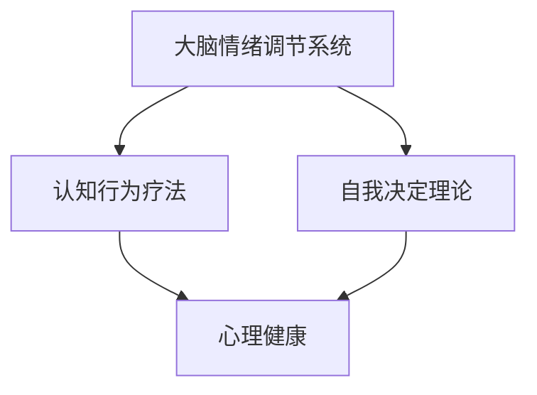

                 


### 与不完美和解：Self-Acceptance的艺术

> **关键词**：自我接纳、心理健康、人际关系、职业发展、挑战应对
>
> **摘要**：本文探讨了自我接纳的概念、理论、实践技巧以及在生活中的应用。通过深入分析自我接纳的重要性，我们了解到它在促进心理健康、改善人际关系、推动职业发展等方面的重要作用。同时，本文也详细介绍了自我接纳的实践技巧和挑战应对方法，以帮助读者更好地理解和应用自我接纳的艺术。

## 第一部分：理解自我接纳的概念

### 第1章：自我接纳的背景与意义

#### 1.1 自我接纳的重要性

**问题描述**：为什么自我接纳对个人幸福至关重要？

- **问题解决**：自我接纳有助于提升个人的心理健康，减少焦虑和抑郁。同时，它还能改善人际关系，使人们更易于与他人建立深层次的联系。

- **边界与外延**：自我接纳是一个涉及个体对自己内在特质、行为和外在表现的整体接受过程。它不仅关乎自我认知，还包括对自身存在的全方位接纳。

#### 1.2 自我接纳的历史和文化背景

**核心要素组成**：

- **西方哲学**：古希腊哲学家苏格拉底和斯多葛主义者强调了自我接纳的重要性，认为它是实现内心平静的关键。
- **东方哲学**：佛教中的“正念”和道家思想中的“无为”都强调了自我接纳的智慧。

**文化差异**：

- **西方文化**：强调个人主义和自我实现，往往鼓励人们追求个人目标和梦想。
- **东方文化**：重视集体主义和家庭价值观，往往更强调内在的平和与自我接纳。

#### 1.3 自我接纳的研究现状与前沿

**研究进展**：

- **心理学领域**：近年来，越来越多的研究关注自我接纳，探讨了其在心理健康和幸福方面的作用。
- **神经科学领域**：研究表明，自我接纳与大脑中的情绪调节系统密切相关。

**前沿领域**：

- **自我接纳在工作场所**：探讨自我接纳如何影响员工的满意度和工作效率。
- **自我接纳在领导力**：研究自我接纳如何帮助领导者提升团队绩效。

---

通过以上章节，我们初步了解了自我接纳的概念、历史和文化背景，以及其在心理学、神经科学等领域的最新研究进展。在接下来的章节中，我们将进一步深入探讨自我接纳的理论基础和实践技巧。

## 第二部分：自我接纳的理论与实践

### 第2章：自我接纳的理论基础

#### 2.1 自我接纳的理论模型

**核心概念原理**：

- **自我接纳模型**：自我接纳被视为一个多维度的过程，包括自我认识、自我接纳和自我接受三个层面。

**概念属性特征对比表格**：

| 概念         | 定义                                                         | 特点                                                       |
| ------------ | ------------------------------------------------------------ | ---------------------------------------------------------- |
| 自我认识     | 理解自己的内在特质和外在行为。                               | 强调自我了解和自我反思。                                   |
| 自我接纳     | 接受自己的内在特质和外在行为，无论优点还是缺点。             | 强调自我宽容和自我肯定。                                   |
| 自我接受     | 爱和尊重自己，接受自己的存在，无论外在环境如何。             | 强调自我价值和自我爱。                                     |

**ER实体关系图架构**：

使用Mermaid绘制自我接纳的心理机制图：

```mermaid
erDiagram
  Person ||--|{ Self-Awareness } Self-Awareness : 理解自己的特质和行为
  Person ||--|{ Self-Acceptance } Self-Acceptance : 接受自己的优点和缺点
  Person ||--|{ Self-Compassion } Self-Compassion : 爱和尊重自己
```

#### 2.2 自我接纳的心理机制

**心理学研究**：

- **认知行为疗法**：自我接纳被视为改善心理健康的有效策略。
- **自我决定理论**：强调自我接纳是实现自我决定的关键。

**ER实体关系图架构**：

使用Mermaid绘制自我接纳的心理机制图：



通过以上章节，我们深入探讨了自我接纳的理论基础，包括核心概念原理、概念属性特征对比表格和ER实体关系图架构。在下一章节中，我们将介绍自我接纳的实践技巧。

### 第3章：自我接纳的实践技巧

#### 3.1 自我观察与自我反思

**实践步骤**：

1. **设定目标**：明确想要观察和反思的方面，例如情绪、行为或思维模式。
2. **记录日志**：每天花时间记录自己的观察和反思，无论是纸笔记录还是电子日志。
3. **定期回顾**：定期回顾日志，分析自己的成长和进步。

**案例分析**：

以一位职场人士为例，他通过自我观察和反思，发现了自己过度焦虑的倾向。通过记录和分析，他意识到焦虑与工作压力和自我期望过高有关。通过调整期望和学会放松，他逐渐改善了焦虑状况。

#### 3.2 增强自我接纳的技巧

**实践技巧**：

1. **自我肯定**：每天对自己说一些积极的肯定话语，如“我值得被爱”、“我有能力解决问题”。
2. **感恩练习**：每天花时间思考并记录自己感激的事物，培养感恩的心态。
3. **接受不完美**：认识到每个人都是不完美的，接受自己的不足，并将其视为成长的机会。

**技巧解析**：

- **自我肯定**：通过积极的自我对话，提升自我价值感，增强自我接纳。
- **感恩练习**：培养感恩心态，有助于看到自己的优点和成功，减少自我批评。
- **接受不完美**：了解不完美是人类的一部分，有助于减少自我压力和焦虑。

通过以上章节，我们介绍了自我接纳的实践技巧，包括自我观察与自我反思以及增强自我接纳的技巧。在下一章节中，我们将探讨自我接纳在生活中的应用。

### 第4章：自我接纳在生活中的应用

#### 4.1 自我接纳与心理健康

**心理健康的影响**：

- **减少焦虑和抑郁**：自我接纳有助于减少因自我批评和自我怀疑引起的焦虑和抑郁。
- **增强自尊和自信**：通过接纳自己的优点和缺点，人们能够建立更强的自尊和自信。

**实践案例**：

一位长期遭受焦虑困扰的女性，通过自我接纳练习，学会了接受自己的情绪和思维模式。她不再对自己过度苛责，而是以更宽容和理解的态度对待自己。这不仅减轻了她的焦虑症状，还提高了她的生活质量和幸福感。

#### 4.2 自我接纳与人际关系

**人际关系的影响**：

- **改善沟通**：自我接纳有助于建立更开放和诚实的沟通，减少误解和冲突。
- **增强信任**：接受自己的不足，有助于建立更深层次的信任关系。

**案例分析**：

一位职场人士通过自我接纳，学会了接受同事的不同观点和行为。他不再对同事的缺点和错误过度反应，而是以理解和包容的态度对待他们。这不仅改善了同事关系，还提升了团队的整体效能。

### 第5章：自我接纳与职业生涯

#### 5.1 自我接纳与职业发展

**职业发展的作用**：

- **减少职业压力**：自我接纳有助于减少因工作失败或失败而引起的职业压力。
- **提升创造力**：自我接纳鼓励人们接受自己的不完美，从而激发创造力和创新思维。

**职业案例分析**：

一位创业者通过自我接纳，学会了接受自己的不足和失败。他不再因为一时的挫折而放弃，而是以积极的态度面对挑战，不断调整和改进。这种自我接纳的态度帮助他在创业过程中取得了显著的成功。

#### 5.2 自我接纳与创业精神

**创业精神的重要性**：

- **应对不确定性**：自我接纳有助于创业者接受不确定性，勇敢地面对风险和挑战。
- **持续成长**：自我接纳鼓励创业者从失败中学习，不断成长和改进。

**创业案例分析**：

一位年轻的创业者通过自我接纳，学会了接受自己的不完美和失败。他在创业初期遇到了许多困难，但他没有因此放弃。相反，他通过自我接纳和持续学习，逐渐找到了成功的道路。

### 第6章：自我接纳的挑战与应对

#### 6.1 自我接纳的常见挑战

**挑战识别**：

- **自我批评**：自我接纳过程中，人们常常面临自我批评的挑战，难以接受自己的不足。
- **恐惧失败**：担心失败和被拒绝，阻碍了自我接纳的实践。

**解决策略**：

1. **认知重构**：通过认知行为疗法等心理学方法，改变消极的自我认知。
2. **逐步实践**：从小事做起，逐渐扩大自我接纳的范围。

#### 6.2 应对自我接纳的困难

**应对方法**：

- **自我反思**：定期反思自己的行为和思维模式，识别并挑战消极的自我认知。
- **寻求支持**：与他人交流，分享自己的感受和挑战，寻求支持和鼓励。

**实践指导**：

1. **设定小目标**：从容易实现的目标开始，逐步建立自我接纳的信心。
2. **培养感恩**：通过感恩练习，看到自己的成就和优点，减少自我批评。

### 第7章：自我接纳的最佳实践

#### 7.1 自我接纳的最佳实践案例

**案例分享**：

一位职场人士通过自我接纳，学会了接受自己的不完美和失败。他不再因为一次失败而否定自己，而是将其视为成长的机会。通过不断调整和改进，他逐渐提升了工作效率和职业发展。

#### 7.2 小结与展望

**总结**：

自我接纳是一种强大的心理工具，能够帮助人们提升心理健康、改善人际关系和推动职业发展。通过实践自我接纳，人们可以更好地理解自己，建立积极的人际关系，实现个人目标和梦想。

**展望**：

自我接纳在未来将继续成为心理学和职业发展的重要领域。随着研究的深入，我们将进一步了解自我接纳的机制和最佳实践，为人们的心理健康和职业发展提供更有力的支持。

### 作者信息

作者：AI天才研究院/AI Genius Institute & 禅与计算机程序设计艺术 /Zen And The Art of Computer Programming

---

在本文中，我们通过逻辑清晰、结构紧凑的章节，详细探讨了自我接纳的概念、理论、实践技巧以及在生活中的应用。我们希望本文能够帮助读者更好地理解自我接纳的重要性，并在实践中应用这一理念，提升个人心理健康和职业发展。自我接纳是一种艺术，也是一种生活哲学，让我们一起拥抱不完美，走向更美好的未来。

