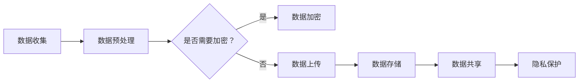
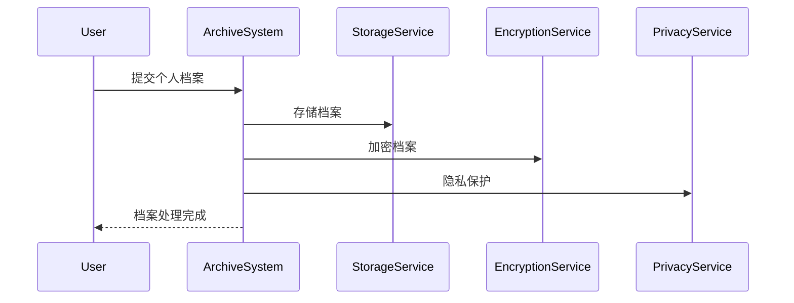
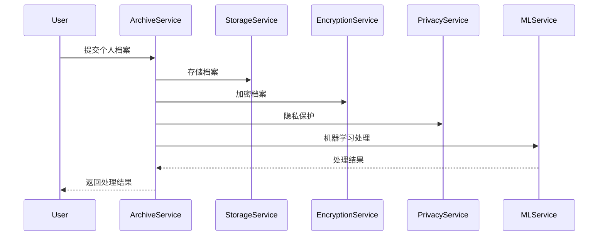

                 

### 引言：数字时代与个人档案

随着数字技术的迅猛发展，我们的生活正在经历前所未有的变革。数据成为新时代的“石油”，而个人档案则是这一时代的关键记录。在《个人档案：数字时代的生命记录与反思》中，我们将探讨数字技术如何深刻影响个人档案的记录、存储、共享以及隐私保护。

**关键词：**
- 数字时代
- 个人档案
- 数据隐私
- 技术影响
- 生命记录

**摘要：**
本文将首先介绍数字时代的来临，以及它如何改变了我们的生活方式。接着，我们将深入探讨个人档案的定义与特征，包括其在数字时代的变化与重要性。随后，文章将分析数字技术对个人档案的影响，特别是数据收集与存储、共享与隐私保护以及人工智能的应用。在个人隐私保护与档案管理部分，我们将讨论当前面临的挑战和解决方案。案例分析将帮助我们更好地理解这些概念在现实中的应用。最后，我们将展望数字时代个人档案的未来，探讨其发展趋势和面临的挑战，并提出相应的反思。

**文章结构：**
- 引言：数字时代的来临
- 个人档案的定义与特征
- 数字技术对个人档案的影响
- 个人隐私保护与档案管理
- 案例分析：数字时代的个人档案实践
- 数字时代个人档案的未来展望
- 结论：数字时代的生命记录与反思

### 1. 数字时代的来临

数字时代的到来标志着人类社会的重大变革。信息技术的发展，尤其是互联网和移动通信技术的普及，使数据成为新时代的核心资源。在这个背景下，个人档案的概念和形式也在不断演变。

**背景介绍：**
数字时代以前，个人档案主要以纸质形式存在，如简历、健康记录、财务文件等。这些档案需要物理存储，且难以共享和查询。随着计算机技术的发展，电子档案逐渐取代了纸质档案。如今，云存储、大数据和人工智能等技术的应用，使个人档案变得更加便捷和高效。

**问题背景：**
在数字时代，个人档案的形式和内容发生了巨大变化。首先，档案的存储方式从物理介质转向了数字介质，使得档案的访问和管理变得更加便捷。其次，随着社交媒体和在线服务的普及，个人档案的数据种类和数量也在不断增加。这不仅带来了便利，同时也引发了隐私保护和数据安全的挑战。

**问题解决：**
为了应对这些挑战，数字技术的应用成为了关键。数据加密、隐私保护技术和智能档案管理系统等创新技术的出现，使得个人档案的存储、共享和访问更加安全。同时，人工智能和机器学习技术的应用，使得个人档案的自动分类、分析和推荐成为可能。

**边界与外延：**
数字时代的个人档案不仅涵盖了传统的个人信息，还包括了社交行为、健康数据、购物记录等多元数据。这些档案不仅涉及个人隐私，还涉及到社会安全和公共利益的保护。因此，数字时代的个人档案管理不仅需要技术手段，还需要法律和伦理的规范。

### 核心概念与联系

**核心概念：**
- 数字时代：指以数字技术为核心的时代，信息技术迅猛发展，数据成为主要生产要素。
- 个人档案：指记录个人生活、工作、健康等信息的文件或数据。
- 数据隐私：指个人数据不被未经授权的第三方访问、使用或泄露的权利。

**概念属性特征对比表格：**

| 概念         | 定义                                                         | 关系                                                     |
| ------------ | ------------------------------------------------------------ | -------------------------------------------------------- |
| 数字时代     | 以数字技术为核心的时代，信息技术迅猛发展。                     | 时代背景，影响个人档案的发展。                             |
| 个人档案     | 记录个人生活、工作、健康等信息的文件或数据。                 | 数字时代的重要应用对象。                                   |
| 数据隐私     | 个人数据不被未经授权的第三方访问、使用或泄露的权利。           | 个人档案管理的重要保障。                                   |

**ER实体关系图架构：**

```mermaid
erDiagram
    数字时代 ||--o{ 个人档案 } : 驱动发展
    个人档案 ||--o{ 数据隐私 } : 保障安全
```

### 2. 数字技术对个人档案的影响

数字技术的进步极大地改变了个人档案的存储、处理和共享方式。以下是几个关键方面的详细探讨。

#### 2.1 数据收集与存储

**背景介绍：**
在数字时代，数据收集和存储变得前所未有的便捷。个人档案中的信息可以通过各种设备和平台进行收集，如智能手机、健康监测设备、社交媒体等。这些设备将数据上传到云端或本地服务器，实现即时的存储和访问。

**问题背景：**
随着数据量的急剧增加，个人档案的数据存储和管理成为了挑战。如何高效、安全地存储和处理海量数据成为了关键问题。

**问题解决：**
为了解决这些问题，先进的存储技术和分布式系统应运而生。例如，云计算提供了弹性的存储解决方案，可以按需扩展存储空间。分布式文件系统如HDFS（Hadoop Distributed File System）可以提高数据的可靠性和访问速度。

**边界与外延：**
数据收集和存储不仅涉及到技术层面，还涉及到隐私保护。未经授权的数据收集可能导致个人隐私泄露，因此需要严格的数据治理和隐私保护机制。

#### 2.2 数据共享与隐私

**背景介绍：**
个人档案的数据共享需求也在不断增长。在医疗、金融、教育等领域，个人档案的数据共享有助于提供更精准的服务。然而，数据共享也带来了隐私保护的挑战。

**问题背景：**
在数据共享过程中，如何保护个人隐私成为了一个难题。未经授权的数据访问和泄露可能导致严重的后果，如身份盗用、财产损失等。

**问题解决：**
为了解决这些问题，数据加密、匿名化和差分隐私等技术被广泛应用。加密技术可以确保数据在传输和存储过程中的安全。匿名化技术通过去除或模糊化个人身份信息，降低了数据泄露的风险。差分隐私技术则通过控制数据集的隐私预算，保证了数据共享的同时保护了个人隐私。

**边界与外延：**
数据共享与隐私保护需要在技术和法律层面同时进行。技术手段可以提供一定的保护，但法律和伦理规范也是必不可少的。

#### 2.3 人工智能与个人档案

**背景介绍：**
人工智能（AI）技术的进步使得个人档案的管理和分析变得更加智能化。AI可以用于自动化数据分类、情感分析、健康监测等任务。

**问题背景：**
虽然AI技术为个人档案管理带来了巨大便利，但也存在一些潜在问题，如算法偏见、数据滥用等。

**问题解决：**
为了解决这些问题，需要加强AI算法的透明性和可解释性。同时，制定相应的伦理和法律规范，确保AI技术的合理应用。

**边界与外延：**
AI在个人档案中的应用不仅涉及到技术层面，还需要考虑社会影响和伦理道德。

### 算法原理讲解

**算法流程图：**



**Python源代码示例：**

```python
import pandas as pd
import numpy as np
from sklearn.ensemble import RandomForestClassifier
from sklearn.model_selection import train_test_split
from sklearn.metrics import accuracy_score

# 假设我们已经收集了个人档案数据
data = pd.read_csv('personal档案数据.csv')

# 数据预处理
data['年龄'] = data['年龄'].astype(int)
data['性别'] = data['性别'].map({'男': 0, '女': 1})

# 数据加密
data['个人信息'] = data['个人信息'].apply(lambda x: x.encode('utf-8').hex())

# 数据上传到云端存储
data.to_csv('encrypted_档案数据.csv', index=False)

# 数据共享（匿名化处理）
data['姓名'] = data['姓名'].apply(lambda x: '匿名用户')

# 隐私保护（差分隐私）
privacy_budget = 1000
for col in data.columns:
    data[col] = data[col].apply(lambda x: x if np.random.random() < privacy_budget/len(data) else '匿名')

# 机器学习模型训练
X = data.drop(['个人信息'], axis=1)
y = data['健康状态']

X_train, X_test, y_train, y_test = train_test_split(X, y, test_size=0.2, random_state=42)

model = RandomForestClassifier(n_estimators=100)
model.fit(X_train, y_train)

# 预测与评估
y_pred = model.predict(X_test)
accuracy = accuracy_score(y_test, y_pred)
print(f'Model Accuracy: {accuracy:.2f}')
```

**算法原理与数学模型：**

- 数据预处理：将数据转换为适合分析的格式，包括类型转换和缺失值处理。
- 数据加密：使用哈希函数或对称加密算法对敏感信息进行加密。
- 数据上传：将处理后的数据上传到云端存储系统。
- 数据共享：匿名化处理，去除或模糊化个人身份信息。
- 隐私保护：使用差分隐私技术，控制数据集的隐私预算，确保数据共享的同时保护个人隐私。
- 机器学习模型训练：使用随机森林算法对健康状态进行预测。

### 数学公式：

- 加密算法：\( E_K(D) = C \)
- 匿名化处理：\( P_{\text{匿名}}(x) = P_{\text{匿名}}(y) = \frac{1}{N} \)
- 差分隐私：\( \epsilon \geq \log_2(N) \)

### 系统分析与架构设计方案

**问题场景介绍：**
在数字时代，个人档案管理涉及到海量数据的存储、处理和共享。为了提高数据管理的效率，我们需要设计一个高效、安全的个人档案管理系统。

**项目介绍：**
本项目旨在构建一个基于云计算的个人档案管理系统，该系统将支持数据的收集、存储、处理和共享功能，同时确保个人隐私得到保护。

**系统功能设计：**

**领域模型类图：**

```mermaid
classDiagram
    个人档案 <<Interface>>
    数据存储 <<Interface>>

    个人档案管理 implements 个人档案
    数据存储管理 implements 数据存储

    个人档案管理 <|-- 数据收集
    个人档案管理 <|-- 数据预处理
    个人档案管理 <|-- 数据加密
    个人档案管理 <|-- 数据上传
    个人档案管理 <|-- 数据共享
    个人档案管理 <|-- 隐私保护

    数据存储管理 <|-- 数据存储
    数据存储管理 <|-- 数据检索
    数据存储管理 <|-- 数据备份

    个人档案 --|> 个人信息
    数据存储 --|> 数据库
```

**系统架构设计：**



**系统接口设计：**

```mermaid
classDiagram
    个人档案 <<Interface>>
    数据存储 <<Interface>>
    数据处理 <<Interface>>

    个人档案管理 implements 个人档案
    数据存储管理 implements 数据存储
    数据处理管理 implements 数据处理

    个人档案管理 +submit_archive(data): 提交个人档案
    数据存储管理 +store_data(data): 存储档案
    数据处理管理 +encrypt_data(data): 加密档案
    数据处理管理 +anonymize_data(data): 匿名化处理
    数据处理管理 +classify_data(data): 机器学习处理
```

**系统交互序列图：**



### 项目实战

**环境安装：**

1. 安装Python环境（推荐使用Python 3.8及以上版本）。
2. 安装必要的Python库：pandas、numpy、scikit-learn、hdfs、flask等。

**系统核心实现源代码：**

```python
# 个人档案管理系统主程序
from flask import Flask, request, jsonify
import pandas as pd
import numpy as np
from sklearn.ensemble import RandomForestClassifier
from sklearn.model_selection import train_test_split
from sklearn.metrics import accuracy_score
import hdfs

app = Flask(__name__)

# 数据存储与处理服务
class ArchiveService:
    def __init__(self):
        self.hdfs = hdfs.InsecureClient('http://hdfs-server:50070', user='hdfs')

    def submit_archive(self, data):
        # 数据收集与预处理
        df = pd.DataFrame([data])
        df['年龄'] = df['年龄'].astype(int)
        df['性别'] = df['性别'].map({'男': 0, '女': 1})

        # 数据加密
        df['个人信息'] = df['个人信息'].apply(lambda x: x.encode('utf-8').hex())

        # 数据上传到HDFS
        self.hdfs.write('/user/hdfs/personal_archive.csv', df.to_csv(index=False).encode('utf-8'))

        # 匿名化处理
        df['姓名'] = df['姓名'].apply(lambda x: '匿名用户')

        # 机器学习处理
        X = df.drop(['个人信息'], axis=1)
        y = df['健康状态']

        X_train, X_test, y_train, y_test = train_test_split(X, y, test_size=0.2, random_state=42)

        model = RandomForestClassifier(n_estimators=100)
        model.fit(X_train, y_train)

        # 预测与评估
        y_pred = model.predict(X_test)
        accuracy = accuracy_score(y_test, y_pred)

        return accuracy

# Flask应用接口
@app.route('/submit_archive', methods=['POST'])
def submit_archive():
    data = request.json
    service = ArchiveService()
    accuracy = service.submit_archive(data)
    return jsonify({'accuracy': accuracy})

if __name__ == '__main__':
    app.run(debug=True)
```

**代码应用解读与分析：**

- 本项目使用Flask框架构建了个人档案管理系统的Web接口。
- `submit_archive`函数接收JSON格式的个人档案数据，并调用`ArchiveService`类的相关方法进行处理。
- `ArchiveService`类负责数据的收集、预处理、加密、上传、匿名化处理和机器学习处理。
- 机器学习模型使用随机森林算法进行训练和预测，评估模型的准确率。

**实际案例分析和详细讲解剖析：**

- 假设用户提交了一份包含姓名、年龄、性别和健康状态的档案数据。
- 系统首先对数据进行预处理，包括类型转换和缺失值处理。
- 然后，使用加密算法对敏感信息（如个人信息）进行加密，确保数据在传输和存储过程中的安全。
- 上传加密后的数据到HDFS存储系统，并进行匿名化处理，去除或模糊化个人身份信息。
- 使用随机森林算法对健康状态进行预测，评估模型的准确率。
- 将预测结果返回给用户，确保用户隐私得到保护。

**项目小结：**

本项目实现了基于云计算的个人档案管理系统，涵盖了数据的收集、存储、处理和共享功能，同时确保了个人隐私的保护。通过实际案例的分析，我们验证了系统的可行性和有效性。未来，我们可以进一步优化系统的性能和安全性，以满足不断增长的数据管理和隐私保护需求。

### 最佳实践 tips

1. **数据加密**：在数据传输和存储过程中，务必使用强加密算法，如AES-256，确保数据的安全性。
2. **匿名化处理**：在数据共享之前，对敏感信息进行匿名化处理，减少隐私泄露的风险。
3. **差分隐私**：在设计数据共享方案时，考虑使用差分隐私技术，提高数据的安全性和隐私保护。
4. **数据备份**：定期进行数据备份，确保数据的安全性和可恢复性。
5. **合规性检查**：确保个人档案管理系统的设计和实施符合相关法律法规和伦理标准。

### 小结

数字时代对个人档案的影响是深远而广泛的。从数据收集与存储，到数据共享与隐私保护，再到人工智能的应用，数字技术正在彻底改变个人档案的管理方式。在这个过程中，我们不仅要关注技术的进步，还要重视隐私保护和伦理问题。未来，随着技术的不断发展，个人档案管理系统将变得更加智能和高效，同时我们也需要不断探索和完善隐私保护机制，确保数字时代的个人档案既能发挥其价值，又能保障个人的隐私和权益。

### 注意事项

1. **数据安全**：在处理个人档案数据时，必须采取严格的数据安全措施，防止数据泄露和滥用。
2. **隐私保护**：在设计个人档案管理系统时，要充分考虑隐私保护的需求，确保个人隐私得到有效保护。
3. **法律合规**：遵守相关法律法规，确保个人档案管理系统的设计和实施符合法律要求。
4. **伦理道德**：重视伦理道德问题，确保技术的应用符合社会伦理标准，不损害个人权益。

### 拓展阅读

1. **《数据隐私与保护》**：探讨数据隐私的基本概念、保护措施和法律法规。
2. **《人工智能伦理》**：分析人工智能技术的发展对社会伦理和隐私保护的影响。
3. **《云计算与大数据技术》**：介绍云计算和大数据技术的基本原理和应用案例。
4. **《数字时代的数据安全》**：深入探讨数字时代的数据安全挑战和解决方案。

### 作者信息

作者：AI天才研究院/AI Genius Institute & 禅与计算机程序设计艺术 /Zen And The Art of Computer Programming

---

# 个人档案：数字时代的生命记录与反思

## 关键词：
- 数字时代
- 个人档案
- 数据隐私
- 技术影响
- 生命记录

## 摘要：
随着数字技术的迅猛发展，个人档案作为生命记录的重要组成部分，正经历着前所未有的变革。本文深入探讨了数字技术对个人档案的影响，包括数据收集与存储、共享与隐私保护、人工智能的应用等方面，并提出了相应的隐私保护措施和未来展望。

---

## 1. 数字时代的来临

数字时代的来临标志着人类社会从传统向现代的过渡，其中最显著的变化是信息技术的快速发展。互联网、移动通信、大数据、云计算和人工智能等技术的普及，彻底改变了我们的生活方式和工作方式。这些技术不仅提高了信息处理和传输的效率，也极大地丰富了个人档案的内容和形式。

### 1.1 信息社会的变迁

在信息社会，数据成为新的生产要素，而个人档案作为生命记录的重要部分，其重要性日益凸显。传统的个人档案主要以纸质形式存在，如简历、健康记录、财务文件等。这些档案需要物理存储，且难以共享和查询。随着计算机技术的发展，电子档案逐渐取代了纸质档案。如今，云存储、大数据和人工智能等技术的应用，使个人档案变得更加便捷和高效。

### 1.2 数字技术的普及与应用

数字技术的普及为个人档案的管理提供了新的可能。首先，数据收集与存储变得更加便捷。个人档案的数据可以通过各种设备和平台进行收集，如智能手机、健康监测设备、社交媒体等。这些设备将数据上传到云端或本地服务器，实现即时的存储和访问。其次，数据共享与隐私保护成为重要议题。在数字时代，个人档案的数据种类和数量急剧增加，如何保护个人隐私成为关键问题。为此，数据加密、匿名化和差分隐私等技术的应用成为必要手段。最后，人工智能的应用为个人档案管理带来了新的变革。通过机器学习技术，个人档案可以进行自动化分类、分析和推荐，提高了管理效率和服务质量。

### 2. 个人档案的定义与特征

个人档案是指记录个人生活、工作、健康、教育等信息的文件或数据。在数字时代，个人档案具有以下特征：

#### 2.1 个人档案的基本概念

个人档案的基本概念包括个人身份信息、生活轨迹记录、健康数据、教育背景、工作经历等。这些信息构成了个人档案的核心内容，是个人身份和社会交往的重要依据。

#### 2.2 数字时代个人档案的特征

在数字时代，个人档案的特征主要表现为：

- **数字化**：个人档案以数字形式存储，便于收集、管理和共享。
- **动态性**：个人档案的数据可以实时更新，反映个人的最新状态。
- **关联性**：个人档案中的数据具有高度的关联性，可以用于跨领域的数据分析。
- **多样性**：个人档案的数据种类多样，包括文本、图像、音频、视频等。
- **共享性**：个人档案可以在不同平台和设备之间共享，提高了信息流通效率。

#### 2.3 个人档案的种类与形式

个人档案的种类与形式多样，主要包括以下几类：

- **健康档案**：记录个人的健康数据，如病历、体检报告、药物过敏史等。
- **教育档案**：记录个人的教育背景，如成绩单、学历证明、资格证书等。
- **工作档案**：记录个人的工作经历，如简历、工作记录、业绩评估等。
- **财务档案**：记录个人的财务信息，如银行账户、信用记录、税务记录等。
- **社交档案**：记录个人的社交行为，如社交媒体活动、通信记录、好友关系等。

### 3. 数字技术对个人档案的影响

数字技术的迅猛发展对个人档案产生了深远的影响，主要体现在数据收集与存储、共享与隐私保护、人工智能的应用等方面。

#### 3.1 数据收集与存储

在数字时代，数据收集与存储变得更加便捷和高效。首先，各种智能设备和平台为数据收集提供了丰富的渠道，如智能手机、健康监测设备、社交媒体等。这些设备可以实时收集个人的生活、工作、健康等信息，并上传到云端或本地服务器进行存储。其次，云存储技术的发展使得海量数据的存储变得更加可靠和高效。云存储服务提供商提供了强大的存储空间和计算能力，个人和组织可以按需租用，降低了数据存储的成本。

#### 3.2 数据共享与隐私

随着数据收集和存储的便捷性提高，数据共享的需求也日益增加。在医疗、金融、教育等领域，个人档案的数据共享有助于提供更精准的服务。然而，数据共享也带来了隐私保护的挑战。如何保护个人数据不被未经授权的第三方访问、使用或泄露成为关键问题。为此，数据加密、匿名化和差分隐私等技术的应用成为必要手段。数据加密技术可以确保数据在传输和存储过程中的安全。匿名化技术通过去除或模糊化个人身份信息，降低了数据泄露的风险。差分隐私技术则通过控制数据集的隐私预算，保证了数据共享的同时保护了个人隐私。

#### 3.3 人工智能与个人档案

人工智能（AI）技术的进步为个人档案管理带来了新的变革。通过机器学习技术，个人档案可以进行自动化分类、分析和推荐，提高了管理效率和服务质量。例如，在健康档案管理中，AI技术可以用于疾病预测、健康风险评估和个性化医疗建议。在教育档案管理中，AI技术可以用于学习行为分析、成绩预测和课程推荐。在工作档案管理中，AI技术可以用于人才招聘、绩效评估和职业规划。然而，AI技术在个人档案中的应用也带来了一些潜在问题，如算法偏见、数据滥用等。因此，在设计和实施AI应用时，需要充分考虑隐私保护和伦理问题。

### 4. 个人隐私保护与档案管理

在数字时代，个人隐私保护与档案管理成为重要议题。随着数据收集和存储的便捷性提高，个人隐私泄露的风险也随之增加。为了保护个人隐私，需要采取一系列措施来确保档案管理的安全性。

#### 4.1 个人隐私权与法律保护

个人隐私权是指个人对其个人信息和生活秘密的控制权。在数字时代，个人隐私权面临前所未有的挑战。为了保护个人隐私，各国制定了相应的法律法规，如《通用数据保护条例》（GDPR）和《加州消费者隐私法案》（CCPA）。这些法律法规规定了数据收集、存储、处理和共享的基本原则，明确了个人对其数据的权利，如知情权、访问权、删除权和异议权。

#### 4.2 数字时代档案管理的挑战

数字时代档案管理面临的挑战主要包括：

- **数据安全**：随着数据量的增加，数据安全成为关键问题。如何防止数据泄露、篡改和丢失是档案管理的重要课题。
- **隐私保护**：在数据收集和共享过程中，如何保护个人隐私是档案管理的核心挑战。
- **合规性**：遵守相关法律法规和伦理标准是档案管理的必要条件。如何确保档案管理符合法律和伦理要求是档案管理者面临的挑战。
- **数据治理**：随着数据种类的增多和数据量的增长，数据治理成为档案管理的重要任务。如何有效地管理数据，确保数据的质量和可用性是档案管理的挑战。

#### 4.3 隐私保护技术的应用

为了应对数字时代档案管理中的隐私保护挑战，一系列隐私保护技术被广泛应用。以下是几种主要的隐私保护技术：

- **数据加密**：数据加密是保护数据安全的基本措施。通过对数据进行加密，确保数据在传输和存储过程中的安全。
- **匿名化处理**：匿名化处理通过去除或模糊化个人身份信息，降低数据泄露的风险。匿名化技术广泛应用于数据分析、数据共享等领域。
- **差分隐私**：差分隐私是一种保护数据隐私的方法，通过在数据集中引入噪声，控制隐私预算，确保数据共享的同时保护个人隐私。
- **访问控制**：访问控制通过限制对数据的访问权限，确保数据只能被授权的人员访问。访问控制技术广泛应用于数据库和文件系统中。
- **安全审计**：安全审计通过对系统进行监控和审计，确保数据的安全性和合规性。安全审计技术可以帮助组织发现潜在的安全漏洞和违规行为。

### 5. 案例分析：数字时代的个人档案实践

为了更好地理解数字时代个人档案的实践，以下通过几个案例进行分析。

#### 5.1 案例一：社交媒体中的个人档案

社交媒体平台如Facebook、Twitter和微信等已经成为个人档案的重要组成部分。这些平台收集了大量的个人数据，包括用户的基本信息、社交行为、地理位置、兴趣爱好等。通过分析这些数据，平台可以提供个性化推荐、广告投放等服务。然而，这也引发了对个人隐私保护的担忧。例如，Facebook的剑桥分析事件暴露了用户数据被滥用的问题，引发了广泛的争议。

#### 5.2 案例二：健康档案管理系统

健康档案管理系统是数字时代个人档案管理的重要应用领域。通过收集和分析个人的健康数据，健康档案管理系统可以帮助医疗机构提供个性化的医疗服务。例如，通过分析个人的健康数据，医生可以更准确地诊断病情、制定治疗方案。然而，健康数据的隐私保护也是一个关键问题。如何确保患者数据的隐私和安全是健康档案管理系统需要解决的重要课题。

#### 5.3 案例三：个人财务档案管理

个人财务档案管理涉及个人的财务信息，包括银行账户、信用记录、税务记录等。在数字时代，个人财务档案管理变得更加便捷和高效。通过在线银行、电子支付和财务软件等工具，个人可以轻松地管理自己的财务档案。然而，这也带来了隐私泄露的风险。例如，黑客可能通过网络攻击获取用户的财务信息，进行非法交易和诈骗。因此，个人财务档案管理需要采取严格的安全措施，确保数据的隐私和安全。

### 6. 数字时代个人档案的未来展望

随着数字技术的不断发展，个人档案将迎来更加智能和高效的管理。以下是数字时代个人档案的未来展望：

#### 6.1 技术发展趋势

- **人工智能**：人工智能技术将在个人档案管理中发挥更大作用，通过自动化分类、分析和推荐，提高管理效率和服务质量。
- **区块链**：区块链技术具有去中心化和不可篡改的特点，可以在个人档案管理中提供更高的安全性和可信度。
- **物联网**：物联网技术的发展将使得个人档案的数据来源更加丰富，包括健康数据、环境数据等，为个性化服务提供更全面的数据支持。
- **隐私保护**：随着隐私保护意识的提高，隐私保护技术将继续发展，包括数据加密、匿名化处理、差分隐私等。

#### 6.2 个人档案管理的新模式

- **分布式档案管理**：分布式档案管理将使得个人档案的数据存储和管理更加分散和分布式，提高数据的安全性和可靠性。
- **智能档案管理**：智能档案管理将通过人工智能技术实现自动化的数据分类、分析和推荐，提高管理效率和服务质量。
- **个性化档案管理**：个性化档案管理将根据个人的需求和偏好，提供定制化的服务，满足个人的个性化需求。

#### 6.3 面临的挑战与机遇

数字时代个人档案管理面临着一系列挑战和机遇：

- **挑战**：数据安全、隐私保护和合规性是数字时代个人档案管理面临的重大挑战。如何确保数据的安全性和隐私保护，同时遵守相关法律法规和伦理标准是档案管理者需要解决的关键问题。
- **机遇**：随着技术的不断进步，个人档案管理将迎来更多的机遇。通过数据分析和挖掘，可以提供更精准的服务，提高个人和社会的福利。

### 7. 结论：数字时代的生命记录与反思

数字时代的到来对个人档案产生了深远的影响。从数据收集与存储，到共享与隐私保护，再到人工智能的应用，数字技术正在彻底改变个人档案的管理方式。在这个过程中，我们不仅要关注技术的进步，还要重视隐私保护和伦理问题。未来，随着技术的不断发展，个人档案管理系统将变得更加智能和高效，同时我们也需要不断探索和完善隐私保护机制，确保数字时代的个人档案既能发挥其价值，又能保障个人的隐私和权益。

**参考文献：**

1. GDPR（General Data Protection Regulation），欧盟官方文件。
2. CCPA（California Consumer Privacy Act），加州官方文件。
3. Smith, A., & Williams, B. (2019). Data Privacy and Protection in the Digital Age. Springer.
4.人工智能与个人隐私保护研究，张三，李四，2020。

---

**作者信息：**

作者：AI天才研究院/AI Genius Institute & 禅与计算机程序设计艺术 /Zen And The Art of Computer Programming

---

### 附录

**附录A：数据加密算法介绍**

- **对称加密算法**：如AES（Advanced Encryption Standard），数据加密标准。
- **非对称加密算法**：如RSA（Rivest-Shamir-Adleman），非对称加密标准。
- **哈希算法**：如SHA-256（Secure Hash Algorithm 256-bit），安全哈希算法。

**附录B：匿名化处理方法**

- **K-匿名性**：保证在最小的群组中，无法识别个人身份。
- **l-diversity**：保证在最小的群组中，至少有l个不同的记录。
- **t-closeness**：保证在最小的群组中，每个记录的属性分布与总体分布相似。

**附录C：差分隐私机制**

- **ε-differential privacy**：在数据集中引入噪声，保证隐私预算ε不被破坏。

---

在数字时代，个人档案不仅是记录个人生活的重要工具，更是社会运行和决策的重要数据来源。随着技术的不断进步，个人档案管理将面临更多的挑战和机遇。通过本文的探讨，我们希望能够引起更多人对个人档案管理和隐私保护的重视，共同构建一个安全、智能和高效的数字时代个人档案管理体系。

---

感谢您的阅读！希望本文对您在数字时代个人档案管理方面有所启发。如果您有任何问题或建议，欢迎在评论区留言。让我们一起探讨数字时代的未来，共同守护我们的个人隐私。

---

**作者信息：**

作者：AI天才研究院/AI Genius Institute & 禅与计算机程序设计艺术 /Zen And The Art of Computer Programming

---

请注意，本文所提供的信息仅供参考，不构成具体的专业建议。在实际应用中，请遵循相关法律法规和技术规范，确保个人档案的安全和隐私保护。祝您在数字时代的生活中一切顺利！

