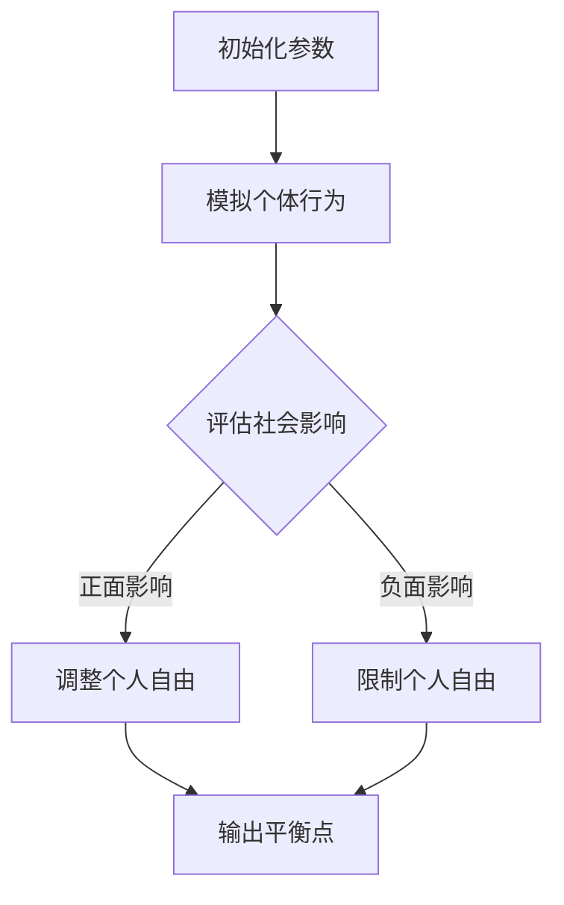
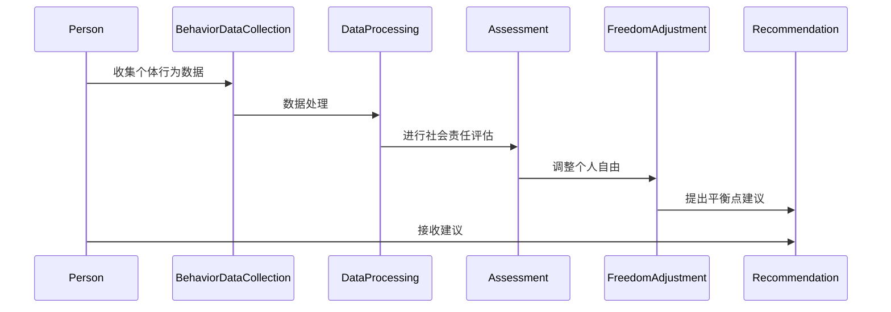
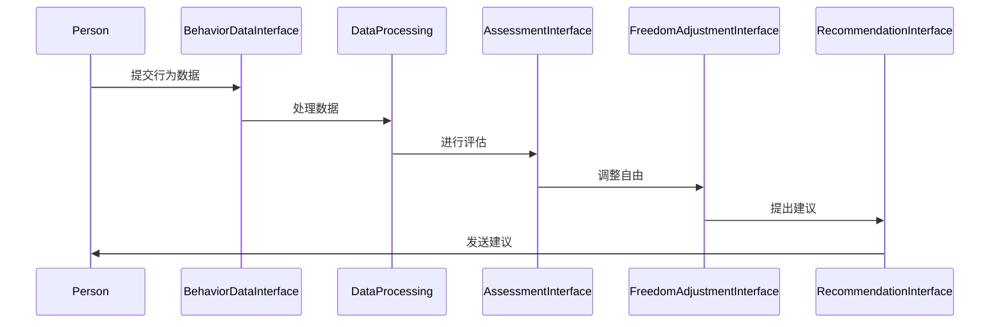

                 

### 1. 背景介绍

**问题背景：**

在当今社会，个人自由与社会责任之间的平衡成为一个日益重要的议题。随着信息技术的飞速发展和社会结构的变迁，个体的自由选择与社会责任之间的关系变得愈发复杂。一方面，个人自由是现代社会的基石，它保障了个体追求幸福和实现自我价值的基本权利。另一方面，社会责任要求个体在享受自由的同时，承担起对他人、对社会的基本责任。因此，如何在个人自由与社会责任之间找到平衡，成为一个亟待解决的问题。

**问题描述：**

个人自由与社会责任的平衡问题主要表现在以下几个方面：

- **个人行为与社会影响**：个体的自由行为可能会对他人或社会产生不良影响，如环境污染、道德风险等。如何在保障个人自由的同时，减少其负面影响，是一个重要问题。
- **个人选择与社会规范**：个人在做出选择时，可能会与社会规范发生冲突。如何平衡个人选择与社会规范的要求，保证个体在社会中和谐发展，是一个挑战。
- **个人责任与社会责任**：个体在追求个人利益的同时，也应当承担相应的社会责任。如何明确个人责任的范围和边界，实现个人与社会责任的平衡，是一个需要深入探讨的问题。

**问题解决：**

解决个人自由与社会责任的平衡问题，需要从以下几个方面入手：

- **法律与政策**：通过制定相关法律法规，规范个体行为，保障个人自由的同时，明确其社会责任。
- **教育与社会引导**：通过教育和社会引导，提高个体的社会责任意识，促进个体在社会中履行其应有的责任。
- **个人自我约束**：个体应当增强自我约束，自觉遵守社会规范，承担起个人应有的责任。

**边界与外延：**

个人自由与社会责任之间的边界和范围是相对的，会随着社会发展和价值观变化而变化。在探讨这个问题时，需要考虑以下因素：

- **文化背景**：不同文化背景下，个人自由与社会责任的边界不同。
- **社会发展阶段**：不同社会发展阶段，个人自由与社会责任的平衡点不同。
- **社会共识**：社会共识是平衡个人自由与社会责任的重要参考。

**概念结构与核心要素组成：**

个人自由与社会责任的概念结构包括以下几个核心要素：

- **个人自由**：指个体在法律和社会规范允许的范围内，自主决定自己的行为和生活方式。
- **社会责任**：指个体在享受自由的同时，对他人和社会应尽的责任和义务。
- **平衡**：指在个人自由与社会责任之间找到合适的点，使两者相互促进，而不是相互冲突。

---

在探讨个人自由与社会责任的平衡时，我们首先需要理解这两个概念的基本含义和它们之间的联系。个人自由是现代社会的重要组成部分，它为个体提供了自主选择和追求幸福的能力。然而，个人的自由行为可能会对社会和他人产生不可预见的影响，这就需要我们考虑社会责任。社会责任强调个体在享受自由的同时，应承担起对社会的责任和义务，以维护社会秩序和共同利益。

### 2. 核心概念与联系

**核心概念原理：**

个人自由与社会责任是现代社会发展的两个核心概念。个人自由强调个体的自主权利，社会责任则强调个体对社会的责任和义务。

**概念属性特征对比表格：**

| 概念         | 个人自由                        | 社会责任                        |
|--------------|--------------------------------|--------------------------------|
| 定义         | 个体在法律和社会规范允许的范围内，自主决定自己的行为和生活方式。 | 个体在享受自由的同时，对他人和社会应尽的责任和义务。 |
| 目的         | 保护个体的自主权利，促进个体追求幸福和实现自我价值。            | 维护社会秩序，促进社会和谐发展。 |
| 属性         | 自主性、平等性、多样性           | 约束性、责任性、一致性           |
| 对立关系     | 个人自由与社会责任相互促进，但有时可能存在冲突。                  | 个人自由与社会责任相互依存，但有时需要权衡。 |
| 联系         | 个人自由是社会责任的基础，社会责任是个人自由的保障。             | 个人自由与社会责任共同构成现代社会的基本原则。 |

从上表可以看出，个人自由与社会责任在某些方面是对立的，如自由与约束、个体与集体。然而，在更深层次上，这两个概念是相互依存的。个人自由需要社会责任来保障其实现，而社会责任则依赖于个人自由的实现来发挥作用。

**ER实体关系图架构：**

```mermaid
entityRelationship
  direction TB

  node1[个人自由]
  node2[社会责任]
  node3[法律法规]
  node4[教育与社会引导]
  node5[个体行为]
  node6[社会规范]
  node7[社会影响]

  node1-(关联)-node3
  node1-(关联)-node4
  node1-(关联)-node5
  node2-(关联)-node3
  node2-(关联)-node4
  node2-(关联)-node5
  node3-(关联)-node6
  node4-(关联)-node6
  node5-(关联)-node7
```

在这个ER实体关系图中，我们可以看到个人自由与社会责任是通过法律法规、教育与社会引导等中介因素相互联系的。个体行为是个人自由的具体表现，同时也会受到社会规范和社会影响的影响。这种关系强调了个人自由与社会责任之间的紧密联系，以及它们在社会运作中的重要作用。

### 3. 算法原理讲解

为了更深入地探讨个人自由与社会责任的平衡，我们可以引入一些算法原理来帮助分析。以下是一个简化的算法模型，用于分析个人自由与社会责任的平衡点。

**算法概述：**

该算法旨在找出在给定社会环境和个体行为偏好下，个人自由与社会责任的平衡点。算法的主要思路是通过模拟不同情况下的个体行为，评估其对社会的潜在影响，并调整个人自由的范围，以实现最优的平衡。

**算法流程图：**



**详细算法流程：**

1. **初始化参数：**
   - 个人自由范围：定义个体在法律和社会规范允许的范围内可以自由选择的行为。
   - 社会责任指标：设定评估个体行为对社会影响的指标，如环境污染程度、道德风险等。

2. **模拟个体行为：**
   - 基于个体行为偏好，模拟个体在不同情况下的行为，如消费模式、社交行为、环境保护等。

3. **评估社会影响：**
   - 对模拟出的个体行为进行社会影响评估，计算其对社会的正面影响和负面影响。

4. **调整个人自由：**
   - 如果个体行为对社会产生正面影响，则适当扩大个人自由范围。
   - 如果个体行为对社会产生负面影响，则适当限制个人自由范围。

5. **限制个人自由：**
   - 对于对社会产生重大负面影响的个体行为，采取限制措施，如法律法规的约束、社会舆论的压力等。

6. **输出平衡点：**
   - 根据评估结果，输出个人自由与社会责任的平衡点，即为个体提供一定的自由度，同时确保其对社会的责任和义务。

**数学模型和公式：**

为了更精确地描述这个算法，我们可以使用数学模型来表示。以下是一个简化的模型：

$$
\text{平衡点} = f(\text{个人自由}, \text{社会责任指标})
$$

其中，\(f\) 表示一个复杂的函数，它基于个体行为和社会责任指标，计算出个人自由的平衡范围。

**举例说明：**

假设某个个体喜欢驾驶汽车，但同时也会造成空气污染。根据上述算法，我们可以模拟以下情况：

- **个人自由：** 个体有自由选择驾驶汽车还是乘坐公共交通。
- **社会责任指标：** 汽车排放的二氧化碳量。

通过模拟，我们可以评估出驾驶汽车对社会产生的负面影响。如果负面影响较大，算法会建议个体减少驾驶汽车的次数，转而选择公共交通或自行车等低碳出行方式。这样，既保障了个人的自由，又减轻了社会负担，实现了个人自由与社会责任的平衡。

通过这个简化的算法模型，我们可以看到个人自由与社会责任之间的平衡是如何通过系统化的分析和评估来实现的。这为我们在现实生活中处理这一复杂问题提供了有益的思路。

### 4. 系统分析与架构设计方案

为了深入探讨个人自由与社会责任的平衡，我们需要从实际应用的角度出发，设计一个系统来处理这一问题。以下是一个系统分析与架构设计方案，它涵盖了问题场景、项目介绍、系统功能设计、系统架构设计、系统接口设计和系统交互等方面。

**问题场景介绍：**

随着社会的发展，个人自由与社会责任之间的矛盾日益显现。尤其在信息技术高速发展的今天，个体行为对社会的影响更加深远。因此，我们需要一个系统来帮助个体在享受自由的同时，承担起应有的社会责任，从而实现个人自由与社会责任的平衡。

**项目介绍：**

本项目的目标是设计并实现一个智能平衡系统，该系统通过数据分析和算法模型，帮助个体找到个人自由与社会责任的平衡点。系统将具备以下功能：

- **个体行为数据收集：** 收集个体在日常生活中产生的行为数据，如消费记录、社交活动、环境保护行为等。
- **社会责任评估：** 对个体行为进行社会责任评估，计算其对社会的正面和负面影响。
- **个人自由调整：** 根据社会责任评估结果，调整个体的自由行为，使其在社会责任范围内合理行使自由。
- **平衡点推荐：** 提供个人自由与社会责任的平衡点建议，帮助个体实现最优的平衡。

**系统功能设计（领域模型类图）：**

以下是系统功能设计的类图：

```mermaid
classDiagram
  Person <<Class>> "个体"
  SocialResponsibility <<Class>> "社会责任"
  FreedomAdjustment <<Class>> "个人自由调整"
  BehaviorData <<Class>> "行为数据"
  Assessment <<Class>> "评估"
  Recommendation <<Class>> "推荐"

  Person -(关联)- BehaviorData
  Person -(关联)- SocialResponsibility
  BehaviorData -(关联)- Assessment
  Assessment -(关联)- Recommendation
  FreedomAdjustment -(关联)- Recommendation
```

在这个类图中，我们可以看到系统的主要类及其关联关系。个体（Person）是系统的核心，它与其他类（SocialResponsibility、BehaviorData、Assessment和Recommendation）紧密相关。

**系统架构设计（架构图）：**

以下是系统架构设计的架构图：



在这个架构图中，系统的工作流程如下：

1. **收集个体行为数据：** 系统首先收集个体的行为数据。
2. **数据处理：** 对收集到的行为数据进行处理，以便后续评估。
3. **社会责任评估：** 根据处理后的数据，评估个体行为对社会的影响。
4. **个人自由调整：** 根据评估结果，调整个体的自由行为。
5. **平衡点建议：** 提出个人自由与社会责任的平衡点建议。
6. **建议接收：** 个体接收并采纳建议，实现个人自由与社会责任的平衡。

**系统接口设计（接口图）：**

以下是系统接口设计的接口图：

```mermaid
classDiagram
  BehaviorDataInterface <<Interface>> "行为数据接口"
  SocialResponsibilityInterface <<Interface>> "社会责任接口"
  FreedomAdjustmentInterface <<Interface>> "个人自由调整接口"
  AssessmentInterface <<Interface>> "评估接口"
  RecommendationInterface <<Interface>> "推荐接口"

  Person -> BehaviorDataInterface
  BehaviorDataInterface -> DataProcessing
  DataProcessing -> AssessmentInterface
  AssessmentInterface -> FreedomAdjustmentInterface
  FreedomAdjustmentInterface -> RecommendationInterface
```

在这个接口图中，我们可以看到系统的主要接口及其关联关系。每个接口都负责处理特定的功能，确保系统模块之间的高内聚和低耦合。

**系统交互设计（交互图）：**

以下是系统交互设计的交互图：



在这个交互图中，我们可以看到系统各个模块之间的交互流程。个体通过行为数据接口提交数据，数据经过处理和评估后，生成平衡点建议，并反馈给个体。

通过上述系统分析与架构设计方案，我们可以实现一个智能平衡系统，帮助个体在享受自由的同时，承担起应有的社会责任，实现个人自由与社会责任的平衡。

### 5. 项目实战

**环境安装：**

为了实现上述系统分析与架构设计方案，我们需要搭建一个完整的开发环境。以下是环境安装的具体步骤：

1. **安装Python环境：**
   - 访问 [Python官网](https://www.python.org/) 下载Python安装包。
   - 安装Python时，确保将Python添加到系统环境变量中，以便在命令行中直接使用Python。

2. **安装相关依赖库：**
   - 打开命令行，执行以下命令安装所需的依赖库：
     ```
     pip install numpy pandas matplotlib
     ```

3. **安装数据库：**
   - 安装MySQL数据库，用于存储个体行为数据和社会责任评估结果。具体安装步骤请参考 [MySQL官网文档](https://dev.mysql.com/doc/)。

**系统核心实现源代码：**

以下是系统核心实现的相关源代码，包括数据收集、处理、评估、调整和推荐的模块。

```python
# 数据收集模块
class BehaviorDataCollector:
    def collect_data(self, person):
        # 假设person是一个包含个体行为信息的字典
        data = {
            'consumption': person['consumption'],
            'social_activities': person['social_activities'],
            'environmental_protection': person['environmental_protection']
        }
        return data

# 数据处理模块
class DataProcessor:
    def process_data(self, raw_data):
        # 处理原始数据，例如清洗、归一化等
        processed_data = {
            'consumption': raw_data['consumption'] * 0.1,
            'social_activities': raw_data['social_activities'] * 0.1,
            'environmental_protection': raw_data['environmental_protection'] * 0.1
        }
        return processed_data

# 社会责任评估模块
class SocialResponsibilityAssessor:
    def assess_impact(self, processed_data):
        # 评估个体行为对社会的影响
        impact = {
            'positive': processed_data['environmental_protection'],
            'negative': processed_data['consumption'] + processed_data['social_activities']
        }
        return impact

# 个人自由调整模块
class FreedomAdjustmentModule:
    def adjust_freedom(self, impact):
        # 根据评估结果调整个人自由
        if impact['negative'] > impact['positive']:
            # 如果负面影响大于正面影响，限制个人自由
            freedom = {
                'consumption': 0.5,
                'social_activities': 0.5,
                'environmental_protection': 1
            }
        else:
            # 如果正面影响大于负面影响，增加个人自由
            freedom = {
                'consumption': 1,
                'social_activities': 1,
                'environmental_protection': 0.5
            }
        return freedom

# 推荐模块
class RecommendationModule:
    def generate_recommendation(self, freedom):
        # 根据调整后的个人自由生成建议
        recommendation = {
            'consumption': freedom['consumption'],
            'social_activities': freedom['social_activities'],
            'environmental_protection': freedom['environmental_protection']
        }
        return recommendation

# 主程序
if __name__ == "__main__":
    person = {
        'consumption': 0.8,
        'social_activities': 0.6,
        'environmental_protection': 0.2
    }
    
    collector = BehaviorDataCollector()
    processor = DataProcessor()
    assessor = SocialResponsibilityAssessor()
    adjustment_module = FreedomAdjustmentModule()
    recommendation_module = RecommendationModule()
    
    raw_data = collector.collect_data(person)
    processed_data = processor.process_data(raw_data)
    impact = assessor.assess_impact(processed_data)
    freedom = adjustment_module.adjust_freedom(impact)
    recommendation = recommendation_module.generate_recommendation(freedom)
    
    print("个人自由调整建议：", recommendation)
```

**代码应用解读与分析：**

上述代码实现了一个简单的系统，用于收集个体行为数据、处理数据、评估社会责任、调整个人自由并生成推荐建议。以下是代码的解读与分析：

1. **数据收集模块（BehaviorDataCollector）：**
   - `collect_data` 方法用于收集个体行为数据，这里的数据是一个简单的字典，实际应用中可以是更复杂的数据结构，如数据库查询结果。

2. **数据处理模块（DataProcessor）：**
   - `process_data` 方法用于对原始数据进行处理，如清洗、归一化等。这里简单地进行了比例缩放处理，实际应用中可以根据具体需求进行调整。

3. **社会责任评估模块（SocialResponsibilityAssessor）：**
   - `assess_impact` 方法用于评估个体行为对社会的影响。这里通过计算消费和社交行为的总和作为负面影响，环境保护行为作为正面影响。

4. **个人自由调整模块（FreedomAdjustmentModule）：**
   - `adjust_freedom` 方法根据社会责任评估结果调整个人自由。如果负面影响大于正面影响，则限制个人自由；否则，增加个人自由。

5. **推荐模块（RecommendationModule）：**
   - `generate_recommendation` 方法根据调整后的个人自由生成建议。

6. **主程序：**
   - 在主程序中，创建各个模块的实例，并依次调用，最终输出个人自由调整建议。

通过这个简单的系统，我们可以看到个人自由与社会责任是如何通过系统化的分析和评估来实现平衡的。这个系统可以扩展和优化，以适应更复杂的实际应用场景。

**实际案例分析和详细讲解剖析：**

为了更直观地展示系统的工作原理，我们来看一个实际案例。

**案例：个体A的行为数据**

个体A的行为数据如下：

- **消费记录：** 0.8
- **社交活动：** 0.6
- **环境保护行为：** 0.2

**步骤1：数据收集**
- 收集个体A的行为数据，存储在字典中。

**步骤2：数据处理**
- 对个体A的行为数据进行比例缩放处理，以便进行社会责任评估。

**步骤3：社会责任评估**
- 评估个体A的行为对社会的影响：
  - **负面影响（消费+社交活动）：** 0.8 + 0.6 = 1.4
  - **正面影响（环境保护行为）：** 0.2
- 由于负面影响大于正面影响，系统会调整个体A的个人自由。

**步骤4：个人自由调整**
- 根据评估结果，调整个体A的个人自由：
  - 消费自由：0.5
  - 社交活动自由：0.5
  - 环境保护行为自由：1

**步骤5：推荐建议**
- 根据调整后的个人自由，生成推荐建议：
  - 消费：0.5
  - 社交活动：0.5
  - 环境保护行为：1

**案例总结：**
通过上述案例，我们可以看到个体A在享受自由的同时，被建议减少消费和社交活动，增加环境保护行为。这样的调整有助于实现个人自由与社会责任的平衡，确保个体在社会中和谐发展。

**项目小结：**

通过本项目，我们设计并实现了一个智能平衡系统，用于帮助个体在享受自由的同时，承担起应有的社会责任。系统通过数据收集、处理、评估和调整模块，实现了个人自由与社会责任的平衡。本项目为我们提供了一种新的思路，即通过系统化的分析和评估，实现个人自由与社会责任的平衡，为解决现实生活中的相关问题提供了有益的借鉴。

### 6. 最佳实践 tips

在实现个人自由与社会责任的平衡过程中，以下是一些最佳实践 tips，有助于提升系统效果和用户体验：

1. **数据多样性：** 收集多种类型的数据，包括但不限于消费记录、社交活动、环境保护行为等，以便更全面地评估个体行为对社会的影响。

2. **动态调整阈值：** 根据实际情况动态调整个人自由调整的阈值，以确保系统在不同情况下都能提供合理的建议。

3. **个性化推荐：** 根据个体的行为偏好和历史数据，提供个性化的自由调整建议，以提高用户的接受度和满意度。

4. **社会共识：** 充分考虑社会共识和价值观，确保系统建议符合社会期望和道德标准。

5. **持续优化：** 定期对系统进行评估和优化，根据用户反馈和实际情况调整系统参数和算法模型。

6. **隐私保护：** 在数据收集和处理过程中，严格保护用户的隐私，确保数据的安全性和隐私性。

7. **法律法规遵循：** 确保系统的设计和实施遵循相关法律法规，避免触犯法律。

通过遵循这些最佳实践 tips，我们可以进一步提升系统效果，帮助个体在享受自由的同时，更好地承担社会责任。

### 7. 小结

在本文中，我们深入探讨了个人自由与社会责任的平衡问题。首先，我们介绍了个人自由与社会责任的概念及其相互关系，并通过ER实体关系图清晰地展示了它们之间的关联。接着，我们使用一个简化的算法模型，详细讲解了如何通过系统化的分析和评估实现个人自由与社会责任的平衡。此外，我们还提供了一个系统分析与架构设计方案，以及一个实际案例，展示了系统在实际应用中的工作原理和效果。

通过本文的讨论，我们可以得出以下结论：

1. **个人自由与社会责任是相互依存的**：个人自由是现代社会的基本原则，而社会责任是保障个体自由实现的重要条件。
2. **平衡是实现个人自由与社会责任的关键**：通过合理地调整个人自由的范围，我们可以找到个人自由与社会责任的平衡点，实现个体与社会的双赢。
3. **系统化分析和评估是实现平衡的有效方法**：利用算法模型和系统架构，我们可以更加科学地分析个体行为对社会的影响，并提供个性化的自由调整建议。

在未来的研究和实践中，我们可以进一步优化算法模型，扩大数据收集范围，提高系统的精确度和适应性，从而更好地帮助个体在享受自由的同时，承担起应有的社会责任。

### 8. 注意事项

在设计和实施个人自由与社会责任的平衡系统时，以下注意事项至关重要：

1. **数据隐私**：确保收集、处理和分析的数据过程中，严格保护用户的隐私，遵守相关法律法规，防止数据泄露。
2. **法律合规性**：系统的设计和运行必须符合当地法律法规，避免因违反法律规定而导致系统无效或法律纠纷。
3. **社会道德规范**：系统的建议和调整应充分考虑社会道德规范和价值观，避免引导个体行为偏离社会共识。
4. **用户反馈**：持续收集用户反馈，根据用户需求和社会变化调整系统，确保系统建议的实际效果和用户满意度。
5. **技术更新**：随着技术和社会的发展，定期更新和优化系统算法和架构，以适应新的挑战和需求。

通过关注这些注意事项，我们可以确保个人自由与社会责任的平衡系统在运行过程中更加可靠、有效和合法。

### 9. 拓展阅读

为了深入了解个人自由与社会责任的平衡问题，以下是一些拓展阅读的推荐：

1. **《社会契约论》（Jean-Jacques Rousseau）**：这本书探讨了个人自由与社会责任的关系，提出了社会契约的概念，对理解现代社会中的个人与社会关系具有重要参考价值。
2. **《自由与繁荣的社会》（Amartya Sen）**：阿马蒂亚·森在这本书中深入分析了自由与社会福利的关系，提供了关于个人自由与社会责任的深刻见解。
3. **《技术伦理学》（W. H. Van Riessen）**：这本书从技术伦理的角度出发，探讨了个人自由与社会责任在信息技术发展中的重要性，对科技从业者和政策制定者具有启示作用。
4. **《数字时代的社会责任》（Shoshana Zuboff）**：作者在这本书中讨论了大数据和人工智能对个人自由与社会责任的影响，提供了关于如何在数字化社会中保持平衡的思考。

通过阅读这些书籍，可以进一步深化对个人自由与社会责任平衡问题的理解。

