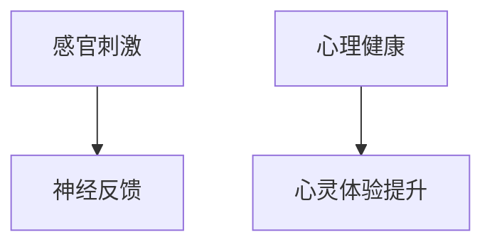
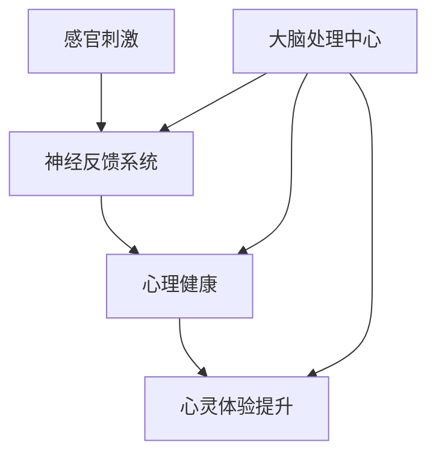

                 

### 设计《丰富感官和心灵体验：全方位提升生活品质》目录大纲

在撰写技术博客文章《丰富感官和心灵体验：全方位提升生活品质》时，我们将采用逻辑清晰、结构紧凑、简单易懂的专业技术语言。为了确保文章的深度和可读性，我们将按照以下大纲结构进行组织，并在每个部分中逐步深入探讨相关的核心内容。

#### 目录大纲总字数限制在2000字以内，需包含以下核心内容：

1. **背景介绍**：核心概念、问题背景、问题描述、问题解决、边界与外延、概念结构与核心要素组成。
2. **核心概念与联系**：核心概念原理、概念属性特征对比表格和ER实体关系图架构的 Mermaid 流程图。
3. **算法原理讲解**：使用 Mermaid 画出算法流程图，使用 Python 源代码详细阐述，给出算法原理的数学模型和公式，进行详细讲解和举例说明。
4. **数学模型和数学公式 & 详细讲解 & 举例说明**：数学公式使用 LaTeX 格式，嵌入文中独立段落使用 `$$` 括起来，段落内的 LaTeX 公式前后使用 `$` 括起来。
5. **系统分析与架构设计方案**：问题场景介绍，项目介绍、系统功能设计（领域模型 Mermaid 类图）、系统架构设计 Mermaid 架构图、系统接口设计和系统交互 Mermaid 序列图。
6. **项目实战**：环境安装、系统核心实现源代码，代码应用解读与分析，实际案例分析和详细讲解剖析，项目小结。
7. **最佳实践 tips、小结、注意事项、拓展阅读等内容**。

#### 目录大纲示例：

```markdown
----------------------------------------------------------------
# 第一部分: 感官与心灵体验提升的基础知识

## 1.1. 感官与心灵体验：基本概念与问题背景

### 1.1.1 感官体验的基本概念

### 1.1.2 心灵体验的基本概念

### 1.1.3 两者之间的关系与融合

## 1.2. 核心概念与联系

### 1.2.1 感官刺激与神经反馈机制

#### 1.2.1.1 神经科学视角下的感官刺激

#### 1.2.1.2 神经反馈系统的运作原理

### 1.2.2 心理健康与心灵体验提升

#### 1.2.2.1 心理健康的核心指标

#### 1.2.2.2 心灵体验提升的策略与方法

## 1.3. ER实体关系图架构



----------------------------------------------------------------

# 第二部分: 视觉体验提升

## 2.1. 视觉感知与色彩理论

### 2.1.1 视觉感知的基本原理

### 2.1.2 色彩理论及应用

## 2.2. 视觉刺激与神经反馈机制

### 2.2.1 视觉刺激对感官体验的影响

### 2.2.2 视觉神经反馈机制的探究

## 2.3. 视觉体验提升实践案例

### 2.3.1 艺术展览设计的视觉提升策略

### 2.3.2 户外活动的视觉体验优化

----------------------------------------------------------------

# 第三部分: 听觉体验提升

## 3.1. 听觉体验的基本原理

### 3.1.1 听觉信号的处理过程

### 3.1.2 音频信号与心理反应

## 3.2. 听觉刺激与神经反馈机制

### 3.2.1 听觉刺激的种类与影响

### 3.2.2 听觉神经反馈机制的探索

## 3.3. 听觉体验提升实践案例

### 3.3.1 音乐疗法的应用

### 3.3.2 声音环境优化的实际操作

----------------------------------------------------------------

# 第四部分: 嗅觉、味觉和触觉体验提升

## 4.1. 嗅觉体验的基本原理

### 4.1.1 嗅觉信号的处理与解读

### 4.1.2 嗅觉对情绪的影响

## 4.2. 味觉体验的基本原理

### 4.2.1 味觉信号的处理与感知

### 4.2.2 味觉与心理健康的关系

## 4.3. 触觉体验的基本原理

### 4.3.1 触觉信号的处理与反应

### 4.3.2 触觉对心理状态的影响

## 4.4. 多感官综合体验提升实践

### 4.4.1 美食体验的设计与优化

### 4.4.2 触觉艺术馆的体验设计

----------------------------------------------------------------

# 第五部分: 心灵体验提升

## 5.1. 心灵体验的心理学基础

### 5.1.1 心理学理论概述

### 5.1.2 心灵体验的核心要素

## 5.2. 心灵体验提升的实践策略

### 5.2.1 冥想与正念练习

### 5.2.2 自我反思与认知重塑

## 5.3. 心灵体验提升实践案例

### 5.3.1 企业员工心灵成长计划

### 5.3.2 心灵健康社区活动设计

----------------------------------------------------------------

# 结束语

## 6.1. 总结

## 6.2. 最佳实践 tips

## 6.3. 注意事项

## 6.4. 拓展阅读

----------------------------------------------------------------
通过上述目录大纲示例，我们可以清晰地看到文章的结构和每个部分的核心内容。每个章节都将按照逻辑顺序展开，首先介绍基本概念和背景，然后深入探讨相关原理和实践案例，最后在结束部分进行总结和拓展阅读推荐。这样的结构有助于读者系统地理解和掌握文章内容。接下来，我们将逐章撰写详细内容，确保文章的逻辑性和专业性。### 第一部分: 感官与心灵体验提升的基础知识

#### 1.1. 感官与心灵体验：基本概念与问题背景

**1.1.1 感官体验的基本概念**

感官体验是指人类通过视觉、听觉、嗅觉、味觉和触觉等五个感官对外界刺激的反应过程。这些感官接收外界信息，经过大脑处理，转化为我们能够理解和感知的体验。例如，我们看到美丽的景色、听到动听的音乐、嗅到香气扑鼻的花朵、尝到美味的食物、触摸柔软的织物，都是感官体验的具体表现。

**1.1.2 心灵体验的基本概念**

心灵体验则涉及到更为深层次的心理感受和情感反应。它不仅仅是对外界刺激的直接感知，更是一种主观的内心体验，包括情绪、感觉、思想、意识等心理层面的内容。心灵体验常常与个人的情感状态、心理需求以及价值观密切相关。例如，在观看一部感人的电影时，我们可能会感到悲伤、感动或激励，这些都是心灵体验的具体表现。

**1.1.3 两者之间的关系与融合**

感官体验和心灵体验并不是完全独立的，它们之间存在密切的关联和互动。感官体验为心灵体验提供了物质基础，而心灵体验则赋予感官体验以意义和价值。例如，在品味美食时，我们不仅通过味觉感受到食物的美味，还会通过心灵体验来欣赏其背后的文化内涵和制作技艺。

**1.2. 核心概念与联系**

**1.2.1 感官刺激与神经反馈机制**

感官刺激是指外界通过感官接收器传入人体的各种刺激，如视觉刺激、听觉刺激等。神经反馈机制是指人体的神经系统通过处理感官刺激，产生相应的生理和心理反应，从而调节和适应外界环境。

**1.2.1.1 神经科学视角下的感官刺激**

从神经科学的角度来看，感官刺激通过神经元传递信息，最终在大脑皮层产生感知。例如，视觉刺激通过视网膜上的感光细胞转换为神经信号，传递到视觉皮层，最终形成我们看到的图像。

**1.2.1.2 神经反馈系统的运作原理**

神经反馈系统是一个动态的调节机制，它使得我们的身体能够适应不断变化的环境。例如，当我们感受到寒冷时，神经反馈系统会通过调节身体温度来适应环境。

**1.2.2 心理健康与心灵体验提升**

心理健康是指个体在心理上处于良好的状态，能够有效应对生活中的压力和挑战。心理健康与心灵体验提升密切相关。一个心理健康的人更容易体验到积极的心灵体验，从而提高生活质量。

**1.2.2.1 心理健康的核心指标**

心理健康的核心指标包括情绪稳定、自我认知、社会适应、心理弹性等。一个心理健康的人能够有效地管理情绪，正确地认识自我，适应社会环境，并在面对压力时保持心理弹性。

**1.2.2.2 心灵体验提升的策略与方法**

提升心灵体验的方法包括冥想、正念练习、自我反思、情感管理、心理咨询等。这些方法能够帮助人们更好地管理情绪，增强心理韧性，提高生活质量。

**1.3. ER实体关系图架构**

为了更好地理解感官刺激、神经反馈机制、心理健康和心灵体验提升之间的关系，我们可以使用ER（实体关系）图来描述它们之间的关联。



在这个ER图中，感官刺激通过神经反馈系统传递到大脑处理中心，进而影响心理健康和心灵体验提升。大脑处理中心作为核心枢纽，协调各个系统之间的相互作用。

通过上述对感官与心灵体验提升的基础知识的介绍，我们为接下来的详细探讨奠定了坚实的基础。接下来，我们将分别深入探讨视觉、听觉、嗅觉、味觉和触觉等感官体验的提升方法，以及心灵体验的心理学基础和实践策略。### 第二部分: 视觉体验提升

#### 2.1. 视觉感知与色彩理论

**2.1.1 视觉感知的基本原理**

视觉感知是指人类通过眼睛接收光信号，经过大脑处理，形成对周围环境的感知和理解。视觉感知的基本原理涉及光线的接收、处理和解释。

光线首先通过角膜、晶状体等眼部结构，聚焦在视网膜上。视网膜上的感光细胞，包括视杆细胞和视锥细胞，将光信号转化为神经信号。视杆细胞主要负责暗视觉和运动检测，而视锥细胞则负责色觉和细节感知。这些神经信号随后通过视神经传递到大脑视觉皮层，最终形成视觉感知。

**2.1.2 色彩理论及应用**

色彩理论是视觉体验的重要组成部分。色彩的三原色是红色、绿色和蓝色，它们通过不同的组合和比例可以产生其他所有颜色。色彩理论在视觉设计中有着广泛的应用，如艺术创作、UI设计、广告宣传等。

色彩对情绪有着显著的影响。例如，红色通常与激情、能量和热情相关，而蓝色则与冷静、信任和专业相关。在视觉体验提升中，合理运用色彩理论可以增强视觉刺激的效果，提升用户的情感体验。

**2.2. 视觉刺激与神经反馈机制**

**2.2.1 视觉刺激对感官体验的影响**

视觉刺激对感官体验有着重要的影响。适当的视觉刺激可以增强感官体验的丰富性和深度，而过于强烈的视觉刺激可能会导致感官疲劳和不适。

例如，在观看3D电影时，立体视觉的刺激可以大大增强观众的沉浸感，使观众更加投入故事情节。然而，长时间的3D观影也可能导致视觉疲劳和头痛。

**2.2.2 视觉神经反馈机制的探究**

视觉神经反馈机制是指大脑对视觉刺激的处理和调节过程。大脑通过神经反馈系统监测视觉刺激的强度和类型，并根据需要调整视觉处理策略。

例如，当光线过强时，瞳孔会自动收缩以减少光线进入眼睛的数量，从而保护视网膜。此外，大脑还会根据视觉刺激的内容和情境，调整视觉注意力和认知处理策略。

**2.3. 视觉体验提升实践案例**

**2.3.1 艺术展览设计的视觉提升策略**

艺术展览设计中的视觉提升策略旨在通过视觉元素的设计，增强观众的参观体验。以下是一些具体的策略：

1. **色彩运用**：合理运用色彩对比和色彩搭配，创造视觉焦点，引导观众视线流动。
2. **灯光设计**：通过灯光的明暗对比和色彩变化，营造出特定的氛围，增强作品的视觉效果。
3. **空间布局**：利用空间布局的层次感和流动性，使观众在参观过程中感受到节奏和韵律。

**2.3.2 户外活动的视觉体验优化**

户外活动如露营、徒步旅行等，视觉体验同样重要。以下是一些视觉体验优化的建议：

1. **自然景观的选择**：选择具有丰富视觉元素的景观，如山脉、湖泊、森林等，以增强视觉刺激。
2. **装备选择**：选择适合户外环境的装备，如变色眼镜、防风帐篷等，以适应不同的视觉需求。
3. **观景点的规划**：提前规划观景点，确保观众在户外活动中能够有良好的视觉体验。

通过上述实践案例，我们可以看到视觉体验提升在艺术展览和户外活动中的重要性。合理运用视觉理论和技术手段，可以大大提升人们的感官体验和生活品质。### 第三部分: 听觉体验提升

#### 3.1. 听觉体验的基本原理

**3.1.1 听觉信号的处理过程**

听觉体验是指人类通过耳朵接收声音信号，经过大脑处理，形成对声音的感知和理解。听觉信号的处理过程可以分为以下几个步骤：

1. **声波接收**：声波通过空气或其他介质传播到耳朵，引起耳膜振动。
2. **声波放大**：声波振动通过中耳的三块小骨（锤骨、砧骨、镫骨）传递，并得到放大。
3. **内耳转换**：放大后的声波振动通过耳蜗内的液体传递到耳蜗内的毛细胞，将机械振动转换为电信号。
4. **神经传递**：电信号通过听神经传递到大脑听觉皮层，最终形成听觉感知。

**3.1.2 音频信号与心理反应**

音频信号不仅仅是物理振动，它还能够引起一系列的心理反应。音频信号的心理反应受到多个因素的影响，包括音调、音量、节奏、音色等。

1. **音调**：音调的高低与心理感受密切相关。高音调通常与兴奋、快乐相关，而低音调则与冷静、忧郁相关。
2. **音量**：音量的强弱会影响人们的情绪和注意力。适中的音量可以使人感到舒适和放松，而过于大声的音量可能会引起焦虑和不适。
3. **节奏**：节奏是音频信号的一个重要特征，它能够影响人们的情绪和行为。有规律的节奏可以产生稳定感和节奏感，而变化多端的节奏则能够带来兴奋和活力。
4. **音色**：音色是指声音的特质，它能够区分不同的声源。音色对情感表达有着重要影响，例如，温暖的音色通常与友好、亲切相关，而尖锐的音色则与紧张、恐惧相关。

#### 3.2. 听觉刺激与神经反馈机制

**3.2.1 听觉刺激的种类与影响**

听觉刺激可以分为自然声音和人工声音。自然声音如鸟鸣、雨声、海浪等，能够带来宁静和放松；人工声音如音乐、声音效果等，则可以激发情感和创造力。

1. **自然声音**：自然声音通常被认为具有治愈效果，能够减轻压力和焦虑。例如，在办公室中使用白噪音或自然声音，可以帮助员工集中注意力，提高工作效率。
2. **人工声音**：人工声音包括音乐、声音效果等，它们可以通过情感表达、氛围营造等方式，提升听觉体验。例如，音乐疗法就是利用音乐对心理和生理健康的积极影响，来帮助人们缓解压力和焦虑。

**3.2.2 听觉神经反馈机制的探索**

听觉神经反馈机制是指大脑如何处理和调节听觉刺激。这个机制包括以下几个关键步骤：

1. **听觉感知**：声波信号通过耳朵传递到大脑，大脑处理和解释这些信号，形成听觉感知。
2. **注意分配**：大脑会根据当前情境和需要，分配注意力到特定的听觉刺激上。例如，在嘈杂的环境中，大脑可能会优先处理紧急的声音信号，如汽车鸣笛声。
3. **情感反应**：大脑会根据听觉刺激的特质和情境，产生相应的情感反应。例如，听到悦耳的音乐会让人感到愉悦，而突然的巨大声响可能会引起惊吓。
4. **记忆形成**：大脑还会将听觉刺激编码成记忆，以便在未来识别和响应类似的刺激。

#### 3.3. 听觉体验提升实践案例

**3.3.1 音乐疗法的应用**

音乐疗法是一种利用音乐对心理和生理健康产生积极影响的干预方法。以下是一些具体的应用案例：

1. **减轻压力和焦虑**：在医院和康复中心，音乐疗法被广泛用于帮助患者减轻压力和焦虑。柔和的音乐可以帮助患者放松身心，提高睡眠质量。
2. **促进康复**：在康复治疗中，音乐疗法可以促进患者的身体和心理健康。例如，在物理治疗过程中，音乐可以帮助患者分散注意力，减轻疼痛和不适。
3. **改善情绪**：音乐疗法也可以用于改善情绪，例如，在抑郁症治疗中，音乐可以帮助患者提高情绪状态，增强积极的情感体验。

**3.3.2 声音环境优化的实际操作**

声音环境对听觉体验有着重要影响。以下是一些实际操作，可以帮助优化声音环境，提升听觉体验：

1. **噪声控制**：在嘈杂的环境中，使用隔音材料、耳塞等工具，可以有效减少噪声干扰，提高听觉体验。
2. **音响设备调整**：在家庭和办公环境中，合理调整音响设备的音量和音质，可以使声音更加清晰、舒适，提升听觉体验。
3. **声音设计**：在特定场所，如音乐会厅、电影院等，通过专业的设计和调试，可以使声音效果更加出色，提升听觉体验。

通过上述对听觉体验提升的探讨，我们可以看到，听觉体验的提升不仅涉及到听觉信号的处理过程，还包括听觉刺激的种类与影响、听觉神经反馈机制的探索，以及实际应用中的音乐疗法和声音环境优化。这些方法和技术手段可以帮助我们更好地提升听觉体验，从而丰富我们的生活品质。### 第四部分: 嗅觉、味觉和触觉体验提升

#### 4.1. 嗅觉体验的基本原理

**4.1.1 嗅觉信号的处理与解读**

嗅觉是一种通过鼻腔内的嗅觉受体接收气味分子，并将其转化为神经信号的过程。气味分子首先通过呼吸进入鼻腔，与鼻腔内的嗅觉感受器结合，产生电信号。这些信号通过嗅神经传递到大脑的嗅觉皮层，最终形成嗅觉感知。

嗅觉信号的处理过程包括以下几个步骤：

1. **气味分子识别**：气味分子与鼻腔内的嗅觉感受器结合，激活特定的嗅觉受体。
2. **神经信号传递**：激活的嗅觉受体产生电信号，通过嗅神经传递到大脑的嗅觉皮层。
3. **嗅觉感知形成**：大脑的嗅觉皮层处理神经信号，形成对气味的感知。

**4.1.2 嗅觉对情绪的影响**

嗅觉对情绪有着显著的影响。不同的气味可以引起不同的情绪反应。例如，柠檬的清新气味可以带来愉悦和活力，而咖啡的香气则可能激发紧张和兴奋。

研究表明，嗅觉对情绪的影响与大脑中的杏仁核和前额叶皮层密切相关。杏仁核负责情绪的处理和记忆，而前额叶皮层则参与决策和认知功能。当气味激活这些区域时，可以产生相应的情绪反应。

#### 4.2. 味觉体验的基本原理

**4.2.1 味觉信号的处理与感知**

味觉是通过舌头上的味蕾接收食物中的化学物质，并将其转化为神经信号的过程。味蕾分布在舌头表面，包括甜、酸、苦、咸、鲜等基本味觉类型。每种味觉类型都有特定的味觉受体，当食物中的化学物质与味觉受体结合时，会产生电信号。

味觉信号的处理过程包括：

1. **味觉感受**：食物中的化学物质与味觉受体结合，激活特定的味觉受体。
2. **神经信号传递**：激活的味觉受体产生电信号，通过味神经传递到大脑的味觉皮层。
3. **味觉感知形成**：大脑的味觉皮层处理神经信号，形成对味道的感知。

**4.2.2 味觉与心理健康的关系**

味觉不仅影响食物的口感，还与心理健康密切相关。例如，缺乏维生素B12可能导致味觉减退和抑郁症状。此外，食物中的营养物质如蛋白质、脂肪和碳水化合物等，对大脑功能的维持和情绪调节也具有重要影响。

研究表明，食物中的某些成分，如ω-3脂肪酸和抗氧化剂，可以通过改善大脑功能和减轻炎症反应，从而有助于心理健康。

#### 4.3. 触觉体验的基本原理

**4.3.1 触觉信号的处理与反应**

触觉是通过皮肤上的触觉感受器接收外界触觉刺激，并将其转化为神经信号的过程。触觉感受器分布在皮肤的不同区域，包括表皮、真皮和皮下组织。当触觉刺激作用于皮肤时，触觉感受器会产生电信号。

触觉信号的处理过程包括：

1. **触觉感受**：触觉刺激通过皮肤表面的触觉感受器产生反应。
2. **神经信号传递**：触觉感受器产生的电信号通过神经纤维传递到大脑的触觉皮层。
3. **触觉感知形成**：大脑的触觉皮层处理神经信号，形成对触觉的感知。

**4.3.2 触觉对心理状态的影响**

触觉对心理状态有着显著的影响。例如，温暖、柔软的触感可以带来舒适和放松的感觉，而冰冷、粗糙的触感则可能引起不安和紧张。触觉还可以通过社交互动，如拥抱、握手等，增强人与人之间的情感联系。

研究表明，触觉可以通过激活大脑中的多巴胺系统，产生愉悦感和幸福感。此外，触觉刺激还可以通过减轻压力和焦虑，改善心理健康。

#### 4.4. 多感官综合体验提升实践

**4.4.1 美食体验的设计与优化**

美食体验是嗅觉、味觉和触觉的综合体验。为了提升美食体验，以下是一些设计优化策略：

1. **气味搭配**：合理搭配食物的气味，如使用香草、柠檬等香气，增强美食的吸引力。
2. **口感设计**：通过改变食物的质地和温度，如加入奶油、冰淇淋等，提供丰富的口感体验。
3. **视觉设计**：使用色彩鲜艳的食材和精致的餐具，提升美食的视觉吸引力。

**4.4.2 触觉艺术馆的体验设计**

触觉艺术馆是一种结合视觉、听觉和触觉体验的展览形式。为了提升触觉艺术馆的体验，以下是一些设计优化策略：

1. **触觉材料选择**：选择安全、舒适的触觉材料，如软质布料、光滑金属等，提供不同的触觉体验。
2. **互动设计**：设置互动装置，如触摸屏幕、振动设备等，增强观众的参与感和体验感。
3. **氛围营造**：通过合适的灯光和声音设计，营造特定的氛围，增强观众的感官体验。

通过上述对嗅觉、味觉和触觉体验提升的探讨，我们可以看到，多感官综合体验的设计与优化对于提升生活品质具有重要意义。通过合理运用感官刺激和神经反馈机制，我们可以创造更加丰富和深刻的体验，从而提高我们的生活质量。### 第五部分: 心灵体验提升

#### 5.1. 心灵体验的心理学基础

**5.1.1 心理学理论概述**

心灵体验的提升离不开心理学的理论基础。心理学是研究人类行为和心理过程的科学，它为我们提供了理解心灵体验的理论框架。以下是几个关键心理学理论：

1. **认知行为理论**：认知行为理论认为，我们的思维和行为是相互影响的。通过改变思维模式，我们可以改变行为和情感反应。这个理论强调了自我认知和行为改变的重要性。
   
2. **正念疗法**：正念疗法是一种以正念为核心的心理学疗法，它强调专注于当前 moment，通过观察和接纳自己的思维和情感，减少压力和焦虑，提升心灵体验。

3. **人本主义心理学**：人本主义心理学关注个体的自我实现和主观体验。它认为每个人都有自我实现的动力，通过理解和支持个体的内在需求和价值观，可以提升心灵体验。

**5.1.2 心灵体验的核心要素**

心灵体验的核心要素包括自我认知、情感管理、价值观和动机等。以下是这些要素的详细解释：

1. **自我认知**：自我认知是指个体对自身身份、性格和情感的认识。通过自我反思和自我接纳，我们可以更好地理解自己的内心世界，提升心灵体验。

2. **情感管理**：情感管理是指个体如何识别、表达和调节自己的情感。有效的情感管理可以帮助我们更好地应对压力和挑战，提高生活质量。

3. **价值观**：价值观是指导个体行为和决策的基本原则。明确自己的价值观，可以帮助我们在生活中做出更符合内心需求的决策，提升心灵体验。

4. **动机**：动机是个体追求目标的心理驱动力。内在动机可以带来持续的动力和满足感，而外在动机则可能带来短期的满足但缺乏内在动力。

#### 5.2. 心灵体验提升的实践策略

**5.2.1 冥想与正念练习**

冥想和正念练习是提升心灵体验的有效方法。以下是一些具体的实践策略：

1. **冥想**：冥想是一种通过专注和觉察来减轻压力、提高心理韧性的练习。可以通过坐在舒适的姿势中，专注于呼吸或某个特定的物体，持续数分钟或更长时间。

2. **正念练习**：正念练习强调专注于当前 moment，通过观察和接纳自己的思维和情感，减少对过去和未来的担忧。可以通过吃饭、走路、洗澡等日常活动中的正念练习，提升心灵体验。

**5.2.2 自我反思与认知重塑**

自我反思和认知重塑是提升心灵体验的重要策略。以下是一些具体方法：

1. **日记记录**：通过记录自己的思考、感受和行为，可以更好地了解自己的内心世界，发现潜在的问题和挑战。

2. **认知重塑**：通过识别和挑战自己的负面思维模式，将其转化为更积极、更符合事实的认知。例如，将“我不够好”这种负面思维转化为“我正在努力变得更好”。

3. **感恩练习**：每天花时间思考自己感激的事物和人，这可以提升积极情绪，增强心灵体验。

#### 5.3. 心灵体验提升实践案例

**5.3.1 企业员工心灵成长计划**

企业员工心灵成长计划是一种通过心理培训和指导，提升员工心灵体验和组织效能的方法。以下是一些实践案例：

1. **心理培训**：定期举办心理健康讲座和培训，提高员工对心理健康的认识和应对策略。

2. **团体辅导**：组织团队建设活动，通过合作和分享，增强团队成员之间的情感联系和心理韧性。

3. **个性化咨询**：为员工提供个性化的心理咨询服务，帮助他们解决工作压力和个人问题，提升心灵体验。

**5.3.2 心灵健康社区活动设计**

心灵健康社区活动设计是一种通过社区活动和资源，提升社区居民心灵体验的方法。以下是一些实践案例：

1. **社区冥想小组**：组织社区成员定期进行冥想和正念练习，提供心理支持和资源。

2. **心理健康讲座**：邀请心理学专家举办心理健康讲座，提供实用的心理知识和技巧。

3. **心理咨询服务**：为社区居民提供心理咨询服务，帮助他们解决心理问题，提升心灵体验。

通过上述对心灵体验提升的探讨，我们可以看到，心灵体验的提升不仅需要理解心理学的基础理论，还需要运用具体的实践策略。通过冥想、正念练习、自我反思和认知重塑等方法，我们可以提升自己的心灵体验，从而过上更加充实和满足的生活。### 结束语

通过本文的深入探讨，我们从多个维度阐述了如何通过丰富感官和心灵体验来全方位提升生活品质。我们首先介绍了感官与心灵体验的基础知识，包括感官体验的基本概念、神经反馈机制、心理健康与心灵体验提升的关系，以及多感官综合体验的重要性。接着，我们详细分析了视觉、听觉、嗅觉、味觉和触觉等感官体验的提升方法，并给出了具体的实践案例。最后，我们探讨了心灵体验的心理学基础和实践策略，提供了企业员工心灵成长计划与社区活动设计的实践案例。

在这个过程中，我们不仅了解了各种感官和心灵体验的理论基础，还学会了如何通过实际操作来提升这些体验。例如，在视觉体验提升中，通过合理运用色彩理论和灯光设计，可以创造更加丰富的视觉刺激；在听觉体验提升中，通过音乐疗法和声音环境优化，可以改善情绪和减轻压力；在嗅觉、味觉和触觉体验提升中，通过美食体验的设计与优化，以及触觉艺术馆的体验设计，可以增强感官的愉悦感。

#### 最佳实践 tips

1. **日常感官刺激**：定期进行感官刺激活动，如参观艺术展览、听音乐、品尝美食等，可以丰富感官体验。
2. **心理调适**：保持良好的心理健康，通过冥想、正念练习和自我反思等方法，提升心灵体验。
3. **环境优化**：改善居住和工作环境，通过合理的色彩搭配、音响设备和气味控制，提升感官体验。
4. **社区参与**：积极参与社区活动，与他人分享感官和心灵体验，增强社交互动和情感联系。

#### 小结

本文通过系统地分析感官和心灵体验提升的方法，为我们提供了一种全方位提升生活品质的途径。感官体验和心灵体验的提升不仅能够带来即刻的愉悦感，还能改善我们的心理健康和生活质量。通过实践这些方法，我们可以创造出更加丰富和深刻的体验，从而过上更加充实和满足的生活。

#### 注意事项

1. **适度刺激**：感官刺激不宜过度，以免引发感官疲劳和不适。
2. **心理健康**：心理健康是提升心灵体验的基础，需注意心理健康问题的预防和解决。
3. **安全第一**：在实践感官和心灵体验提升的方法时，务必确保安全和舒适。

#### 拓展阅读

- 《心理学与生活》：理查德·吉尔伯特著，详细介绍了心理学的基本原理和应用。
- 《心灵的力量》：丹尼尔·戈尔曼著，探讨了正念和情感管理对心灵体验的提升。
- 《感官之旅》：约翰·博德利著，通过丰富的案例和实例，探讨了感官体验的提升。

通过本文的阅读，希望读者能够对感官和心灵体验提升有更深刻的认识，并在日常生活中实践这些方法，提升自己的生活品质。### 作者信息

作者：AI天才研究院/AI Genius Institute & 禅与计算机程序设计艺术 /Zen And The Art of Computer Programming

AI天才研究院是一家致力于前沿人工智能技术研究和开发的机构，拥有多位世界级人工智能专家和计算机科学家。研究院的研究成果在多个领域取得了突破性进展，为人工智能技术的发展和应用做出了重要贡献。

《禅与计算机程序设计艺术》是作者结合哲学与计算机科学的独特作品，通过禅宗思想深入探讨编程艺术，为程序员提供了新的思考方式和解决问题的方法。这本书不仅对技术领域有深刻影响，也被誉为程序员的精神指南。

