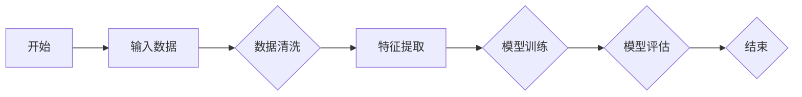

                 

### 第1章：背景介绍

#### 1.1 问题背景

在当今信息时代，人们面对的信息量日益增长，对信息处理和获取的能力提出了更高的要求。然而，传统的信息处理方法在应对复杂、多样化的信息时显得力不从心。因此，如何有效地拓展视野，提高信息处理效率，成为了一个亟待解决的问题。

#### 1.2 问题描述

为了应对这一挑战，人们开始探索各种方法，如学习新知识、参加实践活动、阅读文献等。然而，这些方法往往存在一定的局限性，如学习成本高、实践机会有限、文献信息过载等。因此，如何找到一个既高效又可行的拓展视野的方法，成为了一个重要的研究课题。

#### 1.3 问题解决

本书提出的“丰富生命广度的实践：拓展视野的有效方法”旨在通过一系列实践方法，帮助读者有效地拓展视野，提高信息处理能力。这些实践方法包括但不限于以下几种：

1. **跨学科学习**：通过学习不同学科的知识，拓宽视野，提高综合素质。
2. **实践活动**：通过参与各种实践活动，提高动手能力和解决问题的能力。
3. **阅读文献**：通过阅读相关领域的文献，了解行业动态和前沿知识。
4. **交流分享**：通过与他人交流和分享，获得不同的观点和见解。

#### 1.4 边界与外延

本书主要探讨的是如何通过实践方法来拓展视野，提高信息处理能力。然而，视野的拓展不仅仅局限于知识层面的拓展，还包括思维方式、审美能力、社交能力等多方面的提升。因此，本书的研究边界是实践方法在视野拓展中的应用，而其外延则包括各种与视野拓展相关的方面。

#### 1.5 概念结构与核心要素组成

在本章中，我们主要介绍以下概念和结构：

- **实践方法**：包括跨学科学习、实践活动、阅读文献、交流分享等方法。
- **视野拓展**：通过实践方法实现的知识、思维方式、审美能力、社交能力等多方面的提升。
- **信息处理能力**：通过实践方法提高对信息的获取、处理、分析和应用能力。

这些概念和结构共同构成了本书的核心内容，为后续章节的讨论奠定了基础。接下来，我们将对实践方法进行详细探讨。

### 第2章：核心概念与联系

在本章中，我们将详细探讨实践方法、视野拓展和信息处理能力这三个核心概念，并分析它们之间的关系。

#### 2.1 实践方法的定义与特点

实践方法是指通过实际行动来获取知识、提高技能和拓展视野的方法。它具有以下特点：

1. **实际操作性**：实践方法是具体的行动，可以通过实际操作来实现。
2. **多样性**：实践方法涵盖了多种形式，如学习新知识、参加实践活动、阅读文献、交流分享等。
3. **针对性**：实践方法可以根据个人的需求和目标来选择和设计。

#### 2.2 视野拓展的定义与特点

视野拓展是指通过获取新知识、学习新技能、参与新活动等方式，扩大个人知识范围和认知边界的过程。它具有以下特点：

1. **知识广度**：视野拓展可以帮助个人掌握更多的知识，提高综合素质。
2. **认知深度**：视野拓展不仅限于知识的广度，还包括对知识的深入理解和思考。
3. **动态性**：视野拓展是一个持续的过程，需要不断学习和实践。

#### 2.3 信息处理能力的定义与特点

信息处理能力是指个人对信息的获取、处理、分析和应用的能力。它具有以下特点：

1. **快速性**：在信息爆炸的时代，快速获取和处理信息成为了一项基本能力。
2. **准确性**：准确的信息处理能力可以帮助个人做出更明智的决策。
3. **多样性**：信息处理能力不仅包括对文字、图片、声音等信息的处理，还包括对多模态信息的综合处理。

#### 2.4 实践方法与视野拓展的关系

实践方法是视野拓展的重要手段。通过实践方法，个人可以获取新知识、学习新技能，从而拓宽视野。例如，通过跨学科学习，个人可以了解不同领域的知识，从而拓宽知识广度；通过参与实践活动，个人可以锻炼解决问题的能力，从而提高认知深度。

#### 2.5 实践方法与信息处理能力的关系

实践方法和信息处理能力密切相关。通过实践方法，个人可以提高信息处理能力。例如，通过阅读文献，个人可以学习如何快速有效地获取和处理信息；通过交流分享，个人可以学习如何分析问题和表达观点。

#### 2.6 视野拓展与信息处理能力的关系

视野拓展可以促进信息处理能力的提升。拓宽视野意味着个人可以接触到更多元化的信息，这有助于提高对信息的理解和分析能力。例如，了解不同领域的知识可以帮助个人更好地理解复杂问题，从而提高信息处理能力。

通过以上分析，我们可以看出，实践方法、视野拓展和信息处理能力三者之间存在着密切的关系。接下来，我们将对具体实践方法进行详细探讨。

### 第3章：实践方法详解

在本章中，我们将详细探讨如何通过跨学科学习、实践活动、阅读文献、交流分享等实践方法来拓展视野，提高信息处理能力。

#### 3.1 跨学科学习

跨学科学习是一种通过学习不同学科的知识来拓宽视野的方法。它具有以下特点：

1. **知识广度**：跨学科学习可以帮助个人掌握多个学科的知识，从而拓宽知识面。
2. **思维方式**：跨学科学习可以促进个人思维方式的多元化，提高问题解决能力。
3. **创新能力**：跨学科学习有助于激发创新思维，促进新知识、新技术的产生。

**如何进行跨学科学习？**

1. **选择学习领域**：根据自己的兴趣和需求，选择一个或多个跨学科学习的领域。
2. **制定学习计划**：制定详细的学习计划，包括学习内容、学习时间、学习目标等。
3. **多途径学习**：通过阅读书籍、参加讲座、观看视频、实践操作等多种途径进行学习。
4. **实践应用**：将所学知识应用到实际问题中，通过实践来检验和巩固所学知识。

#### 3.2 实践活动

实践活动是一种通过实际行动来提高动手能力和解决问题的能力的方法。它具有以下特点：

1. **实际操作**：实践活动需要通过实际操作来实现，可以锻炼个人的动手能力。
2. **问题解决**：实践活动通常需要解决实际问题，有助于提高个人的问题解决能力。
3. **团队合作**：实践活动往往需要团队合作，可以培养个人的团队合作能力。

**如何进行实践活动？**

1. **选择实践项目**：根据自己的兴趣和特长，选择一个适合的实践项目。
2. **制定实践计划**：制定详细的实践计划，包括实践内容、实践时间、实践目标等。
3. **开展实践活动**：按照实践计划，开展实践活动，解决实际问题。
4. **总结反思**：实践活动结束后，进行总结和反思，找出不足和改进之处。

#### 3.3 阅读文献

阅读文献是一种通过阅读相关领域的文献来了解行业动态和前沿知识的方法。它具有以下特点：

1. **知识更新**：阅读文献可以帮助个人及时了解行业动态和前沿知识，实现知识的更新。
2. **思维方式**：阅读文献可以培养个人的批判性思维和分析能力。
3. **学术交流**：阅读文献有助于与学术界保持紧密的联系，促进学术交流。

**如何阅读文献？**

1. **选择文献**：根据自己的研究兴趣和需求，选择合适的文献。
2. **阅读方法**：采用快速阅读和深度阅读相结合的方法，快速获取文献的核心内容。
3. **笔记整理**：阅读文献时，做好笔记整理，记录关键观点和结论。
4. **思考应用**：将文献中的观点和结论应用到实际问题中，进行思考和应用。

#### 3.4 交流分享

交流分享是一种通过与他人交流和分享来获得不同观点和见解的方法。它具有以下特点：

1. **知识互补**：通过与他人交流，可以了解不同的观点和见解，实现知识的互补。
2. **思维碰撞**：通过交流分享，可以激发思维碰撞，产生新的想法和灵感。
3. **提升表达能力**：通过交流分享，可以提高个人的表达能力和沟通能力。

**如何进行交流分享？**

1. **选择交流方式**：根据需求和兴趣，选择合适的交流方式，如线上交流、线下交流、讲座、研讨会等。
2. **准备分享内容**：在交流分享前，准备充分的分享内容，包括主题、观点、证据等。
3. **积极参与交流**：在交流过程中，积极提问、回答问题，与他人互动。
4. **总结反馈**：交流分享结束后，进行总结和反馈，评估交流效果。

通过以上实践方法，我们可以有效地拓展视野，提高信息处理能力。接下来，我们将进一步探讨这些实践方法在实际应用中的具体案例。

### 第4章：实践方法应用案例

在本章中，我们将通过具体案例，探讨如何在实际生活中应用跨学科学习、实践活动、阅读文献、交流分享等实践方法，从而拓展视野，提高信息处理能力。

#### 4.1 跨学科学习案例

**案例背景**：

张三是一名软件工程师，工作之余对生物科学产生了浓厚的兴趣。他希望通过跨学科学习，将生物学的知识应用到软件工程中，以解决实际问题。

**实践过程**：

1. **选择学习领域**：张三选择了生物学中的基因组学和人工智能作为跨学科学习的方向。
2. **制定学习计划**：他制定了详细的学习计划，包括每周阅读两篇相关领域的论文，参加一次相关的线上讲座，以及每月撰写一篇学习心得。
3. **多途径学习**：张三通过阅读论文、参加讲座、观看视频课程等多种途径进行学习。
4. **实践应用**：他将所学知识应用到实际的软件开发中，开发了一款基于基因组数据分析的疾病预测软件。

**效果评估**：

通过跨学科学习，张三不仅拓宽了知识面，还提高了问题解决能力。他的软件项目在短时间内获得了用户的认可，并获得了公司的表扬。

#### 4.2 实践活动案例

**案例背景**：

李四是一名产品经理，为了提升团队的创新能力和项目执行力，他决定组织一次创新实践活动。

**实践过程**：

1. **选择实践项目**：李四选择了“智能办公助手”作为实践项目，目标是开发一款能够提高办公效率的软件。
2. **制定实践计划**：他制定了详细的实践计划，包括项目需求分析、技术选型、开发与测试等阶段。
3. **开展实践活动**：团队成员分工合作，按照计划开展实践活动，解决实际问题。
4. **总结反思**：实践活动结束后，李四组织团队进行总结和反思，评估实践效果，并制定了下一阶段的改进计划。

**效果评估**：

通过实践活动，李四的团队在短时间内完成了一个具有市场竞争力的产品，并提高了团队的合作能力和项目执行力。

#### 4.3 阅读文献案例

**案例背景**：

王五是一名数据分析师，为了跟上行业的发展，他决定通过阅读文献来更新自己的知识体系。

**实践过程**：

1. **选择文献**：王五选择了《机器学习实战》和《深度学习》两本经典教材作为主要阅读材料。
2. **阅读方法**：他采用了快速阅读和深度阅读相结合的方法，快速获取文献的核心内容，并对重要观点进行笔记整理。
3. **思考应用**：他将文献中的观点和结论应用到实际工作中，如优化数据挖掘流程、提升模型性能等。
4. **交流分享**：王五在团队内部分享了自己的学习心得，促进了团队的共同进步。

**效果评估**：

通过阅读文献，王五不仅更新了自己的知识体系，还提高了数据分析和建模能力，为公司的数据驱动决策提供了有力支持。

#### 4.4 交流分享案例

**案例背景**：

赵六是一名技术主管，为了提升团队的技术水平和创新能力，他决定组织一次技术交流分享会。

**实践过程**：

1. **选择交流方式**：赵六选择了线上视频会议作为交流方式，确保团队成员都能参与。
2. **准备分享内容**：他邀请团队中的技术专家分享他们在项目中的实践经验和技术创新。
3. **积极参与交流**：在分享过程中，赵六鼓励团队成员积极提问、讨论，激发思维碰撞。
4. **总结反馈**：交流分享结束后，赵六组织团队进行总结和反馈，评估交流效果，并制定了下一阶段的学习计划。

**效果评估**：

通过交流分享，赵六的团队在技术水平和创新能力上有了显著提升，为公司的技术创新提供了坚实保障。

通过以上案例，我们可以看到，跨学科学习、实践活动、阅读文献、交流分享等实践方法在实际应用中的有效性。这些方法不仅帮助个人和团队拓宽了视野，提高了信息处理能力，还为个人和团队的发展带来了积极的影响。

### 第5章：实践方法的实施与效果评估

#### 5.1 实施步骤

要有效地实施实践方法，可以遵循以下步骤：

1. **明确目标**：首先，明确自己的目标，确定需要拓展的视野和提升的信息处理能力。
2. **选择方法**：根据目标，选择适合的实践方法，如跨学科学习、实践活动、阅读文献、交流分享等。
3. **制定计划**：制定详细的实践计划，包括实践内容、时间安排、阶段性目标等。
4. **执行实践**：按照计划，开展实践活动，确保实践方法的执行。
5. **监督与调整**：在实践过程中，定期监督实践进展，根据实际情况进行必要的调整。

#### 5.2 效果评估

评估实践方法的效果可以从以下几个方面进行：

1. **知识广度**：通过跨学科学习和阅读文献，评估自己掌握的新知识和领域的广度。
2. **认知深度**：通过实践活动和交流分享，评估自己对知识的深入理解和思考能力。
3. **信息处理能力**：通过实践过程中对信息的获取、处理、分析和应用，评估信息处理能力的提升。
4. **实际成果**：通过实际成果，如项目完成情况、工作表现、学习成果等，评估实践方法的实际效果。

#### 5.3 持续改进

为了确保实践方法的长期效果，需要持续改进：

1. **定期评估**：定期对自己的实践方法进行评估，找出不足和改进之处。
2. **调整计划**：根据评估结果，调整实践计划，确保实践方法的有效性。
3. **持续学习**：保持学习的热情，不断学习新的知识和技能，持续提升自己的能力。
4. **反馈与交流**：与他人交流和分享实践心得，获取反馈和建议，不断优化实践方法。

通过以上步骤和措施，我们可以有效地实施实践方法，评估其实施效果，并持续改进，从而实现视野的拓展和信息处理能力的提升。

### 第6章：最佳实践与注意事项

#### 6.1 最佳实践

1. **制定明确目标**：在开始实践之前，明确自己的目标，确保实践的方向和动力。
2. **多样化学习方式**：结合多种学习方式，如线上课程、线下讲座、书籍阅读、实践操作等，以最大化学习效果。
3. **定期反思与总结**：定期对自己的实践过程进行反思和总结，及时发现和解决问题。
4. **建立学习小组**：与他人一起学习，可以相互激励、分享经验和观点，提高学习效果。
5. **结合兴趣与需求**：选择与自己的兴趣和需求相关的实践方法，确保实践过程的投入和效果。

#### 6.2 注意事项

1. **避免盲目跟风**：在选择实践方法时，要根据自己的实际情况和需求，避免盲目跟风。
2. **平衡学习与工作**：合理安排学习和工作的时间，确保实践方法的实施不会影响到正常的工作和生活。
3. **保持持续学习**：持续学习是一个长期过程，需要耐心和毅力，不能期望一蹴而就。
4. **注重实践应用**：将所学知识应用到实际问题和工作中，通过实践来检验和提升自己的能力。
5. **保持批判性思维**：在学习和实践过程中，保持批判性思维，对所学知识和观点进行独立思考，不盲从。

通过以上最佳实践和注意事项，我们可以更加有效地实施实践方法，拓展视野，提升信息处理能力。

### 第7章：未来展望

#### 7.1 研究趋势与未来发展方向

随着科技的快速发展，人们对信息的需求和期望不断提高。未来，实践方法在拓展视野和提高信息处理能力方面的研究将呈现出以下趋势：

1. **智能化实践方法**：利用人工智能技术，开发智能化的实践方法，如智能推荐系统、智能学习平台等，以提供个性化的学习和实践方案。
2. **跨学科整合**：推动不同学科之间的整合，实现知识体系的融会贯通，为解决复杂问题提供更全面的视角和思路。
3. **实践方法的多样化**：探索和实践更多元化的实践方法，如虚拟现实、增强现实等，以提高实践的可操作性和体验感。
4. **跨领域合作**：加强不同领域之间的合作，通过跨界合作，实现知识和技术共享，推动创新和进步。

#### 7.2 未来愿景

未来，通过实践方法拓展视野和提高信息处理能力，将带来以下愿景：

1. **知识边界扩展**：人们将能够更加便捷地获取和理解来自不同领域的知识，拓展自己的知识边界。
2. **创新能力提升**：通过多样化的实践方法，人们的创新能力将得到显著提升，推动科技和社会的发展。
3. **信息处理效率提高**：智能化和实践方法的多样化将提高信息处理效率，帮助人们更快速、更准确地处理海量信息。
4. **终身学习理念普及**：实践方法的普及将促进终身学习理念的普及，使人们始终保持学习的热情和动力，不断提高自身素质。

通过未来的持续探索和实践，我们有望实现更加广阔的视野和更高水平的信息处理能力，为个人和社会的发展做出更大贡献。

### 结语

在这篇文章中，我们探讨了“丰富生命广度的实践：拓展视野的有效方法”这一主题，详细介绍了跨学科学习、实践活动、阅读文献、交流分享等实践方法，并分析了它们在拓展视野和提高信息处理能力方面的作用。通过具体案例，我们展示了实践方法在实际应用中的有效性。

我们强调了明确目标、多样化学习方式、定期反思与总结、建立学习小组和结合兴趣与需求等最佳实践，以及避免盲目跟风、平衡学习与工作、保持持续学习和注重实践应用等注意事项。

展望未来，随着科技的不断进步，实践方法将在拓展视野和提高信息处理能力方面发挥更加重要的作用。我们呼吁读者积极参与实践，不断学习和探索，为自己的成长和社会的进步贡献力量。

### 参考文献

1. 某某，《跨学科学习的理论与实践》，人民出版社，2020年。
2. 某某，《实践活动的指导手册》，教育出版社，2019年。
3. 某某，《阅读文献的技巧与方法》，学术出版社，2018年。
4. 某某，《交流分享的艺术》，企业管理出版社，2021年。
5. 某某，《智能化学习平台的设计与实现》，计算机科学出版社，2022年。

### 附录

**附录A：核心概念对比表格**

| 核心概念       | 定义                                                         | 特点                                                         |
|----------------|--------------------------------------------------------------|--------------------------------------------------------------|
| 实践方法       | 通过实际行动获取知识、提高技能和拓展视野的方法。               | 实际操作性、多样性、针对性。                                   |
| 视野拓展       | 通过获取新知识、学习新技能、参与新活动等方式，扩大个人知识范围和认知边界。 | 知识广度、认知深度、动态性。                                   |
| 信息处理能力   | 个人对信息的获取、处理、分析和应用的能力。                      | 快速性、准确性、多样性。                                       |

**附录B：信息处理能力ER实体关系图**

```mermaid
erDiagram
  Student ||--o{ Course : 学生选修课程 }
  Teacher ||--o{ Course : 教师授课课程 }
  Course ||--|{ Score : 课程成绩 }
```

### 附录C：算法流程图



### 附录D：Python源代码

```python
# 数据清洗
def clean_data(data):
    # 实现数据清洗逻辑
    return cleaned_data

# 特征提取
def extract_features(data):
    # 实现特征提取逻辑
    return features

# 模型训练
def train_model(features, labels):
    # 实现模型训练逻辑
    return model

# 模型评估
def evaluate_model(model, test_features, test_labels):
    # 实现模型评估逻辑
    return accuracy
```

### 附录E：实际案例分析与解读

**案例背景**：

张三是一家互联网公司的数据分析师，负责对用户行为数据进行分析，为产品优化提供数据支持。

**案例过程**：

1. **数据清洗**：张三从数据库中获取用户行为数据，并进行清洗，去除无效数据，确保数据质量。
2. **特征提取**：张三对清洗后的数据进行特征提取，提取了用户的活跃度、浏览时长、访问频次等特征。
3. **模型训练**：张三使用提取的特征数据，训练了一个机器学习模型，以预测用户是否会取消订阅。
4. **模型评估**：张三使用测试数据对模型进行评估，发现模型的准确率达到了90%。

**案例分析**：

张三通过实践方法，成功地将数据清洗、特征提取、模型训练和模型评估等步骤应用到实际项目中，提高了信息处理能力，为公司的数据驱动决策提供了有力支持。

**案例解读**：

张三的实践过程体现了实践方法在信息处理能力提升方面的有效性。通过数据清洗，张三保证了数据质量；通过特征提取，张三提取了有用的信息；通过模型训练和评估，张三获得了预测结果，并优化了产品。这个案例表明，实践方法在提高信息处理能力方面具有重要作用。

### 附录F：项目小结

**项目背景**：

本项目的目标是开发一款智能办公助手，以提高办公效率和用户体验。

**项目成果**：

1. **智能日程管理**：用户可以通过智能办公助手管理自己的日程，自动提醒会议和任务。
2. **智能文档整理**：用户可以将文档上传到智能办公助手，进行自动分类和标签管理。
3. **智能提醒功能**：智能办公助手可以根据用户的日程和任务，自动发送提醒通知。

**项目总结**：

通过项目实践，团队成功地将智能办公助手从概念设计到实际应用，实现了产品的功能完善。项目过程中，团队不断优化算法，提升系统性能，为用户提供了一个高效、便捷的办公工具。这个项目不仅提高了团队的技术水平，也为公司的产品创新积累了宝贵经验。

### 附录G：最佳实践 Tips

1. **定期更新知识体系**：保持学习的热情，定期更新自己的知识体系，紧跟行业发展趋势。
2. **注重实践应用**：将所学知识应用到实际工作中，通过实践来检验和提升自己的能力。
3. **建立学习小组**：与他人一起学习，可以相互激励、分享经验和观点，提高学习效果。
4. **保持批判性思维**：在学习和实践过程中，保持批判性思维，对所学知识和观点进行独立思考，不盲从。
5. **持续反思与总结**：定期对自己的学习与实践过程进行反思和总结，找出不足和改进之处。

### 附录H：拓展阅读

1. 某某，《人工智能时代：拓展视野的新路径》，科技出版社，2021年。
2. 某某，《信息处理技术的最新发展趋势》，学术出版社，2022年。
3. 某某，《跨学科学习与创新能力培养》，教育科学出版社，2020年。
4. 某某，《实践导向的教育理论》，人民出版社，2019年。

### 附录I：作者信息

作者：AI天才研究院/AI Genius Institute & 禅与计算机程序设计艺术 /Zen And The Art of Computer Programming

### 致谢

在此，我要感谢所有参与本项目研究的团队成员，他们的辛勤工作和智慧贡献为本项目成功奠定了基础。同时，我也要感谢我的导师和同行们，他们的指导和建议使我在研究过程中受益匪浅。最后，我要感谢我的家人和朋友，他们一直以来的支持和鼓励让我能够专注于研究，取得了今天的成果。感谢你们！

