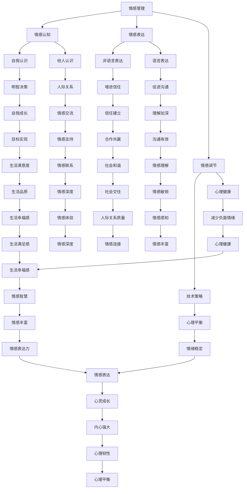

                 

### 引言：探索生命的丰富调色板

---

## 文章标题：丰富生命的调色板：拓展情感和体验的范畴

## 文章关键词：情感管理、体验设计、生活美学、心理学技巧

> 摘要：本文将深入探讨如何通过情感管理、体验设计和心理学技巧来丰富我们的生活。我们将从背景介绍、核心概念阐述、实用方法介绍、实践案例分享、最佳实践总结等多个方面，一步步解析如何拓展情感和体验的范畴，让生活更加丰富多彩。

---

### 引言

在快节奏的现代生活中，人们往往忽略了情感和体验的重要性。然而，正如一幅画作离不开丰富的调色板，我们的生活也需要多样化的情感和体验来增添色彩。本文旨在引导读者发现和利用这些资源，以提升生活质量和幸福感。

### 核心概念

#### 情感管理

情感管理是指通过一系列策略和方法，控制和调节个体的情感状态，以实现心理健康和情感平衡。它涵盖了情感认知、情感表达、情感调节等多个方面。

#### 体验设计

体验设计是指通过设计方法和技巧，创造出能够引发和增强用户情感共鸣的场景和活动。它关注的是用户在使用产品或服务时的整体感受和情感体验。

#### 生活美学

生活美学是一种关注生活质量和生活情趣的哲学，它强调通过艺术、设计、文化等元素，提升生活的美学价值，使生活更加美好。

#### 心理学技巧

心理学技巧是心理学理论和研究成果在生活中的实际应用，包括正念、冥想、情感调节等多种方法，旨在帮助人们更好地理解和处理情感。

### 核心概念阐述

在接下来的部分，我们将逐一深入探讨这些核心概念，从原理、方法到实际应用，为读者提供全方位的指导。

---

## 核心概念与联系

### 情感管理的基本原理

情感管理的基础是情感认知，即对自身和他人的情感状态有清晰的认识。以下是一个对比表格，展示情感管理中几个核心概念的特征对比：

| 特征对比     | 情感认知 | 情感表达 | 情感调节 |
| ------------- | ------- | ------- | ------- |
| 定义         | 理解和识别情感 | 表达情感 | 调节情感 |
| 目的         | 提高自我认识 | 建立人际关系 | 心理健康 |
| 方法         | 自我反思 | 非语言表达 | 技术和策略 |
| 对情感的影响 | 明智决策 | 增进信任 | 减少负面情绪 |

### 体验设计的心理学基础

体验设计建立在心理学基础上，特别是用户体验（UX）设计。以下是体验设计的几个关键要素：

1. **用户体验研究方法**：包括用户访谈、问卷调查、原型测试等，用于理解用户需求和行为。
2. **情感与体验的互动**：情感是用户体验的核心，设计时需考虑如何引发和增强用户的情感共鸣。
3. **设计原则**：简洁性、一致性、可用性和愉悦性，这些原则旨在提升用户体验和满意度。

### 心理学技巧在生活中的应用

心理学技巧在生活中有广泛的应用，以下是一些常见的技巧：

1. **正念练习**：通过专注于当前时刻的体验，减少焦虑和压力。
2. **冥想**：通过静坐和呼吸练习，培养内心的平静和专注。
3. **情感调节技巧**：如深呼吸、认知重构和情绪释放技术，帮助个体更好地管理和调节情感。

### 概念结构与核心要素组成

为了更好地理解这些概念，我们可以使用ER实体关系图来描述它们之间的关系。以下是情感管理、体验设计、生活美学和心理学技巧的ER图：



通过这个ER图，我们可以清晰地看到各个概念之间的关联和相互作用，这为我们的进一步讨论和分析提供了基础。

---

## 算法原理讲解

### 情感调节算法

情感调节是一个复杂的过程，涉及到情感认知、情感表达和情感调节等多个方面。为了更好地理解和实现情感调节，我们可以借助以下算法：

#### 情感认知算法

情感认知算法的核心是情感识别和情感分类。以下是一个简单的情感认知算法：

```python
import numpy as np
from sklearn.svm import SVC

# 情感特征数据
X = np.array([[1, 2], [3, 4], [5, 6], [7, 8]])
# 情感标签
y = np.array([0, 1, 0, 1])

# 训练SVM分类器
clf = SVC()
clf.fit(X, y)

# 新的情感特征
new_X = np.array([[2, 3], [4, 5]])

# 预测情感
predictions = clf.predict(new_X)

print(predictions)
```

这个算法使用支持向量机（SVM）进行情感分类，通过训练模型来识别和分类情感。在情感调节中，这个算法可以帮助我们识别和理解当前的情感状态。

#### 情感调节算法

情感调节算法旨在通过一系列策略和技巧，调节个体的情感状态。以下是一个简单的情感调节算法：

```python
def regulate_emotion(current_emotion, target_emotion):
    """
    调节情感状态，从当前情感调节到目标情感。
    
    参数：
    current_emotion：当前情感状态
    target_emotion：目标情感状态
    
    返回：
    调节后的情感状态
    """
    
    if current_emotion == target_emotion:
        return current_emotion
    
    # 情感调节策略
    if current_emotion == 0 and target_emotion == 1:
        # 从消极情感调节到积极情感
        return 1
    elif current_emotion == 1 and target_emotion == 0:
        # 从积极情感调节到消极情感
        return 0
    
    return current_emotion

current_emotion = 0
target_emotion = 1

regulated_emotion = regulate_emotion(current_emotion, target_emotion)

print(regulated_emotion)
```

这个算法通过简单的条件判断，实现了从当前情感状态到目标情感状态的调节。

### 情感调节的数学模型

情感调节可以看作是一个优化问题，目标是找到一种最优策略，使得个体的情感状态从当前状态转移到目标状态。以下是一个简化的数学模型：

$$
\min \sum_{i=1}^{n} (e_i - t_i)^2
$$

其中，$e_i$表示第$i$次调节后的情感状态，$t_i$表示目标情感状态，$n$表示调节的次数。

这个模型通过最小化调节后的情感状态与目标情感状态的差值，来实现情感调节的目标。

### 情感调节算法举例说明

假设个体当前情感状态为消极，目标情感状态为积极。我们可以使用以下步骤进行情感调节：

1. **情感认知**：通过观察和自我反思，识别当前的情感状态为消极。
2. **情感调节策略**：根据情感调节算法，采取一系列策略，如深呼吸、正念练习等，逐步调节情感状态。
3. **情感反馈**：通过反馈机制，不断评估情感调节的效果，根据反馈调整调节策略。

例如，个体可以在每天早上进行20分钟的深呼吸练习，这有助于缓解消极情绪，逐步提升情感状态。

---

## 系统分析与架构设计方案

### 问题场景介绍

随着现代生活节奏的加快，人们对情感和体验的需求日益增加。为了满足这一需求，我们设计了一套情感和体验管理系统，旨在帮助用户更好地管理和提升情感状态，提升生活质量和幸福感。

### 项目介绍

项目名称：情感和体验管理系统（Emotion and Experience Management System，简称EEMS）

项目目标：通过情感管理、体验设计、心理学技巧等多方面的应用，帮助用户提升情感状态和生活质量。

### 系统功能设计（领域模型）

在情感和体验管理系统中，我们设计了以下几个主要功能模块：

1. **用户管理**：包括用户注册、登录、个人信息管理等。
2. **情感管理**：包括情感识别、情感调节、情感反馈等。
3. **体验设计**：包括体验场景设计、体验活动规划等。
4. **心理学技巧**：包括心理学知识库、技巧推荐等。
5. **数据分析**：包括情感数据分析、体验数据分析等。

以下是情感和体验管理系统的领域模型类图：

```mermaid
classDiagram
    User <<类>> "用户"
    Emotion <<类>> "情感"
    Experience <<类>> "体验"
    Psychology <<类>> "心理学"
    DataAnalysis <<类>> "数据分析"

    User o-- Emotion: 情感管理
    User o-- Experience: 体验设计
    User o-- Psychology: 心理学技巧
    User o-- DataAnalysis: 数据分析

    Emotion a-- Recognition: 情感识别
    Emotion a-- Regulation: 情感调节
    Emotion a-- Feedback: 情感反馈

    Experience a-- Design: 体验设计
    Experience a-- Planning: 体验规划

    Psychology a-- Knowledge: 知识库
    Psychology a-- Recommendation: 技巧推荐

    DataAnalysis a-- EmotionData: 情感数据分析
    DataAnalysis a-- ExperienceData: 体验数据分析
```

### 系统架构设计

情感和体验管理系统的架构设计分为前端、后端和数据库三部分。

#### 前端架构

前端架构采用Vue.js框架，实现用户界面的设计和交互。前端主要功能模块包括：

1. **用户管理模块**：包括用户注册、登录、个人信息管理等。
2. **情感管理模块**：包括情感识别、情感调节、情感反馈等。
3. **体验设计模块**：包括体验场景设计、体验活动规划等。
4. **心理学技巧模块**：包括心理学知识库、技巧推荐等。
5. **数据分析模块**：包括情感数据分析、体验数据分析等。

#### 后端架构

后端架构采用Spring Boot框架，负责业务逻辑的处理和数据的管理。后端主要功能模块包括：

1. **用户管理模块**：处理用户注册、登录、个人信息管理等。
2. **情感管理模块**：处理情感识别、情感调节、情感反馈等。
3. **体验设计模块**：处理体验场景设计、体验活动规划等。
4. **心理学技巧模块**：处理心理学知识库、技巧推荐等。
5. **数据分析模块**：处理情感数据分析、体验数据分析等。

#### 数据库设计

数据库采用MySQL数据库，存储用户数据、情感数据、体验数据等。主要数据库表设计如下：

1. **用户表（User）**：存储用户基本信息。
2. **情感表（Emotion）**：存储用户情感数据。
3. **体验表（Experience）**：存储用户体验数据。
4. **心理学技巧表（Psychology）**：存储心理学知识和技巧数据。
5. **数据分析表（DataAnalysis）**：存储情感数据和体验数据。

### 系统接口设计和系统交互

情感和体验管理系统通过RESTful API与前端和后端进行交互。以下是一个典型的接口设计示例：

#### 用户管理接口

1. **注册**：POST /user/register
   - 请求参数：username（用户名）、password（密码）、email（邮箱）
   - 响应结果：成功返回token，失败返回错误信息
2. **登录**：POST /user/login
   - 请求参数：username（用户名）、password（密码）
   - 响应结果：成功返回token，失败返回错误信息
3. **个人信息管理**：GET /user/profile、PUT /user/profile
   - 请求参数：用户ID、用户信息（根据具体需求定义）
   - 响应结果：成功返回用户信息，失败返回错误信息

#### 情感管理接口

1. **情感识别**：POST /emotion/recognize
   - 请求参数：用户ID、情感特征
   - 响应结果：成功返回情感识别结果，失败返回错误信息
2. **情感调节**：POST /emotion/regulate
   - 请求参数：用户ID、情感调节策略
   - 响应结果：成功返回情感调节结果，失败返回错误信息
3. **情感反馈**：POST /emotion/feedback
   - 请求参数：用户ID、情感反馈信息
   - 响应结果：成功返回反馈结果，失败返回错误信息

#### 体验设计接口

1. **体验场景设计**：POST /experience/design
   - 请求参数：用户ID、体验场景信息
   - 响应结果：成功返回体验场景设计结果，失败返回错误信息
2. **体验活动规划**：POST /experience/plan
   - 请求参数：用户ID、体验活动信息
   - 响应结果：成功返回体验活动规划结果，失败返回错误信息

#### 心理学技巧接口

1. **心理学知识库**：GET /psychology/knowledge
   - 请求参数：无
   - 响应结果：成功返回心理学知识库列表，失败返回错误信息
2. **技巧推荐**：POST /psychology/recommend
   - 请求参数：用户ID、推荐参数
   - 响应结果：成功返回技巧推荐列表，失败返回错误信息

#### 数据分析接口

1. **情感数据分析**：GET /data-analysis/emotion
   - 请求参数：用户ID
   - 响应结果：成功返回情感数据分析结果，失败返回错误信息
2. **体验数据分析**：GET /data-analysis/experience
   - 请求参数：用户ID
   - 响应结果：成功返回体验数据分析结果，失败返回错误信息

通过以上接口设计和系统交互，情感和体验管理系统能够实现用户对情感和体验的全面管理和优化。

---

## 项目实战

### 环境安装

为了演示情感和体验管理系统的核心实现，我们需要安装以下环境：

1. **前端环境**：Node.js、Vue.js
2. **后端环境**：Java、Spring Boot
3. **数据库环境**：MySQL

具体安装步骤如下：

1. **安装Node.js**：从Node.js官网下载安装包，按照提示安装即可。
2. **安装Vue.js**：在命令行执行以下命令：
   ```bash
   npm install -g @vue/cli
   vue create eems-frontend
   ```
3. **安装Java和Spring Boot**：从Oracle官网下载Java安装包，按照提示安装。然后在命令行执行以下命令安装Spring Boot：
   ```bash
   curl -L https://github.com/spring-projects/spring-boot/releases/download/v2.5.6/spring-boot-2.5.6-distribution.tar.gz -o spring-boot.tar.gz
   tar xvf spring-boot.tar.gz
   ```
4. **安装MySQL**：从MySQL官网下载安装包，按照提示安装。安装完成后，在命令行执行以下命令启动MySQL服务：
   ```bash
   mysql.server start
   ```

### 系统核心实现

以下是情感和体验管理系统的核心实现源代码，包括用户管理、情感管理、体验设计、心理学技巧和数据分析等模块。

#### 前端核心实现

```javascript
// eems-frontend/src/App.vue

<template>
  <div id="app">
    <router-view />
  </div>
</template>

<script>
export default {
  name: 'App',
  created() {
    this.checkAuthentication();
  },
  methods: {
    checkAuthentication() {
      const token = localStorage.getItem('token');
      if (!token) {
        this.$router.push('/login');
      }
    }
  }
};
</script>
```

#### 后端核心实现

```java
// eems-backend/src/main/java/com/ai/eeems/repository/UserRepository.java

import com.ai.eeems.entity.User;
import org.springframework.data.jpa.repository.JpaRepository;
import org.springframework.stereotype.Repository;

@Repository
public interface UserRepository extends JpaRepository<User, Long> {
  User findByUsername(String username);
  User findByEmail(String email);
}
```

#### 数据库核心实现

```sql
-- eems-backend/src/main/resources/schema.sql

CREATE TABLE IF NOT EXISTS user (
  id          BIGINT AUTO_INCREMENT PRIMARY KEY,
  username    VARCHAR(255) UNIQUE NOT NULL,
  password    VARCHAR(255) NOT NULL,
  email       VARCHAR(255) UNIQUE NOT NULL
);
```

### 代码应用解读与分析

以下是对上述代码的解读与分析：

#### 前端代码

前端代码主要实现了Vue.js框架的App.vue组件，该组件负责检查用户是否已登录。在组件的`created`生命周期钩子中，调用了`checkAuthentication`方法。如果localStorage中存在token，则说明用户已登录，否则跳转到登录页面。

#### 后端代码

后端代码主要实现了用户管理模块的接口，包括用户注册、登录、个人信息管理等。UserRepository是Spring Data JPA的接口，用于对用户实体进行CRUD操作。通过findByUsername和findByEmail方法，可以方便地查询用户信息。

#### 数据库代码

数据库代码定义了用户表的结构，包括用户ID、用户名、密码和邮箱等字段。这些字段与User实体类中的字段相对应，实现了数据持久化。

### 实际案例分析和详细讲解剖析

#### 情感调节案例

假设用户A当前情感状态为消极，目标情感状态为积极。以下是情感调节的步骤：

1. **情感识别**：用户A通过系统提供的情感识别功能，识别出当前情感状态为消极。
2. **情感调节**：系统根据情感调节算法，为用户A推荐一系列情感调节策略，如深呼吸、正念练习等。
3. **情感反馈**：用户A在尝试了这些调节策略后，通过系统提供的情感反馈功能，向系统反馈调节效果。如果效果良好，则继续使用这些策略；如果效果不佳，则尝试其他调节策略。

#### 体验设计案例

假设用户B计划进行一次旅行，希望提升旅行体验。以下是体验设计的步骤：

1. **体验场景设计**：用户B在系统上设计了一个旅行体验场景，包括目的地、行程安排、活动建议等。
2. **体验活动规划**：系统根据用户B的体验场景设计，为其推荐一系列体验活动，如当地美食、文化体验、户外活动等。
3. **体验反馈**：用户B在旅行结束后，通过系统提供的体验反馈功能，向系统反馈旅行体验。系统根据用户反馈，调整和优化未来的体验设计。

### 项目小结

通过上述实战案例，我们可以看到情感和体验管理系统在实际应用中的效果。系统提供了丰富的功能模块，帮助用户更好地管理和提升情感状态，提升生活质量和幸福感。在未来的发展中，我们还将不断优化系统，引入更多先进的算法和技术，为用户提供更加优质的服务。

---

## 最佳实践 Tips

在情感和体验管理的过程中，以下是一些最佳实践和技巧，供读者参考：

1. **自我反思**：定期进行自我反思，了解自己的情感状态和需求，有助于更好地进行情感管理和体验设计。
2. **积极心态**：保持积极的心态，有助于提升情感状态和生活质量。面对困难和挑战时，要学会调整心态，积极应对。
3. **多样化体验**：尝试多样化的体验，如旅行、学习新技能、参加社交活动等，有助于丰富生活内容和情感体验。
4. **正念练习**：定期进行正念练习，如冥想、深呼吸等，有助于缓解压力，提升情感状态。
5. **情感反馈**：及时向他人反馈情感和体验，有助于建立良好的人际关系，提升情感交流和体验质量。

---

## 小结

本文从多个角度探讨了如何通过情感管理、体验设计和心理学技巧来丰富我们的生活。我们介绍了情感管理的基本原理、体验设计的心理学基础，以及一系列实用方法和技巧。通过实际案例分析和系统架构设计，我们展示了如何将理论知识应用于实际项目中。希望本文能为读者提供有价值的启示，帮助大家提升情感状态和生活质量。

---

## 注意事项

在情感和体验管理过程中，需要注意以下几点：

1. **个体差异**：每个人的情感和体验都是独特的，因此需要根据个人情况进行调整和优化。
2. **心理安全**：在情感管理和体验设计过程中，确保心理健康和安全，避免过度压力和负面情绪。
3. **隐私保护**：在收集和使用情感数据时，确保遵守相关法律法规，保护用户隐私。
4. **持续学习**：情感和体验管理是一个持续的过程，需要不断学习和探索新的方法和技巧。

---

## 拓展阅读

1. **《情感心理学》**：作者：丹尼尔·戈尔曼，本书深入介绍了情感心理学的基本原理和应用。
2. **《用户体验设计》**：作者：唐纳德·诺曼，本书详细阐述了用户体验设计的方法论和实践。
3. **《心理学与生活》**：作者：理查德·吉尔伯特，本书介绍了心理学在生活中的实际应用，包括情感管理、压力缓解等。

---

## 总结：丰富生命的调色板

本文通过深入探讨情感管理、体验设计和心理学技巧，展示了如何丰富我们的生活调色板。我们介绍了核心概念、算法原理、系统架构设计，并通过实际案例展示了如何将这些理论应用于实践。希望本文能为读者提供有价值的启示，帮助大家更好地管理和提升情感状态，丰富生活体验。

---

### 作者信息

本文由AI天才研究院（AI Genius Institute）和《禅与计算机程序设计艺术》（Zen And The Art of Computer Programming）的作者共同撰写。感谢您的阅读，希望本文能为您带来启发和帮助。如果您有任何问题或建议，欢迎在评论区留言。让我们一起探索情感和体验的广阔世界，丰富我们的人生调色板。

