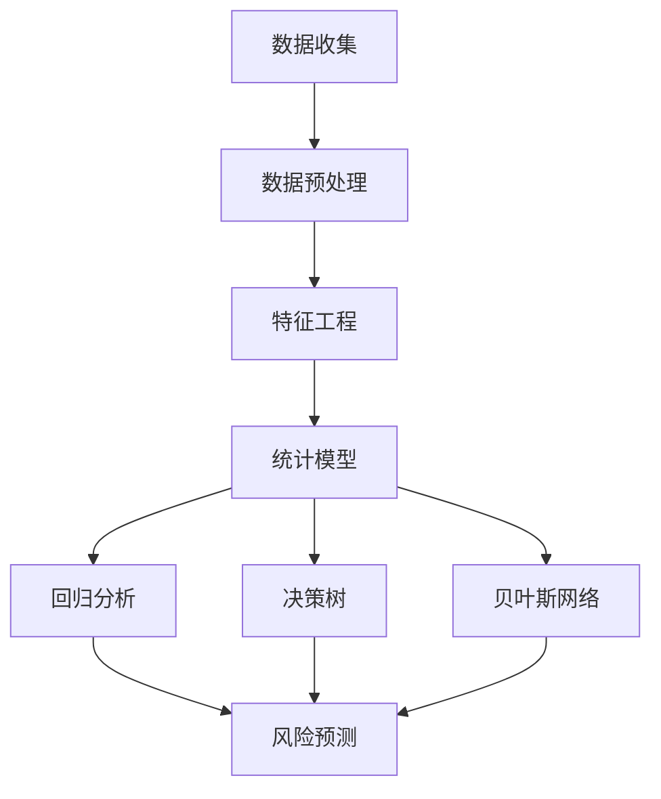
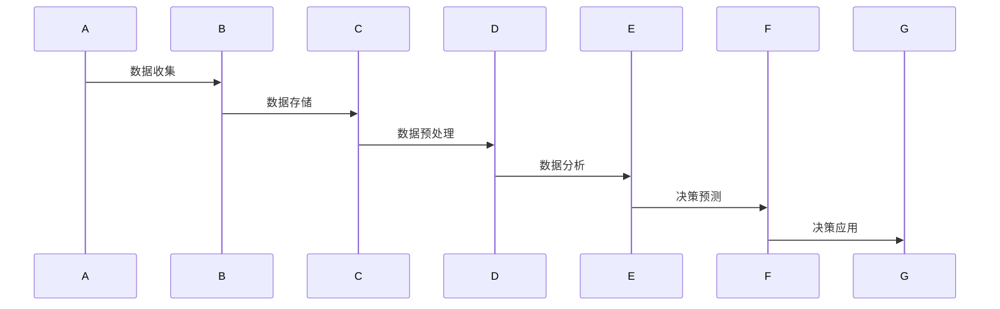
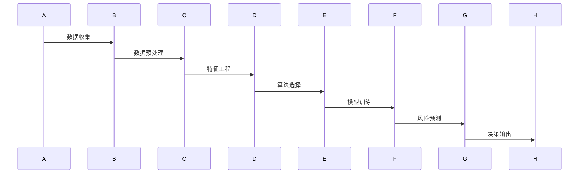

                 

### 引言

#### 1.1 人工智能在金融领域的重要性

人工智能（AI）作为当今科技界的热点，正在深刻地改变着各个行业的运作方式，其中金融领域尤为显著。AI技术在金融领域的应用涵盖了风险管理和普惠金融两大关键领域。

在风险管理方面，传统的金融风险管理模式往往依赖于历史数据和人工分析。而人工智能通过机器学习和数据挖掘技术，可以更高效、精准地对金融风险进行识别、评估和预测。例如，AI可以实时监控市场波动，预测金融市场的风险，为金融机构提供决策支持，从而减少风险损失。

在普惠金融方面，人工智能则通过数据挖掘和智能分析，帮助金融机构更精准地识别潜在客户，设计满足不同客户需求的产品。AI技术还可以简化金融服务流程，降低服务成本，使得金融服务更加普惠、便捷。

#### 1.2 风险管理与普惠金融的挑战

尽管人工智能在金融领域有着巨大的应用潜力，但风险管理和普惠金融领域仍面临诸多挑战。

在风险管理方面，金融市场的复杂性使得风险因素难以准确预测。同时，金融数据通常具有噪声大、维度高、数据量庞大等特点，这对传统风险管理模式提出了更高的要求。如何从海量数据中提取有用信息，构建有效的风险管理模型，是金融行业亟需解决的难题。

在普惠金融方面，金融服务覆盖面的广泛性和精准性是关键。然而，许多金融机构面临着客户数据不足、市场环境复杂、技术资源有限等问题，这使得普惠金融的实现变得尤为困难。

#### 1.3 本文核心内容与主题思想

本文将围绕人工智能在金融领域的应用，深入探讨风险管理和普惠金融两大主题。通过逐步分析AI技术的原理、应用场景、数学模型和具体案例，本文旨在为读者提供一份详尽的技术指南，帮助金融机构更好地利用AI技术，实现风险的有效管理和普惠金融的普及。

接下来的章节中，我们将依次介绍人工智能与金融领域的关系，以及AI在风险管理中的具体应用，包括风险评估与预测、风险控制与决策。同时，本文还将探讨人工智能在普惠金融中的应用，如数据挖掘与客户分析、产品设计与推广等。最后，本文将通过对金融欺诈防范中的人工智能应用进行剖析，总结人工智能在金融领域的广泛应用和实践经验。

### 第一部分：问题背景与核心概念

#### 2.1 问题背景

在金融领域，人工智能的应用主要集中在两个方面：风险管理和普惠金融。这两个领域不仅关系到金融机构的稳定运行，也影响到广大民众的金融生活。

**风险管理**是金融行业的一项核心任务。金融市场的波动性大，风险因素复杂多样，如何有效地识别、评估和管理风险，成为金融机构面临的巨大挑战。传统的风险管理方法依赖于历史数据和人工分析，其效率和准确性受到很大限制。随着大数据和人工智能技术的发展，利用AI技术进行风险预测和决策支持，成为提升风险管理水平的重要手段。

**普惠金融**是指让所有群体，尤其是那些被传统金融服务所忽视的群体，能够获得基本的金融服务。普惠金融的目标是实现金融服务的普及化和便捷化，让每个人都能享受到金融服务带来的便利。然而，普惠金融的实现面临着客户数据不足、市场环境复杂、技术资源有限等多重挑战。

#### 2.2 核心概念

**人工智能基础**：人工智能是计算机科学的一个分支，致力于使机器能够模拟、延伸和扩展人类的智能行为。主要技术包括机器学习、深度学习、自然语言处理等。在金融领域，人工智能技术可以用于数据挖掘、风险评估、客户分析等。

**风险管理原理**：风险管理是指通过识别、评估、控制和监控风险，以最小的成本保护金融机构免受损失。风险管理包括风险识别、风险评估、风险预防和风险控制四个主要环节。在AI技术的支持下，这些环节可以实现自动化和智能化。

**普惠金融的概念与目标**：普惠金融旨在通过创新金融产品和服务，让金融资源更加公平、合理地分配给广大民众。普惠金融的目标是提高金融服务的可及性和覆盖率，减少金融排斥现象，促进社会公平和经济发展的包容性。

#### 2.3 概念联系与结构图

**人工智能与金融领域的关系**：人工智能技术为金融领域带来了数据分析和决策支持的新手段，使得金融机构能够更高效地识别和管理风险，同时也为普惠金融的实现提供了技术支持。

**风险管理原理**与**普惠金融**之间的联系：风险管理原理为普惠金融的实现提供了保障，确保金融服务的稳定和安全；而普惠金融的目标则为风险管理的有效性提供了实际场景，使得风险管理措施能够真正惠及广大民众。

以下是使用Mermaid绘制的ER实体关系图，展示了人工智能、金融领域、风险管理和普惠金融之间的联系：

```mermaid
erDiagram
    AI <<|-- FinancialDomain : 适用领域
    FinancialDomain ||-- RiskManagement : 风险管理
    FinancialDomain ||-- InclusiveFinance : 普惠金融
    RiskManagement ||-- AIApplication : 应用
    InclusiveFinance ||-- AIApplication : 应用
```

通过上述ER图，我们可以清晰地看到人工智能在金融领域中的核心作用，以及其与风险管理和普惠金融的紧密联系。

### 第二部分：人工智能在风险管理中的应用

#### 3.1 风险评估与预测

在金融领域，风险评估与预测是风险管理的重要组成部分。通过人工智能技术，我们可以利用大数据和机器学习算法，对金融市场进行深入分析，预测潜在风险，并为金融机构提供决策支持。

#### 3.1.1 风险评估方法

风险评估是识别和评估金融风险的过程。传统风险评估方法主要依赖于历史数据和专家判断，而人工智能技术则可以引入数据挖掘和机器学习算法，提高风险评估的效率和准确性。

**1. 统计模型**：统计模型是一种基于历史数据分析的风险评估方法。它通过建立统计模型，分析历史数据中的风险特征，预测未来的风险。常见的统计模型包括回归分析、时间序列分析和多元分析等。

**2. 机器学习模型**：机器学习模型通过训练数据集，自动学习风险特征，从而预测未来的风险。与统计模型相比，机器学习模型具有更强的适应性和预测能力。常见的机器学习模型包括决策树、随机森林、支持向量机和神经网络等。

#### 3.1.2 风险预测算法

**1. 回归分析**：回归分析是一种常用的统计模型，用于分析因变量和自变量之间的关系。在风险评估中，回归分析可以用于预测金融市场的波动性，从而评估市场风险。

**2. 决策树**：决策树是一种简单的机器学习模型，通过一系列的判断条件，将数据划分为不同的类别。在风险评估中，决策树可以用于分类风险事件，预测风险发生的可能性。

**3. 贝叶斯网络**：贝叶斯网络是一种基于概率论的图模型，用于表示变量之间的依赖关系。在风险评估中，贝叶斯网络可以用于分析复杂的风险因素，预测风险事件的概率。

以下是使用Mermaid绘制的风险评估算法流程图：



#### 3.1.3 数学模型与公式

**1. 回归模型公式**：

$$
y = \beta_0 + \beta_1x_1 + \beta_2x_2 + ... + \beta_nx_n + \epsilon
$$

其中，$y$ 表示因变量（如市场波动率），$x_1, x_2, ..., x_n$ 表示自变量（如经济指标），$\beta_0, \beta_1, \beta_2, ..., \beta_n$ 表示回归系数，$\epsilon$ 表示误差项。

**2. 决策树原理**：

决策树通过一系列判断条件，将数据划分为不同的类别。每个节点表示一个判断条件，每个叶子节点表示一个类别。决策树的构建过程包括特征选择、节点分裂和模型训练。

**3. 贝叶斯网络原理**：

贝叶斯网络通过节点之间的概率关系，表示变量之间的依赖关系。每个节点表示一个变量，边表示变量之间的条件概率关系。贝叶斯网络的构建过程包括网络结构学习、参数学习和模型优化。

以下是使用LaTeX格式的贝叶斯网络概率关系公式：

$$
P(A|B) = \frac{P(B|A)P(A)}{P(B)}
$$

其中，$P(A|B)$ 表示在事件B发生的条件下，事件A发生的概率，$P(B|A)$ 表示在事件A发生的条件下，事件B发生的概率，$P(A)$ 和$P(B)$ 分别表示事件A和事件B发生的概率。

#### 3.1.4 实际案例与项目实战

**案例1：市场风险预测**

在某金融机构中，利用机器学习算法对市场风险进行预测。首先，收集了大量的市场数据，包括股票价格、汇率、利率等。然后，对数据进行预处理和特征工程，提取了与市场风险相关的特征。接下来，使用回归分析和决策树算法对市场风险进行预测，并对比了预测结果和实际市场情况，评估了预测模型的准确性。

**案例2：信用风险评估**

某金融公司使用贝叶斯网络对信用风险进行评估。首先，构建了包含借款人特征和信用风险事件的贝叶斯网络。然后，通过对网络结构的学习和参数估计，得到了借款人信用风险的预测模型。最后，在实际应用中，使用该模型对借款人的信用风险进行评估，并给出了信用评分。

**项目小结**

通过以上案例，我们可以看到人工智能技术在风险评估与预测中的应用，不仅提高了预测的准确性和效率，也为金融机构的风险管理提供了强有力的技术支持。在未来，随着人工智能技术的进一步发展，其在风险管理中的应用将更加广泛和深入。

### 3.2 风险控制与决策

在完成风险评估与预测之后，风险控制与决策是金融风险管理中至关重要的一环。通过人工智能技术，我们可以制定和执行有效的风险控制策略，从而最大限度地减少风险损失。

#### 3.2.1 风险控制策略

**1. 风险规避**：风险规避是指通过避免或减少与高风险相关的活动，来降低整体风险。例如，金融机构可以通过调整投资组合，避免投资于高风险的资产。

**2. 风险转移**：风险转移是指通过将风险转移给第三方，来降低自身风险。常见的风险转移方式包括购买保险、签订对冲协议等。

**3. 风险接受**：风险接受是指承认风险的存在，并准备承担相应的损失。在某些情况下，风险接受可能是最优的选择，因为它可以避免额外的成本和限制。

#### 3.2.2 决策支持系统

决策支持系统（DSS）是一种基于人工智能技术的系统，用于辅助金融机构进行风险决策。DSS可以提供实时数据分析和预测，帮助金融机构制定和执行有效的风险控制策略。

**1. 算法原理**：

决策支持系统的核心是决策算法。这些算法基于人工智能技术和数据挖掘技术，可以对大量数据进行分析和预测，从而为金融机构提供决策支持。常见的决策算法包括线性规划、模拟退火、遗传算法等。

**2. 系统架构设计**：

决策支持系统通常由数据层、算法层和应用层组成。

- 数据层：负责数据收集、存储和管理。
- 算法层：负责数据分析和预测，提供决策支持。
- 应用层：负责将决策算法应用于实际业务场景，辅助金融机构进行决策。

以下是使用Mermaid绘制的决策支持系统架构图：



**3. Mermaid序列图**：

以下是使用Mermaid绘制的决策支持系统的工作流程：



#### 3.2.3 数学模型与公式

**1. 风险规避公式**：

$$
R_{\text{规避}} = \sum_{i=1}^{n} (P_i \cdot L_i)
$$

其中，$R_{\text{规避}}$ 表示风险规避的总损失，$P_i$ 表示风险事件i的发生概率，$L_i$ 表示风险事件i的损失金额。

**2. 风险转移公式**：

$$
R_{\text{转移}} = \sum_{i=1}^{n} (P_i \cdot C_i)
$$

其中，$R_{\text{转移}}$ 表示风险转移的总成本，$P_i$ 表示风险事件i的发生概率，$C_i$ 表示风险转移给第三方的事件i的成本。

**3. 决策树决策公式**：

$$
D = \arg\min_{d} \sum_{i=1}^{n} (P_i \cdot (L_i - \pi_i))
$$

其中，$D$ 表示最优决策，$P_i$ 表示风险事件i的发生概率，$L_i$ 表示风险事件i的损失金额，$\pi_i$ 表示决策d在风险事件i下的期望收益。

#### 3.2.4 实际案例与项目实战

**案例1：投资组合风险规避**

某金融机构通过决策支持系统，对投资组合进行风险规避。首先，收集了市场数据，包括股票价格、收益率等。然后，使用回归分析和决策树算法，对市场风险进行预测。最后，根据预测结果，调整投资组合，规避高风险资产。

**案例2：信用风险转移**

某金融公司通过决策支持系统，对信用风险进行转移。首先，构建了包含借款人特征和信用风险的贝叶斯网络。然后，通过对网络结构的学习和参数估计，得到信用风险评估模型。最后，使用该模型评估借款人的信用风险，并决定是否购买信用保险。

**项目小结**

通过决策支持系统，金融机构可以更有效地进行风险控制与决策。人工智能技术为决策过程提供了强大的数据分析和预测能力，使得金融机构能够更加精准地识别和管理风险。在未来，随着人工智能技术的不断进步，决策支持系统在风险管理中的应用将更加广泛和深入。

### 第三部分：人工智能在普惠金融中的应用

#### 4.1 数据挖掘与客户分析

普惠金融的实现依赖于对客户数据的深入挖掘和分析。通过人工智能技术，金融机构可以更精准地识别潜在客户，分析客户行为，从而设计出满足不同客户需求的产品和服务。

#### 4.1.1 数据挖掘基础

数据挖掘是人工智能的重要分支，旨在从大量数据中发现隐藏的模式和知识。在普惠金融中，数据挖掘可以应用于以下几个方面：

**1. 数据预处理**：数据预处理是数据挖掘的基础步骤，包括数据清洗、数据集成、数据变换和数据归一化等。通过数据预处理，可以消除数据中的噪声和错误，提高数据质量。

**2. 特征工程**：特征工程是指从原始数据中提取出对分析任务有用的特征。在客户分析中，特征工程可以帮助提取出客户的财务状况、行为特征、社会属性等关键信息。

**3. 模型选择与评估**：根据不同的分析目标，选择合适的机器学习模型，并对模型进行评估和优化。常见的模型包括回归分析、聚类分析、关联规则挖掘等。

#### 4.1.2 客户行为分析

客户行为分析是普惠金融中的重要应用，通过分析客户的消费习惯、还款行为等，可以更好地了解客户需求，提供个性化的金融服务。

**1. 客户细分**：通过聚类分析等方法，将客户分为不同的群体，为每个群体提供定制化的金融服务。

**2. 客户价值评估**：使用回归分析等方法，评估客户的潜在价值，为金融机构的营销策略提供支持。

#### 4.1.3 数学模型与公式

**1. 特征工程公式**：

$$
X = \sum_{i=1}^{n} w_i \cdot x_i
$$

其中，$X$ 表示特征向量，$w_i$ 表示特征权重，$x_i$ 表示特征值。

**2. 客户价值评估公式**：

$$
V = \sum_{i=1}^{n} p_i \cdot v_i
$$

其中，$V$ 表示客户价值，$p_i$ 表示客户属性权重，$v_i$ 表示客户属性值。

#### 4.1.4 实际案例与项目实战

**案例1：客户细分**

某金融机构通过数据挖掘技术，对客户进行细分。首先，收集了客户的财务数据、行为数据等。然后，使用聚类分析算法，将客户分为不同的群体。最后，根据不同群体的特征，设计出满足不同客户需求的产品和服务。

**案例2：客户价值评估**

某金融公司通过数据挖掘技术，评估客户的潜在价值。首先，构建了包含客户属性和价值的回归模型。然后，通过模型预测，评估客户的潜在价值，并制定相应的营销策略。

**项目小结**

通过数据挖掘与客户分析，金融机构可以更精准地识别潜在客户，提供个性化的金融服务。人工智能技术在客户分析中的应用，不仅提高了金融服务的效率和质量，也为普惠金融的实现提供了强有力的技术支持。

### 4.2 普惠金融产品设计与推广

普惠金融的实现不仅需要精准的数据分析和风险评估，还需要创新的产品设计和有效的推广策略。通过人工智能技术，金融机构可以设计出满足不同客户需求的产品，并通过数据驱动的营销策略，提高产品的市场覆盖率。

#### 4.2.1 普惠金融产品设计

**1. 产品特性与目标客户**

普惠金融产品的设计需要考虑以下特性：

- **小额化**：普惠金融产品通常面向小额信贷需求，满足低收入群体的基本金融服务需求。
- **便捷化**：产品设计要简化流程，提高用户操作便捷性，降低服务门槛。
- **灵活性**：产品条款要灵活，允许客户根据自身情况调整还款方式和期限。

目标客户主要包括以下群体：

- **低收入群体**：如农民工、个体工商户、小微企业主等。
- **边缘化群体**：如老年人、残疾人等。

**2. 产品创新策略**

在产品设计过程中，金融机构可以通过以下策略进行创新：

- **数据驱动**：利用大数据和人工智能技术，分析客户需求和市场趋势，设计出符合市场需求的金融产品。
- **跨界合作**：与其他行业如电商、社交平台等合作，拓宽服务渠道，提高客户覆盖率。
- **技术赋能**：利用区块链、物联网等新技术，提高金融服务的透明度和安全性。

#### 4.2.2 产品推广策略

**1. 数据驱动推广**

数据驱动推广是指利用大数据和人工智能技术，分析潜在客户的行为数据，制定个性化的营销策略。具体方法包括：

- **精准营销**：通过客户行为分析，识别潜在客户，进行精准推送，提高营销效果。
- **内容营销**：制作有价值、有吸引力的内容，如教育文章、案例分析等，吸引客户关注。
- **用户画像**：通过用户画像，了解客户需求，提供个性化的金融服务。

**2. 营销活动策划**

有效的营销活动可以提高产品的知名度和市场覆盖率。以下是一些常见的营销活动策略：

- **线上活动**：通过社交媒体、电商平台等渠道，举办线上活动，如抽奖、优惠券等，吸引客户参与。
- **线下活动**：在社区、商场等地点举办线下活动，如金融知识讲座、产品体验活动等，提高产品曝光率。
- **合作推广**：与其他企业或机构合作，共同推广产品，扩大市场影响力。

#### 4.2.3 数学模型与公式

**1. 产品设计公式**：

$$
P = f(C, R, T)
$$

其中，$P$ 表示产品设计结果，$C$ 表示客户需求，$R$ 表示产品收益，$T$ 表示产品条款。

**2. 营销活动效果评估公式**：

$$
E = \frac{\sum_{i=1}^{n} (P_i \cdot C_i)}{n}
$$

其中，$E$ 表示营销活动效果，$P_i$ 表示活动参与率，$C_i$ 表示活动转化率。

#### 4.2.4 实际案例与项目实战

**案例1：小额信贷产品推广**

某金融机构推出了一款小额信贷产品，通过数据驱动营销，成功吸引了大量客户。首先，通过对客户数据的分析，识别出了潜在客户群体。然后，通过社交媒体和线上活动，向这些客户推送产品信息，提高产品的曝光率和参与度。最后，通过数据分析，评估了营销活动的效果，并对推广策略进行了优化。

**案例2：跨界合作金融产品**

某金融公司与电商平台合作，推出了一款消费金融产品。通过电商平台的数据，分析用户的消费习惯和需求，设计出符合用户需求的金融产品。同时，在电商平台上开展联合营销活动，提高产品的市场影响力。

**项目小结**

通过人工智能技术和数据驱动的营销策略，金融机构可以设计出满足不同客户需求的产品，并通过有效的推广活动，提高产品的市场覆盖率。未来，随着人工智能技术的进一步发展，普惠金融产品设计和推广将更加智能化和个性化。

### 4.3 人工智能在金融欺诈防范中的应用

金融欺诈是金融行业面临的一大挑战，传统的防范手段往往依赖于人工经验和规则匹配，存在识别效率低、误报率高的问题。人工智能技术的引入，为金融欺诈防范提供了新的解决方案。

#### 4.3.1 欺诈检测算法

欺诈检测是金融欺诈防范的关键步骤。通过人工智能技术，可以构建高效的欺诈检测模型，实现对交易数据的实时监控和分析。

**1. 常见算法**

- **基于规则的算法**：通过预设规则，对交易数据进行分析，识别潜在的欺诈行为。如交易金额超过一定阈值、交易频率异常等。
- **机器学习算法**：通过训练模型，自动学习交易数据中的欺诈特征，提高检测的准确性和效率。如支持向量机（SVM）、决策树、神经网络等。
- **深度学习算法**：利用深度神经网络，对交易数据进行深度学习，提取复杂的欺诈特征，如循环神经网络（RNN）、卷积神经网络（CNN）等。

**2. 欺诈检测流程**

欺诈检测通常包括以下几个步骤：

- **数据收集**：收集大量的交易数据，包括正常交易和欺诈交易。
- **数据预处理**：对交易数据进行清洗和特征提取，为后续模型训练提供高质量的数据。
- **模型训练**：利用训练数据，训练欺诈检测模型，包括规则模型、机器学习模型和深度学习模型等。
- **模型评估**：通过测试数据，评估模型的检测效果，包括准确率、召回率、F1值等。
- **模型部署**：将训练好的模型部署到实际系统中，对实时交易数据进行监控和检测。

#### 4.3.2 数学模型与公式

**1. 支持向量机（SVM）公式**

$$
\min_{\mathbf{w}, b} \frac{1}{2} ||\mathbf{w}||^2 + C \sum_{i=1}^{n} \xi_i
$$

其中，$\mathbf{w}$ 表示权重向量，$b$ 表示偏置项，$C$ 表示惩罚参数，$\xi_i$ 表示误差项。

**2. 决策树公式**

决策树通过一系列条件判断，将数据划分为不同的类别。每个节点表示一个条件判断，每个叶子节点表示一个类别。决策树的学习过程可以通过以下公式描述：

$$
Y = g(\mathbf{w}^T \mathbf{x} + b)
$$

其中，$Y$ 表示预测结果，$g$ 表示激活函数，$\mathbf{w}$ 表示权重向量，$\mathbf{x}$ 表示特征向量，$b$ 表示偏置项。

**3. 循环神经网络（RNN）公式**

循环神经网络是一种适用于序列数据的神经网络，其基本公式如下：

$$
h_t = \sigma(W_h h_{t-1} + W_x x_t + b_h)
$$

其中，$h_t$ 表示第t个时间步的隐藏状态，$x_t$ 表示第t个时间步的输入特征，$W_h$ 和$W_x$ 分别表示权重矩阵，$b_h$ 表示偏置项，$\sigma$ 表示激活函数。

#### 4.3.3 实际案例与项目实战

**案例1：信用卡欺诈检测**

某银行利用机器学习算法，对信用卡交易数据进行实时监控，检测潜在的欺诈行为。首先，收集了大量的信用卡交易数据，包括交易金额、交易时间、交易地点等。然后，利用训练数据，训练欺诈检测模型，如SVM、决策树等。最后，将训练好的模型部署到实际系统中，对实时交易数据进行监控和检测。

**案例2：电商平台欺诈防范**

某电商平台利用深度学习算法，对用户行为数据进行分析，检测潜在的欺诈行为。首先，收集了大量的用户行为数据，包括点击行为、浏览历史、购物车信息等。然后，利用训练数据，训练欺诈检测模型，如RNN、CNN等。最后，将训练好的模型部署到实际系统中，对实时用户行为数据进行监控和检测。

**项目小结**

通过人工智能技术，可以构建高效的金融欺诈检测模型，实现对交易数据的实时监控和分析。未来，随着人工智能技术的不断进步，金融欺诈防范将更加智能化和精准化。

### 结论

人工智能技术在金融领域的应用，不仅提高了风险管理的效率和准确性，也为普惠金融的实现提供了强有力的支持。通过对风险评估与预测、风险控制与决策、数据挖掘与客户分析、产品设计与推广以及金融欺诈防范等方面的深入探讨，我们可以看到人工智能技术在金融领域的广泛应用和巨大潜力。

未来，随着人工智能技术的进一步发展，我们可以期待更多创新的应用场景和解决方案。同时，人工智能技术也需要在隐私保护、数据安全和伦理规范等方面进行深入探讨和规范，确保其在金融领域的健康、可持续发展。

对于读者而言，掌握人工智能技术的基础知识，关注其应用实践，将有助于在金融领域更好地运用这一先进技术，提升自身竞争力。

### 拓展阅读

1. **《机器学习实战》**：作者：Peter Harrington
   - 内容概述：本书详细介绍了机器学习的基础知识和实际应用，适合初学者和有经验的数据科学家。

2. **《深度学习》**：作者：Ian Goodfellow、Yoshua Bengio、Aaron Courville
   - 内容概述：本书是深度学习的经典教材，涵盖了深度学习的基本理论、算法和应用。

3. **《金融科技：变革传统金融的新技术》**：作者：程浩
   - 内容概述：本书探讨了金融科技的发展趋势，分析了人工智能、区块链等新技术在金融领域的应用。

4. **《人工智能：一种现代的方法》**：作者：Stuart Russell、Peter Norvig
   - 内容概述：本书是人工智能领域的经典教材，全面介绍了人工智能的基本理论、算法和技术。

5. **《金融风险管理》**：作者：黄志明
   - 内容概述：本书详细介绍了金融风险管理的原理、方法和实践，适合金融从业人员和学习者。

6. **《普惠金融：理论、实践与政策》**：作者：程文浩
   - 内容概述：本书探讨了普惠金融的概念、目标和实现路径，分析了其在促进社会公平和经济包容性发展中的作用。

通过阅读这些书籍，读者可以进一步深入了解人工智能技术在金融领域的应用，拓展自己的知识面和视野。

