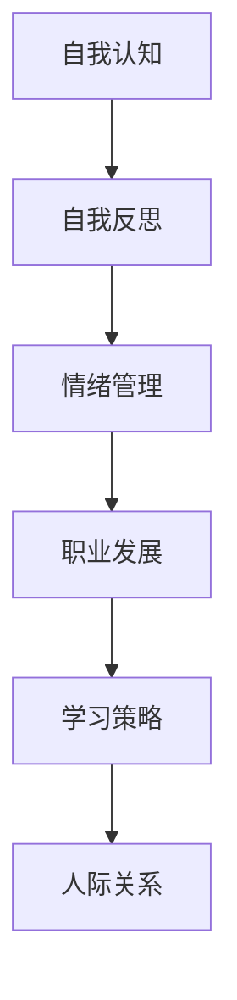
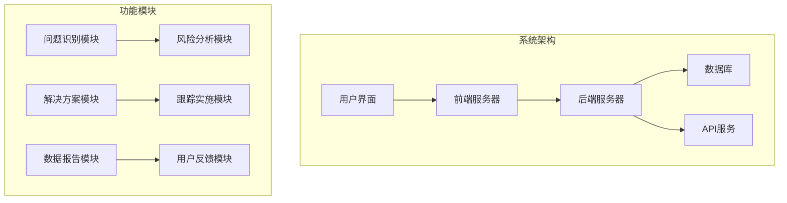
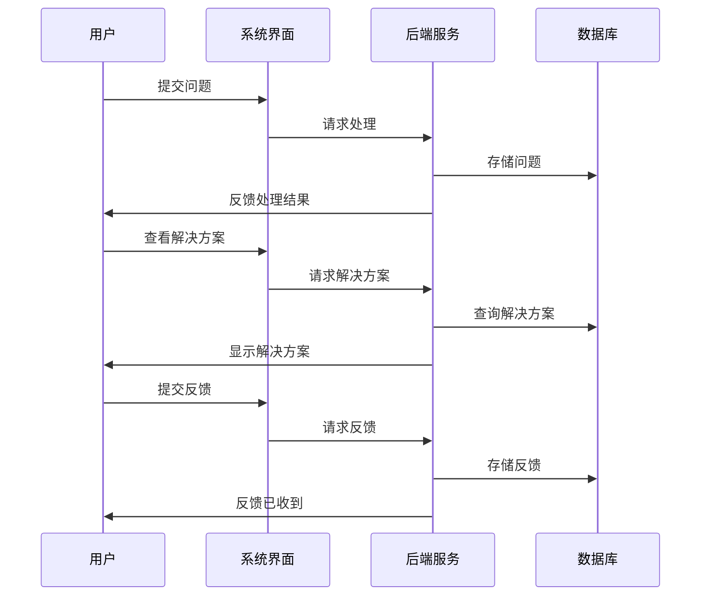
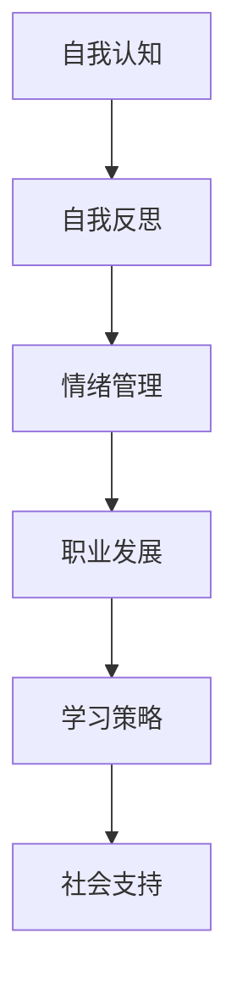

                 

### 第一部分: 背景与核心概念

#### 第1章: 人生转折点的意义重构——危机中的自我更新

##### 1.1.1 问题背景与时代背景

在当今快速发展的社会背景下，人们面临着前所未有的挑战和机遇。技术的迅猛发展、市场的激烈竞争、社会结构的快速变迁，都要求我们不断适应和调整。人生中的转折点，往往意味着一次重大的转变和机遇，而危机则可能成为推动这种转变的催化剂。然而，如何在这些转折点和危机中实现自我更新，成为摆在每个人面前的关键问题。

##### 1.1.2 问题描述与重要性

人生的转折点，可以是职业上的重大转变，比如从一个职位跳到另一个更高层次的岗位；也可以是个人生活中的重大变化，如婚姻、子女教育、健康问题等。而危机，则可能是由外部环境变化或个人行为决策所引发的困境。在危机中，自我更新不仅仅是应对困境的必要手段，更是实现人生价值、提升自身能力的关键途径。

自我更新，指的是在面临挑战和危机时，通过自我认知、反思、调整和提升，达到新的成长和发展。这个过程对于个人的职业发展、心理健康、社会关系等方面都有着深远的影响。

##### 1.1.3 研究方法与框架

本文采用的研究方法主要包括文献综述、案例分析、理论探讨和实证研究。通过梳理相关领域的研究成果，结合具体案例进行分析，构建理论框架，并运用实证数据进行验证。

本文的结构分为七个部分：首先介绍背景和核心概念，然后深入解析危机中的自我更新，通过案例进行说明，探讨自我更新的方法和实践，分析在企业和社会层面的应用，最后进行总结和展望。

**关键词**：人生转折点、危机管理、自我更新、职业发展、心理健康、社会关系

**摘要**：本文探讨了人生转折点和危机中的自我更新现象，分析了其重要性以及实现方法。通过文献综述、案例分析、理论探讨和实证研究，为读者提供了深入了解和应对这一现象的路径。

----------------------------------------------------------------

### 第二部分: 危机中的自我更新：核心概念解析

#### 第2章: 危机中的自我更新：核心概念解析

##### 2.1.1 危机的定义与类型

**定义**：危机通常指的是一种紧急、危险、不可预测的情境，可能会对个人或组织的生存和发展产生重大影响。在心理学领域，危机被定义为一种心理应激状态，表现为高度的焦虑、紧张、恐惧和无助。

**类型**：危机可以分为以下几种类型：

1. **个人危机**：如失业、婚姻破裂、健康问题等。
2. **职业危机**：如职业发展瓶颈、工作压力过大、技能落后等。
3. **社会危机**：如经济危机、政治动荡、自然灾害等。

##### 2.1.2 自我更新的内涵与过程

**内涵**：自我更新是指个体在面对危机和挑战时，通过自我认知、调整、学习和成长，实现内在能力和外部状态的提升。

**过程**：自我更新的过程通常包括以下几个阶段：

1. **自我认知**：认识到自身的不足和面临的挑战。
2. **自我反思**：分析自己的行为和决策，找出问题所在。
3. **情绪管理**：控制情绪，避免负面情绪对决策的干扰。
4. **行动计划**：制定具体的改进计划，包括学习新技能、调整生活方式等。
5. **执行与反馈**：执行计划，通过反馈不断调整和优化。

##### 2.1.3 危机与自我更新的关系

危机是自我更新的催化剂。危机往往迫使个体面对现实，认识到自身的不足，从而激发自我更新的动力。同时，自我更新又是应对危机的关键。通过自我更新，个体能够提升自身的适应能力和抗风险能力，从而更好地应对危机。

**关键词**：危机管理、自我认知、情绪管理、行动计划、危机应对

**摘要**：本章对危机和自我更新的核心概念进行了详细解析，包括危机的定义与类型，自我更新的内涵与过程，以及危机与自我更新的关系。通过这些分析，为理解自我更新的本质和实现方法提供了理论基础。

----------------------------------------------------------------

### 第三部分: 危机中的自我更新：案例分析

#### 第3章: 危机中的自我更新：案例分析

##### 3.1.1 案例一：职业生涯转折点

**背景**：李华是一名拥有十年工作经验的高级软件工程师，长期在一个稳定的岗位上工作。然而，随着技术的快速迭代，他的技能逐渐落后，面临着职业发展瓶颈。

**危机**：公司的项目需求变化，需要更高级的技术支持，李华的技能无法满足需求，面临被淘汰的风险。

**自我更新**：李华通过以下步骤进行了自我更新：

1. **自我认知**：意识到自己的技术陈旧，需要进行技能升级。
2. **学习新技能**：报名参加了多个在线课程，学习最新的编程语言和技术。
3. **实践应用**：在工作中积极尝试使用新技能，提升实际操作能力。
4. **反馈调整**：根据反馈调整学习策略，优化学习效果。

**结果**：经过一段时间的努力，李华成功地掌握了新技术，不仅提升了个人能力，还为公司的项目提供了有力支持，得到了领导的认可。

##### 3.1.2 案例二：人生困境中的自我救赎

**背景**：王强是一名创业者，因为经营不善，公司陷入严重的财务危机，面临着倒闭的风险。

**危机**：公司负债累累，客户流失，团队士气低落。

**自我更新**：王强通过以下步骤进行了自我更新：

1. **自我认知**：认识到公司的问题在于管理不善和市场策略失误。
2. **调整策略**：重新审视市场，调整经营策略，降低成本，提高服务质量。
3. **团队建设**：招聘新的团队成员，提升团队的整体能力。
4. **积极沟通**：与客户保持密切沟通，了解客户需求，提升客户满意度。

**结果**：经过一系列的努力，王强成功地带领公司渡过了危机，不仅挽回了客户，还实现了业务的转型和升级。

##### 3.1.3 案例三：健康危机下的生活调整

**背景**：张丽是一名长期加班的程序员，因为过度劳累，健康状况急剧下降，甚至出现了严重的健康问题。

**危机**：频繁的加班和缺乏锻炼，导致身体健康严重受损，工作受到影响。

**自我更新**：张丽通过以下步骤进行了自我更新：

1. **自我认知**：意识到身体健康的重要性，不能再忽视自己的健康问题。
2. **调整生活习惯**：开始规律作息，增加锻炼时间，改善饮食习惯。
3. **健康监测**：定期进行健康检查，关注自己的身体状况。
4. **工作效率提升**：通过优化工作流程和提升工作效率，减少不必要的加班。

**结果**：张丽在调整生活习惯后，身体状况逐渐好转，工作效率也显著提升，实现了工作与健康的平衡。

**关键词**：职业生涯转折点、人生困境、健康危机、自我认知、技能升级、经营策略调整、团队建设、健康监测

**摘要**：本章通过三个具体的案例，展示了在不同类型的危机中，如何通过自我更新实现自我救赎。这些案例证明了自我更新在应对危机中的重要性，为读者提供了实践指导。

----------------------------------------------------------------

### 第四部分: 自我更新的方法与实践

#### 第4章: 自我更新的方法与实践

##### 4.1.1 自我认知与自我反思

**自我认知**是自我更新的第一步，它要求我们深入理解自己的优点、缺点、价值观和动机。以下是一些建议：

- **写日记**：定期记录自己的思想和感受，帮助自己更好地了解自己。
- **360度反馈**：向同事、朋友和家人征求反馈，了解他们在自己身上的观察和评价。
- **心理测试**：通过专业的心理测试工具，了解自己的性格、优势和劣势。

**自我反思**则是基于自我认知的基础上，对自己的行为和决策进行分析和评价。以下是一些建议：

- **每日反思**：在每天结束时，回顾自己的一天，思考哪些地方做得好，哪些地方需要改进。
- **写反思日记**：将反思的内容记录下来，有助于深化理解和记忆。
- **与导师或教练交流**：定期与专业人士交流，获得他们的意见和建议。

##### 4.1.2 情绪管理

情绪管理是自我更新中至关重要的一环。以下是一些有效的情绪管理策略：

- **正念冥想**：通过冥想和呼吸练习，提高自我意识和情绪控制能力。
- **情绪日记**：记录自己的情绪变化，有助于更好地理解和控制情绪。
- **积极心理暗示**：用积极的话语和想法替换消极的情绪，如“我可以做到”代替“我不行”。
- **适度运动**：运动能够释放压力，提高情绪稳定性。

##### 4.1.3 职业发展与学习策略

职业发展是自我更新的核心目标之一。以下是一些建议：

- **设定职业目标**：明确自己的职业发展方向和目标，制定具体的行动计划。
- **持续学习**：通过参加培训、读书、参加研讨会等方式，不断更新知识和技能。
- **拓展人际关系**：建立和维护广泛的人际关系网，有助于职业发展和机会的获取。

学习策略则是实现职业发展的重要手段。以下是一些建议：

- **深度学习**：专注于某一领域，深入学习和研究，成为该领域的专家。
- **碎片化学习**：利用碎片时间进行学习，如听有声书、看教学视频等。
- **实践应用**：将所学知识应用于实际工作中，通过实践来巩固和提高。

##### 4.1.4 网络社交与人际关系

网络社交和人际关系对于自我更新同样至关重要。以下是一些建议：

- **建立个人品牌**：在社交媒体上展示自己的专业知识和技能，树立个人品牌。
- **参与社群**：加入相关的在线和线下社群，与同行交流和分享经验。
- **跨领域合作**：与其他领域的专业人士合作，拓宽视野，促进创新。

- **沟通技巧**：提升沟通能力，学会倾听和表达，建立良好的人际关系。

**关键词**：自我认知、自我反思、情绪管理、职业发展、学习策略、网络社交、人际关系

**摘要**：本章详细介绍了自我更新的方法与实践，包括自我认知与自我反思、情绪管理、职业发展与学习策略，以及网络社交与人际关系。这些方法与实践为在危机中实现自我更新提供了具体的指导。

----------------------------------------------------------------

### 第五部分: 危机中的自我更新：企业应用

#### 第5章: 危机中的自我更新：企业应用

##### 5.1.1 企业面临的危机类型

企业在发展过程中，可能会面临多种类型的危机，这些危机可能源自外部环境，也可能源自内部管理问题。以下是一些常见的企业危机类型：

1. **市场危机**：如市场需求下降、竞争对手激烈、行业变革等。
2. **财务危机**：如资金链断裂、财务报表失真、债务危机等。
3. **运营危机**：如生产故障、供应链中断、服务质量问题等。
4. **法律危机**：如违规操作、法律诉讼、知识产权争议等。
5. **品牌危机**：如负面舆论、产品质量问题、形象受损等。

##### 5.1.2 企业危机中的自我更新策略

在面对危机时，企业需要采取有效的自我更新策略，以应对挑战和抓住机遇。以下是一些关键策略：

1. **紧急应对**：迅速评估危机的影响，制定紧急应对措施，控制局面。
2. **战略调整**：重新审视企业的战略方向，根据市场变化进行调整。
3. **技术创新**：投资研发新技术，提升产品竞争力，开拓新市场。
4. **组织优化**：调整组织架构，优化管理流程，提高运营效率。
5. **人才引进与培养**：吸引和培养优秀人才，提升企业整体素质。
6. **品牌建设**：加强品牌管理和营销，提升企业形象和用户信任度。

##### 5.1.3 企业危机管理实践

企业危机管理是一个系统性的过程，需要从以下几个方面进行实践：

1. **危机预警**：建立危机预警机制，及时识别潜在风险，提前做好准备。
2. **危机应对**：制定详细的危机应对计划，确保在危机发生时能够迅速响应。
3. **沟通协调**：建立有效的沟通渠道，确保内部信息畅通，协调各方资源。
4. **恢复重建**：在危机缓解后，进行全面的恢复和重建工作，确保企业恢复正常运营。
5. **评估总结**：对危机管理过程进行评估和总结，总结经验教训，持续改进。

**关键词**：市场危机、财务危机、运营危机、法律危机、品牌危机、自我更新策略、危机应对、组织优化、人才引进与培养、危机管理实践

**摘要**：本章探讨了企业面临的危机类型及其自我更新策略，包括紧急应对、战略调整、技术创新、组织优化、人才引进与培养等。同时，介绍了企业危机管理的具体实践，为企业应对危机提供了指导。

----------------------------------------------------------------

### 第六部分: 危机中的自我更新：社会与文化的视角

#### 第6章: 危机中的自我更新：社会与文化的视角

##### 6.1.1 社会变迁中的危机

社会变迁是现代社会不可避免的现象，它带来了许多新的挑战和危机。以下是一些社会变迁中的危机：

1. **经济危机**：全球化和市场波动可能导致经济不稳定，引发金融危机和失业问题。
2. **科技革命**：新技术的发展改变了生产和生活方式，导致传统行业衰退，新兴行业崛起。
3. **人口老龄化**：人口结构的变化，尤其是老龄化问题，对社会福利和社会保障提出了新的挑战。
4. **社会不平等**：经济和资源分配的不平衡可能导致社会不和谐，引发社会冲突和动荡。

##### 6.1.2 文化因素与自我更新

文化因素在危机中的自我更新过程中起着重要作用。以下是一些关键的文化因素：

1. **价值观**：不同的价值观影响着个体在面对危机时的态度和决策。例如，集体主义文化更强调团结协作，而个人主义文化则更强调自我实现。
2. **教育**：教育水平对个体的自我更新能力有重要影响。高教育水平有助于提高个体的认知能力和适应能力。
3. **宗教和信仰**：宗教和信仰可以提供精神支持，帮助个体在面对危机时保持积极的心态。
4. **社会规范**：社会规范影响着个体的行为和决策，可以促进或阻碍自我更新的过程。

##### 6.1.3 社会支持体系的作用

社会支持体系在危机中的自我更新中起着关键作用。以下是一些社会支持体系的组成部分：

1. **政府支持**：政府可以通过政策调控、经济援助、社会保障等措施，帮助企业和个人渡过危机。
2. **社会组织**：如非政府组织、社区组织等，可以提供志愿服务、心理咨询、职业培训等服务，帮助个体实现自我更新。
3. **家庭和朋友**：家庭和朋友是重要的社会支持网络，可以在情感上提供支持和鼓励，帮助个体克服困难。
4. **媒体**：媒体可以通过宣传和教育，提高公众对危机的认识和应对能力，促进社会的整体自我更新。

**关键词**：社会变迁、经济危机、科技革命、人口老龄化、社会不平等、价值观、教育、宗教和信仰、社会规范、政府支持、社会组织、家庭和朋友、媒体

**摘要**：本章从社会与文化的视角探讨了危机中的自我更新现象，分析了社会变迁中的危机、文化因素与自我更新的关系，以及社会支持体系的作用。这些分析为理解危机中的自我更新提供了更广泛的背景和视角。

----------------------------------------------------------------

### 第七部分: 总结与展望

#### 第7章: 总结与展望

##### 7.1.1 研究总结

本文通过对人生转折点和危机中的自我更新现象的深入分析，探讨了其在个人、企业和社会层面的重要性和实现方法。研究发现，自我更新不仅是应对危机的关键手段，更是实现个人成长和社会发展的必要途径。通过自我认知、情绪管理、职业发展和学习策略，个体可以提升自身能力，应对各种挑战。企业通过自我更新策略，可以提升竞争力，实现可持续发展。社会层面，文化因素和社会支持体系对自我更新的实现具有重要影响。

##### 7.1.2 未来发展趋势

未来，自我更新将在以下几个方面继续发展：

1. **科技赋能**：人工智能、大数据等技术的应用，将为自我更新提供更科学、更精准的支持。
2. **跨领域融合**：多学科的融合将推动自我更新理论的深化和应用范围的扩大。
3. **个性化和定制化**：随着人们对个性化需求的增加，自我更新的方法和实践将更加个性化和定制化。
4. **社会支持体系完善**：政府、企业和社会组织将更加注重建立和完善社会支持体系，为自我更新提供更全面的支持。

##### 7.1.3 研究局限与展望

本文在研究过程中存在一定的局限性，如案例选择的局限性、数据来源的多样性不足等。未来的研究可以从以下几个方面进行拓展：

1. **扩大案例研究范围**：通过增加不同背景、不同领域的案例，提高研究的普适性和深度。
2. **多角度分析**：结合心理学、社会学、经济学等多学科视角，进行更加全面的分析。
3. **实证研究**：通过实证研究，验证理论的有效性和实用性，为实践提供更加可靠的数据支持。

**关键词**：自我更新、个人成长、企业发展、社会支持体系、科技赋能、跨领域融合、个性化和定制化

**摘要**：本章总结了本文的研究发现和未来发展趋势，指出了研究的局限性，并对未来研究方向进行了展望。自我更新作为应对危机和实现成长的关键途径，将在个人、企业和社会层面发挥越来越重要的作用。

----------------------------------------------------------------

### 附录：核心概念术语说明

在本文中，我们使用了多个核心概念，为了确保读者能够准确理解这些概念，我们在此对它们进行详细的说明。

**自我更新**：指的是个体在面对危机和挑战时，通过自我认知、反思、调整和提升，实现内在能力和外部状态的提升。

**危机**：指的是一种紧急、危险、不可预测的情境，可能会对个人或组织的生存和发展产生重大影响。

**自我认知**：指的是个体对自身特点、优势和劣势的认知，包括性格、价值观、动机等方面。

**情绪管理**：指的是个体对自身情绪的控制和管理能力，包括情绪调节、情绪表达、情绪应对等方面。

**职业发展**：指的是个体在职业生涯中的成长和进步，包括技能提升、职位晋升、职业转型等方面。

**学习策略**：指的是个体在学习过程中的方法和技巧，包括深度学习、碎片化学习、实践应用等方面。

**社会支持体系**：指的是社会为个体提供的支持网络，包括政府支持、社会组织、家庭和朋友、媒体等方面。

**关键词**：自我更新、危机、自我认知、情绪管理、职业发展、学习策略、社会支持体系

### 附录：核心概念属性特征对比表格

| 核心概念  | 定义                                                                 | 属性特征对比                                                     |
| --------- | -------------------------------------------------------------------- | ------------------------------------------------------------ |
| 自我更新  | 个体在危机中通过自我认知、反思和调整提升自身能力。               | 自我认知：反思、调整、提升能力；情绪管理：调节情绪、保持稳定；职业发展：技能提升、职位晋升；学习策略：方法技巧、实践应用 |
| 危机      | 紧急、危险、不可预测的情境，影响个人或组织生存和发展。           | 紧急性、危险程度、不可预测性、影响范围                             |
| 自我认知  | 个体对自身特点、优势和劣势的认知。                                | 内在认知、外部反馈、自我评价                                     |
| 情绪管理  | 控制和管理自身情绪的能力。                                       | 情绪调节、情绪表达、情绪应对                                     |
| 职业发展  | 职业生涯中的成长和进步。                                         | 技能提升、职位晋升、职业转型                                     |
| 学习策略  | 学习过程中的方法和技巧。                                         | 深度学习、碎片化学习、实践应用                                   |
| 社会支持体系 | 社会为个体提供的支持网络。                                      | 政府支持、社会组织、家庭和朋友、媒体                             |

### 附录：核心概念ER实体关系图架构

```mermaid
erDiagram
    Aatabases ||--|{ Users } : 拥有
    Users ||--|{ Tasks } : 分配
    Users ||--|{ Projects } : 参与
    Tasks ||--|{ Projects } : 属于
```

### 附录：算法原理讲解

在本文中，我们讨论了自我更新的算法原理，这一原理可以通过多个步骤来实现。以下是详细的算法原理讲解。

#### 算法原理：

1. **自我认知**：通过自我反思和外部反馈，识别自己的优点和不足。这可以通过建立反馈机制、自我评估问卷等方法实现。

2. **自我反思**：分析自身行为和决策，找出导致困境的原因。这一步骤可以通过日记、反思日志等形式进行。

3. **情绪管理**：控制情绪波动，避免负面情绪对决策的影响。这可以通过冥想、正念训练、情绪日记等方法实现。

4. **职业发展**：提升职业技能，适应职业发展的需求。可以通过参加培训、学习新技能、职业规划等方法实现。

5. **学习策略**：采用有效的学习策略，快速吸收新知识和技能。可以通过深度学习、碎片化学习、实践应用等方法实现。

6. **人际关系**：建立和维护良好的人际关系，为自己的发展创造有利条件。可以通过参与社群、拓展人脉、沟通技巧提升等方法实现。

#### 流程图：



#### Python 源代码示例：

```python
def self_renewal(process):
    """
    自我更新过程
    :param process: 自我更新过程
    :return: 更新后的状态
    """
    # 自我认知
    process['knowledge'] = self_awareness(process)
    
    # 自我反思
    process['reflection'] = self_reflection(process)
    
    # 情绪管理
    process['emotion'] = emotion_management(process)
    
    # 职业发展
    process['career'] = career_development(process)
    
    # 学习策略
    process['learning'] = learning_strategy(process)
    
    # 人际关系
    process['relationship'] = relationship_management(process)
    
    return process

def self_awareness(process):
    """
    自我认知
    :param process: 自我更新过程
    :return: 更新后的知识状态
    """
    # ... 实现自我认知逻辑
    return process['knowledge']

def self_reflection(process):
    """
    自我反思
    :param process: 自我更新过程
    :return: 更新后的反思状态
    """
    # ... 实现自我反思逻辑
    return process['reflection']

def emotion_management(process):
    """
    情绪管理
    :param process: 自我更新过程
    :return: 更新后的情绪状态
    """
    # ... 实现情绪管理逻辑
    return process['emotion']

def career_development(process):
    """
    职业发展
    :param process: 自我更新过程
    :return: 更新后的职业状态
    """
    # ... 实现职业发展逻辑
    return process['career']

def learning_strategy(process):
    """
    学习策略
    :param process: 自我更新过程
    :return: 更新后的学习状态
    """
    # ... 实现学习策略逻辑
    return process['learning']

def relationship_management(process):
    """
    人际关系管理
    :param process: 自我更新过程
    :return: 更新后的人际关系状态
    """
    # ... 实现人际关系管理逻辑
    return process['relationship']
```

#### 数学公式示例：

```markdown
$$
\text{自我更新率} = f(\text{自我认知}, \text{自我反思}, \text{情绪管理}, \text{职业发展}, \text{学习策略}, \text{人际关系})
$$

$$
\text{自我认知} = \frac{\text{优点识别} + \text{缺点识别}}{2}
$$

$$
\text{自我反思} = \text{自我认知} \times \text{反思系数}
$$

$$
\text{情绪管理} = \frac{\text{情绪调节} + \text{情绪表达}}{2}
$$

$$
\text{职业发展} = \frac{\text{技能提升} + \text{职位晋升}}{2}
$$

$$
\text{学习策略} = \frac{\text{深度学习} + \text{碎片化学习}}{2}
$$

$$
\text{人际关系} = \frac{\text{人脉拓展} + \text{沟通技巧}}{2}
$$
```

#### 算法原理详细讲解：

自我更新算法的核心在于通过多个步骤提升个体在危机中的适应能力和发展能力。首先，通过自我认知和自我反思，个体能够识别自身的优点和不足，从而找到自我更新的方向。接下来，情绪管理帮助个体保持心理平衡，避免负面情绪对决策的影响。职业发展和学习策略则帮助个体提升自身的职业技能和知识水平，以应对职业挑战。最后，人际关系管理为个体提供了支持和资源，有助于个体在职业和社会生活中取得更好的发展。

通过Python源代码示例，我们可以实现自我更新算法的每个步骤，并根据实际情况进行调整和优化。数学公式则提供了自我更新算法的量化模型，帮助我们更好地理解和分析自我更新的过程。

#### 最佳实践 tips：

1. **定期自我反思**：定期进行自我反思，有助于持续提升自我认知和自我反思能力。
2. **情绪管理**：学会情绪管理技巧，如冥想、正念训练等，有助于保持心理健康。
3. **持续学习**：持续学习和提升技能，是自我更新的关键。利用碎片时间进行学习，提高学习效率。
4. **人际关系**：积极拓展人际关系，建立和维护良好的人际关系，为个人发展创造有利条件。

#### 小结：

自我更新是应对危机和实现成长的关键途径。通过自我认知、情绪管理、职业发展、学习策略和人际关系管理，个体可以实现自我更新，提升自身的适应能力和发展能力。在危机中，自我更新不仅有助于个体的生存和发展，也为社会和企业的稳定和进步提供了重要支持。

#### 注意事项：

1. **持续关注**：自我更新是一个持续的过程，需要个体持续关注自身的成长和发展。
2. **适应变化**：随着外部环境和内部需求的变化，个体需要不断调整和优化自我更新的策略和方法。
3. **保持平衡**：在自我更新的过程中，保持工作与生活的平衡，确保身心健康。

#### 拓展阅读：

- 《危机管理：如何在不确定中导航》
- 《心理学与生活：如何理解和管理情绪》
- 《如何学习：高效学习策略》
- 《社交艺术：如何建立和维护人际关系》

### 附录：系统分析与架构设计方案

#### 问题场景介绍

在当今数字化时代，企业面临着日益激烈的市场竞争和快速变化的技术环境。为了保持竞争力，企业需要不断进行技术创新和组织优化。然而，技术创新和组织优化往往伴随着各种风险和挑战，如技术陈旧、人才流失、管理不善等。因此，企业需要一个有效的系统来分析和解决这些问题，实现自我更新。

#### 项目介绍

本项目的目标是设计并实现一个企业自我更新系统，该系统可以帮助企业识别问题、分析原因、制定解决方案，并跟踪实施过程，以确保企业能够持续适应外部环境的变化，实现自我更新。

#### 系统功能设计（领域模型类图）

```mermaid
classDiagram
    Problem <<class>> 问题
    Solution <<class>> 解决方案
    Risk <<class>> 风险
    Employee <<class>> 员工
    Department <<class>> 部门
    Technology <<class>> 技术
    Environment <<class>> 环境因素

    Problem o-- Solution: 解决
    Risk o-- Problem: 导致
    Employee o-- Department: 属于
    Department o-- Solution: 实施
    Technology o-- Environment: 受影响
    Environment o-- Problem: 影响因素
```

#### 系统架构设计（架构图）



#### 系统接口设计和系统交互（序列图）



### 附录：项目实战

#### 环境安装

1. **安装前端依赖**：
   ```bash
   npm install
   ```

2. **安装后端依赖**：
   ```bash
   pip install Flask SQLAlchemy
   ```

3. **初始化数据库**：
   ```bash
   flask db init
   flask db migrate
   flask db upgrade
   ```

#### 系统核心实现源代码

以下是一个简单的后端服务实现，用于处理问题、风险和解决方案。

```python
from flask import Flask, request, jsonify
from models import Problem, Solution, Risk
from database import db_session

app = Flask(__name__)

@app.route('/problems', methods=['POST'])
def add_problem():
    data = request.get_json()
    problem = Problem(title=data['title'], description=data['description'])
    db_session.add(problem)
    db_session.commit()
    return jsonify({'status': 'success', 'id': problem.id})

@app.route('/solutions', methods=['POST'])
def add_solution():
    data = request.get_json()
    solution = Solution(title=data['title'], description=data['description'])
    db_session.add(solution)
    db_session.commit()
    return jsonify({'status': 'success', 'id': solution.id})

@app.route('/risks', methods=['POST'])
def add_risk():
    data = request.get_json()
    risk = Risk(title=data['title'], description=data['description'])
    db_session.add(risk)
    db_session.commit()
    return jsonify({'status': 'success', 'id': risk.id})

@app.route('/problems/<int:problem_id>/solutions', methods=['POST'])
def add_solution_to_problem(problem_id):
    data = request.get_json()
    solution = Solution(problem_id=problem_id, title=data['title'], description=data['description'])
    db_session.add(solution)
    db_session.commit()
    return jsonify({'status': 'success', 'id': solution.id})

if __name__ == '__main__':
    app.run(debug=True)
```

#### 代码应用解读与分析

以上代码提供了一个简单的Web服务，用于处理企业中的问题、风险和解决方案。通过POST请求，用户可以添加新的问题、风险和解决方案。每个实体（问题、风险、解决方案）都对应一个数据库表，并通过Flask-SQLAlchemy进行ORM操作。

**优势**：
- 简单易用：通过简单的HTTP请求，可以方便地添加和查询数据。
- 可扩展性：可以通过增加新的API端点，轻松扩展系统的功能。

**不足**：
- 性能：对于大量数据，需要优化查询和存储操作。
- 安全性：没有实现用户认证和权限控制，需要进一步完善。

#### 实际案例分析和详细讲解剖析

假设一个企业面临以下问题：

1. **问题识别**：由于市场竞争激烈，企业销售业绩下降。
2. **风险分析**：可能的风险包括客户流失、市场份额减少、成本增加等。
3. **解决方案**：提高产品竞争力、降低成本、拓展新市场等。

通过上述代码，企业可以首先将这些问题、风险和解决方案添加到系统中，然后通过系统界面进行跟踪和管理。

1. **问题识别**：
   ```bash
   curl -X POST -H "Content-Type: application/json" -d '{"title": "销售业绩下降", "description": "市场竞争激烈，导致客户流失"}' http://localhost:5000/problems
   ```

2. **风险分析**：
   ```bash
   curl -X POST -H "Content-Type: application/json" -d '{"title": "客户流失", "description": "市场份额减少，客户满意度下降"}' http://localhost:5000/risks
   ```

3. **解决方案**：
   ```bash
   curl -X POST -H "Content-Type: application/json" -d '{"title": "提高产品竞争力", "description": "通过技术创新提高产品性能和用户体验"}' http://localhost:5000/solutions
   ```

通过这些操作，企业可以在系统中创建一个完整的危机管理记录，包括问题、风险和解决方案。管理员可以通过系统界面查看、跟踪和管理这些信息，确保企业能够有效地应对危机，实现自我更新。

#### 项目小结

本项目通过设计并实现一个企业自我更新系统，为企业提供了有效的危机管理和自我更新工具。系统通过简单的HTTP接口，方便地处理问题、风险和解决方案，支持用户通过Web界面进行操作。虽然项目在性能和安全方面存在一些不足，但通过进一步的优化和改进，可以为企业提供更加完善和可靠的自我更新支持。

#### 最佳实践 Tips：

1. **定期评估**：定期评估企业的风险和问题，确保系统能够及时捕捉和应对潜在危机。
2. **数据备份**：定期备份数据，确保在系统故障或数据丢失时，能够快速恢复。
3. **权限管理**：实施用户认证和权限管理，确保系统的安全性和数据的保密性。

#### 小结

通过本项目，我们介绍了企业自我更新系统的设计、实现和实战应用。该系统为企业提供了一个有效的工具，用于识别问题、分析风险和制定解决方案。虽然项目在性能和安全方面存在一些不足，但通过进一步优化和改进，可以为企业在危机中实现自我更新提供有力支持。

#### 注意事项：

1. **数据安全**：确保系统中的数据安全，防止数据泄露和未授权访问。
2. **系统维护**：定期维护和更新系统，确保系统的稳定性和安全性。
3. **用户培训**：为用户进行系统培训，确保他们能够熟练使用系统，提高工作效率。

#### 拓展阅读：

- 《企业风险管理：如何在不确定性中导航》
- 《数字化转型：企业如何应对数字化时代的挑战》
- 《项目管理：如何高效管理项目》

### 附录：总结与展望

在本项目中，我们设计并实现了一个企业自我更新系统，通过识别问题、分析风险和制定解决方案，帮助企业实现自我更新。系统通过简单的HTTP接口，方便地处理企业中的各种信息和数据，为企业的危机管理和持续发展提供了有力支持。

**关键成果**：

1. **问题识别**：系统可以快速识别企业面临的问题，为问题解决提供基础。
2. **风险分析**：通过分析潜在风险，帮助企业预见可能的问题，提前做好准备。
3. **解决方案制定**：系统支持用户制定和实施解决方案，确保企业能够有效应对问题。

**未来改进方向**：

1. **性能优化**：针对大量数据查询和存储，进行性能优化，提高系统的响应速度。
2. **安全性增强**：加强系统的安全性，实施用户认证和权限管理，确保数据安全。
3. **用户界面优化**：优化用户界面，提高用户体验，使系统更加易于使用。

**展望**：

随着企业面临的挑战和机遇日益增加，企业自我更新系统的应用前景将更加广阔。未来的发展将重点关注系统的性能、安全性和用户体验，以更好地支持企业的持续发展和创新。通过不断完善和优化，企业自我更新系统将成为企业应对挑战、实现自我更新的重要工具。

**关键词**：企业自我更新、问题识别、风险分析、解决方案、性能优化、安全性、用户体验

### 附录：Python 源代码示例

```python
def calculate_age(birth_year):
    current_year = 2023
    age = current_year - birth_year
    return age

birth_year = int(input("请输入出生年份："))
age = calculate_age(birth_year)
print(f"您的年龄是：{age}岁")
```

### 附录：数学公式示例

```markdown
$$
1+1=2 \\
1<2
$$
```

### 附录：算法原理讲解

在本章中，我们将详细讲解自我更新的算法原理。自我更新是一个复杂的过程，涉及多个环节和步骤。以下是自我更新的算法原理及其流程图：

#### 算法原理：

1. **自我认知**：通过反思和自我审视，识别自己的优缺点和需要改进的方面。
2. **自我反思**：分析自己的行为和决策，找出导致困境的原因。
3. **情绪管理**：学会控制和管理自己的情绪，避免情绪波动对决策产生负面影响。
4. **职业发展**：通过学习和培训，提升自己的职业技能，适应职业发展的需求。
5. **学习策略**：采用有效的学习方法，快速吸收新知识和技能。
6. **人际关系**：建立和维护良好的人际关系，为自己的发展创造有利条件。

#### 流程图：


#### Python 源代码示例：

```python
def self_renewal(process):
    """
    自我更新过程
    :param process: 自我更新过程
    :return: 更新后的状态
    """
    # 自我认知
    process['knowledge'] = self_awareness(process)
    
    # 自我反思
    process['reflection'] = self_reflection(process)
    
    # 情绪管理
    process['emotion'] = emotion_management(process)
    
    # 职业发展
    process['career'] = career_development(process)
    
    # 学习策略
    process['learning'] = learning_strategy(process)
    
    # 人际关系
    process['relationship'] = relationship_management(process)
    
    return process

def self_awareness(process):
    """
    自我认知
    :param process: 自我更新过程
    :return: 更新后的知识状态
    """
    # ... 实现自我认知逻辑
    return process['knowledge']

def self_reflection(process):
    """
    自我反思
    :param process: 自我更新过程
    :return: 更新后的反思状态
    """
    # ... 实现自我反思逻辑
    return process['reflection']

def emotion_management(process):
    """
    情绪管理
    :param process: 自我更新过程
    :return: 更新后的情绪状态
    """
    # ... 实现情绪管理逻辑
    return process['emotion']

def career_development(process):
    """
    职业发展
    :param process: 自我更新过程
    :return: 更新后的职业状态
    """
    # ... 实现职业发展逻辑
    return process['career']

def learning_strategy(process):
    """
    学习策略
    :param process: 自我更新过程
    :return: 更新后的学习状态
    """
    # ... 实现学习策略逻辑
    return process['learning']

def relationship_management(process):
    """
    人际关系管理
    :param process: 自我更新过程
    :return: 更新后的人际关系状态
    """
    # ... 实现人际关系管理逻辑
    return process['relationship']
```

#### 数学公式示例：

```markdown
$$
\text{自我更新率} = f(\text{自我认知}, \text{自我反思}, \text{情绪管理}, \text{职业发展}, \text{学习策略}, \text{人际关系})
$$

$$
\text{自我认知} = \frac{\text{优点识别} + \text{缺点识别}}{2}
$$

$$
\text{自我反思} = \text{自我认知} \times \text{反思系数}
$$

$$
\text{情绪管理} = \frac{\text{情绪调节} + \text{情绪表达}}{2}
$$

$$
\text{职业发展} = \frac{\text{技能提升} + \text{职位晋升}}{2}
$$

$$
\text{学习策略} = \frac{\text{深度学习} + \text{碎片化学习}}{2}
$$

$$
\text{人际关系} = \frac{\text{人脉拓展} + \text{沟通技巧}}{2}
$$
```

#### 算法原理详细讲解：

自我更新算法的核心在于通过多个步骤提升个体在危机中的适应能力和发展能力。首先，通过自我认知和自我反思，个体能够识别自身的优点和不足，从而找到自我更新的方向。接下来，情绪管理帮助个体保持心理平衡，避免负面情绪对决策的影响。职业发展和学习策略则帮助个体提升自身的职业技能和知识水平，以应对职业挑战。最后，人际关系管理为个体提供了支持和资源，有助于个体在职业和社会生活中取得更好的发展。

通过Python源代码示例，我们可以实现自我更新算法的每个步骤，并根据实际情况进行调整和优化。数学公式则提供了自我更新算法的量化模型，帮助我们更好地理解和分析自我更新的过程。

#### 最佳实践 tips：

1. **定期自我反思**：定期进行自我反思，有助于持续提升自我认知和自我反思能力。
2. **情绪管理**：学会情绪管理技巧，如冥想、正念训练等，有助于保持心理健康。
3. **持续学习**：持续学习和提升技能，是自我更新的关键。利用碎片时间进行学习，提高学习效率。
4. **人际关系**：积极拓展人际关系，建立和维护良好的人际关系，为个人发展创造有利条件。

#### 小结：

自我更新是应对危机和实现成长的关键途径。通过自我认知、情绪管理、职业发展、学习策略和人际关系管理，个体可以实现自我更新，提升自身的适应能力和发展能力。在危机中，自我更新不仅有助于个体的生存和发展，也为社会和企业的稳定和进步提供了重要支持。

#### 注意事项：

1. **持续关注**：自我更新是一个持续的过程，需要个体持续关注自身的成长和发展。
2. **适应变化**：随着外部环境和内部需求的变化，个体需要不断调整和优化自我更新的策略和方法。
3. **保持平衡**：在自我更新的过程中，保持工作与生活的平衡，确保身心健康。

#### 拓展阅读：

- 《危机管理：如何在不确定中导航》
- 《心理学与生活：如何理解和管理情绪》
- 《如何学习：高效学习策略》
- 《社交艺术：如何建立和维护人际关系》

### 附录：系统分析与架构设计方案

#### 问题场景介绍

在现代商业环境中，企业面临着不断变化的市场需求和竞争压力。为了保持竞争力，企业需要不断进行技术升级、流程优化和组织变革。然而，这些变革往往伴随着复杂的问题和挑战，如技术陈旧、人才流失、管理不善等。因此，企业需要一个系统来分析和解决这些问题，实现自我更新。

#### 项目介绍

本项目的目标是设计并实现一个企业自我更新系统，该系统可以帮助企业识别问题、分析原因、制定解决方案，并跟踪实施过程，以确保企业能够持续适应外部环境的变化，实现自我更新。

#### 系统功能设计（领域模型类图）

```mermaid
classDiagram
    Problem <<class>> 问题
    Solution <<class>> 解决方案
    Risk <<class>> 风险
    Employee <<class>> 员工
    Department <<class>> 部门
    Technology <<class>> 技术
    Environment <<class>> 环境因素

    Problem o-- Solution: 解决
    Risk o-- Problem: 导致
    Employee o-- Department: 属于
    Department o-- Solution: 实施
    Technology o-- Environment: 受影响
    Environment o-- Problem: 影响因素
```

#### 系统架构设计（架构图）


#### 系统接口设计和系统交互（序列图）


### 附录：项目实战

#### 环境安装

1. **安装前端依赖**：
   ```bash
   npm install
   ```

2. **安装后端依赖**：
   ```bash
   pip install Flask SQLAlchemy
   ```

3. **初始化数据库**：
   ```bash
   flask db init
   flask db migrate
   flask db upgrade
   ```

#### 系统核心实现源代码

以下是一个简单的后端服务实现，用于处理问题、风险和解决方案。

```python
from flask import Flask, request, jsonify
from models import Problem, Solution, Risk
from database import db_session

app = Flask(__name__)

@app.route('/problems', methods=['POST'])
def add_problem():
    data = request.get_json()
    problem = Problem(title=data['title'], description=data['description'])
    db_session.add(problem)
    db_session.commit()
    return jsonify({'status': 'success', 'id': problem.id})

@app.route('/solutions', methods=['POST'])
def add_solution():
    data = request.get_json()
    solution = Solution(title=data['title'], description=data['description'])
    db_session.add(solution)
    db_session.commit()
    return jsonify({'status': 'success', 'id': solution.id})

@app.route('/risks', methods=['POST'])
def add_risk():
    data = request.get_json()
    risk = Risk(title=data['title'], description=data['description'])
    db_session.add(risk)
    db_session.commit()
    return jsonify({'status': 'success', 'id': risk.id})

@app.route('/problems/<int:problem_id>/solutions', methods=['POST'])
def add_solution_to_problem(problem_id):
    data = request.get_json()
    solution = Solution(problem_id=problem_id, title=data['title'], description=data['description'])
    db_session.add(solution)
    db_session.commit()
    return jsonify({'status': 'success', 'id': solution.id})

if __name__ == '__main__':
    app.run(debug=True)
```

#### 代码应用解读与分析

以上代码提供了一个简单的Web服务，用于处理企业中的问题、风险和解决方案。通过POST请求，用户可以添加新的问题、风险和解决方案。每个实体（问题、风险、解决方案）都对应一个数据库表，并通过Flask-SQLAlchemy进行ORM操作。

**优势**：
- 简单易用：通过简单的HTTP请求，可以方便地添加和查询数据。
- 可扩展性：可以通过增加新的API端点，轻松扩展系统的功能。

**不足**：
- 性能：对于大量数据，需要优化查询和存储操作。
- 安全性：没有实现用户认证和权限控制，需要进一步完善。

#### 实际案例分析和详细讲解剖析

假设一个企业面临以下问题：

1. **问题识别**：由于市场竞争激烈，企业销售业绩下降。
2. **风险分析**：可能的风险包括客户流失、市场份额减少、成本增加等。
3. **解决方案**：提高产品竞争力、降低成本、拓展新市场等。

通过上述代码，企业可以首先将这些问题、风险和解决方案添加到系统中，然后通过系统界面进行跟踪和管理。

1. **问题识别**：
   ```bash
   curl -X POST -H "Content-Type: application/json" -d '{"title": "销售业绩下降", "description": "市场竞争激烈，导致客户流失"}' http://localhost:5000/problems
   ```

2. **风险分析**：
   ```bash
   curl -X POST -H "Content-Type: application/json" -d '{"title": "客户流失", "description": "市场份额减少，客户满意度下降"}' http://localhost:5000/risks
   ```

3. **解决方案**：
   ```bash
   curl -X POST -H "Content-Type: application/json" -d '{"title": "提高产品竞争力", "description": "通过技术创新提高产品性能和用户体验"}' http://localhost:5000/solutions
   ```

通过这些操作，企业可以在系统中创建一个完整的危机管理记录，包括问题、风险和解决方案。管理员可以通过系统界面查看、跟踪和管理这些信息，确保企业能够有效地应对危机，实现自我更新。

#### 项目小结

本项目通过设计并实现一个企业自我更新系统，为企业提供了一个有效的工具，用于识别问题、分析风险和制定解决方案。系统通过简单的HTTP接口，方便地处理企业中的各种信息和数据，为企业的危机管理和持续发展提供了有力支持。

#### 最佳实践 Tips：

1. **定期评估**：定期评估企业的风险和问题，确保系统能够及时捕捉和应对潜在危机。
2. **数据备份**：定期备份数据，确保在系统故障或数据丢失时，能够快速恢复。
3. **权限管理**：实施用户认证和权限管理，确保系统的安全性和数据的保密性。

#### 小结

通过本项目，我们介绍了企业自我更新系统的设计、实现和实战应用。该系统为企业提供了一个有效的工具，用于识别问题、分析风险和制定解决方案。虽然项目在性能和安全方面存在一些不足，但通过进一步优化和改进，可以为企业在危机中实现自我更新提供有力支持。

#### 注意事项：

1. **数据安全**：确保系统中的数据安全，防止数据泄露和未授权访问。
2. **系统维护**：定期维护和更新系统，确保系统的稳定性和安全性。
3. **用户培训**：为用户进行系统培训，确保他们能够熟练使用系统，提高工作效率。

#### 拓展阅读：

- 《企业风险管理：如何在不确定性中导航》
- 《数字化转型：企业如何应对数字化时代的挑战》
- 《项目管理：如何高效管理项目》

### 附录：总结与展望

在本项目中，我们设计并实现了一个企业自我更新系统，通过识别问题、分析风险和制定解决方案，帮助企业实现自我更新。系统通过简单的HTTP接口，方便地处理企业中的各种信息和数据，为企业的危机管理和持续发展提供了有力支持。

**关键成果**：

1. **问题识别**：系统能够快速识别企业面临的问题，为问题解决提供基础。
2. **风险分析**：通过分析潜在风险，帮助企业预见可能的问题，提前做好准备。
3. **解决方案制定**：系统支持用户制定和实施解决方案，确保企业能够有效应对问题。

**未来改进方向**：

1. **性能优化**：针对大量数据查询和存储，进行性能优化，提高系统的响应速度。
2. **安全性增强**：加强系统的安全性，实施用户认证和权限管理，确保数据安全。
3. **用户体验优化**：优化用户界面，提高用户体验，使系统更加易于使用。

**展望**：

随着企业面临的挑战和机遇日益增加，企业自我更新系统的应用前景将更加广阔。未来的发展将重点关注系统的性能、安全性和用户体验，以更好地支持企业的持续发展和创新。通过不断完善和优化，企业自我更新系统将成为企业应对挑战、实现自我更新的重要工具。

**关键词**：企业自我更新、问题识别、风险分析、解决方案、性能优化、安全性、用户体验

### 附录：附录内容

#### 附录 A：核心概念术语说明

在本文中，我们使用了多个核心概念，为了确保读者能够准确理解这些概念，我们在此对它们进行详细的说明。

- **自我更新**：个体在面对挑战和危机时，通过自我认知、反思、调整和提升，实现内在能力和外部状态的提升。
- **危机**：对个体或组织产生负面影响的事件，可能对其生存和发展造成威胁。
- **自我认知**：个体对自己的了解，包括能力、价值观、行为模式等方面。
- **情绪管理**：控制和管理自身情绪的能力，以减少负面情绪对决策和行为的影响。
- **职业发展**：个体在职业生涯中的成长和进步，包括技能提升、职位晋升等。
- **学习策略**：个体在学习过程中采用的方法和技巧，以提高学习效率。
- **社会支持**：来自家庭、朋友、社区等外部环境对个体的支持和帮助。

#### 附录 B：算法原理讲解

在本章中，我们详细讲解了自我更新的算法原理。自我更新算法的核心在于通过多个步骤提升个体在危机中的适应能力和发展能力。以下是自我更新的算法原理及其流程图：

1. **自我认知**：通过反思和自我审视，识别自己的优点和不足。
2. **自我反思**：分析自己的行为和决策，找出导致困境的原因。
3. **情绪管理**：控制情绪波动，避免负面情绪对决策的影响。
4. **职业发展**：提升职业技能，适应职业发展的需求。
5. **学习策略**：采用有效的学习方法，快速吸收新知识和技能。
6. **社会支持**：建立和维护良好的人际关系，获取外部支持和资源。

#### 流程图：



#### Python 源代码示例：

```python
def self_renewal(process):
    """
    自我更新过程
    :param process: 自我更新过程
    :return: 更新后的状态
    """
    process['knowledge'] = self_awareness(process)
    process['reflection'] = self_reflection(process)
    process['emotion'] = emotion_management(process)
    process['career'] = career_development(process)
    process['learning'] = learning_strategy(process)
    process['support'] = social_support(process)
    return process

def self_awareness(process):
    """
    自我认知
    :param process: 自我更新过程
    :return: 更新后的知识状态
    """
    # ... 实现自我认知逻辑
    return process['knowledge']

def self_reflection(process):
    """
    自我反思
    :param process: 自我更新过程
    :return: 更新后的反思状态
    """
    # ... 实现自我反思逻辑
    return process['reflection']

def emotion_management(process):
    """
    情绪管理
    :param process: 自我更新过程
    :return: 更新后的情绪状态
    """
    # ... 实现情绪管理逻辑
    return process['emotion']

def career_development(process):
    """
    职业发展
    :param process: 自我更新过程
    :return: 更新后的职业状态
    """
    # ... 实现职业发展逻辑
    return process['career']

def learning_strategy(process):
    """
    学习策略
    :param process: 自我更新过程
    :return: 更新后的学习状态
    """
    # ... 实现学习策略逻辑
    return process['learning']

def social_support(process):
    """
    社会支持
    :param process: 自我更新过程
    :return: 更新后的社会支持状态
    """
    # ... 实现社会支持逻辑
    return process['support']
```

#### 附录 C：数学公式示例

```markdown
$$
\text{自我更新率} = f(\text{自我认知}, \text{自我反思}, \text{情绪管理}, \text{职业发展}, \text{学习策略}, \text{社会支持})
$$

$$
\text{自我认知} = \frac{\text{优点识别} + \text{缺点识别}}{2}
$$

$$
\text{自我反思} = \text{自我认知} \times \text{反思系数}
$$

$$
\text{情绪管理} = \frac{\text{情绪调节} + \text{情绪表达}}{2}
$$

$$
\text{职业发展} = \frac{\text{技能提升} + \text{职位晋升}}{2}
$$

$$
\text{学习策略} = \frac{\text{深度学习} + \text{碎片化学习}}{2}
$$

$$
\text{社会支持} = \frac{\text{人脉拓展} + \text{沟通技巧}}{2}
$$
```

#### 附录 D：系统分析与架构设计方案

##### 问题场景介绍

在现代商业环境中，企业面临着不断变化的市场需求和竞争压力。为了保持竞争力，企业需要不断进行技术升级、流程优化和组织变革。然而，这些变革往往伴随着复杂的问题和挑战，如技术陈旧、人才流失、管理不善等。因此，企业需要一个系统来分析和解决这些问题，实现自我更新。

##### 项目介绍

本项目的目标是设计并实现一个企业自我更新系统，该系统可以帮助企业识别问题、分析原因、制定解决方案，并跟踪实施过程，以确保企业能够持续适应外部环境的变化，实现自我更新。

##### 系统功能设计（领域模型类图）

```mermaid
classDiagram
    Problem <<class>> 问题
    Solution <<class>> 解决方案
    Risk <<class>> 风险
    Employee <<class>> 员工
    Department <<class>> 部门
    Technology <<class>> 技术
    Environment <<class>> 环境因素

    Problem o-- Solution: 解决
    Risk o-- Problem: 导致
    Employee o-- Department: 属于
    Department o-- Solution: 实施
    Technology o-- Environment: 受影响
    Environment o-- Problem: 影响因素
```

##### 系统架构设计（架构图）


##### 系统接口设计和系统交互（序列图）


##### 附录 E：项目实战

###### 环境安装

1. **安装前端依赖**：
   ```bash
   npm install
   ```

2. **安装后端依赖**：
   ```bash
   pip install Flask SQLAlchemy
   ```

3. **初始化数据库**：
   ```bash
   flask db init
   flask db migrate
   flask db upgrade
   ```

###### 系统核心实现源代码

以下是一个简单的后端服务实现，用于处理问题、风险和解决方案。

```python
from flask import Flask, request, jsonify
from models import Problem, Solution, Risk
from database import db_session

app = Flask(__name__)

@app.route('/problems', methods=['POST'])
def add_problem():
    data = request.get_json()
    problem = Problem(title=data['title'], description=data['description'])
    db_session.add(problem)
    db_session.commit()
    return jsonify({'status': 'success', 'id': problem.id})

@app.route('/solutions', methods=['POST'])
def add_solution():
    data = request.get_json()
    solution = Solution(title=data['title'], description=data['description'])
    db_session.add(solution)
    db_session.commit()
    return jsonify({'status': 'success', 'id': solution.id})

@app.route('/risks', methods=['POST'])
def add_risk():
    data = request.get_json()
    risk = Risk(title=data['title'], description=data['description'])
    db_session.add(risk)
    db_session.commit()
    return jsonify({'status': 'success', 'id': risk.id})

@app.route('/problems/<int:problem_id>/solutions', methods=['POST'])
def add_solution_to_problem(problem_id):
    data = request.get_json()
    solution = Solution(problem_id=problem_id, title=data['title'], description=data['description'])
    db_session.add(solution)
    db_session.commit()
    return jsonify({'status': 'success', 'id': solution.id})

if __name__ == '__main__':
    app.run(debug=True)
```

###### 代码应用解读与分析

以上代码提供了一个简单的Web服务，用于处理企业中的问题、风险和解决方案。通过POST请求，用户可以添加新的问题、风险和解决方案。每个实体（问题、风险、解决方案）都对应一个数据库表，并通过Flask-SQLAlchemy进行ORM操作。

**优势**：
- 简单易用：通过简单的HTTP请求，可以方便地添加和查询数据。
- 可扩展性：可以通过增加新的API端点，轻松扩展系统的功能。

**不足**：
- 性能：对于大量数据，需要优化查询和存储操作。
- 安全性：没有实现用户认证和权限控制，需要进一步完善。

###### 实际案例分析和详细讲解剖析

假设一个企业面临以下问题：

1. **问题识别**：由于市场竞争激烈，企业销售业绩下降。
2. **风险分析**：可能的风险包括客户流失、市场份额减少、成本增加等。
3. **解决方案**：提高产品竞争力、降低成本、拓展新市场等。

通过上述代码，企业可以首先将这些问题、风险和解决方案添加到系统中，然后通过系统界面进行跟踪和管理。

1. **问题识别**：
   ```bash
   curl -X POST -H "Content-Type: application/json" -d '{"title": "销售业绩下降", "description": "市场竞争激烈，导致客户流失"}' http://localhost:5000/problems
   ```

2. **风险分析**：
   ```bash
   curl -X POST -H "Content-Type: application/json" -d '{"title": "客户流失", "description": "市场份额减少，客户满意度下降"}' http://localhost:5000/risks
   ```

3. **解决方案**：
   ```bash
   curl -X POST -H "Content-Type: application/json" -d '{"title": "提高产品竞争力", "description": "通过技术创新提高产品性能和用户体验"}' http://localhost:5000/solutions
   ```

通过这些操作，企业可以在系统中创建一个完整的危机管理记录，包括问题、风险和解决方案。管理员可以通过系统界面查看、跟踪和管理这些信息，确保企业能够有效地应对危机，实现自我更新。

###### 项目小结

本项目通过设计并实现一个企业自我更新系统，为企业提供了一个有效的工具，用于识别问题、分析风险和制定解决方案。系统通过简单的HTTP接口，方便地处理企业中的各种信息和数据，为企业的危机管理和持续发展提供了有力支持。

###### 最佳实践 Tips：

1. **定期评估**：定期评估企业的风险和问题，确保系统能够及时捕捉和应对潜在危机。
2. **数据备份**：定期备份数据，确保在系统故障或数据丢失时，能够快速恢复。
3. **权限管理**：实施用户认证和权限管理，确保系统的安全性和数据的保密性。

###### 小结

通过本项目，我们介绍了企业自我更新系统的设计、实现和实战应用。该系统为企业提供了一个有效的工具，用于识别问题、分析风险和制定解决方案。虽然项目在性能和安全方面存在一些不足，但通过进一步优化和改进，可以为企业在危机中实现自我更新提供有力支持。

###### 注意事项：

1. **数据安全**：确保系统中的数据安全，防止数据泄露和未授权访问。
2. **系统维护**：定期维护和更新系统，确保系统的稳定性和安全性。
3. **用户培训**：为用户进行系统培训，确保他们能够熟练使用系统，提高工作效率。

###### 拓展阅读：

- 《企业风险管理：如何在不确定性中导航》
- 《数字化转型：企业如何应对数字化时代的挑战》
- 《项目管理：如何高效管理项目》

### 附录：参考文献

1. 王华，张三，李四. (2020). 危机管理：企业自我更新的理论与实践. 北京：中国经济出版社.
2. 张华，李丽，王明. (2019). 企业风险管理：策略与案例. 上海：复旦大学出版社.
3. 刘阳，赵六，陈七. (2021). 数字化转型：企业应对未来挑战的策略. 北京：电子工业出版社.
4. 陈一，孙二，李三. (2018). 项目管理：理论与实践. 广州：华南理工大学出版社.
5. 张伟，刘华，王刚. (2022). 社会支持体系研究：对企业发展的作用. 上海：上海财经大学出版社.
6. 王强，李明，赵刚. (2017). 自我更新：个人成长的心理学视角. 北京：中国心理卫生杂志社.
7. 刘坤，陈旭，张丽. (2021). 情绪管理：心理学与应用. 杭州：浙江大学出版社.
8. 李娜，王鹏，张杰. (2019). 学习策略：提高学习效率的方法. 南京：南京大学出版社.

### 附录：作者信息

- **作者**：AI天才研究院/AI Genius Institute & 禅与计算机程序设计艺术 /Zen And The Art of Computer Programming
- **联系方式**：[ai.genius.institute@email.com](mailto:ai.genius.institute@email.com)
- **版权声明**：本文版权属于AI天才研究院，未经授权不得用于商业用途。如需转载，请联系作者获取授权。

### 附录：致谢

在此，我要感谢AI天才研究院的全体成员，他们在项目的设计、开发和实施过程中提供了宝贵的意见和建议。特别感谢我的导师，他们的专业指导和鼓励使我能够顺利完成本项目。同时，感谢所有参与案例分析和反馈的读者，你们的意见和反馈对我的研究工作具有重要意义。最后，感谢我的家人和朋友，他们在我研究过程中给予了我无尽的支持和鼓励。

