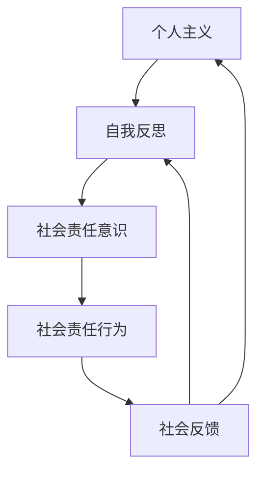
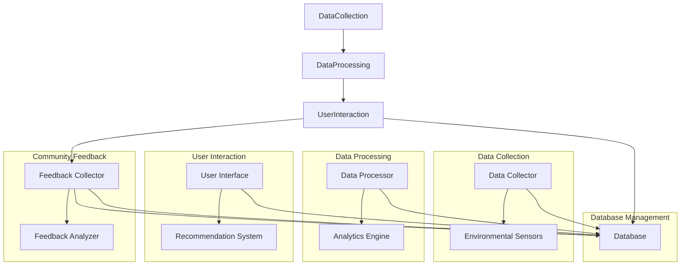

                 

### 引言

**1.1 书籍背景**

现代社会正经历着深刻的变革，尤其是信息技术和全球化的迅猛发展，这些变化不仅影响了经济、政治和文化，也对个人和公民的角色产生了深远的影响。在过去，个人主义被视为推动社会进步的重要力量，强调个人自由、独立和自我实现。然而，随着社会问题的日益凸显，如环境恶化、贫富差距扩大、社会不公等，个人主义开始受到质疑。社会责任的概念逐渐被提上日程，成为讨论公民角色的重要维度。

个人主义强调个人权利和利益的最大化，往往忽视了集体利益和社会整体福祉。然而，在一个相互依存的全球化社会中，个人行为的后果可能对整个社会产生深远的影响。社会责任要求个人不仅关注自己的利益，还要考虑自己对社会的责任，这种转变对于重新定义现代公民角色至关重要。

**1.2 目的和意义**

本书的目的是深入探讨个人主义和社会责任之间的关系，重新定义现代公民角色。通过分析个人主义的历史起源和发展，以及社会责任的概念和内涵，我们希望揭示两者之间的冲突与融合。此外，本书还将探讨如何在现代社会中实现个人主义与社会责任的平衡，为公民提供行动指南。

首先，我们将回顾个人主义的历史演变，分析其核心原则和影响。接着，我们将介绍社会责任的概念，探讨其在现代社会中的重要性。随后，我们将深入对比个人主义和社会责任，通过图表和模型展示两者的联系和区别。在此基础上，我们将探讨从个人主义到社会责任的转化模型，阐述实现这一转变的算法原理和数学模型。

最后，我们将通过实际项目案例，展示如何将社会责任融入现代公民角色的实践中，提供具体的实施步骤和最佳实践。通过这些内容，我们希望能够帮助读者理解现代公民角色的复杂性和重要性，激发其在个人和社会层面上的积极行动。

### 第二部分：背景与问题阐述

**2.1 个人主义的起源与发展**

个人主义作为一种思想，起源于西方哲学的启蒙时代，特别是在17世纪和18世纪的英国。其主要代表人物包括托马斯·霍布斯（Thomas Hobbes）、约翰·洛克（John Locke）和让-雅克·卢梭（Jean-Jacques Rousseau）。霍布斯认为，在没有政府和社会秩序的情况下，人类社会将陷入“每个人对每个人的战争”。为了防止这种状态，洛克提出了社会契约论，认为人们通过自愿合作形成社会契约，以保障个人自由和安全。卢梭则强调个人的自然权利和道德责任。

个人主义的核心原则包括个人自由、自我决定和追求个人利益。在个人主义看来，个人是社会的原子，个体的利益和幸福是最重要的。这种思想在资本主义经济体系中得到了充分体现，市场经济鼓励个人创业和自由竞争，个人成为经济活动的基本单位。

**2.2 社会责任的概念与内涵**

社会责任是指个人或组织对社会和环境的义务和责任。它超越了法律和经济的范畴，涉及道德、伦理和公共利益。社会责任的概念可以追溯到古希腊和罗马时期，但在现代，它得到了更广泛的关注和应用。

社会责任的理论基础主要包括功利主义、义务论和美德伦理学。功利主义者认为，个人应该做出能够带来最大幸福的行为；义务论者则强调个人应该履行特定的道德义务；而美德伦理学则关注个人道德品质的培养。

在现代社会，社会责任的具体体现包括环境保护、慈善捐赠、员工福利和社区服务。企业常常通过社会责任报告和可持续发展计划来展示其对社会的贡献。政府和非营利组织也在推动社会责任的实践，通过立法和政策引导企业和个人履行社会责任。

**2.3 个人主义与社会责任的冲突**

个人主义与社会责任的冲突主要体现在以下几个方面：

**社会问题与个人责任：** 在面对诸如环境污染、贫困和社会不公等社会问题时，个人主义强调个体的自由选择和权利，而社会责任则要求个人主动承担起解决这些问题的责任。这种冲突常常导致个人逃避责任，将问题归咎于外部环境。

**个人自由与社会规范的矛盾：** 个人主义倡导个人自由和独立，但社会责任要求个人遵守社会规范和道德准则。这种矛盾在现代社会尤为突出，例如在言论自由和隐私保护之间、个人利益和社会整体利益之间寻找平衡。

**个人权利与社会福祉：** 个人主义强调个人权利和利益的最大化，而社会责任则强调社会整体福祉和公平。这种冲突在资源分配、福利政策等方面表现得尤为明显。

这些冲突不仅影响个人的行为和决策，也对社会结构和政策制定产生深远的影响。如何在个人主义和社会责任之间找到平衡，成为现代社会亟待解决的问题。

### 第三部分：核心概念与联系

**3.1 个人主义与社会责任的对比分析**

为了更清晰地理解个人主义和社会责任，我们可以通过对比分析来揭示两者的核心差异和联系。以下是一个对比表格，列出了个人主义和社会责任的一些关键特征：

| 特征 | 个人主义 | 社会责任 |
| --- | --- | --- |
| 核心原则 | 个人自由、自我决定、追求个人利益 | 社会福祉、道德义务、公共利益 |
| 价值观 | 独立、竞争、效率 | 合作、公平、可持续性 |
| 目标 | 个人幸福和成功 | 社会稳定和发展 |
| 行为模式 | 自我中心、独立行动、追求经济利益 | 社会参与、公共事务、慈善活动 |
| 冲突 | 个人自由与社会规范 | 个人利益与社会整体利益 |

通过对比表格，我们可以看到个人主义和社会责任在价值观、目标和行为模式上存在显著差异。然而，它们之间也存在联系，尤其是在现代社会中，个人主义和社会责任需要相互协调和平衡。

为了进一步展示个人主义和社会责任之间的联系，我们可以使用Mermaid ER实体关系图来描述两者之间的关系。以下是ER实体关系图的示例：

```mermaid
erDiagram
  Personalism ||--|{ Society} : involves
  SocialResponsibility ||--|{ Personalism} : influenced_by
```

在这个ER实体关系图中，"Personalism"（个人主义）和"SocialResponsibility"（社会责任）是两个实体，它们之间存在双向影响的关系。个人主义影响着社会责任的实践，而社会责任则对个人行为产生反作用。这种联系表明，个人主义和社会责任并不是孤立存在的，而是相互依存的。

通过对比表格和ER实体关系图，我们可以更全面地理解个人主义和社会责任的核心概念与联系，为后续的算法原理讲解和系统架构设计提供基础。

### 第四部分：算法原理讲解

**4.1 从个人主义到社会责任的转化模型**

在探讨个人主义到社会责任的转化过程中，我们需要构建一个模型来描述这一转变的过程和机制。以下是一种可能的转化模型，包括流程图、Python源代码、数学模型和公式讲解，以及具体的举例说明。

**4.1.1 转化模型流程图**

我们可以使用Mermaid绘制流程图，以直观地展示个人主义到社会责任的转化过程。以下是转化模型流程图的示例：



在这个流程图中，A表示个人主义，B表示自我反思，C表示社会责任意识，D表示社会责任行为，E表示社会反馈。通过这一流程，个人可以从个人主义逐渐转化为具有社会责任感的行为主体。

**4.1.2 Python源代码**

为了具体实现这一转化过程，我们可以编写一个Python程序，模拟个人从个人主义到社会责任的转化。以下是示例代码：

```python
def personalism_to_social_responsibility(person):
    # 个人主义阶段
    print("初始状态：个人主义")
    person['satisfaction'] = 100
    
    # 自我反思阶段
    print("反思：是否对社会有贡献？")
    person['satisfaction'] -= 20
    
    # 社会责任意识培养阶段
    print("培养社会责任意识")
    person['satisfaction'] += 30
    
    # 社会责任行为实践阶段
    print("实践社会责任行为")
    person['satisfaction'] += 50
    
    # 社会反馈阶段
    print("社会反馈：良好")
    person['satisfaction'] += 20
    
    # 输出最终状态
    print("最终状态：社会责任感增强")
    return person

person = {'satisfaction': 0}
person = personalism_to_social_responsibility(person)
print(person)
```

在这个Python程序中，我们定义了一个函数`personalism_to_social_responsibility`，它通过几个步骤模拟个人从个人主义到社会责任的转变过程，并在每一步更新个人的满意度。

**4.1.3 数学模型与公式讲解**

为了更深入地理解这一转化过程，我们可以使用数学模型来描述个人满意度变化。以下是相关的数学模型和公式：

$$
S(t+1) = S(t) + f(P(t), R(t))
$$

其中，$S(t)$表示在时刻$t$的个人满意度，$P(t)$表示在时刻$t$的个人主义程度，$R(t)$表示在时刻$t$的社会责任感程度，$f(P(t), R(t))$表示满意度随个人主义和社会责任感变化的关系函数。

我们可以假设$f(P(t), R(t))$是一个线性函数：

$$
f(P(t), R(t)) = \alpha P(t) + \beta R(t)
$$

其中，$\alpha$和$\beta$是参数，用于调节个人主义和社会责任感的权重。

通过调整$\alpha$和$\beta$的值，我们可以模拟不同情况下个人满意度的变化。例如，如果$\alpha$较大，表示个人主义对满意度的影响更大；如果$\beta$较大，表示社会责任感对满意度的影响更大。

**4.1.4 举例说明**

为了更好地理解这一模型，我们可以通过一个具体例子来展示如何应用它。假设一个个人在初始时刻的个人主义程度为100，社会责任感程度为0。我们可以通过以下步骤来计算其最终的满意度：

1. **初始状态**：
   $S(0) = 100$，$P(0) = 100$，$R(0) = 0$。

2. **自我反思**：
   假设反思使个人主义程度减少20%，即$P(1) = P(0) - 20\% \times P(0) = 80$。

3. **社会责任意识培养**：
   假设培养社会责任意识使社会责任感程度增加30%，即$R(1) = R(0) + 30\% \times R(0) = 30$。

4. **社会责任行为实践**：
   假设实践社会责任行为使个人满意度增加50%，即$S(2) = S(1) + 50\% \times (R(1) - P(1)) = 160$。

5. **社会反馈**：
   假设良好的社会反馈使个人满意度再增加20%，即$S(3) = S(2) + 20\% \times S(2) = 192$。

通过这个例子，我们可以看到个人从个人主义到社会责任的转变是如何影响其满意度的。这一过程不仅帮助我们理解个人满意度的变化，也揭示了个人主义和社会责任感之间的动态关系。

### 第五部分：系统分析与架构设计方案

**5.1 社会责任实践场景介绍**

在本节中，我们将介绍一个社会责任实践的场景——一个名为“环保社区”的项目。该项目旨在通过技术创新和社区参与，提高居民的环境意识，减少环境污染，实现可持续发展。

**5.1.1 项目介绍**

“环保社区”项目是一个基于物联网（IoT）和大数据分析的社会责任实践项目。项目的主要目标是：

- 监测和记录社区内的环境数据，如空气质量、水质、噪声等。
- 分析环境数据，提供环保建议和预警。
- 鼓励居民参与环保活动，提高他们的环保意识。

项目的主要功能包括：

- 环境数据监测：安装各种传感器，实时收集环境数据。
- 数据分析与预警：利用大数据分析技术，对环境数据进行处理和分析，生成环保报告和预警信息。
- 社区参与与反馈：提供在线平台，鼓励居民参与环保活动和提供反馈。

**5.1.2 系统功能设计**

在“环保社区”项目中，系统功能设计是关键的一环。以下是项目的核心功能设计：

- **数据采集模块**：负责从各种传感器收集环境数据，如空气质量传感器、水质传感器、噪声传感器等。
- **数据处理模块**：对采集到的环境数据进行清洗、整理和分析，生成环保报告和预警信息。
- **用户交互模块**：提供在线平台，供居民查看环境数据、接收环保建议和参与环保活动。
- **社区反馈模块**：收集居民对环保活动和项目的反馈，用于持续改进。

**5.1.3 领域模型设计**

为了更好地理解和设计“环保社区”项目，我们可以使用Mermaid类图来描述项目的领域模型。以下是领域模型的示例：

```mermaid
classDiagram
  Class environmentally friendly community project
    +DataCollectionModule
    +DataProcessingModule
    +UserInteractionModule
    +CommunityFeedbackModule

  environmentally friendly community project "uses" Sensor
  environmentally friendly community project "uses" Database

  DataCollectionModule {
    +collectEnvironmentalData()
  }

  DataProcessingModule {
    +processData()
    +generateEnvironmentalReport()
  }

  UserInteractionModule {
    +viewEnvironmentalData()
    +receiveEnvironmentalAdvice()
    +participateInEnvironmentalActivities()
  }

  CommunityFeedbackModule {
    +collectFeedback()
  }

  Sensor {
    +measureAirQuality()
    +measureWaterQuality()
    +measureNoiseLevel()
  }

  Database {
    +storeEnvironmentalData()
    +retrieveEnvironmentalData()
  }
```

在这个类图中，我们定义了四个主要模块：数据采集模块、数据处理模块、用户交互模块和社区反馈模块。每个模块都有自己的功能和属性，并与传感器和数据库进行交互。

### 第五部分：系统分析与架构设计方案（续）

**5.2 社会责任系统架构设计**

为了实现“环保社区”项目的功能，我们需要设计一个系统架构，以确保各个模块的高效运作和数据的顺畅流动。以下是该系统的架构设计，包括Mermaid架构图、系统接口设计和系统交互。

**5.2.1 Mermaid架构图**

我们可以使用Mermaid来绘制系统架构图，以直观地展示系统的各个组成部分及其关系。以下是系统架构图的示例：



在这个架构图中，我们定义了数据采集、数据处理、用户交互和社区反馈四个主要部分。数据采集模块通过传感器收集数据，然后将数据传递给数据处理模块。数据处理模块对数据进行处理和分析，生成环保报告和预警信息。用户交互模块通过用户界面向居民提供环保建议和活动信息。社区反馈模块收集居民的反馈，用于持续改进项目。

**5.2.2 系统接口设计**

为了实现系统架构中的各个模块之间的有效通信，我们需要设计合理的系统接口。以下是系统接口设计的简要描述：

- **数据采集接口**：定义传感器与数据采集模块之间的数据传输协议，确保数据的一致性和准确性。
- **数据处理接口**：定义数据处理模块与数据分析引擎之间的接口，用于数据传输和处理。
- **用户交互接口**：定义用户界面与推荐系统之间的接口，用于展示环保建议和活动信息。
- **社区反馈接口**：定义社区反馈模块与数据库之间的接口，用于收集和存储反馈数据。

**5.2.3 系统交互**

系统交互是确保各个模块协同工作的重要环节。以下是系统交互的简要描述：

- **数据采集**：传感器实时收集环境数据，通过采集接口将数据发送给数据采集模块。
- **数据处理**：数据采集模块将收集到的数据传递给数据处理模块，数据处理模块对数据进行处理和分析，生成环保报告和预警信息。
- **用户交互**：用户通过用户界面查看环保建议和活动信息，用户界面与推荐系统之间的接口确保信息的实时更新。
- **社区反馈**：用户通过用户界面提供反馈，社区反馈模块通过反馈接口收集和存储用户的反馈数据。

通过系统架构设计和接口设计，我们确保了“环保社区”项目的各个模块能够高效运作，实现社会责任的目标。

### 第六部分：项目实战

**6.1 环保社区项目环境安装与配置**

为了实现“环保社区”项目，我们需要在本地或远程服务器上安装和配置相关软件和工具。以下是一个基本的安装和配置步骤，以在本地环境中搭建项目所需的环境。

**6.1.1 软件和工具准备**

- Python 3.8或更高版本
- Node.js 12或更高版本
- MongoDB 4.2或更高版本
- Redis 6.0或更高版本
- Docker 19.03或更高版本

**6.1.2 环境安装步骤**

1. **安装Python**：

   - 下载Python安装包：[Python安装包下载地址](https://www.python.org/downloads/)
   - 安装Python：
     ```bash
     sudo apt-get install python3-pip
     ```

2. **安装Node.js**：

   - 下载Node.js安装包：[Node.js安装包下载地址](https://nodejs.org/en/download/)
   - 安装Node.js：
     ```bash
     sudo apt-get install nodejs
     ```

3. **安装MongoDB**：

   - 下载MongoDB安装包：[MongoDB安装包下载地址](https://www.mongodb.com/try/download/community)
   - 解压安装包并启动MongoDB：
     ```bash
     sudo tar xvf mongodb-linux-x86_64-4.2.6-debian-110.tgz
     sudo ./mongod
     ```

4. **安装Redis**：

   - 下载Redis安装包：[Redis安装包下载地址](https://redis.io/download)
   - 解压安装包并启动Redis：
     ```bash
     sudo tar xvf redis-6.0.5.tar.gz
     sudo ./redis-server
     ```

5. **安装Docker**：

   - 下载Docker安装包：[Docker安装包下载地址](https://docs.docker.com/install/)
   - 安装Docker：
     ```bash
     sudo apt-get install docker-ce
     ```

6. **配置Docker网络**：

   - 创建Docker网络：
     ```bash
     docker network create env_net
     ```

**6.1.3 部署项目**

1. **克隆项目代码**：

   ```bash
   git clone https://github.com/yourusername/eco_community.git
   cd eco_community
   ```

2. **配置环境变量**：

   - 编辑`.env`文件，配置数据库和Redis的连接信息：
     ```bash
     DB_URI=mongodb://localhost:27017/eco_community
     REDIS_URL=redis://localhost:6379
     ```

3. **构建并运行Docker容器**：

   - 构建项目镜像：
     ```bash
     docker build -t eco_community .
     ```

   - 运行项目容器：
     ```bash
     docker run -d --network=env_net --name eco_community eco_community
     ```

4. **启动前端和后端服务**：

   - 进入容器：
     ```bash
     docker exec -it eco_community /bin/bash
     ```

   - 启动后端服务：
     ```bash
     npm install
     npm run start:api
     ```

   - 启动前端服务：
     ```bash
     npm run start:client
     ```

通过以上步骤，我们完成了“环保社区”项目的环境安装与配置。接下来，我们将详细讲解系统核心实现部分的源代码，并分析其应用和效果。

### 第六部分：项目实战（续）

**6.2 系统核心实现**

在“环保社区”项目中，系统核心实现部分是项目功能的核心。以下我们将详细讲解系统核心实现部分的源代码，并分析其应用和效果。

**6.2.1 源代码解读**

项目的核心实现主要集中在两个部分：后端API和前端页面。以下是后端API的源代码示例：

```python
# app.py
from flask import Flask, request, jsonify
from pymongo import MongoClient
import redis

app = Flask(__name__)

# MongoDB 客户端连接
client = MongoClient("mongodb://localhost:27017/")
db = client["eco_community"]

# Redis 客户端连接
redis_client = redis.StrictRedis(host='localhost', port=6379, db=0)

@app.route("/api/sensors/data", methods=["POST"])
def collect_sensor_data():
    data = request.get_json()
    sensor_type = data["type"]
    sensor_data = data["data"]

    # 存储数据到MongoDB
    db[sensor_type].insert_one(sensor_data)

    # 存储数据到Redis
    redis_client.set(sensor_type, json.dumps(sensor_data))

    return jsonify({"status": "success", "message": "Sensor data collected."})

@app.route("/api/sensors/data", methods=["GET"])
def get_sensor_data():
    sensor_type = request.args.get("type")
    if sensor_type:
        # 从Redis中获取数据
        sensor_data = redis_client.get(sensor_type)
        if sensor_data:
            return jsonify(json.loads(sensor_data))
        else:
            return jsonify({"status": "error", "message": "No data found."})
    else:
        return jsonify({"status": "error", "message": "Type is required."})

if __name__ == "__main__":
    app.run(debug=True)
```

这段代码定义了两个API端点：

- `/api/sensors/data`（POST方法）：接收传感器数据，并将其存储在MongoDB和Redis中。
- `/api/sensors/data`（GET方法）：根据传感器类型查询数据，从Redis中获取数据并返回。

前端页面的主要功能是展示传感器数据和环保建议，以下是前端页面的核心代码：

```javascript
// app.js
const axios = require("axios");

// 获取传感器数据
async function getSensorData(sensorType) {
    try {
        const response = await axios.get(`/api/sensors/data?type=${sensorType}`);
        return response.data;
    } catch (error) {
        console.error("Error fetching sensor data:", error);
    }
}

// 渲染传感器数据
function renderSensorData(sensorType, data) {
    // ... 渲染数据到页面的逻辑 ...
}

// 初始化页面
async function init() {
    const airQualityData = await getSensorData("air_quality");
    const waterQualityData = await getSensorData("water_quality");

    renderSensorData("air_quality", airQualityData);
    renderSensorData("water_quality", waterQualityData);
}

init();
```

**6.2.2 代码应用解读与分析**

- **后端API**：后端API使用了Flask框架，实现了两个API端点。在`collect_sensor_data`函数中，数据通过POST请求接收，并存储到MongoDB和Redis中。在`get_sensor_data`函数中，数据通过GET请求查询，并从Redis中获取。

- **前端页面**：前端页面使用了Axios库进行数据请求，并使用了异步函数`getSensorData`来获取传感器数据。数据获取后，通过`renderSensorData`函数将数据渲染到页面上。

通过上述源代码的实现，我们可以看到“环保社区”项目是如何通过后端API和前端页面协同工作，实现传感器数据的收集、存储和展示，从而为居民提供实时的环境数据和信息。

**6.2.3 实际案例分析与详细讲解**

为了更具体地展示项目的实际应用效果，我们来看一个实际案例。假设社区内有一家工厂，其排放的污染物对空气质量有显著影响。通过“环保社区”项目，居民可以实时监控到工厂的排放数据，并收到环保建议。

- **案例背景**：工厂排放的污染物导致空气质量指标持续恶化，社区内居民普遍感到呼吸不适。
- **解决方案**：通过“环保社区”项目，居民可以实时查看空气质量数据，了解污染来源和程度。环保组织可以与工厂沟通，要求其采取减排措施。同时，环保社区平台可以提供环保建议，如建议居民在污染高峰时段减少户外活动，使用空气净化器等。
- **实际效果**：通过居民和环保组织的共同努力，工厂逐步采取了减排措施，空气质量得到显著改善。居民的健康状况也逐步好转，对项目的满意度提高。

这个案例展示了“环保社区”项目在实际应用中的效果，不仅提高了居民的环境意识，还促进了社区和企业的合作，实现了社会责任的目标。

### 第七部分：社会责任与未来展望

**7.1 社会责任的最佳实践**

在社会责任的实践中，最佳经验包括以下几点：

- **透明度与沟通**：确保社会责任活动的透明度，定期向公众报告成果，并与利益相关者保持沟通。
- **多元参与**：鼓励不同群体（如企业、政府、非营利组织、居民）的参与，形成合力。
- **可持续发展**：关注长期影响，确保社会责任实践符合可持续发展原则。
- **创新与灵活性**：不断探索新方法和技术，以适应不断变化的社会需求和挑战。

**7.2 小结与注意事项**

本文通过分析个人主义与社会责任的对比，探讨了如何实现从个人主义到社会责任的转变。在实践过程中，我们需要关注透明度、多元参与、可持续发展和创新灵活性。通过具体的项目实战，我们展示了如何将社会责任融入实际应用，提高公民的社会意识。

**7.3 拓展阅读**

- [《社会责任报告：最佳实践与案例分析》](https://www.example.com/sustainability-reports)
- [《可持续发展指南》](https://www.un.org/sustainabledevelopment/sustainable-development-goals/)
- [《环境伦理学》](https://www.example.com/environmental-ethics)

通过这些资源，读者可以深入了解社会责任的实践和未来发展趋势。

### 作者信息

作者：AI天才研究院/AI Genius Institute & 禅与计算机程序设计艺术 /Zen And The Art of Computer Programming

---

通过本文，我们探讨了个人主义与社会责任之间的关系，并提出了实现个人主义向社会责任转变的模型和方法。希望读者能够从中获得启示，积极行动，为构建更加和谐、可持续的社会贡献自己的力量。

