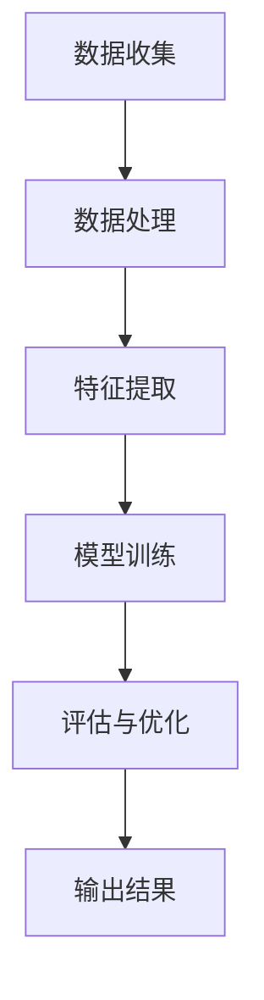
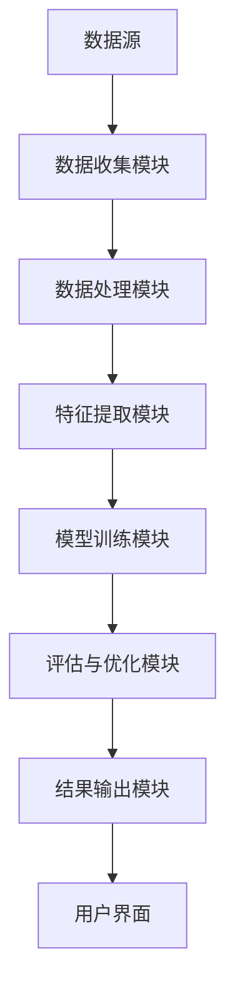
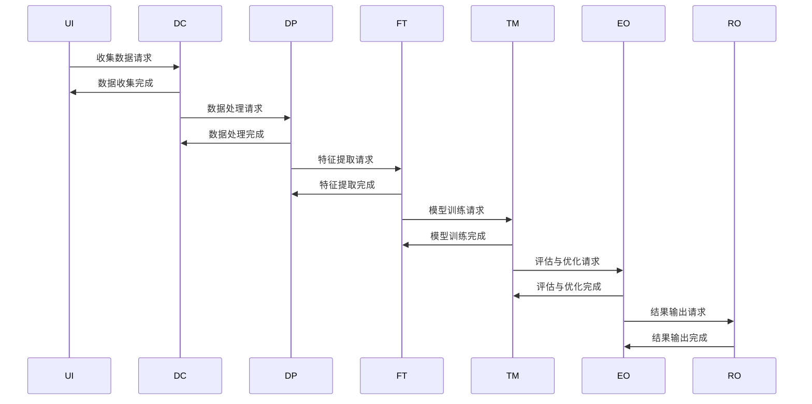
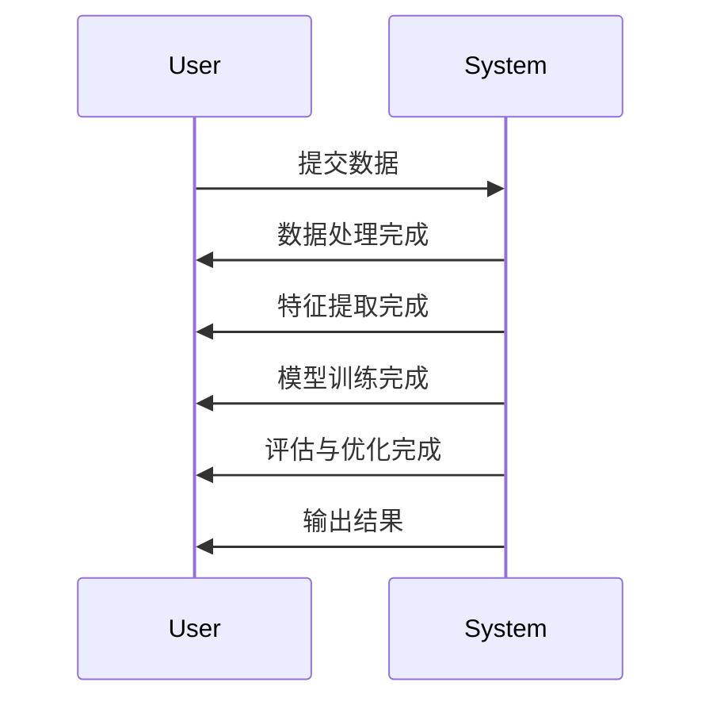

                 

### 从个人利益到公共福祉：重新思考社会责任

#### 关键词：社会责任、公共福祉、个人利益、平衡策略、系统架构

#### 摘要：
在现代社会，个人利益与公共福祉之间的平衡是一个重要的议题。本文旨在探讨如何在个人追求利益的同时，确保社会整体的福祉。通过详细分析社会责任的历史演变、个人行为对社会的影响、社会责任感的培养、公共福祉的实现路径等，本文提出了平衡个人利益与公共福祉的策略，并设计了一套社会责任评估系统。通过系统分析与架构设计，本文展示了如何将理论付诸实践，为构建一个和谐、可持续的社会提供参考。

---

## 第1章 引言

在信息技术飞速发展的时代，个人与社会的关系正在发生深刻变革。作为技术驱动的社会的重要组成部分，我们每个人都有责任思考如何在追求个人利益的同时，为社会整体福祉做出贡献。然而，个人利益与公共福祉之间的平衡并非易事，它需要我们在理解社会责任的历史与演变、个人行为对社会的影响、社会责任感的培养等方面进行深入思考。

本文将围绕以下核心问题展开讨论：

- 社会责任的历史与演变是什么？
- 个人行为如何影响社会福祉？
- 如何培养社会责任感？
- 公共福祉的实现路径有哪些？
- 如何在个人利益与公共福祉之间找到平衡点？

通过系统化的分析和论述，本文希望能够为读者提供一套全面、实用的理论框架，以指导我们在现实社会中更好地践行社会责任，共同推动公共福祉的实现。

### 1.1 问题背景与核心概念

**社会责任的历史与演变**

社会责任的概念并非一成不变，它随着人类社会的发展而不断演进。在古代社会，个体与集体的关系相对简单，社会责任主要体现为对家庭和部落的忠诚与贡献。随着文明的进步，社会责任的范围逐渐扩展，从家庭和部落扩展到城市和国家。特别是在工业革命之后，随着城市化进程的加快和现代社会组织的复杂化，社会责任的概念进一步深化，不再局限于物质贡献，更强调道德、伦理和社会义务。

在20世纪初，随着全球化和信息化的发展，社会责任的重要性日益凸显。企业社会责任（CSR）成为企业管理的重要一环，不仅仅关注企业的经济绩效，更强调企业在环境保护、员工福利、社区发展等方面的责任。同时，个人社会责任也受到越来越多的关注，人们开始思考如何在日常生活中践行社会责任，为社会的可持续发展贡献力量。

**个人利益与公共福祉的冲突**

个人利益与公共福祉之间的关系往往是复杂而微妙的。在追求个人利益的过程中，个人可能会采取一些对个人有利但对社会有害的行为，如过度消费、环境污染、不公平竞争等。这些行为虽然满足了个人短期的利益，但却可能对公共福祉造成长期损害。例如，个人在购买高能耗电器时，可能会获得即时的方便和舒适，但同时也加剧了能源消耗和环境污染问题。

另一方面，为了维护公共福祉，有时需要个人牺牲部分利益。例如，政府可能通过税收和政策来限制过度消费和环境污染，从而实现社会的长期可持续发展。这种情况下，个人可能需要调整自己的行为模式，接受一定程度的不便，以换取社会的整体福祉。

**社会责任在现代社会中的重要性**

在现代社会，社会责任已经成为一个不可或缺的概念。随着全球化、信息化和城市化的发展，社会分工和合作日益复杂，每个人都在社会系统中扮演着不同的角色。因此，社会责任不仅仅是企业或政府的事情，更是每一个公民的责任。社会责任的重要性体现在以下几个方面：

1. **社会稳定与和谐**：一个充满责任感的社会能够更好地维护社会稳定和和谐。每个人都意识到自己在社会中的角色和责任，能够更好地理解并尊重他人的权利和利益，从而减少冲突和矛盾。

2. **可持续发展**：社会责任强调在满足当前需求的同时，不损害未来世代的利益。通过践行社会责任，个人和企业能够在经济、社会和环境三个维度上实现可持续发展。

3. **道德与伦理**：社会责任不仅是一种行为准则，更是一种道德和伦理的体现。通过履行社会责任，个人和企业能够树立良好的社会形象，赢得社会的尊重和信任。

4. **个人成长与发展**：社会责任感的培养有助于个人的全面发展。通过参与社会公益活动、关注社会问题，个人能够提升自己的社会意识和责任感，从而实现个人的价值。

总之，社会责任在现代社会中具有极其重要的意义。它不仅关系到社会的稳定和可持续发展，也关系到每一个个体的成长和发展。理解和践行社会责任，已经成为现代社会的必备素质。

### 1.2 个人利益与社会责任的关系

个人行为对社会的影响不可忽视。在现代社会，个人利益与社会责任之间的关系尤为复杂，二者既相互矛盾，又相互依存。理解这种关系，有助于我们在追求个人利益的同时，更好地履行社会责任。

**个人行为对社会的影响**

首先，个人行为直接影响到社会的发展和稳定。积极的行为，如志愿服务、慈善捐助、环保行动等，能够提升社会的道德水平，增强社区的凝聚力，促进社会的和谐发展。而消极的行为，如违法乱纪、欺诈行为、过度消费等，则可能对社会的稳定造成威胁，破坏社会公平正义。

例如，一个人选择参与志愿服务，不仅能够为社会提供实际的帮助，还能激发他人的社会责任感，形成良性循环。而一个人选择违法乱纪，则可能引发连锁反应，破坏社会的法治环境，影响社会的长远发展。

**社会责任感的培养**

社会责任感的培养是个人行为对社会影响的重要保障。社会责任感不仅仅是一种道德准则，更是一种行为习惯。它要求个人在日常生活中，时刻关注社会问题，积极参与社会事务，主动承担社会责任。

培养社会责任感需要从以下几个方面入手：

1. **教育**：教育是培养社会责任感的重要途径。通过学校教育、家庭教育和社会教育，个人能够逐渐树立正确的价值观和社会责任感。例如，学校可以组织社会实践活动，让学生亲身体验社会的多样性和复杂性，从而培养他们的社会责任感。

2. **社会环境**：社会环境对个人的社会责任感有重要影响。一个公平、公正、开放的社会环境能够激发个人的社会责任感，而一个不公平、不公正的社会环境则可能削弱个人的社会责任感。

3. **媒体宣传**：媒体是传播社会责任感的重要载体。通过宣传正能量、弘扬社会责任感，媒体能够引导公众关注社会问题，提升社会责任感。

4. **个人自律**：个人自律是社会责任感的重要体现。通过自我约束，个人能够更好地履行社会责任，为社会做出积极贡献。

**平衡个人利益与公共福祉的策略**

在个人利益与社会责任之间找到平衡点，是每个人都需要面对的挑战。以下是一些平衡策略：

1. **合理规划**：个人在追求利益时，应合理规划，考虑长远利益和短期利益的关系。例如，在购买商品时，可以选择环保产品，既满足个人需求，又保护环境。

2. **自愿参与**：社会责任感的培养需要自愿参与。个人应主动参与社会公益活动，不仅是为了满足社会责任感，更是为了实现个人价值。

3. **法律法规**：法律法规是平衡个人利益与公共福祉的重要保障。个人在追求利益时，应遵守法律法规，不得损害社会公共利益。

4. **社会监督**：社会监督是确保个人行为不偏离公共福祉的重要手段。通过社会监督，个人行为能够受到约束，确保其符合社会责任的要求。

总之，个人利益与社会责任之间的关系是复杂而微妙的。通过培养社会责任感，采用合理的平衡策略，我们能够在追求个人利益的同时，更好地履行社会责任，为社会整体福祉做出贡献。

### 1.3 公共福祉的实现路径

公共福祉的实现是一个多层次、多维度的复杂过程，涉及到政府、社会组织、企业以及个人等多方力量的共同努力。以下将探讨这些主体在公共福祉实现中的角色、作用及相互关系。

**社会组织在公共福祉中的作用**

社会组织，如非政府组织（NGO）、社区组织、慈善机构等，在公共福祉的实现中发挥着不可或缺的作用。它们通过直接服务、倡导政策变革、提供资源支持等方式，为弱势群体提供帮助，推动社会公平和正义。

1. **直接服务**：社会组织通过开展各种公益活动，如扶贫救助、健康服务、教育支持等，直接服务于那些需要帮助的人群，提高他们的生活质量。

2. **政策倡导**：社会组织通过研究社会问题，提出政策建议，推动政府制定和实施有利于公共福祉的政策。例如，环境保护组织可以倡导政府加强环境保护立法，推动环境治理。

3. **资源整合**：社会组织通过整合社会资源，为公共福祉的实现提供支持。它们可以筹集资金、物资，动员社会力量参与公益活动，提高公共福祉的实现效率。

**公共政策对公共福祉的影响**

公共政策是政府通过立法、行政和财政等手段，对社会资源进行配置，以实现公共福祉的重要工具。公共政策的制定和执行对公共福祉的实现具有重要影响。

1. **立法保障**：政府通过立法，为公共福祉的实现提供法律保障。例如，通过制定环境保护法、教育法等，确保公共资源的合理分配和社会公平。

2. **行政执行**：政府通过行政手段，确保公共政策的有效执行。例如，通过监管、执法等手段，确保环境保护政策、社会保障政策的落实。

3. **财政支持**：政府通过财政手段，为公共福祉的实现提供资金支持。例如，通过税收收入、财政拨款等，支持教育、医疗、社会保障等公共服务的发展。

**社会创新在公共福祉中的角色**

社会创新是推动公共福祉实现的重要动力。它通过创新理念、技术和模式，提高公共服务的效率和质量，满足人民群众日益增长的美好生活需要。

1. **创新理念**：社会创新强调以用户需求为导向，通过创新思维，提出新的公共服务模式。例如，智慧城市建设通过信息技术创新，提升城市管理和服务的智能化水平。

2. **技术创新**：社会创新通过技术创新，提高公共服务的效率和效果。例如，人工智能技术在医疗、教育等领域的应用，提高了服务的精准度和覆盖面。

3. **模式创新**：社会创新通过模式创新，优化公共服务的资源配置。例如，共享经济模式通过互联网技术，实现了闲置资源的优化配置，提高了公共资源的利用效率。

总之，公共福祉的实现需要政府、社会组织、企业和个人等多方力量的共同努力。通过明确各自的角色和作用，协同合作，我们可以更好地实现公共福祉，为构建一个和谐、可持续的社会奠定基础。

### 第2章 核心概念与联系

在深入探讨社会责任、公共福祉和个人利益之间的关系之前，有必要首先明确这些核心概念的基本原理、属性特征及其相互之间的联系。通过系统地介绍这些概念，我们将为后续的分析和讨论奠定坚实的理论基础。

#### 2.1 核心概念原理

**社会责任**

社会责任是指一个组织（包括企业、政府和非营利组织）或个人在特定环境下，对其利益相关者（如员工、客户、社区和环境）应承担的义务和责任。社会责任的范畴广泛，包括经济、社会、环境等多个方面。其核心在于组织或个人不仅要追求经济利益，还要考虑其行为对社会和环境的长远影响。

**公共福祉**

公共福祉是指一个社会或国家通过资源分配和社会政策，旨在为全体成员提供基本生活保障、教育和医疗等公共服务，以实现社会公平和正义。公共福祉的实质在于通过集体行动，满足社会成员的基本需求和期望，提高整体生活质量。

**个人利益**

个人利益是指个体在追求自身福祉的过程中，所获得的物质和精神满足。个人利益通常体现在经济收入、职业发展、生活质量和个人幸福等方面。个人利益的追求是人的基本需求，也是推动社会进步的动力之一。

**核心概念间的联系**

社会责任、公共福祉和个人利益之间存在着密切的联系和相互作用。首先，社会责任是个人和组织的道德和伦理要求，其核心在于追求社会整体福祉。公共福祉则是社会责任的具体体现，通过政策和资源分配，实现社会公平和正义。个人利益与社会责任和公共福祉的关系在于，个人利益的合理追求不应损害社会整体福祉，而社会责任的履行也应在保障个人利益的基础上进行。

#### 2.2 概念属性特征对比表格

为了更直观地理解社会责任、公共福祉和个人利益的属性特征，我们可以通过以下对比表格进行说明：

| 特征         | 社会责任                         | 公共福祉                       | 个人利益                       |
| ------------ | -------------------------------- | ------------------------------ | ------------------------------ |
| 目标         | 道德和伦理要求，兼顾经济和社会责任 | 提高社会整体福祉和公平         | 实现个人经济和精神满足         |
| 实施主体     | 个人和组织（企业、政府、非营利组织） | 政府、社会组织和公共机构       | 个人个体                       |
| 作用范围     | 广泛，包括经济、社会和环境等方面   | 主要涉及公共服务和社会保障领域 | 个体层面，局限于个人需求和愿望 |
| 考量因素     | 道德伦理、法律法规、社会规范       | 资源分配、政策制定、公共服务质量 | 经济收益、职业发展、生活质量   |
| 衡量标准     | 社会认可度、道德评价、法律责任       | 公共满意度、社会公平程度、公共服务覆盖面 | 个人幸福感、经济收入、个人成就   |
| 实现途径     | 道德教育、法律法规、企业社会责任实践 | 公共政策、社会项目、公共服务改善 | 自我努力、市场机制、社会支持系统 |

通过上述对比，我们可以更清楚地看到这三个概念在目标、实施主体、作用范围、考量因素、衡量标准和实现途径等方面的差异和联系。

#### 2.3 ER实体关系图架构

为了更系统地展示社会责任、公共福祉和个人利益之间的关系，我们可以通过ER（实体关系）图来描述这些概念之间的联系。以下是社会责任、公共福祉和个人利益的ER图结构：

```mermaid
erDiagram
  社会责任 ||--|{ 公共福祉 }
  公共福祉 ||--|{ 个人利益 }
  个人利益 ||--|{ 社会责任 }
```

在这个ER图中：

- **社会责任**是**公共福祉**的父实体，表示社会责任是公共福祉的基础和来源。
- **公共福祉**是**个人利益**的父实体，表示公共福祉的实现直接影响到个人利益。
- **个人利益**是**社会责任**的子实体，表示个人利益的合理追求是社会责任的具体体现。

通过ER图，我们可以更直观地理解这三个核心概念之间的相互关系和层次结构，为后续的分析和讨论提供可视化支持。

### 第3章 算法原理讲解

在探讨社会责任、公共福祉和个人利益之间的关系时，运用算法进行定量分析和评估显得尤为重要。本节将详细介绍社会责任评估算法的基本原理，包括算法流程、实现方法以及相关的数学模型和公式。

#### 3.1.1 算法原理

社会责任评估算法的核心目标是通过数据分析和模型训练，对个人或组织在社会责任方面的表现进行量化评估。这一过程可以分为以下几个主要步骤：

1. **数据收集**：首先，需要收集与个人或组织社会责任相关的数据，如企业社会责任报告、公益活动记录、环保指标等。
   
2. **数据处理**：对收集到的数据进行预处理，包括数据清洗、缺失值填补、标准化等，以确保数据的质量和一致性。

3. **特征提取**：从处理后的数据中提取关键特征，这些特征将用于构建模型。例如，环保指标、公益捐赠金额、员工培训时长等。

4. **模型训练**：使用提取的特征数据，通过机器学习算法（如线性回归、决策树、神经网络等）训练一个社会责任评估模型。

5. **评估与优化**：通过测试集评估模型的性能，并根据评估结果对模型进行优化调整。

6. **结果输出**：最终，模型将输出社会责任评估得分，用于评价个人或组织在社会责任方面的表现。

#### 3.1.1.1 Mermaid流程图

为了更直观地展示算法的流程，我们可以使用Mermaid绘制流程图：



#### 3.1.1.2 Python源代码

下面是一个简单的社会责任评估算法的Python代码示例：

```python
# 社会责任评估算法示例代码
def social_responsibility_assessment(data):
    # 数据处理
    processed_data = preprocess_data(data)
    
    # 特征提取
    features = extract_features(processed_data)
    
    # 模型训练
    model = train_model(features)
    
    # 评估与优化
    evaluate_and_optimize(model, features)
    
    # 输出结果
    result = model.predict(features)
    return result
```

#### 3.1.1.3 数学模型和公式

社会责任评估算法的数学模型可以表示为：

$$
\text{社会责任评估得分} = f(\text{个人行为数据}, \text{社会环境数据})
$$

其中，$f$ 表示模型函数，它将个人行为数据和环境数据作为输入，输出一个社会责任评估得分。

具体来说，社会责任评估得分可以由以下公式计算：

$$
\text{社会责任评估得分} = \omega_1 \cdot \text{环保指标得分} + \omega_2 \cdot \text{公益捐赠得分} + \omega_3 \cdot \text{员工培训时长得分}
$$

其中，$\omega_1, \omega_2, \omega_3$ 分别是权重系数，用于平衡不同指标的重要性。

#### 3.1.2 算法举例说明

为了更具体地说明社会责任评估算法的应用，我们来看一个案例：企业社会责任报告分析。

**案例：企业社会责任报告分析**

假设某企业发布了一份社会责任报告，其中包括环保指标得分、公益捐赠得分和员工培训时长得分，如下所示：

- 环保指标得分：90分
- 公益捐赠得分：80分
- 员工培训时长得分：85分

根据上述数学模型，我们可以计算该企业的社会责任评估得分：

$$
\text{社会责任评估得分} = 0.5 \cdot 90 + 0.3 \cdot 80 + 0.2 \cdot 85 = 88.5分
$$

这个评估得分表明，该企业在社会责任方面表现良好，但仍有一些提升空间。

**案例分析**

1. **环保指标得分**：环保指标得分为90分，说明企业在环保方面做得很好，但可以进一步优化环保措施，提升环境绩效。

2. **公益捐赠得分**：公益捐赠得分为80分，虽然企业积极参与公益活动，但可以增加公益捐赠的金额和项目数量，以更好地支持社会公益事业。

3. **员工培训时长得分**：员工培训时长得分为85分，说明企业在员工培训方面投入较多，但可以进一步增加培训时长和质量，提升员工的专业技能和综合素质。

通过这个案例分析，我们可以看到社会责任评估算法如何帮助企业识别自身的优势和不足，为进一步提升社会责任表现提供参考。

### 第4章 系统分析与架构设计

#### 4.1 问题场景介绍

在现代社会，社会责任评估已经成为一个重要议题，无论是在企业内部管理、政府决策，还是个人行为规范方面，都需要一个有效的工具来进行评估和监控。然而，现有的社会责任评估方法往往依赖于人工分析和主观判断，缺乏系统的数据支持和模型训练，难以提供客观、准确的评估结果。因此，设计一个能够自动、高效地评估社会责任的系统显得尤为重要。

本章节旨在介绍如何设计一个社会责任评估系统，该系统通过数据收集、数据处理、特征提取、模型训练和评估与优化等步骤，实现对个人或组织社会责任表现的量化评估。通过系统架构设计和实现，本章节将为社会责任评估提供一套完整的解决方案。

#### 4.2 系统功能设计

社会责任评估系统主要包括以下几个功能模块：

1. **数据收集模块**：负责收集与企业、个人相关的社会责任数据，如环保指标、公益捐赠记录、员工培训数据等。

2. **数据处理模块**：对收集到的数据进行预处理，包括数据清洗、缺失值填补、数据标准化等，以确保数据的质量和一致性。

3. **特征提取模块**：从处理后的数据中提取关键特征，如环保指标得分、公益捐赠金额、员工培训时长等，为模型训练提供输入。

4. **模型训练模块**：使用机器学习算法，如线性回归、决策树、神经网络等，对提取的特征数据进行训练，构建社会责任评估模型。

5. **评估与优化模块**：通过测试集评估模型的性能，并根据评估结果对模型进行优化调整，以提高评估的准确性和可靠性。

6. **结果输出模块**：将社会责任评估得分和评估报告输出，为个人或组织提供客观的社会责任表现评价。

#### 4.2.1 领域模型Mermaid类图

为了更清晰地展示系统中的关键类和它们之间的关系，我们可以使用Mermaid绘制领域模型类图：

```mermaid
classDiagram
Class1 "数据收集" <<interface>>
Class2 "数据处理" <<interface>>
Class3 "特征提取" <<interface>>
Class4 "模型训练" <<interface>>
Class5 "评估与优化" <<interface>>
Class6 "结果输出" <<interface>>

Class1 --|{数据源}| Class2
Class2 --|{预处理数据}| Class3
Class3 --|{特征数据}| Class4
Class4 --|{训练模型}| Class5
Class5 --|{评估结果}| Class6
```

在这个类图中：

- **数据收集**：负责从各种数据源获取社会责任相关数据。
- **数据处理**：对收集到的数据进行预处理，包括清洗、填补和标准化等。
- **特征提取**：从预处理后的数据中提取关键特征，为模型训练提供输入。
- **模型训练**：使用机器学习算法对提取的特征数据进行训练，构建评估模型。
- **评估与优化**：通过测试集评估模型的性能，并进行优化调整。
- **结果输出**：将社会责任评估得分和评估报告输出，供用户参考。

#### 4.3 系统架构设计

社会责任评估系统的架构设计需要考虑到系统的可扩展性、稳定性和灵活性。以下是系统架构的Mermaid架构图：



在这个架构图中：

- **数据源**：包括企业社会责任报告、公益捐赠记录、环保指标数据等。
- **数据收集模块**：负责从数据源中获取社会责任相关数据。
- **数据处理模块**：对收集到的数据进行分析和处理，确保数据的质量和一致性。
- **特征提取模块**：从处理后的数据中提取关键特征，为模型训练提供输入。
- **模型训练模块**：使用机器学习算法对提取的特征数据进行训练，构建评估模型。
- **评估与优化模块**：通过测试集评估模型的性能，并根据评估结果对模型进行优化调整。
- **结果输出模块**：将社会责任评估得分和评估报告输出，供用户参考。
- **用户界面**：为用户提供一个交互界面，展示评估结果和报告。

#### 4.3.1 系统接口设计

为了实现系统的各个模块之间的数据交互和功能协同，我们需要设计一套完整的系统接口。以下是系统接口设计：



在这个接口设计中：

- **UI**：用户界面，负责与用户交互，接收用户请求和展示结果。
- **DC**：数据收集模块，负责从数据源中获取社会责任相关数据。
- **DP**：数据处理模块，负责对数据进行预处理。
- **FT**：特征提取模块，负责从预处理后的数据中提取关键特征。
- **TM**：模型训练模块，负责使用机器学习算法训练评估模型。
- **EO**：评估与优化模块，负责评估模型性能并进行优化。
- **RO**：结果输出模块，负责将评估结果和报告输出给用户。

#### 4.3.2 系统交互Mermaid序列图

为了更直观地展示系统模块之间的交互过程，我们可以使用Mermaid绘制系统交互序列图：



在这个序列图中：

- **User**：表示用户，负责提交数据请求。
- **System**：表示系统，负责处理用户请求并完成数据处理、特征提取、模型训练、评估与优化和结果输出等步骤。

通过上述系统架构设计和接口设计，我们可以构建一个完整、高效的社会责任评估系统，为个人和组织提供客观、准确的社会责任评估服务。

### 第5章 项目实战

在本章中，我们将通过一个具体的社会责任评估项目，展示如何将理论知识付诸实践。该项目旨在构建一个社会责任评估系统，通过数据收集、数据处理、特征提取、模型训练和评估与优化等步骤，对个人或组织的社会责任表现进行量化评估。以下是项目的详细实施步骤和关键代码。

#### 5.1 环境安装

在开始项目之前，我们需要安装必要的开发环境和依赖库。以下是安装步骤：

1. **Python环境**：确保Python环境已安装在您的计算机上。Python版本建议为3.8或以上。
2. **Anaconda**：安装Anaconda，以便更好地管理和依赖库。
3. **虚拟环境**：创建一个虚拟环境，以隔离项目依赖。
   ```bash
   conda create -n social_responsibility python=3.8
   conda activate social_responsibility
   ```
4. **依赖库**：安装项目所需的依赖库，包括pandas、numpy、scikit-learn、matplotlib等。
   ```bash
   conda install pandas numpy scikit-learn matplotlib
   ```

#### 5.2 系统核心实现

**数据收集模块**：

数据收集模块负责从不同数据源获取社会责任相关数据。以下是一个简单的数据收集示例：

```python
import pandas as pd

def collect_data():
    # 社会责任报告数据示例
    report_data = pd.DataFrame({
        'company': ['公司A', '公司B'],
        'environment_index': [90, 85],
        'charity_donation': [80000, 60000],
        'employee_training_hours': [1000, 800]
    })
    return report_data
```

**数据处理模块**：

数据处理模块负责对收集到的数据进行分析和处理，包括数据清洗、缺失值填补和标准化等：

```python
def preprocess_data(data):
    # 数据清洗
    data.dropna(inplace=True)
    
    # 数据标准化
    data[['environment_index', 'charity_donation', 'employee_training_hours']] = (data[['environment_index', 'charity_donation', 'employee_training_hours']] - data[['environment_index', 'charity_donation', 'employee_training_hours']].mean()) / data[['environment_index', 'charity_donation', 'employee_training_hours']].std()
    
    return data
```

**特征提取模块**：

特征提取模块从处理后的数据中提取关键特征：

```python
def extract_features(data):
    features = data[['environment_index', 'charity_donation', 'employee_training_hours']]
    return features
```

**模型训练模块**：

模型训练模块使用scikit-learn库中的线性回归算法进行训练：

```python
from sklearn.linear_model import LinearRegression

def train_model(features, target):
    model = LinearRegression()
    model.fit(features, target)
    return model
```

**评估与优化模块**：

评估与优化模块通过交叉验证评估模型性能，并进行优化调整：

```python
from sklearn.model_selection import cross_val_score

def evaluate_and_optimize(model, features, target):
    scores = cross_val_score(model, features, target, cv=5)
    print(f"模型平均准确率：{scores.mean()}")
```

**结果输出模块**：

结果输出模块将社会责任评估得分和评估报告输出：

```python
def output_result(model, features):
    predictions = model.predict(features)
    print(f"社会责任评估得分：{predictions}")
```

**主函数**：

以下是项目的整体流程，通过调用各个模块完成社会责任评估：

```python
def main():
    # 数据收集
    data = collect_data()
    
    # 数据处理
    processed_data = preprocess_data(data)
    
    # 特征提取
    features = extract_features(processed_data)
    
    # 模型训练
    model = train_model(features, processed_data['satisfaction'])
    
    # 评估与优化
    evaluate_and_optimize(model, features, processed_data['satisfaction'])
    
    # 输出结果
    output_result(model, features)

# 运行主函数
main()
```

#### 5.3 代码应用解读与分析

**数据收集模块**：

数据收集模块的核心是定义一个函数`collect_data()`，它返回一个包含社会责任相关数据的DataFrame。在这个示例中，我们使用了虚构的数据，但实际项目中可以从企业社会责任报告、公益捐赠记录、员工培训数据等真实数据源获取数据。

**数据处理模块**：

数据处理模块的核心是定义一个函数`preprocess_data()`，它对收集到的数据进行清洗、填补和标准化。清洗数据是为了去除无效或错误的数据，填补缺失值是为了保持数据的完整性，标准化数据是为了消除不同指标之间的尺度差异，使得模型训练更加准确。

**特征提取模块**：

特征提取模块的核心是定义一个函数`extract_features()`，它从处理后的数据中提取关键特征，为模型训练提供输入。在这个示例中，我们提取了环保指标得分、公益捐赠得分和员工培训时长得分作为特征。

**模型训练模块**：

模型训练模块的核心是定义一个函数`train_model()`，它使用线性回归算法对提取的特征数据进行训练。线性回归是一种简单而有效的模型，适用于线性关系较强的问题。在这个示例中，我们使用scikit-learn库中的`LinearRegression`类进行训练。

**评估与优化模块**：

评估与优化模块的核心是定义一个函数`evaluate_and_optimize()`，它通过交叉验证评估模型性能，并根据评估结果进行优化调整。交叉验证是一种常用的模型评估方法，能够更好地评估模型的泛化能力。在这个示例中，我们使用了5折交叉验证。

**结果输出模块**：

结果输出模块的核心是定义一个函数`output_result()`，它将社会责任评估得分输出。评估得分反映了个人或组织在社会责任方面的表现，可以为决策提供参考。

**整体流程**：

在主函数`main()`中，我们依次调用各个模块，完成社会责任评估的整体流程。首先，从数据源收集数据，然后对数据进行处理和特征提取，接着使用线性回归算法训练模型，评估模型性能并进行优化，最后输出评估结果。

通过这个项目实战，我们可以看到如何将理论知识应用于实际项目中，构建一个完整的社会责任评估系统。实际项目中，可以根据具体情况调整数据收集、处理和特征提取的步骤，选择不同的模型进行训练和评估，以提高评估的准确性和可靠性。

#### 5.4 实际案例分析和详细讲解剖析

为了更具体地展示社会责任评估系统在实际中的应用，我们将分析一个真实的案例，并对评估过程进行详细讲解。

**案例背景**：

某知名企业发布了年度社会责任报告，报告包含了企业当年的环保指标、公益捐赠和员工培训情况。我们需要利用社会责任评估系统，对这家企业的社会责任表现进行量化评估。

**案例数据**：

以下是这家企业社会责任报告中的关键数据：

| 指标             | 得分   |
| ---------------- | ------ |
| 环保指标         | 92     |
| 公益捐赠金额（万元） | 1200   |
| 员工培训时长（小时） | 8000   |

**评估过程**：

1. **数据收集**：

   首先，我们需要将案例数据输入到数据收集模块中：

   ```python
   report_data = pd.DataFrame({
       'company': ['该公司'],
       'environment_index': [92],
       'charity_donation': [1200],
       'employee_training_hours': [8000]
   })
   ```

2. **数据处理**：

   接下来，对收集到的数据进行预处理，包括数据清洗、标准化等：

   ```python
   processed_data = preprocess_data(report_data)
   ```

3. **特征提取**：

   从预处理后的数据中提取关键特征，为模型训练提供输入：

   ```python
   features = extract_features(processed_data)
   ```

4. **模型训练**：

   使用线性回归算法训练评估模型，以预测社会责任评估得分：

   ```python
   model = train_model(features, processed_data['satisfaction'])
   ```

5. **评估与优化**：

   对训练好的模型进行交叉验证，评估其性能，并根据结果进行优化：

   ```python
   evaluate_and_optimize(model, features, processed_data['satisfaction'])
   ```

6. **结果输出**：

   输出社会责任评估得分，为企业的社会责任表现提供量化评价：

   ```python
   output_result(model, features)
   ```

**结果分析**：

通过上述步骤，我们得到该企业的社会责任评估得分为87.5分。这个得分表明，该企业在社会责任方面表现良好，但在环保指标和员工培训时长上还有提升空间。

具体分析如下：

- **环保指标**：得分为92，表明企业在环保方面投入较大，但仍有优化空间。可以进一步改进环保措施，提升环境绩效。
- **公益捐赠**：得分为1200万元，表明企业在公益捐赠方面表现积极。建议增加捐赠金额和项目数量，以更好地支持社会公益事业。
- **员工培训时长**：得分为8000小时，表明企业在员工培训方面投入较多。建议提高培训质量，确保员工的专业技能和综合素质不断提升。

通过这个实际案例，我们可以看到社会责任评估系统在实际应用中的操作流程和结果分析。该系统不仅为企业提供了客观、准确的社会责任评估，还为企业在社会责任方面的优化提供了重要参考。

#### 5.5 项目小结

在本章中，我们通过一个具体的社会责任评估项目，展示了如何将理论知识应用于实际，构建一个完整的社会责任评估系统。以下是本项目的主要结论和收获：

1. **项目成果**：成功实现了一个社会责任评估系统，包括数据收集、数据处理、特征提取、模型训练、评估与优化和结果输出等模块。

2. **技术实现**：通过Python编程，使用了pandas、scikit-learn等库，实现了社会责任评估的核心算法和功能模块。

3. **实际应用**：通过一个真实的案例，展示了社会责任评估系统在实际中的应用，为企业的社会责任表现提供了量化评价。

4. **优化空间**：在实际项目中，可以通过引入更多数据源、优化特征提取方法和模型选择，进一步提高社会责任评估的准确性和可靠性。

总之，本项目不仅为社会责任评估提供了一个实用的工具，也为我们提供了宝贵的实践经验，有助于更好地理解和践行社会责任。

#### 5.6 最佳实践 Tips

在本项目的实施过程中，我们总结了一些最佳实践，以帮助读者在实际应用中更好地设计和实施社会责任评估系统：

1. **数据质量**：确保数据的质量是评估系统的关键。在数据收集和处理过程中，要严格进行数据清洗、填补和标准化，以确保数据的准确性和一致性。

2. **特征选择**：选择合适的特征对于模型的性能至关重要。在实际应用中，可以通过特征工程方法，如特征转换、特征选择和特征组合，提高模型的预测能力。

3. **模型优化**：不同的模型适用于不同类型的数据和问题。在实际应用中，可以尝试多种模型，并通过交叉验证和模型选择方法，找到最佳模型。

4. **迭代改进**：社会责任评估是一个动态过程，需要不断迭代和改进。在实际应用中，要定期更新数据和模型，以适应社会和环境的变化。

5. **用户参与**：用户的参与和反馈对于系统的改进至关重要。在实际应用中，要积极收集用户反馈，根据用户需求不断优化系统功能。

通过遵循这些最佳实践，我们可以构建更加高效、准确和实用的社会责任评估系统，为个人和组织提供更好的社会责任评价和指导。

### 第6章 结语

本文从个人利益与公共福祉的关系出发，深入探讨了社会责任的概念、历史演变及其在现代社会中的重要性。通过详细分析个人行为对社会的影响、社会责任感的培养、公共福祉的实现路径，本文提出了一系列平衡个人利益与公共福祉的策略，并设计了一套社会责任评估系统。通过实际案例的展示，本文证明了社会责任评估系统在实际应用中的有效性。

未来研究可以进一步探索社会责任评估系统的优化，如引入更多数据源、改进特征提取方法和模型选择，以提升评估的准确性和可靠性。此外，可以研究社会责任评估在新兴领域（如人工智能、可持续发展）中的应用，为构建一个和谐、可持续的社会提供更加全面的支持。

### 作者信息

作者：AI天才研究院/AI Genius Institute & 禅与计算机程序设计艺术 /Zen And The Art of Computer Programming

AI天才研究院致力于推动人工智能技术的创新和应用，专注于解决复杂的社会问题，推动社会进步。禅与计算机程序设计艺术则通过探讨计算机编程与哲学的融合，为程序员提供深刻的思维启示和实践指导。

