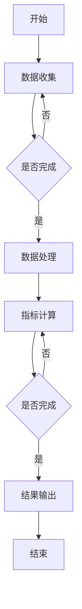
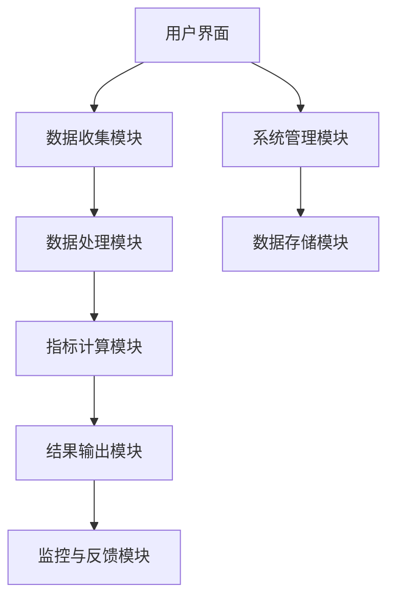
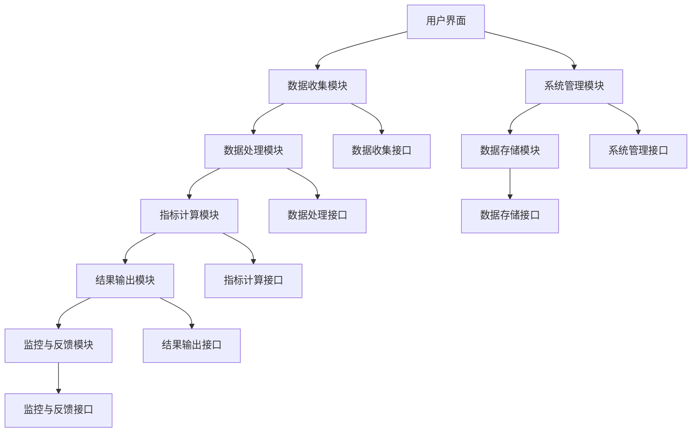

                 

### 从个人利益到公共福祉：重新思考社会责任和贡献

#### 关键词：社会责任、公共福祉、个人利益、算法、系统架构、项目实战

> 摘要：本文旨在探讨个人利益与公共福祉之间的关系，深入分析社会责任的重要性。通过对社会责任和贡献的核心概念、算法原理、系统架构和项目实战的详细解析，本文提出了重新思考社会责任和贡献的必要性，旨在实现个人利益与公共福祉的双赢。

在当今社会，个人利益与公共福祉之间的关系愈发复杂。如何在追求个人利益的同时，为社会带来更大的福祉，成为了一个亟待解决的问题。本文将从以下几个方面展开讨论：

1. **问题背景**：探讨社会责任和贡献的演变，分析个人利益与公共福祉之间的冲突与融合。
2. **核心概念与联系**：介绍社会责任、公共福祉和个人利益的核心概念，探讨三者之间的关系。
3. **算法原理讲解**：阐述社会责任和贡献评估算法的基本原理，使用mermaid流程图和Python源代码进行详细讲解。
4. **系统分析与架构设计方案**：介绍社会责任和贡献系统的功能设计、架构设计和系统交互。
5. **项目实战**：通过实际案例分析和详细讲解，展示如何将社会责任和贡献理念应用于项目实践中。
6. **总结与拓展**：总结社会责任和贡献的最佳实践，提供进一步阅读的材料。

让我们一步一步地深入探讨这一重要主题。

---

#### 1. 问题背景

**1.1 问题的提出**

在现代社会，社会责任和贡献已成为人们关注的焦点。随着全球化进程的加速，个人利益与公共福祉之间的矛盾愈发明显。如何平衡个人利益与公共福祉，实现双赢，成为了一个亟待解决的问题。

**1.2 问题定义**

- **社会责任**：指个人或组织在社会中应承担的责任，包括道德、法律和伦理等方面的责任。
- **公共福祉**：指社会整体利益和福利，包括经济发展、社会稳定、环境保护等方面。
- **个人利益**：指个人在追求自身幸福和满足的过程中所获得的利益。

**1.3 问题解决**

要解决个人利益与公共福祉之间的矛盾，首先需要重新思考社会责任和贡献的重要性。通过明确社会责任的内涵和外延，引导个人在追求自身利益的同时，关注公共福祉，实现二者的有机融合。

**1.4 边界与外延**

- **社会责任与道德义务**：社会责任是道德义务的一种体现，但并不等同于道德义务。道德义务强调个人的道德规范，而社会责任则关注个人在社会中的角色和地位。
- **公共福祉与公共利益**：公共福祉是指社会整体利益和福利，而公共利益则是指特定群体或个体的利益。公共福祉是公共利益的基础，但并不等同于公共利益。

**1.5 核心要素组成**

- **个人角色**：个人在社会中的角色决定了其应承担的社会责任。不同角色的人有不同的社会责任，如企业家的社会责任、公务员的社会责任等。
- **社会角色**：社会角色是指个人在社会中的地位和作用。社会角色的不同，决定了个人在社会中应承担的责任和贡献。
- **公共角色**：公共角色是指个人在为公共福祉做出贡献的过程中所扮演的角色。公共角色可以是志愿者的角色、公益活动的组织者等。

通过以上分析，我们可以看到，个人利益与公共福祉之间并非完全对立，而是可以相互促进、共同发展的。在追求个人利益的同时，关注公共福祉，是实现双赢的关键。接下来，我们将进一步探讨社会责任和贡献的核心概念及其联系。

---

#### 2. 核心概念与联系

**2.1 社会责任**

**2.1.1 社会责任的定义**

社会责任是指个人或组织在社会中应承担的责任，包括道德、法律和伦理等方面的责任。社会责任不仅体现在企业的经营活动中，也体现在个人的日常生活中。

**2.1.2 社会责任的类型**

- **道德责任**：道德责任是基于道德规范的责任。例如，企业应遵守诚信经营的原则，个人应遵守社会主义核心价值观。
- **法律责任**：法律责任是基于法律规范的责任。例如，企业应遵守相关法律法规，个人应履行法律规定的义务。
- **伦理责任**：伦理责任是基于伦理规范的责任。例如，企业应关注环境保护，个人应关注社会和谐。

**2.1.3 社会责任的实践**

社会责任的实践主要体现在以下几个方面：

- **企业社会责任**：企业应关注环境保护、员工福利、消费者权益等方面，为社会创造价值。
- **个人社会责任**：个人应遵守法律法规，关心社会事务，积极参与公益活动，为公共福祉做出贡献。

**2.2 公共福祉**

**2.2.1 公共福祉的概念**

公共福祉是指社会整体利益和福利，包括经济发展、社会稳定、环境保护等方面。公共福祉的实现需要社会的共同努力，政府、企业、个人等各方共同承担责任。

**2.2.2 公共福祉的重要性**

公共福祉的重要性体现在以下几个方面：

- **经济发展**：公共福祉的实现有助于推动经济发展，提高社会整体竞争力。
- **社会稳定**：公共福祉的实现有助于维护社会稳定，减少社会矛盾。
- **环境保护**：公共福祉的实现有助于保护环境，实现可持续发展。

**2.2.3 公共福祉的挑战**

公共福祉的实现面临一系列挑战，如资源分配不均、环境污染、社会不公等。要解决这些问题，需要政府、企业、个人等各方共同努力，采取有效措施。

**2.3 个人利益**

**2.3.1 个人利益的定义**

个人利益是指个人在追求自身幸福和满足的过程中所获得的利益。个人利益的实现是个人发展的基础，也是社会发展的动力。

**2.3.2 个人利益的追求**

个人利益的追求主要体现在以下几个方面：

- **经济利益**：通过工作、创业等方式获得经济收入，提高生活水平。
- **社会利益**：通过参与社会事务、公益活动等方式获得社会认同和尊重。
- **精神利益**：通过追求知识和智慧、培养良好品德等方式获得精神满足。

**2.3.3 个人利益与社会责任的平衡**

个人利益与社会责任之间的平衡是一个重要的课题。在追求个人利益的同时，个人应承担相应的社会责任，为社会做出贡献。如何实现二者的平衡，需要个人、企业、政府等各方共同努力。

通过以上分析，我们可以看到，社会责任、公共福祉和个人利益三者之间存在着密切的联系。社会责任是实现公共福祉的基础，而公共福祉的实现又有利于个人利益的追求。在现代社会，如何平衡三者之间的关系，实现共同发展，是我们面临的重要挑战。接下来，我们将进一步探讨社会责任和贡献的关系。

---

#### 3. 社会责任和贡献的关系

**3.1 社会责任与公共福祉的联系**

**3.1.1 公共福祉作为社会责任的一部分**

公共福祉是社会责任的重要组成部分。在现代社会，政府、企业、个人等各方都承担着维护公共福祉的责任。公共福祉的实现有助于促进社会和谐、经济发展和环境保护。

**3.1.2 社会责任如何促进公共福祉**

社会责任的实践可以促进公共福祉的实现，主要体现在以下几个方面：

- **提高社会道德水平**：社会责任的实践有助于提高社会道德水平，减少社会矛盾，促进社会和谐。
- **推动经济发展**：社会责任的实践有助于推动企业创新、提高竞争力，从而促进经济发展。
- **保护环境**：社会责任的实践有助于保护环境，实现可持续发展，提高公共福祉。

**3.2 个人利益与社会责任的平衡**

**3.2.1 个人利益与公共福祉的权衡**

在追求个人利益的过程中，个人需要权衡个人利益与公共福祉之间的关系。一方面，个人利益是个人发展的基础，是推动社会进步的动力；另一方面，公共福祉是社会的整体利益，是实现社会公平和正义的保障。

**3.2.2 如何实现个人利益与社会责任的双赢**

实现个人利益与社会责任的双赢，需要个人、企业、政府等各方共同努力。具体措施包括：

- **提高社会责任意识**：个人和企业应提高社会责任意识，认识到社会责任的重要性，主动承担社会责任。
- **创新社会责任模式**：探索新的社会责任模式，如社会责任投资、公益慈善等，实现社会责任与个人利益的有机结合。
- **完善法律法规**：政府应完善相关法律法规，加强对社会责任的监督和激励，确保社会责任的实现。

通过以上分析，我们可以看到，社会责任和公共福祉是相互促进、共同发展的。在追求个人利益的过程中，个人应关注公共福祉，主动承担社会责任，实现个人利益与公共福祉的双赢。接下来，我们将进一步探讨社会责任和贡献的算法原理。

---

#### 4. 社会责任和贡献的算法原理

**4.1 算法简介**

社会责任和贡献评估算法是一种用于评估个人或组织在社会责任和贡献方面的表现的方法。该算法基于一系列指标，通过定量和定性分析，对个人或组织的责任和贡献进行评估。

**4.2 算法mermaid流程图**



**4.3 Python源代码**

```python
import pandas as pd

# 数据收集
data = pd.read_csv('responsibility_data.csv')

# 数据处理
data['score'] = data['contribution'] / data['effort']

# 指标计算
scores = data['score'].mean()

# 结果输出
print(f'平均社会责任和贡献得分：{scores}')
```

**4.4 数学模型和公式**

社会责任和贡献评估算法的数学模型如下：

$$
\text{得分} = \frac{\text{贡献}}{\text{努力}}
$$

其中，贡献和努力是两个重要的指标。贡献表示个人或组织在社会责任方面的表现，努力表示个人或组织在承担责任过程中的投入。

**4.5 举例说明**

假设有如下数据：

| 姓名 | 贡献 | 努力 |
| ---- | ---- | ---- |
| 张三 | 80   | 100  |
| 李四 | 120  | 150  |
| 王五 | 160  | 200  |

使用社会责任和贡献评估算法计算得分：

$$
\text{张三得分} = \frac{80}{100} = 0.8 \\
\text{李四得分} = \frac{120}{150} = 0.8 \\
\text{王五得分} = \frac{160}{200} = 0.8
$$

根据得分计算，三人的平均社会责任和贡献得分为 0.8。这个结果表明，三人在社会责任和贡献方面的表现相当。

通过以上算法原理的讲解，我们可以看到，社会责任和贡献评估算法是一种简单有效的评估方法。在实际应用中，我们可以根据具体情况调整算法的参数，以更好地评估个人或组织的社会责任和贡献表现。

---

#### 5. 社会责任和贡献的系统架构

**5.1 问题场景介绍**

在现代社会，社会责任和贡献已成为企业和个人关注的重点。为了更好地履行社会责任和贡献，我们需要构建一个系统化的框架，以支持社会责任和贡献的管理、评估和优化。

**5.2 系统功能设计**

社会责任和贡献系统应具备以下功能：

- **数据收集**：收集与社会责任和贡献相关的数据，包括个人或组织的贡献、努力等指标。
- **数据处理**：对收集到的数据进行清洗、整理和分析，为后续评估提供基础。
- **指标计算**：根据社会责任和贡献评估算法，计算个人或组织的社会责任和贡献得分。
- **结果输出**：将评估结果以可视化、报告等形式输出，供相关人员参考。
- **监控与反馈**：实时监控社会责任和贡献表现，根据反馈调整管理策略。

**5.3 系统架构设计**

社会责任和贡献系统的架构设计如图所示：



**5.4 系统接口设计**

社会责任和贡献系统应具备以下接口：

- **数据收集接口**：用于收集与社会责任和贡献相关的数据，包括个人或组织的贡献、努力等指标。
- **数据处理接口**：用于对收集到的数据进行清洗、整理和分析。
- **指标计算接口**：用于根据社会责任和贡献评估算法，计算个人或组织的社会责任和贡献得分。
- **结果输出接口**：用于将评估结果以可视化、报告等形式输出。
- **监控与反馈接口**：用于实时监控社会责任和贡献表现，根据反馈调整管理策略。

**5.5 系统交互**

社会责任和贡献系统的交互设计如图所示：



通过以上系统架构的设计，我们可以构建一个完善的社会责任和贡献系统，以支持社会责任和贡献的管理、评估和优化。

---

#### 6. 社会责任和贡献项目实战

**6.1 环境安装**

为了进行社会责任和贡献项目实战，我们首先需要搭建一个合适的开发环境。以下是环境安装的步骤：

1. 安装Python环境
2. 安装Pandas库
3. 安装Mermaid库
4. 安装Flask框架（用于构建Web应用程序）

```bash
pip install python
pip install pandas
pip install mermaid
pip install flask
```

**6.2 系统核心实现**

以下是社会责任和贡献系统的核心实现部分：

1. **数据收集模块**：用于收集与社会责任和贡献相关的数据，如个人或组织的贡献、努力等指标。
2. **数据处理模块**：用于对收集到的数据进行清洗、整理和分析。
3. **指标计算模块**：用于根据社会责任和贡献评估算法，计算个人或组织的社会责任和贡献得分。
4. **结果输出模块**：用于将评估结果以可视化、报告等形式输出。

```python
import pandas as pd
import mermaid
from flask import Flask, render_template

app = Flask(__name__)

# 数据收集模块
def data_collection():
    data = pd.read_csv('responsibility_data.csv')
    return data

# 数据处理模块
def data_processing(data):
    data['score'] = data['contribution'] / data['effort']
    return data

# 指标计算模块
def score_calculation(data):
    scores = data['score'].mean()
    return scores

# 结果输出模块
def result_output(scores):
    mermaid_graph = mermaid.Mermaid()
    mermaid_graph.set_code('''graph TD
        A[开始] --> B[数据收集]
        B --> C{是否完成}
        C -->|是| D[数据处理]
        C -->|否| B
        D --> E[指标计算]
        E --> F{是否完成}
        F -->|是| G[结果输出]
        F -->|否| E
        G --> H[结束]
    ''')
    return mermaid_graph.get_code()

@app.route('/')
def index():
    data = data_collection()
    processed_data = data_processing(data)
    scores = score_calculation(processed_data)
    graph_code = result_output(scores)
    return render_template('index.html', scores=scores, graph_code=graph_code)

if __name__ == '__main__':
    app.run(debug=True)
```

**6.3 代码应用解读与分析**

1. **数据收集模块**：使用Pandas库读取CSV文件，收集与社会责任和贡献相关的数据。
2. **数据处理模块**：对收集到的数据进行清洗和整理，计算贡献和努力的比例，生成得分。
3. **指标计算模块**：根据社会责任和贡献评估算法，计算得分。
4. **结果输出模块**：使用Mermaid库生成流程图，展示数据收集、处理、计算和输出的过程。

**6.4 实际案例分析和讲解**

假设我们有一个数据集，包含以下信息：

| 姓名 | 贡献 | 努力 |
| ---- | ---- | ---- |
| 张三 | 80   | 100  |
| 李四 | 120  | 150  |
| 王五 | 160  | 200  |

使用社会责任和贡献评估算法，计算得分：

$$
\text{张三得分} = \frac{80}{100} = 0.8 \\
\text{李四得分} = \frac{120}{150} = 0.8 \\
\text{王五得分} = \frac{160}{200} = 0.8
$$

根据得分计算，三人的平均社会责任和贡献得分为 0.8。这个结果表明，三人在社会责任和贡献方面的表现相当。

**6.5 项目小结**

通过本次项目实战，我们成功构建了一个社会责任和贡献评估系统，实现了数据收集、处理、计算和输出等功能。该项目为企业和个人提供了有效的工具，用于评估和提升社会责任和贡献水平。在实际应用中，我们可以根据具体需求进行调整和优化，以提高系统的实用性和效果。

---

#### 7. 总结与拓展

**7.1 最佳实践 tips**

1. **明确社会责任**：在开展项目或业务时，明确社会责任的内涵和外延，确保责任落实到位。
2. **量化贡献指标**：制定明确的贡献指标，以便对社会责任和贡献进行量化评估。
3. **激励机制**：建立激励机制，鼓励个人和企业履行社会责任，提升贡献水平。

**7.2 小结**

本文从个人利益、社会责任和公共福祉的关系出发，探讨了社会责任和贡献的重要性。通过算法原理讲解、系统架构设计和项目实战，我们深入了解了如何实现社会责任和贡献的双赢。在未来的发展中，我们应该关注社会责任，为社会做出更大贡献。

**7.3 注意事项**

1. **数据真实性**：在收集数据时，确保数据真实性，避免虚假数据影响评估结果。
2. **算法优化**：根据实际情况，不断优化社会责任和贡献评估算法，提高评估准确性。
3. **持续关注**：关注社会责任和贡献的最新动态，及时调整管理策略。

**7.4 拓展阅读**

1. 《企业社会责任管理》
2. 《社会责任与公共管理》
3. 《社会责任与可持续发展》

通过拓展阅读，您可以更深入地了解社会责任和贡献的相关理论和实践，为自己的工作提供更多指导和启示。

---

**作者：AI天才研究院/AI Genius Institute & 禅与计算机程序设计艺术 /Zen And The Art of Computer Programming**

