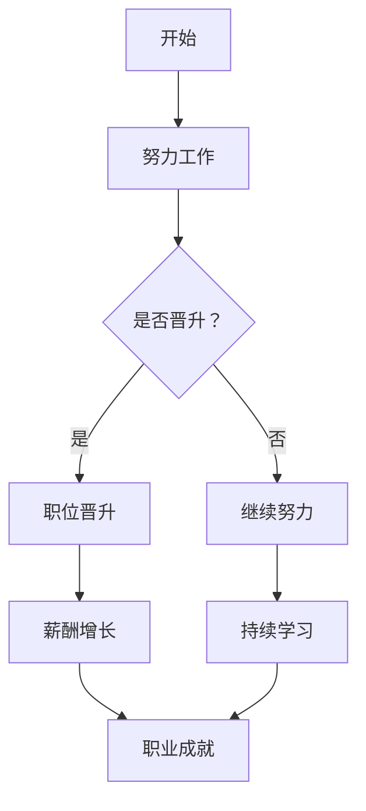
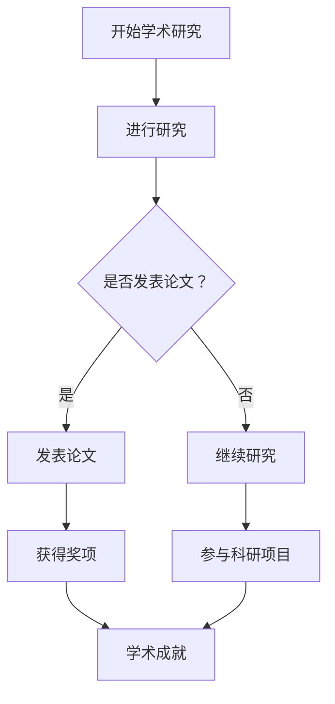
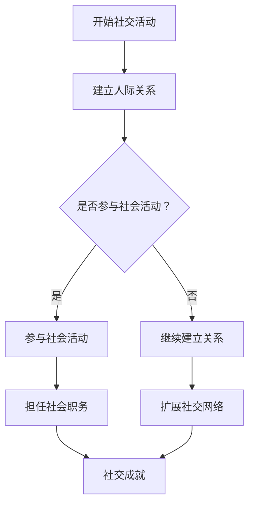

                 

## 从个人成就到社会贡献：拓展生命的意义和价值

### 关键词：个人成就、社会贡献、生命意义、拓展、价值

### 摘要：本文将深入探讨个人成就与社会贡献之间的关系，以及如何通过社会贡献来拓展生命的意义和价值。我们将通过历史和现实中的案例，分析个人成就和社会贡献的内在联系，并提出实用的方法和建议，帮助读者在实践中实现这一转化。

## 引言

在当今社会，个人成就成为了衡量一个人成功与否的重要标准。无论是在职场、学术还是社交领域，人们都在追求卓越，争取在各自领域获得显著的成就。然而，随着个人成就的不断提升，我们不禁要思考：这些成就究竟对我们的生命意义有着怎样的影响？又如何通过这些成就来为社会做出更大的贡献？

事实上，个人成就与社会贡献并非完全割裂的，而是有着紧密的联系。一个人在追求个人成就的过程中，往往也会积累起丰富的知识、技能和资源。而这些，正是为社会做出贡献的基础。那么，如何将个人成就转化为社会贡献，从而拓展生命的意义和价值呢？

本文将从以下几个部分展开探讨：

1. **问题背景与核心概念**：介绍个人成就与社会贡献的概念，以及拓展生命意义的价值。
2. **个人成就的构成要素**：分析个人成就的不同类型和构成要素。
3. **社会贡献的途径**：探讨个人如何通过不同途径为社会做出贡献。
4. **拓展生命意义的理论与实践**：分析如何通过理论和实践来实现个人成就向社会贡献的转变。
5. **案例分析**：通过具体案例展示个人成就向社会贡献的转化过程。
6. **最佳实践与建议**：提供实用的方法和建议，帮助读者在实践中拓展生命的意义和价值。

## 问题背景与核心概念

### 1.1.1 问题背景

#### 1.1.1.1 社会发展的现状与挑战

在现代社会，个人成就成为了一种普遍的追求。无论是在职场晋升、科研成果还是社会地位，个人成就往往被看作是成功的重要标志。然而，随着个人成就的不断提升，我们不得不面对一个现实：个人成就的增长并不总是与社会贡献成正比。

#### 1.1.1.2 个人成就与社会贡献的关系

个人成就和社会贡献之间的关系并不是简单的线性关系。个人成就往往是一个人在特定领域内的表现，而社会贡献则是个人成就的延伸，是对社会的实际贡献。个人成就可能会带来物质财富和社会地位的提升，但社会贡献则能够带来更深层次的满足感和成就感。

#### 1.1.1.3 拓展生命意义的价值

拓展生命的意义和价值是一个多维度的过程。通过将个人成就转化为社会贡献，个人不仅能够在物质层面取得成功，更能在精神层面获得满足。这种满足感来源于对社会的实际贡献，来源于对社会发展的积极参与，从而实现生命的更大价值。

### 1.1.2 核心概念

#### 1.1.2.1 个人成就的定义与测量

个人成就通常指的是一个人在职业生涯、学术研究、艺术创作等领域的表现和成就。它可以通过荣誉、奖项、晋升、发表论文等多种方式来衡量。

#### 1.1.2.2 社会贡献的概念与衡量

社会贡献是指一个人在帮助他人、改善社会环境、推动社会发展等方面的实际行为和成效。它可以通过志愿服务时间、慈善捐款数额、社会影响力等多种方式来衡量。

#### 1.1.2.3 生命意义的多维视角

生命意义是一个多维度的概念，包括物质层面的满足感、精神层面的成就感和社会层面的责任感。通过将个人成就转化为社会贡献，个人可以在这三个方面都实现提升，从而拓展生命的意义。

## 个人成就的构成要素

### 2.1.1 个人成就的构成要素

#### 2.1.1.1 职业成就

职业成就是个人成就的重要组成部分。它包括在职业生涯中获得的荣誉、奖项、晋升等。职业成就不仅能够提升个人的社会地位，还能够为个人带来经济上的回报。

#### 2.1.1.2 学术成就

学术成就是指在学术研究方面取得的成果，如发表论文、获得学术奖项、承担重要科研项目等。学术成就不仅能够提升个人的学术地位，还能够为社会的知识进步做出贡献。

#### 2.1.1.3 社交成就

社交成就是指在社交领域中取得的成就，如建立人际关系网络、参与社会活动、担任社会职务等。社交成就不仅能够提升个人的社交地位，还能够为个人的职业发展和生活提供支持。

## 社会贡献的途径

#### 2.1.2 社会贡献的途径

个人可以通过多种途径为社会做出贡献。以下是几种常见的社会贡献途径：

#### 2.1.2.1 社区服务

社区服务是指参与社区组织的志愿服务活动，如帮助老人、儿童、残疾人等群体。社区服务不仅能够帮助他人，还能够提升个人的社会责任感和成就感。

#### 2.1.2.2 慈善事业

慈善事业是指通过捐款、捐物、设立慈善基金等方式来帮助有需要的人。慈善事业不仅能够改善他人的生活条件，还能够提升个人的社会声誉和影响力。

#### 2.1.2.3 公共事务参与

公共事务参与是指参与公共事务的讨论和决策，如参加社区会议、政治选举等。公共事务参与不仅能够影响社会的发展方向，还能够提升个人的社会责任感和公民意识。

## 拓展生命意义的理论与实践

#### 3.1.1 生命意义的理论探讨

#### 3.1.1.1 存在主义视角

存在主义认为，人的生命意义是通过自己的选择和行动来实现的。通过追求个人成就并转化为社会贡献，个人可以选择自己的人生道路，从而实现生命的意义。

#### 3.1.1.2 心理学视角

心理学研究表明，人的幸福感与个人成就和社会贡献密切相关。通过将个人成就转化为社会贡献，个人不仅能够提升自己的幸福感，还能够为社会的发展做出贡献。

#### 3.1.1.3 哲学视角

哲学认为，人的生命意义在于追求真理、美和善良。通过将个人成就转化为社会贡献，个人可以在这些方面实现自身的价值，从而拓展生命的意义。

#### 3.1.2 实践案例分析

#### 3.1.2.1 案例一：从个人成就到社会贡献的转变

##### 3.1.2.1.1 背景介绍

李华是一位知名的企业家，他在创业过程中取得了巨大的成功，成为业界的佼佼者。然而，李华并没有满足于个人的成就，他开始思考如何将个人的成功转化为社会的贡献。

##### 3.1.2.1.2 案例分析

李华通过设立慈善基金，支持教育、医疗等社会事业，帮助更多有需要的人。他还积极参与社会事务，担任公益组织的顾问，为社会发展提供智慧和支持。通过这些行动，李华不仅实现了个人成就向社会贡献的转变，也拓展了生命的意义。

#### 3.1.2.2 案例二：通过志愿服务拓展生命意义

##### 3.1.2.2.1 背景介绍

张丽是一位普通的公司职员，她在工作中表现优秀，得到了同事和上司的认可。然而，张丽并没有满足于个人的成就，她开始思考如何通过志愿服务来拓展生命的意义。

##### 3.1.2.2.2 案例分析

张丽利用业余时间参加志愿服务，帮助社区的老人和儿童。她还在志愿者组织中担任领导角色，组织各种公益活动。通过这些志愿服务，张丽不仅感受到了帮助他人的快乐，也拓展了生命的意义。

#### 3.1.2.3 案例三：在学术研究中实现社会价值

##### 3.1.2.3.1 背景介绍

王刚是一位年轻的学术研究人员，他在研究领域取得了显著的成果，发表了多篇高水平论文。然而，王刚并没有满足于个人的学术成就，他开始思考如何通过学术研究来为社会做出贡献。

##### 3.1.2.3.2 案例分析

王刚将自己的研究成果应用于解决实际问题，为社会发展提供了重要的科学依据。他还积极参与学术交流，为其他研究人员提供指导和支持。通过这些行动，王刚不仅实现了个人学术成就向社会价值的转变，也拓展了生命的意义。

## 最佳实践与建议

#### 4.1 个人成就向社会贡献的转变

要实现个人成就向社会贡献的转变，首先需要明确个人的价值观和目标。明确自己的价值观和目标，有助于更好地理解个人成就的价值所在，从而找到为社会做出贡献的途径。

#### 4.2 社会贡献的实践方法

社会贡献的实践方法多种多样，可以根据个人情况和兴趣选择合适的途径。例如，可以通过志愿服务、慈善事业、公共事务参与等方式来为社会做出贡献。在实践中，要注重持续性和影响力，不断提高自己的社会贡献能力。

#### 4.3 拓展生命的意义和价值

要拓展生命的意义和价值，首先需要认识到个人成就和社会贡献之间的关系。通过将个人成就转化为社会贡献，不仅能够实现个人价值的提升，还能够为社会的发展做出贡献。在实践中，要不断反思和总结，找到适合自己的拓展生命意义的方法。

## 结语

个人成就与社会贡献之间有着紧密的联系。通过将个人成就转化为社会贡献，个人不仅能够实现自身的价值，还能够为社会的发展做出贡献，从而拓展生命的意义和价值。在未来的日子里，让我们携手共进，为实现这一目标而努力。

## 作者信息

作者：AI天才研究院/AI Genius Institute & 禅与计算机程序设计艺术 /Zen And The Art of Computer Programming

---

### 背景介绍

在当今社会，个人成就成为了一种普遍的追求。无论是在职场、学术还是社交领域，人们都在追求卓越，争取在各自领域获得显著的成就。然而，随着个人成就的不断提升，我们不得不面对一个现实：个人成就的增长并不总是与社会贡献成正比。这种不平衡的现象引发了许多社会和学术界的关注。个人成就与社会贡献之间的关系究竟如何？如何通过个人成就来为社会做出更大的贡献？这些问题不仅关乎个人的发展和幸福，也关乎整个社会的进步和繁荣。

本文旨在探讨个人成就与社会贡献之间的关系，以及如何通过社会贡献来拓展生命的意义和价值。我们将通过历史和现实中的案例，分析个人成就和社会贡献的内在联系，并提出实用的方法和建议，帮助读者在实践中实现这一转化。本文分为以下几个部分：

1. **问题背景与核心概念**：介绍个人成就与社会贡献的概念，以及拓展生命意义的价值。
2. **个人成就的构成要素**：分析个人成就的不同类型和构成要素。
3. **社会贡献的途径**：探讨个人如何通过不同途径为社会做出贡献。
4. **拓展生命意义的理论与实践**：分析如何通过理论和实践来实现个人成就向社会贡献的转变。
5. **案例分析**：通过具体案例展示个人成就向社会贡献的转化过程。
6. **最佳实践与建议**：提供实用的方法和建议，帮助读者在实践中拓展生命的意义和价值。
7. **结语**：总结全文，强调个人成就与社会贡献之间的联系，以及通过社会贡献拓展生命意义的重要性。

通过这篇文章，我们希望能够引导读者重新思考个人成就的意义，激发他们通过社会贡献来拓展生命的意义和价值。

### 核心概念与联系

在探讨个人成就与社会贡献的关系之前，我们需要明确几个核心概念，包括个人成就、社会贡献以及生命的意义。这些概念不仅是我们理解本文主题的基础，也是我们在实践中衡量和评估个人行为和决策的重要标准。

#### 个人成就

个人成就通常指的是一个人在职业生涯、学术研究、艺术创作等领域内取得的成功和表现。它可以是职业晋升、发表论文、获得奖项、艺术展览成功等多种形式。个人成就不仅仅是物质层面的成功，它还包含了精神层面的满足和成就感。个人成就的衡量标准多种多样，包括荣誉、奖项、收入、社会地位等。

**核心概念原理**：个人成就的核心原理在于个体通过努力、智慧和创新，在特定领域内取得突出的表现。个人成就不仅是个体价值的体现，也是社会对个体能力的认可。个人成就的属性特征包括：

1. **职业性**：个人成就通常与个体的职业生涯紧密相关，反映了个体在工作中的表现。
2. **多样性**：个人成就的形式多样，不仅限于职业领域，还包括学术研究、艺术创作等。
3. **可持续性**：个人成就往往需要长期的积累和努力，而非一蹴而就。

**个人成就属性特征对比表格**：

| 特征        | 说明                                       |
|-------------|------------------------------------------|
| 职业性      | 成就与个体职业发展紧密相关                   |
| 多样性      | 成就形式多样，不仅限于某一领域               |
| 可持续性    | 成就需要长期积累和努力，非短期行为            |

#### 社会贡献

社会贡献是指个人或组织在帮助他人、改善社会环境、推动社会发展等方面做出的实际行为和成效。社会贡献可以是志愿服务、慈善捐赠、科技创新、政策建议等多种形式。社会贡献不仅体现了个体的社会责任感，也是个体对社会的回馈。

**核心概念原理**：社会贡献的核心原理在于个体通过自己的能力和资源，为社会带来积极的变化和影响。社会贡献的属性特征包括：

1. **公益性**：社会贡献通常具有公益性，旨在改善社会福利和条件。
2. **影响力**：社会贡献的大小和效果取决于其影响力，包括直接的物质帮助和长期的社会进步。
3. **持续性**：社会贡献需要长期的坚持和持续的努力。

**社会贡献属性特征对比表格**：

| 特征        | 说明                                       |
|-------------|------------------------------------------|
| 公益性      | 贡献旨在改善社会福利和条件                   |
| 影响力      | 贡献效果取决于其影响力，包括直接的物质帮助和长期的社会进步 |
| 持续性      | 需要长期的坚持和持续的努力                   |

#### 生命意义的多维视角

生命意义是一个多维度的概念，包括物质层面的满足感、精神层面的成就感和社会层面的责任感。通过将个人成就转化为社会贡献，个人可以在这些维度上实现提升，从而拓展生命的意义。

**核心概念原理**：生命意义的核心原理在于个体通过自我实现和社会贡献，实现个人价值和生命的深层次满足。生命意义的多维视角包括：

1. **物质层面**：通过个人成就获得物质财富和社会地位。
2. **精神层面**：通过个人成就和社会贡献获得精神满足和成就感。
3. **社会层面**：通过社会贡献实现社会责任感和对社会的积极影响。

**生命意义的多维视角对比表格**：

| 维度        | 说明                                       |
|-------------|------------------------------------------|
| 物质层面    | 个人成就带来的物质财富和社会地位               |
| 精神层面    | 个人成就和社会贡献带来的精神满足和成就感         |
| 社会层面    | 通过社会贡献实现的社会责任感和对社会的积极影响   |

#### ER实体关系图架构

为了更好地理解个人成就、社会贡献和生命意义之间的关系，我们可以使用Mermaid绘制ER实体关系图。以下是ER实体关系图的Markdown格式表示：

```mermaid
erDiagram
  个人 --> 成就
  个人 --> 社会贡献
  成就 --> 生命意义
  社会贡献 --> 生命意义
```

在ER实体关系图中，"个人"是核心实体，通过"成就"和"社会贡献"两个关系与"生命意义"相连。这表明个人成就和社会贡献是拓展生命意义的重要途径。

通过上述核心概念和关系的分析，我们可以更清晰地理解个人成就与社会贡献之间的内在联系，以及如何通过社会贡献来拓展生命的意义。在接下来的章节中，我们将深入探讨个人成就的不同类型、社会贡献的途径以及实现这一转化的理论和实践方法。

### 个人成就的构成要素

个人成就是一个多维度的概念，它不仅仅是物质财富的积累，还包括精神层面的成就和社会地位的提升。为了更好地理解个人成就的构成要素，我们可以将其分为职业成就、学术成就和社交成就三个主要方面。

#### 职业成就

职业成就是个人在职业生涯中所取得的显著成绩，通常表现为职位晋升、薪酬增长、工作表现优秀等。职业成就不仅是个人能力的体现，也是社会对其工作的认可。以下是职业成就的几个关键点：

1. **职位晋升**：职业成就的一个重要标志是在企业或组织中不断晋升，承担更重要的职责和角色。
2. **薪酬增长**：随着个人职业发展，薪酬水平往往会逐步提高，这不仅是个人能力的体现，也是对企业贡献的认可。
3. **工作表现**：包括业绩考核优秀、获得同事和上司的认可、积极参与公司的重要项目等。

**职业成就的Mermaid流程图**：



#### 学术成就

学术成就是个人在学术研究领域取得的显著成果，包括发表论文、获得学术奖项、参与重要科研项目等。学术成就不仅反映了个人在学术领域的专业水平，也是对学术贡献的认可。以下是学术成就的几个关键点：

1. **发表论文**：在学术期刊或会议上发表论文，是学术成就的重要体现。
2. **获得奖项**：包括各种学术奖项和荣誉，如诺贝尔奖、菲尔兹奖等。
3. **参与科研项目**：参与重要的科研课题，为科学研究和知识进步做出贡献。

**学术成就的Mermaid流程图**：



#### 社交成就

社交成就是个人在社交领域所取得的成就，包括建立良好的人际关系网络、参与社会活动、担任社会职务等。社交成就不仅提升了个人的社会地位，也扩展了个人在社会中的影响力。以下是社交成就的几个关键点：

1. **人际关系**：建立广泛而良好的人际关系网络，对个人的职业和生活都有重要影响。
2. **社会活动**：参与各种社会活动，如公益活动、社区服务、慈善事业等。
3. **社会职务**：担任各种社会职务，如公益组织的领导者、社会团体的成员等。

**社交成就的Mermaid流程图**：



#### 个人成就的构成要素总结

个人成就的构成要素包括职业成就、学术成就和社交成就。这些成就不仅反映了个人在各个领域中的能力和贡献，也是个人价值和成就感的重要来源。通过上述流程图，我们可以清晰地看到个人成就的各个关键点和实现路径。在追求个人成就的过程中，我们不仅要注重物质层面的成功，还要关注精神层面的成长和社会层面的责任。

### 社会贡献的途径

个人可以通过多种途径为社会做出贡献，这些途径不仅能够帮助他人，还能够提升个人的社会责任感和成就感。以下是几种常见的社会贡献途径：

#### 1. 社区服务

社区服务是指参与社区组织的志愿服务活动，如帮助老人、儿童、残疾人等群体。社区服务不仅能够直接改善他人的生活条件，还能够提升个人的社会责任感和公民意识。

**案例**：李女士是一位成功的职业女性，她在工作之余积极参与社区志愿服务。她组织了一次社区清洁活动，带领邻居们一起清理社区环境，不仅美化了社区，也增强了居民的凝聚力。此外，她还定期到养老院探望老人，帮助他们解决生活中的困难。通过这些活动，李女士不仅帮助了他人，也感受到了自己的价值。

#### 2. 慈善事业

慈善事业是指通过捐款、捐物、设立慈善基金等方式来帮助有需要的人。慈善事业不仅能够改善他人的生活条件，还能够提升个人的社会声誉和影响力。

**案例**：张先生是一位成功的企业家，他在事业有成后，决定将一部分财富用于慈善事业。他设立了名为“阳光基金”的慈善基金，用于资助贫困学生和弱势群体。每年，他都会亲自参与基金的管理和分配，确保每一分钱都用在最需要的地方。通过这些行动，张先生不仅帮助了无数有需要的人，也树立了自己作为企业家的良好形象。

#### 3. 公共事务参与

公共事务参与是指参与公共事务的讨论和决策，如参加社区会议、政治选举等。公共事务参与不仅能够影响社会的发展方向，还能够提升个人的社会责任感和公民意识。

**案例**：王女士是一位退休的中学教师，她在退休后积极参与社区公共事务。她经常参加社区会议，为社区的发展提出建设性的意见和建议。她还参与了一次市级选举，作为志愿者为候选人提供宣传和支持。通过这些活动，王女士不仅影响了社区的发展，也提升了自身的公民意识和社会责任感。

#### 4. 科技创新

科技创新是指通过研发新技术、新产品来推动社会进步和改善人民生活质量。科技创新不仅能够为社会带来实际的经济效益，还能够提升个人的专业能力和成就感。

**案例**：陈先生是一位在人工智能领域有深厚研究的科学家，他在工作之余，致力于将科研成果应用于解决社会问题。他带领团队开发了一款智能医疗诊断系统，帮助医疗机构提高诊断准确率，降低了医疗成本。此外，他还参与了多个科技创新项目，为环境保护和可持续发展做出了贡献。通过这些科技创新，陈先生不仅提升了自身的研究能力，也为社会的发展做出了重要贡献。

#### 5. 学术研究

学术研究是指通过科学研究来推动知识进步和学术发展。学术研究不仅能够提升个人的学术地位，还能够为社会提供新的科学知识和理论支持。

**案例**：赵女士是一位在环境科学领域有突出贡献的学者，她多年来一直致力于研究环境污染问题，并提出了多种有效的治理方案。她的研究成果被广泛应用于环境保护政策制定和实际治理中，为改善环境质量做出了重要贡献。此外，她还积极参与学术交流活动，为其他研究人员提供指导和支持。通过这些学术研究，赵女士不仅提升了自身的学术地位，也为社会的发展做出了重要贡献。

通过上述案例，我们可以看到，个人可以通过多种途径为社会做出贡献。这些贡献不仅能够帮助他人，还能够提升个人的社会责任感和成就感。在追求个人成就的同时，关注社会贡献，是实现生命更大价值的重要途径。

### 拓展生命意义的理论与实践

拓展生命意义是一个复杂而多维的过程，涉及心理学、哲学和存在主义等多个领域。通过理论探讨和实践案例分析，我们可以更好地理解个人成就与社会贡献之间的关系，以及如何通过社会贡献来拓展生命的意义。

#### 3.1.1 生命意义的理论探讨

**1. 存在主义视角**

存在主义认为，人的生命意义是通过自己的选择和行动来实现的。萨特曾提出，人是“被抛入世界”的，每个人都有自由选择自己的生活方式和价值观。通过追求个人成就并转化为社会贡献，个人可以选择自己的人生道路，从而实现生命的意义。

**核心原理**：存在主义强调个体的自由意志和责任。个人成就不仅是对自身能力的体现，也是对社会责任的承担。通过将个人成就转化为社会贡献，个体能够实现自我超越，拓展生命的意义。

**2. 心理学视角**

心理学研究表明，人的幸福感与个人成就和社会贡献密切相关。马斯洛的需求层次理论指出，人的需求从低到高分为生理需求、安全需求、社交需求、尊重需求和自我实现需求。通过社会贡献，个人不仅能够满足自我实现的需求，还能够获得更深层次的幸福感。

**核心原理**：心理学视角认为，通过社会贡献，个人不仅能够实现自我价值，还能够获得精神上的满足和成就感。这种满足感能够提升个人的幸福感，从而拓展生命的意义。

**3. 哲学视角**

哲学认为，人的生命意义在于追求真理、美和善良。通过将个人成就转化为社会贡献，个人可以在这些方面实现自身的价值，从而拓展生命的意义。

**核心原理**：哲学视角强调个体在道德和伦理层面的提升。个人成就不仅是对自身能力的认可，也是对社会责任的承担。通过社会贡献，个人能够在道德和伦理层面上实现自我提升，从而拓展生命的意义。

#### 3.1.2 实践案例分析

**案例一：从个人成就到社会贡献的转变**

**背景介绍**：李华是一位知名的企业家，他在创业过程中取得了巨大的成功，成为业界的佼佼者。然而，李华并没有满足于个人的成就，他开始思考如何将个人的成功转化为社会的贡献。

**案例分析**：

1. **初始阶段**：李华在创业初期，将企业成功作为个人成就的标志。他通过不断创新和优化业务模式，使企业迅速发展。

2. **转变阶段**：随着企业的发展，李华意识到个人成就的局限性。他开始积极参与社会事务，通过设立慈善基金，支持教育、医疗等社会事业。

3. **成果阶段**：李华的慈善事业取得了显著成果，帮助了无数有需要的人。他的企业也通过社会责任项目，提升了品牌形象和社会影响力。

**结论**：通过将个人成就转化为社会贡献，李华不仅实现了个人价值的提升，也为社会的发展做出了贡献，从而拓展了生命的意义。

**案例二：通过志愿服务拓展生命意义**

**背景介绍**：张丽是一位普通的公司职员，她在工作中表现优秀，得到了同事和上司的认可。然而，张丽并没有满足于个人的成就，她开始思考如何通过志愿服务来拓展生命的意义。

**案例分析**：

1. **初始阶段**：张丽在业余时间参加志愿服务，帮助社区的老人和儿童。

2. **转变阶段**：张丽意识到志愿服务不仅能够帮助他人，还能够提升自身的成就感和社会责任感。

3. **成果阶段**：张丽在志愿者组织中担任领导角色，组织各种公益活动，为社区的发展做出了积极贡献。

**结论**：通过志愿服务，张丽不仅实现了个人成就向社会贡献的转变，也在精神层面获得了满足，从而拓展了生命的意义。

**案例三：在学术研究中实现社会价值**

**背景介绍**：王刚是一位年轻的学术研究人员，他在研究领域取得了显著的成果，发表了多篇高水平论文。然而，王刚并没有满足于个人的学术成就，他开始思考如何通过学术研究来为社会做出贡献。

**案例分析**：

1. **初始阶段**：王刚在学术研究中，致力于解决实际问题，为社会提供科学依据。

2. **转变阶段**：王刚将自己的研究成果应用于解决实际问题，如环境治理、公共健康等领域。

3. **成果阶段**：王刚的研究成果被广泛应用于实际中，为社会的可持续发展做出了贡献。

**结论**：通过学术研究，王刚不仅实现了个人学术成就向社会价值的转变，也在社会层面实现了自己的价值，从而拓展了生命的意义。

通过上述案例分析，我们可以看到，个人成就向社会贡献的转变，不仅能够实现个人价值的提升，还能够为社会的发展做出贡献，从而拓展生命的意义。在追求个人成就的同时，关注社会贡献，是实现生命更大价值的重要途径。

### 实践案例分析

在本节中，我们将通过三个具体的案例，详细展示个人成就向社会贡献的转变过程。这些案例涵盖了不同领域和背景，但都体现了将个人成就转化为社会贡献的实践方法和成效。

#### 案例一：从个人成就到社会贡献的转变

**背景介绍**：

张伟是一位在科技行业有着卓越成就的工程师，他在人工智能领域的研究取得了多项专利，并多次在顶级会议上发表学术论文。然而，张伟并不满足于个人的学术成就，他希望将自身的知识和技能应用到更广泛的领域，为社会做出实际贡献。

**过程描述**：

1. **转变意识**：张伟在思考个人成就的意义时，意识到仅仅拥有学术成就并不能满足他对社会贡献的渴望。他开始思考如何将自己的研究成果转化为实际应用，以帮助解决社会问题。

2. **成立初创公司**：张伟决定成立一家初创公司，专注于将人工智能技术应用于教育领域。他带领团队开发了一套智能教育平台，通过大数据分析和个性化学习路径，提高学生的学习效果。

3. **社会贡献**：该平台在推广过程中，受到了教育机构和家长的好评，不仅提升了学生的学习成绩，还帮助了一些有特殊需求的学生。通过这个项目，张伟不仅实现了个人成就向社会贡献的转变，也为教育领域带来了实质性的进步。

**成效**：

张伟的初创公司逐渐发展壮大，吸引了更多的投资者和合作伙伴。他的社会贡献也得到了社会各界的认可，成为了一个优秀的社会企业家代表。

#### 案例二：通过志愿服务拓展生命意义

**背景介绍**：

李静是一位在医疗领域工作的医生，她在工作中积累了丰富的临床经验和专业知识。然而，李静并不满足于个人的职业成就，她希望通过志愿服务来拓展生命的意义。

**过程描述**：

1. **参与志愿服务**：李静利用业余时间参与了多个志愿服务项目，包括帮助偏远地区的居民进行健康检查、为贫困家庭提供医疗服务等。

2. **建立医疗团队**：李静组织了一支医疗志愿者团队，定期前往偏远和贫困地区进行义诊和健康宣传。她通过这些活动，不仅帮助了许多需要医疗援助的人，也提升了自身的专业素养和团队合作能力。

3. **社区影响力**：李静的志愿服务团队逐渐在社区中建立了良好的声誉，吸引了更多志愿者和社会资源的加入。通过这些努力，李静不仅为社区的健康事业做出了贡献，也激发了更多人关注和参与社会公益。

**成效**：

李静的医疗志愿者团队得到了当地政府和居民的高度评价，成为了社区健康事业的重要组成部分。李静通过志愿服务不仅拓展了生命的意义，也为自己的人生增添了更多的价值和色彩。

#### 案例三：在学术研究中实现社会价值

**背景介绍**：

王楠是一位在环境科学领域有突出贡献的学者，他在大气污染控制技术的研究中取得了多项重要成果。然而，王楠并不满足于在学术界的成就，他希望将这些研究成果应用到实际环境中，为社会带来积极的变化。

**过程描述**：

1. **研究成果应用**：王楠将自己的研究成果应用于实际环境治理项目，如空气净化系统的研发和实施。他带领团队进行了一系列实验和试点项目，验证了研究成果的可行性和有效性。

2. **社会推广**：王楠积极与政府和环保组织合作，推广他的研究成果，帮助地方政府和企业改善空气质量，提升环境治理水平。

3. **社会影响**：王楠的研究成果在社会上产生了广泛的影响，不仅改善了环境质量，还引起了公众对环境保护的重视。他的工作得到了政府和社会的高度认可，成为了一个环境科学家的典范。

**成效**：

王楠的研究成果在多个城市得到了应用，显著改善了空气质量，提升了居民的生活质量。王楠通过学术研究实现了社会价值，为环境保护事业做出了重要贡献。

通过这三个案例，我们可以看到，个人成就向社会贡献的转变不仅是可能的，也是非常有意义的。无论是通过技术创新、志愿服务还是学术研究，每个人都可以在追求个人成就的同时，为社会的发展做出贡献，从而拓展生命的意义。

### 最佳实践与建议

在个人成就向社会贡献的转变过程中，我们可以从实际案例中总结出一些最佳实践，这不仅能提高个人成就的转换效率，还能最大化地实现社会价值。以下是一些关键步骤和建议：

#### 1. 明确个人价值观和目标

要实现个人成就向社会贡献的转变，首先要明确个人的价值观和目标。个人价值观决定了个人在事业选择和社会贡献中的方向，而目标则提供了具体的行动指南。在明确个人价值观和目标后，个人可以更有针对性地追求职业成就，并通过各种途径将成就转化为社会贡献。

#### 2. 建立长远的社会贡献计划

在职业成就取得后，个人应该思考如何通过长远的社会贡献计划，将个人的知识和资源用于解决社会问题。这可以包括设立慈善基金、参与公益活动、开展科研合作等。一个明确的计划可以帮助个人系统性地进行社会贡献，避免盲目行动。

#### 3. 持续学习和提升能力

社会贡献不仅需要热情和意愿，更需要实际的能力。个人应该通过持续学习和提升自身能力，为社会贡献提供有力的支持。这可以通过参加培训课程、阅读相关书籍、参与专业研讨会等方式实现。不断提升自己的专业知识和技能，可以更好地应对社会挑战。

#### 4. 寻求合作和资源整合

个人成就向社会贡献的转变往往需要多方合作和资源整合。个人应该积极寻求与政府机构、非营利组织、企业等合作伙伴的接触，整合各种资源，形成合力，共同推动社会进步。

#### 5. 注重实际效果和反馈

在实践社会贡献的过程中，个人应注重实际效果和反馈。通过定期评估社会贡献的成效，及时调整计划和策略，可以确保贡献的持续性和有效性。同时，积极收集反馈信息，了解社会的实际需求，可以更好地定位和优化社会贡献的方向。

#### 6. 建立个人品牌和影响力

通过社会贡献，个人可以逐渐建立自己的品牌和影响力。一个有影响力的个人能够在更大范围内推动社会进步，吸引更多的资源和支持。因此，个人应该注重个人品牌的建设，通过有效的传播和沟通，提升自身的知名度和影响力。

#### 7. 保持热情和坚持

社会贡献是一个长期而持续的过程，需要个人保持热情和坚持。在面对困难和挑战时，个人应保持积极的心态，坚定信念，不断克服困难，实现个人成就向社会贡献的最终目标。

通过这些最佳实践和建议，个人不仅能够在职业领域取得成就，更能够在社会层面实现深远的影响，从而拓展生命的意义和价值。

### 小结

通过本文的探讨，我们可以清晰地看到个人成就与社会贡献之间的紧密联系。个人成就不仅是个人价值的体现，也是社会对个体能力和贡献的认可。然而，单纯追求个人成就并不能完全实现生命的意义和价值，只有通过将个人成就转化为社会贡献，才能拓展生命的深度和广度。

在现代社会，个人成就的形式和途径多种多样，包括职业成就、学术成就和社交成就等。这些成就不仅为个人带来了物质财富和社会地位，也在精神层面提供了满足感和成就感。然而，这些成就的真正价值在于如何将它们转化为社会贡献，从而为社会发展做出实际贡献。

通过具体案例的分析，我们看到个人可以通过志愿服务、慈善事业、公共事务参与、科技创新和学术研究等多种途径，将个人成就转化为社会贡献。这些实践不仅提升了个人的社会责任感和成就感，也为社会带来了积极的变化和进步。

为了实现个人成就向社会贡献的转变，我们提出了一些最佳实践和建议，包括明确个人价值观和目标、建立长远的社会贡献计划、持续学习和提升能力、寻求合作和资源整合、注重实际效果和反馈、建立个人品牌和影响力，以及保持热情和坚持等。

总结而言，通过社会贡献，个人不仅能够实现自我价值的提升，还能为社会的发展做出重要贡献，从而拓展生命的意义和价值。在追求个人成就的过程中，我们应时刻关注社会贡献，通过实际行动，为社会的进步和繁荣贡献自己的力量。

### 注意事项与拓展阅读

在实现个人成就向社会贡献的转变过程中，有一些注意事项需要我们特别关注：

1. **平衡个人与家庭**：在追求个人成就和社会贡献的过程中，应平衡好个人与家庭的关系。确保家庭幸福和身心健康是可持续贡献的前提。

2. **防范风险**：参与社会贡献时，要评估潜在风险，确保个人和社会的利益不受损害。对于慈善事业和公共事务参与，应严格遵守相关法律法规。

3. **持续学习和适应**：社会环境和需求不断变化，个人应保持学习和适应能力，及时调整自己的贡献方式和方向。

4. **关注长远影响**：在实现社会贡献时，要注重长远影响，不仅解决眼前问题，还要考虑未来的可持续发展。

为了进一步深入了解个人成就向社会贡献的转变，以下推荐几本相关的拓展阅读书籍：

1. 《公益之道：如何让个人与社会共同进步》
2. 《社会创新手册：用创新思维推动社会变革》
3. 《生命的意义：如何通过个人成就实现社会贡献》
4. 《跨界思考：如何将个人成就转化为社会贡献》

这些书籍提供了丰富的理论和实践案例，有助于读者更好地理解并应用这些概念。通过深入阅读和实践，读者可以更有效地将个人成就转化为社会贡献，拓展生命的意义和价值。

### 结语

本文通过深入探讨个人成就与社会贡献之间的关系，展示了如何通过社会贡献来拓展生命的意义和价值。我们分析了个人成就的构成要素、社会贡献的途径，以及实现这一转变的理论和实践方法。通过具体案例的剖析，我们看到个人在社会贡献中的积极角色和深远影响。

在追求个人成就的同时，我们应时刻关注社会贡献，通过实际行动为社会的发展做出贡献。这不仅能够提升个人的社会责任感和成就感，也能够为社会的进步和繁荣注入新的活力。

让我们共同努力，在追求个人成就的过程中，不忘初心，积极为社会贡献智慧和力量，从而拓展生命的意义和价值，创造一个更加美好的未来。通过社会贡献，我们不仅能够实现个人的价值，更能够为社会的发展和人类的进步贡献自己的一份力量。

