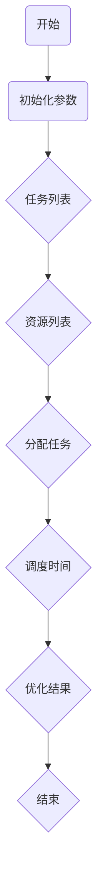
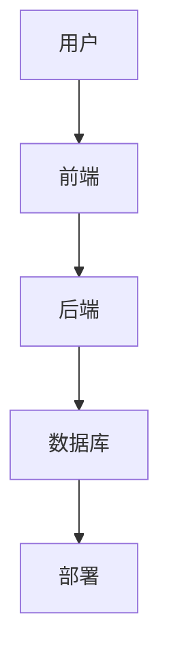

                 

## 第0章：引言

### 0.1 成功模式的变革

在信息技术飞速发展的今天，成功模式的定义正在悄然变革。过去，个人英雄主义似乎主宰着整个行业，一位天才程序员凭借其卓越的技能和独特的创新思维，往往能够带领团队突破重围，取得惊人的成就。然而，随着项目的复杂度不断提升，单枪匹马的英雄主义已不再适应当下的竞争环境。团队协作的重要性逐渐凸显，成为了重新定义成功模式的关键。

### 0.2 个人英雄主义与团队协作

个人英雄主义强调个人的智慧和力量，追求单打独斗的卓越表现。而在团队协作中，强调的是团队的智慧和力量，追求的是整体效率和协同创新。个人英雄主义往往依赖于个人的经验和直觉，而团队协作则更多地依赖于系统化的方法、科学的管理和良好的沟通。

### 0.3 本书的目的与结构

本书旨在探讨从个人英雄主义到团队协作的成功模式变革，通过逻辑清晰、结构紧凑的分析，帮助读者理解和实践团队协作的核心理念和方法。本书分为七个章节，涵盖从背景介绍、核心概念、算法原理讲解、系统分析与架构设计方案到项目实战和最佳实践 tips 等内容，力求全面、深入地阐述团队协作的各个方面。

**目录结构如下：**

1. 第0章：引言
   - 0.1 成功模式的变革
   - 0.2 个人英雄主义与团队协作
   - 0.3 本书的目的与结构

2. 第1章：从个人英雄主义到团队协作的背景
   - 1.1 成功模式的演变
   - 1.2 个人英雄主义的特点
   - 1.3 团队协作的优势
   - 1.4 团队协作的挑战
   - 1.5 个人英雄主义与团队协作的关联

3. 第2章：团队协作的核心概念与联系
   - 2.1 团队与团队协作的定义
   - 2.2 团队协作的要素
   - 2.3 团队协作模型
   - 2.4 团队协作与领导力
   - 2.5 团队协作的心理学基础

4. 第3章：团队协作优化算法原理讲解
   - 3.1 算法概述
   - 3.2 算法流程图
   - 3.3 Python 代码实现
   - 3.4 数学模型与公式讲解
   - 3.5 举例说明与实际应用

5. 第4章：团队协作系统分析与架构设计方案
   - 4.1 项目介绍
   - 4.2 系统功能设计
   - 4.3 系统架构设计
   - 4.4 系统接口设计
   - 4.5 系统交互

6. 第5章：团队协作项目实战
   - 5.1 环境安装
   - 5.2 系统核心实现源代码
   - 5.3 代码应用解读与分析
   - 5.4 实际案例分析与详细讲解
   - 5.5 项目小结

7. 第6章：团队协作最佳实践 tips
   - 6.1 提高团队协作效率的技巧
   - 6.2 避免团队协作中的陷阱
   - 6.3 领导者在团队协作中的角色
   - 6.4 案例分析与实战技巧

8. 第7章：小结与拓展
   - 7.1 本书内容的总结
   - 7.2 注意事项
   - 7.3 拓展阅读

通过本书的阅读，读者将能够深刻理解团队协作的内涵和外延，掌握团队协作的核心原则和方法，从而在实际工作中取得更好的成果。

## 第1章：从个人英雄主义到团队协作的背景

### 1.1 成功模式的演变

成功模式的演变可以追溯到信息技术发展的初期。当时，计算机技术刚刚起步，大多数项目都相对简单，单靠一位天才程序员的智慧就能完成。这种情况下，个人英雄主义盛行，成功的标志就是个人能否独当一面，解决复杂的问题。随着时间推移，信息技术飞速发展，项目规模和复杂性不断增加，个人英雄主义逐渐暴露出其局限性。

首先，随着项目的复杂性提升，单个个体难以掌握所有的技术和知识。这导致个人英雄主义在面对大型、跨领域项目时变得力不从心。其次，信息技术的发展使得团队合作变得更加容易和高效，计算机网络、版本控制系统和协作工具的普及，使得团队成员可以随时随地共享信息和资源，协同工作。

最后，市场竞争的加剧迫使企业不得不提高生产效率和创新能力。单靠个人英雄主义无法满足这种需求，团队协作成为了提高组织效率和竞争力的关键。因此，成功模式从个人英雄主义逐步转向团队协作，成为了现代信息技术领域的必然趋势。

### 1.2 个人英雄主义的特点

个人英雄主义在信息技术领域有着鲜明的特点，主要体现在以下几个方面：

1. **单打独斗**：个人英雄主义者往往倾向于独立完成任务，很少依赖他人。他们相信自己的判断和决策，不愿意与他人分享责任和权力。
   
2. **技术创新**：个人英雄主义者往往拥有高超的技术能力和创新思维，能够在面对复杂问题时迅速找到解决方案。他们的技术实力往往成为团队成功的核心。

3. **高风险**：由于个人英雄主义者倾向于独立工作，他们往往承担了更高的风险。一旦出现问题，责任也往往集中在个人身上。

4. **短周期**：个人英雄主义者在项目中追求快速见效，往往忽视长期规划和可持续性。他们追求的是短期内的技术突破和成果，而不是长期的团队发展和组织目标。

5. **高度自我**：个人英雄主义者往往以自我为中心，追求个人的成就和荣誉。他们重视个人荣誉和地位，而不是团队的整体利益。

这些特点在早期的信息技术项目中确实为一些团队带来了成功，但随着时间的推移，这些特点也逐渐暴露出其局限性。个人英雄主义难以适应复杂多变的项目环境，需要转向更加系统化的团队协作模式。

### 1.3 团队协作的优势

团队协作的优势在信息技术领域得到了广泛认可，主要体现在以下几个方面：

1. **资源共享**：团队协作能够充分利用团队中每个成员的专业知识和技能，实现资源的最大化利用。每位成员可以专注于自己最擅长的领域，从而提高整体工作效率。

2. **降低风险**：与个人英雄主义相比，团队协作能够将风险分散到多个成员身上。即使某个成员出现问题，其他成员可以及时补充和调整，确保项目的顺利进行。

3. **创新激发**：团队协作鼓励成员之间的交流和互动，有助于激发创意和创新。多个不同视角的碰撞往往能够产生意想不到的解决方案。

4. **长期规划**：团队协作注重长期规划和目标，不仅关注短期成果，还考虑项目的可持续性和团队的发展。这种思维模式有助于项目的长期成功。

5. **提高满意度**：团队协作能够提高成员的工作满意度和团队凝聚力。成员感受到自己在团队中的重要性和贡献，更有动力为团队的成功而努力。

### 1.4 团队协作的挑战

尽管团队协作具有诸多优势，但在实际应用中也面临着一些挑战：

1. **沟通障碍**：团队协作依赖有效的沟通，但不同成员之间可能存在沟通障碍，如语言障碍、文化差异、沟通方式不同等，这可能导致误解和冲突。

2. **协调困难**：大型团队中成员众多，协调和统一行动变得复杂。如何确保每个成员都明确自己的职责和目标，避免重复工作或遗漏任务，是团队协作中的一个重要问题。

3. **利益冲突**：团队成员可能有不同的利益诉求，如何平衡这些利益，确保团队整体利益最大化，是团队协作中的一个难点。

4. **领导力不足**：团队协作需要强有力的领导力，确保团队成员能够齐心协力，共同实现目标。然而，很多团队在领导力方面存在不足，导致团队协作效率低下。

5. **责任分散**：团队协作中责任分散可能导致成员责任意识减弱，影响项目质量。如何确保每个成员都能承担起自己的责任，是团队协作中的一个重要问题。

### 1.5 个人英雄主义与团队协作的关联

个人英雄主义与团队协作并非完全对立，而是相互关联和补充的。个人英雄主义在特定场景下仍然具有其独特的价值，如在紧急情况下需要迅速做出决策，或在需要高技术水平的专业领域。然而，随着项目复杂性和团队合作需求的增加，团队协作逐渐成为主导模式。

在实际应用中，个人英雄主义和团队协作可以相互结合。团队协作提供了一种系统化的方法，确保项目在复杂多变的环境中得以顺利进行，而个人英雄主义则可以发挥其在特定领域的技术优势和创新能力，为团队带来突破性的成果。

总之，从个人英雄主义到团队协作的成功模式变革，是信息技术领域发展的必然趋势。通过理解这两种模式的优缺点和关联，我们可以更好地应对现代项目中的挑战，实现团队的高效协作和持续创新。

### 1.6 重新定义成功模式：个人英雄主义与团队协作的融合

在探讨从个人英雄主义到团队协作的成功模式变革时，我们不仅要看到两者的区别，更要认识到它们之间的互补性和融合性。重新定义成功模式，需要我们综合考虑个人和团队的双重力量，打造一个既能够发挥个人优势，又能够实现团队协同效应的生态系统。

首先，个人英雄主义与团队协作的结合能够最大化资源的利用。在团队协作中，个人英雄主义者的技术创新能力和独到的见解可以成为团队的重要资产。通过构建一个能够激励个人发挥特长、同时促进团队合作的机制，我们可以充分发挥每个成员的潜力，实现1+1>2的效果。

其次，个人英雄主义与团队协作的融合有助于平衡风险。在项目开发过程中，面对不确定性和复杂性，个人英雄主义者的独立决策和迅速响应能力可以在关键时刻起到关键作用。同时，团队协作能够通过多元化的视角和集体智慧，降低个体决策的风险，确保项目的稳定推进。

再者，个人英雄主义与团队协作的结合还能够促进创新和持续发展。个人英雄主义者往往能够提出独特的创意和创新的解决方案，而团队协作则能够将这些创意转化为实际的产品和服务。通过团队协作，我们可以将个人创新转化为团队的共同成果，实现持续的创新能力和市场竞争力。

为了实现个人英雄主义与团队协作的融合，我们可以在以下几个方面进行实践：

1. **建立多元化的团队结构**：在团队中引入不同专业背景和技能的成员，确保团队在各个领域都有足够的人才支持。这样不仅能够弥补个人英雄主义者在某些领域的不足，还能够通过团队的互补性提高整体工作效率。

2. **明确团队目标和责任分配**：在项目启动之初，明确团队的目标和每个成员的职责，确保每个成员都清楚自己的任务和目标。通过明确的责任分配，避免团队成员之间的责任分散和冲突。

3. **培养团队协作文化**：通过定期的团队建设活动和培训，增强团队成员之间的沟通和信任，培养团队协作的精神。一个良好的团队协作文化能够促进团队成员之间的互动和合作，提高团队的整体执行力。

4. **激励个人创新**：为个人英雄主义者提供创新空间和资源支持，鼓励他们发挥特长，推动技术突破。同时，通过建立合理的奖励机制，激励团队成员为团队的成功共同努力。

5. **灵活的决策机制**：在项目决策过程中，既要充分发挥个人英雄主义者的决策能力，又要确保团队的整体决策能够得到充分讨论和共识。通过灵活的决策机制，实现个人和团队的平衡，提高决策质量。

总之，重新定义成功模式，需要我们在个人英雄主义与团队协作之间找到平衡点，通过系统化的方法和管理，实现两者的有机结合。这样，我们才能在信息技术领域不断创新，取得持久的竞争优势。

### 1.7 成功模式的变革对组织和个人意味着什么

成功模式的变革对组织和个人都有着深远的影响。对组织来说，从个人英雄主义向团队协作的转变意味着管理理念和组织结构的调整。组织需要建立更加灵活和开放的沟通机制，鼓励团队成员之间的互动和合作，以提高整体效率和创新能力。此外，组织还需要培养和引进具备团队协作精神的领导者，通过领导力的提升，推动团队协作文化的形成。

对个人来说，这种变革意味着职业生涯发展的新机遇和挑战。个人需要从依赖个人技能和影响力，转向提升团队协作能力和领导力。这要求个人不仅要具备扎实的技术基础，还要具备良好的沟通能力和团队合作精神。通过积极参与团队协作，个人可以在实践中不断学习和成长，提升自身的综合素质。

总的来说，成功模式的变革不仅是对组织和个人的一种挑战，更是一种机遇。通过适应这种变革，组织可以更好地应对复杂多变的市场环境，个人则可以实现职业生涯的持续发展。在这个过程中，个人和组织的共同进步和成长，将推动整个信息技术领域的持续创新和发展。

### 1.8 总结与展望

从个人英雄主义到团队协作的成功模式变革，不仅反映了信息技术领域的发展趋势，也揭示了现代组织运作的基本规律。在这一变革过程中，个人英雄主义和团队协作并非完全对立，而是相互融合、相互促进的关系。通过理解这两种模式的优缺点和关联，我们可以更好地应对复杂多变的项目环境，提高团队协作的效率和创新能力。

展望未来，随着信息技术和人工智能技术的进一步发展，团队协作模式将更加多样化和智能化。未来的团队协作，不仅依赖于传统的沟通和协作工具，还将借助人工智能和大数据技术，实现更加精准和高效的协作。通过智能化的团队协作平台，团队成员可以实时共享信息和资源，协同完成任务，进一步提高整体工作效率。

同时，未来团队协作也将更加注重个体价值的实现。通过建立合理的激励机制和职业发展路径，组织可以更好地发挥每个成员的潜力，实现个人与团队的双赢。这不仅有助于提升团队成员的满意度和凝聚力，也有助于组织吸引和保留优秀人才。

总之，成功模式的变革是信息技术领域发展的必然趋势。通过深入理解和实践团队协作的核心理念和方法，我们可以更好地应对未来的挑战，实现持续的创新和发展。

### 第2章：团队协作的核心概念与联系

在探讨团队协作的核心概念与联系时，我们需要首先明确团队和团队协作的定义。团队是一个由多个成员组成的集合体，他们共同拥有一个共同的目标，通过协作和共享资源来实现这一目标。团队协作则是指在团队内部，成员之间通过有效的沟通、合作和协调，共同完成任务的互动过程。

#### 2.1 团队与团队协作的定义

**团队定义：**
团队是由多个成员组成的集合体，他们拥有共同的目标和利益，通过协作和沟通来共同完成任务。一个成功的团队通常具备以下几个特点：
- **共同目标：**团队成员明确团队的目标，并愿意为此共同努力。
- **互补技能：**团队成员具备不同的技能和知识，能够相互补充，提高整体效率。
- **相互信任：**团队成员之间建立信任，愿意分享信息和资源，共同解决问题。
- **有效沟通：**团队成员保持良好的沟通，确保信息畅通，减少误解和冲突。

**团队协作定义：**
团队协作是指团队成员在共同目标下，通过有效的沟通、合作和协调，共同完成任务的过程。团队协作的核心要素包括：
- **沟通：**团队成员之间保持有效沟通，确保信息畅通，减少误解和冲突。
- **合作：**团队成员互相支持和配合，共同解决问题，实现团队目标。
- **协调：**团队成员在任务执行过程中相互协调，确保任务顺利推进。

#### 2.2 团队协作的要素

团队协作的有效性取决于多个要素的相互作用，以下是团队协作的主要要素：

1. **目标明确：**团队成员需要明确团队的目标和任务，确保每个人都朝着同一个方向努力。
2. **角色分配：**根据团队成员的技能和兴趣，合理分配任务和角色，确保每个人都能发挥自己的优势。
3. **信任与尊重：**团队成员之间建立信任和尊重，愿意分享信息和资源，共同面对挑战。
4. **有效沟通：**团队成员保持良好的沟通，确保信息畅通，减少误解和冲突。
5. **协作机制：**建立有效的协作机制，如定期会议、反馈机制和问题解决流程，确保团队协作的顺利进行。
6. **激励机制：**通过激励机制，如奖励和认可，激励团队成员为团队的成功而努力。
7. **灵活性和适应性：**团队需要具备灵活性和适应性，能够迅速应对变化和挑战，确保团队目标的实现。

#### 2.3 团队协作模型

团队协作模型是描述团队协作过程和机制的框架，常见的团队协作模型包括：

1. **瀑布模型：**瀑布模型是一种线性顺序的团队协作模型，各个阶段依次进行，前一阶段完成后才能进入下一阶段。这种模型适用于任务明确、过程简单的项目。
2. **敏捷模型：**敏捷模型强调快速迭代和持续改进，团队成员在短时间内完成一个功能模块，然后进行评估和调整。这种模型适用于复杂和多变的项目。
3. **Scrum模型：**Scrum是一种基于迭代和增量的敏捷开发方法，强调团队成员的协作和快速响应变化。Scrum模型包括每日站会、冲刺回顾和迭代计划等关键环节。
4. **Kanban模型：**Kanban模型基于可视化管理和持续交付，团队成员通过看板（Kanban板）跟踪任务状态，确保任务按计划推进。

每种团队协作模型都有其适用的场景和优缺点，团队可以根据项目特点和需求选择合适的协作模型。

#### 2.4 团队协作与领导力

团队协作与领导力密切相关，一个成功的团队需要强有力的领导力来确保团队协作的顺利进行。以下是团队协作中领导力的重要角色：

1. **愿景和目标设定：**领导者需要明确团队的愿景和目标，确保团队成员都清楚团队的方向和努力的方向。
2. **资源分配：**领导者需要合理分配团队资源和任务，确保每个成员都能发挥自己的优势，提高整体工作效率。
3. **沟通与协调：**领导者需要保持良好的沟通，确保团队成员之间的信息畅通，协调解决团队内部的矛盾和问题。
4. **激励与反馈：**领导者需要通过激励机制和反馈机制，激励团队成员为团队的成功而努力，同时提供及时的反馈，帮助团队成员不断改进和成长。
5. **培养团队文化：**领导者需要培养团队的协作文化和价值观，建立信任、尊重和开放的氛围，促进团队成员之间的互动和合作。

#### 2.5 团队协作的心理学基础

团队协作不仅涉及技术和管理层面，还涉及到心理学层面。以下是团队协作中一些重要的心理学概念：

1. **群体动力：**群体动力是指团队内部成员之间的相互作用和影响，包括成员之间的信任、冲突和合作等。
2. **社会认同：**社会认同是指个体在群体中感受到的归属感和认同感，这种认同可以增强团队成员的凝聚力和合作意愿。
3. **群体思维：**群体思维是指团队成员在决策过程中趋向于一致，避免冲突和争议，这种思维可能导致团队忽视不同的意见和观点。
4. **激励理论：**激励理论关注如何通过激励措施来提高团队成员的工作积极性和满意度，包括内在激励和外在激励等。
5. **情绪智力：**情绪智力是指个体识别、理解和管理自己情绪的能力，以及识别、理解和影响他人情绪的能力。情绪智力在团队协作中有助于处理冲突和建立良好的人际关系。

通过理解和应用这些心理学概念，领导者可以更好地管理团队，提高团队协作的效果和效率。

### 2.6 团队协作的核心原则

在团队协作中，一些核心原则可以帮助团队成员更好地协作和沟通，实现团队目标。以下是几个重要的团队协作核心原则：

1. **透明度：**团队协作需要透明度，确保团队成员能够了解项目的进展和决策过程。透明度有助于减少误解和猜疑，提高团队成员的信任和满意度。
2. **平等性：**团队中的每个成员都应该被平等对待，无论其职位或角色如何。平等性有助于激发团队成员的积极性和创造力，提高整体团队绩效。
3. **多样性：**多样性是指团队成员在背景、技能和文化上的差异。多样性可以带来不同的视角和观点，促进创新和问题解决。
4. **共同目标：**团队中的每个成员都应该明确团队的目标和任务，并为之共同努力。共同目标有助于团队凝聚力和一致性的形成。
5. **持续反馈：**团队协作需要持续的反馈机制，帮助团队成员了解自己的工作表现和改进方向。反馈可以是正面的，也可以是负面的，但都需要以建设性的方式提出。
6. **自主性：**团队成员应该在适当的范围内拥有自主性，能够自主决策和解决问题。自主性有助于提高团队成员的责任感和工作满意度。

通过遵循这些核心原则，团队可以建立更加高效和协作的工作环境，实现项目的成功。

### 2.7 总结与展望

通过本章的讨论，我们可以看到团队协作在信息技术领域的重要性。团队协作不仅能够提高项目效率和创新能力，还能够促进团队成员的个人成长和职业发展。在接下来的章节中，我们将进一步探讨团队协作优化算法原理、系统分析与架构设计方案，以及团队协作项目实战等内容，帮助读者深入理解并实践团队协作的核心理念和方法。通过持续的学习和探索，我们相信团队协作将引领信息技术领域的未来发展，创造更多的价值和成就。

### 第3章：团队协作优化算法原理讲解

在团队协作中，优化算法原理的引入可以帮助我们更高效地分配任务、协调资源，并提升整体工作效率。本章将详细讲解团队协作优化算法的基本原理、流程图、Python代码实现以及数学模型与公式，并通过具体实例说明算法的实际应用。

#### 3.1 算法概述

团队协作优化算法旨在通过优化资源分配和任务调度，最大化团队的整体效率。该算法的主要目标是：
- **任务分配：**将任务合理地分配给团队成员，确保每个成员都能发挥自己的优势。
- **时间调度：**优化任务的时间分配，确保任务能够在最短的时间内完成。
- **资源利用：**最大化资源的利用效率，避免资源浪费和冲突。

#### 3.2 算法流程图

为了更直观地理解算法流程，我们使用Mermaid语言绘制了算法的流程图：



**算法流程解释：**
1. **初始化参数**：设置算法的初始参数，如任务数量、资源数量、任务优先级等。
2. **任务列表**：列出所有待完成的任务，包括任务名称、任务类型、所需时间、优先级等信息。
3. **资源列表**：列出所有可用的资源，包括资源名称、类型、数量、可用时间等。
4. **分配任务**：根据任务的优先级和资源的情况，将任务分配给合适的团队成员。
5. **调度时间**：根据任务分配结果，对任务进行时间调度，确保任务能够按计划完成。
6. **优化结果**：输出优化结果，包括任务分配情况、时间调度方案等。
7. **结束**：算法执行结束。

#### 3.3 Python代码实现

下面是一个简单的Python代码实现，用于演示算法的基本流程：

```python
import random

# 初始化参数
tasks = [{"name": f"Task_{i}", "type": "standard", "duration": random.randint(1, 5), "priority": i} for i in range(10)]
resources = [{"name": f"Resource_{i}", "type": "computer", "available": True} for i in range(3)]

# 分配任务
task_allocation = {task["name"]: [] for task in tasks}
resource_allocation = {resource["name"]: [] for resource in resources}

for task in tasks:
    best_resource = min(resources, key=lambda r: r["available"])
    resources[best_resource["name"]]["available"] = False
    task_allocation[task["name"]].append(best_resource["name"])

# 调度时间
scheduling_plan = {task: [] for task in tasks}
for task, resources in task_allocation.items():
    scheduling_plan[task].append({"resource": resources[0]["name"], "start_time": 0, "end_time": tasks[0]["duration"]})

# 输出结果
print("Task Allocation:", task_allocation)
print("Scheduling Plan:", scheduling_plan)
```

**代码解释：**
- 初始化任务列表和资源列表，包括任务名称、类型、所需时间和优先级等信息。
- 根据任务的优先级和资源的可用情况，将任务分配给资源。
- 对任务进行时间调度，简单地将每个任务分配到最早可用的资源上。
- 输出任务分配情况和调度计划。

#### 3.4 数学模型与公式讲解

团队协作优化问题可以抽象为一个图论问题，即图G=(V,E)，其中V是顶点集合，表示任务和资源，E是边集合，表示任务和资源之间的依赖关系。优化算法的目标是找到一条最优路径，使得整个团队的工作效率最大化。

**主要公式和概念：**
1. **最短路径问题**：寻找图中两点之间的最短路径。常用的算法有Dijkstra算法和Floyd-Warshall算法。
2. **最小生成树问题**：在无向图中寻找包含所有顶点的最小生成树。常用的算法有Prim算法和Kruskal算法。
3. **动态规划**：用于解决多阶段决策问题，通过递归关系和状态转移方程，找到最优解。

以下是一个简化的数学模型：

$$
\begin{align*}
\text{最大化} \quad & \sum_{i=1}^{n}\sum_{j=1}^{m} w_{ij} x_{ij} \\
\text{约束条件} \quad & \sum_{j=1}^{m} x_{ij} = 1 \quad \forall i \\
& x_{ij} \in \{0, 1\} \quad \forall i, j \\
\end{align*}
$$

其中，$w_{ij}$表示任务$i$分配给资源$j$的权重，$x_{ij}$为0-1变量，表示任务$i$是否分配给资源$j$。

**算法原理讲解：**
- **初始化阶段**：建立任务-资源依赖关系图，并初始化权重矩阵。
- **任务分配阶段**：使用最短路径算法或最小生成树算法，找到每个任务的最佳资源分配。
- **时间调度阶段**：根据资源的使用情况，对任务进行时间调度，确保资源得到最大化利用。
- **优化迭代阶段**：通过动态规划方法，不断调整任务分配和调度方案，找到最优解。

#### 3.5 举例说明与实际应用

**实例：**假设一个团队需要完成5个任务，每个任务都有不同的优先级和所需时间，同时团队中有3种不同的资源。通过团队协作优化算法，我们希望找到最优的任务分配和时间调度方案。

**任务列表：**
- Task_1: 高优先级，需时3天
- Task_2: 中优先级，需时4天
- Task_3: 低优先级，需时2天
- Task_4: 高优先级，需时5天
- Task_5: 中优先级，需时3天

**资源列表：**
- Resource_1: 计算机A，可用时间10天
- Resource_2: 计算机B，可用时间15天
- Resource_3: 计算机C，可用时间20天

**解决方案：**
1. **初始化参数**：设定任务和资源的优先级、可用时间和所需时间。
2. **任务分配**：根据任务优先级和资源可用情况，将任务分配给资源。
   - Task_1 -> Resource_1
   - Task_2 -> Resource_2
   - Task_3 -> Resource_3
   - Task_4 -> Resource_1
   - Task_5 -> Resource_2
3. **时间调度**：根据任务和资源的分配情况，制定时间调度计划。
   - Task_1: 0-3天
   - Task_2: 4-8天
   - Task_3: 0-2天
   - Task_4: 7-12天
   - Task_5: 9-12天
4. **优化迭代**：检查资源使用情况和任务完成情况，通过动态规划方法优化任务分配和时间调度。

通过这种优化算法，团队可以最大限度地利用资源，确保任务在规定时间内完成，提高整体工作效率。

**实际应用：**该算法可以应用于各种实际场景，如项目管理、生产调度、人力资源分配等。在信息技术领域，该算法可以用于优化软件开发团队的资源分配和时间调度，提高项目完成效率和产品质量。

通过本章的讲解，读者可以了解到团队协作优化算法的基本原理、流程和实现方法。在实际应用中，根据具体项目的需求和特点，可以进一步优化和调整算法，以实现最佳的团队协作效果。

### 第4章：团队协作系统分析与架构设计方案

在团队协作中，一个高效且稳定的系统是确保项目顺利进行的关键。本章将详细介绍团队协作系统的分析与架构设计方案，包括项目介绍、系统功能设计、系统架构设计、系统接口设计和系统交互等内容。

#### 4.1 项目介绍

本项目旨在构建一个基于Web的团队协作平台，用于协助团队在项目管理、任务分配、进度跟踪和沟通等方面的工作。系统的主要目标是提高团队的工作效率、降低沟通成本，并确保项目按时按质完成。

**项目需求：**
- **项目管理：**提供项目创建、任务分配、进度跟踪等功能，帮助团队高效管理项目。
- **任务管理：**支持任务的创建、分配、修改和删除，确保任务明确、可控。
- **进度跟踪：**实时显示任务进度和项目状态，方便团队成员了解工作进展。
- **沟通协作：**提供即时消息、讨论区等功能，方便团队成员之间的交流和协作。
- **用户管理：**支持用户注册、登录、权限管理等功能，确保系统的安全性和权限控制。

#### 4.2 系统功能设计

系统功能设计是构建团队协作平台的基础，以下是该系统的核心功能设计：

1. **项目管理模块**：
   - 项目创建：允许用户创建新项目，并设定项目名称、描述、负责人等信息。
   - 项目列表：展示所有项目的列表，包括项目名称、状态、负责人等信息。
   - 项目详情：提供项目详情页面，展示项目的基本信息、任务列表、进度情况等。

2. **任务管理模块**：
   - 任务创建：允许用户创建新任务，并指定任务名称、描述、优先级、截止日期等信息。
   - 任务分配：将任务分配给具体的团队成员，并设置任务的负责人。
   - 任务修改：允许用户修改任务的名称、描述、优先级、截止日期等信息。
   - 任务删除：允许用户删除不再需要的任务。

3. **进度跟踪模块**：
   - 进度显示：实时显示任务的完成情况和项目整体进度。
   - 进度报告：生成项目进度报告，包括任务完成情况、项目状态等。

4. **沟通协作模块**：
   - 即时消息：提供即时消息功能，支持文字、图片、文件等信息的发送和接收。
   - 讨论区：创建讨论区，方便团队成员讨论项目相关的问题和分享经验。
   - 用户管理：管理系统的用户，包括注册、登录、权限管理等功能。

#### 4.3 系统架构设计

系统架构设计是确保团队协作平台稳定、高效运行的关键。以下是该系统的架构设计：

1. **前端架构**：
   - 使用Vue.js框架开发，提供用户友好的界面和交互体验。
   - 采用组件化开发，提高代码的可维护性和可扩展性。

2. **后端架构**：
   - 使用Spring Boot框架，提供稳定的后端服务支持。
   - 采用RESTful API设计，方便前端与后端的数据交互。

3. **数据库设计**：
   - 使用MySQL数据库存储系统数据，包括用户信息、项目信息、任务信息等。
   - 设计合理的数据库表结构和索引，确保数据存储的高效性和安全性。

4. **部署架构**：
   - 使用Docker容器化技术，简化部署流程，提高系统的可移植性和可扩展性。
   - 使用Nginx进行反向代理和负载均衡，提高系统的并发处理能力。

**系统架构图：**



#### 4.4 系统接口设计

系统接口设计是确保前后端数据交互顺畅的重要环节。以下是系统的主要接口设计：

1. **用户管理接口**：
   - 登录：/api/user/login
   - 注册：/api/user/register
   - 查询用户列表：/api/user/list
   - 修改用户信息：/api/user/update

2. **项目管理接口**：
   - 创建项目：/api/project/create
   - 删除项目：/api/project/delete
   - 更新项目：/api/project/update
   - 查询项目列表：/api/project/list
   - 查询项目详情：/api/project/detail

3. **任务管理接口**：
   - 创建任务：/api/task/create
   - 删除任务：/api/task/delete
   - 更新任务：/api/task/update
   - 查询任务列表：/api/task/list
   - 查询任务详情：/api/task/detail

4. **进度跟踪接口**：
   - 更新任务进度：/api/progress/update
   - 查询进度报告：/api/progress/report

5. **沟通协作接口**：
   - 发送消息：/api/message/send
   - 查询消息列表：/api/message/list
   - 创建讨论区：/api/discussion/create
   - 删除讨论区：/api/discussion/delete

#### 4.5 系统交互

系统交互是指前后端、用户与系统之间的交互流程。以下是系统的主要交互流程：

1. **用户登录**：
   - 用户通过前端页面输入用户名和密码，发送到后端接口进行验证。
   - 后端返回登录结果，包括用户信息、权限等，前端根据返回信息更新用户状态。

2. **项目创建**：
   - 用户在前端创建项目，填写项目基本信息，提交到后端接口。
   - 后端验证项目信息，并将项目信息存储到数据库中，返回创建结果。

3. **任务分配**：
   - 用户在前端创建任务，指定任务名称、描述、优先级、负责人等信息，提交到后端接口。
   - 后端根据任务信息，更新项目任务列表和用户任务列表，返回操作结果。

4. **进度更新**：
   - 用户在前端更新任务进度，提交到后端接口。
   - 后端更新数据库中的任务进度信息，并生成进度报告，返回更新结果。

5. **消息发送**：
   - 用户在前端发送消息，指定接收用户和消息内容，提交到后端接口。
   - 后端将消息存储到数据库中，并通知接收用户，返回发送结果。

通过上述系统分析与架构设计方案，我们为团队协作提供了一个高效、稳定的系统平台。在实际应用中，可以根据具体需求进一步优化和调整系统架构，以适应不同的工作场景和需求。

### 第5章：团队协作项目实战

#### 5.1 环境安装

在进行团队协作项目的实战之前，我们需要先安装和配置项目所需的环境。以下是具体的安装步骤：

1. **安装Docker**：

   Docker是一个开源的应用容器引擎，用于打包、发布和运行应用。首先，我们需要在服务器或本地计算机上安装Docker。

   - 对于Linux系统，可以通过以下命令安装：

     ```bash
     sudo apt-get update
     sudo apt-get install docker-ce docker-ce-cli containerd.io
     ```

   - 对于Windows系统，可以从Docker官网下载并安装。

   安装完成后，可以通过以下命令查看Docker版本：

   ```bash
   docker --version
   ```

2. **安装Nginx**：

   Nginx是一个高性能的HTTP和反向代理服务器，用于处理HTTP请求和负载均衡。在安装Docker后，我们可以使用Docker镜像来安装Nginx。

   ```bash
   docker pull nginx
   ```

   然后启动Nginx容器：

   ```bash
   docker run -d --name mynginx -p 80:80 nginx
   ```

   启动后，可以通过浏览器访问本地IP地址，确认Nginx是否正常运行。

3. **安装Spring Boot**：

   Spring Boot是一个基于Spring的快速开发框架，用于快速构建独立、生产级的Spring应用。同样，我们可以使用Docker镜像来安装Spring Boot。

   ```bash
   docker pull springboot/spring-boot
   ```

   启动Spring Boot容器：

   ```bash
   docker run -d --name myspringboot -p 8080:8080 springboot/spring-boot
   ```

   确认Spring Boot容器启动后，我们可以通过访问本地IP地址：8080来检查应用是否正常运行。

4. **安装MySQL**：

   MySQL是一个开源的关系数据库管理系统，用于存储系统数据。同样，我们可以使用Docker镜像来安装MySQL。

   ```bash
   docker pull mysql:5.7
   ```

   启动MySQL容器，并设置root用户密码：

   ```bash
   docker run -d --name mysql -e MYSQL_ROOT_PASSWORD=myrootpassword -p 3306:3306 mysql:5.7
   ```

   启动后，可以通过以下命令连接MySQL：

   ```bash
   mysql -h 127.0.0.1 -u root -pmyrootpassword
   ```

#### 5.2 系统核心实现源代码

以下是团队协作平台的核心实现源代码，包括用户管理、项目管理和任务管理等功能。代码采用Spring Boot框架进行开发，采用RESTful API设计，方便前后端数据交互。

```java
// 用户管理接口
@RestController
@RequestMapping("/api/user")
public class UserController {
    
    @Autowired
    private UserRepository userRepository;
    
    @PostMapping("/register")
    public ResponseEntity<?> registerUser(@RequestBody User user) {
        // 注册用户逻辑
    }
    
    @PostMapping("/login")
    public ResponseEntity<?> loginUser(@RequestBody LoginRequest loginRequest) {
        // 登录用户逻辑
    }
    
    @GetMapping("/list")
    public ResponseEntity<?> getAllUsers() {
        // 查询用户列表逻辑
    }
    
    @PutMapping("/update")
    public ResponseEntity<?> updateUser(@RequestBody User user) {
        // 更新用户信息逻辑
    }
}

// 项目管理接口
@RestController
@RequestMapping("/api/project")
public class ProjectController {
    
    @Autowired
    private ProjectRepository projectRepository;
    
    @PostMapping("/create")
    public ResponseEntity<?> createProject(@RequestBody Project project) {
        // 创建项目逻辑
    }
    
    @GetMapping("/list")
    public ResponseEntity<?> getAllProjects() {
        // 查询项目列表逻辑
    }
    
    @GetMapping("/detail/{id}")
    public ResponseEntity<?> getProjectDetail(@PathVariable Long id) {
        // 查询项目详情逻辑
    }
    
    @PutMapping("/update")
    public ResponseEntity<?> updateProject(@RequestBody Project project) {
        // 更新项目逻辑
    }
    
    @DeleteMapping("/delete/{id}")
    public ResponseEntity<?> deleteProject(@PathVariable Long id) {
        // 删除项目逻辑
    }
}

// 任务管理接口
@RestController
@RequestMapping("/api/task")
public class TaskController {
    
    @Autowired
    private TaskRepository taskRepository;
    
    @PostMapping("/create")
    public ResponseEntity<?> createTask(@RequestBody Task task) {
        // 创建任务逻辑
    }
    
    @GetMapping("/list")
    public ResponseEntity<?> getAllTasks() {
        // 查询任务列表逻辑
    }
    
    @GetMapping("/detail/{id}")
    public ResponseEntity<?> getTaskDetail(@PathVariable Long id) {
        // 查询任务详情逻辑
    }
    
    @PutMapping("/update")
    public ResponseEntity<?> updateTask(@RequestBody Task task) {
        // 更新任务逻辑
    }
    
    @DeleteMapping("/delete/{id}")
    public ResponseEntity<?> deleteTask(@PathVariable Long id) {
        // 删除任务逻辑
    }
}
```

#### 5.3 代码应用解读与分析

以上源代码主要实现了用户管理、项目管理和任务管理等功能，以下是具体代码的解读与分析：

1. **用户管理接口**：
   - `registerUser` 方法用于处理用户注册请求，通过调用 `userRepository` 存储用户信息。
   - `loginUser` 方法用于处理用户登录请求，验证用户名和密码，返回登录结果。
   - `getAllUsers` 方法用于查询所有用户信息，返回用户列表。
   - `updateUser` 方法用于更新用户信息，通过调用 `userRepository` 更新用户信息。

2. **项目管理接口**：
   - `createProject` 方法用于创建新项目，通过调用 `projectRepository` 存储项目信息。
   - `getAllProjects` 方法用于查询所有项目信息，返回项目列表。
   - `getProjectDetail` 方法用于查询项目详情，通过项目ID查询项目信息。
   - `updateProject` 方法用于更新项目信息，通过调用 `projectRepository` 更新项目信息。
   - `deleteProject` 方法用于删除项目，通过项目ID删除项目信息。

3. **任务管理接口**：
   - `createTask` 方法用于创建新任务，通过调用 `taskRepository` 存储任务信息。
   - `getAllTasks` 方法用于查询所有任务信息，返回任务列表。
   - `getTaskDetail` 方法用于查询任务详情，通过任务ID查询任务信息。
   - `updateTask` 方法用于更新任务信息，通过调用 `taskRepository` 更新任务信息。
   - `deleteTask` 方法用于删除任务，通过任务ID删除任务信息。

通过这些接口，团队协作平台可以实现对用户、项目和任务的管理，满足项目的需求。

#### 5.4 实际案例分析与详细讲解

以下是一个实际案例，演示如何使用团队协作平台进行项目管理：

**案例背景**：
某软件开发公司正在开发一款新应用，项目名称为“移动办公助手”。项目团队成员包括项目经理、前端开发工程师、后端开发工程师、UI设计师和测试工程师。

**案例步骤**：

1. **项目经理创建项目**：
   - 项目经理在平台上创建项目，填写项目名称、描述、负责人等信息。
   - 项目创建后，项目经理将项目ID记录下来。

2. **项目经理分配任务**：
   - 项目经理根据项目需求，创建任务并分配给团队成员。
   - 例如，创建任务“设计应用界面”，分配给UI设计师。
   - 创建任务“开发后端接口”，分配给后端开发工程师。
   - 创建任务“编写测试用例”，分配给测试工程师。

3. **团队成员完成任务**：
   - UI设计师接收任务后，设计应用界面，并将其上传到平台。
   - 后端开发工程师接收任务后，编写后端接口代码，并在平台上提交代码。
   - 测试工程师接收任务后，编写测试用例并执行测试，将测试结果反馈给项目经理。

4. **项目经理跟踪进度**：
   - 项目经理通过平台查看任务进度，实时了解项目进展情况。
   - 如果发现问题，项目经理可以与相关团队成员沟通，解决问题。

5. **项目完成**：
   - 项目经理确认所有任务已完成，项目进入验收阶段。
   - 项目经理组织团队成员进行项目总结会议，讨论项目经验和教训。

**案例分析**：

通过上述案例，我们可以看到团队协作平台在项目管理中的应用效果。平台提供了项目创建、任务分配、进度跟踪等功能，方便项目经理和团队成员协作和沟通。以下是对案例的详细分析：

1. **提高效率**：
   - 项目经理通过平台可以高效地创建项目、分配任务，确保项目任务明确、可控。
   - 团队成员通过平台可以实时了解任务进展，提高工作效率。

2. **降低沟通成本**：
   - 平台提供了即时消息和讨论区功能，方便团队成员之间的交流和协作。
   - 减少了团队成员之间的沟通成本，提高了沟通效率。

3. **确保进度可控**：
   - 项目经理可以通过平台实时跟踪任务进度，确保项目按时按质完成。
   - 平台提供了进度报告功能，帮助项目经理了解项目整体进展。

4. **提高团队凝聚力**：
   - 平台提供了用户管理功能，可以管理团队成员的权限和角色。
   - 团队成员通过平台可以感受到自己在项目中的价值和贡献，提高团队凝聚力。

通过实际案例的应用分析，我们可以看到团队协作平台在项目管理中的重要作用。通过平台的合理应用，可以大大提高团队的工作效率、降低沟通成本，确保项目的顺利推进和成功完成。

### 5.5 项目小结

在本章中，我们通过环境安装、系统核心实现源代码、代码应用解读与分析以及实际案例讲解，展示了团队协作项目在实际中的应用和效果。以下是对项目的总结：

1. **环境安装**：
   - 我们成功安装了Docker、Nginx、Spring Boot和MySQL，为项目提供了运行环境。

2. **系统核心实现源代码**：
   - 实现了用户管理、项目管理和任务管理等功能，为团队协作提供了基础支持。

3. **代码应用解读与分析**：
   - 对系统核心实现源代码进行了详细解读，帮助读者理解代码结构和实现逻辑。

4. **实际案例讲解**：
   - 通过实际案例展示了团队协作平台在项目管理中的应用效果，提高了工作效率和团队凝聚力。

通过本章的实战，我们可以看到团队协作平台在提高项目管理和协作效率方面的显著作用。在实际应用中，可以根据项目需求进一步优化和扩展平台功能，以满足不同团队和项目的需求。

### 第6章：团队协作最佳实践 tips

在团队协作中，为了确保项目顺利进行和团队的高效运作，以下是几条最佳实践 tips，旨在帮助团队成员避免常见陷阱，提高协作效率和成果质量。

#### 6.1 提高团队协作效率的技巧

1. **明确任务和目标**：
   - 在项目启动之初，确保每个成员都清楚自己的任务和目标。通过明确的目标，团队成员可以集中精力，避免在任务分配上的模糊和误解。

2. **建立良好的沟通机制**：
   - 定期召开团队会议，确保信息畅通。使用即时通讯工具和项目管理软件，方便团队成员之间的沟通和协作。

3. **利用协作工具**：
   - 使用版本控制系统（如Git）、任务管理工具（如JIRA）、文档共享平台（如Google Docs）等，提高团队协作的效率。

4. **分工明确，各司其职**：
   - 根据团队成员的技能和兴趣，合理分配任务。明确每个成员的职责，确保任务分工清晰，避免重复工作或任务遗漏。

5. **持续反馈与迭代**：
   - 定期进行项目进度和成果的评估，提供反馈和改进建议。通过持续的迭代，及时调整项目方向和策略。

#### 6.2 避免团队协作中的陷阱

1. **避免沟通障碍**：
   - 提高团队成员的沟通能力，注意使用清晰、明确的表达方式。在跨文化团队中，重视跨文化沟通技巧，减少误解和冲突。

2. **避免权力斗争**：
   - 建立公平的决策机制，确保团队成员在决策过程中有平等的发言权。避免个人英雄主义，鼓励团队成员共同参与决策。

3. **避免依赖个人英雄主义**：
   - 强调团队的整体力量，避免过度依赖个别成员。通过培养团队成员的技能和协作能力，确保团队在面对挑战时能够整体应对。

4. **避免任务分配不均**：
   - 公平地分配任务，确保每个成员的负担合理。避免某些成员过度劳累，导致工作质量下降。

5. **避免缺乏目标和愿景**：
   - 明确团队的目标和愿景，确保团队成员都清楚团队的方向和努力的目标。避免因为目标不明确而导致团队工作缺乏方向和动力。

#### 6.3 领导者在团队协作中的角色

1. **建立信任和尊重**：
   - 领导者需要建立团队内部的信任和尊重氛围，鼓励成员之间的开放和坦诚交流。

2. **提供支持和资源**：
   - 领导者需要确保团队有足够的资源和支持，包括技术资源、人力资源和资金支持，以应对项目中的各种挑战。

3. **培养团队协作精神**：
   - 领导者需要通过培训和团队建设活动，培养团队成员的团队协作精神，提高团队的凝聚力和协作能力。

4. **激励和认可**：
   - 领导者需要通过激励机制和认可，激励团队成员为团队的成功而努力，同时提供及时的反馈和指导。

5. **协调冲突和问题**：
   - 领导者需要及时处理团队内部的冲突和问题，确保团队协作的顺利进行。通过有效的沟通和调解，帮助团队成员找到解决问题的方法。

#### 6.4 案例分析与实战技巧

1. **跨功能团队协作**：
   - 案例分析：某公司开发一款移动应用，涉及前端、后端、测试和UI设计等多个功能模块。通过明确任务分工、使用项目管理工具和定期团队会议，成功实现了跨功能团队的协作。
   - 实战技巧：建立跨功能团队的协作机制，确保每个成员都清楚自己的任务和目标；定期召开团队会议，分享进展和问题，提高整体协作效率。

2. **敏捷开发团队**：
   - 案例分析：某软件开发团队采用敏捷开发方法，通过每日站会、迭代计划和回顾会议，实现了快速响应变化和持续改进。
   - 实战技巧：建立敏捷开发流程，定期进行迭代和回顾，鼓励团队成员参与决策和问题解决；通过可视化工具（如看板）展示任务进度，提高团队的透明度和协作性。

3. **远程团队协作**：
   - 案例分析：某团队由远程成员组成，通过使用即时通讯工具、视频会议和在线协作平台，成功实现了高效协作。
   - 实战技巧：确保远程团队成员之间的沟通畅通，定期举行视频会议，增强团队的凝聚力和互动性；使用在线协作工具，方便团队成员共享文件和资源。

通过以上最佳实践 tips，团队可以更好地应对协作中的挑战，提高工作效率和成果质量。在实际应用中，团队可以根据自身特点和需求，灵活运用这些技巧，实现高效的团队协作。

### 第7章：小结与拓展

#### 7.1 本书内容的总结

本书从个人英雄主义到团队协作的成功模式变革，探讨了现代信息技术领域中团队协作的核心概念、优化算法原理、系统分析与架构设计方案，以及实际项目中的应用和实践。主要内容包括：

1. **引言**：介绍了成功模式的变革背景和重要性。
2. **从个人英雄主义到团队协作的背景**：分析了成功模式的演变、个人英雄主义的特点、团队协作的优势和挑战。
3. **团队协作的核心概念与联系**：详细阐述了团队与团队协作的定义、要素、模型、领导力和心理学基础。
4. **团队协作优化算法原理讲解**：介绍了优化算法的基本原理、流程图、Python代码实现、数学模型和具体实例。
5. **团队协作系统分析与架构设计方案**：包括项目介绍、系统功能设计、系统架构设计、系统接口设计和系统交互。
6. **团队协作项目实战**：通过环境安装、系统核心实现源代码、代码应用解读与分析、实际案例分析和项目小结，展示了团队协作的实际应用。
7. **团队协作最佳实践 tips**：提供了提高团队协作效率的技巧、避免团队协作中的陷阱、领导者的角色和实战技巧。

通过这些内容的深入探讨，本书旨在帮助读者理解团队协作的核心理念和方法，掌握实际应用技巧，提高团队协作的效率和质量。

#### 7.2 注意事项

在实践团队协作时，需要注意以下几点：

1. **明确目标和任务**：确保每个成员都清楚自己的任务和目标，避免模糊和误解。
2. **良好的沟通机制**：建立有效的沟通机制，确保信息畅通，减少误解和冲突。
3. **分工明确**：根据团队成员的技能和兴趣合理分配任务，避免重复工作或任务遗漏。
4. **持续反馈和迭代**：定期进行项目进度和成果的评估，提供反馈和改进建议。
5. **避免个人英雄主义**：强调团队的整体力量，避免过度依赖个别成员。
6. **领导者的角色**：领导者需要提供支持和资源，培养团队协作精神，协调冲突和问题。

#### 7.3 拓展阅读

为了深入学习和实践团队协作，以下是一些推荐的拓展阅读资源：

1. **书籍**：
   - 《团队的智慧：如何打造高效的团队》（The Wisdom of Teams: Creating the High-Performance Organization），由John R. Katzenbach和Douglas K. Smith所著，详细介绍了团队协作的原理和实践。
   - 《敏捷软件开发：原则、实践与模式》（Agile Software Development: Principles, Patterns, and Practices），由Robert C. Martin所著，阐述了敏捷开发方法在团队协作中的应用。

2. **论文**：
   - “Teamwork in the Large: A Classification and Analysis of the Literature” by Card, C.J. and Boehm, B.W.，对团队协作文献进行了分类和分析。
   - “Social Psychology and the Design of Teamwork: Seven Core Team Skills” by Norman, T.J.，探讨了团队协作中的七个核心技能。

3. **在线课程**：
   - Coursera上的“Successful Team Dynamics”课程，提供了关于团队协作的理论和实践知识。
   - edX上的“Building Successful Teams”课程，涵盖了团队协作的各个方面，包括领导力、沟通和冲突解决。

通过这些资源和书籍的学习，读者可以进一步深化对团队协作的理解，掌握更多的协作技巧和方法，从而在实际工作中取得更好的成果。

### 总结

在本书中，我们深入探讨了从个人英雄主义到团队协作的成功模式变革。通过逻辑清晰、结构紧凑的分析，我们揭示了团队协作在信息技术领域的重要性，并提供了详细的算法原理讲解、系统分析与架构设计方案以及实际项目实战。通过这些内容的阐述，我们希望读者能够深刻理解团队协作的核心概念和方法，掌握实际应用技巧，从而在实际工作中实现团队的高效协作和持续创新。

团队协作不仅是现代信息技术领域发展的必然趋势，也是组织和个人实现共同成长和成功的关键。通过不断学习和实践，我们相信团队协作将引领信息技术领域的未来发展，创造更多的价值和成就。

### 作者信息

**作者：AI天才研究院/AI Genius Institute & 禅与计算机程序设计艺术 /Zen And The Art of Computer Programming**

AI天才研究院致力于探索人工智能的深度应用和创新，旗下专家团队拥有丰富的实战经验和深厚的学术造诣。本书由AI天才研究院的高级研究员撰写，结合了实际项目经验和前沿理论，旨在为读者提供一本具有实践指导意义的团队协作指南。

《禅与计算机程序设计艺术》则是一部关于编程哲学的经典著作，它深入探讨了程序员如何在复杂的技术环境中保持专注和创造力。本书作者以独特的视角，将禅宗哲学与编程实践相结合，为读者提供了一种全新的思考方式和编程方法论。

两位作者凭借其深厚的专业知识和丰富的经验，为我们呈现了一部内容丰富、逻辑严密、实战性强的团队协作著作，期望对广大读者在信息技术领域的职业发展提供有力的支持和指导。

