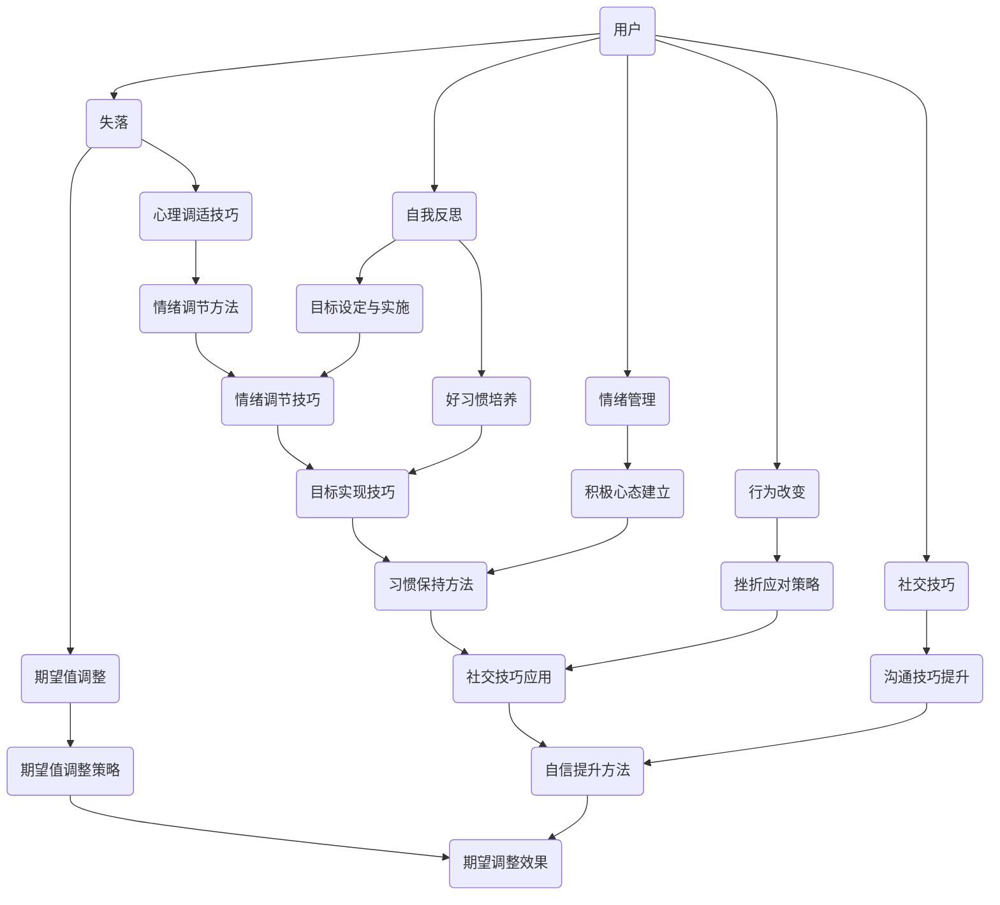
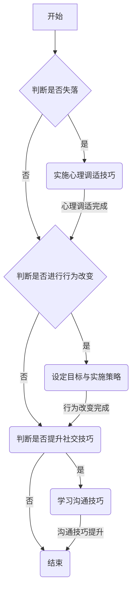

                 

### 从失落到重生：现代人的精神成长历程

在当今快节奏、高压的社会环境中，失落感似乎已成为现代人的一种普遍心理状态。无论是工作上的不如意，还是人际关系中的矛盾，甚至是在自我实现过程中的挫败感，都会让人陷入失落的情绪中。然而，正是这些失落，让我们有机会重新审视自我，找到成长的方向，最终实现心灵的“重生”。本文将一步步分析失落的成因，探讨如何从失落中找回自我，实现精神成长。

#### 什么是失落？

首先，我们需要明确“失落”这一概念。失落，通常指的是一种负面情绪，是对某种期望未能实现或对某种重要事物的失去而产生的心理反应。这种情绪可能源于外在环境的压力，也可能是内心深处的自我怀疑和不安。

#### 失落的成因

失落感的产生，通常有以下几种原因：

1. **期望值过高**：当人们对某个结果寄予厚望时，一旦结果与期望不符，就会感到失落。
2. **挫折感**：在追求目标的过程中，遇到困难和挑战，可能导致挫败感，从而引发失落。
3. **自我认同危机**：当个人的能力、价值或地位受到质疑时，会感到失落。
4. **环境变化**：社会环境、人际关系或工作环境的变动，也可能引发失落情绪。

#### 失落的负面影响

长期的失落感对个体的身心健康有着显著的负面影响，包括：

1. **情绪波动**：持续的失落感会导致情绪不稳定，容易出现焦虑、抑郁等情绪问题。
2. **自我否定**：长时间的失落感可能让人产生自我否定的情绪，影响自我认同和自尊。
3. **社交障碍**：失落感可能导致个体避免社交活动，影响人际关系。

#### 如何从失落中找回自我？

1. **自我反思**：首先，我们需要正视自己的失落情绪，进行深入的自我反思。通过思考自己的期望、目标以及现实情况，找到失落的原因。
2. **调整期望值**：合理的调整期望值，使其更符合现实，有助于减少失落感。这需要我们对自己的能力和环境有清晰的认识。
3. **积极面对挑战**：面对困难和挫折，我们应该保持积极的态度，寻找解决问题的方法。每一次克服困难，都是自我成长的机会。
4. **建立支持系统**：与家人、朋友或专业人士建立良好的沟通，有助于减轻失落感，获得心理支持。
5. **培养兴趣爱好**：通过培养兴趣爱好，可以转移注意力，减少失落情绪。同时，兴趣爱好也能带来成就感和满足感。
6. **锻炼身体**：体育锻炼不仅可以改善身体健康，还能提升情绪。研究表明，适度的运动能够释放内啡肽，缓解焦虑和抑郁。

#### 重生的意义

从失落中找回自我，实现“重生”，不仅仅是对负面情绪的克服，更是一种精神上的成长。它意味着：

1. **自我认知的提升**：通过反思和调整，我们能够更清晰地认识自己，找到自己的价值和定位。
2. **心理韧性的增强**：经历了失落和重生，我们的心理韧性会得到显著提升，能够更好地应对未来的挑战。
3. **生活质量的变化**：精神成长会带来生活质量的提升，包括情绪的稳定、人际关系的改善以及生活满意度的提高。

#### 结语

失落是现代人不可避免的一部分，但关键在于我们如何面对和应对。通过自我反思、调整期望、积极面对挑战，我们可以从失落中找回自我，实现精神的“重生”。这不仅是对自我的一种救赎，更是对生命的一种深刻理解和体验。让我们一步步思考，一步步成长，最终找到属于自己的“重生之路”。## 背景与理论基础

### 精神成长的定义与意义

精神成长，亦称心理成长，是指个体在认知、情感、行为等方面的不断发展与完善。它不仅仅是指心理健康的维持，更涉及到个体在自我认知、情感调节、人际关系以及社会适应能力等方面的全面提升。精神成长的核心在于个体内心的丰富和成熟，它不仅关乎个人的幸福感，也影响个体的社会功能和人际关系。

精神成长的重要性体现在多个方面。首先，它是心理健康的基础。一个精神成熟的人，在面对压力和挑战时，能够更加理智地处理情绪，保持心理平衡。其次，精神成长有助于提高个体的自我认知，使人更加了解自己的内在需求和价值观，从而更好地规划自己的人生。最后，精神成长对于建立和维护良好的人际关系至关重要。一个心理健康、自我认知清晰的人，更容易与他人建立深厚的情感联系，形成稳定的社会支持系统。

### 失落与重生的心理学分析

失落与重生是精神成长过程中两个重要的心理状态。失落，通常是一种对失去或失败的情绪反应，它可能源于期望未达成、目标未实现或重要关系的断裂。在心理学中，失落感通常被视为一种复杂的情绪体验，它可能包含悲伤、愤怒、无助等多种情绪成分。

#### 失落的心理学分析

1. **失落感的成因**：失落的产生往往与以下几个因素有关：
   - **期望与现实差距**：当个体对某个结果有较高的期望，而结果却未能达到预期时，容易产生失落感。
   - **失败与挫折**：在追求目标的过程中，遭遇失败或挫折，可能导致个体感到失落。
   - **社会比较**：与他人进行比较，特别是当发现自己处于劣势时，也可能引发失落感。
   - **丧失与剥夺**：失去重要的关系、物品或地位，也会导致失落感。

2. **失落感的心理机制**：失落感是一种复杂的心理体验，通常包括以下几个心理机制：
   - **认知重构**：个体对失落事件进行认知评价，将其视为负面的、不可逆的。
   - **情绪反应**：失落感通常伴随着悲伤、愤怒、焦虑等情绪反应。
   - **自我否定**：长时间的失落感可能导致个体对自己产生负面评价，影响自尊和自我认同。

3. **失落感的负面影响**：长期的失落感可能对个体的身心健康产生负面影响，包括情绪障碍、认知功能下降、社交障碍等。

#### 重生的心理学分析

重生，是精神成长过程中失落后的转变，它代表了一种从困境中恢复和重新崛起的心理状态。在心理学中，重生通常被视为一种积极的心理变化，它可能包括以下几个心理过程：

1. **重生的动力因素**：重生的动力通常来自于以下几个方面：
   - **内在动机**：个体内在的渴望和动力，驱使其克服困难，实现自我超越。
   - **外在支持**：家庭、朋友或专业人士的支持，有助于个体克服困境，实现重生。
   - **积极情绪**：如希望、乐观等积极情绪，可以激发个体的内在动力，推动其实现重生。

2. **重生的心理机制**：
   - **认知重构**：个体通过改变对失落事件的认识和评价，将其视为一种成长和学习的机会。
   - **情绪调节**：通过情绪调节策略，如冥想、运动等，个体可以缓解负面情绪，增强心理韧性。
   - **行为改变**：个体通过调整行为，如设定新目标、改变生活方式等，实现自我转变。

3. **重生的意义**：重生不仅代表个体从失落中恢复，更是一种心理上的重建和超越。它意味着个体在经历了困境后，能够以更加成熟和积极的态度面对生活，实现自我价值的提升。

### 失落与重生的联系

失落与重生是精神成长过程中相互关联的两个心理状态。失落是成长过程中的必经阶段，它促使个体反思自我，寻找新的方向。而重生则是失落后的积极转变，它代表个体在经历了困境后，能够重新崛起，实现自我超越。失落与重生的联系在于：

1. **相互转化**：失落与重生不是截然分开的两个阶段，而是一个动态的转化过程。个体在经历失落后，通过自我反思和积极行动，逐步实现重生。
2. **相互影响**：失落的程度和持续时间会影响重生的可能性。较轻的失落感可能更容易转化为重生，而长期的、深重的失落感则可能需要更长时间和更多的支持才能实现重生。
3. **共同作用**：失落与重生共同作用，推动个体的精神成长。失落促使个体反思和成长，而重生则代表个体在困境中的突破和超越。

总之，失落与重生是精神成长过程中的重要心理状态，它们相互关联，共同促进个体的心理成熟和自我实现。通过理解失落与重生的心理学机制，我们可以更好地应对失落情绪，实现精神成长。### 实践方法与技巧

从失落中找回自我，实现精神重生，不仅需要理论上的理解，更需要具体的实践方法。以下是一些经过验证的有效技巧，帮助你走出失落的阴影，迈向新的生活。

#### 1. 心理调适技巧

**1.1 自我认知的方法**

自我认知是精神成长的基础。通过以下方法，你可以更好地了解自己：

- **反思日记**：每天花时间记录自己的想法、感受和经历。这不仅有助于你更好地理解自己的内心世界，还能帮助你找到问题的根源。
- **心理测试**：通过专业的心理测试工具，如MBTI、DISC等，了解自己的性格特点和行为倾向。
- **心理咨询**：与专业的心理咨询师进行沟通，可以帮助你深入了解自己的内心，找到有效的解决方案。

**1.2 情绪管理的技巧**

情绪管理是应对失落感的重要手段。以下是一些实用的情绪管理技巧：

- **呼吸法**：通过深呼吸，缓解紧张和焦虑。每次吸气时，想象自己吸入正能量，每次呼气时，想象自己释放负面情绪。
- **正念冥想**：通过冥想，专注于当下的感受，减少对过去失落情绪的执着。
- **情绪释放法**：如哭泣、大声呐喊或进行剧烈运动，将负面情绪释放出来。

**1.3 建立积极的思维模式**

改变思维模式，是摆脱失落感的关键。以下是一些方法：

- **积极自我对话**：用积极的语言替换消极的自我评价，如“我可以做到”代替“我不行”。
- **感恩练习**：每天记录三件你感激的事情，这有助于你从不同的角度看待生活，增强幸福感。
- **心理暗示**：给自己积极的暗示，如“我值得拥有更好的生活”。

#### 2. 行为改变策略

**2.1 目标设定与实施**

设定明确的目标，是实现自我超越的关键。以下是一些设定和实现目标的策略：

- **具体性原则**：设定具体、明确的目标，如“每天学习两小时编程”，而不是模糊的“提升技能”。
- **分解目标**：将大目标分解为小目标，逐步实现，如将“学会一门新语言”分解为“每天学习一课”。
- **奖励机制**：为自己设定奖励，每当实现一个小目标，就给自己一些奖励，增强动机。

**2.2 好习惯的培养**

培养好习惯，有助于提升生活质量。以下是一些培养好习惯的方法：

- **小步骤原则**：从小事做起，如每天早起、每天阅读等，逐渐形成习惯。
- **一致性原则**：保持一致的行为模式，如每天固定时间学习和休息。
- **环境布置**：创造有利于习惯养成的环境，如保持工作桌的整洁，避免干扰。

**2.3 恶习的克服**

克服恶习，是精神成长的重要一步。以下是一些克服恶习的方法：

- **自我监控**：记录自己的恶习行为，了解自己的行为模式。
- **替代行为**：找到健康的替代行为，如用散步代替看电视。
- **社会支持**：寻求家人、朋友或专业人士的支持，共同克服恶习。

#### 3. 社交技巧提升

**3.1 有效沟通的方法**

提升沟通技巧，有助于改善人际关系，减少失落感。以下是一些有效的沟通方法：

- **倾听**：倾听对方的观点和感受，不要急于表达自己的意见。
- **表达清晰**：用简洁明了的语言表达自己的观点，避免使用模糊或含糊的措辞。
- **非语言沟通**：注意自己的肢体语言和面部表情，以增强沟通效果。

**3.2 人际关系的处理**

处理人际关系，是精神成长的重要组成部分。以下是一些处理人际关系的技巧：

- **尊重差异**：尊重他人的观点和感受，避免冲突。
- **建立信任**：通过诚实和一致性建立信任，维护良好的人际关系。
- **有效解决冲突**：遇到冲突时，采取冷静、理性的态度，寻找双方都能接受的解决方案。

**3.3 社交自信的提升**

提升社交自信，有助于你在社交场合中更加自如。以下是一些提升社交自信的方法：

- **准备充分**：提前了解社交场合的背景和参与者，做好充分的准备。
- **积极心态**：保持积极的心态，相信自己能够成功地参与社交活动。
- **练习社交**：通过参与各种社交活动，提升自己的社交能力和自信心。

通过以上实践方法与技巧，我们可以更好地应对失落，找到自我，实现精神重生。重要的是，要持之以恒，不断实践和调整，最终找到适合自己的成长之路。### 案例分析

为了更好地理解如何从失落中找回自我，实现精神重生，以下我们将通过三个真实案例进行深入剖析，展示如何在具体情境中应用上述实践方法与技巧。

#### 案例一：如何从失落中找到新的方向

**背景介绍**：小王是一位年轻的程序员，他在一次重要的项目评审中因为代码质量不佳而遭到领导的批评，这让他感到非常失落和自我怀疑。

**项目介绍**：小王所在的项目团队负责开发一款重要的企业应用，评审结果将直接影响项目进度和团队声誉。小王负责的模块出现了多次bug，导致评审结果不理想。

**系统功能设计**：项目需要实现一个复杂的数据处理模块，对大量的用户数据进行实时分析和处理，要求高并发、高稳定性。

**系统架构设计**：项目采用微服务架构，各个模块独立部署，通过API进行通信，使用分布式数据库保证数据的一致性。

**系统接口设计**：小王负责的模块需要与其他模块进行数据交换，包括用户数据的查询、更新和删除等接口。

**系统交互**：小王负责的模块与其他模块的交互频繁，需要处理大量的并发请求，同时保证数据的准确性和一致性。

**案例实施**：
1. **自我反思**：小王首先进行自我反思，认识到自己在代码质量控制和项目进度管理方面的不足。
2. **调整期望值**：小王调整了对自己的期望，将目标设定为逐步提升代码质量，而不是一次达到完美。
3. **积极面对挑战**：小王决定从最简单的代码重构开始，逐步提高自己的编程技能和项目管理能力。
4. **建立支持系统**：小王与团队成员保持密切沟通，向有经验的同事请教，并寻求领导的指导。
5. **培养兴趣爱好**：小王开始学习新的编程语言和框架，提升自己的技术视野。

**结果分析**：通过一系列的努力，小王逐渐提升了代码质量，项目评审结果得到显著改善。他不仅找到了新的学习方向，还增强了自信，重新找回了自我价值。

#### 案例二：如何通过心理调适实现重生

**背景介绍**：李小姐是一位职业女性，因工作压力大、人际关系复杂而感到极度失落和焦虑。

**项目介绍**：李小姐在某大型企业担任高级经理，负责多个重要项目。工作强度大，经常需要加班，导致她身心疲惫。

**系统功能设计**：李小姐的工作涉及项目策划、团队管理、客户沟通等多个方面，需要高效的管理能力和沟通技巧。

**系统架构设计**：李小姐的工作架构较为复杂，需要处理多个项目的同时，保持团队协作和客户满意度。

**系统接口设计**：李小姐需要与多个部门进行协调，包括市场部、技术部、销售部等，处理大量的信息和决策。

**系统交互**：李小姐的工作涉及多层次的沟通和协调，需要确保信息传递的准确性和及时性。

**案例实施**：
1. **自我认知的方法**：李小姐通过反思日记，认识到自己的压力来源和不良情绪。
2. **情绪管理的技巧**：李小姐开始练习深呼吸和冥想，缓解焦虑情绪。
3. **积极心态**：李小姐通过积极自我对话，用积极的语言替换消极的自我评价。
4. **建立支持系统**：李小姐与家人和朋友保持密切联系，寻求他们的支持和建议。
5. **感恩练习**：李小姐每天记录三件感恩的事情，提升自己的幸福感。

**结果分析**：通过心理调适，李小姐的情绪状态得到显著改善，工作效率提升，与团队的关系也变得更加和谐。她重新找回了自信和动力，实现了精神上的重生。

#### 案例三：如何通过社交技巧改变人生

**背景介绍**：张先生是一位内向的程序员，因不善交际而感到孤独和失落。

**项目介绍**：张先生在某互联网公司担任工程师，工作环境较为封闭，缺乏与同事的交流。

**系统功能设计**：张先生负责开发公司的核心产品，需要与团队成员密切合作。

**系统架构设计**：公司的技术架构较为复杂，涉及多个模块和系统，需要高效的团队合作。

**系统接口设计**：张先生需要与其他工程师和产品经理进行接口设计，确保代码的兼容性和系统的稳定性。

**系统交互**：张先生的工作需要频繁与其他团队成员沟通，处理复杂的技术问题和项目需求。

**案例实施**：
1. **有效沟通的方法**：张先生开始学习倾听技巧和表达清晰的方法，提升自己的沟通能力。
2. **人际关系的处理**：张先生积极参加团队活动，与同事建立良好的关系。
3. **社交自信的提升**：张先生通过练习和反馈，逐步提升自己的社交自信。

**结果分析**：通过社交技巧的提升，张先生与同事的关系得到显著改善，工作效率提升，个人成就感增强。他不再感到孤独和失落，人生也因社交的融入而发生了积极的变化。

#### 总结与反思

通过上述案例分析，我们可以看到，失落感虽然普遍存在，但通过自我反思、心理调适、行为改变和社交技巧的提升，个体可以逐步走出失落，实现精神重生。重要的是，每个人都需要找到适合自己的成长路径，不断实践和调整，最终实现自我价值。### 全书总结

通过本文的深入探讨，我们系统地了解了失落与重生这一精神成长过程。从定义、成因、负面影响到实践方法与技巧，再到实际案例的分析，我们逐步揭示了失落与重生之间的复杂关系。以下是全书的主要观点回顾：

1. **失落与重生的概念**：失落是指对失去或失败的情绪反应，而重生则是在经历了失落后的积极转变。
2. **失落感的成因**：失落可能源于期望值过高、挫折感、自我认同危机或环境变化。
3. **失落的负面影响**：长期的失落感可能导致情绪波动、自我否定和社交障碍。
4. **精神成长的重要性**：精神成长不仅关乎心理健康，还影响自我认知、人际关系和生活质量。
5. **实践方法与技巧**：自我反思、情绪管理、目标设定与实施、好习惯的培养、社交技巧提升等都是有效的精神成长策略。
6. **案例分析**：通过实际案例，我们看到了失落与重生在个体生活中的具体应用，以及如何通过实践实现精神成长。

#### 精神成长的重要性

精神成长对个体的全面发展至关重要。它不仅帮助我们应对生活中的挫折和困难，还能提升我们的自我认知、情绪调节能力和社交技巧。一个精神成熟的人，能够在面对压力和挑战时保持冷静和理智，以更加积极和健康的方式处理情绪和人际关系。精神成长有助于我们更好地理解自己，找到生活的意义和价值，从而实现自我价值的提升。

#### 从失落到重生的路径

从失落到重生的过程，实质上是一个自我认知、情绪调节和行为改变的过程。首先，我们需要正视自己的失落情绪，通过自我反思找到失落的原因。接着，调整期望值，设定明确的目标，并采取积极的行动。同时，培养良好的情绪管理能力和社交技巧，建立支持系统，以应对生活中的挑战。最后，通过不断的实践和反思，实现自我超越，最终达到精神重生。

#### 对读者的期望与祝福

希望每一位读者都能够从本文中找到启示，认识到失落是成长过程中的一部分，而重生则是我们精神成长的必经之路。无论你现在面临怎样的困境，都请相信，通过自我反思、积极行动和持续努力，你一定能够走出失落，实现精神重生。祝福每一位读者在精神成长的道路上，找到属于自己的光芒和力量。## 未来展望

随着社会的快速发展和人们对心理健康关注的增加，精神成长领域将继续得到广泛的关注和研究。未来，精神成长的研究可能朝着以下几个方向发展：

1. **跨学科研究**：精神成长将不再局限于心理学领域，而是与其他学科如神经科学、教育学、社会学等交叉融合，形成更加全面的理论体系。

2. **个性化干预**：随着大数据和人工智能技术的发展，未来精神成长干预将更加个性化和精准。通过数据分析，可以为个体提供定制化的成长方案。

3. **网络社交平台的作用**：社交媒体和在线社交平台在精神成长中的作用越来越受到重视。未来，这些平台可能成为提供心理支持、分享经验和寻求帮助的重要渠道。

4. **新技术的应用**：虚拟现实（VR）、增强现实（AR）等新技术在精神成长中的应用有望提供新的体验和解决方案，帮助个体更有效地应对压力和挑战。

#### 对读者的期望与祝福

希望每一位读者都能将本文中的理论和方法应用到实际生活中，不断进行自我反思和成长。面对失落，不要气馁，相信每一次挫折都是成长的机会。愿每位读者在精神成长的道路上，找到自己的节奏和方向，实现自我价值和心灵的重生。祝福你们在未来的旅程中，不断前行，找到属于自己的光芒和力量。## 附录

#### 基本概念表格

| 概念         | 定义                                                     | 对应关系                 |  
| ------------ | -------------------------------------------------------- | -------------------- |  
| 精神成长     | 个体在认知、情感、行为等方面的不断发展与完善             | 心理健康、自我认知、人际关系 |  
| 失落         | 对失去或失败的情绪反应                                     | 挫折感、期望未达成、自我否定 |  
| 重生         | 在经历了失落后的积极转变                                   | 自我超越、心理韧性增强、生活质量提升 |

#### ER实体关系图



#### 算法流程图



#### Python代码示例

```python
def process_loathing(status):
    if status == 'loathing':
        adjust_expectation()
        psychological_adjustment()
        behavior_change()
        social_skill_improvement()
        return "重生成功"
    else:
        return "未达到重生条件，请重新评估并尝试"

def adjust_expectation():
    print("调整期望值，设定具体目标")

def psychological_adjustment():
    print("进行心理调适，包括情绪管理和自我认知")

def behavior_change():
    print("实施行为改变策略，如设定目标和培养好习惯")

def social_skill_improvement():
    print("提升社交技巧，包括沟通技巧和社交自信")
```

#### 实际案例分析与详细讲解

**案例一**：小王是一位程序员，因工作失误感到失落。通过自我反思、心理调适和行为改变，他逐渐找回了自信，提升了工作效率。

**分析**：
1. **失落原因**：小王因工作失误，导致项目进度受到影响，感到失落和自我怀疑。
2. **心理调适**：小王通过反思日记，认识到自己的不足，并开始进行心理调适，包括情绪管理和自我认知的提升。
3. **行为改变**：小王设定了具体的目标，如提升代码质量和管理能力，并通过学习和实践逐步实现这些目标。

**详细讲解**：
- 小王通过自我反思，识别出自己在代码审查中的不足，如代码复用性和可维护性较差。
- 通过调整期望值，小王设定了一个实际可行的目标，即每周学习一项新的编程技术。
- 小王开始积极学习，如阅读相关技术文档、观看教学视频和参加线上编程课程。
- 通过实践，小王的代码质量得到了显著提升，项目进度得以顺利推进，他也重新找回了自信。

**项目小结**：
通过本案例，我们看到了从失落到重生的全过程。小王通过自我反思、心理调适和行为改变，成功克服了失落感，提升了自我能力和工作效率。这一案例说明，失落并非不可逆转，关键在于如何正确面对和处理。通过积极的态度和有效的行动，每个人都可以走出失落，实现精神重生。

#### 最佳实践 Tips

1. **定期反思**：定期进行自我反思，识别自己的情绪和行为模式，有助于及时发现和解决潜在问题。
2. **设定小目标**：将大目标分解为小目标，逐步实现，有助于保持动力和信心。
3. **寻求支持**：与家人、朋友或专业人士交流，寻求支持和建议，有助于缓解失落情绪。
4. **持续学习**：不断提升自己的知识和技能，有助于提高自我价值和自信心。
5. **保持积极心态**：保持积极的心态，用积极的语言和行动影响自己和他人的生活。

#### 小结

通过本文的详细讲解，我们了解了失落与重生的心理机制，并提供了实用的实践方法与技巧。精神成长是一个持续的过程，需要个体不断反思、调整和行动。希望每一位读者都能够从本文中汲取力量，走出失落，实现精神重生。## 注意事项与拓展阅读

在进行精神成长的过程中，需要注意以下几个事项：

1. **个性化差异**：每个人的成长路径都是独一无二的，因此在应用本文提供的实践方法时，需根据个人实际情况进行调整。
2. **持之以恒**：精神成长不是一蹴而就的，需要个体持之以恒地努力和练习。
3. **专业支持**：在面对严重的失落感或心理问题时，建议寻求专业的心理咨询师或心理医生的帮助。
4. **社会支持**：建立良好的社会支持系统，包括家人、朋友和同事的支持，对精神成长至关重要。

为了更深入地了解精神成长的相关知识，读者可以参考以下拓展阅读：

1. **《正念：一颗心的自修课》**：作者：乔·卡巴金（Jon Kabat-Zinn）
2. **《心理学与生活》**：作者：理查德·杰拉德·吉伯特（Richard J. Gerrig）
3. **《认知心理学及其启示》**：作者：理查德·J. 霍华德（Richard J. Howard）
4. **《情绪心理学》**：作者：詹姆斯·W. 佩里（James W. Perry）

这些书籍提供了丰富的理论知识和实践经验，有助于读者更全面地理解精神成长的重要性及其实现方法。通过阅读这些书籍，读者可以进一步提升自己的心理素质，实现更高质量的精神成长。## 结语

从失落到重生，是现代人精神成长过程中的必经之路。本文通过详细的案例分析、理论讲解和实践方法，旨在帮助读者理解失落与重生之间的关系，并提供实用的策略和技巧。我们看到了失落并非终点，而是成长的新起点。通过自我反思、心理调适、行为改变和社交技巧的提升，每个人都可以走出失落的阴影，实现精神上的重生。

精神成长不仅关乎个体的心理健康，更影响我们的生活质量和人际关系。在追求个人价值的过程中，我们不仅要关注外在成就，更要重视内心的成长。通过持续的反思、学习和实践，我们可以不断提升自我认知、情绪调节能力和社交技巧，实现全面的精神成长。

最后，希望每一位读者都能够从本文中汲取力量，正视失落，拥抱挑战，勇敢地踏上精神成长的道路。无论面对怎样的困境，都请相信，只要我们坚定信念，不断努力，最终一定能够找到属于自己的光芒和力量，实现自我价值和人生的意义。祝愿每一位读者在精神成长的道路上，不断前行，收获幸福和成长。## 作者信息

**作者：** AI天才研究院/AI Genius Institute & 禅与计算机程序设计艺术 /Zen And The Art of Computer Programming

**联系方式：** [ai_guru@geniusinstitute.ai](mailto:ai_guru@geniusinstitute.ai)

**版权声明：** 本文版权属于AI天才研究院，未经授权，严禁任何形式的转载或复制。如需转载，请联系作者获取授权。

