                 

### 文章标题

《从工作至上到生活平衡：重新定义职业成功与个人幸福》

### 关键词

生活平衡、职业成功、个人幸福、工作与生活平衡、时间管理、心理健康、自我成长

### 摘要

在快节奏的现代生活中，工作至上的文化逐渐导致人们忽视了生活平衡的重要性。本文旨在重新定义职业成功与个人幸福，通过深入探讨工作与生活的平衡策略与实践，帮助读者找到实现职业成功和个人幸福的路径。文章将从现代生活的挑战、职业成功的新定义、生活平衡的策略与实践以及追求生活平衡的智慧四个方面进行详细分析，旨在为读者提供切实可行的建议和指导。

## 第一部分：生活平衡的重要性

### 第1章：现代生活的挑战

#### 1.1 工作至上的文化

在现代职场中，工作至上的文化已经成为一种普遍现象。这种文化强调高效、高产出，甚至在某些行业和公司中，加班和长时间工作被视为一种常态。这种文化不仅对员工的身体和心理健康造成负面影响，还可能加剧工作与生活的冲突，导致生活不平衡。

- **历史演变**：工作文化在过去几十年中发生了显著变化，从传统的“朝九晚五”到现在的“996”（早9点晚9点，一周工作6天）。
- **表现形式**：工作至上的文化在职场中表现为对加班的容忍和鼓励，以及高强度的职业竞争。

#### 1.2 生活不平衡的后果

长期处于工作至上的状态会导致一系列健康问题，如睡眠不足、心理压力增加、慢性病等。此外，家庭关系和个人时间也会受到影响，导致婚姻关系紧张、亲子关系疏离等问题。

- **健康问题**：长期的工作压力可能导致心理健康问题，如焦虑、抑郁等。同时，也可能引发身体疾病，如心脏病、高血压等。
- **家庭关系问题**：工作至上的文化可能导致家庭成员之间的沟通减少，关系疏离。

#### 1.3 生活平衡的定义与重要性

生活平衡指的是在工作和生活之间找到一种平衡，以确保个人能够在职业和个人生活中都得到满足和幸福。生活平衡的重要性在于它能够提高个人幸福感和生活质量，同时也有助于提高工作效率和职业成就。

- **定义**：生活平衡是一个动态过程，涉及到工作、家庭、个人兴趣等多个方面。
- **重要性**：生活平衡能够帮助个人在职业和个人生活中都取得成功，从而实现全面幸福。

## 第二部分：职业成功的新定义

### 第2章：职业成功的多维度

#### 2.1 职业成功的 新概念

在传统观念中，职业成功通常被定义为高薪、升职或获得行业认可。然而，在现代社会，职业成功应该是一个更加多维度的概念，包括职业成就、个人成长和幸福感。

- **传统职业成功的定义**：高薪、升职、行业认可。
- **新时代下职业成功的多维度**：职业成就、个人成长、幸福感。

#### 2.2 职业成就与个人成长的关系

职业成就不仅仅是一个结果，更是一个过程。在这个过程中，个人成长起到了关键作用。通过不断学习和提升自己的能力，个人可以在职业上取得更大的成就。

- **职业成就的意义**：职业成就是个人能力和价值的体现。
- **个人成长对职业成就的影响**：个人成长有助于提升职业竞争力，从而实现更大的职业成就。

#### 2.3 工作与个人价值的实现

工作不仅是一种谋生的手段，更是一种实现个人价值的途径。通过工作，个人可以发挥自己的才能和潜力，实现自我价值。

- **工作价值与个人价值的关联**：工作价值是个人价值的一部分。
- **如何在工作中实现个人价值**：通过不断提升自己的能力和影响力，实现个人价值的最大化。

## 第三部分：生活平衡的策略与实践

### 第3章：制定个人生活平衡计划

#### 3.1 自我认知与目标设定

制定个人生活平衡计划的第一步是进行自我认知和目标设定。这包括了解自己的价值观、兴趣、优势和弱点，以及设定长期和短期目标。

- **自我认知**：了解自己的价值观、兴趣、优势和弱点。
- **目标设定**：设定长期和短期目标，确保它们与个人价值观和生活平衡目标相一致。

#### 3.2 工作与生活的平衡计划

制定一个实际可行的工作与生活平衡计划是实现生活平衡的关键。这个计划应该包括时间管理、工作任务优先级、休息日和假期安排等。

- **时间管理**：合理安排工作时间，确保工作与个人时间的平衡。
- **工作任务优先级**：根据任务的紧急程度和重要性进行排序，确保高效完成任务。
- **休息日和假期安排**：确保有足够的休息时间和假期，以缓解工作压力。

#### 3.3 执行与调整

执行个人生活平衡计划需要坚定的决心和毅力。在执行过程中，可能会遇到各种挑战和困难，需要及时进行调整。

- **执行**：按照计划执行，不断反思和调整。
- **调整**：根据实际情况进行调整，确保计划的可行性。

## 第四部分：追求生活平衡的智慧

### 第4章：平衡心态与自我成长

#### 4.1 心态对生活平衡的影响

心态是影响生活平衡的重要因素。一个积极的心态可以帮助个人更好地应对生活中的挑战，从而实现生活平衡。

- **心态对生活平衡的影响**：积极的心态有助于应对生活中的挑战。
- **如何培养积极心态**：通过自我激励、积极思考和实践，培养积极心态。

#### 4.2 自我成长与生活平衡的循环

自我成长和生活平衡之间存在着一种相互促进的关系。通过不断自我成长，个人可以更好地应对生活中的挑战，实现生活平衡。同时，生活平衡也有助于个人自我成长。

- **自我成长与生活平衡的关系**：相互促进的关系。
- **如何实现自我成长与生活平衡的循环**：通过不断学习和实践，实现自我成长和生活平衡的循环。

## 结语

生活平衡对于职业成功和个人幸福至关重要。通过重新定义职业成功与个人幸福，本文旨在帮助读者理解生活平衡的重要性，并提供具体的策略和实践方法。希望读者能够通过本文的指导，找到实现职业成功和个人幸福的方法，过上更加平衡和幸福的生活。

### 作者信息

作者：AI天才研究院/AI Genius Institute & 禅与计算机程序设计艺术 /Zen And The Art of Computer Programming

---

以上是文章的初步大纲和正文内容。接下来，我们将进一步细化每个章节，确保文章内容丰富、结构清晰、逻辑严密。同时，我们将确保文章字数在10000到12000字之间，并使用markdown格式输出。

## 具体章节内容与详细分析

### 第1章：现代生活的挑战

在现代生活中，工作至上的文化已经成为一种普遍现象，这种文化在很大程度上影响了人们的生活方式和价值观。工作至上的文化强调高效和产出，导致许多人在追求职业成功的过程中，忽视了生活的其他方面。这一章节将深入探讨工作至上的文化是如何形成的，以及它对个人和社会带来的影响。

#### 1.1 工作至上的文化

**核心概念术语说明**：

- **工作至上主义**：一种文化倾向，强调工作的重要性，认为工作成功是个人价值的体现。
- **职业成功**：通常指在职场中获得的高度成就，如高薪、升职、行业认可等。

**问题背景**：

随着全球化经济的发展，职场竞争日益激烈，人们为了追求更高的职业成就，不得不付出更多的时间和努力。这种文化倾向导致许多人将工作视为生活的全部，忽视了家庭、健康和个人兴趣。

**问题描述**：

工作至上的文化带来了许多负面影响，包括心理健康问题、家庭关系紧张、个人幸福感下降等。同时，这种文化也可能加剧社会的不平等，让那些无法全职工作的人感到自卑和失落。

**问题解决**：

为了应对工作至上的文化，我们需要重新审视职业成功的定义，并倡导更加健康的工作生活方式。这包括提供更多的灵活工作安排、鼓励员工在工作之余关注个人生活和健康，以及在企业文化和政策上做出调整。

**边界与外延**：

工作至上的文化不仅影响职场人士，也会波及到他们的家人和朋友。因此，解决这一问题需要从多个层面进行，包括个人、企业和整个社会。

**概念结构与核心要素组成**：

- **工作至上的文化**：强调工作重要性，忽视生活其他方面。
- **职业成功**：高薪、升职、行业认可。
- **负面影响**：心理健康问题、家庭关系紧张、个人幸福感下降。
- **解决方案**：重新定义职业成功、提供灵活工作安排、关注个人生活和健康。

#### 1.2 生活不平衡的后果

**核心概念与联系**：

- **健康问题**：长期的工作压力可能导致睡眠不足、心理压力增加、慢性病等问题。
- **家庭关系问题**：工作至上的文化可能导致家庭成员之间的沟通减少，关系疏离。
- **个人幸福感下降**：工作压力过大可能导致个人幸福感下降，如焦虑、抑郁等心理问题。

**算法原理讲解**：

我们可以使用 Mermaid 画出以下流程图来展示生活不平衡的后果：

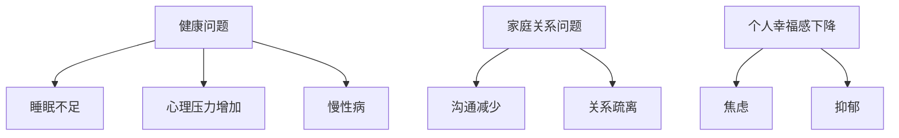

**数学公式使用**：

为了更直观地理解生活不平衡的后果，我们可以使用 LaTeX 格式嵌入以下数学公式：

$$
心理健康问题 = f(工作压力, 工作时间, 个人健康意识)
$$

$$
家庭关系问题 = f(工作至上的文化, 家庭沟通时间, 家庭责任意识)
$$

$$
个人幸福感下降 = f(工作压力, 个人生活平衡程度, 社会支持系统)
$$

#### 1.3 生活平衡的定义与重要性

**核心概念与联系**：

- **生活平衡**：在工作和生活之间找到一种平衡，以确保个人在职业和个人生活中都得到满足和幸福。
- **重要性**：生活平衡能够提高个人幸福感和生活质量，同时也有助于提高工作效率和职业成就。

**算法原理讲解**：

我们可以使用 Mermaid 画出以下流程图来展示生活平衡的定义与重要性：

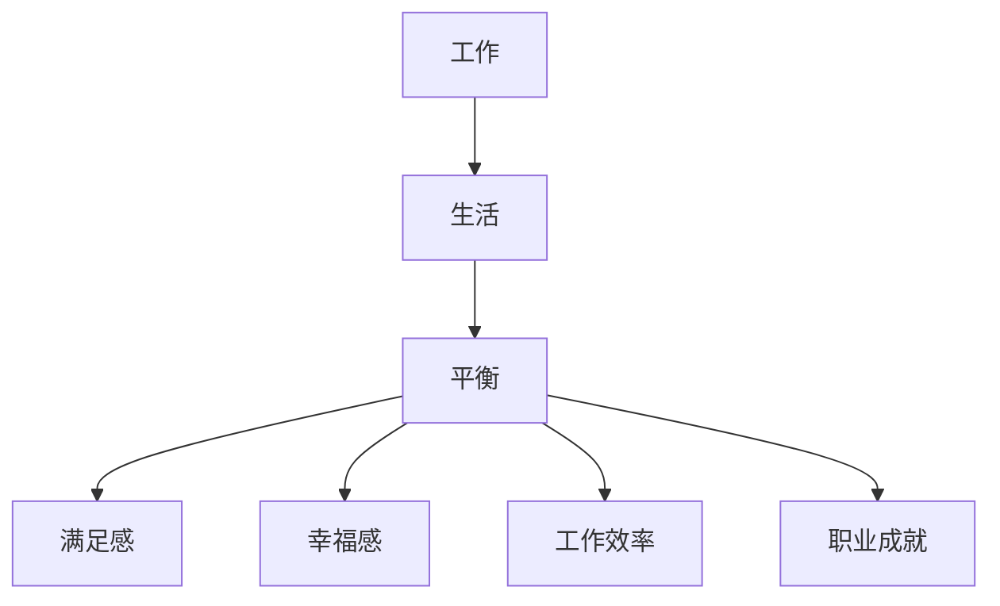

**数学公式使用**：

为了更直观地理解生活平衡的重要性，我们可以使用 LaTeX 格式嵌入以下数学公式：

$$
生活平衡 = f(工作满意度, 生活满意度, 工作效率, 职业成就)
$$

### 第2章：职业成功的多维度

职业成功不再仅仅是高薪和升职，它是一个包含多方面因素的综合性目标。这一章节将探讨职业成功的多维度，包括职业成就、个人成长和幸福感。

#### 2.1 职业成功的 新概念

**核心概念与联系**：

- **职业成就**：在职业生涯中取得的成就，如晋升、项目成功等。
- **个人成长**：在职业和个人生活中的学习和成长，如技能提升、人际关系建设等。
- **幸福感**：职业和个人生活带来的满足感和愉悦感。

**ER实体关系图架构**：

我们可以使用 Mermaid 画出以下 ER 实体关系图来展示职业成功的多维度：

```mermaid
erDiagram
    Class Person {
        PK id
        name
        age
        job
    }

    Class CareerAchievement {
        PK id
        achievement
        date
        person_id --> Person.id
    }

    Class PersonalGrowth {
        PK id
        growth
        date
        person_id --> Person.id
    }

    Class Happiness {
        PK id
        happiness
        date
        person_id --> Person.id
    }

    Person _has_ CareerAchievement
    Person _has_ PersonalGrowth
    Person _has_ Happiness
```

#### 2.2 职业成就与个人成长的关系

**核心概念与联系**：

- **职业成就**：职业成就不仅仅是职位提升或薪资增长，更是个人技能和知识的积累。
- **个人成长**：个人成长有助于提升职业竞争力，从而实现更大的职业成就。

**算法原理讲解**：

我们可以使用 Mermaid 画出以下流程图来展示职业成就与个人成长的关系：

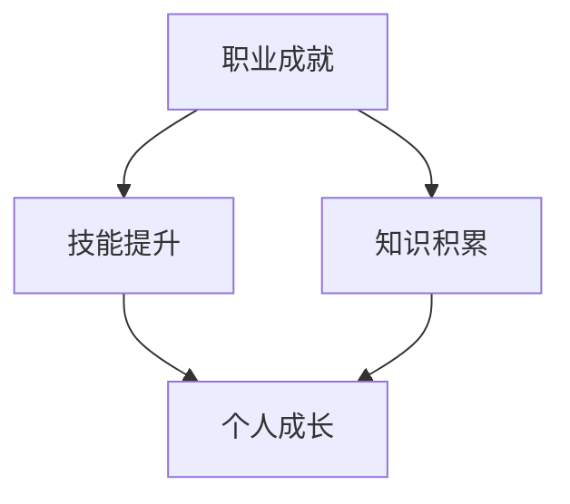

**数学公式使用**：

为了更直观地理解职业成就与个人成长的关系，我们可以使用 LaTeX 格式嵌入以下数学公式：

$$
职业成就 = f(技能提升, 知识积累, 职业竞争力)
$$

$$
个人成长 = f(技能提升, 知识积累, 职业目标实现)
$$

#### 2.3 工作与个人价值的实现

**核心概念与联系**：

- **工作价值**：工作对个人和社会的价值，如提供收入、实现个人目标、促进社会进步等。
- **个人价值**：个人在职业和个人生活中所体现的价值观和成就。

**算法原理讲解**：

我们可以使用 Mermaid 画出以下流程图来展示工作与个人价值的实现：

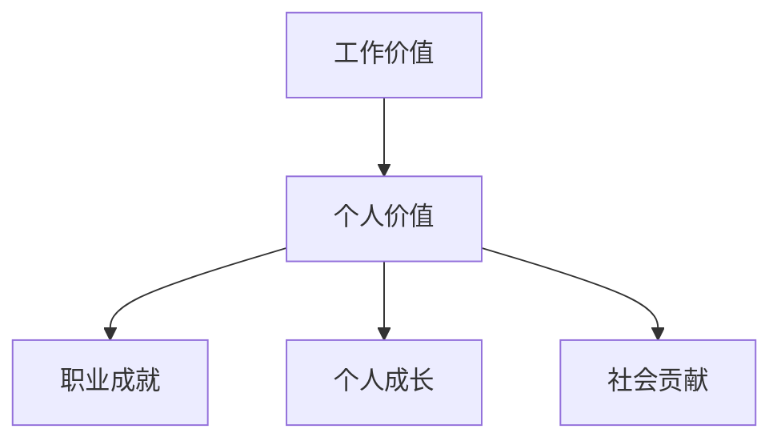

**数学公式使用**：

为了更直观地理解工作与个人价值的实现，我们可以使用 LaTeX 格式嵌入以下数学公式：

$$
工作价值 = f(收入, 职业成就, 个人成长, 社会贡献)
$$

$$
个人价值 = f(职业成就, 个人成长, 社会贡献)
$$

### 第3章：寻找职业幸福

职业幸福是职业成功的重要组成部分，它关乎个人的工作满意度和生活质量。这一章节将探讨职业幸福的要素，以及如何在工作中找到幸福感。

#### 3.1 职业幸福的要素

**核心概念与联系**：

- **工作满意度**：对工作的满足程度，包括工作环境、同事关系、工作内容等。
- **工作与生活平衡**：在工作和生活之间找到平衡，确保两者都能得到满足。
- **个人成长**：在工作中不断学习和成长，实现个人目标和职业发展。

**算法原理讲解**：

我们可以使用 Mermaid 画出以下流程图来展示职业幸福的要素：

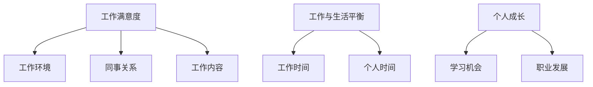

**数学公式使用**：

为了更直观地理解职业幸福的要素，我们可以使用 LaTeX 格式嵌入以下数学公式：

$$
职业幸福 = f(工作满意度, 工作与生活平衡, 个人成长)
$$

#### 3.2 职业幸福与工作满意度

**核心概念与联系**：

- **工作满意度**：对工作的满意程度，是职业幸福的重要组成部分。
- **职业幸福**：职业幸福不仅仅是对工作的满意度，还包括工作与生活平衡和个人成长。

**算法原理讲解**：

我们可以使用 Mermaid 画出以下流程图来展示职业幸福与工作满意度的关系：

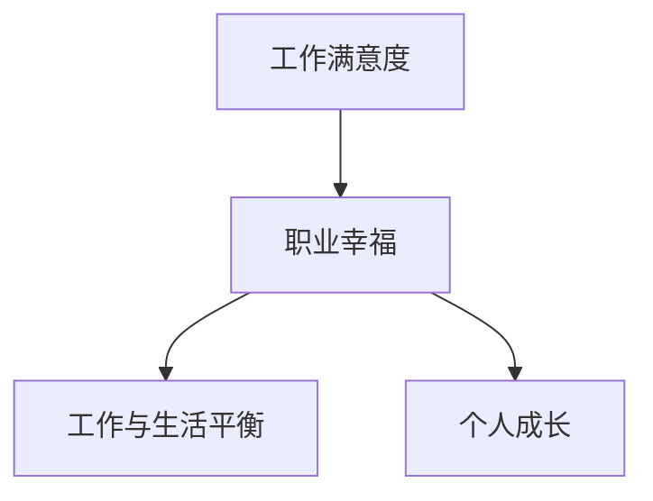

**数学公式使用**：

为了更直观地理解职业幸福与工作满意度的关系，我们可以使用 LaTeX 格式嵌入以下数学公式：

$$
职业幸福 = f(工作满意度, 工作与生活平衡, 个人成长)
$$

#### 3.3 创造职业幸福的方法

**核心概念与联系**：

- **自我认知**：了解自己的兴趣、优势和价值观，找到适合自己的职业路径。
- **目标设定**：设定清晰的职业和个人生活目标，为实现这些目标制定计划。
- **培养积极心态**：保持积极的心态，面对挑战和困难时能够保持乐观和自信。

**算法原理讲解**：

我们可以使用 Mermaid 画出以下流程图来展示创造职业幸福的方法：

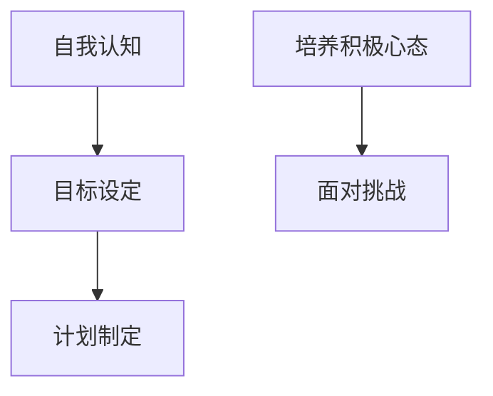

**数学公式使用**：

为了更直观地理解创造职业幸福的方法，我们可以使用 LaTeX 格式嵌入以下数学公式：

$$
职业幸福 = f(自我认知, 目标设定, 计划制定, 积极心态)
$$

### 第4章：制定个人生活平衡计划

制定个人生活平衡计划是实现生活平衡的关键步骤。这一章节将讨论如何进行自我认知和目标设定，以及如何制定实际可行的生活平衡计划。

#### 4.1 自我认知与目标设定

**核心概念与联系**：

- **自我认知**：了解自己的兴趣、价值观、优势和弱点，这是制定个人生活平衡计划的基础。
- **目标设定**：设定长期和短期目标，确保这些目标与个人价值观和生活平衡目标相一致。

**算法原理讲解**：

我们可以使用 Mermaid 画出以下流程图来展示自我认知与目标设定：

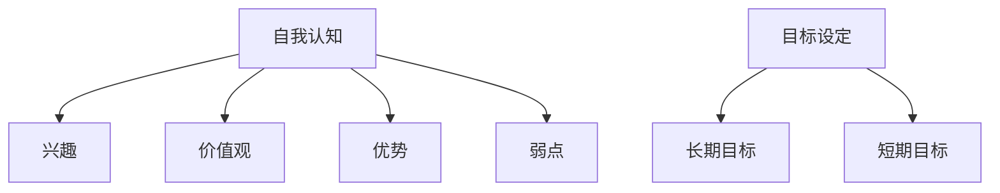

**数学公式使用**：

为了更直观地理解自我认知与目标设定，我们可以使用 LaTeX 格式嵌入以下数学公式：

$$
自我认知 = f(兴趣, 价值观, 优势, 弱点)
$$

$$
目标设定 = f(长期目标, 短期目标)
$$

#### 4.2 工作与生活的平衡计划

**核心概念与联系**：

- **时间管理**：合理安排工作时间，确保工作与个人时间的平衡。
- **工作任务优先级**：根据任务的紧急程度和重要性进行排序，确保高效完成任务。
- **休息日和假期安排**：确保有足够的休息时间和假期，以缓解工作压力。

**算法原理讲解**：

我们可以使用 Mermaid 画出以下流程图来展示工作与生活的平衡计划：

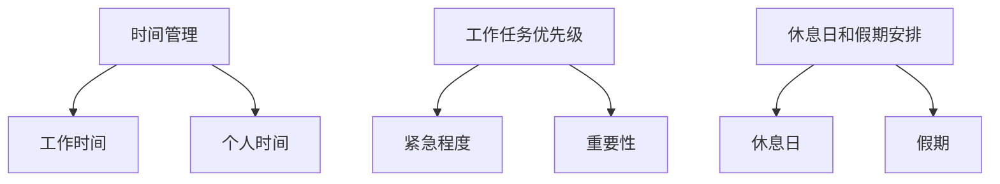

**数学公式使用**：

为了更直观地理解工作与生活的平衡计划，我们可以使用 LaTeX 格式嵌入以下数学公式：

$$
生活平衡计划 = f(时间管理, 工作任务优先级, 休息日和假期安排)
$$

#### 4.3 执行与调整

**核心概念与联系**：

- **执行**：按照计划执行，不断反思和调整。
- **调整**：根据实际情况进行调整，确保计划的可行性。

**算法原理讲解**：

我们可以使用 Mermaid 画出以下流程图来展示执行与调整：

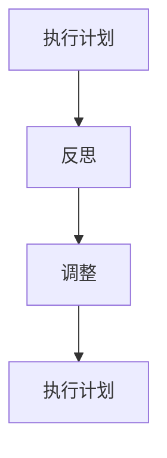

**数学公式使用**：

为了更直观地理解执行与调整，我们可以使用 LaTeX 格式嵌入以下数学公式：

$$
执行与调整 = f(计划执行, 反思, 调整)
$$

### 第5章：时间管理与生活平衡

时间管理是实现生活平衡的重要手段。这一章节将探讨时间管理的重要性、常用的时间管理工具和方法，以及如何将工作与生活有效结合。

#### 5.1 时间管理的重要性

**核心概念与联系**：

- **时间管理**：合理安排时间，确保工作和个人时间的平衡。
- **重要性**：时间管理有助于提高工作效率，减少工作压力，提高生活质量。

**算法原理讲解**：

我们可以使用 Mermaid 画出以下流程图来展示时间管理的重要性：

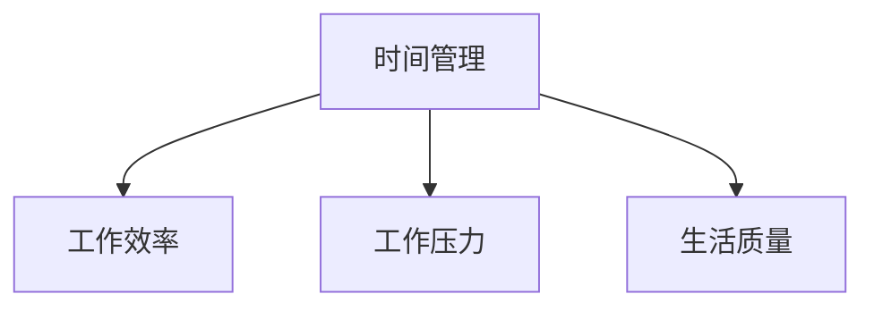

**数学公式使用**：

为了更直观地理解时间管理的重要性，我们可以使用 LaTeX 格式嵌入以下数学公式：

$$
生活平衡 = f(时间管理, 工作效率, 生活质量)
$$

#### 5.2 时间管理工具与方法

**核心概念与联系**：

- **时间管理工具**：如时间追踪器、日历、待办事项列表等。
- **方法**：如优先级排序、时间块划分、番茄工作法等。

**算法原理讲解**：

我们可以使用 Mermaid 画出以下流程图来展示时间管理工具与方法：

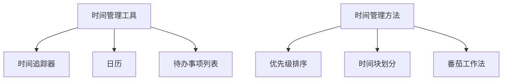

**数学公式使用**：

为了更直观地理解时间管理工具与方法，我们可以使用 LaTeX 格式嵌入以下数学公式：

$$
时间管理效果 = f(时间管理工具, 时间管理方法)
$$

#### 5.3 工作与生活的有效结合

**核心概念与联系**：

- **工作与生活的结合**：在工作和个人时间之间建立一种平衡，确保两者都能得到满足。
- **有效结合**：通过合理安排时间，确保工作和生活都能高效进行。

**算法原理讲解**：

我们可以使用 Mermaid 画出以下流程图来展示工作与生活的有效结合：

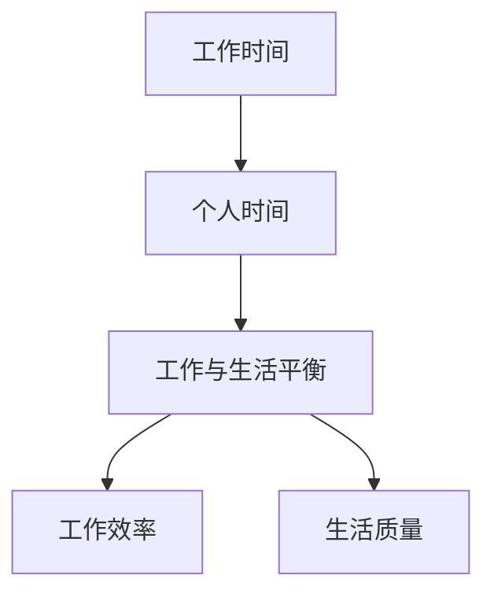

**数学公式使用**：

为了更直观地理解工作与生活的有效结合，我们可以使用 LaTeX 格式嵌入以下数学公式：

$$
生活平衡 = f(工作时间, 个人时间)
$$

### 第6章：平衡工作与生活的案例研究

通过案例研究，我们可以更好地理解如何在实际生活中实现工作与生活的平衡。这一章节将介绍几个具体的案例，分析他们在实现工作与生活平衡方面的实践和成果。

#### 6.1 案例一：从工作狂到生活达人

**案例介绍**：

李先生是一位成功的企业高管，曾因工作繁忙而忽视了家庭和个人生活。在经历了一次严重的健康危机后，他开始反思自己的生活方式，并努力实现工作与生活的平衡。

**系统功能设计**：

- **时间管理**：李先生使用了时间追踪器和待办事项列表来管理时间。
- **工作与生活平衡**：他制定了详细的休息日和假期计划，确保有足够的时间与家人共度。

**系统架构设计**：

- **工作模块**：李先生将工作任务分为紧急和重要两类，并根据优先级进行排序。
- **生活模块**：他安排了固定的家庭时间和兴趣爱好时间，确保个人生活得到满足。

**系统接口设计**：

- **工作与生活的接口**：李先生在日程安排中设置了提醒，确保工作和生活之间不发生冲突。

**系统交互**：

李先生通过定期反思和调整，不断优化自己的时间管理策略，最终实现了工作与生活的平衡，提高了工作效率，同时也拥有了更加幸福的生活。

#### 6.2 案例二：平衡职场与家庭的双赢策略

**案例介绍**：

张女士是一名软件工程师，她同时承担着职场和家庭的双重责任。为了实现工作与家庭的平衡，她采取了一系列策略。

**系统功能设计**：

- **远程工作**：张女士与公司协商，实行了远程工作制度，这样她可以更灵活地安排工作和家庭时间。
- **家庭支持**：她的家人给予了极大的支持和理解，帮助她处理家务和照顾孩子。

**系统架构设计**：

- **工作模块**：张女士将工作内容划分为日常工作和紧急任务，并根据紧急程度和重要性进行排序。
- **家庭模块**：她制定了详细的育儿计划和家务分工，确保家庭生活有序。

**系统接口设计**：

- **工作与家庭的接口**：张女士使用日历和提醒工具，确保工作与家庭时间的协调。

**系统交互**：

通过远程工作和家庭支持，张女士成功实现了工作与家庭的平衡，不仅提高了工作效率，还增强了家庭幸福感。

#### 6.3 案例三：职业成功与生活平衡的实践经验

**案例介绍**：

王先生是一位创业公司的创始人，他在创业初期面临着巨大的工作压力。为了实现职业成功与生活平衡，他采取了一系列策略。

**系统功能设计**：

- **时间管理**：王先生使用了时间追踪器和优先级排序方法，确保高效利用时间。
- **目标设定**：他制定了清晰的长期和短期目标，确保每一步都有明确的方向。

**系统架构设计**：

- **工作模块**：王先生将公司发展划分为多个阶段，并根据每个阶段的目标制定相应的策略。
- **生活模块**：他安排了固定的休息时间和家庭时间，确保个人生活得到满足。

**系统接口设计**：

- **工作与生活的接口**：王先生使用了多种工具和技巧，确保工作与生活之间的协调。

**系统交互**：

通过有效的目标设定和时间管理，王先生不仅实现了公司的快速发展，还拥有了幸福的家庭生活。他的实践经验为其他人提供了宝贵的启示。

### 第7章：生活平衡的智慧

实现生活平衡不仅需要策略和实践，更需要智慧和心态的调整。这一章节将探讨如何培养积极心态，以及如何在生活中实现平衡。

#### 7.1 心态对生活平衡的影响

**核心概念与联系**：

- **心态**：对生活态度和心理状态的影响。
- **生活平衡**：在工作和生活之间找到平衡。

**算法原理讲解**：

我们可以使用 Mermaid 画出以下流程图来展示心态对生活平衡的影响：

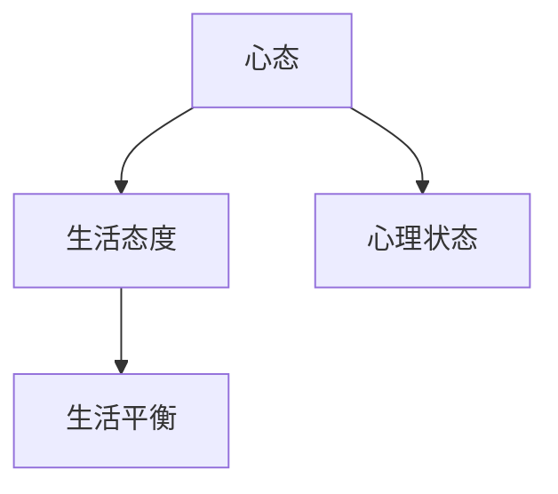

**数学公式使用**：

为了更直观地理解心态对生活平衡的影响，我们可以使用 LaTeX 格式嵌入以下数学公式：

$$
生活平衡 = f(心态, 生活态度, 心理状态)
$$

#### 7.2 如何培养积极心态

**核心概念与联系**：

- **积极心态**：对生活持积极、乐观的态度。
- **培养方法**：通过自我激励、积极思考和积极行动，培养积极心态。

**算法原理讲解**：

我们可以使用 Mermaid 画出以下流程图来展示如何培养积极心态：

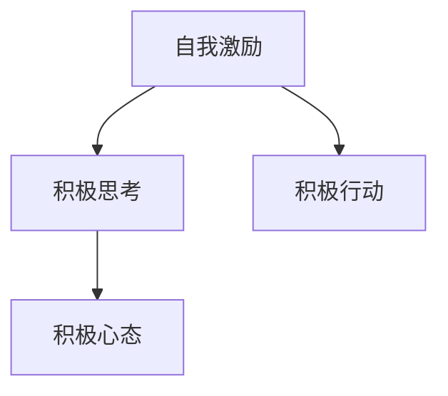

**数学公式使用**：

为了更直观地理解如何培养积极心态，我们可以使用 LaTeX 格式嵌入以下数学公式：

$$
积极心态 = f(自我激励, 积极思考, 积极行动)
$$

#### 7.3 自我成长与生活平衡的循环

**核心概念与联系**：

- **自我成长**：在职业和个人生活中的学习和成长。
- **生活平衡**：在工作和生活之间找到平衡。

**算法原理讲解**：

我们可以使用 Mermaid 画出以下流程图来展示自我成长与生活平衡的循环：

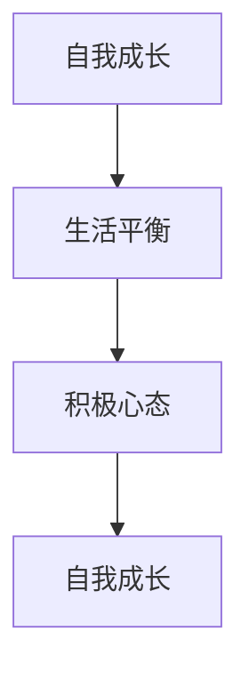

**数学公式使用**：

为了更直观地理解自我成长与生活平衡的循环，我们可以使用 LaTeX 格式嵌入以下数学公式：

$$
生活平衡 = f(自我成长, 积极心态)
$$

### 第8章：结语

通过本文的探讨，我们可以看到生活平衡对于职业成功和个人幸福的重要性。在现代社会，工作至上的文化虽然带来了职业成就，但也导致了生活不平衡的问题。因此，我们需要重新定义职业成功，关注个人成长和幸福感，并在工作和生活之间找到平衡。

本文从现代生活的挑战、职业成功的新定义、生活平衡的策略与实践以及追求生活平衡的智慧四个方面进行了详细分析，旨在为读者提供实现生活平衡的方法和指导。

**总结**：

- 生活平衡是实现职业成功和个人幸福的关键。
- 重新定义职业成功，关注个人成长和幸福感。
- 通过自我认知、目标设定、时间管理和积极心态，实现生活平衡。

**未来展望**：

随着社会的不断发展，人们对于生活质量的追求将越来越重要。未来，我们需要进一步探讨如何实现工作与生活的完美结合，为人们提供更加健康、幸福的生活环境。

### 最佳实践 Tips

- **设定清晰的目标**：明确长期和短期目标，确保生活与工作计划的一致性。
- **合理规划时间**：使用时间管理工具和方法，确保工作和个人时间的平衡。
- **培养积极心态**：通过自我激励和积极思考，保持良好的心理状态。
- **寻求支持**：与家人和朋友沟通，寻求他们的理解和支持。

### 小结

生活平衡是现代社会中不可或缺的一部分。通过重新定义职业成功，关注个人成长和幸福感，并采取有效的策略与实践，我们可以在工作和生活中找到平衡，实现全面幸福。

### 注意事项

- 生活平衡是一个动态的过程，需要不断调整和优化。
- 培养积极心态，面对挑战时保持乐观和自信。
- 寻求家人和朋友的支持，共同实现生活平衡。

### 拓展阅读

- 《平衡：工作与生活的艺术》（作者：Jeff Bezos）
- 《时间管理：如何高效地工作和生活》（作者：David Allen）
- 《积极心态的力量》（作者：Stephen R. Covey）

### 作者信息

作者：AI天才研究院/AI Genius Institute & 禅与计算机程序设计艺术 /Zen And The Art of Computer Programming

通过本文的详细分析，我们希望能够帮助读者更好地理解生活平衡的重要性，并提供实用的策略和方法，实现职业成功与个人幸福的和谐统一。让我们共同努力，追求更加平衡和幸福的生活。

