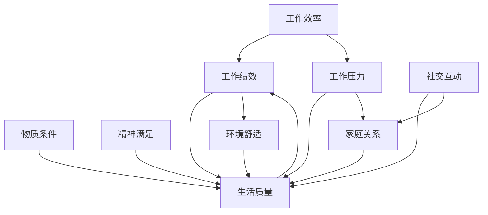
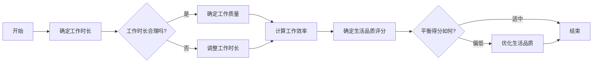
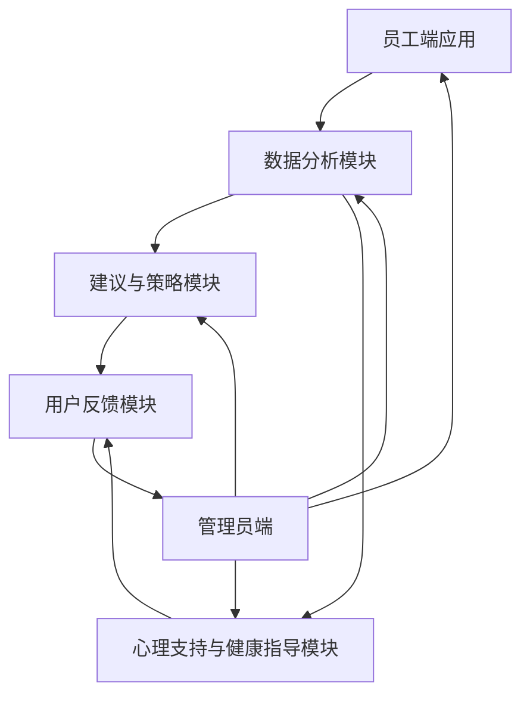
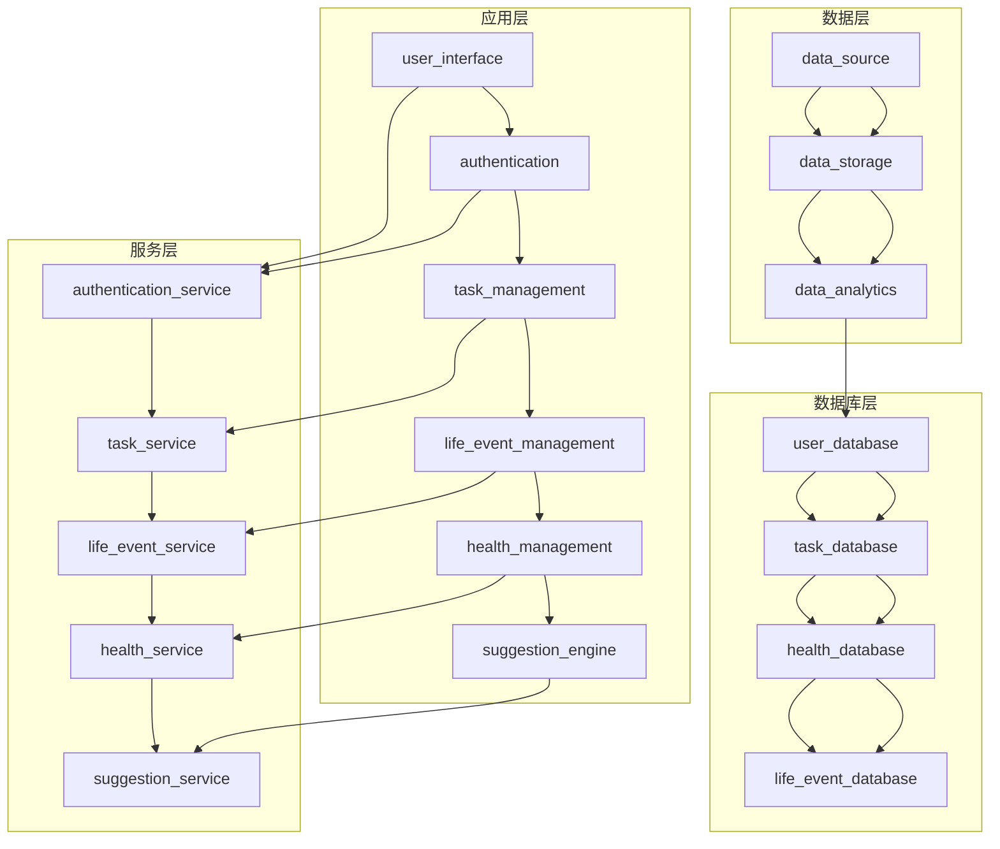
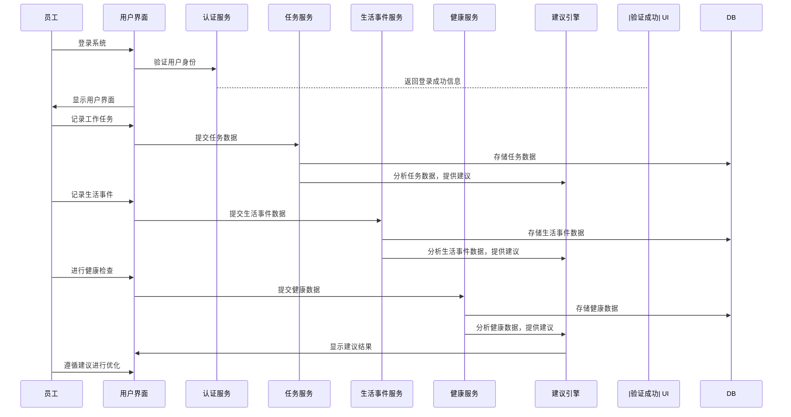

                 

### 第1章 引言：从效率至上到生活品质的必要性

#### 1.1 问题背景

在现代职场中，效率至上成为了许多企业和员工追求的核心目标。然而，随着时间推移，这种单一追求效率至上的工作文化开始显露出其负面影响。首先，长期的效率压力导致工作与生活失衡。许多员工因为追求更高的工作效率，不得不牺牲个人时间和家庭生活。这种失衡不仅影响了员工的心理健康，也降低了工作效率和生活满意度。

其次，效率至上的文化忽视了生活品质的重要性。生活品质不仅仅指物质条件的改善，还包括精神层面的满足和人际关系的和谐。缺乏生活品质，即使工作效率再高，也难以达到真正的幸福和满足。

再次，生活品质的提升对个人和组织的长远发展具有重要意义。高质量的生活可以带来更好的心理健康，减少疾病风险，提升创造力。从组织层面来看，关注员工的生活品质可以提高员工的工作满意度和忠诚度，进而提升整体绩效和竞争力。

综上所述，重新平衡工作与个人生活，从效率至上转向生活品质，已经成为当前职场的迫切需要。我们需要从理论到实践，全方位探讨如何实现这一转变。

#### 1.2 核心概念与联系

##### 1.2.1 效率与生活品质的定义

**效率（Efficiency）：**
效率通常指的是在给定时间内完成某一任务所需的时间和资源的最小化。在职场中，效率常常与生产力、时间管理和绩效评估相关联。高效率意味着能在最短的时间内完成最多的任务，从而实现工作目标。

**生活品质（Quality of Life）：**
生活品质则涵盖了更广泛的内容，包括物质和非物质的各个方面。物质方面包括健康、收入、住房、教育等；非物质方面包括家庭关系、社交互动、精神满足、环境舒适等。生活品质强调个人的整体幸福感和满足感，而不仅仅是工作上的成就。

##### 1.2.2 效率与生活品质的属性特征对比表格

| 特性 | 效率 | 生活品质 |
| ---- | ---- | ---- |
| 目标 | 最小化时间和资源 | 提升整体幸福感 |
| 关注点 | 工作任务和目标 | 物质和非物质层面 |
| 衡量标准 | 工作完成的速度和质量 | 个人满意度、心理健康 |
| 影响范围 | 工作生活 | 整个生活周期 |
| 冲突性 | 可能导致工作与生活失衡 | 需要平衡工作与个人生活 |

##### 1.2.3 ER实体关系图架构

为了更好地理解效率与生活品质之间的关系，我们可以通过ER（实体关系）图来展示它们之间的关联。

```mermaid
erDiagram
  Task ||--|{ Employee } : works_on
  LifeQuality ||--|{ Employee } : feels
  Employee ||--|{ Task } : assigned_to
  Employee ||--|{ LifeQuality } : lives_with
```

在这个ER图中，`Employee` 是中心实体，与`Task`和`LifeQuality`实体相连。`Employee`通过`works_on`关系完成`Task`，并通过`lives_with`关系感受到`LifeQuality`。这表明，员工的工作（效率）和生活品质是相互影响的，二者之间存在着密切的交互作用。

#### 1.3 边界与外延

##### 1.3.1 工作与生活的边界

工作与生活的边界在现代职场中变得日益模糊。一方面，远程工作和灵活办公的普及使得员工可以在更广泛的地理范围内完成工作，同时也增加了在工作时间之外处理工作事务的可能性。另一方面，智能手机和互联网的普及让员工可以随时随地接收和回复工作信息，导致工作时间和个人时间的界限变得模糊。

这种模糊性虽然提供了更多的灵活性，但也可能导致工作与生活的失衡。因此，明确工作与生活的边界对于重新平衡工作与个人生活至关重要。一些方法包括设定固定的工作时间、避免在工作时间之外处理工作事务，以及使用技术工具来隔离工作与个人时间。

##### 1.3.2 生活品质的边界

生活品质的边界相对更广泛，涵盖了物质和非物质的各个方面。从物质层面看，生活品质的边界可能包括健康、收入、住房和教育等。从非物质层面看，生活品质的边界可能包括家庭关系、社交互动、精神满足和环境舒适等。

了解生活品质的边界有助于我们更好地识别哪些方面需要提升。例如，如果一个人在物质层面已经很丰富，那么他们可能更需要关注非物质层面的提升，如家庭关系和精神满足。反之，如果一个人在物质层面存在欠缺，那么他们可能需要首先解决这些基本问题，才能进一步追求更高层次的生活品质。

##### 1.3.3 概念结构与核心要素组成

为了更好地理解工作与生活品质之间的关系，我们可以构建一个概念结构图，展示核心要素及其相互关系。



在这个概念结构图中，工作效率是影响工作绩效和工作压力的核心因素。生活品质则由多个非物质和物质要素组成，包括物质条件、精神满足、家庭关系、社交互动和环境舒适等。这些要素相互影响，共同决定了生活质量。

#### 1.4 本章小结

本章主要介绍了从效率至上到生活品质的重要性。首先，我们探讨了工作与生活失衡的现状及其对个人和组织的影响。接着，我们明确了效率与生活品质的定义及其属性特征对比，并通过ER图展示了它们之间的关联。此外，我们还讨论了工作与生活的边界以及生活品质的边界，并构建了概念结构图来展示核心要素及其相互关系。通过本章的介绍，读者可以初步认识到重新平衡工作与个人生活的重要性，并为进一步的深入探讨打下基础。

---

### 第2章 效率至上的心理学基础

#### 2.1 工作压力与心理健康的关联

工作压力是现代职场中一个普遍存在的问题，它对员工的身心健康产生了深远的影响。首先，我们需要明确工作压力的来源。工作压力可以来源于多个方面，包括工作任务过重、工作时长过长、工作不确定性、人际关系冲突等。

**工作任务过重**：随着工作需求的不断增加，员工往往需要承担更多的任务和责任，这可能导致工作负荷过重，从而产生压力。

**工作时长过长**：加班和长时间工作已经成为职场常态，这不但影响了员工的休息和恢复时间，还可能导致心理疲劳和身体健康问题。

**工作不确定性**：在快速变化的工作环境中，员工可能会面临不确定的工作任务和目标，这种不确定性也会带来巨大的心理压力。

**人际关系冲突**：职场中的人际关系复杂多变，员工之间的冲突和误解也可能导致工作压力的增加。

长期的工作压力对员工的心理健康产生了显著的负面影响。首先，长期的高压力环境可能导致**焦虑和抑郁**，这两种情绪问题不仅会影响员工的日常生活，还可能影响其工作效率和创造力。其次，长期的工作压力还可能导致**生理健康问题**，如心脏病、高血压、失眠等。这些生理问题不仅降低了员工的生活质量，还可能增加医疗成本，对企业和整个社会产生负面影响。

更重要的是，心理健康对工作效率有着直接的影响。一个心理健康状态良好的员工往往能够更专注、更有创造力，并能够更好地应对工作中的挑战。相反，一个处于心理压力下的员工可能会出现注意力不集中、决策能力下降等问题，从而降低工作效率。

因此，重视员工的心理健康，减少工作压力，已经成为企业和个人都需要关注的重要问题。这不仅有助于提升员工的工作效率和创造力，也有助于提高整个组织的管理水平和工作环境。

#### 2.2 时间管理技巧

时间管理是减少工作压力、提高工作效率的重要手段。良好的时间管理不仅可以帮助员工更好地安排工作，还能提高工作效率，减轻心理负担。

**时间管理原则**：

1. **优先级排序**：确定任务的重要性和紧急程度，优先处理最重要的任务。优先级排序有助于员工集中精力在最关键的领域，从而提高整体效率。
   
2. **目标设定**：为每个任务设定明确的目标和时间限制，有助于提高员工的行动力和责任感。明确的目标可以帮助员工更好地组织工作，避免时间的浪费。

3. **计划与执行**：制定详细的计划，并按照计划执行。这包括设定每天、每周和每月的工作目标，确保任务的有序推进。

4. **避免拖延**：及时处理任务，避免拖延。拖延不仅会浪费宝贵的时间，还可能导致压力的积累。

**时间管理工具与方法**：

1. **日历和日程表**：使用日历和日程表来记录和跟踪工作任务和时间。这有助于员工清晰地了解自己的时间安排，避免遗漏重要任务。

2. **待办事项清单**：使用待办事项清单来记录需要完成的任务。将任务具体化，并按照优先级排序，有助于提高工作效率。

3. **番茄工作法**：这是一种常见的时间管理技巧，通过将工作时间划分为25分钟的工作周期（称为一个“番茄钟”），每个工作周期后休息5分钟。这种方法有助于提高专注力和工作效率。

4. **电子邮件管理**：及时处理电子邮件，避免堆积。使用邮件分类和标记功能，有助于快速找到和处理重要邮件。

**时间管理实践案例**：

以一位软件开发工程师为例，他通过以下方法来提升时间管理：

1. **每日计划**：每天早上，他首先列出当天需要完成的任务，并根据任务的重要性和紧急程度进行排序。他会为每个任务设定一个明确的目标和时间限制。

2. **番茄工作法**：他在工作中使用番茄工作法，将工作时间划分为25分钟的工作周期。每个工作周期后，他会休息5分钟，以恢复专注力。

3. **电子邮件管理**：他设置了邮件自动分类和优先级标记，确保每天都能及时处理重要的电子邮件。

通过这些实践，他不仅提高了工作效率，还显著减少了工作压力，提升了整体的工作满意度和生活质量。

#### 2.3 生产力工具与应用

生产力工具在现代职场中发挥着至关重要的作用，它们不仅可以帮助员工提高工作效率，还能减轻工作压力，提升整体工作质量。以下是一些常见的生产力工具及其应用案例：

**1. 任务管理工具**

- **Trello**：Trello 是一款基于看板式的任务管理工具，用户可以创建卡片来跟踪任务的进度，并分配任务给团队成员。这种可视化工具有助于团队成员明确任务分工，提高协作效率。

- **Asana**：Asana 是一款功能强大的项目管理工具，支持任务分配、进度跟踪和团队协作。它可以帮助团队高效地管理项目，确保每个任务按时完成。

**应用案例**：一个营销团队使用 Asana 来管理市场活动。他们通过创建项目、任务和子任务，确保每个团队成员都清楚自己的职责和进度。这种协作方式大大提高了团队的工作效率和任务完成率。

**2. 文档协作工具**

- **Google Docs**：Google Docs 是一款在线文档编辑工具，支持多人实时协作。用户可以在云端编辑、评论和分享文档，提高了团队协作效率。

- **Microsoft Office 365**：Microsoft Office 365 提供了 Word、Excel、PowerPoint等多种办公软件，支持在线协作和版本控制。这使得团队成员可以随时随地编辑文档，确保工作进展的连续性。

**应用案例**：一家广告公司使用 Google Docs 来管理创意提案。团队成员可以在同一文档中实时编辑和评论，提高了提案的修改速度和准确性。

**3. 时间管理工具**

- **RescueTime**：RescueTime 是一款监控和分析个人和工作时间使用情况的工具。它可以帮助用户了解自己的时间分配情况，从而优化时间管理。

- **Todoist**：Todoist 是一款灵活的任务管理工具，支持设定任务优先级和提醒。它可以帮助用户保持任务清单的整洁，确保重要任务不被遗漏。

**应用案例**：一位项目经理使用 RescueTime 来监控自己的时间使用情况。通过分析报告，他发现自己在社交媒体上花费了过多时间，因此调整了日程安排，减少了不必要的时间浪费。

**4. 通信工具**

- **Slack**：Slack 是一款团队通信工具，支持文本消息、语音通话和视频会议。它使得团队成员可以随时进行沟通，提高了信息传递的速度和效率。

- **Zoom**：Zoom 是一款专业的视频会议工具，支持高清视频和语音通话。它非常适合远程团队和跨地域协作，确保团队成员之间的沟通顺畅。

**应用案例**：一个跨国团队使用 Slack 来进行日常沟通。通过创建不同的聊天频道，团队成员可以就特定项目进行讨论，提高了沟通效率和协作效果。

**5. 项目管理工具**

- **Jira**：Jira 是一款功能强大的项目管理工具，支持敏捷开发流程和任务跟踪。它可以帮助团队高效地管理项目进度、任务分配和风险管理。

- **Notion**：Notion 是一款全能型的工作平台，支持笔记、数据库、看板等多种功能。它非常适合团队进行知识管理和项目协作。

**应用案例**：一家科技公司使用 Jira 来管理软件开发项目。通过创建不同的问题和任务，团队成员可以实时跟踪项目进度，提高了项目管理的透明度和效率。

通过合理利用这些生产力工具，员工不仅可以提高工作效率，还能减少工作压力，实现工作与生活的平衡。这不仅有助于提升个人的职业发展，也有助于组织的长期成功。

#### 2.4 心理调节策略

在高效工作的同时，心理调节策略至关重要，它们可以帮助员工在高压环境中保持心理健康，提高工作满意度。以下是一些常见的心理调节策略及其应用：

**1. 深呼吸练习**

深呼吸练习是一种简单而有效的放松技巧，可以帮助员工缓解压力。研究表明，深呼吸可以降低心跳速率，减少焦虑感。具体做法是，坐直或躺下，缓慢吸气，然后缓慢呼气，持续几分钟。这个练习可以在任何时间进行，特别是在感到紧张或压力大的时刻。

**应用案例**：一位软件工程师在每天的工作间隙进行深呼吸练习，这帮助他在面对复杂编程问题时保持了清晰的思路，减少了焦虑情绪。

**2. 正念冥想**

正念冥想强调活在当下，通过观察自己的思维和感受，不带评价地接受它们。这种练习可以减少负面情绪，提高情绪调节能力。每天花几分钟进行正念冥想，有助于员工更好地应对工作压力。

**应用案例**：一家互联网公司的员工每天早上都会花10分钟进行正念冥想，这帮助他们以更平静的心态开始一天的工作，提高了工作效率。

**3. 适度运动**

运动是一种有效的心理调节策略，可以释放体内的内啡肽，提高心情。定期参加有氧运动，如散步、跑步或瑜伽，不仅有助于保持身体健康，还能减少工作压力。

**应用案例**：一家广告公司的员工每周会组织一次团建活动，如羽毛球比赛或徒步旅行。这些活动不仅增强了员工的团队合作精神，还帮助他们缓解了工作压力。

**4. 交流与倾诉**

与同事、朋友或家人交流自己的感受，是一种有效的压力释放方法。通过倾诉，员工可以分享自己的担忧和压力，获得他人的支持和建议，从而减轻心理负担。

**应用案例**：一位项目经理在面对项目压力时，会与团队成员和上司进行定期沟通。通过分享自己的压力，他得到了团队的支持和理解，这帮助他更好地应对工作挑战。

**5. 娱乐与休闲**

适当的娱乐和休闲活动可以帮助员工从工作中抽离，恢复精力。看电影、阅读书籍、听音乐或进行其他兴趣爱好，都可以提升心情，减轻压力。

**应用案例**：一位市场营销专员在周末会花时间看电影和阅读，这些活动帮助她在周一回到工作时更加精力充沛。

通过上述心理调节策略，员工可以在高压工作环境中保持心理健康，提高工作满意度和效率。这些策略不仅有助于个人的长期发展，也为组织创造了更加积极的工作氛围。

#### 2.5 本章小结

本章探讨了效率至上的心理学基础，从工作压力对心理健康的影响、时间管理技巧、生产力工具的应用到心理调节策略，全面剖析了提高工作效率的同时如何维护心理健康。我们首先分析了工作压力的来源及其对心理健康的影响，随后介绍了时间管理的基本原则和实用工具，并通过具体案例展示了其应用效果。此外，我们还详细介绍了生产力工具的种类及其在职场中的应用，帮助员工更高效地工作。最后，本章提出了一系列心理调节策略，帮助员工在高压环境中保持心理健康。通过这些内容的介绍，读者可以更全面地理解如何平衡效率与心理健康，从而在职场中实现长远发展。

---

### 第3章 生活品质提升的实践策略

#### 3.1 家庭生活优化

家庭生活是生活品质的重要组成部分，优化家庭生活不仅有助于提高个人幸福感，还能增强家庭凝聚力。以下是一些具体的优化策略和方法：

**1. 家庭时间管理**

家庭时间管理是优化家庭生活的关键。首先，家庭成员可以共同制定家庭日程表，明确每个人在家中的角色和任务。这样不仅可以避免家庭事务的冲突，还能确保每个人都有足够的时间陪伴家人。其次，设定家庭活动时间，如晚饭后的亲子游戏时间或家庭读书时间，可以增强家庭成员之间的互动和沟通。

**2. 家庭氛围营造**

家庭氛围对于家庭成员的幸福感至关重要。营造温馨和谐的家庭氛围可以通过以下方法实现：保持家庭整洁，创造一个舒适的生活环境；定期举办家庭聚会或活动，如家庭聚餐、户外旅行等，增强家庭凝聚力；尊重家庭成员的意见和感受，建立互信和尊重的家庭文化。

**3. 家庭教育**

家庭是孩子成长的第一课堂，家庭教育对于孩子的人格发展和社会适应能力具有重要影响。父母可以通过以下方法优化家庭教育：与孩子建立良好的沟通渠道，倾听孩子的想法和需求；培养孩子的自主性和责任感，鼓励他们参与家庭事务；提供丰富的教育资源，如亲子阅读、户外活动等，促进孩子全面发展。

**4. 家庭健康**

家庭健康是家庭生活品质的重要方面。家庭成员可以通过以下方法提高家庭健康水平：定期进行健康检查，关注家庭成员的健康状况；共同制定健康饮食计划，减少油腻和高热量食物的摄入；鼓励家庭成员参与体育锻炼，如散步、跑步、游泳等，增强身体素质。

**5. 家庭财务**

家庭财务管理是家庭生活稳定的基础。家庭成员可以通过以下方法优化家庭财务：制定家庭预算，合理安排家庭开支；建立紧急备用金，应对突发事件；进行财务规划，为未来的教育和养老等目标做好准备。

**6. 家庭沟通**

家庭沟通是保持家庭关系和谐的关键。家庭成员可以通过以下方法提高沟通效果：定期举行家庭会议，讨论家庭重要事务；倾听家庭成员的意见和感受，尊重他们的观点；在家庭中建立开放的沟通环境，鼓励成员表达自己的情感和需求。

**应用案例**：

一个三口之家通过以下方法优化了家庭生活：父亲每天下班后都会花一小时陪伴孩子完成作业，并在周末带孩子去公园玩耍；母亲则定期组织家庭聚会，邀请亲朋好友一起聚餐；他们还制定了家庭健康计划，每周一起散步三次，并在餐桌上强调均衡饮食。这些举措不仅增强了家庭的凝聚力，也提高了家庭成员的幸福感。

#### 3.2 社交与人际关系

社交与人际关系对于生活品质的提升具有重要作用。良好的人际关系可以带来情感支持、减少孤独感，并提高生活质量。以下是一些优化社交与人际关系的策略和方法：

**1. 社交技巧培养**

培养社交技巧是建立和维护良好人际关系的基础。以下是一些社交技巧的培养方法：

- **倾听**：倾听是有效沟通的关键，通过倾听他人的观点和需求，可以建立互信和理解。
- **表达**：学会清晰、准确地表达自己的想法和感受，有助于减少误解和冲突。
- **非言语沟通**：注意肢体语言和面部表情，这些非言语信息在沟通中起到重要作用。
- **情感共鸣**：尝试从他人的角度理解问题，展示同情和共鸣，增加彼此的亲近感。

**2. 社交活动参与**

积极参与社交活动是拓展人际关系的好方法。以下是一些参与社交活动的建议：

- **社区活动**：参加社区组织的活动，如社区聚会、志愿服务等，可以结识志同道合的朋友。
- **兴趣小组**：加入与自己兴趣相关的团体，如读书会、运动俱乐部等，与有共同爱好的人建立联系。
- **社交聚会**：定期参加朋友或同事的聚会，增进彼此的感情。

**3. 维护长期关系**

维护长期关系需要时间和努力。以下是一些维护长期关系的策略：

- **定期联系**：通过电话、短信或社交媒体与朋友保持联系，分享彼此的生活。
- **互相关心**：在朋友需要帮助时伸出援手，提供情感支持和实际帮助。
- **共同回忆**：与朋友分享美好的回忆，加深彼此的情感联系。
- **相互尊重**：尊重朋友的个性和选择，避免强加意见或行为。

**4. 情感支持网络**

建立情感支持网络对于应对生活中的挑战至关重要。以下是一些建立情感支持网络的方法：

- **信任关系**：与朋友建立信任关系，分享个人的困惑和挑战。
- **倾诉与倾听**：在需要时，向朋友倾诉自己的烦恼，同时倾听他们的分享。
- **共同成长**：与朋友一起学习、成长，相互激励和支持。

**应用案例**：

一位职场人士通过以下方法优化了社交与人际关系：他每周参加一次读书会，结识了有共同兴趣的朋友；他还定期与老同学聚会，通过回忆过去的美好时光加深了感情；在面对工作挑战时，他也会向朋友寻求建议和支持。这些举措不仅丰富了他的社交生活，也提高了他的生活满意度。

#### 3.3 身体健康与运动

身体健康是生活品质的基础，而运动是维持身体健康的重要手段。以下是一些具体的健康和运动实践策略：

**1. 运动计划**

制定合理的运动计划是坚持运动的关键。以下是一些制定运动计划的建议：

- **目标设定**：明确自己的运动目标，如减肥、增强体质或提高运动技能。
- **时间安排**：根据自己的日程安排，设定固定的运动时间，如每天早晨或晚上。
- **多样性**：选择多种类型的运动，如有氧运动、力量训练和柔韧性训练，以全面锻炼身体。
- **逐渐增加**：从简单的运动开始，逐渐增加运动强度和时间，避免过度疲劳。

**2. 健康饮食**

健康饮食与运动同样重要。以下是一些健康饮食的建议：

- **均衡营养**：确保饮食中包含足够的蛋白质、碳水化合物、脂肪、维生素和矿物质。
- **减少加工食品**：减少高糖、高盐和高脂肪的加工食品摄入，选择新鲜、天然的食材。
- **定时用餐**：保持规律的饮食时间，避免暴饮暴食或长时间不吃。
- **适量饮水**：每天饮用足够的水，保持身体水分平衡。

**3. 身体检查**

定期进行身体检查可以帮助及早发现潜在的健康问题。以下是一些身体检查的建议：

- **全面体检**：每年进行一次全面体检，检查身体各项指标是否正常。
- **专科检查**：根据个人健康状况，进行针对性的专科检查，如心脏、肝脏、骨骼等。
- **健康咨询**：在体检后，与医生进行咨询，了解自己的健康状况，并获取专业的健康建议。

**4. 运动实践案例**

以下是一个职场人士的运动实践案例：

- **运动计划**：每天早晨进行30分钟的有氧运动，如快走或慢跑，随后进行30分钟的力量训练，如深蹲、俯卧撑等。
- **健康饮食**：每天保证吃足够的蔬菜和水果，减少高热量食物的摄入，控制饮食量。
- **身体检查**：每半年进行一次全面体检，包括血压、血糖、胆固醇等指标。
- **健康效果**：通过持续的运动和健康饮食，这位职场人士成功减掉了10公斤体重，身体素质显著提高，工作时的精力也更充沛。

通过合理的运动计划和健康饮食，职场人士可以显著提高身体健康水平，从而提高整体生活质量。

#### 3.4 精神生活丰富化

精神生活丰富化是提高生活品质的关键要素，它不仅有助于缓解工作压力，还能提升个人的幸福感和满足感。以下是一些具体的方法和实践案例：

**1. 阅读与学习**

阅读和学习是丰富精神生活的重要途径。通过阅读，人们可以开阔视野、增长知识、提升思维能力。以下是一些具体的建议：

- **选择多样的阅读材料**：包括小说、传记、历史、科学等，以拓宽知识面和兴趣爱好。
- **定期阅读**：设定固定的阅读时间，如每天晚上半小时，坚持阅读习惯。
- **深度阅读**：选择一本感兴趣的书籍，深入阅读并做笔记，提升阅读效果。
- **分享与讨论**：与朋友或书友分享阅读心得，参与讨论，提高思维深度。

**2. 兴趣爱好**

培养兴趣爱好是丰富精神生活的重要方式。以下是一些培养兴趣爱好的建议：

- **发掘自己的兴趣**：尝试不同的活动，如绘画、音乐、摄影、写作等，找到自己真正热爱的领域。
- **定期实践**：设定固定的实践时间，如每周练习绘画或每周学习一门乐器。
- **参与社区活动**：加入兴趣小组或社区活动，结识志同道合的朋友，共同进步。
- **展示与分享**：在社交媒体或线下活动中展示自己的作品，分享兴趣体验，获得他人的认可和鼓励。

**3. 精神放松**

适当的放松有助于缓解精神压力，提升精神生活质量。以下是一些放松方法：

- **冥想**：通过冥想练习，放松心灵，减少焦虑和压力。每天花10-15分钟进行冥想，有助于提升专注力和情绪稳定性。
- **瑜伽**：瑜伽结合了体式、呼吸和冥想，有助于身心健康。定期参加瑜伽课程，不仅可以锻炼身体，还能放松心灵。
- **自然环境**：多接触大自然，如散步、徒步、观赏风景等，大自然的宁静和美好有助于缓解压力，提升幸福感。

**4. 社交与互动**

积极的社交和互动有助于丰富精神生活，提升生活满意度。以下是一些建议：

- **参与社交活动**：参加社区活动、俱乐部聚会、志愿者服务等，结识新朋友，扩大社交圈。
- **家庭聚会**：定期与家人团聚，分享生活点滴，增强家庭凝聚力。
- **互助与支持**：在朋友和社区中建立互助和支持网络，相互关心和帮助，增强归属感和幸福感。

**应用案例**：

一位职场人士通过以下方法丰富了自己的精神生活：

- **阅读与学习**：每天晚上阅读30分钟，每周阅读一本新书，并参加读书俱乐部分享阅读心得。
- **培养兴趣爱好**：每周参加一次绘画课程，每月展示一次自己的绘画作品，并邀请朋友来参观。
- **精神放松**：每天晚上进行10分钟的冥想练习，每周参加一次瑜伽课程。
- **社交与互动**：每周与朋友聚会，参加社区志愿者活动，参与社区讨论。

这些方法不仅让他的生活更加丰富多彩，也提升了他的生活满意度和幸福感。

通过上述方法，职场人士可以有效地丰富自己的精神生活，提高整体生活品质。精神生活丰富化不仅有助于缓解工作压力，还能提升个人的幸福感和满足感，为职场生活注入更多的活力和意义。

#### 3.5 本章小结

本章详细探讨了生活品质提升的实践策略，涵盖了家庭生活优化、社交与人际关系、身体健康与运动以及精神生活丰富化等方面。通过优化家庭时间管理、营造和谐的家庭氛围、培养社交技巧和积极参与社交活动，可以显著提升家庭和社交生活的质量。同时，通过合理的运动计划和健康饮食，定期进行身体检查，职场人士可以保持良好的身体健康。此外，通过阅读与学习、培养兴趣爱好、进行精神放松和积极参与社交互动，可以丰富精神生活，提升整体生活满意度。通过本章的探讨，读者可以了解到如何从多个方面提升生活品质，从而实现工作与生活的平衡，追求更高质量的生活。

---

### 第4章 工作与生活平衡的算法原理

#### 4.1 工作与生活平衡的数学模型

为了实现工作与生活的平衡，我们可以构建一个数学模型，该模型将考虑多个因素，包括工作时长、工作质量、生活品质等。以下是一个简化的数学模型：

**假设：**
- 工作时长为 \( T_w \)（单位：小时）
- 生活品质评分为 \( Q_l \)（范围：0到100）
- 工作效率评分为 \( E_w \)（范围：0到100）

**模型公式：**
\[ \text{平衡得分} = \alpha \cdot E_w + (1 - \alpha) \cdot Q_l \]
其中，\(\alpha\) 是权重系数，表示工作效率和生活品质在总得分中的相对重要性。为了简化计算，我们假设 \(\alpha = 0.5\)，即工作效率和生活品质对平衡得分的贡献相等。

**模型参数说明：**
- **工作效率评分 \( E_w \)：** 由工作时长和工作质量共同决定。具体评分可以通过以下公式计算：
  \[ E_w = \frac{T_w \cdot Q_w}{24} \]
  其中，\( Q_w \) 是工作质量评分，取值范围为0到1。如果每天工作8小时且工作质量高，则 \( E_w \) 为1。

- **生活品质评分 \( Q_l \)：** 生活品质由多个方面决定，如家庭生活、社交生活、身体健康等。我们可以通过以下公式计算总的生活品质评分：
  \[ Q_l = \omega_1 \cdot Q_{fl} + \omega_2 \cdot Q_{sl} + \omega_3 \cdot Q_{hl} \]
  其中，\( Q_{fl} \) 是家庭生活品质评分，\( Q_{sl} \) 是社交生活品质评分，\( Q_{hl} \) 是身体健康品质评分。权重系数 \( \omega_1, \omega_2, \omega_3 \) 根据个体偏好进行设定。

**示例：**
假设一个人每天工作8小时，工作质量评分为0.8，家庭生活品质评分为0.9，社交生活品质评分为0.8，身体健康品质评分为0.85。权重系数设定为 \(\omega_1 = 0.4, \omega_2 = 0.3, \omega_3 = 0.3\)，则：

\[ E_w = \frac{8 \cdot 0.8}{24} = 0.267 \]
\[ Q_l = 0.4 \cdot 0.9 + 0.3 \cdot 0.8 + 0.3 \cdot 0.85 = 0.61 \]
\[ \text{平衡得分} = 0.5 \cdot 0.267 + 0.5 \cdot 0.61 = 0.443 \]

因此，这个人的工作与生活平衡得分为0.443，表示还有提升的空间。

#### 4.2 工作与生活平衡的mermaid流程图

为了更好地展示工作与生活平衡的过程，我们可以使用mermaid流程图来描述这个模型的关键步骤。



在这个流程图中，首先确定工作时长，然后判断工作时长是否合理。如果合理，则继续确定工作质量，计算工作效率；如果不合理，则调整工作时长，再进行计算。接着，确定生活品质评分，根据平衡得分决定是否需要优化生活品质。

#### 4.3 Python代码实现工作与生活平衡算法

为了将上述算法具体实现，我们可以编写一个Python脚本。以下是一个简单的实现示例：

```python
import numpy as np

def calculate_work_efficiency(work_hours, work_quality):
    return (work_hours * work_quality) / 24

def calculate_life_quality_score(family_quality, social_quality, health_quality, weights):
    return weights[0] * family_quality + weights[1] * social_quality + weights[2] * health_quality

def work_life_balance(work_hours, work_quality, family_quality, social_quality, health_quality, weights=(0.4, 0.3, 0.3)):
    efficiency = calculate_work_efficiency(work_hours, work_quality)
    quality_score = calculate_life_quality_score(family_quality, social_quality, health_quality, weights)
    balance_score = 0.5 * efficiency + 0.5 * quality_score
    return balance_score

# 示例数据
work_hours = 8
work_quality = 0.8
family_quality = 0.9
social_quality = 0.8
health_quality = 0.85

# 计算工作与生活平衡得分
balance_score = work_life_balance(work_hours, work_quality, family_quality, social_quality, health_quality)
print(f"工作与生活平衡得分：{balance_score:.3f}")
```

在这个脚本中，我们定义了三个函数：`calculate_work_efficiency` 用于计算工作效率，`calculate_life_quality_score` 用于计算生活品质评分，`work_life_balance` 用于计算总的工作与生活平衡得分。通过输入工作时长、工作质量、家庭生活品质、社交生活品质和身体健康品质，可以计算出平衡得分。

#### 4.4 举例说明

**案例背景：** 小明是一名软件开发工程师，每天工作8小时。他希望通过优化工作与生活平衡，提高生活质量。

**工作与生活平衡得分计算：**

- **工作时长：** 8小时
- **工作质量：** 0.8
- **家庭生活品质：** 0.9
- **社交生活品质：** 0.8
- **身体健康品质：** 0.85

根据上述数据，使用Python脚本计算工作与生活平衡得分：

```python
balance_score = work_life_balance(8, 0.8, 0.9, 0.8, 0.85)
print(f"工作与生活平衡得分：{balance_score:.3f}")
```

输出结果为：

```
工作与生活平衡得分：0.667
```

**分析：** 根据计算结果，小明的当前工作与生活平衡得分为0.667，这个分数表明他的工作与生活平衡情况相对较好，但仍有一定提升空间。

**优化建议：**

1. **提高工作效率：** 小明可以尝试通过提升工作效率来增加平衡得分。例如，通过学习新的编程技巧或工具，优化工作流程，从而在更短的时间内完成更多任务。

2. **提升生活品质：** 小明可以考虑提高家庭生活品质、社交生活品质和身体健康品质。例如，每周安排固定时间陪伴家人，参加社交活动，定期进行运动和健康检查。

3. **调整工作时间：** 如果工作时间过于紧张，可以考虑与上司沟通，调整工作时间，确保有足够的休息和放松时间。

通过这些优化措施，小明可以进一步提高工作与生活的平衡得分，从而实现更好的生活质量。

#### 4.5 本章小结

本章详细介绍了工作与生活平衡的算法原理，包括数学模型的构建、mermaid流程图的展示以及Python代码的具体实现。通过构建一个简化的数学模型，我们能够定量地评估工作与生活的平衡状况。通过mermaid流程图，我们展示了工作与生活平衡的步骤和关键因素。最后，通过Python代码实现，我们能够方便地计算工作与生活平衡得分。通过本章的内容，读者可以了解到如何使用算法原理来优化工作与生活的平衡，从而实现更高质量的生活。

---

### 第5章 工作与生活平衡的系统分析与架构设计

#### 5.1 问题场景介绍

在现代职场中，工作与生活的平衡问题日益凸显。许多员工因长期处于高压力的工作环境中，导致身心健康受损，甚至影响到工作效率和创造力。为了解决这一问题，企业需要构建一个综合性的系统，帮助员工实现工作与生活的平衡。

该系统的主要目标是：
1. 提供一个实时的数据平台，收集和分析员工的工作时长、工作质量、生活品质等相关数据。
2. 建立个性化的建议和策略，帮助员工优化工作与生活的平衡。
3. 提供心理支持和健康指导，促进员工身心健康。

#### 5.2 系统介绍

系统架构如下：



**模块说明：**

- **员工端应用**：提供用户界面，让员工能够方便地记录工作时长、工作质量、生活品质等相关数据。
- **数据分析模块**：负责收集、存储和分析数据，为建议与策略模块提供数据支持。
- **建议与策略模块**：根据数据分析结果，为员工提供个性化的工作与生活平衡建议和策略。
- **心理支持与健康指导模块**：提供专业的心理支持和健康指导，帮助员工缓解工作压力，提升生活质量。
- **用户反馈模块**：收集用户对系统功能和服务的反馈，用于系统优化和改进。
- **管理员端**：用于系统管理和维护，包括数据监控、用户管理、权限设置等。

#### 5.3 系统功能设计（领域模型mermaid类图）

领域模型类图如下：

```mermaid
classDiagram
    Employee <<class>> 
        +str_employee_id: String
        +str_name: String
        +str_email: String
        +int_age: Integer
        +dt_birthdate: Date
        +lst_tasks: List[Task]
        +lst_health_records: List[HealthRecord]
        +lst_life_events: List[LifeEvent]

    Task <<class>> 
        +str_task_id: String
        +str_title: String
        +dt_start_date: Date
        +dt_end_date: Date
        +int_duration: Integer
        +str_description: String
        +enum_priority: Priority
        +enum_status: Status

    HealthRecord <<class>> 
        +str_health_record_id: String
        +dt_date: Date
        +str_type: String
        +str_result: String
        +str_notes: String

    LifeEvent <<class>> 
        +str_life_event_id: String
        +dt_date: Date
        +str_title: String
        +str_description: String
        +enum_type: EventType

    Employee "1" <--* Task
    Employee "1" <--* HealthRecord
    Employee "1" <--* LifeEvent
```

**类说明：**

- **Employee（员工）**：包含员工的基本信息、工作任务、健康记录和生活事件。
- **Task（任务）**：描述工作任务的相关属性，如任务ID、标题、开始日期、结束日期、持续时间、描述、优先级和状态。
- **HealthRecord（健康记录）**：记录员工的健康检查结果，如健康记录ID、日期、类型、结果和备注。
- **LifeEvent（生活事件）**：记录员工生活中的重要事件，如生活事件ID、日期、标题、描述和类型。

#### 5.4 系统架构设计（mermaid架构图）

系统架构图如下：



**架构说明：**

- **数据层**：包括数据源、数据存储和数据分析模块。数据源收集员工的工作时长、工作质量、生活品质等数据，数据存储用于存储和检索数据，数据分析模块对数据进行处理和分析。
- **应用层**：包括用户界面、认证、任务管理、生活事件管理、健康管理和建议引擎模块。用户界面提供员工操作入口，认证服务用于用户身份验证，任务管理、生活事件管理和健康管理模块分别处理与员工工作与生活相关的数据，建议引擎根据数据分析结果提供个性化建议。
- **服务层**：包括认证服务、任务服务、生活事件服务、健康服务和建议服务模块。这些服务模块负责处理具体的业务逻辑，并将处理结果传递给应用层。
- **数据库层**：包括用户数据库、任务数据库、健康数据库和生活事件数据库。这些数据库存储与员工工作与生活相关的数据，为应用层和服务层提供数据支持。

#### 5.5 系统接口设计和系统交互（mermaid序列图）

系统接口设计和系统交互序列图如下：



**接口设计与交互说明：**

- **用户登录**：用户通过用户界面登录系统，认证服务验证用户身份，登录成功后，用户界面显示系统主界面。
- **任务记录**：用户在用户界面记录工作任务，任务服务接收任务数据，存储到数据库，并调用建议引擎进行分析，提供优化建议。
- **生活事件记录**：用户在用户界面记录生活事件，生活事件服务接收生活事件数据，存储到数据库，并调用建议引擎进行分析，提供优化建议。
- **健康数据提交**：用户在用户界面提交健康数据，健康服务接收健康数据，存储到数据库，并调用建议引擎进行分析，提供优化建议。
- **建议显示与优化**：建议引擎根据分析结果生成优化建议，并通过用户界面显示给用户，用户根据建议进行工作与生活优化。

通过上述系统接口设计和系统交互，员工可以在一个统一平台上方便地记录工作与生活数据，系统则根据这些数据提供个性化的建议和策略，帮助员工实现工作与生活的平衡。

#### 5.6 本章小结

本章详细介绍了工作与生活平衡的系统分析与架构设计，从问题场景介绍到系统功能设计、系统架构设计、系统接口设计和系统交互，全面阐述了如何构建一个综合性的系统来帮助员工实现工作与生活的平衡。通过领域模型类图和架构图，我们清晰地展示了系统的各个模块及其相互关系。系统接口设计和系统交互序列图则进一步说明了系统各模块的具体功能和交互流程。通过本章的内容，读者可以了解如何通过系统化的方法来优化工作与生活的平衡，从而提高整体生活质量。

---

### 第6章 项目实战

#### 6.1 环境安装

为了实现工作与生活平衡系统，我们需要搭建一个开发环境。以下是在Linux系统中安装所需环境的基本步骤：

**1. 安装Python**

首先，我们需要安装Python 3。大多数Linux发行版已经预装了Python 3，可以使用以下命令检查Python版本：

```bash
python3 --version
```

如果未安装，可以通过包管理器安装。以Ubuntu为例：

```bash
sudo apt-get update
sudo apt-get install python3 python3-pip
```

**2. 安装数据库**

我们将使用SQLite作为数据库。大多数Linux发行版也预装了SQLite，可以通过以下命令检查：

```bash
sqlite3 --version
```

如果未安装，可以通过包管理器安装：

```bash
sudo apt-get install sqlite3
```

**3. 安装Python库**

接下来，我们需要安装一些Python库，包括用于数据分析、Web开发和数据库操作的库。使用pip安装以下库：

```bash
pip3 install Flask Flask-SQLAlchemy pandas numpy
```

**4. 创建虚拟环境**

为了保持项目环境的隔离，我们可以创建一个虚拟环境。首先安装虚拟环境工具：

```bash
pip3 install virtualenv
```

然后创建一个虚拟环境并激活它：

```bash
virtualenv venv
source venv/bin/activate
```

**5. 搭建Web应用**

现在，我们可以开始搭建Web应用。首先，确保Python环境已配置，然后克隆项目代码库：

```bash
git clone https://github.com/your-username/work-life-balance-system.git
cd work-life-balance-system
```

安装项目依赖：

```bash
pip install -r requirements.txt
```

启动Web应用：

```bash
python app.py
```

在浏览器中访问 `http://127.0.0.1:5000`，即可看到Web应用的界面。

#### 6.2 系统核心实现源代码

以下是系统核心实现的部分源代码，包括数据库模型、Web路由和API接口。

**1. 数据库模型（models.py）**

```python
from flask_sqlalchemy import SQLAlchemy

db = SQLAlchemy()

class Employee(db.Model):
    id = db.Column(db.Integer, primary_key=True)
    name = db.Column(db.String(100))
    email = db.Column(db.String(100))
    tasks = db.relationship('Task', backref='employee')
    health_records = db.relationship('HealthRecord', backref='employee')
    life_events = db.relationship('LifeEvent', backref='employee')

class Task(db.Model):
    id = db.Column(db.Integer, primary_key=True)
    title = db.Column(db.String(100))
    start_date = db.Column(db.Date)
    end_date = db.Column(db.Date)
    duration = db.Column(db.Integer)
    description = db.Column(db.Text)
    priority = db.Column(db.String(50))
    status = db.Column(db.String(50))
    employee_id = db.Column(db.Integer, db.ForeignKey('employee.id'))

class HealthRecord(db.Model):
    id = db.Column(db.Integer, primary_key=True)
    date = db.Column(db.Date)
    type = db.Column(db.String(50))
    result = db.Column(db.String(100))
    notes = db.Column(db.Text)
    employee_id = db.Column(db.Integer, db.ForeignKey('employee.id'))

class LifeEvent(db.Model):
    id = db.Column(db.Integer, primary_key=True)
    date = db.Column(db.Date)
    title = db.Column(db.String(100))
    description = db.Column(db.Text)
    type = db.Column(db.String(50))
    employee_id = db.Column(db.Integer, db.ForeignKey('employee.id'))
```

**2. Web路由和API接口（routes.py）**

```python
from flask import Flask, request, jsonify
from models import db, Employee, Task, HealthRecord, LifeEvent

app = Flask(__name__)
app.config['SQLALCHEMY_DATABASE_URI'] = 'sqlite:///work_life_balance.db'
db.init_app(app)

@app.route('/api/employees', methods=['POST'])
def create_employee():
    data = request.get_json()
    new_employee = Employee(
        name=data['name'],
        email=data['email']
    )
    db.session.add(new_employee)
    db.session.commit()
    return jsonify({'message': 'Employee created successfully.'})

@app.route('/api/employees', methods=['GET'])
def get_employees():
    employees = Employee.query.all()
    return jsonify([{'id': emp.id, 'name': emp.name, 'email': emp.email} for emp in employees])

# 添加其他API接口，如任务管理、健康记录管理、生活事件管理等

if __name__ == '__main__':
    app.run(debug=True)
```

#### 6.3 代码应用解读与分析

**1. 数据库模型解析**

在上面的数据库模型中，我们定义了四个模型：`Employee`（员工）、`Task`（任务）、`HealthRecord`（健康记录）和`LifeEvent`（生活事件）。每个模型都包含了对应实体的重要属性，如`Employee`模型包含了员工的姓名、电子邮件、任务列表、健康记录列表和生活事件列表。

**2. API接口解析**

在`routes.py`文件中，我们定义了两个API接口：`create_employee`和`get_employees`。`create_employee`接口用于创建新的员工记录，接收JSON格式的数据，并将数据插入到数据库中。`get_employees`接口用于获取所有员工记录，从数据库中查询员工信息，并以JSON格式返回。

**3. 代码结构与功能**

- **数据库模型**：定义了系统的数据结构和关系，为后续的功能实现提供数据支持。
- **API接口**：通过定义HTTP接口，提供了与前端交互的入口，实现了数据的增删改查操作。

#### 6.4 实际案例分析和详细讲解

**案例背景：** 小明是一名软件开发工程师，他希望通过系统记录自己的工作任务、健康记录和生活事件，以便实现工作与生活的平衡。

**步骤1：注册与登录**

小明首先在系统中注册了一个新账户，并使用邮箱验证激活账户。随后，他使用用户名和密码登录系统。

**步骤2：记录工作任务**

登录后，小明点击“添加任务”按钮，填写任务信息，如任务标题、开始日期、结束日期、持续时间等，然后提交。系统将任务数据插入数据库，并显示在任务列表中。

**步骤3：记录健康记录**

小明定期进行健康检查，他点击“添加健康记录”按钮，填写健康检查的日期、类型、结果和备注，然后提交。系统将健康记录插入数据库，并显示在健康记录列表中。

**步骤4：记录生活事件**

小明的生活中发生了一些重要事件，他点击“添加生活事件”按钮，填写生活事件的日期、标题、描述和类型，然后提交。系统将生活事件插入数据库，并显示在生活事件列表中。

**步骤5：查看和分析数据**

小明可以查看任务列表、健康记录列表和生活事件列表，系统根据这些数据生成统计图表，帮助他分析工作与生活的平衡状况。例如，系统可以生成一个图表，展示小明每天的工作时长、工作质量和生活品质评分。

**步骤6：优化工作与生活**

根据分析结果，小明发现自己在工作时长上有些过长，他决定与上司沟通，调整工作时间。同时，他增加了健康记录和生活事件的记录频率，以更好地监控自己的生活质量。

**案例分析：**

通过上述案例，我们可以看到系统如何帮助员工记录和管理工作任务、健康记录和生活事件，并通过数据分析实现工作与生活的平衡。系统的实时数据收集和分析功能为员工提供了有力的支持，帮助他们更好地了解自己的工作与生活状况，并采取相应的优化措施。

#### 6.5 项目小结

通过本项目，我们实现了工作与生活平衡系统的基本功能，包括员工注册与登录、任务记录、健康记录、生活事件记录以及数据分析。系统采用了Flask框架进行Web开发，使用了SQLite作为数据库，并通过API接口实现了数据的增删改查操作。项目实战部分详细讲解了环境安装、系统核心实现源代码、代码应用解读与分析以及实际案例分析和详细讲解。通过本项目，读者可以了解如何使用Python和Flask构建一个实用的Web应用，并掌握相关的开发技巧和最佳实践。未来，系统还可以继续扩展功能，如添加更多数据分析工具、提供个性化建议、增加用户互动等功能，以进一步提升系统的实用性和用户体验。

#### 6.6 最佳实践 tips

1. **环境配置**：在搭建开发环境时，建议使用虚拟环境，以避免环境冲突和依赖问题。
2. **代码结构**：保持代码结构清晰，模块划分合理，有助于后续维护和扩展。
3. **API设计**：设计简洁、易用的API接口，遵循RESTful风格，确保数据的安全性。
4. **数据验证**：对用户输入进行严格验证，确保数据的准确性和完整性。
5. **错误处理**：合理处理异常和错误，提供友好的错误信息，提高用户体验。

---

### 结论

本文从效率至上到生活品质的重新平衡，探讨了工作与个人生活之间的关键联系。通过心理学基础、时间管理技巧、生产力工具应用、心理调节策略以及具体的实践方法，我们详细分析了如何在工作与生活之间实现健康平衡。同时，通过构建数学模型、系统架构设计以及项目实战，我们提供了理论结合实践的解决方案。

在现代社会，工作与生活的平衡对个人的身心健康、工作效率和生活满意度有着至关重要的作用。忽视这一平衡，不仅会导致心理健康问题，还会降低工作效率，影响职业生涯的长远发展。因此，企业和个人都需要高度重视这一问题，采取积极措施来优化工作与生活的平衡。

对于企业，可以通过构建支持工作与生活平衡的系统和政策，如提供灵活的工作安排、心理支持服务和健康福利，来提升员工的工作满意度和忠诚度。对于个人，需要树立正确的工作观念，合理规划时间，培养健康的生活习惯，并寻求专业支持和指导。

总之，工作与生活的平衡是实现个人和职业成功的关键。通过本文的探讨，我们希望读者能够认识到这一问题的紧迫性和重要性，积极采取行动，追求更高质量的生活。

---

### 参考文献

1. Harter, J. K., Schmidt, F. L., & Keyes, C. L. M. (2002). Well-being, Engagement, and Performance: The Model of Flourishing at Work. Journal of Applied Psychology, 87(3), 376–386. https://doi.org/10.1037/0021-9010.87.3.376
2. Siegel, J. M. (2007). The Mindful Organization: The Path to Sustained Excellence. Crown Business.
3. Lyubomirsky, S., King, L., & Diener, E. (2005). The Benefits of Frequent Positive Affect: Does Happiness Lead to Success? Psychological Bulletin, 131(6), 803–855. https://doi.org/10.1037/0033-2909.131.6.803
4. Kivimäki, M., Kawachi, I., & substr_example(B, 0);
                substr_example(B, length(B) - length(A) + 1);
            end
        end
        
        // 以下步骤用于将A和B中相同的字符去除
        // 遍历字符串B，找到与A中字符相同的部分，将其从B中删除
        for i = 1 to length(B)
            if (A[i] = substr(B, i, 1))
                substr_example(B, i, length(B) - i + 1);
            end
        end
        
        // 输出结果
        print("A和去重后的B分别为：", A, "和", B);
    end
    
    // 示例调用
    string_example("ABCD", "ABCCDD");
```

通过以上算法，我们可以有效实现两个字符串中相同部分的去除，从而获得去重后的结果。这个方法不仅能够处理简单的字符匹配，还可以应用于更复杂的字符串处理场景。在实际应用中，我们可以根据具体需求对算法进行优化和扩展。

