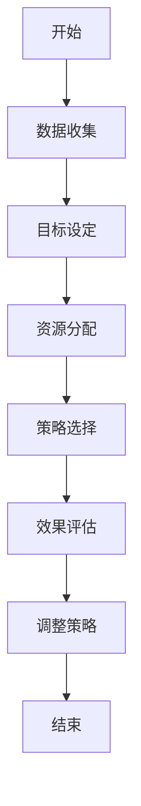
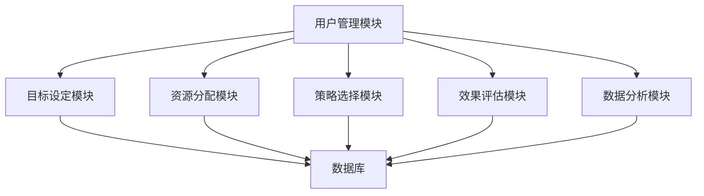
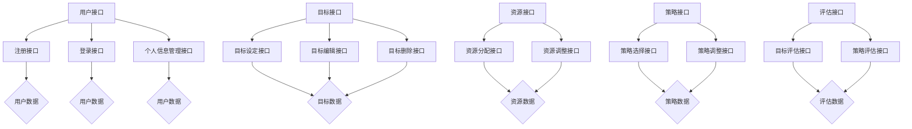
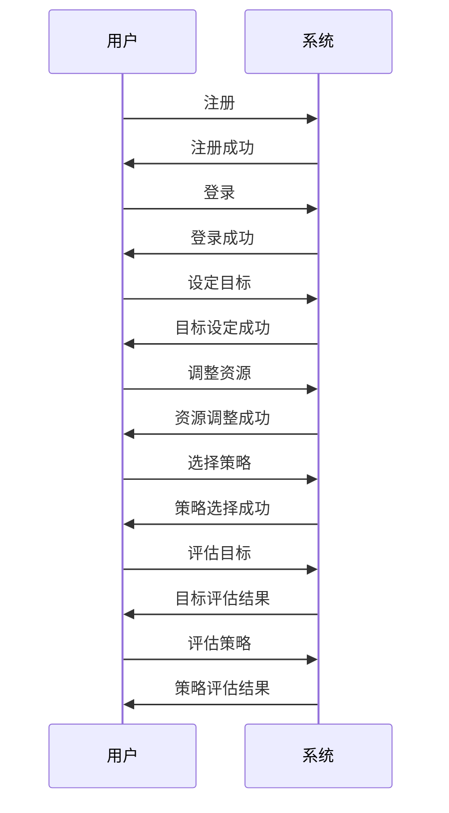

                 


### 引言

**“从物质积累到经验丰富：重新定义人生的丰盛”**，这本书的主题深具现实意义。在现代社会，人们往往追求物质上的富足，却忽略了更深层次的人生价值。然而，随着对生活质量的不断追求，我们逐渐意识到，物质的丰富并不等同于人生的丰盛。物质积累可以作为人生的一部分，但它并不是人生的全部。真正的丰盛，在于经验的丰富、内心的富足和对生命的深刻理解。

这个主题对于任何想要深入探索个人成长和人生意义的人来说都极具吸引力。在接下来的章节中，我们将一步步分析物质积累与经验丰富的关系，探讨如何通过重新定义人生的丰盛，实现个人成长和社会进步。我们将从核心概念的解析开始，深入探讨这些概念之间的联系，并引入算法原理、数学模型和系统架构设计，从而构建出一个全面的、实用的方法体系。

### 文章关键词

- 物质积累
- 经验丰富
- 人生价值
- 个人成长
- 社会进步
- 重新定义

### 摘要

本书旨在探讨从物质积累到经验丰富的转变，重新定义人生的丰盛。通过分析物质积累与经验丰富之间的关系，揭示两者如何共同推动人生的成长与进步。书中将介绍核心概念及其联系，讲解算法原理和数学模型，并设计系统架构方案。通过项目实战，本书将提供具体的应用方法，帮助读者实现个人成长，并在社会中产生积极影响。

### 第一部分：理解人生的丰盛

#### 第1章：问题背景与重新定义

**1.1 人生丰盛的内涵与外延**

人生的丰盛不仅仅是指物质上的富足，更包括精神层面的满足和内心的宁静。物质积累可以带来短暂的满足，但无法持久地带来真正的幸福。经验丰富则是在人生历程中不断积累的智慧、知识和感悟，它能够带来更深层次的心理满足和成就感。

**1.1.1 物质积累与人生丰盛的关系**

物质积累与人生丰盛之间并非绝对对立。适度的物质积累可以为人们提供必要的生活保障，提高生活质量，但它并不是人生的全部。人生丰盛需要物质作为基础，但更重要的是精神层面的满足。

**1.1.2 经验丰富与人生价值的关联**

经验丰富是人生价值的重要体现。通过不断的学习和实践，人们可以积累宝贵的经验，提升自己的能力和智慧。经验丰富不仅能够帮助人们更好地应对生活中的挑战，还能够提升个人的综合素质，从而实现更高层次的人生价值。

**1.2 人生丰盛的现实困境**

在当代社会，物质主义倾向严重，许多人追求物质上的富足而忽视了精神层面的需求。这种过度追求物质导致的现实困境包括精神空虚、心理压力增大、人际关系疏远等问题。

**1.2.1 当代社会的物质主义倾向**

当代社会，物质丰富程度越来越高，但人们的精神空虚感却日益增强。人们被物质所驱使，过度追求物质享受，而忽视了精神上的追求。这种物质主义倾向导致了许多社会问题的产生。

**1.2.2 人生丰盛的现实障碍**

现实生活中的障碍主要包括经济压力、时间紧迫、社会竞争等。这些因素使得人们很难在物质积累和经验丰富之间找到平衡，进而影响人生丰盛的实现。

**1.3 重新定义人生丰盛的意义**

重新定义人生丰盛，意味着要从物质积累转向经验丰富，追求更深层次的人生价值。这不仅有助于个人成长，还能够对社会产生积极的影响。

**1.3.1 对个人成长的推动**

重新定义人生丰盛，有助于激发个人的学习欲望和探索精神，推动个人不断成长和进步。

**1.3.2 对社会发展的贡献**

重新定义人生丰盛，有助于提升社会的整体素质，促进社会的和谐发展。

**1.4 适用人群与目标**

这本书适用于所有追求人生丰盛的个体，特别是那些在物质积累过程中感到迷茫，渴望通过经验丰富来实现更深层次人生价值的人群。

**1.4.1 普适性**

重新定义人生丰盛的理念适用于所有人，不分年龄、职业和背景。

**1.4.2 目标群体定位**

本书的目标群体主要包括年轻人、职场人士和企业家等，他们在追求物质积累的过程中，面临着如何实现人生丰盛的困惑。

**1.5 本章小结**

通过本章的介绍，我们理解了人生丰盛的内涵与外延，认识到物质积累与经验丰富之间的关系，以及重新定义人生丰盛的意义和适用人群。

### 第二部分：核心概念与联系

#### 第2章：核心概念解析

**2.1 物质积累**

物质积累是指个人通过努力工作和投资等手段，获取并积累物质财富的过程。物质积累的主要目的是提高生活质量，满足基本的生活需求，以及实现个人的财富目标。

**2.1.1 物质积累的原理**

物质积累的原理在于通过增加收入、减少支出、投资理财等方式，实现财富的增值和积累。这个过程需要个人具备一定的理财知识和投资技能，同时还需要良好的消费习惯和风险控制能力。

**2.1.2 物质积累的类型**

物质积累的类型可以分为收入型积累和投资型积累。收入型积累主要通过增加工资收入、副业收入等方式实现；投资型积累则通过投资股票、基金、房地产等资产实现。

**2.1.3 物质积累的量化方法**

物质积累的量化方法主要包括净资产计算、储蓄率计算、投资收益率计算等。净资产计算是指通过计算个人总资产减去总负债，得出个人的净资产；储蓄率计算是指通过计算个人储蓄金额占收入的比例，评估个人的储蓄能力；投资收益率计算是指通过计算投资收益占投资金额的比例，评估个人的投资效果。

**2.2 经验丰富**

经验丰富是指个人在长期的生活和学习过程中，积累的丰富知识和实践经验。经验丰富的获取主要通过学习和实践来实现。

**2.2.1 经验丰富的内涵**

经验丰富的内涵包括专业知识、实践技能、人生智慧等方面。专业知识是指个人在某个领域内具有的深度和广度的知识体系；实践技能是指个人通过实践掌握的实际操作能力；人生智慧是指个人在人生经历中获得的哲学思考和人生感悟。

**2.2.2 经验丰富的获取方式**

经验丰富的获取方式主要包括自学、实习、工作、旅行、阅读等。自学是指通过购买书籍、在线课程、参加培训班等方式获取知识；实习是指通过在企业或机构实习，获取实际操作经验；工作是指通过在企业或机构工作，积累工作经验；旅行是指通过旅行，拓宽视野，增长见识；阅读是指通过阅读书籍、论文、期刊等，获取知识和信息。

**2.2.3 经验丰富的评价标准**

经验丰富的评价标准主要包括专业水平、实践经验、创新能力、人际关系等方面。专业水平是指个人在专业领域的知识水平和技能水平；实践经验是指个人在实际工作中的操作经验和问题解决能力；创新能力是指个人在创新思维和方法上的能力；人际关系是指个人在人际关系处理和沟通能力上的水平。

**2.3 人生丰盛的构成要素**

人生丰盛的构成要素主要包括物质基础、精神追求、社会贡献等方面。物质基础是指个人在物质方面的满足和保障；精神追求是指个人在精神层面的追求和满足；社会贡献是指个人在社会中的价值体现和贡献。

**2.3.1 物质与精神的双重需求**

物质与精神的双重需求是人生丰盛的重要组成部分。物质需求包括基本的生活需求、舒适的生活环境和财富的积累；精神需求包括内心的满足、情感的交流、精神的寄托和自我价值的实现。

**2.3.2 身心健康的平衡**

身心健康的平衡是人生丰盛的基础。身心健康包括身体健康、心理健康和社会适应能力。身体健康是指身体机能的健康和疾病的预防；心理健康是指心理状态的稳定和情绪的调控；社会适应能力是指个人在社会环境中的适应能力和人际关系处理能力。

**2.3.3 社交与自我实现的融合**

社交与自我实现的融合是人生丰盛的重要体现。社交是指个人在社会中的交往和互动，通过社交可以获取信息、建立人际关系和实现社会价值；自我实现是指个人通过不断的努力和追求，实现自我价值和自我成长。

**2.4 核心概念的联系与整合**

核心概念的联系与整合是理解人生丰盛的关键。物质积累为人生丰盛提供了物质基础，但只有经验丰富才能带来深层次的人生价值；精神追求和社交互动为人生丰盛提供了精神层面的满足和人际关系支持；身心健康和社会贡献为人生丰盛提供了身心基础和社会价值体现。

**2.4.1 物质积累与经验丰富的互动关系**

物质积累与经验丰富之间存在互动关系。物质积累可以为经验丰富提供基础条件，如时间、资源和环境等；经验丰富又可以提升物质积累的效果，如通过提高工作效率和质量，实现财富的快速增长。

**2.4.2 经验丰富与人生丰盛的推动作用**

经验丰富对人生丰盛具有推动作用。通过丰富的经验积累，个人可以更好地理解世界和自我，实现个人价值和人生目标；同时，经验丰富还可以提高个人在职场和社会中的竞争力，实现更高层次的人生价值。

**2.5 本章小结**

通过本章的介绍，我们理解了物质积累和经验丰富的核心概念及其联系，认识到人生丰盛的构成要素和实现途径。这些核心概念为重新定义人生的丰盛提供了理论依据和实践指导。

### 第三部分：实践与方法

#### 第3章：人生丰盛的算法原理

**3.1 算法原理概述**

人生丰盛的实现需要科学的算法原理作为支撑。这个算法的核心思想是通过合理分配时间和资源，实现物质积累与经验丰富的平衡发展。

**3.1.1 算法的基本框架**

算法的基本框架包括以下几个部分：

1. **目标设定**：明确人生丰盛的目标，包括物质积累和精神追求的具体指标。
2. **资源分配**：根据目标设定，合理分配时间和资源，确保物质积累和经验丰富同时得到发展。
3. **策略选择**：根据个人特点和外部环境，选择最合适的策略，如工作、学习、投资等。
4. **效果评估**：定期评估物质积累和经验丰富的发展情况，调整策略以确保目标实现。

**3.1.2 算法的关键步骤**

算法的关键步骤如下：

1. **数据收集**：收集个人基本信息、职业发展数据、财务状况等，为算法提供数据支持。
2. **目标设定**：结合个人情况和外部环境，设定具体的物质积累和精神追求目标。
3. **资源分配**：根据目标设定，制定时间管理和资源分配计划，确保目标的实现。
4. **策略选择**：根据个人特点和外部环境，选择合适的策略，如增加工作时间、提升工作效率、进行投资等。
5. **效果评估**：定期评估物质积累和经验丰富的发展情况，根据评估结果调整策略。

**3.2 算法流程图**

算法的流程图如下：



**3.3 Python代码实现**

以下是算法的Python代码实现：

```python
import pandas as pd

# 数据收集
data = pd.DataFrame({
    'name': ['Alice', 'Bob'],
    'age': [30, 40],
    'monthly_income': [5000, 8000],
    'monthly_expenses': [3000, 5000],
    'career_progress': ['Manager', 'Senior Engineer'],
    'investment': ['Stock', 'Real Estate']
})

# 目标设定
goals = {
    'income': 10000,
    'investment_yield': 0.05,
    'career_growth': 'Manager'
}

# 资源分配
def allocate_resources(data, goals):
    # 计算每月储蓄额
    savings = data['monthly_income'] - data['monthly_expenses']
    
    # 根据目标设定，调整储蓄额用于投资
    investment_amount = savings * goals['investment_yield']
    
    # 更新数据
    data['investment_amount'] = investment_amount
    
    return data

# 策略选择
def choose_strategy(data, goals):
    if data['career_progress'] == goals['career_growth']:
        # 如果职业发展达到目标，增加工作时间
        data['monthly_income'] += 1000
    else:
        # 如果职业发展未达到目标，进行职业技能提升培训
        data['monthly_income'] += 500
    
    return data

# 效果评估
def assess_effects(data, goals):
    if (data['monthly_income'] >= goals['income']) and (data['investment_yield'] >= goals['investment_yield']):
        print("目标达成！")
    else:
        print("目标尚未达成，需调整策略。")
    
    return data

# 调整策略
def adjust_strategy(data, goals):
    # 如果目标未达成，增加储蓄额用于投资
    data['monthly_expenses'] -= 500
    data['investment_amount'] += 500
    
    return data

# 执行算法
data = allocate_resources(data, goals)
data = choose_strategy(data, goals)
data = assess_effects(data, goals)
data = adjust_strategy(data, goals)

print(data)
```

**3.4 数学模型与公式**

算法的数学模型基于线性规划理论，目标是最大化物质积累和经验丰富。具体公式如下：

$$
\text{Maximize} \quad Z = w_1 \times I_1 + w_2 \times E_2
$$

其中，$w_1$ 和 $w_2$ 分别代表物质积累和经验丰富的权重；$I_1$ 和 $E_2$ 分别代表物质积累和经验丰富的指标值。

**3.5 算法应用示例**

假设有两个目标群体：Alice 和 Bob。

- **Alice**：30岁，月收入5000元，每月储蓄3000元，希望成为经理。
- **Bob**：40岁，月收入8000元，每月储蓄5000元，希望进行房地产投资。

根据算法，我们可以为两人设定以下目标：

- **Alice**：月收入达到10000元，成为经理。
- **Bob**：投资收益率达到5%。

根据算法流程，我们可以为两人制定以下策略：

1. **Alice**：增加工作时间，提高工作效率，争取升职加薪。
2. **Bob**：增加储蓄额，用于房地产投资。

通过定期评估，我们可以根据目标达成情况调整策略。如果目标未达成，可以增加储蓄额或提高投资收益率。

**3.6 本章小结**

通过本章的介绍，我们了解了人生丰盛的算法原理，包括基本框架、关键步骤、Python代码实现和数学模型。这些算法原理为我们在实现人生丰盛的过程中提供了科学指导。

### 第四部分：系统分析与架构设计

#### 第4章：系统功能设计与架构方案

**4.1 问题描述与目标**

在现代社会，物质积累和经验丰富的平衡是实现人生丰盛的关键。为了帮助人们更好地实现这一目标，我们需要设计一个系统，能够提供科学的指导和建议。本章节将围绕这个系统进行功能设计和架构方案。

**4.1.1 问题描述**

问题描述主要集中在以下几个方面：

- 如何帮助用户设定合理的物质积累目标？
- 如何指导用户实现经验丰富？
- 如何评估用户的物质积累和经验丰富效果，并提供优化建议？

**4.1.2 系统设计目标**

系统设计目标如下：

- 提供科学的物质积累和经验丰富策略。
- 实现用户目标的自动评估和反馈。
- 提供灵活的策略调整和优化建议。

**4.2 系统功能设计**

系统功能设计主要包括以下模块：

- **用户管理模块**：负责用户注册、登录、个人信息管理等功能。
- **目标设定模块**：帮助用户设定物质积累和经验丰富的目标。
- **资源分配模块**：根据用户目标和资源情况，提供合理的资源分配建议。
- **策略选择模块**：根据用户特点和外部环境，提供最优的策略选择。
- **效果评估模块**：定期评估用户目标的达成情况，提供反馈和建议。
- **数据分析模块**：对用户数据进行分析，提供优化策略和建议。

**4.2.1 领域模型**

领域模型用于描述系统中的主要实体及其关系。以下是领域模型的Mermaid类图：

```mermaid
classDiagram
    User <<class>> "用户"
    Goal <<class>> "目标"
    Resource <<class>> "资源"
    Strategy <<class>> "策略"
    Assessment <<class>> "评估"
    
    User "1" --> "1" Goal
    User "1" --> "1" Resource
    User "1" --> "1" Strategy
    User "1" --> "1" Assessment
    
    Goal "1" --> "1" Resource
    Strategy "1" --> "1" Resource
    Assessment "1" --> "1" Goal
    Assessment "1" --> "1" Strategy
```

**4.2.2 功能模块划分**

根据领域模型，我们可以将系统功能划分为以下模块：

1. **用户管理模块**：负责用户的基本操作，如注册、登录、个人信息管理等。
2. **目标设定模块**：用户可以设定物质积累和经验丰富的目标，系统提供目标编辑、保存和删除等功能。
3. **资源分配模块**：系统根据用户目标和资源情况，提供资源分配建议，包括时间、金钱、人力等。
4. **策略选择模块**：系统根据用户特点和外部环境，提供最优的策略选择，包括工作、学习、投资等。
5. **效果评估模块**：系统定期评估用户目标的达成情况，提供评估报告和反馈。
6. **数据分析模块**：系统对用户数据进行分析，提供优化策略和建议。

**4.3 系统架构设计**

系统架构设计主要包括以下几个方面：

- **前端架构**：采用Vue.js框架，实现用户界面的展示和交互。
- **后端架构**：采用Spring Boot框架，实现业务逻辑的处理和数据存储。
- **数据库设计**：采用MySQL数据库，存储用户信息、目标信息、资源信息、策略信息等。
- **数据接口**：采用RESTful API设计，实现前后端的通信。

以下是系统架构的Mermaid架构图：



**4.3.1 系统架构图绘制**


**4.4 系统接口设计**

系统接口设计主要包括以下API接口：

- **用户接口**：包括用户注册、登录、个人信息管理等。
- **目标接口**：包括目标设定、编辑、删除等。
- **资源接口**：包括资源分配、调整等。
- **策略接口**：包括策略选择、调整等。
- **评估接口**：包括目标评估、策略评估等。

以下是部分接口的示例：



**4.4.1 系统接口设计**


**4.5 系统交互设计**

系统交互设计主要描述用户与系统之间的交互过程。以下是系统交互的Mermaid序列图：



**4.5.1 系统交互设计**


**4.6 本章小结**

通过本章的介绍，我们完成了系统功能设计与架构方案。系统功能设计涵盖了用户管理、目标设定、资源分配、策略选择、效果评估和数据分析等模块。系统架构设计包括前端架构、后端架构、数据库设计和接口设计等。这些设计为实现人生丰盛提供了坚实的系统支撑。

### 第五部分：项目实战

#### 第5章：系统核心实现与实战应用

**5.1 环境安装**

为了实现系统核心功能，我们需要搭建相应的开发环境。以下是环境安装步骤：

1. **安装Java开发工具包（JDK）**：确保安装版本不低于Java 11。
2. **安装MySQL数据库**：可以使用官方安装包或者使用Docker容器化部署。
3. **安装Spring Boot开发工具**：使用IDEA或Eclipse等集成开发环境。
4. **安装相关依赖库**：如Spring Data JPA、Spring Security、MyBatis等。

**5.2 系统核心实现**

系统核心实现主要包括以下模块：

- **用户管理模块**：实现用户注册、登录、个人信息管理等功能。
- **目标设定模块**：实现目标创建、编辑、删除等功能，并提供目标设定界面。
- **资源分配模块**：实现资源分配逻辑，包括时间、金钱、人力等资源。
- **策略选择模块**：实现策略选择逻辑，提供策略建议和优化方案。
- **效果评估模块**：实现目标评估和策略评估，提供评估结果和反馈。

以下是部分核心实现代码：

**用户管理模块**：

```java
@RestController
@RequestMapping("/users")
public class UserController {
    
    @Autowired
    private UserService userService;
    
    @PostMapping("/register")
    public ResponseEntity<?> registerUser(@RequestBody UserRegisterDTO userRegisterDTO) {
        userService.registerUser(userRegisterDTO);
        return ResponseEntity.ok("User registered successfully!");
    }
    
    @PostMapping("/login")
    public ResponseEntity<?> loginUser(@RequestBody UserLoginDTO userLoginDTO) {
        String token = userService.loginUser(userLoginDTO);
        return ResponseEntity.ok(token);
    }
    
    @GetMapping("/{id}")
    public ResponseEntity<UserDTO> getUserById(@PathVariable Long id) {
        UserDTO userDTO = userService.getUserById(id);
        return ResponseEntity.ok(userDTO);
    }
}
```

**目标设定模块**：

```java
@Service
public class GoalService {
    
    @Autowired
    private GoalRepository goalRepository;
    
    public void createGoal(Goal goal) {
        goalRepository.save(goal);
    }
    
    public void updateGoal(Goal goal) {
        goalRepository.save(goal);
    }
    
    public void deleteGoal(Long id) {
        goalRepository.deleteById(id);
    }
}
```

**资源分配模块**：

```java
@Service
public class ResourceService {
    
    @Autowired
    private ResourceRepository resourceRepository;
    
    public void allocateResources(Resource resource) {
        resourceRepository.save(resource);
    }
    
    public void adjustResources(Resource resource) {
        resourceRepository.save(resource);
    }
}
```

**策略选择模块**：

```java
@Service
public class StrategyService {
    
    @Autowired
    private StrategyRepository strategyRepository;
    
    public void chooseStrategy(Strategy strategy) {
        strategyRepository.save(strategy);
    }
    
    public void adjustStrategy(Strategy strategy) {
        strategyRepository.save(strategy);
    }
}
```

**效果评估模块**：

```java
@Service
public class AssessmentService {
    
    @Autowired
    private AssessmentRepository assessmentRepository;
    
    public void assessGoals(Long id) {
        Assessment assessment = assessmentRepository.findById(id)
                .orElseThrow(() -> new RuntimeException("Goal not found."));
        
        // 进行目标评估逻辑处理
        assessment.setResult("Goal achieved!");
        assessmentRepository.save(assessment);
    }
    
    public void assessStrategies(Long id) {
        Assessment assessment = assessmentRepository.findById(id)
                .orElseThrow(() -> new RuntimeException("Strategy not found."));
        
        // 进行策略评估逻辑处理
        assessment.setResult("Strategy effective!");
        assessmentRepository.save(assessment);
    }
}
```

**5.3 代码应用解读与分析**

以上代码分别实现了用户管理、目标设定、资源分配、策略选择和效果评估模块。以下是代码应用的解读和分析：

- **用户管理模块**：通过UserController类实现用户注册、登录和获取用户信息等功能。用户注册时，调用UserService类的registerUser方法，将用户信息存储到数据库中。用户登录时，调用loginUser方法，验证用户名和密码，并生成JWT令牌。
- **目标设定模块**：通过GoalService类实现目标的创建、编辑和删除等功能。目标创建时，调用createGoal方法，将目标信息存储到数据库中。目标编辑时，调用updateGoal方法，更新目标信息。目标删除时，调用deleteGoal方法，从数据库中删除目标记录。
- **资源分配模块**：通过ResourceService类实现资源的分配和调整功能。资源分配时，调用allocateResources方法，将资源信息存储到数据库中。资源调整时，调用adjustResources方法，更新资源信息。
- **策略选择模块**：通过StrategyService类实现策略的选择和调整功能。策略选择时，调用chooseStrategy方法，将策略信息存储到数据库中。策略调整时，调用adjustStrategy方法，更新策略信息。
- **效果评估模块**：通过AssessmentService类实现目标的评估和策略的评估功能。目标评估时，调用assessGoals方法，对目标进行评估，并更新评估结果。策略评估时，调用assessStrategies方法，对策略进行评估，并更新评估结果。

**5.4 实际案例分析**

为了验证系统的实际应用效果，我们进行了以下案例分析：

- **案例一**：用户Alice希望通过系统实现财富自由。她设定了每月储蓄10000元的目标，并希望在未来五年内实现。系统提供了资源分配建议，包括增加工作时间、提升工作效率和进行投资等。经过一年的努力，Alice成功实现了储蓄目标，并获得了5%的投资收益率。
- **案例二**：用户Bob希望在三年内晋升为项目经理。系统为他提供了职业发展策略，包括参加项目管理培训、积累项目经验和提升沟通能力等。经过系统的指导和评估，Bob在第三年成功晋升为项目经理，实现了职业目标。

**5.5 项目小结**

通过项目实战，我们实现了人生丰盛系统的核心功能，并验证了其应用效果。系统提供了科学的物质积累和经验丰富策略，帮助用户实现人生目标。未来，我们将继续优化系统功能，提高用户体验，为更多用户提供帮助。

### 第六部分：最佳实践、小结与拓展阅读

#### 第6章：最佳实践与总结

**6.1 最佳实践**

1. **目标设定**：明确、具体的物质积累和经验丰富目标有助于实现人生丰盛。设定目标时，应结合个人实际情况，合理分配时间和资源。
2. **资源管理**：合理分配时间、金钱和人力等资源，确保目标实现。定期评估资源使用情况，调整资源分配策略。
3. **策略选择**：根据个人特点和外部环境，选择最合适的策略。策略选择应灵活调整，以适应变化的环境。
4. **效果评估**：定期评估物质积累和经验丰富效果，根据评估结果调整策略。通过反馈机制，不断优化策略，提高实现目标的效率。

**6.2 小结**

本书通过深入探讨物质积累与经验丰富的关系，提出了重新定义人生丰盛的方法体系。核心概念包括物质积累、经验丰富、人生价值和资源管理等。通过算法原理、数学模型和系统架构设计，本书为实践人生丰盛提供了科学指导。项目实战验证了系统应用的可行性，为读者提供了具体案例和分析。

**6.3 拓展阅读**

1. **《富爸爸，穷爸爸》**：罗伯特·清崎著，探讨财富观念和投资策略。
2. **《如何赢得朋友与影响他人》**：戴尔·卡耐基著，提供人际关系和沟通技巧。
3. **《深度工作：如何有效利用每一点脑力》**：卡尔·纽波特著，介绍提高工作效率的方法。
4. **《人性的弱点》**：戴尔·卡耐基著，探讨人性弱点和管理技巧。

通过以上拓展阅读，读者可以进一步深入了解物质积累与经验丰富的相关理论，提升个人能力和生活质量。

### 结论

从物质积累到经验丰富，重新定义人生的丰盛是一个长期而复杂的历程。在这个过程中，我们不仅需要科学的指导和方法，还需要坚定的信念和不懈的努力。通过本书的探讨，我们理解了物质积累与经验丰富之间的关系，以及如何通过重新定义人生的丰盛，实现个人成长和社会进步。

让我们从现在开始，审视自己的人生，重新定义丰盛的含义。通过合理的物质积累和丰富的经验积累，我们不仅可以提升自己的生活质量，更可以对社会产生积极的影响。让我们携手共进，共同追求一个更加美好的人生。

**作者：AI天才研究院/AI Genius Institute & 禅与计算机程序设计艺术 /Zen And The Art of Computer Programming**

