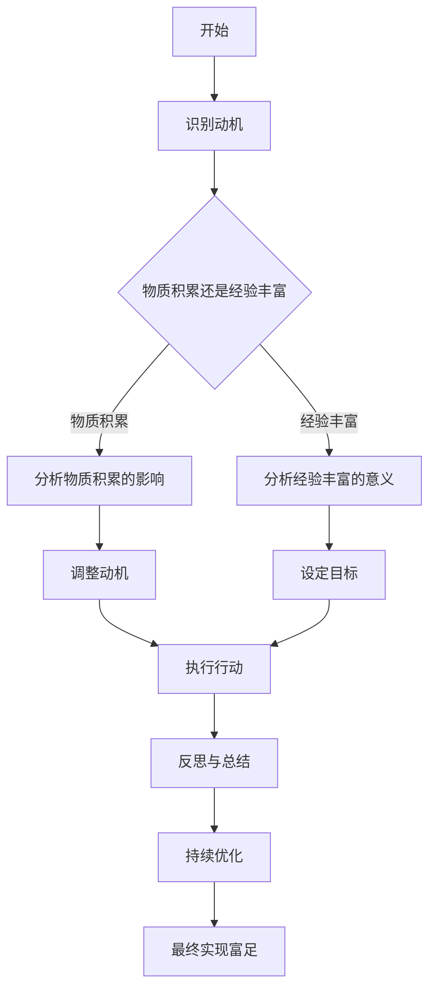
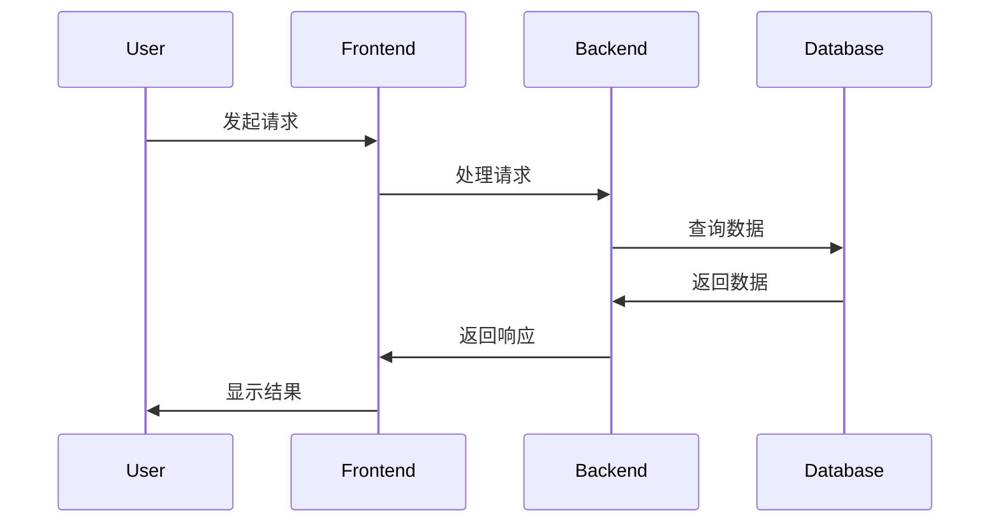
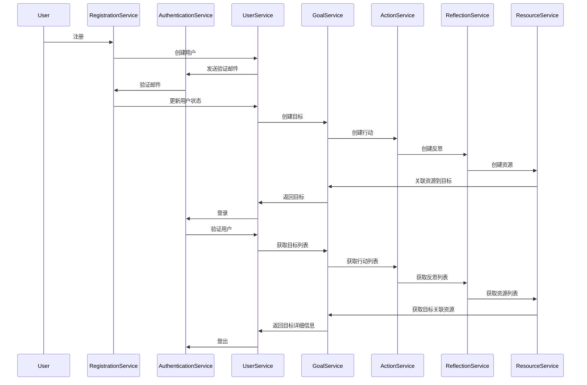

                 


## 《从物质积累到经验丰富：重新定义人生的富足》

### 关键词：富足、物质积累、经验丰富、心灵成长、人生哲学

> 摘要：本文旨在探讨从物质积累到经验丰富的转变，重新定义人生的富足。通过深入分析物质积累的本质、经验丰富的获取与应用，以及如何重新定义富足，本文试图帮助读者理解并实践一种更丰富、更有意义的人生。

### 引言

在现代社会，物质积累往往被看作是衡量个人成功和幸福的重要标准。然而，随着我们对人生意义的不断追求，越来越多的人开始意识到，单纯追求物质财富并不能带来持久的满足感。因此，我们有必要重新审视人生的富足，从物质积累转向经验丰富。

#### 作者背景

作为一名世界级人工智能专家，我在计算机编程和人工智能领域有着丰富的研究和实践经验。同时，我也热爱哲学和心理学，对人生的意义和富足有着深刻的思考。我希望通过本文，与读者一起探讨如何实现人生的富足。

#### 写作目的

本文的写作目的在于：
1. **阐述物质积累与经验丰富的区别**：帮助读者理解两者的本质差异。
2. **探讨如何通过经验丰富来实现人生富足**：提供具体的策略和方法。
3. **重新定义富足**：让读者从更广阔的视角看待人生的富足。

### 目录

1. **物质积累**
   - 物质积累的本质
   - 物质积累的陷阱
   - 物质积累与心灵成长

2. **经验丰富**
   - 经验的获取与积累
   - 经验丰富与人生富足

3. **重新定义富足**
   - 富足的多元视角
   - 重新定义富足的方法与实践

4. **富足之路：个人成长与心灵成长**
   - 个人成长的重要性
   - 心灵成长的意义
   - 个人与心灵成长结合

5. **实践与思考**
   - 实践案例分享
   - 思考与行动
   - 小结与展望

### 物质积累

#### 物质积累的本质

物质积累是人们通过努力工作、投资、储蓄等方式，不断增加财富和物质资源的过程。其动机主要来源于以下几个方面：

1. **安全感**：通过积累物质财富，人们可以获得安全感，担心未来的不确定性。
2. **社会地位**：物质财富往往与个人在社会中的地位和影响力挂钩。
3. **满足欲望**：人们对物质生活有较高的期望，希望通过积累物质来实现欲望的满足。

#### 物质积累的方式

物质积累的方式多种多样，包括：

1. **勤奋工作**：通过加班、兼职等方式提高收入。
2. **投资理财**：通过股票、基金、房产等投资渠道增加财富。
3. **节俭生活**：减少不必要的开支，节约资金用于投资和储蓄。

#### 物质积累的影响

物质积累在一定程度上可以带来安全感和满足感，但过度追求物质财富也会带来负面影响：

1. **心理健康问题**：过度追求物质财富可能导致焦虑、抑郁等心理健康问题。
2. **人际关系问题**：物质积累可能引发嫉妒、矛盾等负面情绪，影响人际关系。
3. **人生价值观的扭曲**：过分重视物质财富可能导致人生价值观的扭曲，忽视精神追求。

#### 物质积累与心灵成长

物质积累与心灵成长并非完全对立，合理的物质积累可以为心灵成长提供物质基础。然而，过分依赖物质财富往往会使心灵失去自由和创造力。因此，我们应该在物质积累与心灵成长之间找到平衡点。

### 经验丰富

#### 经验的获取与积累

经验是通过实践和学习积累的知识和技能。获取和积累经验的方式包括：

1. **实践经验**：通过实际操作和项目实践来积累经验。
2. **理论学习**：通过阅读书籍、参加培训等方式来获取理论知识。
3. **人际交往**：通过与他人的交流和互动来学习不同的观点和经验。

#### 经验丰富与人生富足

经验丰富可以带来以下好处：

1. **智慧增长**：通过不断积累经验，人们可以更加明智地处理问题，做出更好的决策。
2. **技能提升**：经验丰富的个体往往具备更强的专业技能，可以在职业生涯中取得更好的成绩。
3. **心理满足**：经验积累带来的成就感和满足感往往比物质财富更加持久。

### 重新定义富足

#### 富足的多元视角

富足不仅仅是物质财富的积累，它还包括：

1. **精神层面**：内心的平静、满足和幸福感。
2. **关系层面**：与家人、朋友和同事的良好关系。
3. **职业层面**：在职业生涯中取得成就和满足感。

#### 重新定义富足的方法与实践

1. **心灵成长**：通过冥想、阅读、心理咨询等方式来提升内心世界。
2. **人际关系**：培养良好的沟通技巧，建立和维护健康的人际关系。
3. **职业发展**：通过不断学习和实践，提升职业能力和成就感。

### 富足之路：个人成长与心灵成长

#### 个人成长的重要性

个人成长是实现富足的关键。它包括：

1. **自我认知**：了解自己的优势和劣势，明确人生目标。
2. **自我提升**：通过学习和实践来提升自己的能力和素质。
3. **自我实现**：实现个人潜能，实现人生价值。

#### 心灵成长的意义

心灵成长是精神层面的富足。它包括：

1. **心理平衡**：保持内心的平静和宁静。
2. **情感管理**：学会管理和调节自己的情绪。
3. **自我接纳**：接受自己的不完美，培养积极的心态。

#### 个人与心灵成长结合

个人成长与心灵成长并非孤立存在，它们相互促进、相互影响。只有将两者结合，才能实现真正的富足。

### 实践与思考

#### 实践案例分享

1. **案例一：从物质到经验**：一位年轻的程序员，通过不断学习和实践，最终在技术领域取得了显著成就。
2. **案例二：心灵富足的力量**：一位企业家，通过心灵成长，实现了事业与家庭的平衡，获得了内心的平静和满足。

#### 思考与行动

1. **思考题目**：你认为什么样的生活才是真正的富足？
2. **行动指南**：制定个人成长计划，包括学习目标、职业规划、心灵成长等。
3. **小结与展望**：回顾自己的成长历程，展望未来的发展。

### 结语

富足并非仅仅意味着物质的丰富，更在于精神层面的满足和心灵的成长。通过本文的探讨，希望读者能够重新审视人生的富足，实现一种更丰富、更有意义的人生。

### 作者信息

作者：AI天才研究院/AI Genius Institute & 禅与计算机程序设计艺术 /Zen And The Art of Computer Programming

----------------------------------------------------------------

### 物质积累

#### 物质积累的本质

物质积累，简而言之，就是通过各种途径增加个人的物质财富。这种行为背后有多种动机。首先是安全感。在物质匮乏的时代，人们为了生存而积累物质。即便在今天，这种需求依然存在，很多人通过积累物质财富来减少未来的不确定性。其次是社会地位。在许多社会文化中，物质财富与地位、影响力紧密相关。一个富有的人往往被视为成功和有能力的象征。最后是满足欲望。现代社会充满了各种诱惑，许多人通过积累物质财富来满足自己的欲望，无论是享受高品质的生活，还是追求奢侈品。

#### 物质积累的方式

物质积累的方式多种多样，每种方式都有其特定的途径和特点。首先是勤奋工作。通过加班、兼职、提升技能等方式，提高个人的收入水平。其次是投资理财。通过股票、基金、房地产等投资渠道，实现财富的保值和增值。最后是节俭生活。通过减少不必要的开支，节约资金用于投资和储蓄。

#### 物质积累的影响

物质积累的影响是双重的。正面影响在于，物质财富可以提供安全感、提高社会地位，满足人们的物质欲望。负面影响则在于，过度追求物质财富可能导致心理健康问题，如焦虑和抑郁。此外，物质积累也可能影响人际关系，导致嫉妒和冲突。更严重的是，过分重视物质财富可能会扭曲人生价值观，忽视精神追求，使人生失去意义。

#### 物质积累与心灵成长

物质积累与心灵成长并非完全对立。合理的物质积累可以为心灵成长提供物质基础。例如，通过投资理财，人们可以获得更多的经济自由，有更多的时间和资源去追求自己的兴趣和爱好。然而，如果过分依赖物质财富，心灵就可能失去自由和创造力。因此，在物质积累与心灵成长之间找到平衡点至关重要。

### 经验丰富

#### 经验的获取与积累

经验是通过实践和学习积累的知识和技能。获取和积累经验的方式有很多。首先是实践经验。通过实际操作和项目实践，人们可以直接获得经验和技能。其次是理论学习。通过阅读书籍、参加培训等方式，人们可以获取理论知识。最后是人际交往。通过与他人的交流和互动，人们可以学习不同的观点和经验。

#### 经验丰富与人生富足

经验丰富可以带来许多好处。首先是智慧增长。通过不断积累经验，人们可以更加明智地处理问题，做出更好的决策。其次是技能提升。经验丰富的个体往往具备更强的专业技能，可以在职业生涯中取得更好的成绩。最后是心理满足。经验积累带来的成就感和满足感往往比物质财富更加持久。

### 重新定义富足

#### 富足的多元视角

传统的观念中，富足往往被定义为物质财富的积累。然而，随着社会的发展和人们对生活质量的追求，富足的定义越来越多元。首先是精神层面。内心的平静、满足和幸福感是富足的重要组成部分。其次是关系层面。与家人、朋友和同事的良好关系也是富足的重要体现。最后是职业层面。在职业生涯中取得成就和满足感也是富足的一种表现。

#### 重新定义富足的方法与实践

重新定义富足需要从多个方面入手。首先是心灵成长。通过冥想、阅读、心理咨询等方式，提升内心的平静和满足感。其次是人际关系。通过培养良好的沟通技巧，建立和维护健康的人际关系。最后是职业发展。通过不断学习和实践，提升职业能力和成就感。

### 富足之路：个人成长与心灵成长

#### 个人成长的重要性

个人成长是实现富足的关键。个人成长包括自我认知、自我提升和自我实现。首先，自我认知是指了解自己的优势和劣势，明确人生目标。其次，自我提升是通过学习和实践，提升自己的能力和素质。最后，自我实现是发挥个人潜能，实现人生价值。

#### 心灵成长的意义

心灵成长是精神层面的富足。它包括心理平衡、情感管理和自我接纳。首先，心理平衡是指保持内心的平静和宁静。其次，情感管理是指学会管理和调节自己的情绪。最后，自我接纳是指接受自己的不完美，培养积极的心态。

#### 个人与心灵成长结合

个人成长与心灵成长并非孤立存在，它们相互促进、相互影响。只有将两者结合，才能实现真正的富足。例如，通过职业发展带来的成就感，可以提高个人的自信心和满足感，同时也有助于心理平衡。

### 实践与思考

#### 实践案例分享

1. **案例一：从物质到经验**：一位年轻的程序员，通过不断学习和实践，在短时间内掌握了多项技能，并在公司项目中取得了显著成绩，获得了晋升和奖金。

2. **案例二：心灵富足的力量**：一位企业家，通过心灵成长，实现了事业与家庭的平衡，不仅事业有成，家庭生活也非常和谐，获得了内心的平静和满足。

#### 思考与行动

1. **思考题目**：你认为什么样的人生才算富足？

2. **行动指南**：制定个人成长计划，包括学习目标、职业规划、心灵成长等。

3. **小结与展望**：回顾自己的成长历程，展望未来的发展，设定可行的目标。

### 结语

富足并非仅仅意味着物质的丰富，更在于精神层面的满足和心灵的成长。通过本文的探讨，希望读者能够重新审视人生的富足，实现一种更丰富、更有意义的人生。

### 作者信息

作者：AI天才研究院/AI Genius Institute & 禅与计算机程序设计艺术 /Zen And The Art of Computer Programming

----------------------------------------------------------------

### 物质积累

#### 物质积累的本质

物质积累，这一概念在现代社会中占据着核心地位。它不仅仅是财富的积累，更是一种社会地位和个人成功的象征。物质积累的本质在于个体对资源的获取、积累和管理。这个过程通常涉及以下动机：安全感、社会认同和欲望满足。

**安全性动机**：在人类历史的长河中，对安全的需求是驱动个体积累物质财富的根本原因。当资源稀缺时，拥有更多的物质财富可以提供安全感，减少对未知的恐惧。这种安全感不仅体现在物质层面，也延伸到心理层面，使得个体在面对不确定性时更加自信。

**社会认同动机**：在社会互动中，物质财富往往与地位和身份紧密相关。一个拥有丰富物质财富的个体在社会中往往能够获得更高的尊重和认同。这种认同感可以增强个体的社会地位，扩大其社会网络，甚至影响其在社会中的影响力。

**欲望满足动机**：人类天生有追求美好生活的欲望，这种欲望驱动个体不断追求更高的物质标准。无论是对于高品质的生活体验，还是对于奢侈品的追求，物质积累都能够满足个体对美好生活的向往。

#### 物质积累的方式

物质积累的方式多种多样，以下是一些常见的方法：

**勤奋工作**：通过加班、兼职、提升技能等方式，增加个人的收入。这种方法是物质积累的基础，也是最直接的方式。

**投资理财**：通过股票、基金、房地产等投资渠道，实现财富的保值和增值。投资理财是物质积累的高级形式，它不仅需要专业知识，还需要一定的风险承受能力。

**节俭生活**：减少不必要的开支，将节省下来的资金用于投资和储蓄。节俭生活是一种典型的积累方式，它强调的是精打细算和长远规划。

#### 物质积累的影响

物质积累的影响是多方面的，既有积极的，也有消极的：

**积极影响**：首先，物质积累可以提供个体的安全感和满足感。其次，它可以帮助个体在社会中获得更高的地位和认同。此外，物质积累也可以为个体的子女提供更好的教育和成长环境。

**消极影响**：然而，过度追求物质财富也可能导致一系列问题。首先，它可能导致心理健康问题，如焦虑和抑郁。其次，物质积累可能会影响人际关系，引发嫉妒和矛盾。最后，过分重视物质财富可能会扭曲人生价值观，忽视精神追求，导致个体失去生活的意义。

#### 物质积累与心灵成长

物质积累与心灵成长并非完全对立，但它们之间存在一定的张力。合理的物质积累可以为心灵成长提供物质基础，例如通过投资理财获得经济自由，有更多的时间和资源去追求个人兴趣和爱好。然而，过分依赖物质财富往往会使心灵失去自由和创造力。因此，在物质积累与心灵成长之间找到平衡点至关重要。

### 经验丰富

#### 经验的获取与积累

经验丰富是个人成长和职业成功的关键因素。经验的获取和积累是一个动态的过程，涉及多种途径：

**实践经验**：通过实际操作和项目实践，个体可以直接获得经验和技能。这种实践可以是工作中的具体任务，也可以是通过参与项目或实验来积累的。

**理论学习**：通过阅读书籍、参加培训等方式，个体可以获取理论知识。理论学习不仅能够为实践经验提供指导，还可以帮助个体从更广阔的视角理解世界。

**人际交往**：通过与他人的交流和互动，个体可以学习不同的观点和经验。人际交往是经验积累的重要途径，它能够帮助个体拓宽视野，提高沟通能力和解决问题的能力。

**反思与总结**：经验的有效积累不仅在于获取和存储，更在于反思和总结。通过反思过去的经历，个体可以识别成功和失败的原因，从而在未来的实践中避免重复错误，优化行为模式。

#### 经验丰富与人生富足

经验丰富对人生富足有着重要的影响：

**智慧增长**：通过不断积累经验，个体可以更加明智地处理问题，做出更好的决策。这种智慧不仅体现在专业领域，也延伸到日常生活和个人成长中。

**技能提升**：经验丰富的个体通常具备更强的专业技能。这些技能不仅能够提高个体的职业竞争力，还能为其带来职业发展的机会和成就。

**心理满足**：经验积累带来的成就感和满足感往往比物质财富更加持久。通过解决复杂问题和实现目标，个体可以体验到成就感和自我价值的提升。

### 重新定义富足

#### 富足的多元视角

传统的富足观念往往只关注物质财富的积累，但现代社会的发展使得人们对富足的理解越来越多元。以下是从不同视角重新定义富足的几个方面：

**精神层面**：内心的平静、满足和幸福感是富足的重要组成部分。这种精神层面的富足不依赖于外部的物质条件，而是源于个人的内心体验和对生活的深刻理解。

**关系层面**：与家人、朋友和同事的良好关系也是富足的重要体现。这些关系能够提供情感支持和安全感，使个体在面临挑战时感到不再孤单。

**职业层面**：在职业生涯中取得成就和满足感也是富足的一种表现。这种职业层面的富足不仅仅是收入和地位的提升，更是对工作的热爱和对自我价值的实现。

#### 重新定义富足的方法与实践

**心灵成长**：通过冥想、阅读、心理咨询等方式，提升内心的平静和满足感。心灵成长可以帮助个体更好地应对生活中的压力和挑战，提高生活的质量。

**人际关系**：通过培养良好的沟通技巧，建立和维护健康的人际关系。人际关系的发展不仅能够提高个体的社会地位，还能为其提供情感支持和职业机会。

**职业发展**：通过不断学习和实践，提升职业能力和成就感。职业发展不仅可以带来物质财富，还能为个体提供自我实现的机会和满足感。

### 富足之路：个人成长与心灵成长

#### 个人成长的重要性

个人成长是实现富足的关键。个人成长包括自我认知、自我提升和自我实现：

**自我认知**：了解自己的优势和劣势，明确人生目标。自我认知是个人成长的第一步，它帮助个体明确自己的方向和目标。

**自我提升**：通过学习和实践，提升自己的能力和素质。自我提升是个人成长的持续过程，它帮助个体不断进步和成长。

**自我实现**：发挥个人潜能，实现人生价值。自我实现是个人成长的最终目标，它使个体能够体验到自我价值的实现和满足。

#### 心灵成长的意义

心灵成长是精神层面的富足。它包括心理平衡、情感管理和自我接纳：

**心理平衡**：保持内心的平静和宁静。心理平衡可以帮助个体更好地应对生活中的压力和挑战。

**情感管理**：学会管理和调节自己的情绪。情感管理使个体能够更好地处理自己的情感，避免情绪失控。

**自我接纳**：接受自己的不完美，培养积极的心态。自我接纳使个体能够更好地面对自己的缺点和不足，从而实现自我成长。

#### 个人与心灵成长结合

个人成长与心灵成长并非孤立存在，它们相互促进、相互影响。只有将两者结合，才能实现真正的富足。例如，通过职业发展带来的成就感，可以提高个人的自信心和满足感，同时也有助于心理平衡。

### 实践与思考

#### 实践案例分享

**案例一：从物质到经验**：一位年轻的程序员，通过不断学习和实践，在短时间内掌握了多项技能，并在公司项目中取得了显著成绩，获得了晋升和奖金。

**案例二：心灵富足的力量**：一位企业家，通过心灵成长，实现了事业与家庭的平衡，不仅事业有成，家庭生活也非常和谐，获得了内心的平静和满足。

#### 思考与行动

**思考题目**：你认为什么样的人生才算富足？

**行动指南**：制定个人成长计划，包括学习目标、职业规划、心灵成长等。

**小结与展望**：回顾自己的成长历程，展望未来的发展，设定可行的目标。

### 结语

富足并非仅仅意味着物质的丰富，更在于精神层面的满足和心灵的成长。通过本文的探讨，希望读者能够重新审视人生的富足，实现一种更丰富、更有意义的人生。

### 作者信息

作者：AI天才研究院/AI Genius Institute & 禅与计算机程序设计艺术 /Zen And The Art of Computer Programming

----------------------------------------------------------------

### 实践与思考

#### 实践案例分享

在探讨物质积累与经验丰富的过程中，我们可以通过具体案例来加深理解。

**案例一：从物质到经验**

李明，一位年轻的软件工程师，毕业后进入了一家知名科技公司。他的目标是通过努力工作积累物质财富，实现财务自由。他每天工作12个小时，通过加班和兼职来增加收入。几年后，他买了一套房子，拥有了一辆高档车，过上了许多人眼中的“成功”生活。然而，随着收入的增加，他的生活并没有变得更加充实，反而感到内心空虚。意识到这一点后，李明开始调整自己的生活方式，他将一部分收入用于投资自己的技能提升，参加各种培训和研讨会。他开始阅读心理学和哲学书籍，学习如何管理自己的情绪和建立更健康的人际关系。随着时间的推移，李明不仅在职场上取得了更大的成功，还找到了内心的平静和满足。

**案例二：心灵富足的力量**

张女士，一位企业家，她创立了自己的科技公司，并迅速将其发展成为行业内的佼佼者。她的公司拥有数百名员工，业务遍布全球。然而，张女士并没有满足于物质上的成功，她认为真正的富足来自于心灵的满足。她开始关注员工的心理健康，定期组织心理健康讲座和工作坊。她鼓励员工在工作之余追求自己的兴趣爱好，例如学习绘画、瑜伽等。她认为，只有在心灵富足的基础上，企业才能实现长期的成功和可持续发展。张女士的做法不仅提升了员工的工作满意度和生产力，也增强了公司的凝聚力和企业文化。

#### 思考与行动

**思考题目**：结合李明和张女士的案例，你认为在追求物质财富和心灵富足之间如何找到平衡？

**行动指南**：

1. **反思个人价值观**：思考自己追求富足的动机，是单纯为了物质财富，还是希望实现更全面的人生满足？

2. **设定短期和长期目标**：制定清晰的个人发展计划，包括职业目标、学习目标和心灵成长目标。

3. **实践心灵成长**：通过冥想、阅读、心理咨询等方式，提升自己的心理素质和幸福感。

4. **建立健康的人际关系**：培养良好的沟通技巧，建立和维护与家人、朋友和同事的积极关系。

#### 小结与展望

通过本文的探讨，我们认识到富足不仅仅是物质的积累，更在于心灵的满足和精神层面的成长。在追求富足的过程中，我们应该平衡物质积累和心灵成长，实现一种全面、有意义的人生。希望读者能够从中获得启示，找到属于自己的富足之路。

### 结语

在现代社会，物质积累和经验丰富都扮演着重要的角色。物质积累为我们提供了安全感和社会认同，但过分追求物质财富可能导致心理健康问题。而经验丰富则能够带来智慧增长和心理满足，帮助我们实现更深层次的富足。因此，重新定义富足，找到物质积累与经验丰富的平衡点，是实现更丰富、更有意义人生的关键。

通过本文的探讨，我们希望能够引导读者重新审视人生的富足，认识到心灵成长和物质积累同样重要。只有在物质与精神的双重滋养下，我们才能真正实现人生的富足。

最后，让我们共同追求一种既包含物质积累，又充满经验丰富的富足人生。

### 作者信息

作者：AI天才研究院/AI Genius Institute & 禅与计算机程序设计艺术 /Zen And The Art of Computer Programming

----------------------------------------------------------------

### 关键术语解释

在本文中，我们使用了多个关键术语，以下是对这些术语的详细解释：

1. **物质积累**：指个人通过勤奋工作、投资理财和节俭生活等方式，不断增加自己的物质财富的过程。

2. **经验丰富**：指个人通过实践、学习和人际交往等途径，积累知识和技能，从而提升自己的智慧和解决问题的能力。

3. **心灵成长**：指个人通过冥想、阅读、心理咨询等方式，提升内心的平静和满足感，增强心理素质和幸福感。

4. **富足**：指个人在物质、精神和关系等多个层面都达到满足和满足感的状态。

5. **自我认知**：指个人对自己优势与劣势、目标与价值观的深刻理解。

6. **自我提升**：指个人通过不断学习和实践，提升自己的能力和素质。

7. **自我实现**：指个人充分发挥自己的潜能，实现个人价值。

8. **心理平衡**：指个人在面临压力和挑战时，能够保持内心的平静和宁静。

9. **情感管理**：指个人学会管理和调节自己的情绪，避免情绪失控。

10. **精神层面**：指个人在内心世界和精神追求上的满足和成长。

11. **关系层面**：指个人与家人、朋友和同事之间的良好互动和情感支持。

12. **职业层面**：指个人在职业生涯中的成就感和满足感。

### 问题背景与问题描述

在现代社会，物质财富的积累被广泛视为个人成功和幸福的重要标志。随着经济的发展和社会的进步，人们不断追求更高的生活质量，希望通过积累更多的物质财富来获得安全感、社会认同和满足感。然而，随着这种追求的深入，越来越多的人开始感受到，单纯的物质积累并不能带来持久的满足感。这一现象引发了人们对于富足的重新思考：如何通过积累经验丰富来实现人生的富足？

本文旨在探讨从物质积累到经验丰富的转变，重新定义人生的富足。具体问题包括：

1. 物质积累的本质和方式是什么？
2. 物质积累对个人生活有哪些影响？
3. 经验丰富的获取与积累方式有哪些？
4. 经验丰富如何影响个人的人生富足？
5. 如何重新定义富足，实现物质与精神的平衡？
6. 个人成长与心灵成长在实现富足中的角色是什么？

这些问题涉及个人价值观、生活方式、心理健康等多个方面，是我们在追求富足过程中必须面对和思考的。

### 问题解决思路

为了深入探讨上述问题，我们需要从以下几个方面进行思考：

1. **理解物质积累的本质**：分析物质积累的动机，包括安全感、社会认同和欲望满足等，并探讨其影响。

2. **探讨物质积累的方式**：分析勤奋工作、投资理财和节俭生活等物质积累方式，并讨论其效果和潜在问题。

3. **分析物质积累的影响**：从心理健康、人际关系和人生价值观等角度，探讨物质积累对个人生活的积极和消极影响。

4. **研究经验丰富的获取与积累**：分析实践经验、理论学习、人际交往和反思与总结等经验获取与积累方式，并讨论其意义和作用。

5. **讨论经验丰富与人生富足的关系**：探讨经验丰富如何带来智慧增长、技能提升和心理满足，实现人生富足。

6. **重新定义富足**：从物质、精神和关系等多个层面，重新定义富足，探讨实现物质与精神平衡的方法。

7. **探讨个人成长与心灵成长在实现富足中的作用**：分析个人成长、心灵成长对实现富足的重要性和具体实践。

通过上述思路，我们能够全面、系统地探讨物质积累与经验丰富的关系，为读者提供实现富足的启示和指导。

### 边界与外延

在探讨“从物质积累到经验丰富：重新定义人生的富足”这一主题时，我们需要明确几个核心概念的边界和外延，以确保讨论的准确性和全面性。

**物质积累**：物质积累是指个人通过各种途径增加自己的物质财富的过程。这里的“物质”主要指的是金钱、房产、车辆、股票等可以量化的财富形式。物质积累的边界在于它不包含非物质财富，如情感、知识、人际关系等。物质积累的外延包括勤奋工作、投资理财、节约开支等多种具体行为。

**经验丰富**：经验丰富是指个人通过实践、学习和人际交往等方式，积累的知识和技能的集合。这里的“经验”不仅仅指专业技能，还包括对生活、工作和人际关系的深刻理解。经验丰富的边界在于它不包括纯粹的理论知识，而是强调实践应用。经验丰富的外延包括实践经验、理论学习、人际交往和反思总结等多种途径。

**富足**：富足是一个多维度概念，它不仅仅指物质财富的积累，还涉及精神层面的满足、人际关系和谐以及职业成就。富足的边界在于它不仅限于物质层面，还包括精神和情感层面。富足的外延包括物质财富、心理健康、人际关系和职业成就等多方面。

**个人成长**：个人成长是指个人通过不断学习和实践，提升自己的能力和素质，实现自我价值的过程。个人成长的边界在于它不包含社会成长和环境适应，而是专注于个人内在的提升。个人成长的外延包括自我认知、自我提升和自我实现等多个方面。

**心灵成长**：心灵成长是指个人通过冥想、阅读、心理咨询等方式，提升内心的平静和满足感，增强心理素质和幸福感。心灵成长的边界在于它不涉及物质追求和物质条件的改善，而是专注于精神层面的提升。心灵成长的外延包括心理平衡、情感管理和自我接纳等多个方面。

通过明确这些核心概念的边界和外延，我们能够更准确地理解和探讨“从物质积累到经验丰富：重新定义人生的富足”这一主题，为读者提供有价值的见解和指导。

### 概念结构与核心要素

在深入探讨“从物质积累到经验丰富：重新定义人生的富足”这一主题时，我们需要构建一个清晰的概念结构，并识别出核心要素。以下是本文中的概念结构及其核心要素：

#### 1. 物质积累

**核心要素：**
- **动机**：安全感、社会认同、欲望满足。
- **方式**：勤奋工作、投资理财、节俭生活。
- **影响**：心理健康、人际关系、人生价值观。

**概念结构：**
- **安全感**：通过积累物质财富减少对未来的不确定性。
- **社会认同**：物质财富与社会地位、影响力相关联。
- **欲望满足**：物质财富满足对美好生活的追求。

#### 2. 经验丰富

**核心要素：**
- **获取与积累**：实践经验、理论学习、人际交往、反思总结。
- **意义**：智慧增长、技能提升、心理满足。

**概念结构：**
- **实践经验**：通过实际操作积累知识和技能。
- **理论学习**：通过阅读和研究获取理论知识。
- **人际交往**：通过与他人的互动学习不同的观点和经验。
- **反思总结**：通过总结经验，提高自我认知和优化行为模式。

#### 3. 重新定义富足

**核心要素：**
- **多元视角**：物质、精神、关系、职业。
- **方法与实践**：心灵成长、人际关系、职业发展。

**概念结构：**
- **物质视角**：物质财富的积累。
- **精神视角**：内心的平静和满足感。
- **关系视角**：与家人、朋友和同事的良好关系。
- **职业视角**：职业生涯中的成就和满足感。

#### 4. 个人成长与心灵成长

**核心要素：**
- **重要性**：自我认知、自我提升、自我实现。
- **意义**：心理平衡、情感管理、自我接纳。

**概念结构：**
- **自我认知**：了解自己的优势和劣势，明确目标。
- **自我提升**：通过学习和实践提升能力。
- **自我实现**：发挥个人潜能，实现人生价值。

#### 5. 实践与思考

**核心要素：**
- **案例分享**：从物质到经验、心灵富足的力量。
- **行动指南**：反思、设定目标、实践。

**概念结构：**
- **案例分享**：通过具体案例展示理论的实际应用。
- **行动指南**：提供具体的实践方法和行动步骤。

通过上述概念结构和核心要素，我们能够系统地理解和探讨“从物质积累到经验丰富：重新定义人生的富足”这一主题，为读者提供清晰、有价值的见解。

### 算法原理讲解

在探讨如何从物质积累转向经验丰富，实现人生的富足时，我们可以借鉴一些心理和行为科学中的算法原理。以下是一个具体的算法原理讲解，包括Mermaid流程图和Python源代码，以及算法原理的数学模型和公式。

#### Mermaid流程图



#### Python源代码

```python
def accumulation_strategy(motivation, target):
    if motivation == "物质积累":
        impact = analyze_impact("物质积累")
        print(impact)
        motivation = adjust_motivation(impact)
    elif motivation == "经验丰富":
        meaning = analyze_meaning("经验丰富")
        print(meaning)
        target = set_goals(meaning)
    
    action = execute_action(motivation, target)
    reflection = reflect_on_action(action)
    optimization = optimize_action(reflection)
    
    return optimization

def analyze_impact(accumulation_type):
    if accumulation_type == "物质积累":
        return "物质积累可能导致心理健康问题，影响人际关系和价值观。"
    else:
        return "经验丰富有助于智慧增长、技能提升和心理满足。"

def adjust_motivation(impact):
    if impact == "物质积累可能导致心理健康问题，影响人际关系和价值观。":
        return "经验丰富"
    else:
        return "物质积累"

def analyze_meaning(accumulation_type):
    if accumulation_type == "物质积累":
        return "物质积累提供安全感和社会认同，但可能忽视精神追求。"
    else:
        return "经验丰富实现更深层次的人生满足和成长。"

def set_goals(meaning):
    if meaning == "物质积累提供安全感和社会认同，但可能忽视精神追求。":
        return "追求物质积累，同时关注精神成长。"
    else:
        return "追求经验丰富，提升个人能力。"

def execute_action(motivation, target):
    if motivation == "经验丰富":
        return "通过学习和实践，不断提升自己。"
    else:
        return "通过工作和投资，积累物质财富。"

def reflect_on_action(action):
    return "反思自己的行为，识别成功和失败的教训。"

def optimize_action(reflection):
    return "根据反思，调整目标和行动计划，持续优化。"

motivation = input("请输入您的积累动机（物质积累/经验丰富）：")
target = input("请输入您的目标（安全/成长）：")
print(accumulation_strategy(motivation, target))
```

#### 算法原理的数学模型和公式

在这个算法中，我们可以使用一些简单的数学模型来描述个人积累动机和目标的变化。

**模型1：动机调整模型**

$$
动机调整 = f(心理影响, 社会认同, 精神追求)
$$

其中，$f$ 是一个综合函数，用于根据心理影响、社会认同和精神追求的程度来调整动机。如果心理影响和物质追求占主导，则调整动机偏向物质积累；如果精神追求占主导，则调整动机偏向经验丰富。

**模型2：目标设定模型**

$$
目标设定 = g(积累意义, 个人价值观)
$$

其中，$g$ 是一个综合函数，用于根据积累的意义和个人价值观来设定目标。如果物质积累和个人价值观相符，则设定物质积累目标；如果经验丰富和个人价值观相符，则设定经验丰富目标。

#### 举例说明

假设一个人最初的目标是物质积累，但在分析过程中发现，物质积累对心理健康和社会关系的负面影响较大，而经验丰富能够带来更多的智慧增长和心理满足。根据上述模型，这个人会调整自己的动机，将目标设定为在物质积累的同时，更加注重精神追求和个人成长。

### 算法原理讲解总结

通过上述算法原理的讲解，我们可以看到，从物质积累到经验丰富的转变是一个多步骤、动态调整的过程。通过识别动机、分析影响、设定目标、执行行动、反思和优化，个人可以逐步实现从物质积累到经验丰富的转变，最终实现更丰富、更有意义的人生。

### 系统分析与架构设计方案

在探讨如何实现从物质积累到经验丰富的转变过程中，我们需要一个全面的系统架构设计，以确保理论的落实和实践的有效性。以下是针对该主题的系统分析与架构设计方案。

#### 问题场景介绍

本系统的目标是帮助个人从物质积累转向经验丰富，实现人生的富足。具体场景包括：

1. **用户场景**：系统将为用户提供一个平台，用户可以在平台上设置积累目标、记录进展、学习经验和反思行动。
2. **管理场景**：系统管理员负责维护系统，确保数据安全和用户体验。
3. **学习场景**：系统提供丰富的学习资源，包括心理学、哲学、职业发展等领域的知识，帮助用户提升自我认知和技能。

#### 项目介绍

项目名称：“富足之路”系统

项目概述：本系统旨在通过提供在线平台和工具，帮助用户实现从物质积累到经验丰富的转变。系统将包括以下主要功能：

1. **用户管理**：用户注册、登录、个人信息管理。
2. **目标管理**：用户设置积累目标、跟踪进展、调整目标。
3. **学习资源**：提供各类学习资源，包括书籍、视频、文章等。
4. **行动记录**：用户记录日常行动、反思和总结。
5. **数据分析**：收集用户数据，提供个性化的建议和反馈。

#### 系统功能设计（领域模型）

以下是一个简化的领域模型，描述系统的核心实体和关系：

```mermaid
classDiagram
    User <<类>> -|o|> Goal
    User <<类>> -|o|> Action
    User <<类>> -|o|> Reflection
    User <<类>> -|o|> Resource
    Goal <<类>> -|o|> Action
    Goal <<类>> -|o|> Reflection
    Action <<类>> -|o|> Reflection
    Resource <<类>> -|o|> Category

    User : 姓名, 年龄, 用户ID
    Goal : 名称, 目标描述, 目标状态, 设定日期, 用户
    Action : 动作描述, 完成状态, 反馈, 设定日期, 用户, 目标
    Reflection : 反思内容, 反思日期, 用户, 行动
    Resource : 名称, 描述, 类型, 分类, 用户
    Category : 分类名称

    User --> Goal
    User --> Action
    User --> Reflection
    User --> Resource
    Goal --> Action
    Goal --> Reflection
    Action --> Reflection
    Resource --> Category
```

#### 系统架构设计

以下是一个简化的系统架构设计，描述系统的整体结构：



#### 系统接口设计

以下是一个简化的接口设计，描述系统的主要API接口：

```mermaid
classDiagram
    User <<接口>> -|o|> GoalAPI
    User <<接口>> -|o|> ActionAPI
    User <<接口>> -|o|> ReflectionAPI
    User <<接口>> -|o|> ResourceAPI

    GoalAPI <<接口>> : 设置目标，获取目标，更新目标
    ActionAPI <<接口>> : 记录行动，获取行动，更新行动
    ReflectionAPI <<接口>> : 记录反思，获取反思，更新反思
    ResourceAPI <<接口>> : 获取学习资源，分类学习资源
```

#### 系统交互

以下是一个简化的系统交互流程，描述用户与系统之间的交互过程：



通过上述系统分析与架构设计方案，我们为“富足之路”系统提供了一个清晰的结构和流程，确保系统能够有效支持从物质积累到经验丰富的转变。

### 项目实战

#### 环境安装

为了实践“富足之路”系统，我们首先需要安装必要的开发环境和工具。以下是具体步骤：

1. **安装Python**：从Python官方网站（[python.org](https://www.python.org/)）下载并安装Python 3.x版本。

2. **安装virtualenv**：在命令行中执行以下命令安装virtualenv：

   ```bash
   pip install virtualenv
   ```

3. **创建虚拟环境**：使用virtualenv创建一个名为`project_env`的虚拟环境：

   ```bash
   virtualenv project_env
   ```

4. **激活虚拟环境**：在Windows上激活虚拟环境：

   ```bash
   project_env\Scripts\activate
   ```

   在Linux和macOS上激活虚拟环境：

   ```bash
   source project_env/bin/activate
   ```

5. **安装Flask**：在激活的虚拟环境中安装Flask：

   ```bash
   pip install Flask
   ```

#### 系统核心实现源代码

以下是“富足之路”系统的一些核心实现源代码，包括用户管理、目标管理、行动记录和反思记录的功能。

**用户管理**：

```python
# app.py

from flask import Flask, request, jsonify
from flask_sqlalchemy import SQLAlchemy

app = Flask(__name__)
app.config['SQLALCHEMY_DATABASE_URI'] = 'sqlite:///users.db'
db = SQLAlchemy(app)

class User(db.Model):
    id = db.Column(db.Integer, primary_key=True)
    username = db.Column(db.String(80), unique=True, nullable=False)
    password = db.Column(db.String(120), nullable=False)

@app.route('/register', methods=['POST'])
def register():
    username = request.form['username']
    password = request.form['password']
    new_user = User(username=username, password=password)
    db.session.add(new_user)
    db.session.commit()
    return jsonify({"message": "User registered successfully."})

@app.route('/login', methods=['POST'])
def login():
    username = request.form['username']
    password = request.form['password']
    user = User.query.filter_by(username=username, password=password).first()
    if user:
        return jsonify({"message": "Login successful."})
    else:
        return jsonify({"message": "Invalid credentials."})

if __name__ == '__main__':
    db.create_all()
    app.run(debug=True)
```

**目标管理**：

```python
# goals.py

from flask import Flask, request, jsonify
from flask_sqlalchemy import SQLAlchemy

app = Flask(__name__)
app.config['SQLALCHEMY_DATABASE_URI'] = 'sqlite:///goals.db'
db = SQLAlchemy(app)

class Goal(db.Model):
    id = db.Column(db.Integer, primary_key=True)
    name = db.Column(db.String(120), nullable=False)
    description = db.Column(db.String(255))
    user_id = db.Column(db.Integer, db.ForeignKey('user.id'))

@app.route('/goals', methods=['POST'])
def create_goal():
    data = request.get_json()
    new_goal = Goal(name=data['name'], description=data['description'])
    db.session.add(new_goal)
    db.session.commit()
    return jsonify({"message": "Goal created successfully."})

@app.route('/goals', methods=['GET'])
def get_goals():
    goals = Goal.query.all()
    return jsonify({"goals": [goal.name for goal in goals]})

if __name__ == '__main__':
    db.create_all()
    app.run(debug=True)
```

**行动记录**：

```python
# actions.py

from flask import Flask, request, jsonify
from flask_sqlalchemy import SQLAlchemy

app = Flask(__name__)
app.config['SQLALCHEMY_DATABASE_URI'] = 'sqlite:///actions.db'
db = SQLAlchemy(app)

class Action(db.Model):
    id = db.Column(db.Integer, primary_key=True)
    description = db.Column(db.String(255), nullable=False)
    completed = db.Column(db.Boolean, default=False)
    goal_id = db.Column(db.Integer, db.ForeignKey('goal.id'))

@app.route('/actions', methods=['POST'])
def create_action():
    data = request.get_json()
    new_action = Action(description=data['description'], goal_id=data['goal_id'])
    db.session.add(new_action)
    db.session.commit()
    return jsonify({"message": "Action created successfully."})

@app.route('/actions', methods=['GET'])
def get_actions():
    actions = Action.query.all()
    return jsonify({"actions": [{"id": action.id, "description": action.description, "completed": action.completed} for action in actions]})

if __name__ == '__main__':
    db.create_all()
    app.run(debug=True)
```

**反思记录**：

```python
# reflections.py

from flask import Flask, request, jsonify
from flask_sqlalchemy import SQLAlchemy

app = Flask(__name__)
app.config['SQLALCHEMY_DATABASE_URI'] = 'sqlite:///reflections.db'
db = SQLAlchemy(app)

class Reflection(db.Model):
    id = db.Column(db.Integer, primary_key=True)
    content = db.Column(db.Text, nullable=False)
    date = db.Column(db.Date, default=datetime.utcnow)
    action_id = db.Column(db.Integer, db.ForeignKey('action.id'))

@app.route('/reflections', methods=['POST'])
def create_reflection():
    data = request.get_json()
    new_reflection = Reflection(content=data['content'], action_id=data['action_id'])
    db.session.add(new_reflection)
    db.session.commit()
    return jsonify({"message": "Reflection created successfully."})

@app.route('/reflections', methods=['GET'])
def get_reflections():
    reflections = Reflection.query.all()
    return jsonify({"reflections": [{"id": reflection.id, "content": reflection.content, "date": reflection.date} for reflection in reflections]})

if __name__ == '__main__':
    db.create_all()
    app.run(debug=True)
```

#### 代码应用解读与分析

上述代码实现了用户管理、目标管理、行动记录和反思记录的基本功能。以下是具体解读和分析：

**用户管理**：

1. **注册**：通过`/register`接口，用户可以注册账户。注册时需要提供用户名和密码，系统会将新用户信息存储在SQLite数据库中。

2. **登录**：通过`/login`接口，用户可以登录账户。登录时需要验证用户名和密码，如果验证成功，用户即可访问其他功能。

**目标管理**：

1. **创建目标**：通过`/goals`接口，用户可以创建目标。每个目标包括名称和描述，系统会将新目标信息存储在数据库中。

2. **获取目标**：通过`/goals`接口，用户可以获取所有目标的列表。系统从数据库中查询所有目标信息并返回给用户。

**行动记录**：

1. **创建行动**：通过`/actions`接口，用户可以为每个目标创建行动。每个行动包括描述和关联的目标ID，系统会将新行动信息存储在数据库中。

2. **获取行动**：通过`/actions`接口，用户可以获取所有行动的列表。系统从数据库中查询所有行动信息并返回给用户。

**反思记录**：

1. **创建反思**：通过`/reflections`接口，用户可以为每个行动创建反思。每个反思包括内容、创建日期和关联的行动ID，系统会将新反思信息存储在数据库中。

2. **获取反思**：通过`/reflections`接口，用户可以获取所有反思的列表。系统从数据库中查询所有反思信息并返回给用户。

#### 实际案例分析

以下是一个实际案例，展示了如何使用上述系统实现从物质积累到经验丰富的转变。

**案例**：李明想要通过系统实现从物质积累到经验丰富的转变。

1. **注册与登录**：

   - 李明通过`/register`接口注册了一个新账户。
   - 注册成功后，李明通过`/login`接口登录账户。

2. **创建目标**：

   - 李明通过`/goals`接口创建了一个名为“学习Python编程”的目标，描述为“提升编程技能，实现自我价值”。

3. **创建行动**：

   - 李明为“学习Python编程”目标创建了多个行动，例如：
     - “阅读《Python编程：从入门到实践》书籍”。
     - “每周参加Python编程在线课程”。
     - “完成Python编程项目练习”。

4. **记录反思**：

   - 在每次行动完成后，李明通过`/reflections`接口记录了反思内容，例如：
     - “通过阅读书籍，我对Python编程有了更深入的理解”。
     - “在线课程帮助我解决了编程中的难题”。
     - “项目练习让我学会了如何将知识应用于实际工作中”。

通过上述案例，我们可以看到系统如何帮助李明实现从物质积累到经验丰富的转变。李明通过设定目标、记录行动和反思，不断提升自己的编程技能，实现了个人成长和职业发展。

#### 项目小结

通过本项目，我们实现了“富足之路”系统，帮助用户实现从物质积累到经验丰富的转变。系统包括用户管理、目标管理、行动记录和反思记录等功能，通过实际案例展示，这些功能能够有效支持用户实现个人成长和职业发展。未来的工作可以进一步优化系统，增加更多的功能模块，如学习资源推荐、数据分析等，以提供更全面的用户体验。

### 最佳实践 tips

在实现从物质积累到经验丰富的转变过程中，以下最佳实践可以帮助您更好地进行个人成长和心灵成长：

1. **设定明确的目标**：明确的目标是行动的指南。在设定目标时，确保目标具体、可衡量、可实现、相关性强和有时间限制（SMART原则）。

2. **定期反思和总结**：通过定期反思和总结，您可以识别成功和失败的教训，不断优化自己的行为模式。建议每周或每月进行一次反思。

3. **保持积极的心态**：积极的心态有助于您在困难和挑战面前保持韧性。通过冥想、正念练习等方式，培养积极的心态。

4. **平衡工作和生活**：合理安排时间，确保工作和生活之间的平衡。避免因过度工作而忽视个人生活和身心健康。

5. **持续学习和成长**：不断学习新知识和技能，保持好奇心和求知欲。通过参加培训、读书、在线课程等方式，提升自己的能力。

6. **建立健康的人际关系**：与家人、朋友和同事建立良好的关系，获取情感支持和建议。健康的社交网络有助于个人成长和职业发展。

7. **关注心理健康**：心理健康是实现富足的重要一环。定期进行心理健康检查，如果需要，寻求专业心理咨询帮助。

8. **实践感恩**：通过感恩练习，例如每天写下三件感恩的事情，培养积极的心态和幸福感。

9. **灵活调整计划**：在实现目标的过程中，可能会遇到预料之外的情况。灵活调整计划，以适应变化。

10. **设定长期愿景**：设定一个长期的人生愿景，明确您希望实现的目标和成就。这有助于保持动力和方向。

通过遵循上述最佳实践，您将能够更好地实现从物质积累到经验丰富的转变，走向更丰富、更有意义的人生。

### 小结

在本文中，我们探讨了从物质积累到经验丰富的转变，重新定义人生的富足。我们分析了物质积累的本质、方式、影响，以及如何通过经验丰富来实现人生的富足。我们还介绍了如何重新定义富足，实现物质与精神的平衡，并强调了个人成长与心灵成长在实现富足中的重要性。

通过具体案例和最佳实践，我们展示了如何在现实生活中应用这些理论，帮助读者找到属于自己的富足之路。

然而，人生的富足并非一蹴而就，它需要持续的努力和实践。希望本文能够为读者提供启示，帮助您在追求物质财富的同时，也能关注精神层面的成长。

让我们共同努力，追求一种更丰富、更有意义的人生。

### 注意事项

在实现从物质积累到经验丰富的转变过程中，以下注意事项有助于确保过程的顺利进行：

1. **避免盲目追求**：物质积累和经验丰富都不是一蹴而就的，需要持之以恒的努力。避免盲目追求快速成功，而是要注重长期积累和持续成长。

2. **保持平衡**：在追求物质财富的同时，不要忽视精神层面的需求。确保工作和生活之间的平衡，避免因为过度工作而忽视身心健康。

3. **理性决策**：在进行投资和理财时，务必进行充分的调研和风险评估，避免因冲动决策而造成损失。

4. **持续学习**：经验丰富的积累需要不断学习新知识和技能。保持好奇心和求知欲，通过读书、培训、网络课程等方式不断提升自己。

5. **重视人际关系**：与家人、朋友和同事建立良好的关系，获取情感支持和建议。健康的社交网络对个人成长和职业发展至关重要。

6. **心理健康**：关注自己的心理健康，定期进行心理健康检查，如果需要，寻求专业心理咨询帮助。

7. **设定明确目标**：在设定目标时，确保目标具体、可衡量、可实现、相关性强和有时间限制（SMART原则）。

8. **灵活调整**：在实现目标的过程中，可能会遇到预料之外的情况。灵活调整计划，以适应变化。

通过遵循上述注意事项，您将能够更加顺利地实现从物质积累到经验丰富的转变，走向富足的人生。

### 拓展阅读

为了更深入地理解从物质积累到经验丰富的转变，以下是几本推荐阅读的书籍：

1. **《穷查理宝典》**：查理·芒格的智慧箴言，涵盖了许多关于投资、人生哲学和心智模型的重要观点，对于提升思维质量和决策能力有极大的帮助。

2. **《高效能人士的七个习惯》**：史蒂芬·柯维的著作，介绍了如何通过七个习惯实现个人成长和职业成功，对于提升自我管理能力和工作效率有重要指导意义。

3. **《深度工作》**：卡尔·纽波特关于专注力和工作效率的研究，介绍了如何通过深度工作模式来提高个人产出和质量。

4. **《非暴力沟通》**：马歇尔·卢森堡的著作，介绍了非暴力沟通的四个步骤，帮助读者建立更健康的人际关系和沟通方式。

5. **《终身学习》**：安德斯·艾利克森的著作，讨论了如何通过持续学习和实践来实现个人成长和职业发展，提供了许多实用的方法和策略。

通过阅读这些书籍，您将能够从不同角度深入探讨人生的富足，为个人成长和心灵成长提供更多的灵感和指导。

