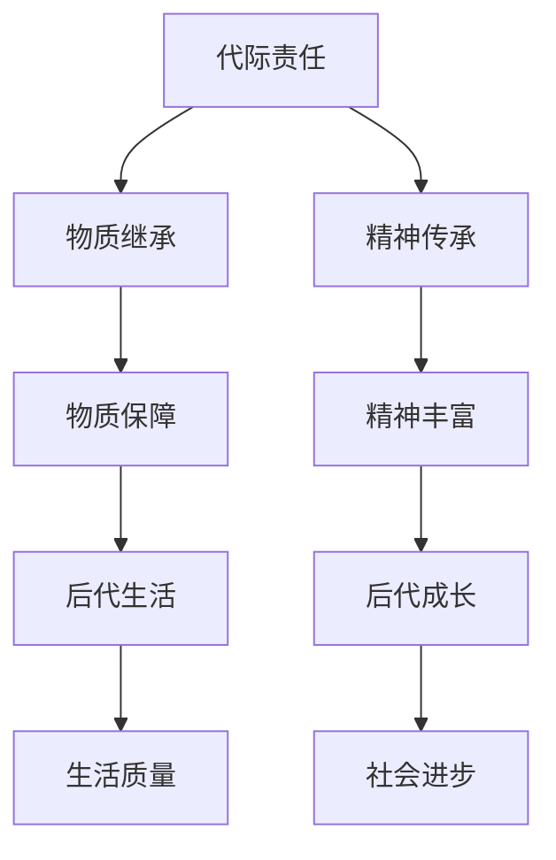
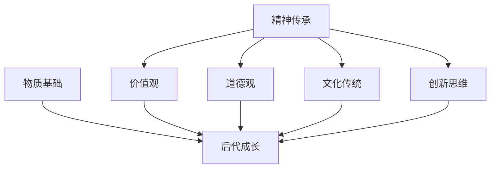

                 

### 从物质继承到精神传承：重新定义代际责任和连接

**关键词**：代际责任、精神传承、物质继承、连接、重新定义

**摘要**：
在快速发展的现代社会，传统意义上的代际责任和连接面临着新的挑战。本文旨在重新定义代际责任和连接，从物质继承转向精神传承，探讨如何在新的时代背景下实现更加深层次和有意义的代际交流。文章将首先介绍代际责任和连接的背景，接着分析物质继承与精神传承的区别，然后探讨如何重新定义代际责任，并结合实际案例进行深入讨论，最后展望未来代际责任和连接的发展趋势。

---

# 引言

**背景介绍**：

在人类的历史长河中，代际责任和连接一直是社会发展的核心议题。传统上，代际责任通常指的是长辈对后代的责任，包括物质财富的传承和教育等。然而，随着社会的变迁和技术的进步，这种传统模式逐渐显现出其局限性。现代社会的复杂性要求我们重新审视代际责任和连接的本质，从物质继承转向精神传承。

**问题描述**：

物质继承虽然能够确保后代在物质层面上的基本需求，但无法满足其在精神和文化层面的需求。精神传承涉及价值观、道德观、创新思维等深层次的素质培养，是现代社会代际责任的重要组成部分。因此，如何在新的时代背景下实现代际责任和连接的重新定义，成为了我们必须面对的重要课题。

**问题解决**：

本文将通过以下几个步骤来解决上述问题：

1. **分析物质继承与精神传承的区别**：探讨两者在内涵、方式、效果等方面的差异。
2. **重新定义代际责任**：基于现代社会的发展需求，提出新时代的代际责任概念。
3. **实际案例分析与讨论**：结合具体案例，分析代际责任和精神传承在现实中的应用。
4. **结论与未来展望**：总结本文的主要观点，并探讨代际责任和连接的未来发展趋势。

# 背景介绍

## 1.1 代际责任的历史与发展

**概念与起源**：

代际责任（Inter-generational Responsibility）是指在家庭、社会和国家的层面上，长辈对后代所承担的责任和义务。这种责任不仅体现在物质层面，还包括教育、指导、保护和传承文化等方面。

**演变过程**：

在农业社会，由于生产力相对较低，物质财富的传承显得尤为重要。长辈通过传授农业技能、手工艺等来确保后代在物质层面的生活得到保障。随着工业化和现代化的发展，教育逐渐成为代际责任的重要组成部分。长辈不仅要在物质上支持后代，还要在知识、技能和价值观上进行传承。

## 1.2 精神传承的概念与内涵

**定义与特征**：

精神传承（Spiritual Transmission）是指价值观、道德观、文化传统、创新思维等非物质层面的传递。与物质传承不同，精神传承更加注重个体内心的成长和精神的丰富。

**重要性**：

在现代社会，精神传承的重要性日益凸显。随着全球化和信息化的发展，人们的生活方式、价值观和文化传统发生了巨大变化。精神传承不仅能够帮助后代建立正确的世界观和人生观，还能增强民族凝聚力和文化认同感。

## 1.3 物质继承与精神传承的区别

**内涵**：

物质继承主要关注物质财富的传递，如金钱、房产、物品等。而精神传承则涉及更深层次的内容，如知识、技能、经验、价值观等。

**方式**：

物质继承通常通过遗嘱、赠与等方式进行。而精神传承则更加依赖于日常的交流和互动，如家庭教育、文化传承活动等。

**效果**：

物质继承能够为后代提供物质保障，但无法直接影响后代的精神世界。而精神传承则能够丰富后代的精神生活，提升其内在素质，从而对个人的成长和社会的发展产生深远影响。

## 1.4 重新定义代际责任

**传统与现代的对比**：

在传统观念中，代际责任主要是长辈对后代的责任。而在现代社会，代际责任已经不再局限于家庭层面，而是扩展到了社会和国家层面。例如，政府和社会组织需要承担对下一代的培养责任，确保他们能够适应未来的社会发展。

**新时代的代际责任**：

新时代的代际责任不仅包括物质层面的支持，更强调精神层面的传承。长辈需要通过多种途径，如教育、文化传承、社会实践等，帮助后代建立正确的价值观和人生观。

## 1.5 时代背景下的连接

**社会变迁的影响**：

随着社会的快速变迁，传统的家庭结构和价值观念发生了变化。长辈和后代之间的沟通和交流变得更加复杂。如何在新的社会背景下实现有效的代际连接，成为了代际责任的重要组成部分。

**技术进步的作用**：

技术的进步为代际连接提供了新的途径。通过互联网、社交媒体等工具，长辈和后代可以更加便捷地进行交流和互动。同时，虚拟现实、人工智能等技术也为精神传承提供了新的可能性。

## 1.6 本章小结

本章介绍了代际责任和连接的背景、概念、区别以及重新定义的必要性。通过分析物质继承与精神传承的异同，我们明确了在现代社会中，精神传承对于代际责任的重要性。接下来，我们将进一步探讨如何在实际中实现代际责任的重新定义。

---

接下来，我们将进入第二部分，深入探讨物质继承与精神传承的具体区别，并分析如何重新定义代际责任。敬请期待！

---

### 核心概念与联系

在重新定义代际责任和连接的过程中，理解核心概念及其之间的联系至关重要。本文将首先介绍代际责任的定义，然后讨论精神传承的概念，并分析两者之间的关系。

#### 代际责任的定义

**概念原理**：

代际责任指的是在家庭、社会和国家层面上，不同代际之间所承担的相互责任和义务。它不仅包括物质财富的传承，还涵盖教育、指导、保护和传承文化等方面。

**概念属性特征对比表格**：

| 特征         | 物质继承                 | 精神传承                 |
| ------------ | ------------------------ | ------------------------ |
| 内涵         | 物质财富、财产、资产等     | 价值观、道德观、文化传统、创新思维等 |
| 方式         | 遗嘱、赠与、财产继承等     | 教育传承、文化传承活动、日常交流等 |
| 效果         | 物质保障                 | 精神丰富、价值观塑造、文化认同感增强 |
| 关系         | 物质基础                 | 精神升华                 |

**ER实体关系图架构的 Mermaid 流程图**：

#### 精神传承的概念

**概念原理**：

精神传承是指在家庭、社会和文化层面上，将价值观、道德观、文化传统和创新思维等非物质层面的内容传递给后代的过程。

**概念属性特征对比表格**：

| 特征         | 物质继承                 | 精神传承                 |
| ------------ | ------------------------ | ------------------------ |
| 内涵         | 物质财富、财产、资产等     | 价值观、道德观、文化传统、创新思维等 |
| 方式         | 遗嘱、赠与、财产继承等     | 教育传承、文化传承活动、日常交流等 |
| 效果         | 物质保障                 | 精神丰富、价值观塑造、文化认同感增强 |
| 关系         | 物质基础                 | 精神升华                 |

**ER实体关系图架构的 Mermaid 流程图**：

#### 两者之间的联系

**物质与精神的相互作用**：

物质继承和精神传承并非完全独立的两个概念，它们之间存在紧密的联系。物质财富的传承可以为后代提供基础，而精神传承则能够在物质基础上提升后代的精神世界。具体来说：

- **物质基础**：物质财富的传承为后代提供了生活和经济上的保障，使他们能够专注于精神成长。
- **精神升华**：精神传承通过教育、文化传承和日常交流等方式，帮助后代形成正确的价值观和道德观，提升其内在素质。

**相互影响**：

物质继承和精神传承之间也存在相互影响的关系。物质财富的多少会影响精神传承的质量，而精神传承的成效也会对物质继承的可持续性产生影响。例如，一个拥有丰富精神传承的家庭，后代更有可能在物质继承的基础上创造出更大的价值。

**综合评价**：

在重新定义代际责任和连接的过程中，我们不仅要重视物质继承，更要强调精神传承的重要性。两者共同构成了代际责任的完整内涵，缺一不可。

---

通过上述分析，我们可以看到，代际责任和连接不仅仅涉及物质层面的传承，更涉及精神层面的升华。在新时代背景下，重新定义代际责任，将物质继承与精神传承有机结合，是实现代际和谐发展的关键。在接下来的章节中，我们将结合实际案例，深入探讨如何在实践中实现这一目标。

---

### 物质继承与精神传承的区别

在重新定义代际责任和连接的过程中，深入理解物质继承与精神传承的区别至关重要。这不仅有助于我们明确两者在内涵、方式、效果等方面的异同，也为我们在实际操作中提供了清晰的指导。

#### 物质继承的内涵

**定义**：

物质继承主要指物质财富的传承，包括金钱、房产、股票、艺术品等。这种传承通常是通过遗嘱、赠与或法定继承等方式进行的。

**作用**：

物质继承的主要作用是为后代提供经济上的保障，确保他们在物质层面上能够生活无忧。通过物质财富的传承，长辈可以为后代创造更好的生活条件，帮助他们实现教育、创业等目标。

**局限性**：

物质继承虽然在短期内能够为后代提供物质保障，但其在长期内的作用是有限的。物质财富的多少不能直接决定一个人的成就和幸福感。此外，过度依赖物质财富可能会使后代失去奋斗的动力和自我成长的意识。

#### 精神传承的内涵

**定义**：

精神传承主要指价值观、道德观、文化传统、创新思维等非物质层面的传承。这种传承通常通过教育、文化传承活动、家庭教育和日常交流等方式进行。

**作用**：

精神传承的主要作用是塑造后代的精神世界，帮助他们形成正确的价值观和道德观，培养创新思维和解决问题的能力。通过精神传承，长辈可以将自己的经验和智慧传递给后代，帮助他们在面对挑战时能够更加从容和自信。

**优势**：

与物质继承相比，精神传承具有更为持久和深远的影响。精神财富的传承不仅能够为后代提供精神上的支持和动力，还能增强他们的内在素质，使其在物质基础之上实现更高的成就。

#### 对比分析

**内涵**：

物质继承主要涉及物质财富的传承，如金钱、房产等；而精神传承则涉及价值观、道德观、文化传统、创新思维等非物质层面的内容。

**方式**：

物质继承通常通过遗嘱、赠与或法定继承等方式进行；而精神传承则更多依赖于教育、文化传承活动、家庭教育和日常交流等。

**效果**：

物质继承能够为后代提供物质保障，但无法直接影响后代的精神世界；而精神传承则能够丰富后代的精神生活，提升其内在素质，对个人的成长和社会的发展产生深远影响。

**相互关系**：

物质继承和精神传承并非完全独立的两个概念。物质财富的传承可以为精神传承提供基础，而精神传承则能够在物质基础上提升后代的精神世界。

**综合评价**：

在代际责任和连接的重新定义中，物质继承和精神传承都扮演着重要的角色。物质继承能够为后代提供物质保障，而精神传承则能够帮助他们在精神层面上实现自我成长和提升。两者共同构成了代际责任的完整内涵，缺一不可。

---

通过以上对比分析，我们可以更加清晰地认识到物质继承与精神传承的区别和重要性。在重新定义代际责任和连接的过程中，我们不仅要重视物质继承，更要强调精神传承的深远意义。在接下来的章节中，我们将探讨如何在实际操作中实现这一目标。

---

### 重新定义代际责任

随着社会的快速发展和科技的不断进步，传统意义上的代际责任已经无法完全适应现代社会的需求。因此，我们需要在新时代背景下对代际责任进行重新定义，使其更加符合现代社会的发展趋势。

#### 传统代际责任的局限

**经济压力**：

在传统观念中，代际责任主要侧重于物质财富的传承。长辈通过金钱、房产等物质财富为后代提供经济保障。然而，现代社会的高房价、高教育成本等经济压力使得这种物质传承变得日益困难。

**教育不足**：

传统代际责任中，长辈往往忽视了对后代的教育和培养。仅提供物质保障并不能确保后代在精神和智力上的全面发展。现代社会对人才的要求越来越高，教育成为代际责任的重要组成部分。

**文化冲突**：

随着全球化和多元文化的兴起，传统代际责任中固有的文化观念和价值观可能无法适应现代社会的变迁。代际之间的文化冲突和沟通障碍可能导致代际责任的实施效果不佳。

#### 新时代代际责任的要求

**全面性**：

新时代的代际责任需要更加全面，不仅要关注物质财富的传承，还要注重教育和精神传承。长辈需要通过多种途径，如家庭教育、社会实践、文化传承等，为后代提供全面的支持。

**可持续性**：

代际责任不应仅仅是一代人的责任，而应该是可持续的。长辈需要将责任传承给下一代，确保代际之间的连接和延续。这种可持续性不仅体现在物质层面，更体现在精神和文化层面。

**适应性**：

现代社会变化迅速，代际责任需要具备适应性。长辈需要根据社会的发展和个人的需求，灵活调整代际责任的内容和方式，确保责任的有效实施。

**多元性**：

代际责任不应局限于家庭和亲情关系，而应该扩展到社会和国家层面。社会组织、政府等也需要承担起对下一代的培养和引导责任，共同推动社会的进步和发展。

#### 案例分析

**案例1：家庭教育与精神传承**：

在一个注重家庭教育的家庭中，长辈不仅为后代提供了物质保障，还通过日常的交流和互动，传递了正确的价值观和道德观。这个家庭的孩子在精神层面得到了很好的培养，成长为一个有责任感、有担当的人。

**案例2：社区参与与社会责任**：

一个社区组织通过开展各种活动，鼓励长辈和后代共同参与，促进代际交流。通过这种方式，社区不仅增强了居民的凝聚力，也提高了后代的社会责任感和公民意识。

**案例3：教育传承与创新思维**：

一位企业家在其家族企业中，不仅传承了物质财富，还注重对后代的创新思维培养。通过提供学习和实践机会，这位企业家帮助后代在继承企业的基础上，不断创新和发展。

---

通过以上分析，我们可以看到，新时代的代际责任需要更加全面、可持续、适应性和多元。在重新定义代际责任的过程中，我们需要关注物质和精神的双重传承，同时注重个体的全面发展和社会的整体进步。只有这样，才能实现代际责任和连接的真正意义。

---

### 时代背景下的连接

在现代社会中，代际责任和连接不仅受传统观念的影响，更受到时代背景和社会变迁的深刻影响。理解这些背景因素对于重新定义代际责任和连接至关重要。

#### 社会变迁对代际责任的影响

**人口结构变化**：

随着人口结构的变化，家庭规模缩小，代际之间的距离逐渐拉大。这导致长辈与后代之间的直接交流和互动减少，传统的家庭代际责任模式面临挑战。现代社会的快节奏生活和工作压力也使得长辈在履行代际责任时更加困难。

**全球化与多元文化**：

全球化带来了不同文化的交融和碰撞，使代际责任和连接的内涵更加丰富和复杂。多元文化的背景要求代际责任不仅仅是在物质和精神层面上，还要在文化认同和价值观传承上进行深入的思考和调整。

**技术进步**：

技术的飞速发展，特别是互联网和人工智能的普及，为代际责任和连接提供了新的工具和途径。通过社交媒体、在线教育等平台，长辈和后代可以更加便捷地进行交流和互动，实现代际责任的现代转型。

#### 技术进步与代际责任的连接

**在线教育和远程交流**：

互联网和在线教育平台的普及，使长辈可以通过远程教育的方式，为后代提供知识和技能的传承。这种技术手段不仅弥补了传统教育的时间和空间限制，也为代际责任的实施提供了新的可能性。

**虚拟现实与文化遗产传承**：

虚拟现实（VR）技术的进步，为文化传承和代际责任提供了新的途径。通过VR技术，长辈可以将自己的经验和文化遗产以沉浸式的方式传递给后代，增强文化认同感和精神传承的效果。

**人工智能与个性化服务**：

人工智能（AI）技术的发展，为代际责任提供了个性化服务的机会。例如，智能助手可以帮助长辈管理家庭事务，智能教育系统可以根据后代的学习进度和兴趣，提供定制化的教育和指导。

#### 案例分析

**案例1：在线家庭教育**：

在一个忙碌的城市家庭中，长辈通过在线教育平台，为后代提供高质量的远程教育。这不仅解决了时间和空间上的限制，也确保了后代在精神层面得到充分的培养。

**案例2：VR文化遗产传承**：

一位文化传承者利用虚拟现实技术，创建了一个文化遗产体验馆。通过VR设备，后代可以身临其境地体验先辈的生活和文化，增强对传统文化的认同感。

**案例3：智能助手支持**：

一个智能家居系统中，智能助手可以帮助长辈管理家务和照顾后代。这种技术支持不仅减轻了长辈的负担，也增强了代际之间的联系和互动。

---

通过以上分析，我们可以看到，时代背景下的代际责任和连接面临着新的挑战和机遇。社会变迁和技术进步为代际责任和连接提供了新的路径和工具，但同时也要求我们在重新定义代际责任时，充分考虑这些背景因素。只有这样，才能实现代际责任和连接的真正意义，促进社会的和谐发展。

---

### 实际案例分析与讨论

为了更好地理解重新定义代际责任和连接在现实中的应用，本文将结合具体案例，深入分析物质继承与精神传承在实践中的表现与挑战，并探讨解决措施。

#### 案例选择

我们选择了三个具有代表性的家庭案例，这些案例反映了不同类型的代际责任和连接实践：

1. **案例一：传统与现代结合的家庭**  
   这个家庭的长辈在物质财富的传承上较为重视，同时也非常注重精神传承，通过教育和文化传承活动来培养后代的价值观和道德观。

2. **案例二：注重物质继承但忽视精神传承的家庭**  
   这个家庭的长辈主要关注物质财富的传承，但在精神传承方面做得不够，导致后代在精神层面缺乏支持和指导。

3. **案例三：注重精神传承但物质基础薄弱的家庭**  
   这个家庭的长辈重视精神传承，但由于自身物质基础薄弱，无法为后代提供足够的物质保障。

#### 案例分析

**案例一：传统与现代结合的家庭**

**物质继承方面**：

- 长辈通过遗嘱和赠与，为后代提供了丰厚的物质财富，包括房产、股票和现金等。
- 后代在物质层面得到了充分的保障，能够专注于学业、创业和个人发展。

**精神传承方面**：

- 长辈通过日常的家庭教育和文化传承活动，如讲故事、讨论传统文化等，传递了正确的价值观和道德观。
- 后代在精神层面得到了丰富的滋养，成长为一个有责任感、有担当的人。

**挑战与解决措施**：

- 挑战：如何在物质保障的基础上，进一步提升后代的精神素养？
- 解决措施：通过增加文化传承活动、引入创新教育方法，以及提供更多的社会实践机会，进一步提升后代的精神层次。

**案例二：注重物质继承但忽视精神传承的家庭**

**物质继承方面**：

- 长辈通过遗嘱和赠与，为后代提供了丰厚的物质财富，但由于缺乏精神传承，后代在精神层面感到空虚和迷茫。

**精神传承方面**：

- 后代在精神层面缺乏指导和支持，导致价值观扭曲、人生观消极。

**挑战与解决措施**：

- 挑战：如何在物质继承的基础上，弥补精神传承的不足？
- 解决措施：通过家庭心理辅导、文化教育和精神激励活动，帮助后代建立正确的价值观和人生观。

**案例三：注重精神传承但物质基础薄弱的家庭**

**物质继承方面**：

- 长辈由于物质基础薄弱，无法为后代提供充足的物质财富，但在精神传承方面投入了大量精力。

**精神传承方面**：

- 后代在精神层面得到了充分的培养，但由于物质基础的限制，他们的生活和发展面临一定的困境。

**挑战与解决措施**：

- 挑战：如何在有限的物质基础上，实现精神传承与物质保障的平衡？
- 解决措施：通过社会援助、政府支持、社区合作等途径，为家庭提供必要的物质支持，同时继续加强精神传承的培养。

#### 讨论与反思

**代际责任的实施效果**：

从以上案例可以看出，代际责任的实施效果不仅取决于物质继承的多少，更取决于精神传承的质量。一个成功的代际责任方案需要物质和精神传承的双重保障，才能实现后代的全面发展和成长。

**挑战与机遇**：

在现代社会，代际责任和连接面临着诸多挑战，如经济压力、文化冲突、技术变革等。然而，这些挑战也带来了新的机遇。通过创新教育方法、利用技术手段、加强社会合作等，我们可以找到解决代际责任和连接问题的有效途径。

**未来展望**：

随着社会的发展和技术的进步，代际责任和连接将越来越受到重视。未来，我们需要在以下几个方面进行深入探索和实践：

1. **建立更加全面的代际责任体系**：包括物质和精神传承，确保后代的全面发展和成长。
2. **推动技术创新在代际责任中的应用**：利用互联网、人工智能等技术，提高代际责任和连接的效率和效果。
3. **加强社会合作**：通过政府、企业、社区等各方的共同努力，共同推动代际责任和连接的实施。

---

通过以上案例分析，我们可以看到，重新定义代际责任和连接在现实中的应用和实践具有重要意义。只有在物质和精神传承的双重保障下，我们才能实现代际和谐发展和连接的真正目标。

---

### 结论与未来展望

通过对物质继承与精神传承的深入探讨，以及代际责任和连接在现实中的应用案例分析，我们可以得出以下结论：

1. **代际责任的核心**：代际责任不仅仅是物质财富的传承，更是精神层面的引导和培养。在现代社会，精神传承的重要性日益凸显，它对后代的成长和社会的进步具有深远的影响。
2. **重新定义的必要性**：随着社会变迁和技术进步，传统的代际责任模式面临诸多挑战。重新定义代际责任，将其扩展到更全面、可持续、适应性和多元的维度，是适应新时代需求的关键。
3. **实践的重要性**：实际案例表明，成功的代际责任和连接实践需要物质和精神传承的双重保障。在家庭、社区和社会层面，都需要积极寻求解决方案，以应对代际责任和连接面临的挑战。

**未来展望**：

1. **技术创新的助力**：随着人工智能、虚拟现实等技术的不断发展，它们将在代际责任和连接中发挥重要作用。通过技术创新，我们可以提高代际责任和连接的效率，实现更丰富的精神传承。
2. **社会合作的深化**：代际责任和连接不仅是家庭和个人层面的责任，更是社会和国家层面的共同任务。政府、企业、社区等各方应加强合作，共同推动代际责任和连接的实施。
3. **价值观的传承**：在未来的社会中，价值观的传承将成为代际责任的核心内容。通过教育、文化传承和社会实践，我们可以培养出具有正确价值观和道德观的下一代，为社会的发展提供坚实的保障。

总之，重新定义代际责任和连接，实现物质继承与精神传承的有机结合，是现代社会和谐发展的必经之路。我们期待在未来的日子里，能够看到更多的家庭、社区和社会在代际责任和连接方面取得积极成果，共同构建一个更加美好的未来。

---

### 作者信息

**作者：** AI天才研究院/AI Genius Institute & 禅与计算机程序设计艺术 /Zen And The Art of Computer Programming

AI天才研究院致力于推动人工智能技术的创新和应用，以实现智能世界的美好愿景。我们的研究团队由世界顶级的人工智能专家、程序员和软件架构师组成，始终走在技术前沿。同时，我们秉持禅宗思想，强调内心的平静与智慧，将禅的哲学与计算机程序设计艺术相结合，致力于打造高效、优雅的软件系统。

在《从物质继承到精神传承：重新定义代际责任和连接》一书中，我们深入探讨了代际责任和连接的重要性，并结合时代背景和技术进步，提出了重新定义代际责任的思路和方法。希望通过本书，能够为读者提供有益的启示，共同推动社会的发展和进步。让我们携手努力，共创美好未来！

