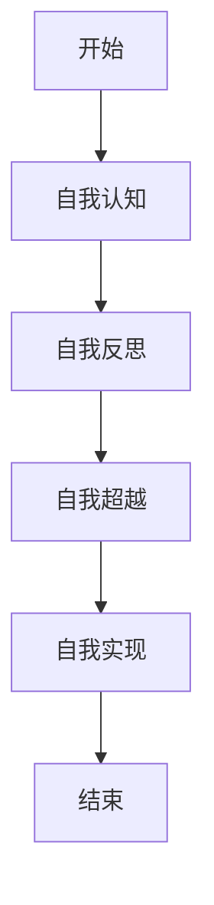
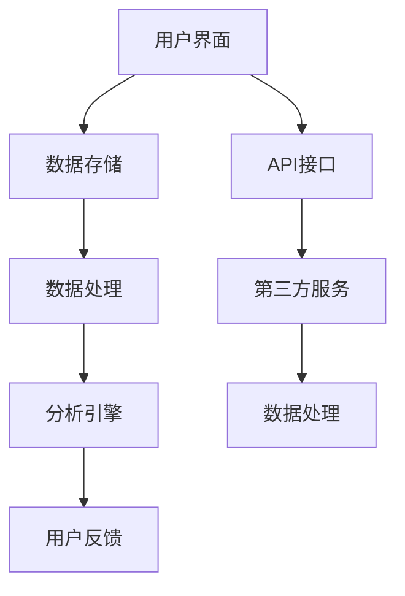
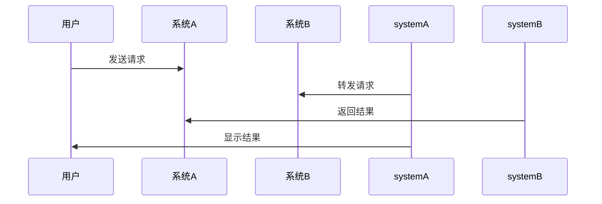

                 

# 从物质追求到精神成长：现代人的价值观重构之旅

## 关键词
价值观重构、精神成长、物质追求、心理健康、社会和谐

## 摘要
本文探讨了现代社会中物质追求与精神成长之间的矛盾，分析了物质追求与精神成长的概念、特征及其重要性，并提出了重构价值观的方法和策略。通过深入思考和实践，帮助读者实现从物质追求到精神成长的价值转变。

## 第一部分：引言与背景

### 1. 引言

在现代社会，物质追求成为了许多人的生活重心，然而，这种追求往往伴随着精神空虚和心理健康问题。本文旨在探讨如何通过价值观的重构，实现从物质追求到精神成长的转变，从而实现个人与社会的全面发展。

### 1.1 问题背景

随着经济全球化和社会信息化的发展，人们的生活水平得到了显著提高，物质财富的积累成为衡量个人和社会发展的重要指标。然而，这种物质追求的背后，却隐藏着一系列问题。例如，过度追求物质财富导致的精神压力、心理问题、人际关系疏离等。这些问题不仅影响了个体的心理健康，也对社会和谐稳定构成了威胁。

### 1.2 问题描述

物质追求与精神成长之间的矛盾主要表现在以下几个方面：

1. **心理健康问题**：过度追求物质财富往往会导致个体的精神压力增大，引发焦虑、抑郁等心理问题。
2. **人际关系疏离**：在物质追求的过程中，人们往往忽略了与他人的情感交流，导致人际关系疏离。
3. **社会不公**：物质追求的过度导致社会贫富差距加大，社会不公现象加剧。

### 1.3 问题解决

为了解决上述问题，我们需要从以下几个方面入手：

1. **重构价值观**：通过重新审视和调整个人的价值观，将物质追求与精神成长相结合，实现个人全面发展。
2. **提高心理健康意识**：加强心理健康教育，提高公众对心理健康的重视程度，培养积极健康的心态。
3. **促进社会公平**：通过政策调控，缩小贫富差距，促进社会公平。

### 1.4 边界与外延

本文主要关注个体层面的价值观重构，不涉及集体主义价值观的讨论。同时，本文探讨的精神成长路径是一个通用的概念，适用于不同文化和社会背景下的个体。

### 1.5 概念结构与核心要素组成

本文的核心概念是价值观重构，其结构包括以下几个方面：

1. **物质追求**：分析现代社会中物质追求的现象及其影响。
2. **精神成长**：探讨精神成长的重要性及其路径。
3. **价值观重构**：提出重构价值观的方法和策略。

### 1.6 本章小结

本章为本文的讨论奠定了基础，明确了研究的背景、问题、解决方案及其边界。接下来的章节将逐一深入探讨这些核心概念，帮助读者全面理解并实践从物质追求到精神成长的过程。

## 第二部分：物质追求与精神成长的对比分析

### 2.1 物质追求的定义与特征

物质追求是指个体通过获取物质财富和享受物质生活来满足自身需求和欲望的行为。它具有以下特征：

1. **目标明确**：物质追求通常指向具体的物质成果，如财富、地位、物质享受等。
2. **短期导向**：物质追求往往注重即时的满足和快感，追求短期内的收益和效果。
3. **外在评价**：物质追求往往受到社会和个人的外在评价和认可，如财富排名、社会地位等。

### 2.2 精神成长的概念与特征

精神成长则是指个体通过提升内在素质、丰富精神世界和实现自我价值的过程。其主要特征包括：

1. **目标多元**：精神成长追求的是全面的发展和提升，不仅包括物质层面的追求，还涵盖道德、情感、智力等多个维度。
2. **长期导向**：精神成长是一个持久的过程，注重长期的自我完善和提升。
3. **内在动力**：精神成长依靠个体的内在动力，追求内心的平和与满足。

### 2.3 物质追求与精神成长的对比表格

| 特征        | 物质追求               | 精神成长               |
| ----------- | ---------------------- | ---------------------- |
| 目标明确     | 具体物质成果           | 全面发展和提升         |
| 短期导向     | 注重即时满足和短期收益 | 长期自我完善和提升     |
| 外在评价     | 社会和个人外在评价     | 内心平和与自我认可     |
| 内在动力     | 外在压力和欲望驱动     | 内在自我驱动           |

### 2.4 精神成长的重要性

精神成长对于个体的心理健康和社会的和谐稳定具有重要意义。一个精神成熟的人能够更好地应对生活中的挑战，保持心理健康，同时也能够与他人建立更健康、积极的人际关系。精神成长有助于个体实现自我价值，提升生活质量，为社会和谐发展贡献力量。

### 2.5 本章小结

通过对比分析物质追求与精神成长的概念、特征及其重要性，我们可以看到两者在目标、导向、评价和内在动力等方面的显著差异。精神成长的重要性不容忽视，它是现代人实现全面发展的关键。在接下来的章节中，我们将进一步探讨如何实现从物质追求到精神成长的价值转变。

## 第三部分：精神成长的核心概念与联系

### 3.1 自我认知

自我认知是指个体对自己的理解、认识和评价。它涉及个人的价值观、性格、能力和需求等方面。自我认知具有以下特征：

1. **主观性**：自我认知是基于个体自身的感受和体验，具有强烈的个人色彩。
2. **动态性**：自我认知是一个不断变化和发展的过程，受到个体经历、环境和社会因素的影响。

### 3.2 自我反思

自我反思是指个体对自己的行为、思想、情感和经历进行深入思考和分析。它是精神成长的重要途径，有助于个体发现问题、改进自我，实现自我提升。

### 3.3 自我超越

自我超越是指个体在自我认知和自我反思的基础上，不断挑战自我、突破自我界限，实现更高的精神境界。自我超越有助于个体实现自我价值的最大化，达到精神成长的高峰。

### 3.4 自我实现

自我实现是指个体在精神成长的过程中，实现自我价值、追求内心真正渴望的目标。它是精神成长的最终目标，也是个体全面发展的标志。

### 3.5 概念联系与整合

自我认知、自我反思、自我超越和自我实现四个核心概念相互联系，共同构成了精神成长的理论体系。自我认知是精神成长的基础，自我反思是精神成长的动力，自我超越是精神成长的目标，自我实现是精神成长的结果。

### 3.6 本章小结

通过探讨自我认知、自我反思、自我超越和自我实现四个核心概念，我们可以看到它们在精神成长过程中的重要作用。这些概念相互联系，共同推动个体实现从物质追求到精神成长的价值转变。在接下来的章节中，我们将进一步探讨如何通过实践实现精神成长。

## 第四部分：重构价值观的策略与方法

### 4.1 重新审视个人目标

重新审视个人目标是指个体在精神成长的过程中，重新评估和调整自己的价值观和目标。具体方法包括：

1. **反思过去**：回顾自己的成长经历，思考哪些目标实现了真正的价值，哪些目标只是短暂的满足。
2. **明确未来**：设定长远的目标，将物质追求与精神成长相结合，实现个人全面发展。
3. **定期评估**：定期评估自己的目标和价值观，确保它们与个人发展相一致。

### 4.2 提高自我认知能力

提高自我认知能力是指个体通过学习和实践，不断提升对自己和周围环境的认识。具体方法包括：

1. **自我反思**：定期进行自我反思，思考自己的行为、思想和情感，发现并解决问题。
2. **倾听他人**：倾听他人的意见和建议，从他人的角度看待自己，提高自我认知水平。
3. **学习新知识**：不断学习新知识，拓宽视野，提升自我认知能力。

### 4.3 培养内在动力

培养内在动力是指个体在精神成长的过程中，通过激发内在的动力，实现自我驱动和自我激励。具体方法包括：

1. **设定挑战**：设定具有挑战性的目标，激发内心的动力，推动自己不断前进。
2. **庆祝进步**：为自己设定的目标实现庆祝，增强内心的满足感和成就感。
3. **保持耐心**：面对困难和挫折时，保持耐心，相信自己的能力和潜力。

### 4.4 构建支持系统

构建支持系统是指个体在精神成长的过程中，通过与他人建立积极的关系，获得支持和帮助。具体方法包括：

1. **建立友谊**：与他人建立深厚的友谊，分享快乐和困难，共同成长。
2. **寻求指导**：寻找有经验的导师或专业人士，获取指导和建议，提升自我成长速度。
3. **参与社群**：加入相关的社群或组织，与他人共同学习和成长。

### 4.5 坚持长期主义

坚持长期主义是指个体在精神成长的过程中，注重长期的发展，不为短期利益所动摇。具体方法包括：

1. **设定长远目标**：设定长远的目标，将物质追求与精神成长相结合，实现个人全面发展。
2. **保持耐心和毅力**：面对困难和挫折时，保持耐心和毅力，相信自己的能力和潜力。
3. **定期反思和调整**：定期反思和调整自己的目标和价值观，确保它们与个人发展相一致。

### 4.6 本章小结

通过重新审视个人目标、提高自我认知能力、培养内在动力、构建支持系统和坚持长期主义等策略和方法，个体可以实现从物质追求到精神成长的价值转变。这些策略和方法不仅有助于个人成长，也有助于社会的和谐发展。

## 第五部分：实践案例与经验分享

### 5.1 案例一：李华的价值观重构之旅

李华是一位年轻的职场人士，他在过去的工作中一直以物质追求为目标，追求高收入和社会地位。然而，随着时间的推移，他开始感到精神上的空虚和焦虑。为了实现从物质追求到精神成长的转变，李华采取了以下措施：

1. **重新审视个人目标**：李华开始反思自己的价值观，认识到精神成长的重要性，将物质追求与精神成长相结合，设定了新的长期目标。
2. **提高自我认知能力**：李华通过阅读书籍、参加培训和与朋友交流，不断学习新知识，提升自我认知能力。
3. **培养内在动力**：李华设定了具有挑战性的目标，如学习一门新技能、完成一个公益项目等，激发内心的动力。
4. **构建支持系统**：李华加入了读书会和志愿者团队，与他人建立了深厚的友谊，获得了支持和帮助。
5. **坚持长期主义**：李华坚持定期反思和调整自己的目标和价值观，确保它们与个人发展相一致。

通过这些实践，李华逐渐实现了从物质追求到精神成长的价值转变，他的心理健康得到了显著改善，生活质量也得到了提高。

### 5.2 案例二：张明的心理健康与人际关系改善

张明是一位企业家，他在过去的工作中一直追求事业的成功和财富的积累。然而，随着事业的不断发展，他开始感到压力巨大，心理健康问题逐渐显现。为了改善自己的心理健康和人际关系，张明采取了以下措施：

1. **心理咨询**：张明定期进行心理咨询，学习如何应对压力和情绪问题，提升心理健康水平。
2. **时间管理**：张明通过合理规划时间，减少工作压力，提高生活质量。
3. **人际关系建设**：张明积极参与社区活动，与他人建立良好的关系，改善人际关系。
4. **锻炼身体**：张明通过定期锻炼身体，增强身体素质，提高心理健康水平。
5. **心理健康教育**：张明参加心理健康教育课程，提升对心理健康的认识和理解。

通过这些实践，张明的心理健康状况得到了显著改善，人际关系也得到了改善，他开始享受更加充实和有意义的生活。

### 5.3 案例三：王强的家庭幸福与精神成长

王强是一位全职家庭主妇，她在过去的生活中一直以家庭和孩子的幸福为重心，却忽视了自身的成长。为了实现从物质追求到精神成长的价值转变，王强采取了以下措施：

1. **自我认知**：王强开始反思自己的价值观，认识到自我成长的重要性，设定了新的个人成长目标。
2. **学习新技能**：王强通过参加课程和学习新技能，提升自我价值，实现了自我成长。
3. **家庭关系建设**：王强与家人建立了更加深厚的感情，共同成长，实现了家庭幸福。
4. **参与社区活动**：王强积极参与社区活动，与他人建立良好的关系，丰富了精神世界。
5. **长期主义**：王强坚持长期主义，将物质追求与精神成长相结合，实现了家庭的和谐幸福。

通过这些实践，王强的家庭关系得到了改善，生活质量也得到了提高，她开始享受更加充实和有意义的生活。

### 5.4 本章小结

通过以上案例，我们可以看到，从物质追求到精神成长的价值转变需要个体付出努力和实践。不同的个体可以根据自身情况，采取不同的策略和方法，实现从物质追求到精神成长的价值转变。这些实践案例为我们提供了宝贵的经验和启示，有助于我们在现实生活中实现这一转变。

## 第六部分：未来展望与持续成长

### 6.1 未来社会的发展趋势

随着科技的发展和社会的进步，未来社会将呈现出以下发展趋势：

1. **人工智能的普及**：人工智能技术将在各个领域得到广泛应用，改变人们的生活方式和工作模式。
2. **可持续发展**：在环境保护和资源利用方面，可持续发展将成为全球共识，引导人们追求更加平衡的生活。
3. **全球化的深化**：全球化将继续深化，人们将更加关注全球性问题，如气候变化、公共卫生等。
4. **数字化生活**：数字化生活将更加普及，人们将更加依赖数字技术和网络平台进行沟通、学习和工作。

### 6.2 精神成长在未来的重要性

在未来社会中，精神成长的重要性将愈发凸显。一方面，物质追求的压力将变得更加复杂和多元，人们需要更强的心理素质和适应能力来应对挑战。另一方面，随着人工智能的普及和数字化生活的深化，人们对于人际关系和内心需求的关注将更加重要。

### 6.3 持续成长的方法

为了在未来的社会中实现持续成长，我们可以采取以下方法：

1. **终身学习**：在快速变化的社会中，终身学习将变得至关重要。通过不断学习新知识和技能，提升自我能力。
2. **心理健康维护**：关注心理健康，定期进行心理调适，保持良好的心理状态。
3. **人际关系的建设**：建立积极的人际关系，与他人建立深厚的友谊，共同成长。
4. **自我反思**：定期进行自我反思，审视自己的价值观和行为，不断改进自我。
5. **社会参与**：积极参与社会活动，关注社会问题，为社会的进步和发展贡献力量。

### 6.4 本章小结

未来社会的发展将给人们带来新的挑战和机遇，精神成长将成为个体实现全面发展的关键。通过持续学习和自我反思，我们可以不断提升自我，适应未来的变化，实现个人的价值和社会的和谐。

## 结语

从物质追求到精神成长，是现代人价值观重构的重要路径。在这个过程中，我们不仅需要重新审视个人的目标和价值观，还需要培养内在动力、构建支持系统，并坚持长期主义。通过实践案例，我们可以看到，这一价值转变不仅有助于改善个体的心理健康和生活质量，也有助于构建和谐的社会关系。在未来，让我们共同努力，实现从物质追求到精神成长的全面转变，为个人和社会的发展贡献力量。

### 作者信息

作者：AI天才研究院/AI Genius Institute & 禅与计算机程序设计艺术 /Zen And The Art of Computer Programming

在计算机编程和人工智能领域，我始终致力于推动技术的进步和应用的普及。通过本文，我希望能够为读者提供一种全新的视角，引导他们从物质追求转向精神成长，实现全面的发展和提升。愿我们共同探索这个充满挑战和机遇的时代，实现个人与社会的和谐共进。

---

## 附录

### 附录A：核心概念与联系ER实体关系图

```mermaid
erDiagram
  A[自我认知] ||--|{ B[自我反思] } |
  B ||--|{ C[自我超越] } |
  C ||--|{ D[自我实现] } |
  A ; B ; C ; D
```

### 附录B：算法原理Mermaid流程图



### 附录C：系统架构设计Mermaid架构图



### 附录D：系统交互Mermaid序列图



通过这些附录，我们希望能够为读者提供更直观和具体的信息，帮助大家更好地理解和应用本文提出的观点和方法。希望这些附录能够成为您在精神成长道路上的有益参考。

