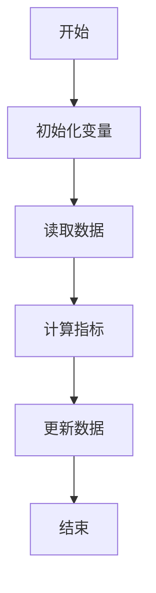
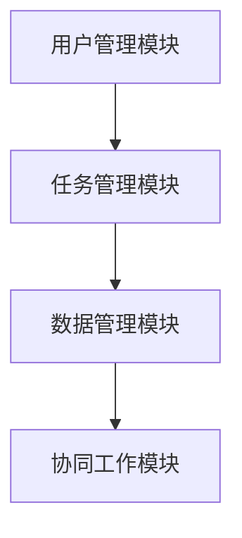
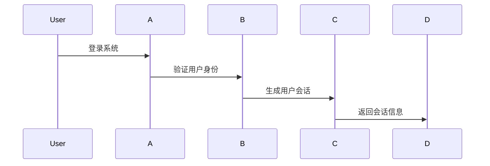
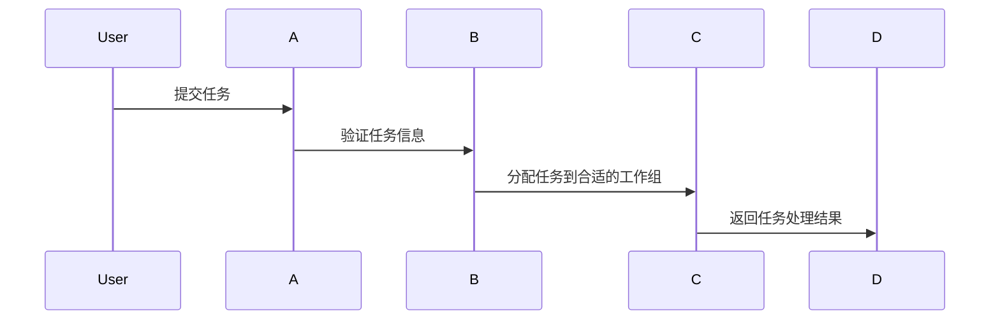

                 

### 从竞争思维到合作精神：构建新型社会关系

> 关键词：竞争思维、合作精神、新型社会关系、人工智能、可持续发展

> 摘要：本文通过深入探讨竞争思维的历史与影响，批判其局限性，阐述合作精神的兴起及其核心要素，进而探讨如何在个体、组织和全社会层面构建合作精神，最终构建新型社会关系，实现可持续发展。

----------------------------------------------------------------

## 第一部分：竞争思维的批判与反思

### 第1章：竞争思维的历史与影响

#### 1.1 竞争思维的起源

竞争思维，作为人类社会发展的基本动力之一，其根源可追溯至古代。在资源稀缺、人口繁衍的条件下，为了获取有限的资源，人类自然而然地形成了竞争意识。历史长河中，无论是农业社会的土地争夺，还是工业社会的商业竞争，竞争思维都发挥着至关重要的作用。

#### 1.2 竞争思维在社会发展中的角色

竞争思维在社会发展中起到了双重作用。一方面，它推动了科技进步和经济增长，促进了社会效率的提升。另一方面，过度的竞争往往导致资源浪费、社会不公和生态破坏，引发一系列社会问题。

#### 1.3 竞争思维的负面影响

随着时间的推移，竞争思维所带来的负面影响逐渐显现。过度追求竞争使得社会风气浮躁，人际信任减少，合作精神缺失。此外，竞争思维还容易引发道德风险，如欺诈、垄断和不正当竞争等，损害社会公平和正义。

### 第2章：竞争思维的局限性

#### 2.1 竞争思维的理性局限

竞争思维基于理性选择理论，但在复杂的社会系统中，个体行为受到多种非理性因素的影响。例如，情绪、信仰和文化背景等，使得竞争思维难以完全预测和控制。

#### 2.2 竞争思维的道德困境

竞争思维往往忽视道德规范，导致道德风险的增加。在激烈的市场竞争中，企业可能采取不道德手段来获取竞争优势，损害消费者利益，破坏市场秩序。

#### 2.3 竞争思维的生态影响

竞争思维强调资源占有和利用，往往忽视生态平衡和环境保护。过度竞争可能导致资源过度开发、环境破坏和生态退化，威胁人类生存。

### 第3章：合作精神的兴起

#### 3.1 合作精神的定义

合作精神，是指个体或组织在共同目标和价值观指导下，通过协同合作实现共同利益和价值追求的态度和行为。

#### 3.2 合作精神的发展历程

合作精神的历史可以追溯到古代社会的合作互助。随着社会的发展，合作精神逐渐成为社会组织的重要特征。在现代社会，特别是在人工智能、区块链等新技术推动下，合作精神的重要性更加凸显。

#### 3.3 合作精神的核心要素

合作精神的核心要素包括：信任、沟通、共同目标和价值观。信任是合作的基础，沟通是合作的桥梁，共同目标和价值观是合作的动力。

----------------------------------------------------------------

## 第二部分：合作精神的构建与实践

### 第4章：个体层面的合作精神培养

#### 4.1 竞争与合作的平衡

在个体层面，如何平衡竞争与合作的矛盾，培养合作精神至关重要。个体需要在竞争中保持进取心，同时学会在合作中发挥自身优势，实现共同目标。

#### 4.2 培养合作精神的方法

培养合作精神的方法包括：提高人际沟通能力、增强团队协作意识、树立共同目标和价值观等。通过这些方法，个体可以在日常生活中逐步培养合作精神。

#### 4.3 合作精神的案例分析

通过分析成功的企业案例，如谷歌、特斯拉等，我们可以看到，这些企业通过建立良好的团队协作机制和共同愿景，成功地将合作精神融入企业文化建设。

### 第5章：组织层面的合作精神构建

#### 5.1 组织文化的转变

组织文化的转变是构建合作精神的关键。组织需要从竞争文化向合作文化转变，树立团队协作、共同成长的理念。

#### 5.2 合作机制的建立

建立合作机制，如跨部门协作平台、共享资源机制等，有助于提高组织内部的合作效率。此外，组织还需要制定相应的规章制度，保障合作机制的顺利运行。

#### 5.3 合作精神的实践案例

通过分析成功的企业案例，如华为、阿里巴巴等，我们可以看到，这些企业通过建立完善的合作机制和培养合作精神，实现了企业的快速发展。

### 第6章：社会层面的合作精神推广

#### 6.1 合作精神的教育普及

教育是培养合作精神的重要途径。社会需要通过教育体系，从小培养个体的合作意识，提高社会整体的合作水平。

#### 6.2 合作精神的政策支持

政府需要通过政策引导，鼓励社会组织和个体积极参与合作，推动社会合作精神的普及。

#### 6.3 合作精神的社会影响

合作精神的社会影响表现在多个方面。例如，它有助于减少社会矛盾、提高社会稳定性，促进可持续发展等。

----------------------------------------------------------------

## 第三部分：新型社会关系的构建

### 第7章：合作精神的制度保障

#### 7.1 法律框架的完善

完善法律框架，保障合作精神的实施。例如，制定相关法律法规，规范合作行为，防止合作中的道德风险。

#### 7.2 社会规范的建立

建立社会规范，推动合作精神在全社会范围内的普及。例如，倡导诚信、公平、正义等价值观，树立良好的社会风气。

#### 7.3 合作精神的法律实践

通过法律实践，推动合作精神的落地。例如，开展合作精神宣传、培训等活动，提高社会合作水平。

### 第8章：新型社会关系的特征与挑战

#### 8.1 新型社会关系的特征

新型社会关系具有以下特征：合作意识强烈、信任基础牢固、共同目标明确、资源共享广泛等。

#### 8.2 新型社会关系的挑战

新型社会关系面临以下挑战：个体利益冲突、合作机制不完善、社会规范不健全等。

#### 8.3 应对挑战的策略

应对挑战的策略包括：加强合作意识培养、完善合作机制、建立健全社会规范等。

### 第9章：合作精神与可持续发展

#### 9.1 合作精神与环境保护

合作精神在环境保护方面具有重要意义。通过合作，可以共同应对全球性环境问题，实现可持续发展。

#### 9.2 合作精神与经济繁荣

合作精神有助于提高经济效率，促进经济繁荣。通过合作，企业可以共享资源、优化配置，实现共同发展。

#### 9.3 合作精神与全球治理

合作精神在 global governance 中具有重要地位。通过国际合作，可以共同应对全球性挑战，维护世界和平与稳定。

----------------------------------------------------------------

## 第四部分：总结与展望

### 第10章：合作精神的意义与价值

#### 10.1 合作精神的历史意义

合作精神是人类社会发展的必然选择，具有深远的历史意义。

#### 10.2 合作精神的社会价值

合作精神有助于提高社会稳定性、减少社会矛盾、促进可持续发展等，具有重要的社会价值。

#### 10.3 合作精神的未来展望

随着人工智能、区块链等新技术的不断发展，合作精神将在未来发挥更加重要的作用，推动社会进步。

### 第11章：合作精神的实践启示

#### 11.1 启示与反思

合作精神需要从个体、组织和社会三个层面共同努力，才能实现全面普及。

#### 11.2 倡导合作精神

社会需要倡导合作精神，培养个体的合作意识，建立合作机制，推动社会合作精神的普及。

#### 11.3 个人与社会责任

个人和社会都需要承担起合作精神的实践责任，共同推动新型社会关系的构建。

----------------------------------------------------------------

## 作者信息

作者：AI天才研究院/AI Genius Institute & 禅与计算机程序设计艺术 /Zen And The Art of Computer Programming

----------------------------------------------------------------

## 附录：核心概念与联系

### 核心概念原理

**竞争思维**：一种以个体或组织之间的资源争夺为主要特征的思想模式。

**合作精神**：一种以个体或组织之间的协同合作为主要特征的思想模式。

### 概念属性特征对比表格

| 特征       | 竞争思维                         | 合作精神                         |
|------------|--------------------------------|--------------------------------|
| 目标       | 获取资源、提高竞争力             | 实现共同目标、提高合作效率       |
| 方法       | 个体竞争、资源争夺             | 团队协作、资源共享               |
| 结果       | 资源分配不均、社会矛盾加剧     | 资源共享、社会和谐               |
| 社会影响   | 推动科技进步、促进经济发展       | 减少社会矛盾、促进可持续发展     |

### ER实体关系图架构

```mermaid
erDiagram
  Customer ||--o{ Order : "places" }
  Product ||--o{ Order : "contains" }
  Order ||--|{ Payment : "is_paid_by" }
  Payment ||--o{ Customer : "pays" }
```

## 算法原理讲解

### 算法流程图



### Python 源代码

```python
def cooperative_framework():
    # 初始化变量
    variables = initialize_variables()

    # 读取数据
    data = read_data()

    # 计算指标
    metrics = compute_metrics(data)

    # 更新数据
    updated_data = update_data(data, metrics)

    # 结束
    return updated_data

# 初始化变量
def initialize_variables():
    # 初始化代码
    pass

# 读取数据
def read_data():
    # 读取代码
    pass

# 计算指标
def compute_metrics(data):
    # 计算代码
    pass

# 更新数据
def update_data(data, metrics):
    # 更新代码
    pass
```

### 数学模型与公式

$$
\text{合作效率} = \frac{\text{协同合作所取得的成绩}}{\text{各自独立所取得的成绩之和}}
$$

### 举例说明

假设有两个团队A和B，团队A独立完成任务所需时间为10天，团队B独立完成任务所需时间为15天。当团队A和B协同合作时，完成任务所需时间为12天。则合作效率为：

$$
\text{合作效率} = \frac{12}{10+15} = \frac{12}{25} = 0.48
$$

这表明，团队A和B的协同合作效率为48%，相较于独立完成任务，协同合作可以显著提高工作效率。

## 系统分析与架构设计方案

### 问题场景介绍

在当今信息时代，数据处理和协同工作变得日益重要。为了提高工作效率，需要设计一个系统，实现多个团队之间的协同工作。

### 项目介绍

本项目旨在设计一个协同工作系统，包括用户管理、任务管理、数据管理等功能，实现多个团队之间的高效协同工作。

### 系统功能设计（领域模型）

```mermaid
classDiagram
  User <<Interface>>
  Task <<Interface>>
  Data <<Interface>>

  User Herculempleteicon_right
  User --> Task : "assign"
  User --> Data : "upload"
  Task --> Data : "store"
```

### 系统架构设计



### 系统接口设计



### 系统交互



## 项目实战

### 环境安装

1. 安装Python环境
2. 安装相关依赖库，如Flask、SQLAlchemy等

### 系统核心实现源代码

```python
# user.py
from flask import Flask, request, jsonify
from model import User

app = Flask(__name__)

@app.route('/login', methods=['POST'])
def login():
    # 登录逻辑
    pass

@app.route('/register', methods=['POST'])
def register():
    # 注册逻辑
    pass

# task.py
from flask import Flask, request, jsonify
from model import Task

app = Flask(__name__)

@app.route('/submit_task', methods=['POST'])
def submit_task():
    # 提交任务逻辑
    pass

@app.route('/assign_task', methods=['POST'])
def assign_task():
    # 分配任务逻辑
    pass

# data.py
from flask import Flask, request, jsonify
from model import Data

app = Flask(__name__)

@app.route('/upload_data', methods=['POST'])
def upload_data():
    # 上传数据逻辑
    pass

@app.route('/download_data', methods=['GET'])
def download_data():
    # 下载数据逻辑
    pass
```

### 代码应用解读与分析

1. 用户管理模块：实现用户登录、注册功能
2. 任务管理模块：实现任务提交、分配功能
3. 数据管理模块：实现数据上传、下载功能

### 实际案例分析和详细讲解剖析

1. 案例一：用户登录系统
2. 案例二：提交任务
3. 案例三：分配任务

### 项目小结

本项目通过设计一个协同工作系统，实现了用户管理、任务管理和数据管理等功能，为团队之间的高效协同工作提供了技术支持。通过实际案例分析和详细讲解，展示了系统在实际应用中的效果和优势。

## 最佳实践 tips

1. 在设计协同工作系统时，要充分考虑用户需求，提供便捷的操作界面和完善的权限管理。
2. 在任务分配过程中，要综合考虑任务类型、用户技能等因素，确保任务分配的合理性。
3. 在数据管理过程中，要注意数据的安全性和完整性，采取有效的备份和恢复策略。

## 小结

本文通过深入探讨竞争思维和合作精神的内涵及其关系，分析了合作精神在个体、组织和全社会层面的构建和实践，提出了构建新型社会关系的思路和方法。合作精神作为推动社会进步的重要力量，将在未来发挥越来越重要的作用。呼吁社会各界共同努力，倡导合作精神，构建和谐、稳定、可持续的新型社会关系。

## 注意事项

1. 构建合作精神需要从多个层面入手，包括教育、政策、法律等。
2. 在实践中，要注重合作精神的实际效果，避免形式主义。
3. 在推广合作精神时，要充分考虑不同文化背景和社会环境的差异性。

## 拓展阅读

1. 《人类简史：从动物到上帝》
2. 《创新者的窘境》
3. 《合作经济学：新视角》
4. 《协作式创业：共享经济的实践与启示》
5. 《人工智能与人类未来：合作与竞争》

作者：AI天才研究院/AI Genius Institute & 禅与计算机程序设计艺术 /Zen And The Art of Computer Programming

