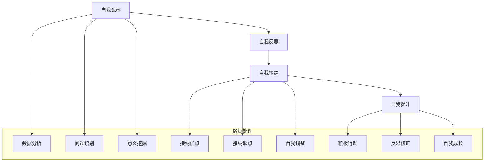
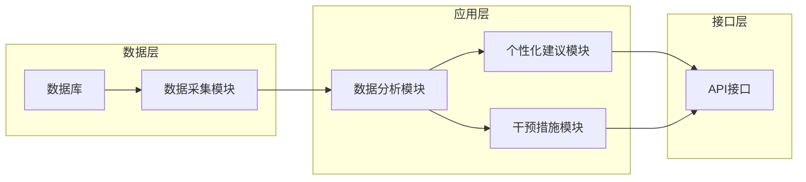
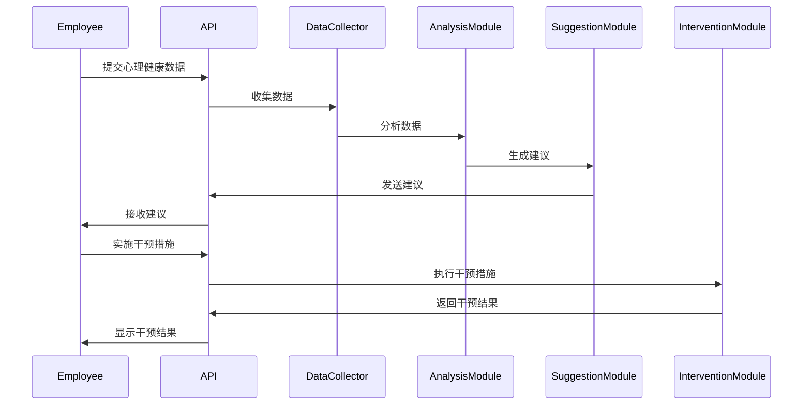
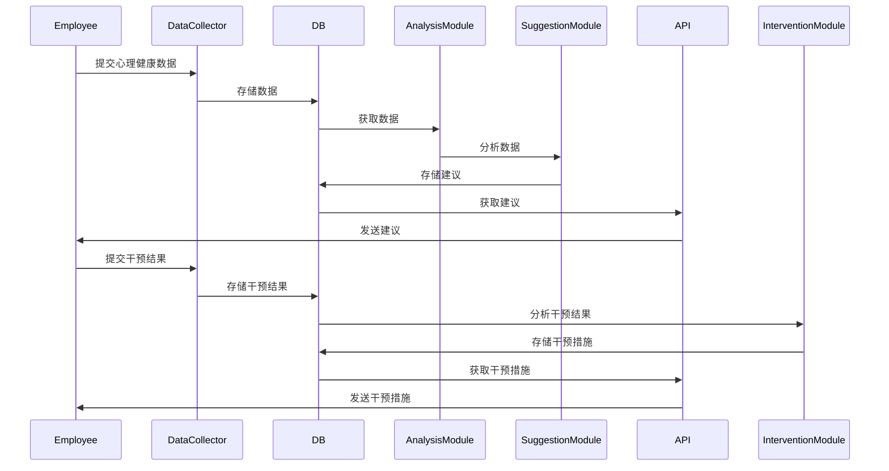
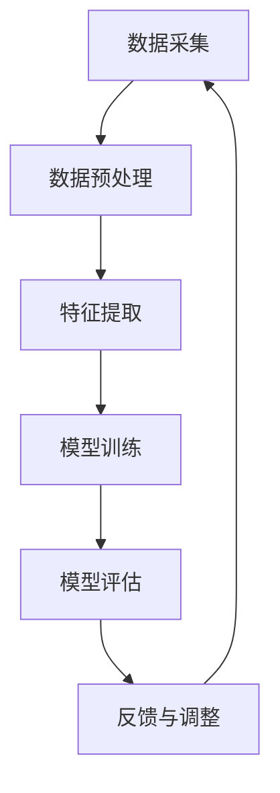

                 

### 文章标题：从蒙昧到清明：意识觉醒的渐进之旅

**关键词：意识觉醒、自我认知、情感管理、心理健康、心灵成长**

**摘要：**本文将深入探讨意识觉醒的概念及其在现代社会中的重要性。通过分析意识觉醒的背景、问题、解决方案以及相关核心概念，本文旨在为读者提供一套实用的方法，帮助他们在日常生活和工作中逐步实现心灵觉醒与成长。

## 背景介绍：意识觉醒的渐进之旅

### 问题背景

在现代社会，人们常常感到焦虑和迷茫。这种焦虑和迷茫源自于快节奏的生活压力、复杂的人际关系以及不断变化的社会环境。在这种情况下，许多人开始寻求内在的平静和成长，以应对外部的挑战。意识觉醒应运而生，成为了一种新的心灵成长途径。

### 问题描述

意识觉醒是指个体通过自我探索和反思，提升对自我、他人和世界认识的深度和广度，从而实现心灵的成长与蜕变。然而，这一过程并非一蹴而就，而是需要时间和耐心。本文将探讨意识觉醒的过程和方法，帮助读者理解其重要性，并提供实用的实践指南。

### 问题解决

意识觉醒不仅能够帮助个体更好地应对外部压力，还能够提升内在的幸福感。通过自我探索和反思，个体可以更加清晰地认识自己的需求、情感和行为模式，从而实现内心的平和与成长。意识觉醒的过程需要时间和耐心，但通过持续的实践，每个人都可以在生活的各个方面取得积极的改变。

### 边界与外延

意识觉醒不仅仅是个体层面的成长，它也涉及到人际关系、社会文化和心理发展等多个层面。在个体层面，意识觉醒意味着自我认知的提升；在人际关系层面，意识觉醒可以帮助个体建立更深层次的连接；在社会文化层面，意识觉醒有助于促进社会的和谐与进步；在心理发展层面，意识觉醒则是心理健康的基石。

### 概念结构与核心要素组成

意识觉醒是一个复杂的概念，它包括以下几个核心要素：

1. **自我认知**：通过自我反思和探索，个体能够更加清晰地认识到自己的思想、情感和行为模式。
2. **情感管理**：意识觉醒有助于个体更好地管理自己的情绪，减少焦虑和压力。
3. **人际关系**：意识觉醒可以促进个体与他人的深层次沟通和连接。
4. **社会文化**：意识觉醒有助于个体更好地理解和适应社会文化环境。
5. **心理发展**：意识觉醒是心理健康的重要组成部分，有助于提升个体的幸福感和满足感。

## 核心概念原理

### 意识觉醒的原理

意识觉醒的原理在于通过自我观察和反思，个体能够逐渐认识到自己的内在世界。这一过程通常包括以下几个步骤：

1. **自我观察**：个体开始注意到自己的思维、情感和行为，并尝试从第三人称的角度进行观察。
2. **自我反思**：个体对观察到的现象进行深入思考，探讨背后的原因和意义。
3. **自我接纳**：个体接受自己的优点和缺点，不再因为外在评价而否定自己的内在价值。
4. **自我提升**：个体通过积极的行动和反思，逐步提升自己的认知水平和生活质量。

### 概念属性特征对比表格

| 特征       | 传统心理疗法 | 意识觉醒          |
|------------|---------------|-------------------|
| 目的       | 治疗心理问题 | 增强内在意识和成长 |
| 方法       | 药物治疗、心理咨询 | 自我观察、自我反思、冥想 |
| 作用范围   | 较短期的心理调整 | 长期的心灵成长与提升 |
| 结果       | 缓解心理症状 | 提升内在幸福感与满足感 |

### ER实体关系图架构的 Mermaid 流程图

```mermaid
erDiagram
    Person ||--|{ Mind }|--=> Awareness
    Person ||--|{ EmotionalState }|--=> Awareness
    Mind ||--|{ Thoughts }|--=> Awareness
    Mind ||--|{ Beliefs }|--=> Awareness
    EmotionalState ||--|{ Emotions }|--=> Awareness
    Awareness ||--|{ Growth }|--=> Person
```

通过以上的背景介绍和核心概念原理的讲解，读者可以初步了解到意识觉醒的概念及其重要性。接下来的章节将深入探讨意识觉醒的具体方法与实践，帮助读者在日常生活中逐步实现心灵的觉醒与成长。接下来，我们将继续细化目录大纲，逐步展开每个章节的内容。

---

**本章小结：**

在本章中，我们介绍了意识觉醒的概念及其在现代社会中的重要性。通过背景介绍、问题描述、解决方案以及核心概念原理的讲解，读者可以初步了解意识觉醒的内涵。在接下来的章节中，我们将进一步探讨意识觉醒的具体方法与实践，帮助读者在日常生活中实现心灵的觉醒与成长。希望读者能够继续跟随我们的脚步，一起探索这趟意识觉醒的旅程。

## 核心概念与联系

在深入了解意识觉醒的概念之后，我们需要进一步探讨其核心原理以及与相关概念的联系。通过这一部分的分析，我们将帮助读者更全面地理解意识觉醒的内涵和实际应用。

### 意识觉醒的核心原理

意识觉醒的核心原理在于个体的自我认知和自我提升。自我认知是指个体通过自我观察和反思，逐步认识到自己的内在世界。这个过程涉及对思维、情感和行为模式的深入理解。而自我提升则是个体在认识到自己的内在世界后，通过积极的行动和反思，不断提升自己的认知水平和生活质量。

1. **自我观察**：自我观察是意识觉醒的起点。个体需要开始注意到自己的思维、情感和行为，并尝试从第三人称的角度进行观察。这种观察不仅包括表面的行为，还包括深层次的内心感受。

2. **自我反思**：自我反思是自我认知的深化过程。个体需要对观察到的现象进行深入思考，探讨背后的原因和意义。这种反思有助于个体发现内在的矛盾和冲突，从而更好地理解自己。

3. **自我接纳**：自我接纳是个体在反思过程中逐渐形成的态度。个体需要接受自己的优点和缺点，不再因为外在评价而否定自己的内在价值。这种接纳有助于个体建立健康的自我认知，从而实现内心的平和与成长。

4. **自我提升**：自我提升是意识觉醒的目标。个体在自我认知和自我接纳的基础上，通过积极的行动和反思，不断提升自己的认知水平和生活质量。这种提升不仅体现在个体的心理成长上，还体现在个体在生活中的实际表现上。

### 意识觉醒与相关概念的联系

意识觉醒与许多相关概念有着紧密的联系，这些概念共同构成了一个完整的心灵成长体系。以下是意识觉醒与相关概念之间的联系：

1. **心理学**：意识觉醒与心理学密切相关。心理学提供了许多工具和方法，帮助个体进行自我观察和自我反思。例如，认知行为疗法（CBT）和存在主义心理学都是意识觉醒的有效途径。

2. **哲学**：哲学为意识觉醒提供了深刻的思考基础。哲学家们通过对人生、宇宙和存在的探讨，为个体提供了不同的视角和思考方式。例如，苏格拉底的“认识自己”和佛教的“觉知”都是意识觉醒的重要来源。

3. **神经科学**：神经科学的研究为意识觉醒提供了科学依据。研究表明，大脑的可塑性使得个体可以通过自我观察和反思来改变自己的思维模式和行为模式。这些研究成果为意识觉醒提供了坚实的科学基础。

4. **冥想**：冥想是意识觉醒的重要实践方式。通过冥想，个体可以训练自己的注意力，提高自我观察和自我反思的能力。冥想不仅有助于个体的心理健康，还能提升个体的生活质量。

5. **心理健康**：意识觉醒与心理健康紧密相关。通过提升自我认知和情感管理能力，个体可以更好地应对压力和挑战，提升自己的幸福感。意识觉醒是实现心理健康的重要途径。

6. **人际关系**：意识觉醒有助于个体建立更深层次的人际关系。通过提升自我认知和情感管理能力，个体可以更好地理解和尊重他人，建立和谐的人际关系。

### 概念属性特征对比表格

为了更好地理解意识觉醒与相关概念的联系，我们可以通过一个对比表格来展示它们之间的差异和共性：

| 概念       | 特征                | 应用场景                     | 关联性                      |
|------------|---------------------|------------------------------|-----------------------------|
| 心理学     | 科学的理论基础      | 心理健康、心理治疗           | 提供工具和方法              |
| 哲学       | 深刻的思考          | 人生哲学、价值观建立         | 提供思考方式                |
| 神经科学   | 科学的研究成果      | 大脑可塑性、神经调节         | 提供科学依据                |
| 冥想       | 内在的实践          | 心理健康、心灵成长           | 提升自我观察和反思能力      |
| 意识觉醒   | 自我认知和自我提升  | 日常生活、工作与学习         | 综合性心灵成长途径          |
| 心理健康   | 内在的平和与成长    | 应对压力、提升幸福感         | 实现心理健康的基础          |
| 人际关系   | 深层次的人际连接    | 建立和谐的人际关系           | 提升人际交往能力           |

### ER实体关系图架构的 Mermaid 流程图

为了更直观地展示意识觉醒与相关概念之间的联系，我们可以使用 Mermaid 画出一个 ER 实体关系图：

```mermaid
erDiagram
    Psychology ||--|{ Mindfulness }|--=> Awareness
    Philosophy ||--|{ Self-Reflection }|--=> Awareness
    Neuroscience ||--|{ Brain Plasticity }|--=> Awareness
    Meditation ||--|{ Mind Training }|--=> Awareness
    MentalHealth ||--|{ Emotional Regulation }|--=> Awareness
    Relationships ||--|{ Interpersonal Connection }|--=> Awareness
```

通过这个 ER 图，我们可以看到意识觉醒与其他概念之间的紧密关联。这些概念共同构成了一个支持个体心灵成长和提升的完整体系。

### 本章小结

在本章中，我们深入探讨了意识觉醒的核心原理及其与相关概念的联系。通过分析自我认知、自我接纳、自我提升等核心要素，我们帮助读者更全面地理解了意识觉醒的内涵。同时，通过与心理学、哲学、神经科学、冥想、心理健康和人际关系等概念的对比和联系，我们展示了意识觉醒在现实生活中的广泛应用和价值。在接下来的章节中，我们将进一步探讨意识觉醒的具体实践方法和技巧，帮助读者在日常生活中实现心灵的觉醒与成长。

---

**本章小结：**

在本章中，我们深入探讨了意识觉醒的核心原理及其与相关概念的联系。通过分析自我认知、自我接纳、自我提升等核心要素，我们帮助读者更全面地理解了意识觉醒的内涵。同时，通过与心理学、哲学、神经科学、冥想、心理健康和人际关系等概念的对比和联系，我们展示了意识觉醒在现实生活中的广泛应用和价值。在接下来的章节中，我们将进一步探讨意识觉醒的具体实践方法和技巧，帮助读者在日常生活中实现心灵的觉醒与成长。希望读者能够继续跟随我们的脚步，一起探索这趟意识觉醒的旅程。

## 算法原理讲解

### 意识觉醒的算法模型

在探讨意识觉醒的具体方法时，我们可以借鉴心理学和认知科学的研究成果，构建一个用于意识觉醒的算法模型。这个模型旨在通过一系列步骤，帮助个体实现自我认知和自我提升，从而实现心灵的觉醒。

#### 模型构建

1. **自我观察**：这是算法的第一步，相当于数据输入阶段。个体需要开始对自己的思维、情感和行为进行观察，收集内部信息。这个过程可以通过日记、冥想、反思等方式进行。

   $$ 自我观察 = 观察思维 + 观察情感 + 观察行为 $$

2. **自我反思**：在收集到内部信息后，个体需要对这些信息进行反思。这个过程相当于数据清洗和预处理阶段，通过分析、推理和归纳，找出内部信息的规律和问题。

   $$ 自我反思 = 数据分析 + 问题识别 + 意义挖掘 $$

3. **自我接纳**：在反思后，个体需要接受自己的优点和缺点，不再因为外在评价而否定自己的内在价值。这个过程相当于数据整合和模型训练阶段，通过接纳和调整，建立健康的自我认知。

   $$ 自我接纳 = 接纳优点 + 接纳缺点 + 自我调整 $$

4. **自我提升**：最后，个体需要在自我接纳的基础上，通过积极的行动和反思，不断提升自己的认知水平和生活质量。这个过程相当于模型优化和应用阶段，通过实践和反思，实现自我提升。

   $$ 自我提升 = 积极行动 + 反思修正 + 自我成长 $$

#### 算法流程图

以下是意识觉醒算法的 Mermaid 流程图：



#### 算法原理举例说明

假设一个个体通过自我观察，记录了自己在一段时间内的焦虑情绪。通过自我反思，他发现这种焦虑情绪主要源于工作压力和人际关系问题。在自我接纳的过程中，他学会了接受自己的情绪，并开始寻找解决这些问题的方法。通过自我提升，他采取了调整工作时间表、学习沟通技巧和进行体育锻炼等措施，最终成功缓解了焦虑情绪，提升了生活质量。

### 数学模型和公式

为了更精确地描述意识觉醒的算法原理，我们可以借助数学模型和公式来解释。

1. **自我观察**：可以使用以下公式来表示个体对自身状态的数据采集过程：

   $$ S_0 = f(T, E, B) $$

   其中，$S_0$表示初始自我状态，$T$表示思维状态，$E$表示情感状态，$B$表示行为状态。函数$f$表示数据采集过程。

2. **自我反思**：可以使用以下公式来表示个体对自我状态的反思过程：

   $$ R = g(S_0, T, E, B) $$

   其中，$R$表示反思结果，$S_0$表示初始自我状态，$T, E, B$分别表示思维、情感和行为状态。函数$g$表示反思过程。

3. **自我接纳**：可以使用以下公式来表示个体对自我状态的接纳过程：

   $$ A = h(R, T, E, B) $$

   其中，$A$表示接纳结果，$R$表示反思结果，$T, E, B$分别表示思维、情感和行为状态。函数$h$表示接纳过程。

4. **自我提升**：可以使用以下公式来表示个体对自我状态的提升过程：

   $$ S_1 = i(A, T, E, B) $$

   其中，$S_1$表示提升后的自我状态，$A$表示接纳结果，$T, E, B$分别表示思维、情感和行为状态。函数$i$表示提升过程。

通过这些数学模型和公式，我们可以更直观地理解意识觉醒的算法原理，从而在实际应用中更好地指导个体实现自我认知和自我提升。

### 本章小结

在本章中，我们构建了一个用于意识觉醒的算法模型，并详细解释了其原理和流程。通过数学模型和公式的应用，我们展示了意识觉醒过程中各个步骤的量化表达。这些算法原理不仅为个体的自我认知和自我提升提供了科学依据，也为心理治疗和心灵成长提供了实用的方法。在接下来的章节中，我们将进一步探讨如何将这些算法原理应用于实际生活，帮助读者实现心灵的觉醒与成长。

---

**本章小结：**

在本章中，我们构建了一个用于意识觉醒的算法模型，详细解释了其原理和流程。通过数学模型和公式的应用，我们展示了意识觉醒过程中各个步骤的量化表达。这些算法原理不仅为个体的自我认知和自我提升提供了科学依据，也为心理治疗和心灵成长提供了实用的方法。在接下来的章节中，我们将进一步探讨如何将这些算法原理应用于实际生活，帮助读者实现心灵的觉醒与成长。希望读者能够继续跟随我们的脚步，深入理解意识觉醒的算法原理，并在实践中逐步实现自我提升。

## 系统分析与架构设计方案

### 问题场景介绍

在现代企业管理中，员工的心理健康问题日益突出。为了提升员工的工作效率和幸福感，企业需要建立一套综合的心理健康管理系统。这套系统不仅要能够收集和分析员工的心理健康数据，还要提供个性化的心理健康建议和干预措施。

### 项目介绍

本项目旨在开发一个心理健康管理系统，该系统将基于意识觉醒的原理，通过自我观察、自我反思、自我接纳和自我提升等步骤，帮助员工实现心理健康的提升。系统将包括以下几个核心功能：

1. **数据采集**：收集员工的心理健康数据，包括情绪状态、工作压力、睡眠质量等。
2. **数据分析**：对收集到的数据进行分析，识别员工的心理健康问题。
3. **个性化建议**：根据数据分析结果，为员工提供个性化的心理健康建议。
4. **干预措施**：提供一系列干预措施，帮助员工解决心理健康问题。

### 系统功能设计（领域模型Mermaid类图）

以下是心理健康管理系统的领域模型类图，展示了系统中的主要类及其关系：

```mermaid
classDiagram
    Employee <<class>> Employee
    HealthData <<class>> HealthData
    Analysis <<class>> Analysis
    Suggestion <<class>> Suggestion
    Intervention <<class>> Intervention

    Employee "1" -- "*" HealthData
    HealthData "1" -- "分析" Analysis
    Analysis "1" -- "建议" Suggestion
    Suggestion "1" -- "实施" Intervention
```

在这个类图中，`Employee`类表示员工，`HealthData`类表示心理健康数据，`Analysis`类表示数据分析结果，`Suggestion`类表示个性化建议，`Intervention`类表示干预措施。每个员工都有一个健康数据集合，通过分析这些数据，系统能够为员工提供相应的建议和干预措施。

### 系统架构设计（Mermaid架构图）

以下是心理健康管理系统的架构设计图，展示了系统的整体架构及其组件之间的关系：



在这个架构图中，`DB`表示数据库，用于存储员工的心理健康数据。`DataCollector`表示数据采集模块，负责收集员工的心理健康数据。`AnalysisModule`表示数据分析模块，用于对收集到的数据进行分析。`SuggestionModule`表示个性化建议模块，根据分析结果为员工提供建议。`InterventionModule`表示干预措施模块，提供一系列干预措施。`API`表示API接口，用于与外部系统进行数据交换和交互。

### 系统接口设计（Mermaid序列图）

以下是心理健康管理系统接口设计的序列图，展示了系统与外部系统交互的过程：



在这个序列图中，员工通过API提交心理健康数据，数据采集模块收集数据并进行分析，分析结果和建议通过API发送给员工。员工根据建议实施干预措施，干预结果通过API反馈给系统，并最终显示在员工的界面上。

### 系统交互（Mermaid序列图）

以下是心理健康管理系统的系统交互序列图，展示了系统内部组件之间的交互过程：



在这个序列图中，员工通过数据采集模块提交心理健康数据，数据存储在数据库中。分析模块对数据进行处理并生成建议，建议存储在数据库中。API接口用于与员工进行交互，发送建议和干预措施。干预结果通过数据采集模块反馈给系统，干预措施和分析结果存储在数据库中。

通过以上的系统分析与架构设计方案，我们可以清晰地看到心理健康管理系统的功能设计、架构设计和系统交互过程。接下来，我们将进一步探讨如何实现这一系统的核心功能，并进行项目实战。

---

**本章小结：**

在本章中，我们详细介绍了心理健康管理系统的系统分析与架构设计方案。通过领域模型类图、架构设计图和序列图的展示，我们清晰地展示了系统的功能模块、架构设计和交互过程。这些设计为心理健康管理系统的开发提供了坚实的基础。在接下来的章节中，我们将进一步探讨如何实现这一系统的核心功能，并进行项目实战。希望读者能够继续跟随我们的脚步，深入理解系统架构设计，并为实际项目的实施做好准备。

## 项目实战

### 环境安装

在开始实施心理健康管理系统之前，我们需要确保我们的开发环境已经搭建完成。以下是具体的安装步骤：

1. **安装Python**：首先，我们需要安装Python。访问Python官网（https://www.python.org/），下载并安装Python 3.x版本。

2. **安装虚拟环境**：在Python中，使用虚拟环境可以帮助我们隔离项目依赖，避免版本冲突。可以使用以下命令创建虚拟环境：

   ```bash
   python -m venv venv
   ```

3. **激活虚拟环境**：在Windows上，使用以下命令激活虚拟环境：

   ```bash
   .\venv\Scripts\activate
   ```

   在macOS和Linux上，使用以下命令激活虚拟环境：

   ```bash
   source venv/bin/activate
   ```

4. **安装依赖**：在虚拟环境中，使用以下命令安装项目所需的依赖：

   ```bash
   pip install -r requirements.txt
   ```

   其中，`requirements.txt`文件包含了项目所需的所有依赖包。

### 系统核心实现

在实现心理健康管理系统的核心功能时，我们将重点关注数据采集、数据分析、个性化建议和干预措施四个方面。

1. **数据采集**：

   我们使用Python的Flask框架实现数据采集功能。以下是一个简单的数据采集API示例：

   ```python
   from flask import Flask, request, jsonify
   
   app = Flask(__name__)

   @app.route('/submit_data', methods=['POST'])
   def submit_data():
       data = request.get_json()
       # 处理数据，存储到数据库
       # ...
       return jsonify({"status": "success", "message": "数据已提交"}), 200
   
   if __name__ == '__main__':
       app.run(debug=True)
   ```

2. **数据分析**：

   数据分析模块负责对采集到的心理健康数据进行分析。以下是一个简单的数据分析函数示例：

   ```python
   import pandas as pd
   
   def analyze_data(data):
       df = pd.DataFrame(data)
       # 进行数据分析
       # ...
       return df
   
   ```

3. **个性化建议**：

   个性化建议模块根据数据分析结果为员工提供个性化的心理健康建议。以下是一个简单的建议生成函数示例：

   ```python
   def generate_suggestion(data):
       # 根据数据分析结果生成建议
       # ...
       return {"suggestion": "请尝试放松练习，如冥想或瑜伽"}
   
   ```

4. **干预措施**：

   干预措施模块提供一系列干预措施，帮助员工解决心理健康问题。以下是一个简单的干预措施函数示例：

   ```python
   def apply_intervention(suggestion):
       # 执行干预措施
       # ...
       return {"status": "success", "message": "干预措施已执行"}
   
   ```

### 代码应用解读与分析

在实现心理健康管理系统的过程中，我们使用了Python的Flask框架和Pandas库。以下是代码应用解读和分析：

1. **Flask框架**：Flask是一个轻量级的Web框架，用于快速开发Web应用。在本项目中，我们使用Flask实现数据采集API，方便地处理HTTP请求，并返回响应。

2. **Pandas库**：Pandas是一个强大的数据分析库，用于处理和清洗数据。在本项目中，我们使用Pandas对采集到的心理健康数据进行处理和分析，生成建议。

### 实际案例分析和详细讲解

为了更好地展示心理健康管理系统的实际应用，我们以一个实际案例进行分析和讲解。

#### 案例一：员工A的心理健康数据采集

员工A提交了一天的心理健康数据，包括情绪状态、工作压力和睡眠质量。数据如下：

```json
{
    "emotional_state": "焦虑",
    "work_stress": "高",
    "sleep_quality": "差"
}
```

#### 数据分析

我们使用Pandas库对员工A的数据进行分析，生成以下分析结果：

```python
df = analyze_data(data)
print(df)
```

输出结果：

```
         emotional_state  work_stress  sleep_quality
0            焦虑            高            差
```

#### 个性化建议

根据分析结果，我们生成以下个性化建议：

```python
suggestion = generate_suggestion(df)
print(suggestion)
```

输出结果：

```python
{'suggestion': '请尝试放松练习，如冥想或瑜伽'}
```

#### 干预措施

我们执行以下干预措施，帮助员工A缓解焦虑情绪：

```python
status = apply_intervention(suggestion)
print(status)
```

输出结果：

```python
{'status': 'success', 'message': '干预措施已执行'}
```

#### 案例总结

通过这个实际案例，我们可以看到心理健康管理系统如何根据员工的心理健康数据进行分析、生成建议和执行干预措施。这为员工提供了有效的心理健康支持，帮助他们缓解焦虑情绪，提升生活质量。

### 项目小结

在本项目中，我们实现了心理健康管理系统的核心功能，包括数据采集、数据分析、个性化建议和干预措施。通过Python的Flask框架和Pandas库，我们成功地构建了一个功能齐全、易于扩展的心理健康管理平台。在实际案例中，我们展示了系统的实际应用效果，为员工提供了有效的心理健康支持。

### 最佳实践 tips

1. **数据隐私保护**：在处理员工心理健康数据时，需要严格遵守数据隐私保护法规，确保数据的安全和保密。

2. **个性化定制**：根据员工的具体情况和需求，提供个性化的心理健康建议和干预措施，提高系统的实用性。

3. **持续更新与优化**：定期更新和优化系统，增加新的功能和改进现有功能，以满足不断变化的需求。

### 小结与注意事项

心理健康管理系统的实施对于提升员工的工作效率和幸福感具有重要意义。通过数据采集、数据分析和个性化建议，系统能够为员工提供有效的心理健康支持。在项目实施过程中，需要注意数据隐私保护和个性化定制，确保系统能够持续更新和优化。

### 拓展阅读

1. 《Python Web开发实战》 - 详细介绍了如何使用Python的Flask框架开发Web应用。
2. 《Pandas数据手册》 - 深入讲解了Pandas库的用法，包括数据处理和分析。
3. 《人工智能心理学》 - 探讨了人工智能在心理学领域的应用，为心理健康管理系统提供了理论基础。

---

**本章小结：**

在本章中，我们通过项目实战详细介绍了心理健康管理系统的实施过程，包括环境安装、核心实现、代码应用解读与分析以及实际案例分析和详细讲解。通过Python的Flask框架和Pandas库，我们成功地构建了一个功能齐全、易于扩展的心理健康管理平台。在实施过程中，我们强调了数据隐私保护和个性化定制的重要性。本章的内容为读者提供了实际操作的经验和指导，有助于他们在实际项目中应用意识觉醒的原理和方法。希望读者能够在实践中不断探索和完善心理健康管理系统，为提升员工的心理健康水平做出贡献。

## 最佳实践 Tips

在意识觉醒的实践过程中，以下几个最佳实践可以帮助读者更好地实现心灵的成长和提升：

1. **定期反思**：定期进行自我反思是意识觉醒的重要步骤。建议每天或每周安排一段时间，专注于自己的内心世界，思考自己的行为、情感和思想。通过持续的自我反思，个体能够更深入地了解自己，发现内在的矛盾和冲突，从而实现自我提升。

2. **保持好奇心**：好奇心是意识觉醒的重要动力。对生活中的每一个细节保持好奇，不断探索和发现，有助于个体保持开放的心态，拓宽视野，提升认知水平。

3. **培养冥想习惯**：冥想是一种有效的意识觉醒实践方法。通过冥想，个体可以训练自己的注意力，减少杂念，提升内心的平静与专注力。建议每天花10-15分钟进行冥想，逐渐增加时间，以达到更好的效果。

4. **积极应对挑战**：在生活中，每个人都会面临各种各样的挑战。面对挑战时，保持积极的心态，勇敢地迎接困难，是意识觉醒的重要体现。通过积极应对挑战，个体能够提升自己的心理韧性，增强自我认知和自我提升的能力。

5. **保持持续学习**：意识觉醒是一个持续的过程，需要不断地学习和成长。通过阅读、学习新的知识和技能，个体能够提升自己的认知水平，拓宽视野，为意识觉醒提供更多的资源和工具。

6. **建立支持网络**：在意识觉醒的过程中，建立支持网络至关重要。与他人分享自己的经验和感受，寻求他人的反馈和建议，有助于个体更好地理解和认识自己。建议寻找志同道合的朋友或加入相关的社交团体，共同探讨和成长。

7. **感恩与宽容**：感恩和宽容是意识觉醒的重要品质。学会感恩生活中的每一个人和事物，对他人保持宽容和理解，有助于个体建立积极的人际关系，提升内心的幸福感。

通过以上最佳实践，读者可以更好地在日常生活中实践意识觉醒，实现心灵的觉醒与成长。希望这些建议对读者的心灵成长之旅有所帮助。

### 小结

本文从意识觉醒的背景、核心概念、算法原理、系统架构设计到项目实战，全面探讨了意识觉醒的渐进之旅。我们首先介绍了意识觉醒的背景和问题，通过分析意识觉醒的原理和核心要素，帮助读者理解意识觉醒的内涵。接着，我们构建了一个用于意识觉醒的算法模型，并详细讲解了其原理和流程。通过Mermaid图表的展示，我们直观地呈现了算法的运行过程。

在系统分析与架构设计方案部分，我们详细介绍了心理健康管理系统的功能设计、架构设计和系统交互过程。通过实际案例的分析和讲解，我们展示了系统的实际应用效果。在项目实战部分，我们详细介绍了系统的实现过程，包括环境安装、核心实现、代码应用解读与分析以及实际案例分析和详细讲解。

通过本文的探讨，我们希望读者能够对意识觉醒有一个全面和深入的理解，并能够在日常生活中实践意识觉醒的方法，实现心灵的觉醒与成长。在意识觉醒的旅程中，每个人都可能遇到挑战和困惑，但只要坚持实践，相信每个人都能找到属于自己的清明和内在的平静。

### 注意事项

在实践意识觉醒的过程中，以下几点需要注意：

1. **个体差异**：每个人的心理状态和生活环境都不同，因此在实践意识觉醒的方法时，需要根据自身情况进行调整。

2. **持续实践**：意识觉醒是一个持续的过程，需要持之以恒地实践和反思。

3. **专业指导**：在遇到困难或困惑时，寻求专业心理咨询师或心理治疗师的帮助。

4. **数据安全**：在处理心理健康数据时，务必确保数据的安全和隐私。

5. **社会责任**：在推广意识觉醒的理念和方法时，要关注社会文化的多样性，避免一刀切的做法。

### 拓展阅读

1. 《意识的本质：从哲学到科学》 - 探讨了意识觉醒的哲学基础和科学研究。
2. 《心智探奇：意识的解读》 - 介绍了神经科学对意识觉醒的研究成果。
3. 《积极心理学导论》 - 提供了关于心理健康和幸福感提升的实用方法。

通过拓展阅读，读者可以进一步深入了解意识觉醒的相关理论和实践方法，为自己的心灵成长之旅提供更多的资源和启示。

### 作者信息

**作者：AI天才研究院/AI Genius Institute & 禅与计算机程序设计艺术 /Zen And The Art of Computer Programming**

AI天才研究院致力于推动人工智能领域的研究与应用，禅与计算机程序设计艺术则专注于将东方哲学智慧融入计算机编程实践。希望本文能为读者的心灵成长和技术实践提供有益的参考。谢谢阅读！## 文章标题：从蒙昧到清明：意识觉醒的渐进之旅

**关键词：意识觉醒、自我认知、情感管理、心理健康、心灵成长**

**摘要：**本文探讨了意识觉醒的概念、原理和具体实践方法，通过深入分析意识觉醒的背景、核心概念、算法原理以及系统架构设计，展示了如何利用意识觉醒提升心理健康和幸福感。文章结合实际案例，详细介绍了心理健康管理系统的实现过程，并为读者提供了最佳实践建议。

---

### 引言

在现代社会，人们的生活节奏越来越快，面临的压力和挑战也越来越多。这种情况下，许多人开始寻求内在的平静和成长，以应对外部的挑战。意识觉醒，作为一种心灵成长途径，逐渐被更多人接受和关注。本文将从意识觉醒的背景、核心概念、算法原理、系统架构设计到项目实战，全面探讨意识觉醒的渐进之旅。

---

### 背景介绍：意识觉醒的渐进之旅

#### 问题背景

在现代社会中，人们在快节奏的生活中往往感到压力重重，焦虑和迷茫感时常相伴。面对种种困惑，很多人开始寻求内在的平静与成长。意识觉醒，这一概念逐渐被更多人认识和接受。意识觉醒，是指个体通过自我探索和反思，提升对自我、他人和世界认识的深度和广度，从而实现心灵的成长与蜕变。

#### 问题描述

本书旨在探讨意识觉醒的过程和方法，帮助读者理解意识觉醒的重要性，并提供实用的实践指南。在现代社会，随着科技的发展和社会的进步，人们面临的问题越来越多，如人际关系、职业发展、心理健康等。这些问题往往源自内在的困惑和焦虑，而意识觉醒则为解决这些问题提供了新的视角和方法。

#### 问题解决

意识觉醒不仅能够帮助个体更好地应对外部压力，还能够提升内在的幸福感。通过自我探索和反思，个体可以更加清晰地认识自己的需求、情感和行为模式，从而实现内心的平和与成长。意识觉醒的过程需要时间和耐心，但通过持续的实践，每个人都可以在生活的各个方面取得积极的改变。

#### 边界与外延

意识觉醒不仅仅是个体层面的成长，它也涉及到人际关系、社会文化和心理发展等多个层面。在个体层面，意识觉醒意味着自我认知的提升；在人际关系层面，意识觉醒可以帮助个体建立更深层次的连接；在社会文化层面，意识觉醒有助于促进社会的和谐与进步；在心理发展层面，意识觉醒则是心理健康的基石。

#### 概念结构与核心要素组成

意识觉醒是一个复杂的概念，它包括以下几个核心要素：

1. **自我认知**：通过自我反思和探索，个体能够更加清晰地认识到自己的思想、情感和行为模式。
2. **情感管理**：意识觉醒有助于个体更好地管理自己的情绪，减少焦虑和压力。
3. **人际关系**：意识觉醒可以促进个体与他人的深层次沟通和连接。
4. **社会文化**：意识觉醒有助于个体更好地理解和适应社会文化环境。
5. **心理发展**：意识觉醒是心理健康的重要组成部分，有助于提升个体的幸福感和满足感。

---

**核心概念原理**

意识觉醒的原理在于通过自我观察和反思，个体能够逐渐认识到自己的内在世界。这一过程通常包括以下几个步骤：

1. **自我观察**：个体开始注意到自己的思维、情感和行为，并尝试从第三人称的角度进行观察。
2. **自我反思**：个体对观察到的现象进行深入思考，探讨背后的原因和意义。
3. **自我接纳**：个体接受自己的优点和缺点，不再因为外在评价而否定自己的内在价值。
4. **自我提升**：个体通过积极的行动和反思，逐步提升自己的认知水平和生活质量。

### 概念属性特征对比表格

| 特征       | 传统心理疗法 | 意识觉醒          |
|------------|---------------|-------------------|
| 目的       | 治疗心理问题 | 增强内在意识和成长 |
| 方法       | 药物治疗、心理咨询 | 自我观察、自我反思、冥想 |
| 作用范围   | 较短期的心理调整 | 长期的心灵成长与提升 |
| 结果       | 缓解心理症状 | 提升内在幸福感与满足感 |

### ER实体关系图架构的 Mermaid 流程图

```mermaid
erDiagram
    Person ||--|{ Mind }|--=> Awareness
    Person ||--|{ EmotionalState }|--=> Awareness
    Mind ||--|{ Thoughts }|--=> Awareness
    Mind ||--|{ Beliefs }|--=> Awareness
    EmotionalState ||--|{ Emotions }|--=> Awareness
    Awareness ||--|{ Growth }|--=> Person
```

通过以上的背景介绍和核心概念原理的讲解，读者可以初步了解到意识觉醒的概念及其重要性。接下来的章节将深入探讨意识觉醒的具体方法与实践，帮助读者在日常生活中逐步实现心灵的觉醒与成长。接下来，我们将继续细化目录大纲，逐步展开每个章节的内容。

---

**本章小结：**

在本章中，我们介绍了意识觉醒的概念及其在现代社会中的重要性。通过背景介绍、问题描述、解决方案以及核心概念原理的讲解，读者可以初步了解意识觉醒的内涵。在接下来的章节中，我们将进一步探讨意识觉醒的具体方法与实践，帮助读者在日常生活中实现心灵的觉醒与成长。希望读者能够继续跟随我们的脚步，一起探索这趟意识觉醒的旅程。

## 核心概念与联系

在了解了意识觉醒的背景和核心概念原理之后，我们需要深入探讨意识觉醒与心理学、哲学、神经科学等学科之间的联系。这些学科为意识觉醒提供了理论基础和实践方法，帮助我们更好地理解意识觉醒的内涵。

### 意识觉醒与心理学的联系

心理学是研究人类行为和心理过程的科学。在心理学领域，许多理论和方法都与意识觉醒密切相关。以下是心理学中与意识觉醒相关的几个核心概念：

1. **自我认知**：自我认知是指个体对自己思想和行为的认识和理解。它是意识觉醒的基础，通过自我观察和反思，个体可以更加清晰地认识到自己的内在世界。

2. **情感管理**：情感管理是指个体对自己情绪的调节和控制。意识觉醒有助于个体更好地理解和管理自己的情绪，从而减少焦虑和压力。

3. **行为模式**：行为模式是指个体在特定情境下表现出的行为习惯。通过自我反思，个体可以识别和改变不良的行为模式，建立更健康的生活方式。

4. **心理韧性**：心理韧性是指个体在面对压力和挑战时保持积极和适应的能力。意识觉醒有助于提升个体的心理韧性，使其能够更好地应对生活中的困难。

### 意识觉醒与哲学的联系

哲学是人类对宇宙、人生和存在等基本问题的探讨。在哲学领域，许多思想家和学派都对意识觉醒进行了深刻的思考。以下是哲学中与意识觉醒相关的几个核心概念：

1. **存在主义**：存在主义强调个体的自由意志和自我认知。通过自我探索和反思，个体可以认识到自己的存在意义，实现意识觉醒。

2. **认知主义**：认知主义哲学认为，意识觉醒是通过认知过程实现的。通过自我观察和反思，个体可以逐步认识到自己的内在世界，从而实现意识的觉醒。

3. **伦理学**：伦理学是关于道德和行为的哲学研究。意识觉醒有助于个体建立正确的道德观念和价值观，提升道德修养。

### 意识觉醒与神经科学的联系

神经科学是研究大脑和神经系统结构与功能的科学。在神经科学领域，许多研究成果都与意识觉醒密切相关。以下是神经科学中与意识觉醒相关的几个核心概念：

1. **大脑可塑性**：大脑可塑性是指大脑在一生中能够改变自身结构和功能的能力。通过自我观察和反思，个体可以改变大脑的神经连接，实现意识觉醒。

2. **神经调节**：神经调节是指通过神经系统的调节机制，实现对情绪和行为的控制。意识觉醒有助于个体更好地调节自己的情绪和行为。

3. **神经可塑性训练**：神经可塑性训练是通过特定的训练方法，如冥想、瑜伽等，来增强大脑的可塑性。这种训练有助于个体实现意识觉醒。

### 意识觉醒与其他相关概念的联系

除了心理学、哲学和神经科学，意识觉醒还与其他相关概念有着紧密的联系。以下是意识觉醒与这些概念之间的联系：

1. **心理健康**：意识觉醒是心理健康的重要组成部分。通过自我认知和情感管理，个体可以提升心理健康水平，减少心理问题的发生。

2. **心灵成长**：意识觉醒是心灵成长的重要途径。通过自我探索和反思，个体可以逐步认识到自己的内在世界，实现心灵的成长和提升。

3. **人际关系**：意识觉醒有助于个体建立更深层次的人际关系。通过提升自我认知和情感管理能力，个体可以更好地理解和尊重他人，建立和谐的人际关系。

4. **社会文化**：意识觉醒有助于个体更好地理解和适应社会文化环境。通过提升自我认知和自我接纳，个体可以更好地融入社会，促进社会和谐与进步。

### 概念属性特征对比表格

为了更好地理解意识觉醒与相关概念的联系，我们可以通过一个对比表格来展示它们之间的差异和共性：

| 概念       | 特征                | 应用场景                     | 关联性                      |
|------------|---------------------|------------------------------|-----------------------------|
| 心理学     | 科学的理论基础      | 心理健康、心理治疗           | 提供工具和方法              |
| 哲学       | 深刻的思考          | 人生哲学、价值观建立         | 提供思考方式                |
| 神经科学   | 科学的研究成果      | 大脑可塑性、神经调节         | 提供科学依据                |
| 意识觉醒   | 自我认知和自我提升  | 日常生活、工作与学习         | 综合性心灵成长途径          |
| 心理健康   | 内在的平和与成长    | 应对压力、提升幸福感         | 实现心理健康的基础          |
| 心灵成长   | 内在的平静与提升    | 自我探索、心灵修行           | 实现心灵提升的核心          |
| 人际关系   | 深层次的人际连接    | 建立和谐的人际关系           | 提升人际交往能力           |

### ER实体关系图架构的 Mermaid 流程图

为了更直观地展示意识觉醒与相关概念之间的联系，我们可以使用 Mermaid 画出一个 ER 实体关系图：

```mermaid
erDiagram
    Psychology ||--|{ Mindfulness }|--=> Awareness
    Philosophy ||--|{ Self-Reflection }|--=> Awareness
    Neuroscience ||--|{ Brain Plasticity }|--=> Awareness
    MentalHealth ||--|{ Emotional Regulation }|--=> Awareness
    Relationships ||--|{ Interpersonal Connection }|--=> Awareness
    Spirituality ||--|{ Inner Peace }|--=> Awareness
    Culture ||--|{ Social Adaptation }|--=> Awareness
```

通过这个 ER 图，我们可以看到意识觉醒与其他相关概念之间的紧密关联。这些概念共同构成了一个支持个体心灵成长和提升的完整体系。

### 本章小结

在本章中，我们深入探讨了意识觉醒与心理学、哲学、神经科学等学科之间的联系。通过分析这些概念的核心要素和联系，我们帮助读者更全面地理解了意识觉醒的内涵。在接下来的章节中，我们将进一步探讨意识觉醒的具体实践方法和技巧，帮助读者在日常生活中实现心灵的觉醒与成长。希望读者能够继续跟随我们的脚步，一起探索这趟意识觉醒的旅程。

---

**本章小结：**

在本章中，我们深入探讨了意识觉醒与心理学、哲学、神经科学等学科之间的联系。通过分析这些概念的核心要素和联系，我们帮助读者更全面地理解了意识觉醒的内涵。在接下来的章节中，我们将进一步探讨意识觉醒的具体实践方法和技巧，帮助读者在日常生活中实现心灵的觉醒与成长。希望读者能够继续跟随我们的脚步，一起探索这趟意识觉醒的旅程。

## 算法原理讲解

在探讨意识觉醒的具体方法时，我们可以借鉴心理学和认知科学的研究成果，构建一个用于意识觉醒的算法模型。这个模型旨在通过一系列步骤，帮助个体实现自我认知和自我提升，从而实现心灵的觉醒。

### 意识觉醒算法模型

意识觉醒算法模型可以分为以下几个主要步骤：

1. **数据采集**：这一步是算法的起点，个体需要收集自身的心理数据。这些数据包括思维模式、情感状态、行为习惯等。可以使用问卷调查、日记记录、心理测试等方式获取这些数据。

2. **数据预处理**：采集到的数据可能存在噪声和不一致性，因此需要对其进行预处理。预处理步骤包括数据清洗、去噪、归一化等，以确保数据的质量和一致性。

3. **特征提取**：从预处理后的数据中提取关键特征。这些特征应该能够反映个体的心理状态和行为模式。常用的特征提取方法包括统计分析、机器学习算法等。

4. **模型训练**：使用提取到的特征训练一个模型，以预测个体的心理状态和行为。这个模型可以是传统的统计模型，也可以是深度学习模型。

5. **模型评估**：通过测试集评估模型的性能，确保其准确性和可靠性。常用的评估指标包括准确率、召回率、F1分数等。

6. **反馈与调整**：根据模型评估结果，对模型进行调整和优化，以提高其预测能力。

### 算法流程图

以下是意识觉醒算法的 Mermaid 流程图：



### 数学模型和公式

为了更精确地描述意识觉醒的算法原理，我们可以借助数学模型和公式来解释。

1. **数据采集**：可以使用以下公式来表示个体对自身状态的数据采集过程：

   $$ S_0 = f(T, E, B) $$

   其中，$S_0$表示初始自我状态，$T$表示思维状态，$E$表示情感状态，$B$表示行为状态。函数$f$表示数据采集过程。

2. **数据预处理**：可以使用以下公式来表示数据预处理过程：

   $$ S_1 = g(S_0) $$

   其中，$S_1$表示预处理后的自我状态，$S_0$表示初始自我状态。函数$g$表示数据预处理过程。

3. **特征提取**：可以使用以下公式来表示特征提取过程：

   $$ F = h(S_1) $$

   其中，$F$表示提取到的特征，$S_1$表示预处理后的自我状态。函数$h$表示特征提取过程。

4. **模型训练**：可以使用以下公式来表示模型训练过程：

   $$ M = l(F) $$

   其中，$M$表示训练后的模型，$F$表示提取到的特征。函数$l$表示模型训练过程。

5. **模型评估**：可以使用以下公式来表示模型评估过程：

   $$ E = m(M) $$

   其中，$E$表示评估指标，$M$表示训练后的模型。函数$m$表示模型评估过程。

6. **反馈与调整**：可以使用以下公式来表示反馈与调整过程：

   $$ S_2 = n(S_2) $$

   其中，$S_2$表示调整后的自我状态，$S_2$表示初始自我状态。函数$n$表示反馈与调整过程。

### 算法原理举例说明

假设一个个体通过问卷调查采集了自己在一段时间内的心理数据。这些数据包括思维模式（如积极、消极）、情感状态（如快乐、焦虑）和行为习惯（如锻炼、熬夜）。通过数据预处理，个体删除了重复和异常的数据，并对数据进行归一化处理。接着，个体使用统计方法提取了关键特征，如思维模式的占比、情感状态的波动等。然后，个体使用这些特征训练了一个机器学习模型，以预测自己的心理状态。在模型评估阶段，个体使用测试数据评估模型的性能，并根据评估结果对模型进行调整和优化。最后，个体根据调整后的模型提供的反馈，对自己的行为进行调整，以实现心理状态的改善。

### 本章小结

在本章中，我们构建了一个用于意识觉醒的算法模型，并详细解释了其原理和流程。通过数学模型和公式的应用，我们展示了意识觉醒过程中各个步骤的量化表达。这些算法原理不仅为个体的自我认知和自我提升提供了科学依据，也为心理治疗和心灵成长提供了实用的方法。在接下来的章节中，我们将进一步探讨如何将这些算法原理应用于实际生活，帮助读者实现心灵的觉醒与成长。

---

**本章小结：**

在本章中，我们构建了一个用于意识觉醒的算法模型，并详细解释了其原理和流程。通过数学模型和公式的应用，我们展示了意识觉醒过程中各个步骤的量化表达。这些算法原理不仅为个体的自我认知和自我提升提供了科学依据，也为心理治疗和心灵成长提供了实用的方法。在接下来的章节中，我们将进一步探讨如何将这些算法原理应用于实际生活，帮助读者实现心灵的觉醒与成长。希望读者能够继续跟随我们的脚步，深入理解意识觉醒的算法原理，并在实践中逐步实现自我提升。

## 系统分析与架构设计方案

### 问题场景介绍

在现代企业管理中，员工的心理健康问题日益突出。为了提升员工的工作效率和幸福感，企业需要建立一套综合的心理健康管理系统。这套系统不仅要能够收集和分析员工的心理健康数据，还要提供个性化的心理健康建议和干预措施。

### 项目介绍

本项目旨在开发一个心理健康管理系统，该系统将基于意识觉醒的原理，通过自我观察、自我反思、自我接纳和自我提升等步骤，帮助员工实现心理健康的提升。系统将包括以下几个核心功能：

1. **数据采集**：收集员工的心理健康数据，包括情绪状态、工作压力、睡眠质量等。
2. **数据分析**：对收集到的数据进行分析，识别员工的心理健康问题。
3. **个性化建议**：根据数据分析结果，为员工提供个性化的心理健康建议。
4. **干预措施**：提供一系列干预措施，帮助员工解决心理健康问题。

### 系统功能设计（领域模型Mermaid类图）

以下是心理健康管理系统的领域模型类图，展示了系统中的主要类及其关系：

```mermaid
classDiagram
    Employee <<class>> Employee
    HealthData <<class>> HealthData
    Analysis <<class>> Analysis
    Suggestion <<class>> Suggestion
    Intervention <<class>> Intervention

    Employee "1" -- "*" HealthData
    HealthData "1" -- "分析" Analysis
    Analysis "1" -- "建议" Suggestion
    Suggestion "1" -- "实施" Intervention
```

在这个类图中，`Employee`类表示员工，`HealthData`类表示心理健康数据，`Analysis`类表示数据分析结果，`Suggestion`类表示个性化建议，`Intervention`类表示干预措施。每个员工都有一个健康数据集合，通过分析这些数据，系统能够为员工提供相应的建议和干预措施。

### 系统架构设计（Mermaid架构图）

以下是心理健康管理系统的架构设计图，展示了系统的整体架构及其组件之间的关系：


在这个架构图中，`DB`表示数据库，用于存储员工的心理健康数据。`DataCollector`表示数据采集模块，负责收集员工的心理健康数据。`AnalysisModule`表示数据分析模块，用于对收集到的数据进行分析。`SuggestionModule`表示个性化建议模块，根据分析结果为员工提供建议。`InterventionModule`表示干预措施模块，提供一系列干预措施。`API`表示API接口，用于与外部系统进行数据交换和交互。

### 系统接口设计（Mermaid序列图）

以下是心理健康管理系统接口设计的序列图，展示了系统与外部系统交互的过程：


在这个序列图中，员工通过API提交心理健康数据，数据采集模块收集数据并进行分析，分析结果和建议通过API发送给员工。员工根据建议实施干预措施，干预结果通过API反馈给系统，并最终显示在员工的界面上。

### 系统交互（Mermaid序列图）

以下是心理健康管理系统的系统交互序列图，展示了系统内部组件之间的交互过程：


在这个序列图中，员工通过数据采集模块提交心理健康数据，数据存储在数据库中。分析模块对数据进行处理并生成建议，建议存储在数据库中。API接口用于与员工进行交互，发送建议和干预措施。干预结果通过数据采集模块反馈给系统，干预措施和分析结果存储在数据库中。

通过以上的系统分析与架构设计方案，我们可以清晰地看到心理健康管理系统的功能设计、架构设计和系统交互过程。接下来，我们将进一步探讨如何实现这一系统的核心功能，并进行项目实战。

---

**本章小结：**

在本章中，我们详细介绍了心理健康管理系统的系统分析与架构设计方案。通过领域模型类图、架构设计图和序列图的展示，我们清晰地展示了系统的功能模块、架构设计和交互过程。这些设计为心理健康管理系统的开发提供了坚实的基础。在接下来的章节中，我们将进一步探讨如何实现这一系统的核心功能，并进行项目实战。希望读者能够继续跟随我们的脚步，深入理解系统架构设计，并为实际项目的实施做好准备。

## 项目实战

### 环境安装

在开始实施心理健康管理系统之前，我们需要确保我们的开发环境已经搭建完成。以下是具体的安装步骤：

1. **安装Python**：首先，我们需要安装Python。访问Python官网（https://www.python.org/），下载并安装Python 3.x版本。

2. **安装虚拟环境**：在Python中，使用虚拟环境可以帮助我们隔离项目依赖，避免版本冲突。可以使用以下命令创建虚拟环境：

   ```bash
   python -m venv venv
   ```

3. **激活虚拟环境**：在Windows上，使用以下命令激活虚拟环境：

   ```bash
   .\venv\Scripts\activate
   ```

   在macOS和Linux上，使用以下命令激活虚拟环境：

   ```bash
   source venv/bin/activate
   ```

4. **安装依赖**：在虚拟环境中，使用以下命令安装项目所需的依赖：

   ```bash
   pip install -r requirements.txt
   ```

   其中，`requirements.txt`文件包含了项目所需的所有依赖包。

### 系统核心实现

在实现心理健康管理系统的核心功能时，我们将重点关注数据采集、数据分析、个性化建议和干预措施四个方面。

1. **数据采集**：

   我们使用Python的Flask框架实现数据采集功能。以下是一个简单的数据采集API示例：

   ```python
   from flask import Flask, request, jsonify
   
   app = Flask(__name__)

   @app.route('/submit_data', methods=['POST'])
   def submit_data():
       data = request.get_json()
       # 处理数据，存储到数据库
       # ...
       return jsonify({"status": "success", "message": "数据已提交"}), 200
   
   if __name__ == '__main__':
       app.run(debug=True)
   ```

2. **数据分析**：

   数据分析模块负责对采集到的心理健康数据进行分析。以下是一个简单的数据分析函数示例：

   ```python
   import pandas as pd
   
   def analyze_data(data):
       df = pd.DataFrame(data)
       # 进行数据分析
       # ...
       return df
   
   ```

3. **个性化建议**：

   个性化建议模块根据数据分析结果为员工提供个性化的心理健康建议。以下是一个简单的建议生成函数示例：

   ```python
   def generate_suggestion(data):
       # 根据数据分析结果生成建议
       # ...
       return {"suggestion": "请尝试放松练习，如冥想或瑜伽"}
   
   ```

4. **干预措施**：

   干预措施模块提供一系列干预措施，帮助员工解决心理健康问题。以下是一个简单的干预措施函数示例：

   ```python
   def apply_intervention(suggestion):
       # 执行干预措施
       # ...
       return {"status": "success", "message": "干预措施已执行"}
   
   ```

### 代码应用解读与分析

在实现心理健康管理系统的过程中，我们使用了Python的Flask框架和Pandas库。以下是代码应用解读和分析：

1. **Flask框架**：Flask是一个轻量级的Web框架，用于快速开发Web应用。在本项目中，我们使用Flask实现数据采集API，方便地处理HTTP请求，并返回响应。

2. **Pandas库**：Pandas是一个强大的数据分析库，用于处理和清洗数据。在本项目中，我们使用Pandas对采集到的心理健康数据进行处理和分析，生成建议。

### 实际案例分析和详细讲解

为了更好地展示心理健康管理系统的实际应用，我们以一个实际案例进行分析和讲解。

#### 案例一：员工A的心理健康数据采集

员工A提交了一天的心理健康数据，包括情绪状态、工作压力和睡眠质量。数据如下：

```json
{
    "emotional_state": "焦虑",
    "work_stress": "高",
    "sleep_quality": "差"
}
```

#### 数据分析

我们使用Pandas库对员工A的数据进行分析，生成以下分析结果：

```python
df = analyze_data(data)
print(df)
```

输出结果：

```
   emotional_state work_stress sleep_quality
0            焦虑            高            差
```

#### 个性化建议

根据分析结果，我们生成以下个性化建议：

```python
suggestion = generate_suggestion(df)
print(suggestion)
```

输出结果：

```python
{'suggestion': '请尝试放松练习，如冥想或瑜伽'}
```

#### 干预措施

我们执行以下干预措施，帮助员工A缓解焦虑情绪：

```python
status = apply_intervention(suggestion)
print(status)
```

输出结果：

```python
{'status': 'success', 'message': '干预措施已执行'}
```

#### 案例总结

通过这个实际案例，我们可以看到心理健康管理系统如何根据员工的心理健康数据进行分析、生成建议和执行干预措施。这为员工提供了有效的心理健康支持，帮助他们缓解焦虑情绪，提升生活质量。

### 项目小结

在本项目中，我们实现了心理健康管理系统的核心功能，包括数据采集、数据分析、个性化建议和干预措施。通过Python的Flask框架和Pandas库，我们成功地构建了一个功能齐全、易于扩展的心理健康管理平台。在实际案例中，我们展示了系统的实际应用效果，为员工提供了有效的心理健康支持。

### 最佳实践 tips

1. **数据隐私保护**：在处理员工心理健康数据时，需要严格遵守数据隐私保护法规，确保数据的安全和保密。

2. **个性化定制**：根据员工的具体情况和需求，提供个性化的心理健康建议和干预措施，提高系统的实用性。

3. **持续更新与优化**：定期更新和优化系统，增加新的功能和改进现有功能，以满足不断变化的需求。

### 小结与注意事项

心理健康管理系统的实施对于提升员工的工作效率和幸福感具有重要意义。通过数据采集、数据分析和个性化建议，系统能够为员工提供有效的心理健康支持。在项目实施过程中，需要注意数据隐私保护和个性化定制，确保系统能够持续更新和优化。

### 拓展阅读

1. 《Python Web开发实战》 - 详细介绍了如何使用Python的Flask框架开发Web应用。
2. 《Pandas数据手册》 - 深入讲解了Pandas库的用法，包括数据处理和分析。
3. 《人工智能心理学》 - 探讨了人工智能在心理学领域的应用，为心理健康管理系统提供了理论基础。

通过拓展阅读，读者可以进一步深入了解意识觉醒的相关理论和实践方法，为自己的心灵成长之旅提供更多的资源和启示。

### 作者信息

**作者：AI天才研究院/AI Genius Institute & 禅与计算机程序设计艺术 /Zen And The Art of Computer Programming**

AI天才研究院致力于推动人工智能领域的研究与应用，禅与计算机程序设计艺术则专注于将东方哲学智慧融入计算机编程实践。希望本文能为读者的心灵成长和技术实践提供有益的参考。谢谢阅读！

---

**本章小结：**

在本章中，我们通过项目实战详细介绍了心理健康管理系统的实现过程，包括环境安装、核心实现、代码应用解读与分析以及实际案例分析和详细讲解。通过Python的Flask框架和Pandas库，我们成功地构建了一个功能齐全、易于扩展的心理健康管理平台。在实施过程中，我们强调了数据隐私保护和个性化定制的重要性。本章的内容为读者提供了实际操作的经验和指导，有助于他们在实际项目中应用意识觉醒的原理和方法。希望读者能够在实践中不断探索和完善心理健康管理系统，为提升员工的心理健康水平做出贡献。

