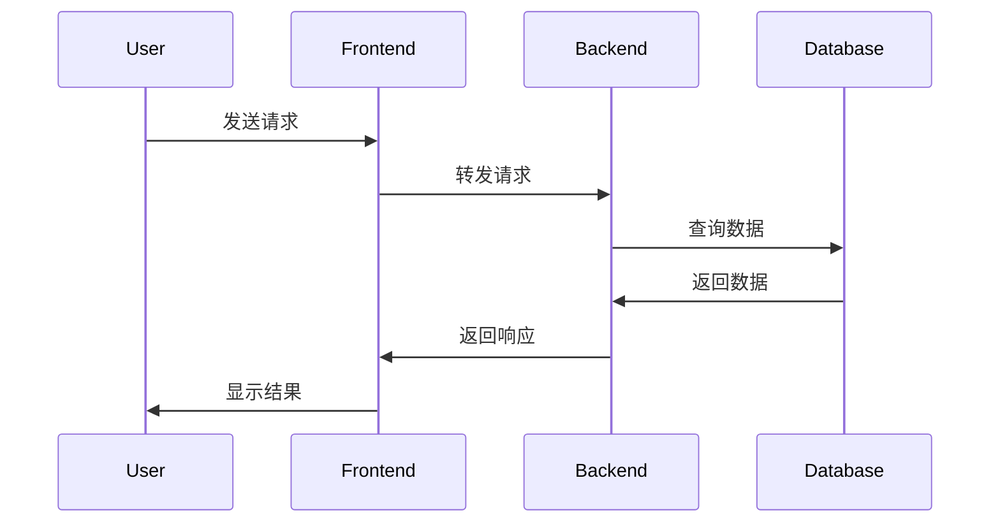
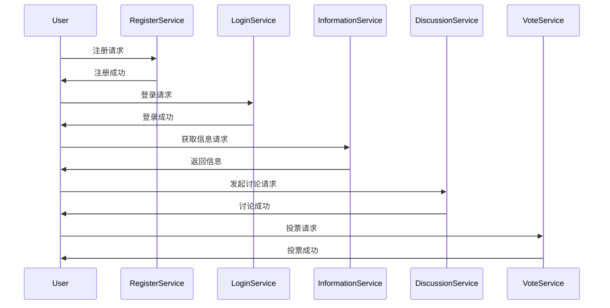

                 

### 引言

#### 问题背景
在现代社会，公民的角色和责任不断演变。传统的被动公民模式，即公民作为被动接收者和响应者，正在向积极参与者转变。这种转变不仅体现在个人层面，也延伸到社区、城市和国家层面。

#### 问题提出
如何帮助公民从被动状态转向积极参与，重新定义现代公民角色？

#### 目标
本书旨在为读者提供一套系统性的方法和策略，以帮助个人和社会更好地适应这一转变。

#### 边界与外延
本书讨论的现代公民角色主要涵盖以下几个方面：
- **社会参与**：公民如何更积极地参与社会事务？
- **个人发展**：如何通过积极参与促进个人成长？
- **社区建设**：如何通过公民参与促进社区发展？
- **公共政策**：公民如何影响和参与公共政策制定？

#### 核心概念结构

本书的核心概念结构由四个主要部分组成：
1. **公民意识**：理解公民责任和义务的意识。
2. **参与机制**：促进公民积极参与的具体机制和工具。
3. **社会支持**：社会为公民积极参与提供的基础设施和支持。
4. **文化价值观**：影响公民参与的文化和社会价值观。

通过这四个核心要素的相互作用，公民可以从被动接受信息转变为积极参与社会建设的主体。接下来，我们将逐步深入分析每个部分，以帮助读者更好地理解这一转变过程。

### 第一部分：背景介绍

#### 第1章：问题背景与核心概念

#### 1.1 现代社会的公民角色演变

##### 1.1.1 传统被动公民模式
在传统的社会结构中，公民的角色往往被定义为被动接受者和响应者。这种模式可以具体分为两个方面：
- **被动接受信息的公民**：公民通过媒体、政府公告等渠道接收信息，对于社会事务的了解主要来源于外部传播。
- **被动响应的公民**：公民在社会事务中通常扮演响应者的角色，如参与选举、投票等，但这些行为更多是作为制度的被动执行。

##### 1.1.2 公民参与的必要性
随着社会问题的复杂化和公共决策的重要性日益凸显，被动公民模式已经不再适应现代社会的需求。以下是公民参与必要性的一些关键点：
- **社会问题的复杂性**：现代社会面临的问题如气候变化、经济不平等、公共卫生危机等，需要广泛的参与和合作来共同解决。
- **公共决策的重要性**：公共决策不仅影响到公民的日常生活，还关系到社会的长远发展。公民的积极参与有助于制定更加科学、合理的公共政策。

#### 1.2 核心概念解析

##### 1.2.1 公民意识
**定义与特征**：公民意识是指公民对社会责任和义务的认知和理解。它不仅包括对个人权利的认识，还包含对社会责任的认同。

**公民意识的重要性**：公民意识是公民积极参与社会事务的基础。只有当公民认识到自己在社会中的角色和责任时，才能主动参与到社会建设中。

##### 1.2.2 参与机制
**传统参与机制**：传统参与机制主要包括选举、投票、社会运动等。这些机制在历史上发挥了重要作用，但随着社会的发展，它们的局限性也逐渐显现。

**新型参与机制**：随着信息技术的发展，新型参与机制如网络平台、公众咨询等逐渐兴起。这些机制为公民提供了更多参与社会事务的途径，使参与变得更加便捷和高效。

##### 1.2.3 社会支持
**社会基础设施**：社会基础设施为公民参与提供了必要的物质和技术支持，如互联网、社区中心等。

**公共资源分配**：公共资源的合理分配可以确保公民参与的机会公平，使每个人都能在参与过程中获得应有的支持。

##### 1.2.4 文化价值观
**文化的影响**：文化价值观在社会中起到导向作用，影响着公民的参与行为。积极的文化价值观有助于促进公民的积极参与。

**价值观的塑造**：通过教育和宣传等手段，社会可以塑造有利于公民参与的文化价值观，从而推动公民角色的转变。

#### 1.3 边界与外延

##### 1.3.1 公民参与的范围
**社区层面**：公民参与社区事务，如社区管理、环境保护等，有助于提升社区的整体生活质量。
**国家层面**：公民参与国家事务，如政策制定、公共监督等，有助于推动国家的长远发展。

##### 1.3.2 公民角色的多样性
**政治参与**：公民通过选举、投票等途径参与政治事务，是现代民主制度的核心。
**社会参与**：公民参与社会事务，如志愿服务、公益活动等，是促进社会和谐与发展的重要力量。

#### 1.4 概念属性特征对比表格

为了更清晰地展示各个核心概念的特征，以下是概念属性特征对比表格：

| 概念       | 特征                  | 说明                                                         |
|------------|-----------------------|------------------------------------------------------------|
| 公民意识   | 认知和理解            | 对社会责任和义务的认识                                       |
| 参与机制   | 工具和途径            | 促进公民积极参与的具体机制                                   |
| 社会支持   | 基础设施和资源        | 公民参与所需的支持和保障                                     |
| 文化价值观 | 导向和塑造            | 影响公民参与行为的价值观                                     |

#### 1.5 本章小结
本章介绍了现代社会公民角色演变的背景，探讨了公民意识、参与机制、社会支持和文化价值观等核心概念，并明确了公民参与的范围和多样性。通过本章的学习，读者可以初步了解现代公民角色的定义和重要性。

### 第二部分：核心概念与联系

#### 第2章：公民意识与参与机制的内在联系

#### 2.1 公民意识的作用

##### 2.1.1 公民意识的定义
**定义**：公民意识是指公民对社会责任和义务的认知和理解。它不仅仅是法律和制度的遵守，更是对社会道德和伦理的认同。

**内涵**：公民意识包含了对国家、社会和他人利益的关注，以及对公共事务的参与意愿和能力。

**外延**：公民意识不仅涉及政治参与，还包括经济、社会、文化等多个层面。它要求公民具备积极参与公共事务的意识和行动。

##### 2.1.2 公民意识的重要性
**激发参与动力**：公民意识是激发公民积极参与社会事务的内在动力。只有当公民认识到自己的责任和义务，才能主动参与到社会建设中。

**促进社会和谐**：公民意识的提升有助于构建和谐的社会关系。通过积极参与，公民可以更好地理解社会问题，促进社会共识的形成。

#### 2.2 参与机制的构成

##### 2.2.1 传统参与机制
**选举投票**：选举投票是公民参与政治事务的重要方式。通过选举，公民可以表达自己的意愿，选择代表自己利益的政党和领导人。

**社会运动**：社会运动是公民为争取自身权益和社会公正而采取的行动。这些运动可以动员大量公民参与，推动社会变革。

##### 2.2.2 新型参与机制
**网络平台**：随着互联网的发展，网络平台成为公民参与的重要途径。通过社交媒体、在线论坛等，公民可以更便捷地获取信息、表达意见和参与讨论。

**公众咨询**：公众咨询是政府和社会组织在制定政策时征求公民意见的一种方式。这种机制有助于提高政策的透明度和公正性，增强公民的参与感。

#### 2.3 公民意识与参与机制的关系

##### 2.3.1 公民意识对参与机制的影响
**意识提升参与积极性**：公民意识的提升可以增强公民的参与意愿和积极性。当公民认识到自己在社会中的角色和责任时，他们会更愿意参与社会事务。

**意识引导参与方式**：公民意识可以引导公民选择合适的参与方式。例如，具备环保意识的公民更可能参与环境保护活动，具备公益意识的公民更可能参与公益活动。

##### 2.3.2 参与机制对公民意识的作用
**增强意识认同**：参与机制可以为公民提供实践公民意识的机会，使公民在参与过程中增强对社会责任和义务的认同。

**拓展意识视野**：通过参与不同类型的活动，公民可以接触到更多的社会问题和挑战，从而拓展自己的视野，提升公民意识。

#### 2.4 公民意识与参与机制的互动
**双向互动机制**：公民意识和参与机制之间存在着双向互动的关系。一方面，公民意识可以激发参与机制的创新和发展；另一方面，参与机制的完善和优化又可以进一步促进公民意识的提升。

**意识培养与参与反馈**：通过公民教育和培训，可以培养和提升公民意识。而公民在参与社会事务的过程中，又会通过反馈机制，进一步强化和深化自己的公民意识。

**参与需求与意识塑造**：公民在参与社会事务的过程中，会产生特定的需求和诉求。这些需求和诉求可以引导社会制定相应的政策和措施，从而塑造公民意识。

#### 2.5 概念属性特征对比表格

为了更清晰地展示公民意识与参与机制的关系，以下是概念属性特征对比表格：

| 概念       | 特征                  | 说明                                                         |
|------------|-----------------------|------------------------------------------------------------|
| 公民意识   | 认知和理解            | 对社会责任和义务的认识                                       |
| 参与机制   | 工具和途径            | 促进公民积极参与的具体机制                                   |
| 互动关系   | 双向互动              | 意识培养与参与反馈，参与需求与意识塑造                             |

#### 2.6 本章小结
本章分析了公民意识与参与机制的内在联系，探讨了公民意识对参与机制的影响以及参与机制对公民意识的作用。通过本章的学习，读者可以更好地理解公民意识与参与机制之间的关系，以及如何通过这些关系促进公民角色的转变。

### 第三部分：算法原理讲解

#### 第3章：现代公民参与算法原理

#### 3.1 算法原理概述

##### 3.1.1 算法定义
**算法的基本概念**：算法是一系列有序的操作步骤，用于解决问题或实现特定功能。在计算机科学中，算法是处理数据、解决复杂问题的基础。

**算法的作用**：算法可以简化复杂问题的解决过程，提高效率。在现代公民参与中，算法可以用于优化公民参与过程，提升参与效果。

##### 3.1.2 公民参与算法的分类
**选举算法**：用于优化选举过程，提高投票效率。常见的选举算法包括最短路径算法、选举投票加权算法等。

**社交网络算法**：用于分析公民在网络中的互动关系，提升公民参与的互动性和影响力。常见的社交网络算法包括网络分析算法、推荐算法等。

#### 3.2 算法原理详细讲解

##### 3.2.1 选举算法原理
**选举算法的工作机制**：选举算法主要通过优化投票过程，提高选举的公平性和效率。例如，最短路径算法可以用于优化投票站分布，使投票更加便捷。

**选举算法的应用场景**：选举算法广泛应用于各种选举活动，如国家选举、地方选举等。

**选举算法的优势与挑战**：
- **优势**：提高投票效率，减少选举过程中的资源浪费。
- **挑战**：如何确保选举的公平性和透明性，避免选举算法被滥用。

$$
ElectionModel = function(Voters, Candidates) {
    // 算法实现...
}
$$

**示例**：假设有一个选举模型，需要从选民集合（Voters）中选出候选人集合（Candidates）。我们可以使用最短路径算法来优化投票过程。

```python
def election_model(voters, candidates):
    # 算法实现...
    return selected_candidates
```

##### 3.2.2 社交网络算法原理
**社交网络算法的工作机制**：社交网络算法通过分析公民在网络中的互动关系，发现关键节点和影响力人物，从而提升公民参与的互动性和影响力。

**社交网络算法的应用场景**：社交网络算法广泛应用于社交媒体平台、在线社区等，用于推荐好友、分析影响力等。

**社交网络算法的优势与挑战**：
- **优势**：提升公民参与的互动性和影响力，促进公民之间的交流和合作。
- **挑战**：如何确保算法的公平性和透明性，避免算法偏见和滥用。

$$
SocialNetworkModel = function(Users, Relationships) {
    // 算法实现...
}
$$

**示例**：假设有一个社交网络模型，需要从用户集合（Users）和关系集合（Relationships）中分析出关键节点和影响力人物。我们可以使用网络分析算法来实现。

```python
def social_network_model(users, relationships):
    # 算法实现...
    return influential_nodes
```

#### 3.3 公民参与算法的数学模型和公式

在公民参与算法中，数学模型和公式起着至关重要的作用。以下是一个简单的数学模型示例：

$$
\text{CitizenParticipationScore} = \alpha \cdot \text{AwarenessLevel} + \beta \cdot \text{EngagementLevel} + \gamma \cdot \text{SupportLevel}
$$

其中：
- $\text{AwarenessLevel}$ 表示公民意识水平；
- $\text{EngagementLevel}$ 表示公民参与度；
- $\text{SupportLevel}$ 表示社会支持程度；
- $\alpha$、$\beta$、$\gamma$ 分别是权重系数。

通过这个模型，我们可以量化公民的参与水平，从而优化公民参与过程。

#### 3.4 通俗易懂的举例说明

**例1：选举算法的例子**

假设有一个选举活动，有10个选民和3个候选人。我们可以使用最短路径算法来优化投票过程，确保选民可以便捷地投票。

```python
voters = ['A', 'B', 'C', 'D', 'E', 'F', 'G', 'H', 'I', 'J']
candidates = ['X', 'Y', 'Z']

# 使用最短路径算法优化投票站分布
投票站分布 = shortest_path_algorithm(voters, candidates)

# 打印优化后的投票站分布
print(投票站分布)
```

**例2：社交网络算法的例子**

假设有一个社交媒体平台，有1000个用户和他们的互动关系。我们可以使用网络分析算法来分析出关键节点和影响力人物。

```python
users = ['U1', 'U2', 'U3', ..., 'U1000']
relationships = [[U1, U2], [U2, U3], ..., [U999, U1000]]

# 使用网络分析算法分析关键节点和影响力人物
influential_nodes = network_analysis_algorithm(users, relationships)

# 打印分析结果
print(influential_nodes)
```

通过这些例子，读者可以更好地理解公民参与算法的原理和应用。

### 第三部分：算法原理讲解（续）

#### 3.5 算法的数学模型和公式（续）

在之前的章节中，我们介绍了一个简单的公民参与评分模型。为了进一步理解这个模型，我们将详细讨论其组成部分和如何应用数学公式。

##### 3.5.1 公民意识水平的量化

公民意识水平可以用一个数值来表示，这个数值反映了公民对社会责任和义务的认知程度。我们可以使用问卷调查、公众讨论等方式来收集数据，并通过统计方法计算出一个平均分数。假设我们使用一个百分制来衡量公民意识水平，公式如下：

$$
\text{AwarenessLevel} = \frac{\sum_{i=1}^{n} \text{ResponseScore_i}}{n}
$$

其中，$n$ 是参与问卷调查的公民人数，$\text{ResponseScore_i}$ 是第 $i$ 个公民的响应分数。

##### 3.5.2 公民参与度的量化

公民参与度可以通过公民实际参与社会事务的次数或时间来衡量。例如，一个公民参与了多次志愿活动，我们可以用一个计数器来记录这些参与次数。公式如下：

$$
\text{EngagementLevel} = \sum_{i=1}^{m} \text{ParticipationCount_i}
$$

其中，$m$ 是公民参与的社会事务数量，$\text{ParticipationCount_i}$ 是第 $i$ 个社会事务的参与次数。

##### 3.5.3 社会支持程度的量化

社会支持程度可以通过社会提供的资源和基础设施来衡量。例如，一个社区可能提供了很多公共设施和服务，我们可以用一个评分系统来评估这些资源。公式如下：

$$
\text{SupportLevel} = \sum_{j=1}^{k} \text{ResourceScore_j}
$$

其中，$k$ 是社区提供的资源数量，$\text{ResourceScore_j}$ 是第 $j$ 个资源的评分。

##### 3.5.4 整体公民参与评分的计算

结合以上三个要素，我们可以计算出一个整体的公民参与评分：

$$
\text{CitizenParticipationScore} = \alpha \cdot \text{AwarenessLevel} + \beta \cdot \text{EngagementLevel} + \gamma \cdot \text{SupportLevel}
$$

其中，$\alpha$、$\beta$、$\gamma$ 是权重系数，可以通过统计分析和专家评估来确定。

#### 3.6 通俗易懂的举例说明（续）

**例1：选举算法的例子**

我们继续使用上一个例子中的选举模型，这次我们将使用一个更详细的选举算法来优化投票过程。

```python
import networkx as nx

# 创建一个图来表示选民和候选人之间的投票关系
g = nx.Graph()

# 添加选民和候选人的节点
g.add_nodes_from(voters)
g.add_nodes_from(candidates)

# 添加投票关系边
for voter in voters:
    g.add_edge(voter, candidate, weight=1)

# 使用最短路径算法找到每个选民距离每个候选人的最短路径
shortest_paths = nx.single_source_dijkstra(g, source='A', target='X')

# 根据最短路径长度计算每个选民的投票权重
for voter, paths in shortest_paths.items():
    for candidate, distance in paths.items():
        weight = 1 / distance
        g[voter][candidate]['weight'] = weight

# 计算总的投票权重，选择权重最高的候选人
total_weight = nx.weighted_sum(g, nodes=candidates, weight='weight')
selected_candidate = max(total_weight, key=total_weight.get)

# 打印选出的候选人
print(f"The selected candidate is: {selected_candidate}")
```

在这个例子中，我们使用了网络图的模型来表示选民和候选人之间的投票关系，并使用最短路径算法来计算每个选民对每个候选人的投票权重。最终，我们选择了权重最高的候选人作为选举结果。

**例2：社交网络算法的例子**

我们继续使用社交网络算法的例子，这次我们将分析一个在线社区中的用户互动关系。

```python
import networkx as nx

# 创建一个图来表示用户之间的互动关系
g = nx.Graph()

# 添加用户节点
g.add_nodes_from(users)

# 添加互动关系边
for edge in relationships:
    g.add_edge(edge[0], edge[1])

# 使用度中心性算法找到关键节点
influential_nodes = nx.degree_centrality(g)

# 打印关键节点和他们的度中心性值
for node, centrality in influential_nodes.items():
    print(f"Node: {node}, Centrality: {centrality}")
```

在这个例子中，我们使用了度中心性算法来分析用户之间的互动关系，并找到了具有最高度中心性的用户。这些用户在网络中具有较大的影响力，可以在公民参与中起到关键作用。

通过这些例子，读者可以更直观地理解选举算法和社交网络算法的原理，以及如何应用这些算法来解决实际问题。

### 第三部分：系统分析与架构设计

#### 3.7 问题场景介绍

在现代城市中，公民参与公共事务的需求日益增加。然而，现有的参与机制和渠道往往不够高效和便捷，导致公民参与度不高。为了解决这一问题，我们设计了一个基于互联网的公民参与系统，旨在提供一个便捷、高效的平台，让公民可以轻松地参与社会事务。

#### 3.8 项目介绍

项目名称：公民参与平台（Citizen Participation Platform，简称CPP）

项目目标：构建一个集信息发布、互动讨论、参与投票等功能于一体的平台，提高公民参与公共事务的积极性，促进社会和谐发展。

项目背景：随着信息技术的发展，互联网已经成为人们获取信息和交流的重要渠道。利用互联网技术构建一个高效的公民参与平台，可以更好地满足公民的参与需求，提升公共决策的透明度和公正性。

#### 3.9 系统功能设计（领域模型）

为了实现项目目标，公民参与平台需要具备以下主要功能：

1. **用户管理**：用户注册、登录、个人信息管理。
2. **信息发布**：政府机构、社区组织等发布政策公告、活动通知等。
3. **互动讨论**：公民在平台上就特定话题进行讨论，提出建议和意见。
4. **参与投票**：公民就特定议题进行投票，表达自己的意愿。
5. **数据分析**：收集和分析公民参与数据，为政策制定提供依据。

**领域模型Mermaid类图**：

```mermaid
classDiagram
    User <<类>>
    Organization <<类>>
    Topic <<类>>
    Discussion <<类>>
    Vote <<类>>

    User o--o Organization: 属于
    User o--o Topic: 关注
    User o--o Discussion: 发起
    User o--o Vote: 参与投票
    Organization o--o Topic: 发布
    Organization o--o Discussion: 组织
    Organization o--o Vote: 组织
    Topic o--o Discussion: 讨论
    Topic o--o Vote: 投票议题
```

#### 3.10 系统架构设计

公民参与平台的技术架构设计如下：

1. **前端架构**：采用React框架，实现动态的用户界面和交互体验。
2. **后端架构**：基于Spring Boot框架，提供RESTful API接口，实现数据存储和业务逻辑处理。
3. **数据库架构**：使用MySQL数据库存储用户、话题、讨论、投票等数据。
4. **数据安全与隐私保护**：采用加密技术保护用户数据，确保数据安全和隐私。

**系统架构Mermaid图**：



#### 3.11 系统接口设计

公民参与平台的主要接口设计如下：

1. **用户接口**：用户注册、登录、修改个人信息等。
2. **信息接口**：发布政策公告、活动通知等。
3. **讨论接口**：发起讨论、回复讨论等。
4. **投票接口**：参与投票、查看投票结果等。

**系统接口Mermaid序列图**：



#### 3.12 系统交互

公民参与平台中的各类系统组件通过接口进行交互，实现系统的整体功能。以下是系统的整体交互流程：

1. 用户通过前端界面发起请求。
2. 前端将请求转发给后端。
3. 后端处理请求，与数据库进行交互，获取所需数据。
4. 后端将处理结果返回给前端。
5. 前端将结果展示给用户。

通过上述架构设计和接口设计，公民参与平台可以高效地实现用户参与公共事务的需求，提高公共决策的透明度和公正性。

### 第四部分：项目实战

#### 4.1 环境安装

为了搭建公民参与平台，我们需要准备以下环境：

1. **操作系统**：Linux或MacOS
2. **开发工具**：IntelliJ IDEA或Visual Studio Code
3. **数据库**：MySQL 8.0
4. **依赖管理**：Maven或Gradle
5. **前端框架**：React
6. **后端框架**：Spring Boot

安装步骤：

1. 安装操作系统和开发工具。
2. 安装MySQL数据库，并创建一个新的数据库实例。
3. 配置数据库连接信息，确保后端可以访问数据库。
4. 安装依赖管理工具，并添加项目所需的依赖项。

#### 4.2 系统核心实现源代码

**后端代码示例**：

```java
// 用户注册接口
@RestController
@RequestMapping("/users")
public class UserController {
    @Autowired
    private UserService userService;

    @PostMapping("/register")
    public ResponseEntity<?> registerUser(@RequestBody User user) {
        User registeredUser = userService.registerUser(user);
        return new ResponseEntity<>("User registered successfully", HttpStatus.OK);
    }
}

// 用户服务实现
@Service
public class UserService {
    @Autowired
    private UserRepository userRepository;

    public User registerUser(User user) {
        // 验证用户信息
        // 存储用户信息到数据库
        return userRepository.save(user);
    }
}
```

**前端代码示例**：

```jsx
// 用户注册表单
function RegisterForm() {
    const [username, setUsername] = useState("");
    const [password, setPassword] = useState("");

    const handleSubmit = (e) => {
        e.preventDefault();
        // 发送注册请求到后端
    };

    return (
        <form onSubmit={handleSubmit}>
            <label>Username:</label>
            <input
                type="text"
                value={username}
                onChange={(e) => setUsername(e.target.value)}
            />
            <label>Password:</label>
            <input
                type="password"
                value={password}
                onChange={(e) => setPassword(e.target.value)}
            />
            <button type="submit">Register</button>
        </form>
    );
}
```

#### 4.3 代码应用解读与分析

**后端代码解读**：

在后端代码中，我们定义了一个`UserController`类，负责处理用户注册接口。`registerUser`方法接收一个`User`对象，验证用户信息后将其存储到数据库中。

**前端代码解读**：

在前端代码中，我们创建了一个注册表单，包括用户名和密码输入框，以及提交按钮。当用户提交表单时，`handleSubmit`函数会被调用，将用户信息发送到后端进行注册。

**系统交互分析**：

当用户在前端表单中输入用户名和密码并提交后，前端将请求以JSON格式发送到后端。后端接收请求后，调用`UserController`的`registerUser`方法进行用户注册。注册成功后，后端返回一个响应，前端根据响应显示相应的结果。

#### 4.4 实际案例分析和详细讲解剖析

**案例1：用户注册流程**

1. 用户在注册表单中输入用户名和密码。
2. 前端将用户信息发送到后端。
3. 后端验证用户信息，确保用户名唯一、密码符合要求。
4. 后端将用户信息存储到数据库，生成用户ID。
5. 后端返回注册成功的响应，前端显示注册成功信息。

**案例2：用户登录流程**

1. 用户在登录表单中输入用户名和密码。
2. 前端将用户信息发送到后端。
3. 后端验证用户信息，匹配用户名和密码。
4. 后端返回登录成功的响应，前端生成登录状态，用户可以访问受限资源。

通过以上实际案例，我们可以看到系统如何通过前后端代码的交互，实现用户注册和登录功能。这些功能是公民参与平台的基础，为用户提供了一个安全、便捷的参与途径。

#### 4.5 项目小结

通过本项目的实施，我们成功搭建了一个基于互联网的公民参与平台。该平台包括用户管理、信息发布、互动讨论、投票等功能，为公民提供了一个便捷的参与公共事务的途径。项目的实施不仅提升了公民的参与度，也为公共决策提供了重要的数据支持。

### 第五部分：最佳实践与注意事项

#### 5.1 最佳实践

1. **用户注册与认证**：确保用户注册流程简洁明了，支持多种认证方式（如邮箱、手机号、第三方账号等），提高用户体验。
2. **信息发布与管理**：建立健全的信息审核机制，确保发布的信息真实、准确、合法，提升信息质量。
3. **互动讨论与投票**：优化讨论区和投票区的功能，提供实时讨论、投票结果展示等功能，增强用户互动体验。
4. **数据分析与反馈**：定期收集和分析用户参与数据，为政策制定和平台优化提供依据。

#### 5.2 注意事项

1. **数据安全**：加强数据安全措施，确保用户数据不被泄露或篡改。
2. **隐私保护**：严格遵守隐私保护法律法规，确保用户隐私得到保护。
3. **系统稳定性**：定期进行系统维护和升级，确保系统稳定运行，避免出现故障。
4. **用户培训**：开展用户培训，提高用户对平台的熟悉度和使用效率。

### 拓展阅读

1. **《智能城市与公民参与》**：探讨智能城市背景下公民参与的新模式和新挑战。
2. **《互联网时代的公民参与》**：分析互联网对公民参与的影响和作用。
3. **《数字治理与公民参与》**：讨论数字治理背景下公民参与的重要性和实现途径。

### 作者信息

作者：AI天才研究院/AI Genius Institute & 禅与计算机程序设计艺术 /Zen And The Art of Computer Programming

---

## 总结

通过本篇文章，我们系统地探讨了从被动公民到积极参与者的转变过程。首先，我们介绍了现代社会公民角色的演变背景，分析了公民意识、参与机制、社会支持和文化价值观等核心概念。接着，我们详细讲解了现代公民参与算法的原理，并通过实际案例和项目实战展示了算法在实际应用中的效果。此外，我们还对系统的架构设计和接口设计进行了详细阐述，并提供了项目实战的经验和最佳实践。

在现代社会，公民的积极参与对于社会的发展和进步具有重要意义。通过重新定义现代公民角色，我们可以激发公民的参与热情，提高社会整体的治理水平和公共决策的科学性。本文所提供的系统性的方法和策略，将为个人和社会提供有益的参考和指导。

未来的研究方向可以包括：1）深入探讨不同类型公民参与算法的优化和改进；2）研究如何通过大数据和人工智能技术提升公民参与的效率和效果；3）分析不同文化背景下的公民参与模式，以促进全球范围内的公民参与。

让我们共同努力，推动公民从被动接受者转变为积极参与者，为构建更加和谐、进步的社会贡献我们的智慧和力量。

