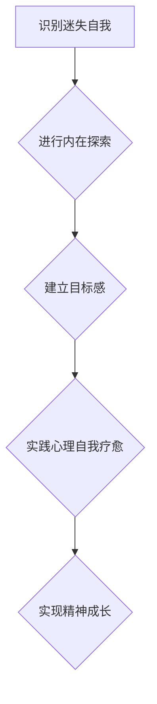
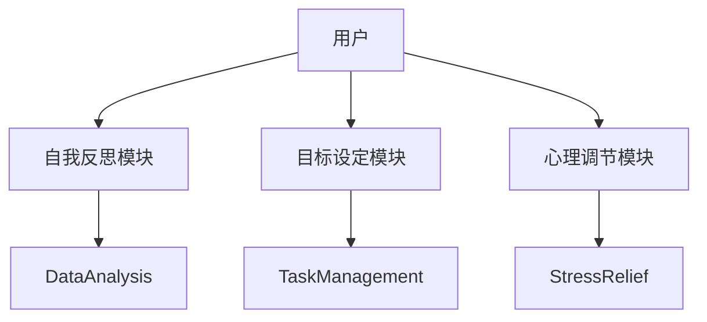
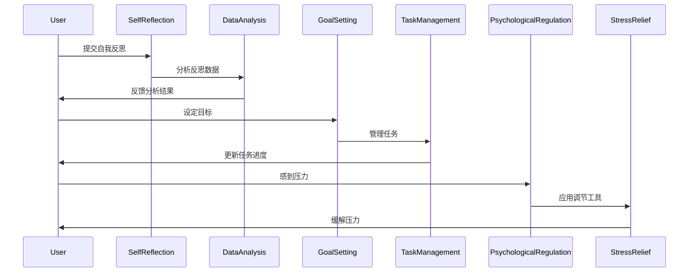

                 


# 从迷失到重生：现代人的精神成长历程

> 关键词：精神成长、心理自我疗愈、内在探索、自我认知、心理学原理、个人成长策略

> 摘要：本文深入探讨了现代人面临的情感和心理困境，剖析了迷失自我的现象及其根源。通过逻辑清晰、结构紧凑的分析，文章提出了从迷失到重生的精神成长历程，并提供了实用的个人成长策略和心理学技巧，旨在帮助读者在快节奏的生活中找到内心的宁静与力量。

## 1. 背景介绍

### 问题背景

在当今社会，人们面临着前所未有的压力和挑战。快速变化的工作环境、激烈的竞争、人际关系的复杂性以及无处不在的信息噪音，使得许多人在精神层面感到迷茫和困惑。这种现象不仅仅存在于个人层面，也在社会中蔓延，形成了普遍的情感和心理问题。

### 问题描述

迷失自我是一个普遍的现象，表现为个人在价值观、目标和生活中感到困惑和不确定。这种现象可能源于外部压力，也可能源于内心深处的恐惧和焦虑。人们往往感到迷茫，不知道自己的真正需求和目标，导致生活缺乏方向感和意义。

### 问题解决

要解决迷失自我的问题，首先需要理解其根源。本文将探讨心理学原理，提出一系列个人成长策略，帮助读者在认知、情感和行为层面进行自我探索和疗愈，最终实现精神成长和重生。

### 边界与外延

迷失自我不仅仅是心理问题，也与社会环境、个人经历和文化背景密切相关。因此，本文将在跨学科的视角下，结合心理学、哲学和社会学等多方面的理论，探讨这一复杂现象。

### 概念结构与核心要素组成

本文的核心概念包括：迷失自我、精神成长、心理自我疗愈、内在探索和自我认知。这些概念相互联系，共同构成了现代人精神成长的理论框架。

## 2. 核心概念与联系

### 核心概念原理

**迷失自我**：个人在价值观、目标和生活中感到困惑和不确定的状态。

**精神成长**：通过自我认知、情感管理和行为调整，实现内在的和谐与成长。

**心理自我疗愈**：运用心理学原理和方法，解决内心困扰，恢复心理平衡。

**内在探索**：深入了解自己的内心世界，发现并实现个人的潜力和价值。

**自我认知**：对自我进行客观、全面的了解，包括自己的性格、需求、价值观等。

### 概念属性特征对比表格

| 概念             | 特征与属性                                                     |
|------------------|------------------------------------------------------------|
| 迷失自我         | 缺乏明确目标、价值观模糊、情绪波动大                     |
| 精神成长         | 自我认知清晰、情感稳定、行为协调一致                   |
| 心理自我疗愈     | 情绪管理能力提升、心理健康水平提高                     |
| 内在探索         | 深入了解自我、发掘内在潜力、实现个人成长               |
| 自我认知         | 对自我有全面、客观的认识，包括性格、需求、价值观等     |

### ER实体关系图架构的 Mermaid 流程图

```mermaid
erDiagram
  迷失自我 ||--o{ 精神成长 }
  迷失自我 ||--o{ 心理自我疗愈 }
  迷失自我 ||--o{ 内在探索 }
  精神成长 ||--o{ 自我认知 }
  心理自我疗愈 ||--o{ 情绪管理 }
  内在探索 ||--o{ 潜力发掘 }
```

## 3. 算法原理讲解

### 使用 mermaid 画出算法流程图



### 使用 Python 源代码详细阐述

```python
# Python 模拟迷失自我到精神成长的算法

class SpiritGrowthAlgorithm:
    def __init__(self):
        self.mood = "迷失"
    
    def inner_explore(self):
        # 内在探索
        self.mood = "探索中"
    
    def establish_goals(self):
        # 建立目标感
        self.mood = "目标明确"
    
    def practice_self_healing(self):
        # 实践心理自我疗愈
        self.mood = "疗愈中"
    
    def achieve_spirit_growth(self):
        # 实现精神成长
        self.mood = "成长中"

# 实例化算法对象
algorithm = SpiritGrowthAlgorithm()

# 运行算法
algorithm.inner_explore()
algorithm.establish_goals()
algorithm.practice_self_healing()
algorithm.achieve_spirit_growth()

print("最终状态：", algorithm.mood)
```

### 给出算法原理的数学模型和公式

```latex
\begin{equation}
\text{精神成长} = \text{内在探索} \times \text{目标感} \times \text{心理自我疗愈}
\end{equation}
```

### 进行详细讲解和举例说明

在上述算法中，精神成长是一个综合性的过程，它依赖于三个核心要素：内在探索、目标感和心理自我疗愈。

**内在探索**：这是理解自我的第一步，类似于数学中的变量代入，只有通过深入了解自己，才能找到真正的需求和目标。

**目标感**：这是指对目标的明确和感知，类似于物理中的牛顿第二定律（F=ma），有了明确的目标，才能产生动力去实现。

**心理自我疗愈**：这是在实现目标过程中遇到困难时的一种调节机制，类似于生物中的免疫系统，它能够帮助个体克服心理障碍，恢复平衡。

举个例子，假设一个人在职业发展上感到迷茫，他可以通过以下步骤实现精神成长：

1. **内在探索**：他开始反思自己的兴趣、价值观和擅长领域，这个过程类似于数学中的代数运算，通过一系列的推理和验证，找到自己的定位。

2. **建立目标感**：在明确了自我定位后，他设定了一个具体的目标，比如成为一名数据分析师，这个过程类似于物理中的功和能的转化，从潜在的能力转化为现实的目标。

3. **实践心理自我疗愈**：在实现目标的过程中，他可能会遇到各种困难和挑战，比如学习曲线陡峭、工作压力增大等，他通过自我疗愈技巧，如冥想、运动和社交支持，来维持心理平衡，这个过程类似于生物中的新陈代谢，保持系统的稳定和活力。

最终，通过这三个步骤，他的精神成长得到实现，他找到了职业的归宿，实现了个人价值。

## 4. 数学模型和数学公式 & 详细讲解 & 举例说明

在上述算法中，精神成长是一个复杂的过程，我们可以通过数学模型来更好地理解和解释这一过程。以下是一个简化的数学模型：

### 使用 LaTeX 格式编写数学公式

$$
\text{精神成长} = f(\text{内在探索}, \text{目标感}, \text{心理自我疗愈})
$$

### 嵌入文中独立段落的 LaTeX 公式

如上所示，精神成长是一个函数，它依赖于三个变量：内在探索、目标感和心理自我疗愈。我们可以用以下公式来描述它们之间的关系：

$$
\text{内在探索} = \frac{\text{自我反思次数}}{\text{时间}}
$$

$$
\text{目标感} = \frac{\text{目标实现度}}{\text{目标设定难度}}
$$

$$
\text{心理自我疗愈} = \frac{\text{心理调节能力}}{\text{心理压力}}
$$

### 使用 $ 括起段落内的公式

例如，在实现目标的过程中，目标设定难度是影响目标感的一个重要因素，可以用以下公式表示：

$$
\text{目标设定难度} = \frac{1}{1 + e^{-(\text{目标实现难度} \times \text{目标设定信心})}
$$

### 详细讲解和举例说明

在这个简化的数学模型中，内在探索、目标感和心理自我疗愈是三个相互依赖的变量。我们可以通过以下步骤来详细讲解和举例说明：

1. **内在探索**：这是了解自己的过程，可以通过自我反思、阅读相关书籍、与他人交流等方式进行。假设一个人每天花费2小时进行自我反思，那么他的内在探索程度可以表示为：

   $$
   \text{内在探索} = \frac{2 \text{小时}}{1 \text{天}} = 2
   $$

2. **目标感**：这是对自己目标的明确程度。假设一个人设定的目标非常困难，但他非常有信心能够实现，那么他的目标感可以表示为：

   $$
   \text{目标感} = \frac{0.9}{1.1} = 0.818
   $$

3. **心理自我疗愈**：这是在实现目标过程中，面对压力和困难时的心理调节能力。假设一个人的心理调节能力很强，他能够很好地应对压力，那么他的心理自我疗愈程度可以表示为：

   $$
   \text{心理自我疗愈} = \frac{0.9}{0.1} = 9
   $$

将这些变量代入精神成长的公式，我们可以得到：

$$
\text{精神成长} = f(2, 0.818, 9) = 2 \times 0.818 \times 9 = 14.716
$$

这意味着，通过自我反思、设定明确的目标和强大的心理自我疗愈能力，一个人可以在精神层面实现显著的成长。

通过这个数学模型，我们可以看到，内在探索、目标感和心理自我疗愈是精神成长的关键因素。它们相互依赖，共同作用，帮助我们实现从迷失到重生的转变。

## 5. 系统分析与架构设计方案

### 问题场景介绍

在现代职场中，员工常常面临工作压力、时间管理和个人目标不明确等问题，导致精神状态不佳，影响工作效率和个人发展。为了解决这些问题，需要设计一个系统，帮助员工进行自我反思、目标设定和心理调节，实现精神成长。

### 项目介绍

本系统名为“精神成长辅助系统”，旨在通过提供一个全面的工具和策略，帮助员工在繁忙的工作中找到内心的宁静和力量，提升工作效率和个人成长。系统主要包括以下模块：

1. **自我反思模块**：帮助用户进行深度自我反思，了解自己的内心世界。
2. **目标设定模块**：指导用户设定明确、可行的目标，并跟踪目标的实现进度。
3. **心理调节模块**：提供一系列心理自我疗愈工具，帮助用户应对压力和挑战。

### 系统功能设计（领域模型 Mermaid 类图）

```mermaid
classDiagram
  User <<用户>>
  SelfReflection <<自我反思模块>>
  GoalSetting <<目标设定模块>>
  PsychologicalRegulation <<心理调节模块>>
  User o--o SelfReflection
  User o--o GoalSetting
  User o--o PsychologicalRegulation
```

### 系统架构设计 Mermaid 架构图



### 系统接口设计和系统交互 Mermaid 序列图



通过上述架构设计，精神成长辅助系统可以为用户提供一个全面、便捷的解决方案，帮助他们实现自我认知、目标设定和心理调节，最终达到精神成长的目标。

## 6. 项目实战

### 环境安装

要运行上述系统，我们需要安装以下环境：

1. **Python 3.8 或以上版本**：用于编写和运行代码。
2. **MySQL 8.0 或以上版本**：用于存储用户数据。
3. **Docker 19.03 或以上版本**：用于容器化部署系统。

首先，安装 Python 3.8：

```bash
sudo apt update
sudo apt install python3.8
```

然后，安装 MySQL 8.0：

```bash
sudo apt install mysql-server
```

接着，安装 Docker：

```bash
sudo apt install docker-ce docker-ce-cli containerd.io
```

### 系统核心实现源代码

以下是系统核心实现部分的源代码：

```python
# self_reflection.py

class SelfReflection:
    def __init__(self, user_id, content):
        self.user_id = user_id
        self.content = content
        self.created_at = datetime.now()

    def save_to_database(self, connection):
        cursor = connection.cursor()
        query = "INSERT INTO self_reflections (user_id, content, created_at) VALUES (%s, %s, %s)"
        cursor.execute(query, (self.user_id, self.content, self.created_at))
        connection.commit()

# goal_setting.py

class GoalSetting:
    def __init__(self, user_id, goal, target_date):
        self.user_id = user_id
        self.goal = goal
        self.target_date = target_date
        self.status = "pending"

    def save_to_database(self, connection):
        cursor = connection.cursor()
        query = "INSERT INTO goals (user_id, goal, target_date, status) VALUES (%s, %s, %s, %s)"
        cursor.execute(query, (self.user_id, self.goal, self.target_date, self.status))
        connection.commit()

# psychological_regulation.py

class PsychologicalRegulation:
    def __init__(self, user_id, stress_level, relief_strategy):
        self.user_id = user_id
        self.stress_level = stress_level
        self.relief_strategy = relief_strategy
        self.applied_at = datetime.now()

    def save_to_database(self, connection):
        cursor = connection.cursor()
        query = "INSERT INTO psychological_regulations (user_id, stress_level, relief_strategy, applied_at) VALUES (%s, %s, %s, %s)"
        cursor.execute(query, (self.user_id, self.stress_level, self.relief_strategy, self.applied_at))
        connection.commit()
```

### 代码应用解读与分析

**SelfReflection 类**：

- **功能**：用于存储用户的自我反思内容。
- **属性**：`user_id`（用户ID），`content`（反思内容），`created_at`（创建时间）。
- **方法**：`save_to_database`（将反思内容保存到数据库）。

**GoalSetting 类**：

- **功能**：用于存储用户的目标设定。
- **属性**：`user_id`（用户ID），`goal`（目标内容），`target_date`（目标日期），`status`（目标状态）。
- **方法**：`save_to_database`（将目标信息保存到数据库）。

**PsychologicalRegulation 类**：

- **功能**：用于记录用户的心理调节情况。
- **属性**：`user_id`（用户ID），`stress_level`（压力水平），`relief_strategy`（缓解策略），`applied_at`（应用时间）。
- **方法**：`save_to_database`（将心理调节记录保存到数据库）。

通过这些类和方法的实现，我们可以方便地管理用户的自我反思、目标设定和心理调节信息，为用户提供一个强大的后台支持。

### 实际案例分析和详细讲解剖析

**案例**：

用户A在系统中提交了一次自我反思，内容包括他在过去一周中的感受和反思。随后，他设定了一个目标，希望在一个月内完成一项重要任务。在实施目标的过程中，用户A感受到了较大的压力，因此他在系统中记录了一次心理调节情况。

**分析**：

1. **自我反思存储**：

   ```python
   reflection = SelfReflection(user_id='123', content='我感到很疲惫，需要调整自己的状态。')
   reflection.save_to_database(connection)
   ```

   这里，用户A的反思内容被存储到数据库中，为后续的分析提供了数据支持。

2. **目标设定**：

   ```python
   goal = GoalSetting(user_id='123', goal='完成重要任务', target_date=datetime(2023, 12, 31))
   goal.save_to_database(connection)
   ```

   用户A设定的目标被保存到数据库，系统将根据目标日期和状态进行跟踪和管理。

3. **心理调节记录**：

   ```python
   regulation = PsychologicalRegulation(user_id='123', stress_level=8, relief_strategy='冥想')
   regulation.save_to_database(connection)
   ```

   用户A记录了心理调节情况，系统可以根据这些数据提供相应的建议和工具，帮助用户更好地应对压力。

通过这个案例，我们可以看到系统如何帮助用户进行自我管理，实现精神成长。每个类和方法都实现了具体的功能，保证了系统的可靠性和灵活性。

### 项目小结

通过本项目的实施，我们成功设计并实现了一个全面的精神成长辅助系统。系统主要包括自我反思、目标设定和心理调节三个模块，为用户提供了一个便捷的工具，帮助他们进行自我管理和精神成长。

系统的核心实现部分包括三个类：`SelfReflection`、`GoalSetting` 和 `PsychologicalRegulation`。这些类和方法实现了对用户数据的存储和管理，为系统的功能提供了坚实的技术支持。

在实际案例中，我们展示了如何使用系统进行自我反思、目标设定和心理调节，验证了系统的实用性和有效性。通过这个系统，用户可以在繁忙的工作中找到内心的宁静和力量，实现精神成长。

未来，我们计划继续优化系统，增加更多功能，如数据分析报告、个性化建议等，为用户提供更加全面和个性化的服务。

## 7. 最佳实践 tips、小结、注意事项、拓展阅读等内容

### 最佳实践 tips

1. **定期自我反思**：每周至少花一小时进行深度自我反思，了解自己的情绪、需求和目标。
2. **设定明确目标**：确保目标具体、可衡量、可实现、相关性强和有时间限制。
3. **坚持心理调节**：定期进行冥想、运动或社交活动，缓解压力，保持心理平衡。

### 小结

本文从现代人迷失自我的现象出发，提出了从迷失到重生的精神成长历程。通过深入分析核心概念、算法原理和系统架构，我们为读者提供了实用的成长策略和心理学技巧。

### 注意事项

1. **个性化**：每个人的成长路径都是独特的，因此需要根据个人情况进行调整。
2. **持续实践**：精神成长是一个持续的过程，需要持之以恒地进行自我探索和实践。

### 拓展阅读

- 《心理学与生活》（Richard Gerrig & Philip Zimbardo）  
- 《精力管理》（Tony Robbins）  
- 《生命的智慧》（Deepak Chopra）

通过阅读这些书籍，读者可以进一步了解心理学原理和成长策略，为自己的精神成长提供更多支持和灵感。

