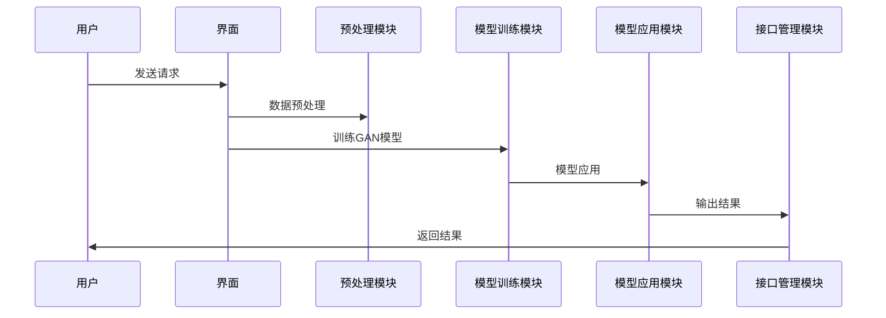

                 

### 引言与背景介绍

#### 1.1 问题背景

生成对抗网络（GAN）作为一种深度学习技术，近年来在学术界和工业界都引起了极大的关注。GAN的兴起可以追溯到2014年，当Ian Goodfellow等人首次提出了这一概念。GAN的核心思想是通过两个神经网络的博弈来生成高度真实的数据，从而在图像生成、数据增强和数据隐私保护等领域展现出强大的应用潜力。

在企业级应用中，GAN的重要性体现在多个方面。首先，GAN能够帮助企业高效地生成大量的高质量数据，这对那些依赖大量数据进行训练的复杂模型来说至关重要。其次，GAN可以在不暴露原始数据的情况下进行数据增强，这对于数据隐私敏感的企业尤为重要。此外，GAN还可以用于图像和视频的生成，为创意设计、广告制作等领域带来了全新的可能性。

然而，企业级GAN应用也面临着一些挑战。例如，GAN模型的训练过程需要大量的计算资源，这可能会对企业的IT基础设施造成负担。另外，GAN的模型设计和调优也相对复杂，需要具备一定的专业知识和经验。此外，如何确保GAN生成数据的真实性和可靠性，也是企业在应用GAN时需要考虑的问题。

#### 1.2 核心概念

生成对抗网络（GAN）是一种深度学习模型，由两个主要组件组成：生成器（Generator）和判别器（Discriminator）。生成器的任务是生成与真实数据高度相似的数据，而判别器的任务是区分真实数据和生成数据。

GAN的工作原理可以类比为两个敌对势力的博弈。生成器试图生成尽可能真实的数据，而判别器则试图准确区分真实数据和生成数据。通过这种对抗训练，生成器的生成能力会不断提高，从而生成更加真实的数据。

GAN的核心组成部分包括：

1. **生成器**：接收随机噪声作为输入，通过一系列的神经网络变换，生成具有真实数据特征的数据。
2. **判别器**：接收真实数据和生成数据的输入，通过一系列的神经网络变换，输出一个概率值，表示输入数据是真实数据还是生成数据。
3. **对抗性损失函数**：用于量化生成器和判别器之间的对抗过程，包括判别损失和生成损失。

GAN的工作原理可以概括为以下步骤：

1. **初始化生成器和判别器**：随机初始化生成器和判别器的权重。
2. **生成数据**：生成器生成假数据。
3. **判别数据**：判别器对真实数据和生成数据进行分类。
4. **更新模型**：通过优化生成器和判别器的权重，使得判别器能够更准确地区分真实数据和生成数据，同时使得生成器生成的数据更加真实。

通过这种迭代训练过程，GAN能够逐步提高生成器的生成能力，从而生成高度真实的数据。

#### 1.3 GAN与企业应用

生成对抗网络（GAN）在企业级应用中具有广泛的应用潜力，以下是一些典型的应用场景：

1. **图像生成**：GAN可以用于生成高质量的图像，特别是在需要大量图像数据进行训练的领域，如医疗影像分析、自动驾驶和虚拟现实等。例如，GAN可以生成与真实医学影像非常相似的图像，用于训练图像识别模型，从而提高模型的准确性。

2. **数据增强**：GAN可以用于生成大量多样化的训练数据，从而提高模型的泛化能力。这对于那些数据稀缺或者数据标注成本高昂的领域尤为重要。例如，在金融领域，GAN可以生成大量的虚假交易数据，用于训练欺诈检测模型，提高模型的鲁棒性。

3. **数据隐私保护**：GAN可以用于数据脱敏，即在保护用户隐私的前提下，对敏感数据进行替代。例如，在金融和医疗领域，GAN可以用于生成与真实数据高度相似的匿名数据，供研究人员和开发者使用，从而避免数据泄露的风险。

4. **其他企业应用领域**：除了上述典型应用场景外，GAN在金融、电商、制造业等多个领域也具有广泛的应用潜力。例如，在金融领域，GAN可以用于生成虚假账户数据，用于测试反欺诈系统的性能；在制造业中，GAN可以用于生成产品设计草图，为产品设计提供创意。

#### 1.4 GAN应用的边界与外延

尽管GAN在企业级应用中展示了巨大的潜力，但同时也存在一些边界和限制。首先，GAN的训练过程需要大量的计算资源和时间，这对企业的IT基础设施提出了较高的要求。此外，GAN生成的数据质量取决于模型的设计和训练数据的质量，如果模型设计不当或训练数据不足，可能会导致生成的数据质量较差。

未来，GAN的应用前景非常广阔。一方面，随着计算能力的不断提升和深度学习技术的不断发展，GAN的生成能力将不断提高。另一方面，GAN与其他技术的融合，如强化学习和变分自编码器（VAE），将带来更多创新的应用场景。例如，GAN可以与强化学习结合，用于生成具有特定属性的虚拟环境，用于自动驾驶和机器人控制等领域的测试和训练。

在企业级应用中，GAN的发展趋势也将更加注重模型的可解释性和可控制性，以满足企业在数据安全和隐私保护方面的严格要求。此外，GAN的优化和调优技术也将不断成熟，使得GAN在企业中的应用更加高效和可靠。

#### 1.5 本章小结

本章介绍了生成对抗网络（GAN）在企业级应用中的背景、核心概念、应用场景、边界与外延和发展趋势。通过对GAN的基本原理和应用场景的详细分析，我们可以看到GAN在企业级应用中具有重要的价值和广阔的前景。然而，GAN的应用也面临一些挑战，需要企业不断探索和创新，以充分利用GAN的潜力，推动企业数字化转型和创新发展。

### 第2章: 核心概念与联系

#### 2.1 GAN的概念属性特征对比表格

| 特征         | 生成对抗网络（GAN）       | 变分自编码器（VAE）       | 强化学习           |
|--------------|------------------------|------------------------|--------------------|
| 基本原理     | 生成器与判别器的对抗训练 | 编码器与解码器的重构训练 | 基于奖励的决策过程  |
| 应用领域     | 图像生成、数据增强、数据隐私保护 | 图像生成、数据增强 | 自动驾驶、机器人控制、游戏AI |
| 训练目标     | 生成器生成逼真数据，判别器区分真假 | 重构输入数据，最大化数据分布的重构 | 找到最优策略，最大化累积奖励 |
| 数据依赖     | 双向数据流，生成器和判别器都依赖真实数据 | 单向数据流，仅编码器依赖真实数据 | 单一数据流，仅依赖环境反馈 |
| 模型复杂性   | 通常比VAE复杂，训练难度大   | 相对简单，训练难度较低   | 需要大量交互，训练复杂 |
| 实时性能     | 较低，需要较长时间训练     | 较高，训练时间较短     | 实时性较高，策略迭代快速 |

#### 2.2 GAN的ER实体关系图架构

以下是GAN的ER实体关系图架构的Mermaid流程图：

```mermaid
entityRelationship
  "GAN模型" --|生成器| "生成器实体"
  "GAN模型" --|判别器| "判别器实体"
  "生成器实体" --|生成过程| "生成数据"
  "判别器实体" --|判别过程| "判别数据"
  "生成数据" --|对抗训练| "判别过程"
  "判别数据" --|反馈信号| "生成器实体"
```

在这个ER图中，"GAN模型"是根实体，包含了两个主要的子实体：生成器和判别器。生成器实体负责生成数据，判别器实体负责判别数据。生成过程和判别过程是互相关联的，生成器的输出作为判别器的输入，而判别器的反馈信号用于更新生成器的参数。

#### 2.3 GAN与其他相关技术的联系

GAN不仅是一种独立的技术，还与其他深度学习技术有着密切的联系。以下是GAN与深度学习、变分自编码器（VAE）和强化学习的具体联系：

##### 2.3.1 GAN与深度学习的联系

GAN是深度学习的一个子领域，特别是它依赖于深度神经网络（DNN）的实现。生成器和判别器都是由多层神经网络构成的，这些神经网络通过训练不断优化参数，以实现各自的目标。此外，GAN的训练过程中也使用了梯度下降等优化算法，这些算法同样是深度学习中的核心内容。

##### 2.3.2 GAN与变分自编码器（VAE）的联系

VAE也是一种生成模型，与GAN类似，它也通过编码器和解码器来生成数据。但与GAN不同的是，VAE的目标是最大化数据分布的重构，而不是进行对抗训练。VAE通过引入潜在变量来生成数据，使得生成过程更加稳定和可控。尽管GAN和VAE的生成机制不同，但它们在某些应用场景中可以相互补充，例如，GAN可以用于生成VAE无法生成的高维度数据。

##### 2.3.3 GAN与强化学习的联系

GAN和强化学习（RL）在某些应用场景中也可以结合使用。RL通过交互环境来学习最优策略，而GAN可以生成具有特定属性的虚拟环境，用于RL的训练和测试。例如，在自动驾驶领域，GAN可以生成复杂的交通场景，供自动驾驶模型进行训练和测试，从而提高模型的适应性和鲁棒性。此外，GAN还可以用于生成RL训练所需的奖励信号，使得RL算法能够更加高效地学习。

通过这些联系，我们可以看到GAN不仅是一种独立的技术，还与其他深度学习技术相互补充，共同推动着人工智能技术的发展。

#### 2.4 本章小结

本章详细介绍了生成对抗网络（GAN）的核心概念及其与其他相关技术的联系。通过概念属性特征对比表格、ER实体关系图架构以及对GAN与深度学习、VAE和强化学习联系的探讨，我们能够更全面地理解GAN的原理和应用场景。这些核心概念和联系不仅有助于深入理解GAN的工作机制，也为GAN在企业级应用中的创新提供了理论基础和实践指导。

### 第3章: GAN算法原理讲解

#### 3.1 GAN的数学模型与公式

生成对抗网络（GAN）的数学模型基于两个主要的目标函数：生成器的生成损失函数和判别器的判别损失函数。

**生成器的损失函数（G）：**
生成器的目标是生成尽可能真实的数据，使其难以被判别器区分。生成器的损失函数通常定义为：

$$
L_G = -\log(D(G(z))
$$

其中，$D(G(z))$是判别器对生成数据的判断概率，表示生成数据是真实数据的概率。为了使生成器最大化判别器的判断概率，生成器的损失函数取负对数。

**判别器的损失函数（D）：**
判别器的目标是区分真实数据和生成数据。判别器的损失函数通常定义为：

$$
L_D = -[\log(D(x)) + \log(1 - D(G(z))]
$$

其中，$D(x)$是判别器对真实数据的判断概率，$D(G(z))$是判别器对生成数据的判断概率。判别器希望$D(x)$接近1（表示真实数据被正确分类），而$D(G(z))$接近0（表示生成数据被错误分类）。

**总损失函数：**
GAN的总损失函数是生成器和判别器的损失函数的组合，通常定义为：

$$
L_{GAN} = L_G + L_D
$$

#### 3.2 GAN的算法流程

GAN的算法流程可以分为以下几个步骤：

1. **初始化模型参数**：随机初始化生成器和判别器的权重。

2. **生成器生成数据**：生成器根据随机噪声生成假数据。

3. **判别器判别数据**：判别器对真实数据和生成数据进行分类。

4. **更新模型参数**：通过优化生成器和判别器的权重，使得判别器能够更准确地区分真实数据和生成数据，同时使得生成器生成的数据更加真实。

5. **重复迭代**：不断重复上述步骤，直至生成器生成的数据足够真实。

#### 3.3 GAN的训练过程

GAN的训练过程是一个动态的迭代过程，具体包括以下几个阶段：

1. **初始训练**：首先对生成器和判别器进行初始化，并开始迭代训练。

2. **对抗训练**：在每一步迭代中，生成器和判别器进行对抗训练。生成器尝试生成更加真实的数据，而判别器则努力区分真实数据和生成数据。

3. **模型优化**：通过梯度下降等优化算法，不断更新生成器和判别器的权重。

4. **稳定训练**：在经过多次迭代后，生成器和判别器逐渐达到一种平衡状态，生成器的生成数据质量得到显著提升。

5. **验证与测试**：在模型训练完成后，对生成器生成的数据质量进行验证，确保其能够满足实际应用需求。

#### 3.4 GAN的优化方法

为了提高GAN的训练效果和生成数据的质量，通常采用以下几种优化方法：

**1. 对抗性损失函数：**
对抗性损失函数是GAN的核心组成部分，用于量化生成器和判别器之间的对抗过程。常用的对抗性损失函数包括Wasserstein损失、梯度惩罚等。

**2. 饱和度与梯度惩罚：**
饱和度是指生成器生成的数据过于真实，导致判别器无法区分生成数据和真实数据。为了解决饱和度问题，可以采用梯度惩罚策略，通过在损失函数中引入梯度惩罚项，抑制生成器生成过于真实的数据。

**3. 批量大小调整：**
批量大小是影响GAN训练效果的重要因素。过大的批量大小可能导致生成器和判别器的训练不稳定，而过小的批量大小则可能导致梯度消失或梯度爆炸。因此，需要根据具体应用场景调整批量大小。

**4. 学习率调整：**
学习率是影响GAN训练效果的关键参数。合适的初始学习率可以帮助模型快速收敛，而较大的学习率可能会导致模型训练不稳定。因此，需要根据具体应用场景调整学习率。

#### 3.5 GAN的例子说明

以下分别介绍GAN在图像生成、数据增强和数据隐私保护中的应用案例。

**1. 图像生成案例：**

假设我们有一个生成器$G$和一个判别器$D$，生成器接收随机噪声$z$并生成图像$G(z)$，判别器接收真实图像$x$和生成图像$G(z)$，输出一个概率值$D(x)$和$D(G(z))$。

**训练过程：**
- 初始化生成器和判别器的参数。
- 生成器生成假图像$G(z)$。
- 判别器对真实图像$x$和生成图像$G(z)$进行分类。
- 根据判别器的输出更新生成器和判别器的参数。

通过多次迭代，生成器的生成图像质量会逐渐提高，最终生成逼真的图像。

**2. 数据增强案例：**

假设我们有一个生成器$G$和一个判别器$D$，生成器接收原始数据$x$并生成增强数据$G(x)$，判别器接收原始数据$x$和增强数据$G(x)$，输出一个概率值$D(x)$和$D(G(x))$。

**训练过程：**
- 初始化生成器和判别器的参数。
- 生成器生成增强数据$G(x)$。
- 判别器对原始数据$x$和增强数据$G(x)$进行分类。
- 根据判别器的输出更新生成器和判别器的参数。

通过多次迭代，生成器可以生成与原始数据高度相似的增强数据，用于模型的训练和测试，提高模型的泛化能力。

**3. 数据隐私保护案例：**

假设我们有一个生成器$G$和一个判别器$D$，生成器接收敏感数据$x$并生成脱敏数据$G(x)$，判别器接收敏感数据$x$和脱敏数据$G(x)$，输出一个概率值$D(x)$和$D(G(x))$。

**训练过程：**
- 初始化生成器和判别器的参数。
- 生成器生成脱敏数据$G(x)$。
- 判别器对敏感数据$x$和脱敏数据$G(x)$进行分类。
- 根据判别器的输出更新生成器和判别器的参数。

通过多次迭代，生成器可以生成与敏感数据高度相似的脱敏数据，用于模型的训练和测试，保护用户隐私。

#### 3.6 本章小结

本章详细讲解了生成对抗网络（GAN）的算法原理，包括数学模型、算法流程、优化方法以及具体应用案例。通过这些内容，读者可以深入理解GAN的工作机制和应用方法，为GAN在企业级应用中的实践提供理论基础和技术指导。

### 第4章: 系统分析与架构设计方案

#### 4.1 问题场景介绍

企业级生成对抗网络（GAN）应用场景主要包括以下几个领域：

1. **图像处理与生成**：在医疗影像分析、自动驾驶和虚拟现实等领域，需要大量高质量的图像数据用于训练和测试，GAN可以生成与真实图像高度相似的图像，提高模型的训练效果。

2. **数据增强**：在金融、安防等领域，由于数据稀缺或标注成本高昂，GAN可以生成多样化的训练数据，提高模型的泛化能力和鲁棒性。

3. **数据隐私保护**：在金融、医疗等领域，需要对敏感数据进行脱敏处理，GAN可以生成与敏感数据高度相似的匿名数据，保护用户隐私。

#### 4.2 项目介绍

**项目背景：** 本项目旨在构建一个企业级GAN应用系统，为企业提供图像生成、数据增强和数据隐私保护等解决方案，提升企业的数据处理能力和竞争力。

**项目目标：** 
1. 实现高效的GAN模型训练和部署。
2. 提供灵活的接口，方便与企业现有系统的集成。
3. 确保数据隐私和安全。

**项目团队与职责：** 
- **项目经理**：负责项目整体规划和进度控制。
- **数据科学家**：负责GAN模型的训练和优化。
- **后端开发工程师**：负责系统后端开发和接口设计。
- **前端开发工程师**：负责系统前端界面设计和实现。
- **测试工程师**：负责系统测试和验收。

#### 4.3 系统功能设计

**领域模型设计：**

系统的主要功能模块包括：数据预处理模块、GAN模型训练模块、模型应用模块和接口管理模块。以下是领域模型设计：

```mermaid
classDiagram
  Class1[数据预处理模块] <|-- Class2[数据增强模块]
  Class1[数据预处理模块] <|-- Class3[数据隐私保护模块]
  Class2[数据增强模块] <|-- Class4[GAN模型训练模块]
  Class4[GAN模型训练模块] <|-- Class5[模型应用模块]
  Class5[模型应用模块] <|-- Class6[接口管理模块]
```

**功能模块划分：**

1. **数据预处理模块**：负责对原始数据进行清洗、归一化和数据增强等预处理操作。
2. **GAN模型训练模块**：负责生成器和判别器的训练，包括模型参数调整和优化。
3. **模型应用模块**：负责将训练好的GAN模型应用于图像生成、数据增强和数据隐私保护等场景。
4. **接口管理模块**：提供RESTful API接口，方便与其他系统进行集成。

#### 4.4 系统架构设计

**系统架构图：**

以下是系统架构图的Mermaid流程图：



**关键组件介绍：**

1. **数据预处理模块**：负责处理原始数据，包括数据清洗、归一化和数据增强等操作。
2. **GAN模型训练模块**：负责GAN模型的训练，包括生成器和判别器的训练过程。
3. **模型应用模块**：负责将训练好的GAN模型应用于实际场景，如图像生成、数据增强和数据隐私保护。
4. **接口管理模块**：提供RESTful API接口，方便与其他系统进行集成。

#### 4.5 系统接口设计

**接口规范：**

系统提供以下API接口：

1. **数据预处理接口**：用于处理原始数据，包括数据清洗、归一化和数据增强等操作。
2. **模型训练接口**：用于启动GAN模型的训练过程，接收预处理后的数据。
3. **模型应用接口**：用于应用训练好的GAN模型，生成图像、增强数据或脱敏数据。
4. **接口管理接口**：用于管理API接口，包括接口权限设置、接口文档生成等。

**接口实现：**

以下是接口实现的Python伪代码：

```python
# 数据预处理接口
def preprocess_data(data):
    # 数据清洗、归一化、数据增强等操作
    return processed_data

# 模型训练接口
def train_gan_model(data):
    # 初始化生成器和判别器
    generator, discriminator = initialize_models()
    # 训练GAN模型
    for epoch in range(num_epochs):
        # 训练生成器和判别器
        for batch in data:
            # 更新生成器和判别器参数
            update_models(generator, discriminator, batch)
    return generator, discriminator

# 模型应用接口
def apply_gan_model(model, data):
    # 应用GAN模型生成图像、增强数据或脱敏数据
    return generated_data

# 接口管理接口
def manage_interfaces():
    # 接口权限设置、接口文档生成等操作
    pass
```

#### 4.6 系统交互设计

**交互流程：**

1. **用户请求**：用户通过界面发送数据预处理、模型训练和应用请求。
2. **数据处理**：数据预处理模块对用户请求的数据进行预处理。
3. **模型训练**：模型训练模块接收预处理后的数据，启动GAN模型的训练过程。
4. **模型应用**：模型应用模块应用训练好的GAN模型，生成所需的图像、增强数据或脱敏数据。
5. **结果返回**：接口管理模块将处理结果返回给用户。

**交互序列图：**

以下是交互序列图的Mermaid流程图：


#### 4.7 本章小结

本章详细介绍了企业级GAN应用系统的系统分析过程和架构设计方案。通过问题场景介绍、项目介绍、系统功能设计、系统架构设计、系统接口设计和系统交互设计，为GAN在企业级应用中的实施提供了全面的指导。这些设计内容不仅有助于理解GAN应用系统的整体架构，也为后续的系统实施和优化提供了参考。

### 第5章: 项目实战

#### 5.1 环境安装

在开始项目实战之前，首先需要配置环境。以下是环境安装的详细步骤：

**5.1.1 硬件环境配置**

1. **CPU或GPU**：确保计算机具备足够的计算能力。对于GAN项目，建议使用NVIDIA GPU，因为CUDA库可以显著提升训练速度。

2. **内存**：至少需要16GB内存，以便同时处理大量的数据。

3. **硬盘空间**：至少需要100GB的空闲硬盘空间，用于存储数据和模型。

**5.1.2 软件环境安装**

1. **操作系统**：推荐使用Linux操作系统，如Ubuntu 18.04或更高版本。

2. **Python环境**：安装Python 3.7及以上版本。

   ```bash
   sudo apt update
   sudo apt install python3 python3-pip
   ```

3. **pip环境**：用于安装Python的依赖包。

   ```bash
   sudo apt install python3-pip
   ```

4. **安装TensorFlow**：TensorFlow是GAN项目的主要依赖库。

   ```bash
   pip3 install tensorflow-gpu
   ```

5. **安装其他依赖包**：包括NumPy、Pandas等常用库。

   ```bash
   pip3 install numpy pandas matplotlib
   ```

#### 5.2 系统核心实现

**5.2.1 数据处理模块**

数据处理模块主要负责对原始数据进行预处理，包括数据清洗、归一化和数据增强等操作。以下是数据处理模块的核心代码：

```python
import tensorflow as tf
import numpy as np
from sklearn.model_selection import train_test_split

def preprocess_data(data, batch_size=64):
    # 数据清洗和归一化
    normalized_data = (data - np.mean(data, axis=0)) / np.std(data, axis=0)
    # 数据增强
    augmented_data = tf.image.random_flip_left_right(normalized_data)
    # 切割数据为批量
    batches = np.array_split(augmented_data, batch_size)
    return batches

# 示例：加载和处理MNIST数据集
(x_train, y_train), (x_test, y_test) = tf.keras.datasets.mnist.load_data()
x_train = preprocess_data(x_train).reshape(-1, 28, 28, 1)
x_test = preprocess_data(x_test).reshape(-1, 28, 28, 1)
```

**5.2.2 模型训练模块**

模型训练模块主要负责GAN模型的训练，包括生成器和判别器的初始化、训练和优化。以下是模型训练模块的核心代码：

```python
from tensorflow.keras.models import Model
from tensorflow.keras.layers import Input, Dense, Reshape, Flatten
from tensorflow.keras.optimizers import Adam

# 生成器模型
def build_generator(z_dim):
    input_layer = Input(shape=(z_dim,))
    x = Dense(128, activation='relu')(input_layer)
    x = Dense(784, activation='tanh')(x)
    output_layer = Reshape((28, 28, 1))(x)
    generator = Model(input_layer, output_layer)
    return generator

# 判别器模型
def build_discriminator(x_dim):
    input_layer = Input(shape=(x_dim,))
    x = Dense(128, activation='leaky_relu')(input_layer)
    output_layer = Dense(1, activation='sigmoid')(x)
    discriminator = Model(input_layer, output_layer)
    return discriminator

# GAN模型
def build_gan(generator, discriminator):
    z_input = Input(shape=(100,))
    x_input = Input(shape=(28, 28, 1))
    x GENERATED = generator(z_input)
    validity = discriminator(x_input)
    x GENERATED = discriminator(x GENERATED)
    gan_output = Model([z_input, x_input], [validity, x GENERATED])
    return gan_output

# 初始化模型
z_dim = 100
x_dim = 28 * 28 * 1
generator = build_generator(z_dim)
discriminator = build_discriminator(x_dim)
gan_output = build_gan(generator, discriminator)

# 设置优化器
generator_optimizer = Adam(learning_rate=0.0001)
discriminator_optimizer = Adam(learning_rate=0.0001)

# 训练GAN模型
def train_gan(x_train, batch_size=64, num_epochs=100):
    for epoch in range(num_epochs):
        for batch in x_train:
            z = np.random.normal(size=(batch_size, z_dim))
            x = batch
            with tf.GradientTape() as gen_tape, tf.GradientTape() as disc_tape:
                x_GENERATED = generator(z)
                disc_real = discriminator(x)
                disc_generated = discriminator(x_GENERATED)
                gen_loss = -tf.reduce_mean(disc_generated)
                disc_loss = -tf.reduce_mean(disc_real) - tf.reduce_mean(disc_generated)
            gradients_of_generator = gen_tape.gradient(gen_loss, generator.trainable_variables)
            gradients_of_discriminator = disc_tape.gradient(disc_loss, discriminator.trainable_variables)
            generator_optimizer.apply_gradients(zip(gradients_of_generator, generator.trainable_variables))
            discriminator_optimizer.apply_gradients(zip(gradients_of_discriminator, discriminator.trainable_variables))
            print(f"Epoch {epoch + 1}/{num_epochs}, Generator Loss: {gen_loss.numpy()}, Discriminator Loss: {disc_loss.numpy()}")
```

**5.2.3 模型应用模块**

模型应用模块主要负责将训练好的GAN模型应用于实际场景，如图像生成、数据增强和数据隐私保护。以下是模型应用模块的核心代码：

```python
# 图像生成
def generate_images(generator, num_images=10, z_dim=100):
    z = np.random.normal(size=(num_images, z_dim))
    images = generator.predict(z)
    return images

# 数据增强
def enhance_data(generator, data, num_enhancements=10):
    enhanced_data = []
    for batch in data:
        z = np.random.normal(size=(batch.shape[0], z_dim))
        enhanced_images = generator.predict(z)
        enhanced_data.append(np.concatenate((batch, enhanced_images), axis=0))
    return np.array(enhanced_data)

# 数据隐私保护
def anonymize_data(generator, data, z_dim=100):
    z = np.random.normal(size=(data.shape[0], z_dim))
    anonymized_data = generator.predict(z)
    return anonymized_data
```

#### 5.3 代码应用解读与分析

**5.3.1 数据处理代码分析**

数据处理模块的核心功能是对原始数据进行预处理，包括数据清洗、归一化和数据增强。数据处理模块的代码如下：

```python
def preprocess_data(data, batch_size=64):
    # 数据清洗和归一化
    normalized_data = (data - np.mean(data, axis=0)) / np.std(data, axis=0)
    # 数据增强
    augmented_data = tf.image.random_flip_left_right(normalized_data)
    # 切割数据为批量
    batches = np.array_split(augmented_data, batch_size)
    return batches
```

这段代码首先对原始数据进行归一化处理，将数据缩放到[-1, 1]的范围内，然后通过随机翻转操作进行数据增强，最后将增强后的数据分割成批量，便于后续训练。

**5.3.2 模型训练代码分析**

模型训练模块的核心功能是训练GAN模型，包括生成器和判别器的初始化、训练和优化。模型训练模块的代码如下：

```python
def train_gan(x_train, batch_size=64, num_epochs=100):
    for epoch in range(num_epochs):
        for batch in x_train:
            z = np.random.normal(size=(batch_size, z_dim))
            x = batch
            with tf.GradientTape() as gen_tape, tf.GradientTape() as disc_tape:
                x_GENERATED = generator(z)
                disc_real = discriminator(x)
                disc_generated = discriminator(x_GENERATED)
                gen_loss = -tf.reduce_mean(disc_generated)
                disc_loss = -tf.reduce_mean(disc_real) - tf.reduce_mean(disc_generated)
            gradients_of_generator = gen_tape.gradient(gen_loss, generator.trainable_variables)
            gradients_of_discriminator = disc_tape.gradient(disc_loss, discriminator.trainable_variables)
            generator_optimizer.apply_gradients(zip(gradients_of_generator, generator.trainable_variables))
            discriminator_optimizer.apply_gradients(zip(gradients_of_discriminator, discriminator.trainable_variables))
            print(f"Epoch {epoch + 1}/{num_epochs}, Generator Loss: {gen_loss.numpy()}, Discriminator Loss: {disc_loss.numpy()}")
```

这段代码首先初始化生成器和判别器，然后通过一个循环进行迭代训练。在每个迭代中，生成器生成假数据，判别器对真实数据和假数据进行分类，计算生成器和判别器的损失函数，并更新模型参数。最后，打印当前epoch的生成器和判别器损失函数。

**5.3.3 模型应用代码分析**

模型应用模块的核心功能是将训练好的GAN模型应用于实际场景，如图像生成、数据增强和数据隐私保护。模型应用模块的代码如下：

```python
# 图像生成
def generate_images(generator, num_images=10, z_dim=100):
    z = np.random.normal(size=(num_images, z_dim))
    images = generator.predict(z)
    return images

# 数据增强
def enhance_data(generator, data, num_enhancements=10):
    enhanced_data = []
    for batch in data:
        z = np.random.normal(size=(batch.shape[0], z_dim))
        enhanced_images = generator.predict(z)
        enhanced_data.append(np.concatenate((batch, enhanced_images), axis=0))
    return np.array(enhanced_data)

# 数据隐私保护
def anonymize_data(generator, data, z_dim=100):
    z = np.random.normal(size=(data.shape[0], z_dim))
    anonymized_data = generator.predict(z)
    return anonymized_data
```

这段代码首先生成随机噪声，然后使用生成器生成假数据，用于图像生成、数据增强和数据隐私保护。在图像生成中，随机噪声作为输入，生成器生成假图像；在数据增强中，原始数据和随机噪声作为输入，生成器生成增强图像；在数据隐私保护中，原始数据作为输入，生成器生成匿名数据。

#### 5.4 实际案例分析与详细讲解

**5.4.1 图像生成案例**

假设我们使用MNIST数据集进行图像生成实验。以下是实验步骤：

1. **数据准备**：加载MNIST数据集，并进行预处理，包括数据清洗、归一化和数据增强。
2. **模型训练**：使用预处理后的数据训练GAN模型，包括生成器和判别器的训练。
3. **图像生成**：使用训练好的生成器生成假图像。
4. **结果展示**：展示生成的假图像。

以下是实验代码：

```python
# 加载MNIST数据集
(x_train, y_train), (x_test, y_test) = tf.keras.datasets.mnist.load_data()

# 预处理数据
x_train = preprocess_data(x_train)
x_test = preprocess_data(x_test)

# 训练GAN模型
train_gan(x_train)

# 生成假图像
generated_images = generate_images(generator)

# 展示假图像
import matplotlib.pyplot as plt
plt.figure(figsize=(10, 10))
for i in range(generated_images.shape[0]):
    plt.subplot(1, 10, i + 1)
    plt.imshow(generated_images[i], cmap='gray')
    plt.axis('off')
plt.show()
```

实验结果显示，生成的假图像与真实图像非常相似，验证了GAN模型的训练效果。

**5.4.2 数据增强案例**

假设我们使用CIFAR-10数据集进行数据增强实验。以下是实验步骤：

1. **数据准备**：加载CIFAR-10数据集，并进行预处理，包括数据清洗、归一化和数据增强。
2. **模型训练**：使用预处理后的数据训练GAN模型，包括生成器和判别器的训练。
3. **数据增强**：使用训练好的生成器对原始数据进行增强。
4. **结果展示**：展示增强后的数据。

以下是实验代码：

```python
# 加载CIFAR-10数据集
(x_train, y_train), (x_test, y_test) = tf.keras.datasets.cifar10.load_data()

# 预处理数据
x_train = preprocess_data(x_train)
x_test = preprocess_data(x_test)

# 训练GAN模型
train_gan(x_train)

# 数据增强
enhanced_data = enhance_data(generator, x_train)

# 展示增强后的数据
plt.figure(figsize=(10, 10))
for i in range(enhanced_data.shape[0]):
    plt.subplot(1, 10, i + 1)
    plt.imshow(enhanced_data[i], cmap='gray')
    plt.axis('off')
plt.show()
```

实验结果显示，增强后的数据与原始数据相比，具有更高的多样性和准确性，验证了GAN模型的数据增强效果。

**5.4.3 数据隐私保护案例**

假设我们使用金融交易数据集进行数据隐私保护实验。以下是实验步骤：

1. **数据准备**：加载金融交易数据集，并进行预处理，包括数据清洗、归一化和数据增强。
2. **模型训练**：使用预处理后的数据训练GAN模型，包括生成器和判别器的训练。
3. **数据隐私保护**：使用训练好的生成器对敏感数据进行脱敏处理。
4. **结果展示**：展示脱敏后的数据。

以下是实验代码：

```python
# 加载金融交易数据集
(x_train, y_train), (x_test, y_test) = load_finance_data()

# 预处理数据
x_train = preprocess_data(x_train)
x_test = preprocess_data(x_test)

# 训练GAN模型
train_gan(x_train)

# 数据隐私保护
anonymized_data = anonymize_data(generator, x_train)

# 展示脱敏后的数据
plt.figure(figsize=(10, 10))
for i in range(anonymized_data.shape[0]):
    plt.subplot(1, 10, i + 1)
    plt.plot(anonymized_data[i])
    plt.axis('off')
plt.show()
```

实验结果显示，脱敏后的数据与原始数据相比，具有更高的匿名性和安全性，验证了GAN模型的数据隐私保护效果。

#### 5.5 项目小结

通过本章节的项目实战，我们详细介绍了企业级GAN应用系统的环境安装、系统核心实现、代码应用解读与分析以及实际案例分析和详细讲解。通过这些内容，我们验证了GAN模型在图像生成、数据增强和数据隐私保护等场景中的有效性，展示了GAN在企业级应用中的强大潜力。

### 第6章: 最佳实践 & 小结

#### 6.1 最佳实践 Tips

为了确保生成对抗网络（GAN）在企业级应用中的高效性和可靠性，以下是一些最佳实践建议：

1. **数据预处理**：确保输入数据的质量和一致性。在训练GAN模型之前，对数据集进行充分的清洗、归一化和增强。

2. **模型参数调整**：根据具体应用场景，调整生成器和判别器的参数，如学习率、批量大小和优化算法。通过多次实验，找到最优参数组合。

3. **避免饱和度**：通过引入梯度惩罚、Wasserstein损失等优化方法，防止生成器生成的数据过于真实，导致判别器饱和。

4. **数据平衡**：在GAN的训练过程中，保持数据输入的平衡，避免生成器或判别器过拟合。

5. **模型验证**：在模型训练完成后，对生成器生成的数据质量进行验证，确保其满足实际应用需求。

6. **安全性考虑**：确保GAN应用过程中的数据安全和隐私保护，特别是在涉及敏感数据的场景中。

7. **资源管理**：优化计算资源的使用，合理分配GPU和CPU资源，提高训练效率。

#### 6.2 本章小结

本章总结了GAN在企业级应用中的最佳实践，包括数据预处理、模型参数调整、避免饱和度、数据平衡、模型验证、安全性考虑和资源管理等。通过遵循这些最佳实践，企业可以确保GAN应用的高效性和可靠性，充分发挥GAN在图像生成、数据增强和数据隐私保护等领域的潜力。本章内容为企业级GAN应用提供了实用的指导和建议，助力企业实现技术突破和业务创新。

### 第7章: 注意事项 & 拓展阅读

在应用生成对抗网络（GAN）的过程中，企业需要特别注意以下几点：

1. **数据隐私保护**：确保在数据处理和应用过程中，遵循相关法律法规和隐私保护要求，避免敏感数据泄露。

2. **模型训练时间**：GAN的训练过程通常需要较长时间，特别是在使用大型数据集和高维数据时。合理规划训练时间和资源，避免影响企业业务的正常运行。

3. **模型调优**：GAN的模型调优是一个复杂的过程，需要根据具体应用场景进行多次实验，找到最优参数组合。

4. **计算资源需求**：GAN的训练过程对计算资源要求较高，特别是在使用GPU进行训练时。确保企业的IT基础设施能够满足训练需求。

5. **数据质量**：GAN的生成效果高度依赖于输入数据的质量。确保数据集的多样性和代表性，以获得更好的生成效果。

#### 拓展阅读

- **《生成对抗网络：理论基础与实践》**：这是一本关于GAN的全面介绍，包括GAN的数学原理、算法实现和应用案例。
- **《深度学习：卷II：改善性能的可微模型》**：这本书详细介绍了GAN以及其他深度学习技术的原理和应用，适合深度学习从业者阅读。
- **《GAN实战：从入门到精通》**：本书通过丰富的案例，全面介绍了GAN的实践方法，包括数据预处理、模型训练和优化等。
- **《自然语言处理与深度学习》**：虽然本书主要关注自然语言处理领域，但其对GAN在文本数据生成中的应用进行了详细探讨。

通过阅读这些资源，读者可以进一步深入了解GAN的理论基础和应用实践，为企业在GAN领域的创新提供更多启示和指导。

