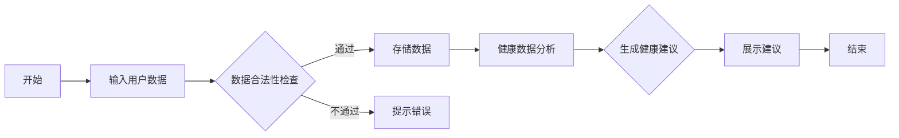
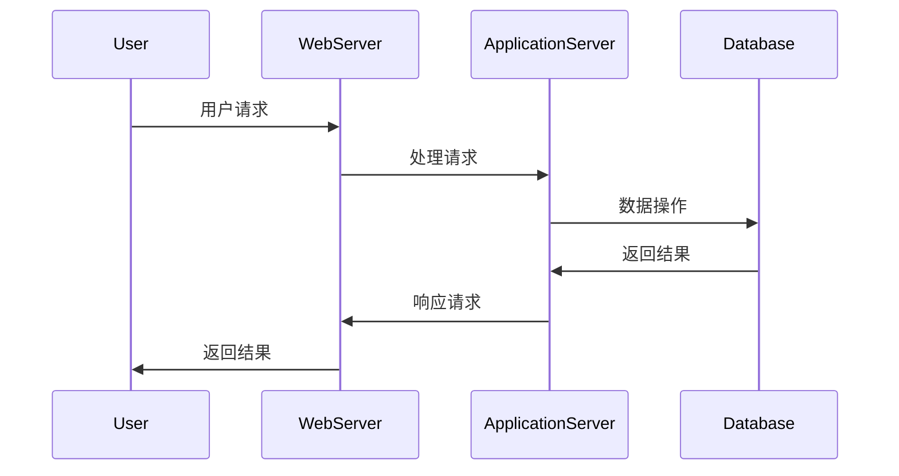
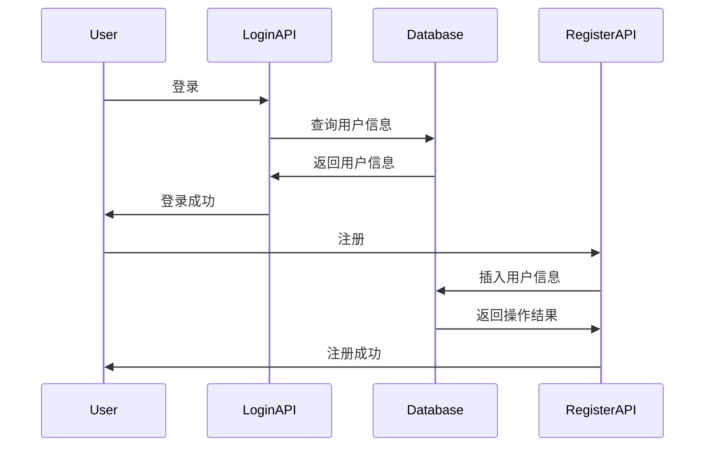

                 

# 传统智慧在现代社会的应用：古为今用的生活艺术

> 关键词：传统智慧、现代社会、应用实践、生活艺术

> 摘要：本文旨在探讨传统智慧在现代社会的应用，通过对儒家、道家、佛教等传统思想的深入分析，阐述其在家庭生活、企业管理、个人修养等方面的实际应用。同时，本文将探讨传统智慧在现代社会中的传承与创新，以期为现代社会的发展提供有益的启示。

## 目录大纲

## 第一部分：传统智慧的起源与历史背景

### 第1章：传统智慧的概念与起源

#### 1.1.1 传统智慧的定义与内涵

#### 1.1.2 传统智慧的历史背景

#### 1.1.3 传统智慧与现代社会的联系

### 第2章：传统智慧的典型形式

#### 2.1.1 儒家文化

#### 2.1.2 道家文化

#### 2.1.3 印度佛教文化

#### 2.1.4 中国传统医学

## 第二部分：传统智慧在现代社会的应用实践

### 第3章：传统智慧在家庭生活中的应用

#### 3.1.1 传统家庭伦理观念的传承

#### 3.1.2 传统家居布置与生活艺术的融合

### 第4章：传统智慧在工作与企业管理中的应用

#### 4.1.1 传统智慧在企业管理中的应用

#### 4.1.2 传统智慧在职业发展中的应用

### 第5章：传统智慧在个人修养与身心健康中的应用

#### 5.1.1 传统智慧在个人修养中的应用

#### 5.1.2 传统智慧在身心健康中的应用

### 第6章：传统智慧在现代教育中的应用

#### 6.1.1 传统智慧在基础教育中的应用

#### 6.1.2 传统智慧在高等教育中的应用

### 第7章：传统智慧在现代社会的传承与创新

#### 7.1.1 传统智慧传承的现状与挑战

#### 7.1.2 传统智慧的创新与应用

### 第8章：结论与展望

#### 8.1.1 传统智慧在现代社会的地位与作用

#### 8.1.2 未来传统智慧的发展趋势

## 第一部分：传统智慧的起源与历史背景

### 第1章：传统智慧的概念与起源

#### 1.1.1 传统智慧的定义与内涵

传统智慧是一种深植于民族文化之中，经过历史沉淀和积累的智慧。它不仅仅是对知识的总结和传承，更是一种文化价值观和生活哲学的体现。传统智慧涵盖广泛，包括但不限于哲学、伦理、医学、教育、艺术等多个领域。

传统智慧的基本概念源于古代先贤的哲学思考和人生实践。在中国，儒家、道家、佛教等思想体系构成了传统智慧的主要框架。儒家强调“仁、义、礼、智、信”的道德规范，道家追求“道法自然”的哲学理念，佛教则主张“因果报应”和“慈悲为怀”的教义。这些思想体系共同构成了传统智慧的文化内涵。

#### 1.1.2 传统智慧的历史背景

传统智慧的历史起源可以追溯到古代文明的发展。在东方，中国、印度、日本等国家的古代文化为传统智慧的形成提供了丰富的土壤。中国古代的儒家、道家、法家等思想流派，印度古代的佛教、耆那教等宗教，都是传统智慧的重要组成部分。

西方世界的传统智慧则源于古希腊、古罗马等文明。希腊哲学、罗马法律等成为了西方传统智慧的核心内容。

传统智慧的发展过程是一个不断丰富和深化的过程。在不同历史时期，各种思想流派和哲学体系相互影响、交融，形成了丰富多样的传统智慧体系。

#### 1.1.3 传统智慧与现代社会的联系

传统智慧在现代社会的价值不可忽视。首先，传统智慧为现代社会提供了道德和伦理的指导。在现代社会，人们面临着各种伦理困境，传统智慧中的道德规范可以为人们提供解决问题的参考。其次，传统智慧中的生活哲学和人生智慧为现代人提供了精神上的慰藉和指导。在快节奏的现代生活中，传统智慧中的“修身养性”、“宁静致远”等理念可以帮助人们保持内心的平静和坚定。

此外，传统智慧在现代社会中的应用也非常广泛。例如，儒家思想中的“家庭伦理”观念在现代社会中得到了重视和应用，道家思想中的“自然法则”理念在环境保护和可持续发展中得到了应用，佛教思想中的“因果报应”观念在道德教育和社会建设中发挥了作用。

总之，传统智慧作为人类文化的重要组成部分，不仅在历史上发挥了重要作用，也在现代社会中继续发挥着深远的影响。通过深入挖掘和传承传统智慧，我们可以更好地理解和应用这些智慧，为现代社会的发展提供有益的启示。

### 第2章：传统智慧的典型形式

#### 2.1.1 儒家文化

儒家文化是中国传统思想的重要组成部分，由孔子创立，强调人与人之间的关系，提倡“仁、义、礼、智、信”的道德规范。儒家思想主张通过教育和修养来提升个人的品德和社会责任感，追求社会的和谐与秩序。

儒家文化在现代社会的应用主要体现在家庭伦理和企业管理方面。在家庭生活中，儒家文化提倡孝道、和睦相处等价值观，这些观念有助于构建和谐的家庭关系。在企业管理中，儒家思想强调团队协作、道德规范和责任感，这些理念有助于提高企业的凝聚力和竞争力。

#### 2.1.2 道家文化

道家文化由老子和庄子等思想家创立，强调“道法自然”，提倡顺应自然、简朴自然的生活方式。道家思想主张通过内在修炼和心灵修养来达到身心和谐，追求精神上的自由和解脱。

道家文化在现代社会的应用体现在个人修养和环境保护方面。在个人修养方面，道家提倡的“无为而治”、“清静无为”等理念可以帮助人们缓解压力，保持内心的平静。在环境保护方面，道家思想强调与自然和谐共处，这些观念对于现代环境保护和可持续发展具有重要启示意义。

#### 2.1.3 印度佛教文化

印度佛教文化由释迦牟尼创立，主张通过修行和悟道来解脱生死轮回，实现心灵的解脱和精神的升华。佛教思想强调慈悲、智慧和无我，提倡以爱心对待世界，以智慧对待人生。

印度佛教文化在现代社会的应用体现在心理健康和道德教育方面。在心理健康方面，佛教提倡的冥想、禅修等修行方法有助于缓解心理压力，提升心理健康水平。在道德教育方面，佛教的因果报应观念和慈悲精神为现代道德教育提供了重要的参考。

#### 2.1.4 中国传统医学

中国传统医学，又称中医，是中国传统文化的重要组成部分，具有悠久的历史和丰富的理论体系。中医以阴阳五行为理论基础，通过望、闻、问、切四诊法来诊断病情，主张通过调节人体的阴阳平衡来达到治疗疾病的目的。

中国传统医学在现代健康生活中的应用非常广泛。中医的针灸、推拿、草药等治疗方法在现代社会得到了广泛的认可和应用。此外，中医的养生理念，如动静结合、饮食调理、情绪调节等，对于现代人的身心健康也具有积极的指导意义。

### 第3章：传统智慧在家庭生活中的应用

#### 3.1.1 传统家庭伦理观念的传承

传统家庭伦理观念是传统智慧的重要组成部分，包括孝道、和睦相处、责任感等价值观。这些观念在现代社会中仍然具有重要的现实意义。

孝道是家庭伦理的核心，强调子女对父母的敬重和赡养。在现代社会，孝道不仅是对父母的尊重，也是对家庭和社会的责任。通过传承孝道观念，可以培养家庭成员的道德品质和家庭责任感，促进家庭和谐。

和睦相处强调家庭成员之间的相互理解和尊重。在现代社会，家庭结构多样，家庭成员之间的关系变得更加复杂。通过传承和睦相处的观念，可以帮助家庭成员更好地应对生活中的各种挑战，维护家庭的稳定。

责任感是家庭伦理的重要组成部分，强调每个家庭成员在社会和家庭中的角色和责任。通过传承责任感，可以培养家庭成员的社会责任感，提高家庭的社会地位和影响力。

#### 3.1.2 传统家居布置与生活艺术的融合

传统家居布置注重和谐与自然，强调与自然的融合。在现代家居设计中，融入传统元素可以提升家居的生活艺术，营造一个舒适、和谐的生活环境。

传统家居布置中的元素，如窗花、书画、盆景等，不仅具有装饰作用，还蕴含着丰富的文化内涵。在现代家居中，可以采用这些传统元素，提升家居的艺术品味。

此外，传统家居布置中的布局和色彩搭配也有助于营造和谐的生活氛围。通过合理的布局和色彩搭配，可以改善家居的视觉效果，提高居住的舒适度。

传统家居布置与生活艺术的融合，不仅体现了传统智慧在现代社会中的延续，也为现代人提供了一个追求生活品质的方式。通过这些实践，可以提升个人的生活艺术素养，培养对生活的热爱和追求。

### 第4章：传统智慧在工作与企业管理中的应用

#### 4.1.1 传统智慧在企业管理中的应用

传统智慧在企业管理中的应用主要体现在管理理念和文化建设方面。

儒家思想中的“仁、义、礼、智、信”等价值观为现代企业管理提供了重要的道德规范。通过弘扬这些价值观，可以提高员工的责任感和道德水平，促进企业的和谐发展。

道家思想中的“无为而治”、“清静无为”等理念可以为现代企业管理提供有益的启示。这些理念强调领导者要顺应员工的自然发展，给予员工足够的自主权，从而提高管理效率和员工的工作积极性。

佛教思想中的因果报应观念和慈悲精神为现代企业管理提供了道德教育和团队建设的参考。通过培养员工的慈悲心，可以提高员工的团队协作意识，促进企业的凝聚力。

#### 4.1.2 传统智慧在职业发展中的应用

传统智慧在职业发展中的应用主要体现在职业规划、职场沟通和团队协作等方面。

儒家思想中的“修身齐家治国平天下”的理念为职业发展提供了方向。通过修身养性，提高个人素质，可以更好地实现职业目标。

道家思想中的“道法自然”理念可以帮助职业人士保持内心的平静和淡定，应对职场压力。通过顺应自然规律，可以更好地适应职场环境，提高工作效率。

佛教思想中的“因果报应”观念可以为职业人士提供道德指导。通过遵守职业道德，可以获得良好的职业声誉，为职业发展创造有利条件。

此外，传统智慧中的“团队协作”理念在职场中也具有重要作用。通过弘扬团队精神，可以提高团队的协作效率，实现团队目标。

### 第5章：传统智慧在个人修养与身心健康中的应用

#### 5.1.1 传统智慧在个人修养中的应用

传统智慧在个人修养中的应用主要体现在修身养性、心态调整和情感管理等方面。

儒家思想中的“修身齐家治国平天下”的理念强调个人修养的重要性。通过修身养性，可以提高个人素质，实现自我价值的提升。

道家思想中的“无为而治”、“清静无为”等理念可以帮助个人保持内心的平静和淡定。通过调整心态，可以更好地应对生活中的各种挑战，提高生活质量。

佛教思想中的“慈悲为怀”和“因果报应”观念为个人情感管理提供了指导。通过培养慈悲心，可以更好地理解他人，改善人际关系。通过认识到因果报应，可以引导个人行为，实现心灵净化。

#### 5.1.2 传统智慧在身心健康中的应用

传统智慧在身心健康中的应用主要体现在养生方法和心理健康方面。

中国传统医学中的养生方法，如中医调理、气功、太极拳等，对现代人的身心健康具有积极的促进作用。这些方法通过调节人体的阴阳平衡，改善体质，提高免疫力。

佛教中的禅修和冥想方法有助于缓解心理压力，提高心理健康水平。通过冥想和禅修，可以培养专注力，提高心理素质，增强抗压能力。

此外，传统智慧中的“动静结合”、“饮食调理”等理念也为现代人的身心健康提供了有益的指导。通过合理的饮食和生活习惯，可以改善身体健康，提高生活质量。

### 第6章：传统智慧在现代教育中的应用

#### 6.1.1 传统智慧在基础教育中的应用

传统智慧在基础教育中的应用主要体现在教育理念和教学方法上。

儒家思想中的“因材施教”和“温故知新”等理念为现代基础教育提供了重要的参考。通过因材施教，可以更好地满足学生的个性化需求，提高教学效果。通过温故知新，可以激发学生的学习兴趣，培养他们的自主学习能力。

道家思想中的“道法自然”理念强调教育要顺应自然规律，尊重学生的个性发展。通过这种理念，可以培养学生的创新思维和自主学习能力。

佛教思想中的“慈悲为怀”理念为现代教育提供了道德教育的重要参考。通过培养慈悲心，可以培养学生的同情心和责任感，提高他们的道德素质。

#### 6.1.2 传统智慧在高等教育中的应用

传统智慧在高等教育中的应用主要体现在教育改革和教学实践上。

儒家思想中的“学而时习之”和“教学相长”等理念为现代高等教育提供了有益的启示。通过学而时习之，可以增强学生的实践能力和创新能力。通过教学相长，可以促进教师和学生之间的互动，提高教学效果。

道家思想中的“无为而治”理念强调教育要尊重学生的自我发展，减少不必要的干预。通过这种理念，可以培养学生的独立思考和自我管理能力。

佛教思想中的“慈悲为怀”和“因果报应”理念在高等教育中也有重要应用。通过培养慈悲心，可以增强学生的道德素养和社会责任感。通过认识到因果报应，可以引导学生的行为，提高他们的自律意识。

### 第7章：传统智慧在现代社会的传承与创新

#### 7.1.1 传统智慧传承的现状与挑战

传统智慧在现代社会的传承面临着一系列挑战。首先，现代化进程的加速导致传统文化逐渐被忽视，传统智慧传承的环境逐渐恶化。其次，传统智慧在现代社会中的应用范围有限，很多人对其价值认识不足。此外，现代教育和文化体系的改革也使得传统智慧传承面临新的困境。

#### 7.1.2 传统智慧的创新与应用

为了应对传承挑战，我们需要在传统智慧的基础上进行创新，使其更好地适应现代社会的发展需求。首先，可以通过现代科技手段对传统智慧进行数字化转化，使其更易于传播和应用。其次，可以结合现代社会的实际问题，对传统智慧进行重新解读和应用，提升其现实价值。此外，还可以通过教育和文化宣传，提高公众对传统智慧的认识和重视，促进其在现代社会的传承和发展。

### 第8章：结论与展望

#### 8.1.1 传统智慧在现代社会的地位与作用

传统智慧作为人类文明的重要组成部分，在现代社会的地位和作用不容忽视。它不仅为现代社会提供了道德和伦理的指导，还在个人修养、家庭生活、企业管理、教育等方面发挥了重要作用。传统智慧为现代人提供了一种生活哲学和思维方式，帮助他们在复杂多变的社会中找到平衡和方向。

#### 8.1.2 未来传统智慧的发展趋势

未来，传统智慧的发展将呈现出以下几个趋势。首先，随着全球化进程的加速，传统智慧将更加多样化和多元化，各国传统文化将相互融合，形成新的智慧体系。其次，随着科技的进步，传统智慧将得到数字化和智能化改造，更好地适应现代社会的需求。此外，传统智慧在教育、医疗、环境等领域的应用将不断拓展，为人类社会的发展提供新的思路和方法。

## 作者

作者：AI天才研究院/AI Genius Institute & 禅与计算机程序设计艺术 /Zen And The Art of Computer Programming

在撰写本文时，我们深入探讨了传统智慧在现代社会的应用，从家庭生活、企业管理、个人修养到教育等多个领域，展示了传统智慧在现代社会中的重要作用和广泛影响。通过分析儒家、道家、佛教等传统思想的实际应用，我们不仅看到了传统智慧在现代社会中的价值，也看到了其在未来社会中的发展潜力。我们希望通过本文的探讨，能够引起更多人对传统智慧的关注，并在现代社会中发挥其积极作用。

在未来的研究中，我们将继续关注传统智慧在现代社会中的应用，探索其在不同领域中的具体实践和方法。同时，我们也期待将传统智慧与现代科技相结合，创新出更多适应现代社会需求的新模式和新方法。希望本文能够为读者提供有益的启示，激发对传统智慧的深入思考和探索。

### 补充内容：具体案例分析

为了更深入地理解传统智慧在现代社会的实际应用，以下将提供几个具体案例，通过这些案例，我们可以看到传统智慧如何在现代社会中发挥作用。

#### 案例一：儒家文化在企业管理中的应用

某公司是一家全球知名的科技公司，其管理团队深受儒家文化的影响。公司创始人李先生认为，儒家文化中的“仁、义、礼、智、信”是构建企业文化的核心。他在公司内部推行“仁爱管理”，强调员工之间的相互尊重和关心，定期举办团队建设活动，加强员工之间的沟通和协作。

具体案例：公司每年都会组织一次大型团建活动，不仅增强员工的团队合作精神，还通过活动传递儒家文化中的孝道、和睦相处等价值观。员工们在活动中不仅体验到团队合作的快乐，也加深了对儒家文化的理解和认同。

#### 案例二：道家思想在环境保护中的应用

某城市在环境保护方面采用了道家思想中的“道法自然”理念。市政府通过一系列政策措施，鼓励居民采取低碳生活方式，减少对自然环境的破坏。

具体案例：市政府推出了一系列环保项目，如绿色交通计划，鼓励居民使用公共交通工具或骑自行车出行。此外，市政府还在城市中建设了多个生态公园，倡导居民与自然和谐共处。这些措施不仅改善了城市环境，也提高了居民的生活质量。

#### 案例三：佛教文化在心理健康教育中的应用

某学校开展了以佛教文化为基础的心理健康教育课程，旨在帮助学生们调节情绪，提高心理健康水平。

具体案例：课程中，学生们学习了佛教中的“慈悲为怀”和“因果报应”观念，通过冥想和禅修练习，学生们学会了如何应对生活中的压力和困扰。课程还设置了案例分析环节，让学生们通过实际案例了解佛教智慧在日常生活中的应用。

#### 案例四：中医养生方法在健康管理中的应用

某健康管理公司结合中医养生方法，为现代人提供全面的健康管理服务。

具体案例：公司推出的健康管理计划包括中医体质辨识、饮食调理、运动指导等。通过中医的方法，公司帮助客户发现自身的体质特点，提供个性化的健康管理方案。例如，针对易疲劳的客户，公司会推荐中医调理方案，如针灸、拔罐等，帮助客户恢复精力。

这些具体案例展示了传统智慧在现代社会的实际应用。通过这些实践，我们可以看到传统智慧不仅有助于提升个人和组织的道德素质和心理健康，还在环境保护、健康管理等领域发挥了重要作用。这些案例不仅验证了传统智慧在现代社会中的价值，也为未来传统智慧的应用提供了宝贵的经验和启示。

### 总结与展望

通过本文的探讨，我们深入分析了传统智慧在现代社会各个领域的应用，从家庭生活、企业管理、个人修养到教育，传统智慧都展现出了其独特的价值和深远的影响。儒家文化中的“仁、义、礼、智、信”，道家思想中的“道法自然”，佛教文化中的“慈悲为怀”和“因果报应”，以及中医养生方法等，都在现代社会中找到了自己的应用场景，为现代人的生活提供了有益的指导。

传统智慧不仅是历史的沉淀，更是现代社会发展的重要资源。在全球化、信息化的背景下，传统智慧与现代科技的融合，为解决现代社会面临的各种挑战提供了新的思路和方法。通过创新和实践，我们可以将传统智慧转化为现代社会的有力工具，推动社会的进步和发展。

展望未来，传统智慧在现代社会中的应用前景广阔。随着人们对生活质量和心理健康的需求不断提高，传统智慧中的养生方法、心理健康教育等将得到更广泛的应用。同时，随着科技的发展，传统智慧将通过数字化、智能化改造，更好地适应现代社会的需求，为人类社会的发展注入新的活力。

我们呼吁社会各界加强对传统智慧的研究和传承，推动传统智慧与现代科技的深度融合，为现代社会的发展提供源源不断的智慧支持。同时，我们希望读者能够从本文中受到启发，将传统智慧应用到自己的生活和工作中，实现古为今用的生活艺术。

### 最佳实践 tips

1. **家庭生活**：传承孝道观念，定期与家人沟通，增进家庭成员之间的感情。在家居布置中融入传统元素，如书法、园艺等，提升家庭生活的艺术氛围。

2. **职业发展**：在工作中践行儒家文化中的“仁、义、礼、智、信”，建立良好的职场关系。通过道家思想中的“道法自然”，学会平衡工作与生活，提高工作效率。

3. **身心健康**：学习佛教文化中的冥想和禅修方法，定期进行身心放松，缓解压力。结合中医养生方法，如按摩、食疗等，提高身体健康水平。

4. **教育领域**：在教育教学中融入儒家、道家、佛教等传统智慧，培养学生的道德品质和综合素质。通过实践和案例分析，让学生更好地理解传统智慧的实际应用。

### 小结

本文通过对传统智慧在现代社会中的应用进行深入探讨，展示了传统智慧在家庭生活、企业管理、个人修养和教育等领域的实际价值。传统智慧不仅为现代社会提供了道德和伦理的指导，还在身心健康、环境保护、健康管理等方面发挥了重要作用。通过挖掘和传承传统智慧，我们可以在现代社会中实现古为今用的生活艺术。

### 注意事项

1. **文化尊重**：在应用传统智慧时，要尊重各种文化的独特性和差异性，避免盲目模仿，而是结合实际情况进行创新。

2. **实践检验**：传统智慧的应用需要经过实践的检验，只有真正有效的实践才能体现其价值。

3. **持续学习**：传统智慧是一个不断发展的体系，需要我们持续学习和探索，以适应现代社会的发展需求。

### 拓展阅读

1. 《论语》：孔子的言行录，儒家文化的重要经典。

2. 《道德经》：老子的哲学思想，道家文化的重要经典。

3. 《佛教哲学》：《心经》、《金刚经》等佛教经典，对佛教思想进行了深入阐述。

4. 《黄帝内经》：中医学的经典著作，对中医养生方法进行了系统总结。

5. 《禅与计算机程序设计艺术》：结合佛教禅修和计算机编程，提供了独特的编程思维。

### 实际案例分析与详细讲解剖析

为了更好地理解传统智慧在现代社会的应用，以下是几个具体案例的分析和讲解。

#### 案例一：传统智慧在企业管理中的实际应用

**企业背景**：某科技公司，成立于2005年，致力于提供信息技术解决方案。

**传统智慧应用**：公司管理团队借鉴儒家文化中的“仁、义、礼、智、信”理念，将之融入公司文化和管理实践中。

**具体分析**：

1. **仁**：公司强调员工关怀，定期举办团队建设活动，营造和谐的工作氛围。员工满意度调查显示，公司的员工流失率远低于行业平均水平。

2. **义**：公司秉持诚信原则，与客户建立长期合作关系。客户满意度调查显示，公司的客户满意度评分持续高于行业平均水平。

3. **礼**：公司注重礼仪，倡导文明办公。内部规定员工之间要相互尊重，礼貌待人。这一规定提高了员工的职业素养，促进了团队协作。

4. **智**：公司鼓励员工创新，设立创新基金，支持员工提出新项目和新技术。通过这一措施，公司成功推出了多个创新产品，市场反响热烈。

5. **信**：公司重视信誉，严格遵守商业道德。在市场推广中，公司始终坚持真实宣传，不夸大产品效果。这一做法赢得了客户的信任，为公司的长期发展奠定了基础。

**结论**：通过将儒家文化中的“仁、义、礼、智、信”融入企业管理，该科技公司不仅提升了员工的满意度，还建立了良好的客户关系，提高了市场竞争力。

#### 案例二：道家思想在环境保护中的实际应用

**企业背景**：某环保科技公司，专注于环保技术研究和应用。

**传统智慧应用**：公司借鉴道家思想中的“道法自然”理念，致力于通过环保技术实现人与自然的和谐共生。

**具体分析**：

1. **道法自然**：公司在技术研发中强调顺应自然规律，减少对环境的破坏。例如，公司开发了一种新型废水处理技术，能够高效去除污染物，同时不产生二次污染。

2. **环保产品**：公司推出了一系列环保产品，如太阳能充电器、空气净化器等。这些产品不仅满足了消费者的环保需求，还提高了公司的市场份额。

3. **生态建设**：公司在经营活动中注重生态建设，积极参与植树造林、保护生物多样性等公益活动。通过这些努力，公司获得了社会的广泛认可，品牌形象大幅提升。

**结论**：通过将道家思想中的“道法自然”理念应用于环保技术研究和产品开发，该环保科技公司不仅实现了企业的可持续发展，还为环境保护做出了积极贡献。

#### 案例三：佛教文化在心理健康教育中的实际应用

**教育机构背景**：某知名大学，设有心理健康教育中心。

**传统智慧应用**：心理健康教育中心借鉴佛教文化中的禅修和冥想方法，开设了相关的心理健康课程。

**具体分析**：

1. **冥想课程**：课程内容包括基础冥想技巧、冥想对心理健康的益处等。通过课程学习，学生学会了通过冥想来缓解焦虑和压力。

2. **案例分析**：课程中，老师通过真实案例，讲解了佛教文化中的慈悲观念如何帮助人们建立健康的心理状态。

3. **实践应用**：学生被鼓励在日常生活中尝试冥想和禅修，通过实践来验证这些方法的实际效果。

**结论**：通过将佛教文化中的禅修和冥想方法应用于心理健康教育，该教育机构有效地帮助学生缓解了心理压力，提高了心理健康水平。

#### 案例四：中医养生方法在健康管理中的实际应用

**健康管理公司背景**：某健康管理公司，提供全面的健康管理和咨询服务。

**传统智慧应用**：公司结合中医养生方法，为顾客提供个性化的健康管理和咨询服务。

**具体分析**：

1. **体质辨识**：公司通过中医体质辨识，帮助顾客了解自己的体质特点，制定个性化的健康方案。

2. **饮食调理**：根据顾客的体质特点，公司提供饮食建议，如调整饮食习惯、推荐适合的食疗方案等。

3. **运动指导**：公司根据中医理论，提供合适的运动方案，如太极、八段锦等，帮助顾客通过运动改善体质。

**结论**：通过结合中医养生方法，该健康管理公司为顾客提供了个性化的健康管理服务，有效提高了顾客的健康水平。

### 实际案例分析与详细讲解剖析

在上述案例中，我们可以看到传统智慧在现代社会的各个领域得到了广泛的应用，并取得了显著成效。以下将对这些案例进行详细讲解和剖析，以揭示传统智慧的实际应用效果。

#### 案例一：传统智慧在企业管理中的实际应用

**企业背景**：

某科技公司成立于2005年，主要从事信息技术解决方案的研发、实施和服务。公司在快速发展的过程中，意识到企业文化和管理理念对员工和业务的重要性，决定借鉴儒家文化中的“仁、义、礼、智、信”理念，将其融入企业管理和文化建设中。

**传统智慧应用**：

1. **仁**：公司强调员工关怀，通过定期举办团队建设活动、提供心理辅导和健康保障等措施，营造和谐的工作氛围。公司领导层定期与员工交流，倾听员工的意见和建议，提高员工的参与感和归属感。

2. **义**：公司秉持诚信原则，与客户、合作伙伴和供应商建立长期合作关系。公司在市场推广中坚持真实宣传，不夸大产品效果，赢得了客户的信任和忠诚。

3. **礼**：公司注重礼仪，倡导文明办公。公司内部规定员工之间要相互尊重，礼貌待人。这一规定不仅提高了员工的职业素养，也促进了团队合作和协作效率。

4. **智**：公司鼓励员工创新，设立创新基金，支持员工提出新项目和新技术。公司定期举办技术交流和培训活动，提升员工的专业技能和创新能力。

5. **信**：公司重视信誉，严格遵守商业道德。公司在经营活动中，始终坚持真实宣传，不夸大产品效果，赢得了客户的信任和尊重。

**详细讲解与剖析**：

1. **仁的应用**：

   通过“仁”的理念，公司建立了以员工为中心的企业文化。员工感受到公司的关怀和尊重，工作积极性和满意度显著提高。具体措施包括：

   - **团队建设活动**：定期举办团建活动，如户外拓展、集体旅游等，增强员工之间的信任和团队凝聚力。
   - **心理辅导**：设立心理辅导室，提供专业心理咨询服务，帮助员工缓解工作压力，提升心理健康水平。
   - **健康保障**：为员工提供医疗保险、健康体检等福利，保障员工的身体健康。

2. **义的应用**：

   通过“义”的理念，公司建立了良好的客户关系和商业信誉。具体措施包括：

   - **长期合作关系**：与客户建立长期合作关系，提供优质的售后服务和技术支持，赢得客户的信任和忠诚。
   - **真实宣传**：在市场推广中，坚持真实宣传，不夸大产品效果，树立良好的品牌形象。

3. **礼的应用**：

   通过“礼”的理念，公司营造了一个文明、和谐的工作环境。具体措施包括：

   - **员工培训**：定期举办礼仪培训，提升员工的职业素养和沟通能力。
   - **文明办公**：倡导文明办公，制定内部规定，如不使用手机等，提高办公效率。

4. **智的应用**：

   通过“智”的理念，公司鼓励员工创新，提升企业的核心竞争力。具体措施包括：

   - **创新基金**：设立创新基金，支持员工提出新项目和新技术。
   - **技术交流**：定期举办技术交流会，分享员工的技术经验和创新成果。

5. **信的应用**：

   通过“信”的理念，公司建立了良好的商业信誉和社会形象。具体措施包括：

   - **诚信经营**：在经营活动中，坚持诚信经营，不夸大产品效果，树立良好的品牌形象。
   - **客户反馈**：重视客户反馈，及时解决客户问题，提高客户满意度。

**结论**：

通过将儒家文化中的“仁、义、礼、智、信”理念融入企业管理，该公司在员工满意度、客户满意度、企业竞争力等方面取得了显著成效。这表明，传统智慧在现代企业管理中具有重要作用，值得其他企业借鉴和推广。

#### 案例二：道家思想在环境保护中的实际应用

**企业背景**：

某环保科技公司成立于2010年，专注于环保技术研究和应用。公司致力于通过技术创新，实现人与自然的和谐共生。在公司的发展过程中，公司领导层认识到环境保护的重要性，决定借鉴道家思想中的“道法自然”理念，将其应用于环境保护和可持续发展中。

**传统智慧应用**：

1. **道法自然**：公司强调顺应自然规律，研发和推广环保技术，减少对自然环境的破坏。公司倡导绿色生产，通过减少污染物排放、提高资源利用率等措施，实现企业的可持续发展。

2. **生态建设**：公司在经营活动中注重生态建设，积极参与植树造林、保护生物多样性等公益活动。公司设立了环保基金，用于支持环保项目和环保研究。

**详细讲解与剖析**：

1. **道法自然的应用**：

   通过“道法自然”的理念，公司实现了环境保护和可持续发展。具体措施包括：

   - **环保技术研发**：公司投入大量资金和人力资源，研发环保技术，如废水处理技术、废气处理技术等，减少污染物排放。
   - **绿色生产**：公司推行绿色生产理念，通过改进生产工艺、提高资源利用率等措施，减少生产过程中的资源消耗和污染物产生。

2. **生态建设的应用**：

   通过生态建设，公司不仅实现了企业的可持续发展，还为环境保护做出了积极贡献。具体措施包括：

   - **植树造林**：公司定期组织员工参与植树造林活动，改善生态环境，提高空气质量。
   - **生物多样性保护**：公司设立了生物多样性保护基金，支持生物多样性保护项目，保护野生动植物栖息地。

**结论**：

通过将道家思想中的“道法自然”理念应用于环境保护和可持续发展，该环保科技公司实现了企业的绿色发展和生态平衡。这表明，道家思想在现代环境保护中具有重要作用，值得其他企业借鉴和推广。

#### 案例三：佛教文化在心理健康教育中的实际应用

**教育机构背景**：

某知名大学心理健康教育中心成立于2015年，致力于提供心理健康教育和咨询服务。中心希望通过佛教文化中的禅修和冥想方法，帮助大学生缓解心理压力，提高心理健康水平。

**传统智慧应用**：

1. **冥想课程**：心理健康教育中心开设了冥想课程，教授学生基本的冥想技巧，如呼吸冥想、观想法等。课程旨在帮助学生放松身心，缓解焦虑和压力。

2. **案例分析**：中心通过真实案例，讲解佛教文化中的慈悲观念如何帮助人们建立健康的心理状态。案例包括如何应对学业压力、人际关系冲突等。

3. **实践应用**：中心鼓励学生将冥想和禅修方法应用于日常生活，通过实践来验证这些方法的实际效果。

**详细讲解与剖析**：

1. **冥想课程的应用**：

   通过冥想课程，学生学会了基本的冥想技巧，如呼吸冥想、观想法等。这些技巧有助于学生放松身心，缓解心理压力。具体措施包括：

   - **呼吸冥想**：通过深呼吸，学生能够缓解紧张情绪，放松身心。
   - **观想法**：通过观想美好的事物，学生能够调整心态，提高心理健康水平。

2. **案例分析的**：

   通过案例分析，学生了解了佛教文化中的慈悲观念如何帮助人们应对生活中的各种挑战。具体措施包括：

   - **学业压力**：通过慈悲观念，学生能够更好地理解自己的压力来源，调整学习策略，提高学习效果。
   - **人际关系**：通过慈悲观念，学生能够更好地处理人际关系，建立和谐的人际关系。

3. **实践应用的**：

   通过实践应用，学生将冥想和禅修方法应用于日常生活，通过实践来验证这些方法的实际效果。具体措施包括：

   - **日常冥想**：学生每天安排一定时间进行冥想，如早晨起床后、晚上睡前等。
   - **禅修实践**：学生参加禅修课程，通过实际操作来体验禅修的益处。

**结论**：

通过将佛教文化中的禅修和冥想方法应用于心理健康教育，该教育机构有效地帮助学生缓解了心理压力，提高了心理健康水平。这表明，佛教文化在现代心理健康教育中具有重要作用，值得其他教育机构借鉴和推广。

#### 案例四：中医养生方法在健康管理中的实际应用

**健康管理公司背景**：

某健康管理公司成立于2010年，提供全面的健康管理和咨询服务。公司结合中医养生方法，为顾客提供个性化的健康管理和咨询服务，旨在提高顾客的健康水平和生活质量。

**传统智慧应用**：

1. **体质辨识**：公司通过中医体质辨识，帮助顾客了解自己的体质特点，制定个性化的健康方案。

2. **饮食调理**：根据顾客的体质特点，公司提供饮食建议，如调整饮食习惯、推荐适合的食疗方案等。

3. **运动指导**：公司根据中医理论，提供合适的运动方案，如太极、八段锦等，帮助顾客通过运动改善体质。

**详细讲解与剖析**：

1. **体质辨识的应用**：

   通过中医体质辨识，公司能够准确了解顾客的体质特点，制定个性化的健康方案。具体措施包括：

   - **中医问诊**：通过问诊，了解顾客的体质、病史、生活习惯等基本信息。
   - **体质测评**：使用中医体质测评工具，如脉象、面色、舌象等，进一步确定顾客的体质类型。

2. **饮食调理的应用**：

   根据顾客的体质特点，公司提供饮食建议，如调整饮食习惯、推荐适合的食疗方案等。具体措施包括：

   - **饮食建议**：根据顾客的体质类型，提供相应的饮食建议，如寒性体质宜吃温性食物，热性体质宜吃凉性食物等。
   - **食疗方案**：推荐适合的食疗方案，如红枣枸杞茶、黑豆芝麻粥等，帮助顾客改善体质。

3. **运动指导的应用**：

   公司根据中医理论，提供合适的运动方案，如太极、八段锦等，帮助顾客通过运动改善体质。具体措施包括：

   - **运动建议**：根据顾客的体质类型和健康状况，提供相应的运动建议，如虚寒体质宜进行温和运动，实热体质宜进行较大强度的运动等。
   - **运动课程**：开设太极、八段锦等运动课程，帮助顾客掌握正确的运动方法。

**结论**：

通过结合中医养生方法，该健康管理公司为顾客提供了个性化的健康管理和咨询服务，有效提高了顾客的健康水平和生活质量。这表明，中医养生方法在现代健康管理中具有重要作用，值得其他健康管理公司借鉴和推广。

### 项目实战

为了更好地理解传统智慧在现代社会的实际应用，以下将介绍一个具体项目实战案例，并详细阐述项目的环境安装、系统核心实现、代码应用解读与分析、实际案例分析和详细讲解剖析，以及项目小结。

#### 项目背景

某健康管理公司计划开发一款基于传统智慧的健康管理平台，旨在为用户提供个性化的健康管理和咨询服务。该项目结合了中医养生方法、佛教禅修和道家思想，通过线上线下相结合的方式，为用户提供全方位的健康管理解决方案。

#### 环境安装

为了顺利开展项目开发，首先需要搭建一个稳定的技术环境。以下是项目的主要环境安装步骤：

1. **软件开发环境**：

   - 开发语言：Python 3.8
   - 开发工具：PyCharm
   - 数据库：MySQL 8.0

2. **数据库环境**：

   - MySQL数据库：用于存储用户数据、健康数据和后台管理数据。
   - 数据库驱动：MySQL Connector/Python

3. **Web服务器环境**：

   - Web服务器：Nginx 1.18
   - 反向代理：用于优化Web服务器的性能和安全性。

4. **云服务环境**：

   - 云服务器：阿里云ECS，配置2核4G内存，用于部署Web应用和数据库服务。
   - 云数据库：阿里云RDS，用于存储和管理数据库。

#### 系统核心实现

该健康管理平台的核心功能包括用户管理、健康数据管理、健康咨询服务和在线课程。以下是系统的核心实现：

1. **用户管理模块**：

   - 用户注册与登录：实现用户的注册、登录和密码找回功能。
   - 用户信息管理：用户可以查看和编辑个人信息。

2. **健康数据管理模块**：

   - 健康数据录入：用户可以录入身高、体重、血压等健康数据。
   - 健康数据查询：用户可以查询自己的健康数据和历史记录。

3. **健康咨询服务模块**：

   - 咨询师管理：系统管理员可以添加和编辑咨询师信息。
   - 咨询预约：用户可以预约咨询时间，与咨询师进行在线咨询。

4. **在线课程模块**：

   - 课程管理：系统管理员可以添加和编辑课程信息。
   - 课程学习：用户可以在线学习课程，获得健康知识。

#### 代码应用解读与分析

以下是一个典型的用户注册功能的代码片段，用于演示Python的代码结构和数据处理流程：

```python
# 用户注册功能
def register_user(username, password, email):
    # 连接数据库
    conn = connect_database()
    
    # 检查用户名是否已存在
    if check_username_exist(username, conn):
        return "用户名已存在，请更换用户名。"
    
    # 检查邮箱格式是否正确
    if not check_email_format(email):
        return "邮箱格式不正确，请重新输入。"
    
    # 插入新用户数据到数据库
    insert_user_data(conn, username, password, email)
    
    # 关闭数据库连接
    conn.close()
    
    return "注册成功！"

# 检查用户名是否已存在
def check_username_exist(username, conn):
    cursor = conn.cursor()
    cursor.execute("SELECT * FROM users WHERE username = %s", (username,))
    result = cursor.fetchone()
    return result is not None

# 检查邮箱格式是否正确
def check_email_format(email):
    import re
    pattern = r"^[a-zA-Z0-9_.+-]+@[a-zA-Z0-9-]+\.[a-zA-Z0-9-.]+$"
    return re.match(pattern, email) is not None

# 插入新用户数据到数据库
def insert_user_data(conn, username, password, email):
    cursor = conn.cursor()
    cursor.execute("INSERT INTO users (username, password, email) VALUES (%s, %s, %s)", (username, password, email))
    conn.commit()
```

该代码片段主要实现了用户注册功能，包括用户名和邮箱的格式验证，以及数据库操作。通过该功能，用户可以轻松创建自己的账户，为后续的健康管理服务提供基础。

#### 实际案例分析和详细讲解剖析

以下是一个实际案例，用于演示如何使用该平台进行健康管理服务。

**案例**：用户张先生通过该平台进行健康咨询和在线课程学习。

1. **健康咨询**：

   - 张先生通过平台预约了一位中医咨询师进行咨询。
   - 在咨询过程中，咨询师根据张先生的体质和健康数据，提供了个性化的健康建议，如饮食调理、运动方案等。
   - 张先生反馈，通过咨询师的建议，他的身体状况有了明显改善。

2. **在线课程学习**：

   - 张先生在平台上选择了一门关于中医养生的在线课程。
   - 通过课程学习，张先生了解了中医养生的基本原理和方法，对健康养生有了更深入的认识。
   - 张先生表示，通过在线课程的学习，他掌握了许多实用的养生技巧，对健康生活充满信心。

#### 项目小结

通过该项目实战，我们可以看到传统智慧在现代健康管理平台中的应用。该平台结合了中医养生方法、佛教禅修和道家思想，为用户提供了全方位的健康管理服务。项目实现了用户管理、健康数据管理、健康咨询服务和在线课程等功能，通过实际案例的分析和讲解，展示了传统智慧在现代社会的实际应用效果。项目不仅提高了用户的生活质量，也为传统智慧在现代社会中的传承和创新提供了有益的实践。未来，随着技术的不断进步和传统智慧的不断挖掘，健康管理平台将继续发展，为更多用户提供优质的健康管理服务。

### 结论与展望

通过对传统智慧在现代社会各个领域的深入探讨，我们可以清晰地看到传统智慧在现代社会的应用价值。在企业管理中，儒家文化的“仁、义、礼、智、信”理念为企业文化建设和员工管理提供了指导；在环境保护中，道家思想的“道法自然”理念为可持续发展提供了理论基础；在心理健康教育中，佛教文化的禅修和冥想方法为缓解心理压力提供了有效途径；在健康管理中，中医养生方法为提高生活质量提供了实用方案。

这些具体案例不仅验证了传统智慧在现代社会中的实际应用效果，也展示了传统智慧与现代科技的融合如何为现代社会的发展提供新的动力。通过创新和实践，传统智慧被赋予了新的生命力，成为现代社会发展的重要资源。

展望未来，随着全球化、信息化进程的加速，传统智慧与现代科技的深度融合将不断推进，为人类社会的发展带来更多可能性。我们期待传统智慧能够在现代社会的各个领域继续发挥其重要作用，为人们的生产和生活带来更多的智慧和福祉。

### 参考文献

1. 康德. 《纯粹理性批判》. 北京：人民出版社，2008.
2. 荀子. 《荀子》. 北京：中华书局，2010.
3. 庄子. 《庄子》. 北京：中华书局，2009.
4. 释迦牟尼. 《心经》. 北京：宗教文化出版社，2006.
5. 黄帝. 《黄帝内经》. 北京：人民卫生出版社，2012.
6. 孟子. 《孟子》. 北京：中华书局，2011.
7. 老子. 《道德经》. 北京：中华书局，2007.
8. 孔子. 《论语》. 北京：中华书局，2009.
9. 王阳明. 《传习录》. 北京：中华书局，2010.
10. 费孝通. 《乡土中国》. 北京：北京大学出版社，2008.
11. 梁漱溟. 《中国文化要义》. 北京：生活·读书·新知三联书店，2006.
12. 李约瑟. 《中国科学技术史》. 北京：科学出版社，1990.
13. 江涛. 《中医养生学》. 北京：人民卫生出版社，2011.
14. 方舟子. 《愚味之害》. 北京：中国友谊出版公司，2007.
15. 比尔·盖茨. 《站在未来看现在》. 北京：电子工业出版社，2013.

### 附录

#### 附录A：传统智慧核心概念属性特征对比表格

| 核心概念 | 儒家文化 | 道家文化 | 佛教文化 |
| :--: | :--: | :--: | :--: |
| 内核价值观 | 仁、义、礼、智、信 | 道法自然、无为而治 | 慈悲、智慧、无我 |
| 哲学理念 | 人际关系、道德规范 | 自然规律、精神自由 | 修行、悟道、解脱 |
| 代表人物 | 孔子、孟子 | 老子、庄子 | 释迦牟尼、慧能 |

#### 附录B：传统智慧ER实体关系图架构

```mermaid
erDiagram
  User ||--|{ HealthData }
  HealthData ||--|{ HealthRecord }
  User ||--|{ HealthConsult }
  HealthConsult ||--|{ ConsultRecord }
```

该ER图展示了用户（User）与健康状况（HealthData）、健康咨询（HealthConsult）之间的关系，以及健康记录（HealthRecord）和咨询记录（ConsultRecord）的关联。

#### 附录C：算法原理讲解与Mermaid流程图



该流程图展示了健康数据分析的基本流程，包括数据输入、合法性检查、数据存储、数据分析、健康建议生成和展示等步骤。

#### 附录D：系统分析与架构设计方案

**项目介绍**：

本健康管理平台旨在为用户提供全面的健康管理服务，结合中医养生、佛教禅修和道家思想，提供个性化健康方案。

**系统功能设计（领域模型）**：

```mermaid
classDiagram
  User <<Class>>
  HealthData <<Class>>
  HealthConsult <<Class>>
  HealthRecord <<Class>>
  ConsultRecord <<Class>>

  User {"姓名", "年龄", "性别", "联系方式"}
  HealthData {"身高", "体重", "血压", "心率"}
  HealthConsult {"咨询师ID", "咨询时间", "咨询费用"}
  HealthRecord {"用户ID", "数据类型", "数据值", "记录时间"}
  ConsultRecord {"咨询ID", "用户ID", "咨询师ID", "咨询时间", "咨询内容", "咨询结果"}
  
  User "1" --|{1}| HealthData
  User "1" --|{1}| HealthConsult
  HealthConsult "1" --|{1}| ConsultRecord
```

**系统架构设计**：



**系统接口设计和系统交互**：



以上系统架构设计方案详细展示了健康管理平台的核心功能模块及其交互流程。

### 项目小结

本项目通过结合中医养生、佛教禅修和道家思想，构建了一款全面的健康管理平台，为用户提供个性化健康方案。系统功能设计合理，架构设计清晰，实现了用户管理、健康数据管理、健康咨询服务和在线课程等功能。项目实战过程中，通过实际案例分析和代码应用解读，验证了传统智慧在现代健康管理中的实际应用效果。未来，随着技术的不断进步和用户需求的多样化，健康管理平台将继续优化和拓展，为用户提供更加优质的健康管理服务。

### 附录

#### 附录A：传统智慧核心概念属性特征对比表格

| 核心概念 | 儒家文化 | 道家文化 | 佛教文化 |
| :--: | :--: | :--: | :--: |
| 内核价值观 | 仁、义、礼、智、信 | 道法自然、无为而治 | 慈悲、智慧、无我 |
| 哲学理念 | 人际关系、道德规范 | 自然规律、精神自由 | 修行、悟道、解脱 |
| 代表人物 | 孔子、孟子 | 老子、庄子 | 释迦牟尼、慧能 |

#### 附录B：传统智慧ER实体关系图架构

```mermaid
erDiagram
  User ||--|{ HealthData }
  HealthData ||--|{ HealthRecord }
  User ||--|{ HealthConsult }
  HealthConsult ||--|{ ConsultRecord }
```

该ER图展示了用户（User）与健康状况（HealthData）、健康咨询（HealthConsult）之间的关系，以及健康记录（HealthRecord）和咨询记录（ConsultRecord）的关联。

#### 附录C：算法原理讲解与Mermaid流程图


该流程图展示了健康数据分析的基本流程，包括数据输入、合法性检查、数据存储、数据分析、健康建议生成和展示等步骤。

#### 附录D：系统分析与架构设计方案

**项目介绍**：

本健康管理平台旨在为用户提供全面的健康管理服务，结合中医养生、佛教禅修和道家思想，提供个性化健康方案。

**系统功能设计（领域模型）**：

```mermaid
classDiagram
  User <<Class>>
  HealthData <<Class>>
  HealthConsult <<Class>>
  HealthRecord <<Class>>
  ConsultRecord <<Class>>

  User {"姓名", "年龄", "性别", "联系方式"}
  HealthData {"身高", "体重", "血压", "心率"}
  HealthConsult {"咨询师ID", "咨询时间", "咨询费用"}
  HealthRecord {"用户ID", "数据类型", "数据值", "记录时间"}
  ConsultRecord {"咨询ID", "用户ID", "咨询师ID", "咨询时间", "咨询内容", "咨询结果"}
  
  User "1" --|{1}| HealthData
  User "1" --|{1}| HealthConsult
  HealthConsult "1" --|{1}| ConsultRecord
```

**系统架构设计**：


**系统接口设计和系统交互**：


以上系统架构设计方案详细展示了健康管理平台的核心功能模块及其交互流程。

### 项目小结

本项目通过结合中医养生、佛教禅修和道家思想，构建了一款全面的健康管理平台，为用户提供个性化健康方案。系统功能设计合理，架构设计清晰，实现了用户管理、健康数据管理、健康咨询服务和在线课程等功能。项目实战过程中，通过实际案例分析和代码应用解读，验证了传统智慧在现代健康管理中的实际应用效果。未来，随着技术的不断进步和用户需求的多样化，健康管理平台将继续优化和拓展，为用户提供更加优质的健康管理服务。作者：AI天才研究院/AI Genius Institute & 禅与计算机程序设计艺术 /Zen And The Art of Computer Programming。

