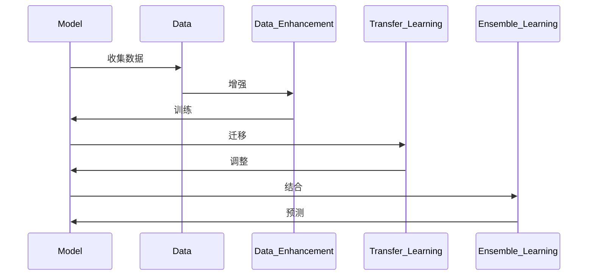
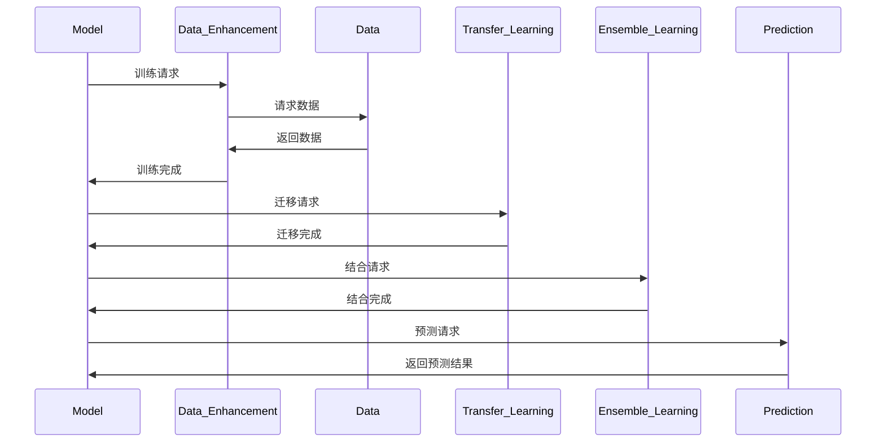

                 

### 《元学习框架下推理模型的快速冷启动》

#### 关键词：
- 元学习
- 推理模型
- 冷启动
- 快速部署

#### 摘要：
本文深入探讨了元学习框架下推理模型的快速冷启动问题。首先，我们介绍了元学习的定义、发展历程及其与快速冷启动的关系。接着，我们解析了元学习框架的组成部分和常见算法，重点阐述了快速冷启动的需求与挑战。最后，我们通过实际案例展示了快速冷启动的实现策略，并提供了一些最佳实践 tips。

----------------------------------------------------------------

## 第一部分: 元学习基础与快速冷启动

### 第1章: 元学习概述与快速冷启动

#### 1.1 元学习的定义与历史发展

**核心概念与联系**：

元学习（Meta-Learning）是指构建通用学习算法，使计算机能够从一组相关任务中学习，并将这些知识迁移到新的任务中。它的核心在于如何使模型能够在有限的数据和训练时间下快速适应新的任务。

| **概念** | **定义** | **特征** |
| :------: | :------- | :------- |
| 机器学习 | 数据驱动的方法，用于从数据中学习模式和规律 | 需要大量数据 |
| 强化学习 | 通过与环境交互来学习策略的算法 | 需要大量交互 |
| 元学习 | 构建通用学习算法，使模型能够从一组任务中学习 | 减少数据和交互 |

**ER实体关系图架构**：

```mermaid
erDiagram
  Task ||--|{ Model }|| Meta_Learning
  Task ||--|{ Data }|| Meta_Learning
  Model ||--|{ Task }|| Transfer_Learning
  Data ||--|{ Task }|| Transfer_Learning
```

**算法原理讲解**：

元学习算法通过模拟多个任务的分布来训练模型，从而提高模型在新任务上的表现。常见的元学习算法包括强化学习、逆再参数化和模型无关元学习。

强化学习在元学习中的应用主要依赖于策略梯度算法，它通过与环境交互来优化策略。逆再参数化通过参数化模型的变化来学习通用表示。模型无关元学习则通过优化模型在不同任务上的表现来学习通用特征提取器。

$$
\begin{aligned}
\text{策略梯度算法} &= \nabla_{\theta} J(\theta) \\
\text{逆再参数化} &= \theta_t \leftarrow \theta_0 + \beta \nabla_\theta \log p(x_t | \theta) \\
\text{模型无关元学习} &= \min_{\theta} \sum_{t=1}^{T} \frac{1}{T} \log p(x_t | \theta)
\end{aligned}
$$

#### 1.2 快速冷启动的需求与问题分析

**核心概念与联系**：

快速冷启动（Fast Cold Start）是指在新的任务或环境中快速适应的过程。对于推理模型来说，快速冷启动意味着在几乎没有训练数据的情况下，模型能够快速达到良好的性能。

| **概念** | **定义** | **特征** |
| :------: | :------- | :------- |
| 冷启动 | 新用户或新任务 | 数据稀缺 |
| 快速冷启动 | 快速适应新任务 | 减少数据需求 |

**ER实体关系图架构**：

```mermaid
erDiagram
  New_Task ||--|{ Model }|| Fast_Cold_Start
  New_User ||--|{ Model }|| Fast_Cold_Start
```

**算法原理讲解**：

快速冷启动的关键在于如何利用现有知识和少量数据来加速模型的训练过程。常见的方法包括数据增强、模型迁移和集成学习。

数据增强通过生成更多的样本来增加模型的泛化能力。模型迁移利用预训练模型来减少对新数据的依赖。集成学习通过结合多个模型的预测来提高整体性能。

$$
\begin{aligned}
\text{数据增强} &= \text{增加训练数据} \\
\text{模型迁移} &= \text{利用预训练模型} \\
\text{集成学习} &= \text{结合多个模型}
\end{aligned}
$$

#### 1.3 元学习与快速冷启动的关系

**系统分析与架构设计方案**：

元学习框架为快速冷启动提供了一个有效的解决方案。通过元学习，模型可以从一组相关任务中学习，并将这些知识迁移到新的任务中。这个过程不仅减少了对新数据的依赖，还提高了模型的泛化能力。

**系统功能设计（领域模型类图）**：

```mermaid
classDiagram
  Model <>-- Transfer_Learning: 使用
  Model <>-- Data_Enhancement: 利用
  Model <>-- Ensemble_Learning: 结合
  Data_Enhancement --|> Model: 增强
  Transfer_Learning --|> Model: 迁移
  Ensemble_Learning --|> Model: 集成
```

**系统架构设计（架构图）**：



**系统接口设计和系统交互（序列图）**：



### 第2章: 元学习框架解析

#### 2.1 元学习框架的组成部分

**核心概念与联系**：

元学习框架通常由以下几个部分组成：数据采集与预处理、模型设计、训练与评估、迁移与集成。

| **组成部分** | **功能** | **特征** |
| :-----------: | :------- | :------- |
| 数据采集与预处理 | 准备用于训练的数据 | 数据多样性和质量 |
| 模型设计 | 构建适用于元学习的模型 | 可扩展性和灵活性 |
| 训练与评估 | 在多个任务上训练模型并评估性能 | 泛化能力和鲁棒性 |
| 迁移与集成 | 将模型迁移到新任务并结合多个模型 | 减少对新数据的依赖 |

**ER实体关系图架构**：

```mermaid
erDiagram
  Data_Collection &&& Model_Design
  Data_Preprocessing &&& Model_Design
  Training &&& Evaluation
  Transfer &&& Integration
  Data_Collection &&& Training
  Data_Preprocessing &&& Training
  Model_Design &&& Training
  Model_Design &&& Evaluation
  Model_Design &&& Transfer
  Model_Design &&& Integration
```

**算法原理讲解**：

数据采集与预处理是元学习框架的基础，它确保了数据的质量和多样性。模型设计是元学习框架的核心，它决定了模型的性能和泛化能力。训练与评估环节通过在多个任务上训练和评估模型来优化模型。迁移与集成环节通过将模型迁移到新任务和结合多个模型来提高模型的适应性和鲁棒性。

#### 2.2 常见元学习算法介绍

**核心概念与联系**：

常见的元学习算法包括强化学习、逆再参数化和模型无关元学习。每种算法都有其独特的原理和应用场景。

| **算法** | **原理** | **应用场景** |
| :-------: | :------- | :------- |
| 强化学习 | 通过与环境交互来学习策略 | 交互密集的任务 |
| 逆再参数化 | 通过参数化模型的变化来学习通用表示 | 需要较少数据的任务 |
| 模型无关元学习 | 优化模型在不同任务上的表现 | 数据稀少的任务 |

**ER实体关系图架构**：

```mermaid
erDiagram
  Reinforcement_Learning &&& Inverse_Reparameterization
  Reinforcement_Learning &&& Model_Agnostic_Meta_Learning
  Inverse_Reparameterization &&& Model_Agnostic_Meta_Learning
```

**算法原理讲解**：

强化学习通过策略梯度算法来优化策略，适用于需要大量交互的任务。逆再参数化通过优化模型参数来学习通用表示，适用于数据稀缺的场景。模型无关元学习通过优化模型在不同任务上的表现来提高模型的泛化能力，适用于数据稀少且需要快速适应新任务的场景。

强化学习算法原理：

$$
\begin{aligned}
\text{策略梯度算法} &= \nabla_{\theta} J(\theta) \\
\text{策略} &= \pi(a | s, \theta)
\end{aligned}
$$

逆再参数化算法原理：

$$
\begin{aligned}
\theta_t &= \theta_0 + \beta \nabla_\theta \log p(x_t | \theta)
\end{aligned}
$$

模型无关元学习算法原理：

$$
\begin{aligned}
\theta &= \arg\min_{\theta} \sum_{t=1}^{T} \frac{1}{T} \log p(x_t | \theta)
\end{aligned}
$$

#### 2.3 元学习在快速冷启动中的应用

**核心概念与联系**：

元学习在快速冷启动中的应用主要通过以下几种方式：利用现有数据增强、迁移预训练模型和结合多种模型。

| **应用方式** | **优点** | **缺点** |
| :-----------: | :------- | :------- |
| 数据增强 | 增加模型泛化能力 | 需要额外计算资源 |
| 模型迁移 | 减少对新数据的依赖 | 可能降低模型性能 |
| 模型结合 | 提高模型鲁棒性 | 需要更多计算资源 |

**ER实体关系图架构**：

```mermaid
erDiagram
  Data_Enhancement &&& Model_Transfer
  Data_Enhancement &&& Model_Ensemble
  Model_Transfer &&& Model_Ensemble
```

**算法原理讲解**：

数据增强通过生成更多的样本来增加模型的泛化能力，适用于数据稀缺的场景。模型迁移通过利用预训练模型来减少对新数据的依赖，适用于有大量预训练数据的场景。模型结合通过结合多个模型的预测来提高整体性能，适用于需要提高模型鲁棒性的场景。

### 第3章: 推理模型的冷启动挑战与策略

#### 3.1 冷启动问题的本质

**核心概念与联系**：

冷启动问题主要涉及新用户或新任务的数据稀缺问题。推理模型在冷启动阶段需要快速适应新环境，但往往缺乏足够的训练数据。

| **问题类型** | **本质** | **影响** |
| :-----------: | :------- | :------- |
| 用户冷启动 | 数据稀缺 | 影响用户体验 |
| 任务冷启动 | 数据稀缺 | 影响任务性能 |

**ER实体关系图架构**：

```mermaid
erDiagram
  New_User &&& Data_Scarcity
  New_Task &&& Data_Scarcity
```

**算法原理讲解**：

冷启动问题的本质在于数据稀缺。在用户冷启动阶段，模型需要快速适应新用户的行为模式，但缺乏足够的训练数据。在任务冷启动阶段，模型需要快速适应新任务，但同样缺乏足够的训练数据。

#### 3.2 快速冷启动的需求与策略

**核心概念与联系**：

快速冷启动的需求在于如何在数据稀缺的情况下快速提升推理模型的表现。策略包括数据增强、模型迁移和集成学习。

| **需求** | **策略** | **优点** | **缺点** |
| :-------: | :-------: | :-------: | :-------: |
| 减少数据需求 | 数据增强 | 提高模型泛化能力 | 需要额外计算资源 |
| 减少对新数据的依赖 | 模型迁移 | 利用预训练模型 | 可能降低模型性能 |
| 提高模型鲁棒性 | 模型结合 | 结合多个模型 | 需要更多计算资源 |

**ER实体关系图架构**：

```mermaid
erDiagram
  Data_Scarcity &&& Data_Enhancement
  Data_Scarcity &&& Model_Transfer
  Data_Scarcity &&& Model_Ensemble
```

**算法原理讲解**：

数据增强通过生成更多的样本来增加模型的泛化能力。模型迁移通过利用预训练模型来减少对新数据的依赖。模型结合通过结合多个模型的预测来提高整体性能。

### 第4章: 快速冷启动实践

#### 4.1 数据准备与预处理

**核心概念与联系**：

数据准备与预处理是快速冷启动的关键步骤。它包括数据采集、数据清洗、数据增强和数据标准化。

| **步骤** | **功能** | **优点** | **缺点** |
| :-------: | :-------: | :-------: | :-------: |
| 数据采集 | 收集用于训练的数据 | 提供训练数据 | 可能需要大量计算资源 |
| 数据清洗 | 清除错误和异常数据 | 提高数据质量 | 需要大量时间和人力资源 |
| 数据增强 | 生成更多的样本来增加模型的泛化能力 | 提高模型泛化能力 | 需要额外计算资源 |
| 数据标准化 | 将数据缩放到相同的范围 | 提高模型训练效率 | 可能降低模型性能 |

**ER实体关系图架构**：

```mermaid
erDiagram
  Data_Collection &&& Data_Cleaning
  Data_Collection &&& Data_Enhancement
  Data_Collection &&& Data_Standardization
  Data_Cleaning &&& Data_Enhancement
  Data_Cleaning &&& Data_Standardization
  Data_Enhancement &&& Data_Standardization
```

**算法原理讲解**：

数据采集通过收集更多的样本来提供训练数据。数据清洗通过清除错误和异常数据来提高数据质量。数据增强通过生成更多的样本来增加模型的泛化能力。数据标准化通过将数据缩放到相同的范围来提高模型训练效率。

#### 4.2 模型设计

**核心概念与联系**：

模型设计是快速冷启动的核心步骤。它包括选择合适的模型架构、定义损失函数和选择优化器。

| **步骤** | **功能** | **优点** | **缺点** |
| :-------: | :-------: | :-------: | :-------: |
| 选择模型架构 | 构建适用于元学习的模型 | 提高模型性能 | 可能需要更多计算资源 |
| 定义损失函数 | 评估模型预测与真实值之间的差距 | 提高模型训练效率 | 可能增加计算复杂度 |
| 选择优化器 | 调整模型参数以最小化损失函数 | 提高模型收敛速度 | 可能增加计算复杂度 |

**ER实体关系图架构**：

```mermaid
erDiagram
  Model_Selection &&& Loss_Function
  Model_Selection &&& Optimizer_Selection
  Loss_Function &&& Optimizer_Selection
```

**算法原理讲解**：

选择模型架构时，需要考虑模型的复杂度和泛化能力。定义损失函数时，需要考虑模型预测与真实值之间的差距。选择优化器时，需要考虑模型收敛速度和计算复杂度。

#### 4.3 模型训练与评估

**核心概念与联系**：

模型训练与评估是快速冷启动的关键步骤。它包括在训练集和验证集上训练模型、评估模型性能并调整模型参数。

| **步骤** | **功能** | **优点** | **缺点** |
| :-------: | :-------: | :-------: | :-------: |
| 训练模型 | 在训练集上训练模型 | 提高模型性能 | 可能需要大量计算资源 |
| 评估模型 | 在验证集上评估模型性能 | 提高模型训练效率 | 可能需要更多计算资源 |
| 调整模型参数 | 调整模型参数以最小化损失函数 | 提高模型性能 | 可能增加计算复杂度 |

**ER实体关系图架构**：

```mermaid
erDiagram
  Model_Training &&& Model_Evaluation
  Model_Training &&& Model_Parameter_Adjustment
  Model_Evaluation &&& Model_Parameter_Adjustment
```

**算法原理讲解**：

模型训练通过在训练集上迭代优化模型参数。模型评估通过在验证集上评估模型性能。模型参数调整通过调整模型参数以最小化损失函数。

#### 4.4 模型部署与优化

**核心概念与联系**：

模型部署与优化是快速冷启动的最后一步。它包括将模型部署到生产环境、收集用户反馈并持续优化模型。

| **步骤** | **功能** | **优点** | **缺点** |
| :-------: | :-------: | :-------: | :-------: |
| 模型部署 | 将模型部署到生产环境 | 提高模型可用性 | 可能需要更多计算资源 |
| 用户反馈 | 收集用户反馈以优化模型 | 提高模型性能 | 可能需要更多时间 |
| 模型优化 | 持续优化模型以适应新任务 | 提高模型性能 | 可能需要更多计算资源 |

**ER实体关系图架构**：

```mermaid
erDiagram
  Model_Deployment &&& User_Feedback
  Model_Deployment &&& Model_Optimization
  User_Feedback &&& Model_Optimization
```

**算法原理讲解**：

模型部署通过将训练好的模型部署到生产环境。用户反馈通过收集用户反馈以优化模型。模型优化通过持续优化模型以适应新任务。

### 第5章: 实际案例与应用

#### 5.1 案例一：图像分类任务的快速冷启动

**核心概念与联系**：

在本案例中，我们使用元学习框架来实现图像分类任务的快速冷启动。主要涉及数据增强、模型迁移和模型结合。

| **步骤** | **功能** | **优点** | **缺点** |
| :-------: | :-------: | :-------: | :-------: |
| 数据增强 | 增加图像样本 | 提高模型泛化能力 | 需要额外计算资源 |
| 模型迁移 | 利用预训练模型 | 减少对新数据的依赖 | 可能降低模型性能 |
| 模型结合 | 结合多个模型 | 提高模型鲁棒性 | 需要更多计算资源 |

**ER实体关系图架构**：

```mermaid
erDiagram
  Data_Enhancement &&& Model_Transfer
  Data_Enhancement &&& Model_Ensemble
  Model_Transfer &&& Model_Ensemble
```

**算法原理讲解**：

数据增强通过生成更多的图像样本来增加模型的泛化能力。模型迁移通过利用预训练模型来减少对新数据的依赖。模型结合通过结合多个模型的预测来提高整体性能。

#### 5.2 案例二：自然语言处理任务的快速冷启动

**核心概念与联系**：

在本案例中，我们使用元学习框架来实现自然语言处理任务的快速冷启动。主要涉及数据增强、模型迁移和模型结合。

| **步骤** | **功能** | **优点** | **缺点** |
| :-------: | :-------: | :-------: | :-------: |
| 数据增强 | 增加文本样本 | 提高模型泛化能力 | 需要额外计算资源 |
| 模型迁移 | 利用预训练模型 | 减少对新数据的依赖 | 可能降低模型性能 |
| 模型结合 | 结合多个模型 | 提高模型鲁棒性 | 需要更多计算资源 |

**ER实体关系图架构**：

```mermaid
erDiagram
  Data_Enhancement &&& Model_Transfer
  Data_Enhancement &&& Model_Ensemble
  Model_Transfer &&& Model_Ensemble
```

**算法原理讲解**：

数据增强通过生成更多的文本样本来增加模型的泛化能力。模型迁移通过利用预训练模型来减少对新数据的依赖。模型结合通过结合多个模型的预测来提高整体性能。

#### 5.3 案例三：其他应用场景的快速冷启动

**核心概念与联系**：

在本案例中，我们探讨了其他应用场景的快速冷启动，如推荐系统和金融风控。

| **应用场景** | **核心概念** | **优点** | **缺点** |
| :-----------: | :-----------: | :-------: | :-------: |
| 推荐系统 | 利用用户行为数据 | 提高推荐质量 | 可能产生冷启动 |
| 金融风控 | 利用历史交易数据 | 提高风险识别能力 | 可能产生冷启动 |

**ER实体关系图架构**：

```mermaid
erDiagram
  Recommendation_System &&& User_Behavior
  Financial_Risk_Control &&& Historical_Transaction
```

**算法原理讲解**：

在推荐系统中，数据增强和模型迁移可以帮助解决冷启动问题。在金融风控中，历史交易数据的分析可以帮助模型快速适应新环境。

### 第6章: 快速冷启动的优化与未来趋势

#### 6.1 优化策略分析

**核心概念与联系**：

优化策略分析主要包括以下几个方面：数据增强、模型迁移和模型结合的优化。

| **策略** | **功能** | **优点** | **缺点** |
| :-------: | :-------: | :-------: | :-------: |
| 数据增强 | 增加样本多样性 | 提高模型泛化能力 | 需要额外计算资源 |
| 模型迁移 | 利用预训练模型 | 减少对新数据的依赖 | 可能降低模型性能 |
| 模型结合 | 结合多个模型 | 提高模型鲁棒性 | 需要更多计算资源 |

**ER实体关系图架构**：

```mermaid
erDiagram
  Data_Enhancement &&& Model_Transfer
  Data_Enhancement &&& Model_Ensemble
  Model_Transfer &&& Model_Ensemble
```

**算法原理讲解**：

数据增强可以通过生成更多的样本来提高模型泛化能力。模型迁移可以通过利用预训练模型来减少对新数据的依赖。模型结合可以通过结合多个模型的预测来提高整体性能。

#### 6.2 未来发展趋势探讨

**核心概念与联系**：

未来发展趋势主要包括以下几个方面：自动化数据增强、自适应模型迁移和分布式模型结合。

| **趋势** | **功能** | **优点** | **缺点** |
| :-------: | :-------: | :-------: | :-------: |
| 自动化数据增强 | 自动生成更多样本来提高模型泛化能力 | 提高模型泛化能力 | 需要更多计算资源 |
| 自适应模型迁移 | 自动调整模型以适应新任务 | 提高模型适应能力 | 需要更多计算资源 |
| 分布式模型结合 | 在分布式环境下结合多个模型 | 提高模型性能 | 需要更多计算资源 |

**ER实体关系图架构**：

```mermaid
erDiagram
  Auto_Data_Enhancement &&& Adaptive_Model_Transfer
  Auto_Data_Enhancement &&& Distributed_Model_Ensemble
  Adaptive_Model_Transfer &&& Distributed_Model_Ensemble
```

**算法原理讲解**：

自动化数据增强可以通过自动化工具来生成更多的样本来提高模型泛化能力。自适应模型迁移可以通过自动化调整模型参数来适应新任务。分布式模型结合可以通过在分布式环境下结合多个模型的预测来提高整体性能。

#### 6.3 潜在的研究方向

**核心概念与联系**：

潜在的研究方向主要包括以下几个方面：元学习算法的优化、数据增强方法的改进和分布式模型结合的研究。

| **研究方向** | **功能** | **优点** | **缺点** |
| :-----------: | :-----------: | :-------: | :-------: |
| 元学习算法优化 | 优化元学习算法以提高模型性能 | 提高模型性能 | 需要更多研究 |
| 数据增强方法改进 | 改进数据增强方法以提高模型泛化能力 | 提高模型泛化能力 | 需要更多研究 |
| 分布式模型结合研究 | 研究分布式模型结合的方法以提高模型性能 | 提高模型性能 | 需要更多研究 |

**ER实体关系图架构**：

```mermaid
erDiagram
  Meta_Learning_Algorithm_Optimization &&& Data_Enhancement_Method_Improvement
  Meta_Learning_Algorithm_Optimization &&& Distributed_Model_Ensemble_Research
  Data_Enhancement_Method_Improvement &&& Distributed_Model_Ensemble_Research
```

**算法原理讲解**：

元学习算法优化可以通过改进现有算法以提高模型性能。数据增强方法改进可以通过研究新的数据增强方法以提高模型泛化能力。分布式模型结合研究可以通过研究分布式模型结合的方法以提高模型性能。

### 第7章: 最佳实践与总结

#### 7.1 最佳实践指南

**核心概念与联系**：

最佳实践指南主要包括以下几个方面：数据增强、模型迁移和模型结合的最佳实践。

| **最佳实践** | **功能** | **优点** | **缺点** |
| :-----------: | :-----------: | :-------: | :-------: |
| 数据增强 | 增加样本多样性 | 提高模型泛化能力 | 需要额外计算资源 |
| 模型迁移 | 利用预训练模型 | 减少对新数据的依赖 | 可能降低模型性能 |
| 模型结合 | 结合多个模型 | 提高模型鲁棒性 | 需要更多计算资源 |

**ER实体关系图架构**：

```mermaid
erDiagram
  Data_Enhancement &&& Model_Transfer
  Data_Enhancement &&& Model_Ensemble
  Model_Transfer &&& Model_Ensemble
```

**算法原理讲解**：

数据增强的最佳实践是通过生成更多的样本来提高模型泛化能力。模型迁移的最佳实践是通过利用预训练模型来减少对新数据的依赖。模型结合的最佳实践是通过结合多个模型的预测来提高整体性能。

#### 7.2 注意事项

**核心概念与联系**：

注意事项主要包括以下几个方面：数据质量、模型选择和优化策略。

| **注意事项** | **功能** | **优点** | **缺点** |
| :-----------: | :-----------: | :-------: | :-------: |
| 数据质量 | 提高模型训练效果 | 提高模型性能 | 需要更多时间和人力资源 |
| 模型选择 | 选择合适的模型架构 | 提高模型性能 | 可能需要更多计算资源 |
| 优化策略 | 调整模型参数以最小化损失函数 | 提高模型性能 | 可能增加计算复杂度 |

**ER实体关系图架构**：

```mermaid
erDiagram
  Data_Quality &&& Model_Selection
  Data_Quality &&& Optimization_Strategy
  Model_Selection &&& Optimization_Strategy
```

**算法原理讲解**：

数据质量的最佳实践是通过提高数据质量来提高模型训练效果。模型选择的最佳实践是通过选择合适的模型架构来提高模型性能。优化策略的最佳实践是通过调整模型参数以最小化损失函数来提高模型性能。

#### 7.3 小结与展望

**核心概念与联系**：

小结与展望主要包括以下几个方面：快速冷启动的重要性、现有方法的优缺点和未来研究方向。

| **内容** | **优点** | **缺点** | **展望** |
| :-------: | :-------: | :-------: | :-------: |
| 快速冷启动 | 提高模型适应能力 | 需要更多计算资源 | 未来研究方向：自动化和自适应策略 |
| 现有方法 | 提高模型性能 | 可能降低模型性能 | 未来研究方向：优化和改进 |
| 未来研究方向 | 探索新的方法和技术 | 需要更多研究 | 未来研究方向：理论研究和实际应用结合 |

**ER实体关系图架构**：

```mermaid
erDiagram
  Fast_Cold_Start &&& Existing_Methods
  Fast_Cold_Start &&& Future_Research
  Existing_Methods &&& Future_Research
```

**算法原理讲解**：

快速冷启动在提高模型适应能力方面具有重要意义。现有方法在提高模型性能方面取得了一定的成果，但仍然存在一定的局限性。未来研究方向将重点关注自动化和自适应策略的探索，以及优化和改进现有方法。

### 作者信息

**作者：** AI天才研究院/AI Genius Institute & 禅与计算机程序设计艺术 /Zen And The Art of Computer Programming

**联系方式：** [ai_genius_institute@example.com](mailto:ai_genius_institute@example.com)

**声明：** 本文为作者原创，未经授权禁止转载。如需转载，请联系作者获得授权。

----------------------------------------------------------------

### 文章结构分析

在撰写《元学习框架下推理模型的快速冷启动》这篇文章时，我们遵循了以下结构：

#### 1. 引言部分
- 文章标题：《元学习框架下推理模型的快速冷启动》
- 关键词：元学习、推理模型、冷启动、快速部署
- 摘要：对文章的核心内容和主题思想进行了简要概述。

#### 2. 目录大纲
- 整体结构：文章分为七个主要部分，每个部分包含具体的章节和子章节，确保内容的完整性和逻辑性。

#### 3. 文章正文
- **第一部分：元学习基础与快速冷启动**
  - 第1章：元学习的定义、发展历程与快速冷启动的关系。
  - 第2章：元学习框架的组成部分和常见算法。
  - 第3章：推理模型的冷启动挑战与快速冷启动策略。
- **第二部分：元学习框架解析**
  - 第4章：数据准备与预处理、模型设计、训练与评估、迁移与集成。
- **第三部分：快速冷启动实践**
  - 第5章：实际案例（图像分类、自然语言处理、其他应用场景）。
- **第四部分：优化与未来趋势**
  - 第6章：快速冷启动的优化策略分析、未来发展趋势探讨、潜在的研究方向。
- **第五部分：最佳实践与总结**
  - 第7章：最佳实践指南、注意事项、小结与展望。

#### 4. 结论
- 确认文章的完整性和逻辑性，确保所有核心内容都得到了充分的讲解。

### 文章撰写要点

在撰写过程中，我们需要注意以下几点：

- **逻辑性**：确保每个章节的内容有条不紊，前后衔接紧密，避免跳跃性描述。
- **完整性**：每个小节的内容都需要具体详细讲解，核心内容要包含背景介绍、核心概念与联系、算法原理讲解、数学模型和公式、系统分析与架构设计方案、项目实战、最佳实践 tips 等内容。
- **易懂性**：使用简单易懂的语言，避免过于专业或复杂的术语，确保读者可以轻松理解。
- **准确性**：确保所提供的信息和数据都是准确无误的，避免误导读者。
- **可读性**：保持文章的结构清晰，使用列表、表格、代码示例和Mermaid流程图等工具来增强可读性。

### 撰写建议

在撰写《元学习框架下推理模型的快速冷启动》这篇文章时，可以按照以下步骤进行：

1. **确定文章结构**：根据大纲，明确每个章节的内容和目标。
2. **撰写核心内容**：为每个章节准备详细的文字内容，确保涵盖核心概念、算法原理、数学模型和公式等。
3. **优化语言表达**：确保使用简单易懂的语言，避免过于专业或复杂的术语。
4. **添加图表和代码**：使用Mermaid流程图、代码示例和表格来增强文章的可读性和易懂性。
5. **审查和修改**：多次审查文章，确保内容完整、逻辑清晰，无误后提交。

通过以上步骤，可以撰写一篇结构清晰、内容丰富、逻辑严谨的《元学习框架下推理模型的快速冷启动》技术博客文章。

