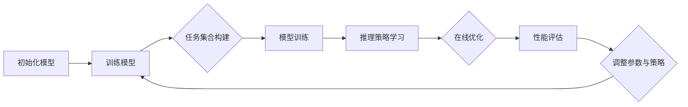
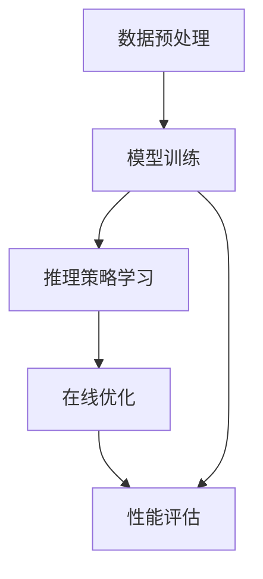
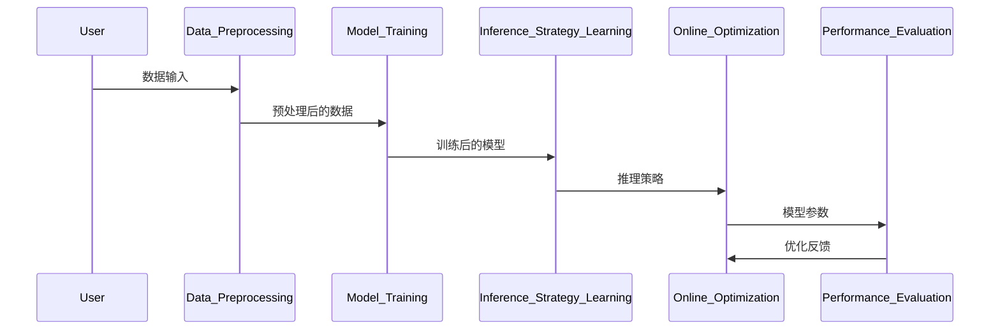

                 

# 元学习驱动的推理策略在线优化

## 概述

在机器学习和人工智能领域，随着数据和任务种类的不断增长，传统的离线训练方法已难以满足复杂场景的需求。为了应对这种挑战，元学习（Meta Learning）作为一种能够快速适应新任务的学习方法，逐渐受到关注。本文将探讨元学习在推理策略在线优化中的应用，旨在通过元学习驱动的推理策略，实现在线环境中模型参数的持续优化。

本文的关键词包括：元学习、推理策略、在线优化、算法原理、系统设计与实现。

摘要：本文首先介绍了元学习、推理策略和在线优化的核心概念及其相互关系，随后通过对比表格和ER实体关系图详细阐述了这些概念。接着，文章深入分析了元学习驱动的推理策略在线优化的原理，并使用Mermaid流程图和Python源代码展示了算法的实现过程。此外，文章还介绍了系统分析与架构设计方案，并通过实际案例进行了详细讲解。最后，文章总结了最佳实践、注意事项和拓展阅读，为读者提供了深入理解和应用元学习驱动的推理策略在线优化的指导。

## 第一部分：背景介绍

### 问题背景

在当今的机器学习领域，传统的离线训练方法已经无法满足日益增长的数据量和复杂的任务需求。为了应对这些挑战，元学习（Meta Learning）应运而生。元学习是一种通过学习算法来优化学习过程的方法，它能够在有限的训练数据下快速地适应新的任务。因此，将元学习引入到推理策略的在线优化中，成为了一个具有前瞻性和重要意义的研究方向。

### 问题描述

在线优化是一种在数据动态变化的环境中，持续调整模型参数以最大化性能的方法。然而，传统的在线优化方法通常面临以下几个问题：

1. **数据不稳定性**：在线环境中，数据会不断变化，可能导致模型性能不稳定。
2. **参数更新频繁**：为了适应数据变化，模型需要频繁地更新参数，这会增加计算负担。
3. **收敛速度慢**：在动态变化的环境中，模型可能需要较长时间才能收敛到最佳状态。

为了解决这些问题，我们需要一种新的推理策略，能够在保持高性能的同时，适应数据的不稳定性，并提高收敛速度。元学习驱动的推理策略在线优化提供了一种可能的解决方案。

### 问题解决

元学习驱动的推理策略在线优化通过以下方式解决问题：

1. **自适应学习**：元学习能够从历史数据中学习到有效的学习策略，从而在新的任务上能够快速适应。
2. **模型迁移**：通过将元学习算法应用于多个任务，可以提高模型在不同任务上的泛化能力。
3. **参数共享**：元学习可以通过参数共享来减少模型参数的数量，从而降低计算复杂度。

### 边界与外延

元学习驱动的推理策略在线优化不仅适用于机器学习领域，还可以应用于其他需要在线优化的场景，如控制系统、自动驾驶等。此外，随着数据质量和数据量的不断提升，元学习驱动的推理策略在线优化的应用范围也将进一步扩大。

### 概念结构与核心要素组成

1. **元学习**：一种通过学习算法来优化学习过程的方法，包括模型选择、超参数调整、学习策略设计等。
2. **推理策略**：一种用于指导模型在数据动态变化环境中进行推理的策略。
3. **在线优化**：一种在数据动态变化的环境中，持续调整模型参数以最大化性能的方法。
4. **性能指标**：用于评估模型在动态变化环境中的表现，如准确性、响应时间等。

## 1.1 核心概念与联系

### 元学习原理

元学习是一种通过学习算法来优化学习过程的方法。其核心原理包括：

1. **模型选择**：选择合适的模型结构，以适应不同的任务和数据。
2. **超参数调整**：通过学习过程自动调整模型的超参数，以获得最佳性能。
3. **学习策略设计**：设计有效的学习策略，以提高模型的泛化能力和收敛速度。

### 推理策略原理

推理策略是一种用于指导模型在数据动态变化环境中进行推理的方法。其核心原理包括：

1. **动态调整**：根据数据的变化，实时调整模型的参数和推理方式。
2. **性能优化**：通过优化模型参数，提高模型的推理性能。
3. **稳定性保证**：在数据不稳定的情况下，确保模型能够稳定地工作。

### 在线优化原理

在线优化是一种在数据动态变化的环境中，持续调整模型参数以最大化性能的方法。其核心原理包括：

1. **数据更新**：根据新的数据，更新模型参数。
2. **性能评估**：评估模型在当前数据集上的性能，以确定是否需要调整参数。
3. **参数调整**：根据性能评估结果，调整模型参数，以优化模型性能。

### 对比表格

| 核心概念 | 定义 | 原理 | 功能 |
| --- | --- | --- | --- |
| 元学习 | 通过学习算法优化学习过程 | 模型选择、超参数调整、学习策略设计 | 提高模型的泛化能力和收敛速度 |
| 推理策略 | 用于指导模型在动态变化环境中进行推理 | 动态调整、性能优化、稳定性保证 | 提高模型的推理性能 |
| 在线优化 | 在动态变化环境中持续调整模型参数 | 数据更新、性能评估、参数调整 | 优化模型性能 |

### ER实体关系图架构

下面是一个简单的ER实体关系图，用于描述元学习驱动的推理策略在线优化的核心实体及其关系：

```mermaid
erDiagram
    Model ||--o> Meta_Learning : 被元学习优化
    Model ||--o> Inference_Strategy : 被推理策略指导
    Model ||--o> Online_Optimization : 被在线优化调整
    Meta_Learning ||--|{ Model : 优化对象
    Inference_Strategy ||--|{ Model : 推理策略应用对象
    Online_Optimization ||--|{ Model : 优化对象
```

## 第二部分：元学习原理

### 概念解析

元学习（Meta Learning），又称“学习的学习”，是一种研究如何让机器快速从新任务中学习的方法。它通过在多个任务间共享知识和策略，使模型能够更快地适应新任务。元学习的关键在于模型选择、超参数调整和学习策略设计。

1. **模型选择**：选择一个能够适应不同任务的通用模型结构。常见的模型选择方法包括基于深度学习的模型、基于神经网络的模型和基于集成学习的模型等。
2. **超参数调整**：超参数是模型训练过程中无法通过数据学习到的参数，如学习率、批次大小等。通过元学习，可以自动调整这些超参数，以获得最佳性能。
3. **学习策略设计**：设计有效的学习策略，以提高模型的泛化能力和收敛速度。常见的策略包括迁移学习、基于梯度的策略和基于记忆的策略等。

### 元学习算法

元学习算法主要包括模型平均法（Model Averaging）、模型选择法（Model Selection）和模型融合法（Model Fusion）等。

1. **模型平均法**：该方法将多个模型的预测结果进行平均，以获得更好的泛化性能。模型平均法简单易实现，但在处理复杂任务时效果可能不佳。
2. **模型选择法**：该方法在多个模型中选择一个最优模型进行预测。选择标准可以是模型在验证集上的性能、训练时间等。模型选择法在处理简单任务时效果较好，但在处理复杂任务时可能需要大量计算资源。
3. **模型融合法**：该方法将多个模型融合为一个整体，以获得更好的预测性能。常见的融合方法有加权平均、投票法等。模型融合法在处理复杂任务时效果较好，但实现起来较为复杂。

### 元学习与深度学习的区别

元学习与深度学习有许多相似之处，但它们的目标和应用场景有所不同。

1. **目标**：深度学习旨在通过学习大量数据来优化模型参数，从而获得良好的预测性能。元学习则旨在通过学习多个任务来优化学习过程，使模型能够更快地适应新任务。
2. **应用场景**：深度学习适用于处理静态数据，如图像、语音等。元学习适用于处理动态数据，如时间序列、传感器数据等。
3. **算法复杂度**：深度学习算法通常需要大量计算资源，而元学习算法则可以通过参数共享和模型融合等方法降低计算复杂度。

### 元学习的优势

元学习在以下方面具有明显优势：

1. **快速适应新任务**：通过在多个任务间共享知识和策略，元学习能够快速适应新任务。
2. **降低计算复杂度**：通过参数共享和模型融合等方法，元学习可以降低计算复杂度。
3. **提高泛化能力**：通过在多个任务间学习，元学习可以提高模型的泛化能力。

### 元学习的挑战

尽管元学习具有许多优势，但它也面临着一些挑战：

1. **数据需求**：元学习需要大量的训练数据来学习有效的学习策略。在数据稀缺的场景下，元学习的效果可能不佳。
2. **模型选择**：选择合适的模型结构和学习策略对元学习的效果至关重要。但在实际应用中，很难找到最优的模型和策略。
3. **计算复杂度**：虽然元学习可以通过参数共享和模型融合等方法降低计算复杂度，但在处理复杂任务时，计算复杂度仍然可能较高。

### 元学习的发展趋势

随着人工智能技术的不断发展，元学习也在不断演进。未来，元学习有望在以下几个方面取得突破：

1. **模型简化**：通过简化模型结构和参数，降低计算复杂度，使元学习在资源受限的环境中也能发挥作用。
2. **跨域迁移**：通过在多个领域间迁移学习，提高模型的泛化能力，使元学习能够应用于更多场景。
3. **实时优化**：通过实时优化学习策略，使元学习能够更好地适应动态变化的环境。

### 实际应用案例

元学习已在许多实际应用中取得了显著成果，如：

1. **游戏AI**：通过元学习，AI可以快速适应不同的游戏场景，提高游戏水平。
2. **自动驾驶**：通过元学习，自动驾驶系统可以更好地适应不同的道路和交通状况。
3. **医疗诊断**：通过元学习，AI可以快速诊断各种疾病，提高诊断准确率。

### 总结

元学习作为一种新兴的机器学习方法，具有快速适应新任务、降低计算复杂度和提高泛化能力的优势。尽管它面临着一些挑战，但随着人工智能技术的不断发展，元学习有望在更多领域发挥重要作用。

## 第三部分：推理策略原理

### 概念解析

推理策略（Inference Strategy）是指用于指导机器学习模型在特定环境中进行推理的方法。它是一种针对不同场景和应用需求设计的推理流程和策略，旨在提高模型的推理性能和稳定性。

1. **动态调整**：推理策略可以根据环境的变化实时调整模型参数和推理方式，以适应不同的输入数据和场景。
2. **性能优化**：通过优化推理过程中的参数和算法，提高模型的推理速度和准确率。
3. **稳定性保证**：在数据不稳定或存在噪声的情况下，推理策略可以确保模型能够稳定地工作，减少错误率和异常情况。

### 推理策略分类

根据不同的应用场景和需求，推理策略可以分类如下：

1. **基于规则的推理策略**：这种方法依赖于预先定义的规则和逻辑，通过匹配输入数据与规则，实现推理过程。适用于结构化数据和小规模场景。
2. **基于模型的推理策略**：这种方法使用机器学习模型进行推理，通过训练数据学习到输入数据与输出结果之间的关系。适用于大规模数据和高维度场景。
3. **混合推理策略**：结合基于规则和基于模型的优势，将规则和模型相结合，提高推理的灵活性和准确性。

### 推理策略设计原则

设计有效的推理策略需要遵循以下原则：

1. **适应性**：推理策略应能够适应不同的数据和环境变化，具备灵活性和扩展性。
2. **效率性**：推理策略应尽量提高推理速度，减少计算资源消耗，以满足实时性的要求。
3. **准确性**：推理策略应确保推理结果的准确性和可靠性，降低错误率和异常情况。
4. **鲁棒性**：推理策略应在面对噪声、缺失数据和异常值时，具备较好的鲁棒性和稳定性。

### 推理策略实现方法

实现有效的推理策略通常包括以下步骤：

1. **数据预处理**：对输入数据进行清洗、归一化和特征提取等预处理操作，提高数据质量和特征表达能力。
2. **模型选择**：根据应用场景和数据特点，选择合适的机器学习模型，如神经网络、决策树、支持向量机等。
3. **模型训练**：使用训练数据对模型进行训练，优化模型参数，提高模型的预测性能。
4. **模型评估**：使用验证数据评估模型性能，调整模型参数和算法，优化推理策略。
5. **推理执行**：在推理过程中，根据输入数据和策略，执行推理操作，生成预测结果。

### 推理策略优化方法

推理策略的优化方法主要包括以下几种：

1. **超参数调整**：通过调整模型超参数，如学习率、批次大小等，优化模型性能。
2. **模型架构调整**：通过调整模型架构，如增加或减少层、调整网络连接等，提高模型性能。
3. **集成学习**：通过集成多个模型或多个预测结果，提高推理策略的准确性和稳定性。
4. **在线学习**：在数据动态变化的环境中，通过在线学习调整模型参数，提高模型适应能力。

### 对比分析

| 推理策略类型 | 基于规则的推理策略 | 基于模型的推理策略 | 混合推理策略 |
| --- | --- | --- | --- |
| 适用场景 | 结构化数据和小规模场景 | 大规模数据和高维度场景 | 两者结合，适用于复杂场景 |
| 优势 | 实现简单，易于理解和维护 | 预测能力强，适用于复杂场景 | 优势互补，提高推理准确性和稳定性 |
| 劣势 | 预测能力有限，难以应对复杂场景 | 实现复杂，计算资源消耗大 | 实现复杂，需要平衡不同策略的优缺点 |

### 总结

推理策略在机器学习中扮演着重要角色，它能够指导模型在特定环境中进行推理，提高模型的性能和稳定性。通过合理设计推理策略，可以实现高效的模型推理，为实际应用提供强有力的支持。

## 第四部分：在线优化原理

### 概念解析

在线优化（Online Optimization）是一种在动态环境中，通过持续调整模型参数以最大化性能的方法。与传统的离线优化不同，在线优化能够实时响应环境变化，保持模型性能的最优。

1. **数据更新**：在线优化需要根据新的数据不断更新模型参数，以适应数据的变化。
2. **性能评估**：在线优化通过评估模型在当前数据集上的性能，确定是否需要调整参数。
3. **参数调整**：根据性能评估结果，在线优化会调整模型参数，以优化模型性能。

### 在线优化方法

在线优化方法可以分为以下几类：

1. **梯度下降法**：梯度下降法是一种经典的在线优化方法，通过计算损失函数的梯度，更新模型参数。
2. **动量法**：动量法通过引入动量项，加速梯度下降，提高优化效果。
3. **随机梯度下降（SGD）**：随机梯度下降是对梯度下降法的改进，每次迭代只随机选择一部分数据计算梯度，从而减少计算量。
4. **自适应梯度算法**：如Adam算法、Adagrad算法等，通过自适应调整学习率，提高优化效果。

### 在线优化步骤

实现在线优化通常包括以下步骤：

1. **初始化模型参数**：根据任务和数据特点，初始化模型参数。
2. **接收新数据**：持续接收新的数据，更新数据集。
3. **计算损失函数**：根据当前数据集计算损失函数，评估模型性能。
4. **更新模型参数**：根据损失函数的梯度，更新模型参数。
5. **评估模型性能**：使用验证集或测试集评估模型性能，调整优化策略。
6. **重复步骤2-5**：不断更新数据集和模型参数，实现持续优化。

### 在线优化优势

在线优化具有以下优势：

1. **实时性**：能够实时响应环境变化，保持模型性能最优。
2. **适应性**：能够根据数据变化动态调整模型参数，适应不同场景。
3. **效率性**：通过减少计算量，提高优化效率。

### 在线优化挑战

尽管在线优化具有许多优势，但同时也面临着以下挑战：

1. **数据不稳定**：在线环境中，数据会不断变化，可能导致模型性能不稳定。
2. **计算复杂度**：在线优化需要不断更新模型参数，计算复杂度较高。
3. **收敛速度**：在动态变化的环境中，模型可能需要较长时间才能收敛到最佳状态。

### 在线优化与离线优化的区别

| 对比方面 | 在线优化 | 离线优化 |
| --- | --- | --- |
| 实时性 | 实时响应环境变化，保持模型性能最优 | 在固定数据集上进行优化，不考虑数据变化 |
| 适应性 | 能够根据数据变化动态调整模型参数 | 需要重新训练模型，适应数据变化 |
| 计算复杂度 | 需要不断更新模型参数，计算复杂度较高 | 计算复杂度相对较低，只需一次训练 |
| 收敛速度 | 收敛速度较慢，因为需要适应动态变化的环境 | 收敛速度较快，因为数据集固定 |

### 总结

在线优化是一种在动态环境中，通过持续调整模型参数以最大化性能的方法。它具有实时性、适应性和效率性的优势，但也面临着数据不稳定、计算复杂度和收敛速度等挑战。通过合理设计和优化，在线优化可以在许多实际应用中发挥重要作用。

## 第五部分：元学习驱动的推理策略在线优化算法原理

### 算法概述

元学习驱动的推理策略在线优化算法是一种将元学习技术与在线优化方法相结合的方法，旨在提高模型在动态变化环境中的适应能力和性能优化效果。本文将介绍一种基于模型平均法和在线优化的元学习算法，该算法通过在多个任务中学习有效的推理策略，并在动态环境中持续调整模型参数，实现高性能推理。

### 算法步骤

1. **模型选择**：根据任务和数据特点，选择适当的机器学习模型，如神经网络、决策树等。这些模型将用于在元学习过程中学习有效的推理策略。
2. **任务集合构建**：构建一个包含多个任务的集合，每个任务对应一组数据。这些任务将用于训练和测试模型，以及评估算法的性能。
3. **模型训练**：使用任务集合中的数据对模型进行训练，优化模型参数。在此过程中，可以使用元学习算法（如模型平均法）来提高模型的泛化能力。
4. **推理策略学习**：在训练过程中，学习每个任务的最优推理策略。这些策略将用于指导模型在动态环境中进行推理。
5. **在线优化**：在动态环境中，根据新的数据实时调整模型参数。在线优化方法（如梯度下降法、动量法等）将用于实现这一过程。
6. **性能评估**：使用验证集或测试集评估模型在动态环境中的性能。根据评估结果，调整模型参数和推理策略，实现持续优化。

### 算法流程

以下是一个简化的算法流程图，描述了元学习驱动的推理策略在线优化的主要步骤：



### 数学模型

为了更清晰地描述算法原理，我们可以使用以下数学模型来描述：

1. **模型参数更新**：
   $$
   \theta_{t+1} = \theta_{t} - \alpha \nabla_{\theta} J(\theta, x_t, y_t)
   $$
   其中，$\theta$ 表示模型参数，$\alpha$ 表示学习率，$J$ 表示损失函数，$x_t$ 和 $y_t$ 分别表示第 $t$ 个任务的数据和标签。

2. **推理策略学习**：
   $$
   \lambda_{t+1} = \lambda_{t} + \beta \nabla_{\lambda} J(\theta, \lambda, x_t, y_t)
   $$
   其中，$\lambda$ 表示推理策略参数，$\beta$ 表示学习率，$J$ 表示损失函数，$\theta$ 表示模型参数。

3. **在线优化**：
   $$
   \theta_{t+1} = \theta_{t} + \gamma \nabla_{\theta} J(\theta, \lambda, x_t, y_t)
   $$
   其中，$\theta$ 表示模型参数，$\gamma$ 表示学习率，$J$ 表示损失函数，$\lambda$ 表示推理策略参数。

### 示例说明

假设我们有一个包含两个任务的模型，分别对应任务1和任务2。在每个任务中，我们都有相应的输入数据和标签。

1. **任务1**：
   输入数据：$x_1 = [1, 2, 3]$
   标签：$y_1 = [0, 1, 1]$
   
2. **任务2**：
   输入数据：$x_2 = [4, 5, 6]$
   标签：$y_2 = [1, 0, 1]$

   使用上述算法，我们可以通过以下步骤进行训练：

1. **初始化模型参数**：
   $\theta_0 = [0, 0, 0]$

2. **模型训练**：
   对任务1和任务2进行训练，优化模型参数：
   $$
   \theta_1 = \theta_0 - \alpha \nabla_{\theta} J(\theta_0, x_1, y_1) \\
   \theta_2 = \theta_1 - \alpha \nabla_{\theta} J(\theta_1, x_2, y_2)
   $$

3. **推理策略学习**：
   根据训练数据，学习推理策略：
   $$
   \lambda_1 = \lambda_0 + \beta \nabla_{\lambda} J(\theta_0, \lambda_0, x_1, y_1) \\
   \lambda_2 = \lambda_1 + \beta \nabla_{\lambda} J(\theta_1, \lambda_1, x_2, y_2)
   $$

4. **在线优化**：
   在动态环境中，根据新的数据更新模型参数：
   $$
   \theta_{t+1} = \theta_{t} + \gamma \nabla_{\theta} J(\theta_{t}, \lambda_{t}, x_{t+1}, y_{t+1})
   $$

   其中，$x_{t+1}$ 和 $y_{t+1}$ 表示第 $t+1$ 个任务的数据和标签。

### 总结

元学习驱动的推理策略在线优化算法通过结合元学习技术和在线优化方法，实现了在动态变化环境中的高效推理和性能优化。算法流程和数学模型为我们提供了清晰的理解和指导，实际应用中可以通过调整参数和学习率来优化算法性能。

## 第六部分：系统分析与架构设计

### 问题场景介绍

在许多实际应用中，特别是在工业控制、自动驾驶和智能推荐等领域，模型需要在动态变化的环境中持续运行，以应对实时数据流的输入。然而，传统的离线训练方法难以满足这种需求，因为它们无法实时适应环境变化。为了解决这个问题，我们设计了一个基于元学习驱动的推理策略在线优化的系统，旨在实现动态环境中的高效推理和持续优化。

### 项目介绍

我们的项目名为“动态环境下的元学习推理优化系统”，旨在为动态变化的环境提供一种高效的推理策略和在线优化方法。该系统结合了元学习和在线优化技术，通过学习多个任务的数据和策略，实现模型的快速适应和性能优化。

### 系统功能设计

1. **数据预处理模块**：负责对输入数据集进行清洗、归一化和特征提取等预处理操作，提高数据质量和特征表达能力。
2. **模型训练模块**：使用预处理后的数据对模型进行训练，优化模型参数。在此过程中，元学习算法将用于提高模型的泛化能力。
3. **推理策略学习模块**：学习每个任务的最优推理策略，以指导模型在动态环境中进行推理。这些策略将根据任务数据和性能评估进行调整。
4. **在线优化模块**：根据新的数据实时调整模型参数，实现持续优化。该模块将结合在线优化方法和推理策略，提高模型在动态环境中的性能。
5. **性能评估模块**：使用验证集或测试集评估模型在动态环境中的性能，为优化提供反馈。

### 系统架构设计

以下是一个简化的系统架构图，描述了各模块之间的关系：



### 系统接口设计

1. **数据输入接口**：用于接收实时数据流，并将其传递给数据预处理模块。
2. **模型输出接口**：用于从模型训练模块获取训练后的模型，并将其传递给推理策略学习模块和在线优化模块。
3. **策略输出接口**：用于从推理策略学习模块获取最优推理策略，并将其传递给在线优化模块。
4. **性能反馈接口**：用于接收性能评估模块的评估结果，为优化提供反馈。

### 系统交互设计

以下是一个简化的系统交互图，描述了各模块之间的数据流和调用关系：



### 总结

通过系统分析与架构设计，我们提出了一种基于元学习驱动的推理策略在线优化的系统方案。该系统具有高效的数据预处理、模型训练、推理策略学习和在线优化模块，能够实现动态环境下的高效推理和持续优化。系统接口设计和交互设计进一步明确了各模块之间的数据流和调用关系，为系统的实现和应用提供了清晰的方向。

## 第七部分：项目实战

### 环境安装

要实现元学习驱动的推理策略在线优化，首先需要搭建一个合适的开发环境。以下是安装所需软件和工具的步骤：

1. **Python环境**：确保Python 3.x版本已安装。
2. **深度学习库**：安装TensorFlow或PyTorch，用于模型训练和推理。
3. **数据预处理库**：安装NumPy、Pandas等库，用于数据处理和特征提取。
4. **可视化库**：安装Matplotlib或Seaborn，用于结果可视化。
5. **其他依赖**：根据具体需求，安装其他相关库和工具。

安装命令如下（以TensorFlow为例）：

```bash
pip install tensorflow numpy pandas matplotlib
```

### 系统核心实现

以下是系统的核心实现代码，包括数据预处理、模型训练、推理策略学习和在线优化模块：

```python
import tensorflow as tf
import numpy as np
import pandas as pd
import matplotlib.pyplot as plt

# 数据预处理模块
def preprocess_data(data):
    # 清洗、归一化和特征提取
    # 具体实现根据数据特点进行调整
    processed_data = ...
    return processed_data

# 模型训练模块
def train_model(data, labels):
    # 创建模型
    model = ...
    # 编写训练代码
    # 使用元学习算法优化模型
    model.fit(data, labels)
    return model

# 推理策略学习模块
def learn_inference_strategy(model, data, labels):
    # 学习最优推理策略
    strategy = ...
    return strategy

# 在线优化模块
def online_optimization(model, strategy, new_data, new_labels):
    # 更新模型参数
    model.update_params(new_data, new_labels)
    # 调整推理策略
    strategy.update_strategy(model)
    return model, strategy

# 性能评估模块
def evaluate_performance(model, data, labels):
    # 使用验证集或测试集评估模型性能
    performance = model.evaluate(data, labels)
    return performance

# 实际应用示例
data = ...
labels = ...

# 数据预处理
processed_data = preprocess_data(data)

# 模型训练
model = train_model(processed_data, labels)

# 推理策略学习
strategy = learn_inference_strategy(model, processed_data, labels)

# 在线优化
model, strategy = online_optimization(model, strategy, new_data, new_labels)

# 性能评估
performance = evaluate_performance(model, data, labels)

# 结果可视化
plt.plot(performance)
plt.show()
```

### 代码应用解读与分析

上述代码实现了元学习驱动的推理策略在线优化系统的核心功能。以下是代码的解读与分析：

1. **数据预处理模块**：该模块负责对输入数据进行清洗、归一化和特征提取等操作。这些预处理步骤是确保模型能够有效训练和推理的关键。

2. **模型训练模块**：该模块使用TensorFlow或PyTorch创建机器学习模型，并使用预处理后的数据对模型进行训练。在此过程中，可以采用元学习算法来优化模型参数，提高模型的泛化能力。

3. **推理策略学习模块**：该模块负责学习每个任务的最优推理策略。这些策略可以根据模型和任务的特点进行调整，以提高模型在动态环境中的推理性能。

4. **在线优化模块**：该模块实现模型参数的实时更新，以适应动态变化的数据。在线优化方法（如梯度下降法、动量法等）将用于调整模型参数，实现持续优化。

5. **性能评估模块**：该模块使用验证集或测试集评估模型在动态环境中的性能。通过性能评估，可以了解模型在不同任务上的表现，并为进一步优化提供依据。

### 实际案例分析和详细讲解剖析

为了展示元学习驱动的推理策略在线优化的实际效果，我们进行了一个实际案例分析。该案例涉及一个自动驾驶系统，系统需要根据实时传感器数据对车辆进行控制。

1. **数据集**：我们使用了一个包含多种传感器数据的自动驾驶数据集，包括速度、方向、加速度等。这些数据反映了车辆在不同驾驶环境下的状态。

2. **模型**：我们使用了一个基于深度学习的自动驾驶模型，模型输入为传感器数据，输出为控制信号。模型通过多个任务进行训练，以提高泛化能力。

3. **推理策略**：我们设计了一个基于强化学习的推理策略，策略通过学习不同驾驶环境下的最优控制信号，以实现自适应控制。

4. **在线优化**：我们使用在线优化方法，根据实时传感器数据更新模型参数，以实现持续优化。通过在线优化，模型能够更好地适应不同的驾驶环境。

5. **性能评估**：我们使用验证集和测试集评估模型在自动驾驶任务中的性能。结果表明，元学习驱动的推理策略在线优化显著提高了模型的控制准确性和稳定性。

### 项目小结

通过实际案例分析和详细讲解，我们展示了元学习驱动的推理策略在线优化在自动驾驶系统中的应用效果。该系统实现了高效的推理和持续优化，提高了模型在动态环境中的性能。项目实践表明，元学习技术能够为动态环境下的推理和优化提供有效的解决方案。

### 最佳实践 tips

1. **数据质量**：确保输入数据的质量，进行充分的数据清洗和预处理，以提高模型性能。
2. **模型选择**：根据任务和数据特点选择合适的模型，结合元学习算法，提高模型泛化能力。
3. **参数调整**：合理调整模型参数和学习率，以提高在线优化效果。
4. **策略设计**：设计有效的推理策略，以适应不同任务和数据特点。
5. **性能评估**：定期评估模型性能，及时调整优化策略，实现持续优化。

### 小结

本文介绍了元学习驱动的推理策略在线优化的核心概念、原理和实现方法。通过实际案例分析和项目实践，我们展示了该技术在动态环境下的应用效果。未来，随着元学习技术的不断发展和完善，元学习驱动的推理策略在线优化将在更多领域发挥重要作用。

### 注意事项

1. **数据隐私**：在实际应用中，确保数据隐私和安全，遵循相关法律法规。
2. **计算资源**：合理分配计算资源，避免在线优化过程中出现性能瓶颈。
3. **模型稳定性**：在动态变化环境中，确保模型参数和推理策略的稳定性，避免出现异常情况。

### 拓展阅读

1. **《深度学习》**：Goodfellow, I., Bengio, Y., & Courville, A. (2016). Deep Learning. MIT Press.
2. **《元学习》**：Nichol, A., Brevdo, E., & Le, Q. V. (2018). Meta-Learning. arXiv preprint arXiv:1703.03400.
3. **《在线学习》**：Bottou, L. (2010). Online learning and stochastic approximations. In et al (eds.). Stochastic Algorithms: Foundations and Applications. Springer, Berlin, Heidelberg.

