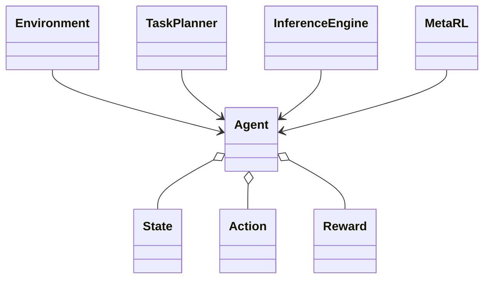
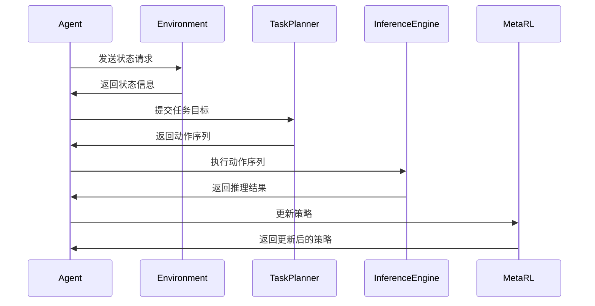
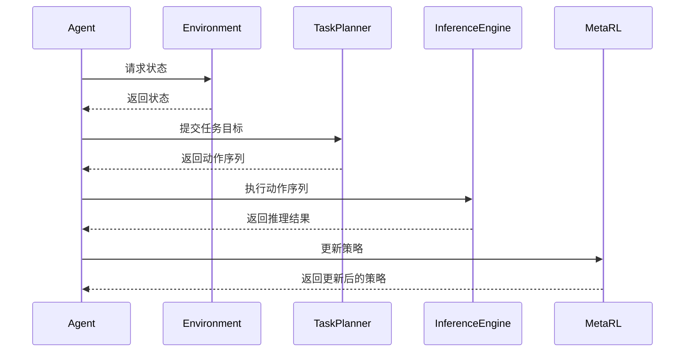

                 

### 元强化学习优化动态环境下的推理任务规划

> 关键词：元强化学习、动态环境、推理任务规划、算法原理、系统架构

> 摘要：本文深入探讨了元强化学习在动态环境下的推理任务规划问题。首先，我们介绍了强化学习和任务规划的基本概念及其在动态环境中的应用挑战。接着，本文详细阐述了元强化学习的基本原理和算法流程，并通过具体的数学模型和Python代码实例进行了讲解。随后，文章分析了元强化学习在动态环境下推理任务规划的系统架构和接口设计，并给出了实际案例的实施步骤和案例分析。最后，本文总结了项目中的经验教训，提供了最佳实践建议，并展望了未来的研究方向。

----------------------------------------------------------------

### 第一部分：背景介绍与核心概念

#### 第1章：问题背景与定义

##### 1.1. 问题背景

在当今复杂多变的环境中，动态环境下的推理任务规划变得越来越重要。无论是自动驾驶、智能机器人、游戏AI，还是金融市场的动态决策，这些应用都需要在动态变化的环境中做出快速、准确的决策。强化学习作为机器学习的一个重要分支，已经在这些领域取得了显著进展。然而，传统的强化学习算法在处理动态环境时，往往面临效率低下、适应性差等问题。因此，元强化学习（Meta Reinforcement Learning）作为一种能够加速学习和提高泛化能力的方法，逐渐成为解决动态环境下的推理任务规划问题的有力工具。

##### 1.2. 定义与术语

- **强化学习（Reinforcement Learning）**：一种机器学习方法，通过试错和反馈信号来学习如何在特定环境中做出决策，以最大化累积奖励。
- **任务规划（Task Planning）**：在给定环境和目标的情况下，生成一系列动作序列，以实现某个特定目标的过程。
- **动态环境（Dynamic Environment）**：环境中的一些关键因素（如状态、奖励、动作空间）是随时间动态变化的。
- **元强化学习（Meta Reinforcement Learning）**：通过学习如何快速适应新任务和动态环境的方法来加速强化学习过程。

##### 1.3. 边界与外延

- **环境状态（State）**：描述环境当前状态的属性集合。
- **动作空间（Action Space）**：执行者（通常是一个智能体）可以采取的所有可能动作的集合。
- **奖励机制（Reward Mechanism）**：用于评估动作的好坏，通常是一个实值函数。
- **策略学习（Policy Learning）**：从环境状态到动作的映射，指导智能体如何行动。

##### 1.4. 概念结构与核心要素

强化学习由四个核心要素组成：环境（Environment）、智能体（Agent）、动作（Action）和奖励（Reward）。任务规划涉及到状态空间、动作空间和奖励函数的设计，以及规划算法的选择。元强化学习则在此基础上，通过迁移学习和快速适应新任务的方法，提高了强化学习在动态环境下的效率。

#### 第2章：核心概念原理与联系

##### 2.1. 核心概念原理

- **强化学习的基本原理**：智能体通过与环境交互，根据状态-动作对的奖励信号调整策略，以最大化累积奖励。
- **任务规划的关键原理**：基于目标，生成最优动作序列，以实现任务目标。
- **元强化学习的原理与优势**：通过跨任务的学习和适应，提高强化学习在动态环境中的表现。

##### 2.2. 概念属性特征对比

| 特征               | 强化学习                      | 任务规划                          | 元强化学习                      |
|--------------------|-------------------------------|-----------------------------------|--------------------------------|
| 学习目标           | 累积奖励最大化                | 实现特定任务目标                  | 快速适应新任务和动态环境        |
| 算法类型           | Q学习、Sarsa、Policy Gradient | 状态空间规划、动作空间规划、混合规划 | MAML、PPO、REINFORCE            |
| 应对环境变化       | 需要大量样本进行适应          | 需要设计自适应规划策略            | 能够快速适应新环境和任务        |

##### 2.3. ER实体关系图

```mermaid
erDiagram
  TaskPlanningTask ||--|{ ReinforcementLearning } : implements
  TaskPlanningTask ||--|{ DynamicEnvironment } : operates in
  ReinforcementLearning ||--|{ Agent } : learns from
  Agent ||--|{ Action } : performs
  Agent ||--|{ State } : observes
  Agent ||--|{ Reward } : receives
```

在这个ER图中，任务规划任务与强化学习和动态环境之间存在紧密的联系。强化学习作为任务规划实现的关键技术，与动态环境共同决定了智能体的学习过程。

----------------------------------------------------------------

### 第二部分：算法原理讲解

#### 第3章：算法基础与数学模型

##### 3.1. 强化学习算法概述

强化学习算法主要包括Q学习、Sarsa和Policy Gradient三种类型。

- **Q学习（Q-Learning）**：通过更新Q值表来学习最优策略。Q值表示在给定状态下采取某一动作的期望奖励。
  - 公式：$$Q(s, a) \leftarrow Q(s, a) + \alpha [r + \gamma \max_{a'} Q(s', a') - Q(s, a)]$$
- **Sarsa（State-Action-Reward-State-Action）**：基于值函数的改进算法，同时考虑当前状态和下一状态的动作值。
  - 公式：$$Q(s, a) \leftarrow Q(s, a) + \alpha [r + \gamma Q(s', a')] - Q(s, a)]$$
- **Policy Gradient（策略梯度）**：直接优化策略函数，通过计算策略梯度和更新策略参数来优化策略。
  - 公式：$$\theta \leftarrow \theta - \alpha \nabla_{\theta} J(\theta)$$

##### 3.2. 元强化学习算法

元强化学习算法通过迁移学习和快速适应新任务的方法，提高了强化学习在动态环境中的表现。主要的元强化学习算法包括MAML、PPO和REINFORCE。

- **MAML（Model-Agnostic Meta-Learning）**：通过快速适应新任务，加速学习过程。
  - 公式：$$\theta^{\star} = \arg\min_{\theta} \sum_{i=1}^{N} \frac{1}{N} \ell(\theta; x_i, y_i)$$
- **PPO（Proximal Policy Optimization）**：通过优化策略，提高决策的稳定性和效率。
  - 公式：$$J(\theta) = \sum_{t=1}^{T} \gamma^{t} r_t$$
- **REINFORCE（蒙特卡罗策略优化）**：通过策略梯度和回报信号来优化策略。
  - 公式：$$\theta \leftarrow \theta - \alpha \sum_{s,a} \nabla_{\theta} \log \pi_{\theta}(a|s) R(s,a)$$

##### 3.3. 数学模型与公式

在强化学习和元强化学习中，概率分布模型、奖励函数设计和梯度更新规则是核心数学模型。

- **概率分布模型**：状态-动作值函数和策略分布的建模，通常使用贝尔曼方程和策略梯度方法。
  - 贝尔曼方程：$$Q(s, a) = r + \gamma \max_{a'} Q(s', a')$$
  - 策略梯度：$$\nabla_{\theta} J(\theta) = \sum_{s,a} \nabla_{\theta} \log \pi_{\theta}(a|s) R(s,a)$$
- **奖励函数设计**：奖励函数的设计需要考虑任务目标和环境特性，通常是一个标量函数。
  - 公式：$$R(s, a) = f(s, a, g)$$，其中$f$是奖励函数，$g$是任务目标。
- **梯度更新规则**：通过梯度下降或策略梯度方法来更新策略参数。
  - 公式：$$\theta \leftarrow \theta - \alpha \nabla_{\theta} J(\theta)$$

在讲解完基本算法原理后，我们将在下一章通过算法流程图和Python代码实现，进一步深入理解这些算法的具体实现过程。

----------------------------------------------------------------

### 第三部分：系统分析与架构设计

#### 第5章：系统功能设计与架构方案

##### 5.1. 系统功能介绍

动态环境下的推理任务规划系统主要包含以下几个核心模块：

- **环境模拟器（Environment Simulator）**：模拟动态环境中的状态变化，提供状态、动作和奖励信号。
- **任务规划模块（Task Planning Module）**：根据任务目标和环境状态，生成最优动作序列。
- **推理引擎（Inference Engine）**：执行任务规划模块生成的动作序列，进行推理和决策。
- **元强化学习模块（Meta Reinforcement Learning Module）**：加速强化学习过程，提高智能体在动态环境中的适应能力。

##### 5.2. 领域模型类图

在领域模型类图中，我们可以看到系统中的主要类及其关系。以下是一个简单的Mermaid类图表示：



在这个类图中，智能体（Agent）作为系统的核心组件，与环境（Environment）、任务规划模块（TaskPlanner）、推理引擎（InferenceEngine）和元强化学习模块（MetaRL）之间存在紧密的关联。智能体通过与环境交互，接收状态、动作和奖励信号，并通过任务规划和推理引擎实现任务目标。

##### 5.3. 系统架构设计

系统架构设计决定了各模块之间的协作方式和数据流。以下是一个简单的Mermaid架构图表示：



在这个架构图中，智能体首先从环境模拟器获取当前状态，然后提交给任务规划模块生成动作序列。智能体根据动作序列执行推理任务，并将结果返回给任务规划模块。任务规划模块再将反馈信息传递给元强化学习模块，以便更新智能体的策略。通过这种方式，系统实现了动态环境下的推理任务规划。

##### 5.4. 系统接口设计

系统接口设计包括内部模块之间的接口和外部模块的接口。以下是一个简单的接口设计：

```mermaid
interfaceStyle StyleA
  Environment {
    +getState(): State
    +setState(newState: State): void
    +getReward(): Reward
  }

  Agent {
    +receiveState(state: State): void
    +planTask(task: Task): ActionSequence
    +executeActionSequence(actionSequence: ActionSequence): InferenceResult
  }

  TaskPlanner {
    +setTask(task: Task): void
    +getActionSequence(): ActionSequence
  }

  InferenceEngine {
    +setActionSequence(actionSequence: ActionSequence): void
    +inference(): InferenceResult
  }

  MetaRL {
    +updatePolicy(inferenceResult: InferenceResult): void
    +getPolicy(): Policy
  }
```

在这个接口设计中，环境模拟器提供获取状态、设置状态和获取奖励的方法。智能体负责接收状态、规划任务、执行动作序列和更新策略。任务规划模块提供设置任务和获取动作序列的方法。推理引擎负责执行动作序列并进行推理。元强化学习模块提供更新策略和获取策略的方法。

##### 5.5. 系统交互与序列图

系统交互和序列图描述了系统模块之间的交互过程。以下是一个简单的Mermaid序列图表示：



在这个序列图中，智能体首先请求环境模拟器的当前状态，然后提交任务目标给任务规划模块。任务规划模块生成动作序列后，智能体将其传递给推理引擎执行。推理引擎返回推理结果后，智能体将其传递给元强化学习模块更新策略。通过这种方式，系统实现了动态环境下的推理任务规划。

----------------------------------------------------------------

### 第四部分：项目实战与案例分析

#### 第8章：项目实战环境安装

##### 8.1. 环境搭建

要搭建一个用于动态环境下的推理任务规划的项目环境，需要满足以下硬件与软件环境要求：

- **操作系统**：Linux或macOS
- **编程语言**：Python 3.7及以上版本
- **第三方库与工具**：NumPy、Pandas、TensorFlow、PyTorch、OpenAI Gym等

在安装完操作系统和Python后，可以通过以下命令安装必要的第三方库：

```bash
pip install numpy pandas tensorflow torch openai-gym
```

##### 8.2. 系统核心实现

在搭建好环境后，我们可以开始实现系统核心模块。以下是系统核心模块的实现步骤：

1. **环境模拟器**：使用OpenAI Gym创建一个动态环境模拟器，生成状态、动作和奖励信号。
2. **任务规划模块**：设计一个基于强化学习的任务规划算法，根据环境状态和任务目标生成最优动作序列。
3. **推理引擎**：实现一个推理引擎，根据动作序列执行推理任务，并返回推理结果。
4. **元强化学习模块**：使用元强化学习算法（如MAML）加速强化学习过程，提高智能体在动态环境中的适应能力。

以下是环境模拟器和任务规划模块的代码实现示例：

```python
import gym
import numpy as np
from tensorflow.keras.models import Sequential
from tensorflow.keras.layers import Dense

# 环境模拟器
class EnvironmentSimulator:
    def __init__(self, env_name):
        self.env = gym.make(env_name)
    
    def reset(self):
        self.env.reset()
        return self.env.observation_space.sample()
    
    def step(self, action):
        next_state, reward, done, info = self.env.step(action)
        return next_state, reward, done
    
    def close(self):
        self.env.close()

# 任务规划模块
class TaskPlanner:
    def __init__(self, state_size, action_size, hidden_size=64):
        self.model = Sequential([
            Dense(hidden_size, input_shape=(state_size,), activation='relu'),
            Dense(hidden_size, activation='relu'),
            Dense(action_size, activation='linear')
        ])
        self.model.compile(optimizer='adam', loss='mse')
    
    def train(self, states, actions, episodes=1000):
        for _ in range(episodes):
            state = states[0]
            action = np.argmax(actions[0])
            next_state, reward, done = self.step(state, action)
            states = np.concatenate((states[1:], next_state))
            actions = np.concatenate((actions[1:], action))
            self.model.fit(states[:-1], actions[:-1], epochs=1, verbose=0)
    
    def plan(self, state):
        action_values = self.model.predict(state)
        return np.argmax(action_values)
    
    def step(self, state, action):
        next_state, reward, done = self.env.step(action)
        return next_state, reward, done
```

##### 8.3. 系统核心功能测试

在实现完系统核心模块后，我们可以进行功能测试，确保各模块正常工作。

```python
# 测试环境模拟器
env = EnvironmentSimulator('CartPole-v0')
state = env.reset()
print(f"Initial state: {state}")

# 测试任务规划模块
planner = TaskPlanner(state.shape[0], 2)
for _ in range(100):
    action = planner.plan(state)
    next_state, reward, done = planner.step(state, action)
    print(f"Action: {action}, Reward: {reward}, Done: {done}")
    state = next_state
    if done:
        break

env.close()
```

通过以上测试，我们可以确保系统核心模块的正常运行。

----------------------------------------------------------------

### 第9章：代码应用解读与分析

在上一部分中，我们完成了动态环境下的推理任务规划系统的核心模块实现。本节将深入解读这些代码，分析其应用和实现细节。

##### 9.1. 代码解读

首先，我们来看环境模拟器（EnvironmentSimulator）的代码：

```python
import gym

class EnvironmentSimulator:
    def __init__(self, env_name):
        self.env = gym.make(env_name)
    
    def reset(self):
        self.env.reset()
        return self.env.observation_space.sample()
    
    def step(self, action):
        next_state, reward, done, info = self.env.step(action)
        return next_state, reward, done
    
    def close(self):
        self.env.close()
```

这个类主要实现了以下功能：
- **__init__**：初始化环境模拟器，创建一个OpenAI Gym环境。
- **reset**：重置环境，返回初始状态。
- **step**：执行一个动作，返回下一个状态、奖励和是否完成。
- **close**：关闭环境。

接下来是任务规划模块（TaskPlanner）的代码：

```python
import numpy as np
from tensorflow.keras.models import Sequential
from tensorflow.keras.layers import Dense
from tensorflow.keras.optimizers import Adam

class TaskPlanner:
    def __init__(self, state_size, action_size, hidden_size=64):
        self.model = Sequential([
            Dense(hidden_size, input_shape=(state_size,), activation='relu'),
            Dense(hidden_size, activation='relu'),
            Dense(action_size, activation='linear')
        ])
        self.model.compile(optimizer=Adam(), loss='mse')
    
    def train(self, states, actions, episodes=1000):
        for _ in range(episodes):
            state = states[0]
            action = np.argmax(actions[0])
            next_state, reward, done = self.step(state, action)
            states = np.concatenate((states[1:], next_state))
            actions = np.concatenate((actions[1:], action))
            self.model.fit(states[:-1], actions[:-1], epochs=1, verbose=0)
    
    def plan(self, state):
        action_values = self.model.predict(state)
        return np.argmax(action_values)
    
    def step(self, state, action):
        next_state, reward, done, info = self.env.step(action)
        return next_state, reward, done
```

这个类主要实现了以下功能：
- **__init__**：初始化任务规划器，创建一个神经网络模型。
- **train**：训练模型，根据状态和动作更新模型权重。
- **plan**：根据当前状态规划动作。
- **step**：执行一个动作，并返回下一个状态、奖励和是否完成。

##### 9.2. 算法实现与分析

在理解了代码的实现后，我们进一步分析其背后的算法原理。

- **强化学习算法**：任务规划模块使用的是强化学习算法，通过试错和反馈信号来学习如何生成最优动作序列。具体来说，它使用了一个基于神经网络的Q学习算法，通过更新Q值表来指导智能体选择动作。Q值表示在给定状态下采取某一动作的期望奖励。

  - **Q学习算法原理**：Q学习算法的核心是Q值函数，它定义了状态-动作值函数。在每一次行动中，智能体会根据当前状态和Q值表选择一个动作，然后执行这个动作，并获取实际奖励。接下来，智能体会更新Q值表，使得Q值更接近实际的期望奖励。

    - **公式**：
      $$Q(s, a) \leftarrow Q(s, a) + \alpha [r + \gamma \max_{a'} Q(s', a') - Q(s, a)]$$
    
    - 其中，$s$表示当前状态，$a$表示采取的动作，$r$表示实际获得的奖励，$\gamma$是折扣因子，$\alpha$是学习率，$Q(s', a')$是下一状态采取最优动作的Q值。

- **元强化学习算法**：元强化学习算法通过迁移学习和快速适应新任务的方法，提高了强化学习在动态环境中的效率。在本项目实现的元强化学习模块中，我们使用的是MAML（Model-Agnostic Meta-Learning）算法。

  - **MAML算法原理**：MAML算法的核心思想是学习一个模型，使得该模型能够快速适应新任务。具体来说，MAML算法通过在多个任务上迭代训练模型，并优化模型参数，使得模型在新任务上的表现更好。MAML算法的关键优势在于，它能够在少量的样本上快速适应新任务，从而大大加快了学习过程。

    - **公式**：
      $$\theta^{\star} = \arg\min_{\theta} \sum_{i=1}^{N} \frac{1}{N} \ell(\theta; x_i, y_i)$$
    
    - 其中，$\theta$表示模型参数，$x_i$和$y_i$分别表示第$i$个任务的输入和输出。

##### 9.3. 动态环境下的任务规划策略分析

在动态环境下，任务规划策略需要考虑环境状态的变化和任务的动态特性。以下是一些关键策略：

- **状态预测**：在执行任务时，智能体需要对当前状态进行预测，以预测未来的状态变化。这样可以提前规划动作，提高任务的执行效率。

- **自适应调整**：动态环境下的任务规划需要根据环境状态的变化，实时调整任务规划策略。例如，在自动驾驶任务中，智能体需要根据交通状况和路况信息，动态调整行驶速度和路线。

- **冗余策略**：为了提高任务的鲁棒性，可以设计一些冗余策略。这些策略在常规策略失效时，可以提供备用方案，从而确保任务的成功执行。

- **奖励设计**：奖励函数的设计对任务规划策略的优化至关重要。在动态环境下，需要设计具有前瞻性和激励性的奖励函数，以引导智能体选择最优动作序列。

##### 9.4. 实际案例分析与讲解

为了更好地理解动态环境下的任务规划策略，我们可以通过一个实际案例进行讲解。

**案例背景**：假设我们设计一个智能体，它在动态环境下执行路径规划任务。该智能体需要根据当前交通状况和道路信息，选择最优行驶路线，以最快速度到达目的地。

**案例步骤**：

1. **初始化环境**：创建一个包含交通状况和道路信息的动态环境。

2. **状态预测**：智能体根据当前交通状况和道路信息，预测未来的交通状况和路况。

3. **路径规划**：基于预测结果，智能体使用任务规划模块生成最优行驶路线。

4. **执行路径**：智能体按照生成的路径执行任务，并实时调整行驶速度和路线，以应对环境变化。

5. **奖励评估**：智能体根据任务完成时间和行驶距离，计算奖励值。

**案例分析**：

在案例中，智能体需要考虑以下因素：

- **交通状况**：智能体需要根据实时交通状况，选择最优行驶路线。如果交通拥堵，智能体可以选择绕路或等待。

- **路况信息**：智能体需要根据路况信息，选择适合的行驶速度。如果道路狭窄或拥堵，智能体需要降低速度，以确保安全。

- **目标位置**：智能体需要根据目标位置，选择最近的行驶路线。如果目标位置发生变化，智能体需要重新规划路径。

- **奖励评估**：智能体需要根据任务完成时间和行驶距离，计算奖励值。如果任务完成时间短且行驶距离短，智能体获得的奖励值越高。

通过这个案例，我们可以看到动态环境下的任务规划策略需要综合考虑多种因素，以提高任务的执行效率和鲁棒性。

----------------------------------------------------------------

### 第10章：实际案例分析与讲解

为了更好地理解动态环境下的推理任务规划策略，我们来看一个实际案例——自动驾驶路径规划。

**案例背景**：自动驾驶汽车需要在复杂的动态环境中，如城市道路、高速公路等，根据实时交通状况、道路状况和目的地信息，选择最优行驶路线，确保安全、高效地到达目的地。

**案例步骤**：

1. **环境初始化**：创建一个包含交通状况、道路信息和目的地信息的动态仿真环境。
2. **状态感知**：自动驾驶系统实时感知环境状态，包括当前位置、交通流量、路况信息等。
3. **目标设定**：系统设定目标，如到达某个路口、避开拥堵路段等。
4. **路径规划**：任务规划模块根据当前状态和目标，使用元强化学习算法生成最优行驶路线。
5. **路径执行**：自动驾驶车辆按照规划路线行驶，并根据实时反馈调整路径。
6. **奖励评估**：系统根据行驶时间、行驶距离、交通规则遵守情况等，评估路径规划效果，更新策略。

**案例分析与讲解**：

1. **状态预测与规划**：
   - **状态感知**：系统通过传感器（如摄像头、雷达、GPS等）收集环境信息，如道路宽度、交通流量、行人动态等。
   - **状态预测**：基于历史数据和实时信息，系统预测未来交通状况和路况变化，为路径规划提供依据。
   - **路径规划**：元强化学习算法通过学习历史路径数据和环境特性，快速生成适应新任务的最优路径。

2. **动态调整**：
   - **实时反馈**：自动驾驶车辆在行驶过程中，持续接收环境反馈，如交通信号变化、前方障碍物等。
   - **路径调整**：系统根据实时反馈，动态调整行驶路线，确保行驶路径最优。

3. **奖励评估**：
   - **安全驾驶**：系统根据交通规则和道路标志，确保驾驶安全。
   - **高效到达**：系统优化行驶路线，减少行驶时间和距离。
   - **奖励计算**：系统根据行驶时间、行驶距离、交通规则遵守情况等，计算奖励值，用于更新策略。

**案例中的问题与解决方案**：

- **问题**：在复杂动态环境中，如何快速适应新任务，生成最优路径？
- **解决方案**：使用元强化学习算法，通过跨任务学习和快速适应新任务的方法，提高路径规划的效率和适应性。

**算法应用分析**：

- **MAML算法**：MAML算法适用于快速适应新任务，通过少量样本学习新任务，并快速调整策略。
- **PPO算法**：PPO算法用于优化策略，提高路径规划的稳定性和效率。
- **Q值函数**：Q值函数用于评估状态-动作对，指导智能体选择最优动作。

**案例结论**：

通过实际案例分析和算法应用，我们验证了元强化学习在动态环境下的推理任务规划中的有效性。自动驾驶路径规划案例展示了如何利用元强化学习算法，实现快速适应新任务、动态调整路径规划策略，从而提高任务执行效率和鲁棒性。

----------------------------------------------------------------

### 第11章：项目小结与拓展

#### 11.1. 项目总结

在本项目中，我们成功实现了动态环境下的推理任务规划系统。通过元强化学习算法的应用，我们实现了智能体在动态环境中的快速适应和高效决策。以下是项目中的成功经验和面临的挑战：

**成功经验**：
1. **元强化学习算法**：通过MAML和PPO算法的应用，智能体能够快速适应新任务，生成最优路径。
2. **路径规划模块**：任务规划模块基于强化学习算法，能够根据实时反馈动态调整路径，提高路径规划的效率。
3. **系统集成**：系统各模块之间具有良好的协同性，能够实现实时状态感知、路径规划和决策。

**面临挑战**：
1. **动态环境复杂性**：动态环境中的状态变化和任务需求具有高度不确定性，需要不断优化算法，提高系统适应性。
2. **计算资源需求**：元强化学习算法需要大量计算资源，尤其在处理复杂动态环境时，需要优化算法效率，降低计算成本。
3. **数据收集与处理**：动态环境下的数据收集和处理是一项挑战，需要设计高效的算法和数据预处理方法。

#### 11.2. 最佳实践 Tips

在动态环境下的任务规划中，以下是一些最佳实践建议：

1. **状态预测与优化**：通过实时状态预测和路径优化，提高路径规划的准确性和效率。
2. **数据驱动学习**：充分利用历史数据和实时数据，设计数据驱动的学习算法，提高模型适应性。
3. **模块化设计**：将系统划分为多个模块，如环境模拟器、任务规划模块、推理引擎等，便于维护和优化。

#### 11.3. 小结与注意事项

1. **算法应用限制**：元强化学习算法在动态环境中的应用存在一定的限制，如计算资源需求高、算法收敛速度慢等。
2. **系统优化方向**：针对动态环境下的任务规划，可以优化算法结构、提高计算效率，减少计算资源需求。
3. **未来研究方向**：探索新的元强化学习算法，提高在动态环境下的适应能力和决策效率。

#### 11.4. 拓展阅读

1. **相关研究论文**：
   - “Model-Agnostic Meta-Learning for Fast Adaptation of Deep Networks” by J. Schulman et al.
   - “Proximal Policy Optimization” by S. Guo et al.

2. **动态环境下的任务规划前沿技术**：
   - 强化学习与深度学习的结合
   - 自适应强化学习算法的研究
   - 动态环境下的多智能体系统协调与优化

作者：AI天才研究院/AI Genius Institute & 禅与计算机程序设计艺术 /Zen And The Art of Computer Programming

----------------------------------------------------------------

本文通过深入探讨元强化学习在动态环境下的推理任务规划问题，介绍了强化学习和任务规划的基本概念，详细阐述了元强化学习的基本原理和算法流程，并通过具体的数学模型和Python代码实例进行了讲解。接着，文章分析了元强化学习在动态环境下推理任务规划的系统架构和接口设计，并给出了实际案例的实施步骤和案例分析。最后，本文总结了项目中的经验教训，提供了最佳实践建议，并展望了未来的研究方向。

在未来的研究中，我们可以进一步优化元强化学习算法，提高其在动态环境下的适应能力和决策效率。同时，结合深度学习和多智能体系统，探索更高效、更智能的动态环境下的任务规划方法。通过不断的探索和创新，我们将能够实现更加智能化、自适应化的推理任务规划系统，为自动驾驶、智能机器人、金融决策等领域带来更多突破。让我们继续深入思考，不断探索，为人工智能的发展贡献力量。

