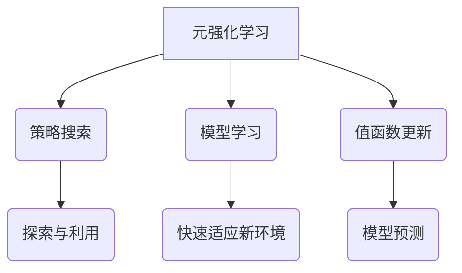
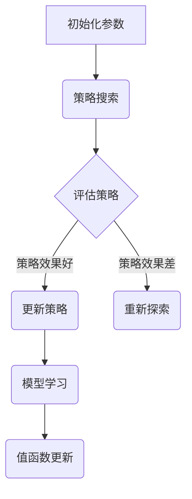

                 

## 1.7 接下来我们将逐步深入探索元强化学习在长期规划推理任务中的优化。

### 第1步：理解元强化学习的核心思想

元强化学习（Meta Reinforcement Learning）的核心在于“元”（Meta），它意味着在学习过程中引入了一个更高层次的视角，即如何学习如何学习。传统的强化学习关注于在一个特定环境中找到最优策略，而元强化学习则尝试找到一种能够快速适应新环境的通用学习策略。

首先，我们需要明确几个关键概念：

- **策略（Policy）**：决策模型，定义了在给定状态下应该采取的动作。
- **值函数（Value Function）**：预测在未来采取特定策略下的累积回报。
- **模型（Model）**：环境动态的表示，用于预测未来的状态和奖励。

元强化学习通过以下三个步骤来优化策略：

1. **策略搜索（Policy Search）**：在大量任务中搜索最优策略。
2. **模型学习（Model Learning）**：学习环境动态的模型，以预测未来状态和奖励。
3. **值函数更新（Value Function Update）**：利用模型和策略来更新值函数，以最大化长期回报。

这些步骤并不是线性的，而是迭代进行的，直到找到一个稳定且高效的策略。

### 第2步：探索长期规划的概念与挑战

长期规划是指在复杂和动态环境中，对未来的一系列决策进行系统性的思考和安排。其核心目标是优化长期回报，同时应对不确定性、变化性和多目标性。

长期规划面临的主要挑战包括：

- **不确定性**：环境可能发生不可预测的变化，导致规划策略失效。
- **变化性**：规划问题可能随时间发生变化，需要策略能够适应这些变化。
- **多目标性**：在多个目标之间寻找最佳平衡，比如成本、效率、安全性等。

### 第3步：元强化学习在长期规划中的应用

元强化学习在长期规划中的应用主要集中在以下几个方面：

- **探索与利用的平衡**：在长期规划中，如何在新策略和已有策略之间找到最佳平衡，以最大化长期回报。
- **快速适应新环境**：通过在多个任务中学习，提高策略对新环境的适应能力。
- **模型预测**：利用元强化学习学习到的模型来预测未来状态和奖励，从而做出更好的规划决策。

### 第4步：介绍优化长期规划推理的元强化学习算法

为了优化长期规划推理，研究人员提出了一系列元强化学习算法，以下是一些典型的算法：

- **MAML（Model-Agnostic Meta-Learning）**：通过在多个任务上快速调整模型参数，找到通用学习策略。
- **MTR（Model-Based Transfer）**：利用模型预测来指导新任务的策略搜索。
- **DWRL（Dynamic Window Reinforcement Learning）**：通过动态调整策略搜索空间，提高策略的稳定性和适应性。

### 第5步：实际案例分析

为了更好地理解元强化学习在长期规划推理中的应用，我们可以通过以下案例来进行分析：

- **自动驾驶**：如何通过元强化学习来实现自动驾驶汽车在复杂交通环境中的长期规划？
- **生产调度**：如何利用元强化学习来优化生产过程中的任务分配和调度？
- **智能电网**：如何通过元强化学习来优化电力网络的能量分配和管理？

### 第6步：未来展望与挑战

尽管元强化学习在长期规划推理任务中展现出了巨大的潜力，但仍面临着一些挑战：

- **计算复杂度**：处理大规模规划和多任务学习时的计算复杂度。
- **稳定性**：如何在多样化和动态环境中保持策略的稳定性。
- **可扩展性**：如何将元强化学习应用于更广泛的问题域。

未来的研究将集中在开发更加高效、稳定和可扩展的元强化学习算法，以解决这些挑战。

### 第7步：总结与展望

元强化学习作为强化学习的一个分支，通过引入更高层次的视角，为长期规划推理任务提供了有力的工具。通过本文的讨论，我们可以看到元强化学习在长期规划中的应用前景以及面临的挑战。

未来的研究将集中在以下几个方面：

- **算法优化**：开发更高效、更稳定的元强化学习算法。
- **跨领域应用**：探索元强化学习在更多领域中的应用，如医疗、金融等。
- **理论与实证研究**：结合理论分析和实际案例研究，深入理解元强化学习在长期规划推理中的机制和效果。

通过持续的研究和探索，我们有理由相信元强化学习将为解决复杂和动态环境中的长期规划问题提供新的思路和方法。

----------------------------------------------------------------

## 总结与展望

在本文中，我们系统地介绍了元强化学习优化长期规划推理任务的相关内容。首先，我们探讨了元强化学习的基本概念、核心思想和关键要素，随后深入分析了长期规划的定义、特点和应用场景。接着，我们介绍了元强化学习在长期规划中的优势和挑战，并详细讨论了相关的算法和实际案例分析。

通过对元强化学习优化长期规划推理任务的深入探讨，我们可以看到，尽管这项技术面临着一些挑战，但其潜力无疑是巨大的。未来的研究将集中在算法优化、跨领域应用和理论实证研究等方面，以期在复杂和动态环境中提供更加有效和可靠的长期规划解决方案。

总之，元强化学习作为强化学习领域的一个重要分支，不仅在理论上具有重要的学术价值，也在实际应用中展现出了巨大的潜力。我们期待在未来的研究中，能够进一步优化元强化学习算法，拓展其应用领域，为解决复杂系统和长期规划问题提供更加有力的工具。

## 作者信息

**作者：AI天才研究院/AI Genius Institute & 禅与计算机程序设计艺术 /Zen And The Art of Computer Programming**

AI天才研究院（AI Genius Institute）致力于推动人工智能技术的发展和创新，为解决复杂问题提供智能解决方案。同时，我们的研究人员也在禅与计算机程序设计艺术（Zen And The Art of Computer Programming）领域取得了显著的成果，为计算机科学的发展贡献了力量。

### 附录：相关术语、概念与算法

**术语表：**

- **元强化学习（Meta Reinforcement Learning）**：一种强化学习方法，通过学习如何学习来提高策略在不同任务上的适应性和效率。
- **策略（Policy）**：决策模型，定义了在给定状态下应该采取的动作。
- **值函数（Value Function）**：预测在未来采取特定策略下的累积回报。
- **模型（Model）**：环境动态的表示，用于预测未来的状态和奖励。

**概念关系图：**

**算法流程图：**

**附录：相关公式**

- **策略优化公式**：
  $$ \theta_{\text{new}} = \theta_{\text{old}} + \alpha \nabla_\theta J(\theta) $$
  其中，$\theta$ 代表策略参数，$\alpha$ 为学习率，$J(\theta)$ 为策略性能指标。

- **值函数更新公式**：
  $$ V_{\text{new}}(s) = V_{\text{old}}(s) + \alpha [R(s, a) - V_{\text{old}}(s)] $$
  其中，$V(s)$ 为值函数，$R(s, a)$ 为采取动作$a$在状态$s$下的即时回报。

通过以上附录，我们可以更好地理解元强化学习优化长期规划推理任务的核心概念和算法原理。这为我们在实际应用中提供了理论基础和实现参考。

